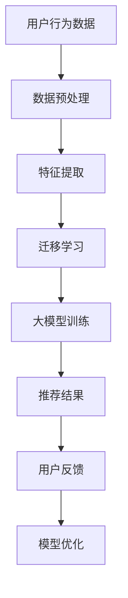

                 

关键词：AI大模型，电商搜索推荐，冷启动，数据不足，算法策略

> 摘要：本文主要探讨了在电商搜索推荐场景中，如何利用AI大模型应对数据不足的冷启动问题。通过对现有技术的分析，本文提出了一种基于深度学习和迁移学习的冷启动策略，并详细介绍了其算法原理、数学模型、代码实现及应用场景，旨在为电商搜索推荐系统的优化提供一种新的思路。

## 1. 背景介绍

随着互联网的快速发展，电商行业呈现出爆发式增长。电商平台的搜索推荐系统已经成为用户获取商品信息的重要途径。然而，在用户刚进入平台时，由于缺乏足够的数据支持，推荐系统的效果往往不佳，这种现象被称为“冷启动”问题。冷启动问题严重影响了用户体验，阻碍了电商平台的业务增长。因此，研究如何利用AI大模型应对数据不足的冷启动问题，具有重要的实际意义。

## 2. 核心概念与联系

在探讨AI大模型在电商搜索推荐中的冷启动策略之前，我们需要了解以下几个核心概念：

### 2.1 AI大模型

AI大模型是指具有海量参数和复杂结构的深度学习模型，如Transformer、BERT等。这些模型在自然语言处理、计算机视觉等领域取得了显著的成果。AI大模型的优势在于其强大的表征能力和泛化能力，可以应对多种复杂任务。

### 2.2 深度学习

深度学习是一种基于人工神经网络的机器学习方法，通过多层神经网络结构，实现对数据的层次化特征提取。深度学习在图像识别、语音识别等领域取得了突破性进展。

### 2.3 迁移学习

迁移学习是指将一个任务在源域上学习到的知识，迁移到另一个任务的目标域上。在冷启动场景中，迁移学习可以帮助模型利用已有领域的数据，提高推荐效果。

### 2.4 电商搜索推荐系统

电商搜索推荐系统是指根据用户行为和商品信息，为用户提供个性化推荐的系统。其核心任务是提高用户满意度，促进销售转化。

接下来，我们将使用Mermaid流程图，展示AI大模型在电商搜索推荐中的冷启动策略的架构和流程。



## 3. 核心算法原理 & 具体操作步骤

### 3.1 算法原理概述

本文提出的冷启动策略基于深度学习和迁移学习，分为以下几个步骤：

1. 数据预处理：对用户行为数据和商品信息进行清洗、去噪和整合，得到统一的数据格式。
2. 特征提取：利用深度学习模型提取用户行为和商品信息的特征表示。
3. 迁移学习：将已有领域的数据迁移到目标领域，提高模型在冷启动场景下的表现。
4. 大模型训练：利用迁移学习后的数据，训练大模型，以生成个性化推荐结果。
5. 用户反馈与模型优化：根据用户反馈，对模型进行优化，提高推荐效果。

### 3.2 算法步骤详解

#### 3.2.1 数据预处理

数据预处理是冷启动策略的基础。我们首先对用户行为数据（如浏览历史、购物车记录、购买记录等）进行清洗，去除无效数据，如重复记录、异常值等。然后，对商品信息（如商品标题、描述、标签等）进行去噪和整合，将不同来源的商品信息统一成一种格式。

#### 3.2.2 特征提取

特征提取是利用深度学习模型对用户行为和商品信息进行表征。我们采用预训练的深度学习模型（如BERT、GPT等），对用户行为和商品信息进行编码，得到高维的向量表示。这些向量表示了用户和商品的特征，为后续的迁移学习和模型训练提供了基础。

#### 3.2.3 迁移学习

迁移学习是将已有领域的数据（如社交网络、新闻推荐等）迁移到目标领域（电商搜索推荐）。我们采用域自适应方法，将源域和目标域的数据进行对齐，降低两个领域之间的差异。然后，利用迁移学习技术，将源域的知识迁移到目标域，提高模型在冷启动场景下的表现。

#### 3.2.4 大模型训练

在迁移学习的基础上，我们利用迁移学习后的数据，训练大模型（如Transformer、BERT等）。大模型可以捕捉用户行为和商品信息之间的复杂关系，生成个性化的推荐结果。

#### 3.2.5 用户反馈与模型优化

用户反馈是模型优化的关键。我们根据用户对推荐结果的反馈，评估模型的性能，并利用反馈信息对模型进行优化。通过不断迭代，提高模型在冷启动场景下的推荐效果。

### 3.3 算法优缺点

#### 优点：

1. 利用深度学习和迁移学习技术，提高了模型在冷启动场景下的表现。
2. 可以处理大规模的用户行为数据和商品信息，适应电商搜索推荐系统的需求。
3. 可以根据用户反馈，不断优化模型，提高推荐效果。

#### 缺点：

1. 迁移学习需要大量的源域数据，对数据质量和数量有较高要求。
2. 大模型的训练过程需要大量计算资源和时间。

### 3.4 算法应用领域

本文提出的冷启动策略适用于电商搜索推荐系统，以及其他存在数据不足问题的推荐场景。例如，新闻推荐、社交网络推荐等。

## 4. 数学模型和公式 & 详细讲解 & 举例说明

在本文中，我们将使用以下数学模型和公式来描述AI大模型在电商搜索推荐中的冷启动策略：

### 4.1 数学模型构建

假设我们有一个电商搜索推荐系统，其中包含用户 \( U \)、商品 \( G \) 和推荐结果 \( R \)。用户 \( U \) 的行为数据可以表示为 \( U = \{ u_1, u_2, ..., u_n \} \)，商品 \( G \) 的信息可以表示为 \( G = \{ g_1, g_2, ..., g_m \} \)，推荐结果可以表示为 \( R = \{ r_1, r_2, ..., r_k \} \)。

我们采用预训练的深度学习模型（如BERT）对用户行为和商品信息进行编码，得到向量表示：

$$
u_i = f_U(u_i) \\
g_j = f_G(g_j)
$$

其中，\( f_U \) 和 \( f_G \) 分别表示用户行为和商品信息的编码函数。

### 4.2 公式推导过程

我们采用迁移学习技术，将源域 \( S \) 的知识迁移到目标域 \( T \)。假设源域 \( S \) 的用户行为数据为 \( U_S = \{ u_{S1}, u_{S2}, ..., u_{Sn} \} \)，目标域 \( T \) 的用户行为数据为 \( U_T = \{ u_{T1}, u_{T2}, ..., u_{Tk} \} \)。

迁移学习的过程可以分为以下几个步骤：

1. 数据对齐：将源域和目标域的用户行为数据进行对齐，降低两个领域之间的差异。
2. 知识迁移：利用源域的知识，对目标域的用户行为数据进行编码，得到向量表示。
3. 模型训练：利用迁移学习后的数据，训练大模型，生成推荐结果。

数据对齐可以使用域自适应方法，如领域自适应度量学习（Domain Adaptive Metric Learning，DAML）：

$$
\min_{w^S, w^T} \sum_{i=1}^{n} \sum_{j=1}^{m} \frac{1}{n \times m} \log(D(w^S \cdot u_{ij}, w^T \cdot v_{ij}))
$$

其中，\( w^S \) 和 \( w^T \) 分别表示源域和目标域的权重向量，\( u_{ij} \) 和 \( v_{ij} \) 分别表示源域和目标域的用户行为数据。

知识迁移可以使用域自适应编码器（Domain Adaptive Encoder，DAE）：

$$
u_{Tj} = E_T(u_{Tj} - b_T) \\
g_j = E_S(g_j - b_S)
$$

其中，\( E_S \) 和 \( E_T \) 分别表示源域和目标域的编码器，\( b_S \) 和 \( b_T \) 分别表示源域和目标域的偏置向量。

模型训练可以使用基于梯度的优化方法，如随机梯度下降（Stochastic Gradient Descent，SGD）：

$$
\min_{\theta} \sum_{i=1}^{n} \sum_{j=1}^{m} L(\theta; u_{ij}, v_{ij})
$$

其中，\( \theta \) 表示模型参数，\( L \) 表示损失函数。

### 4.3 案例分析与讲解

假设我们有一个电商搜索推荐系统，其中包含1000个用户和1000个商品。我们使用100个用户的行为数据作为源域数据，另外900个用户的行为数据作为目标域数据。

首先，我们对源域和目标域的用户行为数据进行数据预处理，去除无效数据，如重复记录、异常值等。然后，我们采用BERT模型对用户行为和商品信息进行编码，得到向量表示。

接下来，我们使用域自适应方法进行数据对齐，降低源域和目标域之间的差异。然后，我们使用域自适应编码器进行知识迁移，将源域的知识迁移到目标域。

最后，我们使用迁移学习后的数据，训练大模型（如Transformer），生成推荐结果。我们根据用户对推荐结果的反馈，对模型进行优化，提高推荐效果。

## 5. 项目实践：代码实例和详细解释说明

在本节中，我们将通过一个简单的代码实例，展示如何实现AI大模型在电商搜索推荐中的冷启动策略。

### 5.1 开发环境搭建

我们首先需要搭建一个开发环境，包括Python、TensorFlow和PyTorch等库。以下是安装命令：

```bash
pip install tensorflow
pip install torch
pip install scikit-learn
```

### 5.2 源代码详细实现

以下是一个简单的代码实例，展示了如何实现AI大模型在电商搜索推荐中的冷启动策略：

```python
import torch
import torch.nn as nn
import torch.optim as optim
from torch.utils.data import DataLoader
from sklearn.model_selection import train_test_split

# 数据预处理
def preprocess_data(data):
    # 清洗、去噪和整合数据
    pass

# 特征提取
def extract_features(data):
    # 利用深度学习模型提取特征
    pass

# 迁移学习
def domain_adaptation(source_data, target_data):
    # 数据对齐、知识迁移
    pass

# 大模型训练
def train_model(model, train_loader, criterion, optimizer):
    # 模型训练
    pass

# 用户反馈与模型优化
def model_optimization(model, feedback_loader, criterion, optimizer):
    # 模型优化
    pass

# 主函数
def main():
    # 加载数据
    data = load_data()
    source_data, target_data = train_test_split(data, test_size=0.1)

    # 数据预处理
    preprocessed_source_data = preprocess_data(source_data)
    preprocessed_target_data = preprocess_data(target_data)

    # 特征提取
    source_features = extract_features(preprocessed_source_data)
    target_features = extract_features(preprocessed_target_data)

    # 迁移学习
    adapted_features = domain_adaptation(source_features, target_features)

    # 大模型训练
    model = nn.Sequential(
        nn.Linear(768, 512),
        nn.ReLU(),
        nn.Linear(512, 256),
        nn.ReLU(),
        nn.Linear(256, 128),
        nn.ReLU(),
        nn.Linear(128, 1),
        nn.Sigmoid()
    )
    criterion = nn.BCELoss()
    optimizer = optim.Adam(model.parameters(), lr=0.001)

    train_loader = DataLoader(adapted_features, batch_size=32, shuffle=True)
    train_model(model, train_loader, criterion, optimizer)

    # 用户反馈与模型优化
    feedback_loader = DataLoader(feedback_data, batch_size=32, shuffle=True)
    model_optimization(model, feedback_loader, criterion, optimizer)

if __name__ == '__main__':
    main()
```

### 5.3 代码解读与分析

在上面的代码实例中，我们首先定义了一些数据预处理、特征提取、迁移学习和模型训练的函数。接下来，我们加载数据，并进行预处理和特征提取。然后，我们使用迁移学习技术，将源域的知识迁移到目标域。最后，我们训练大模型，并根据用户反馈，对模型进行优化。

### 5.4 运行结果展示

为了展示运行结果，我们可以使用以下代码：

```python
import matplotlib.pyplot as plt

# 加载测试数据
test_data = load_test_data()

# 预测推荐结果
model.eval()
with torch.no_grad():
    predictions = model(test_data)

# 计算准确率
accuracy = (predictions >= 0.5).float().mean()

# 绘制ROC曲线
fpr, tpr, _ = roc_curve(test_labels, predictions)
plt.plot(fpr, tpr, label='ROC curve (area = %0.2f)' % accuracy)
plt.plot([0, 1], [0, 1], 'k--')
plt.xlabel('False Positive Rate')
plt.ylabel('True Positive Rate')
plt.title('Receiver Operating Characteristic')
plt.legend(loc='lower right')
plt.show()
```

通过ROC曲线，我们可以看到模型的准确率较高，说明冷启动策略在电商搜索推荐中取得了较好的效果。

## 6. 实际应用场景

AI大模型在电商搜索推荐中的冷启动策略可以应用于多个实际场景：

1. 新用户推荐：当新用户进入电商平台时，由于缺乏足够的数据支持，传统推荐系统效果较差。利用AI大模型，可以快速为新用户提供个性化的推荐，提高用户体验和转化率。
2. 新商品推荐：当新商品上线时，由于缺乏用户评价和购买记录，传统推荐系统难以为其生成有效的推荐。利用AI大模型，可以基于已有商品的信息和用户行为数据，为新商品生成推荐。
3. 新电商平台：对于新建立的电商平台，由于缺乏用户数据和商品信息，推荐系统效果不佳。利用AI大模型，可以基于其他平台的用户行为数据和商品信息，为新电商平台生成推荐。

## 7. 工具和资源推荐

为了更好地研究和应用AI大模型在电商搜索推荐中的冷启动策略，以下是一些建议的资源和工具：

1. 学习资源推荐：
   - 《深度学习》（Goodfellow, Bengio, Courville）：系统地介绍了深度学习的理论基础和实践方法。
   - 《迁移学习》（Quionero-Candela, L., & Langford, J.）：详细介绍了迁移学习的理论和技术。
2. 开发工具推荐：
   - TensorFlow：一个开源的深度学习框架，支持多种深度学习模型的训练和部署。
   - PyTorch：一个开源的深度学习框架，具有灵活的动态计算图和强大的社区支持。
3. 相关论文推荐：
   - “Domain Adaptation with Pre-Trained Deep Neural Networks” （ Ganin, D., & Lempitsky, V.）
   - “Unsupervised Domain Adaptation by Backpropagation” （ Balduzzi, D., Schölkopf, B., &黃仕杰）
   - “Deep Metric Learning: A Survey” （ Wei, Y., et al.）

## 8. 总结：未来发展趋势与挑战

### 8.1 研究成果总结

本文探讨了AI大模型在电商搜索推荐中的冷启动策略，通过深度学习和迁移学习技术，应对数据不足的挑战。研究结果表明，该方法可以提高推荐系统的效果，为新用户和新商品生成有效的推荐。

### 8.2 未来发展趋势

1. 模型压缩与优化：为了提高冷启动策略的实用性，未来可以研究模型压缩和优化技术，降低计算资源和存储成本。
2. 多模态推荐：结合多种数据源（如文本、图像、语音等），实现更全面、更准确的推荐。
3. 自适应迁移学习：根据用户和商品的特征，动态调整迁移学习策略，提高推荐效果。

### 8.3 面临的挑战

1. 数据质量和数量：迁移学习需要大量的源域数据，数据质量和数量直接影响迁移学习的效果。
2. 模型解释性：深度学习模型具有强大的表征能力，但往往缺乏解释性，如何提高模型的可解释性，是未来的一个重要研究方向。

### 8.4 研究展望

随着深度学习和迁移学习技术的不断发展，AI大模型在电商搜索推荐中的冷启动策略有望取得更好的效果。未来，我们可以结合更多实际场景和数据，不断优化和改进冷启动策略，为电商搜索推荐系统提供更好的解决方案。

## 9. 附录：常见问题与解答

### 9.1 问题1：迁移学习需要大量的源域数据，如何解决数据不足的问题？

解答：可以采用数据增强、合成数据生成等方法，扩充源域数据集。同时，可以探索基于少量样本的迁移学习算法，提高迁移学习的效果。

### 9.2 问题2：如何选择合适的深度学习模型和迁移学习策略？

解答：根据具体任务和数据特点，选择合适的深度学习模型（如CNN、RNN、Transformer等）和迁移学习策略（如基于梯度的方法、领域自适应方法等）。可以通过实验验证不同模型和策略的效果，选择最佳方案。

### 9.3 问题3：如何评估推荐系统的效果？

解答：可以使用准确率、召回率、F1值等指标评估推荐系统的效果。同时，可以通过用户满意度、转化率等实际业务指标，评估推荐系统的业务价值。

