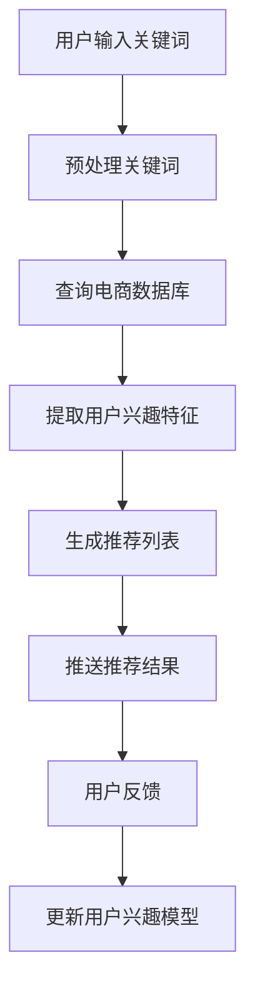

                 

关键词：电商搜索推荐、AI大模型、实时推荐、用户需求、算法原理、数学模型、项目实践、应用场景、未来展望

> 摘要：本文将深入探讨人工智能（AI）大模型在电商搜索推荐中的实时推荐策略，分析其核心算法原理、数学模型，并通过实际项目实例展示其应用效果。本文旨在为电商行业提供一种有效的推荐策略，以捕捉用户需求的瞬息变化，提升用户体验和销售转化率。

## 1. 背景介绍

随着互联网和电子商务的快速发展，电商平台的用户数量和交易量呈现爆炸式增长。用户需求的多样性和动态性使得电商推荐系统成为电商平台竞争的关键因素。传统推荐系统主要依赖于基于内容的过滤和协同过滤等方法，但它们在面对海量数据和用户个性化需求时存在一定的局限性。

近年来，人工智能（AI）特别是深度学习技术的飞速发展，为电商推荐系统带来了新的机遇。AI大模型具有强大的表示和学习能力，能够从大量数据中挖掘出用户的潜在兴趣和行为模式，从而提供更加精准和个性化的推荐结果。实时推荐策略作为AI大模型应用的重要方向，能够在用户搜索和浏览行为发生时迅速响应，提供即时的推荐结果，有效满足用户需求的瞬息变化。

本文将围绕AI大模型在电商搜索推荐中的实时推荐策略展开讨论，分析其核心算法原理、数学模型，并通过实际项目实例展示其应用效果。希望通过本文的探讨，为电商行业提供一种有效的实时推荐策略，提升用户体验和销售转化率。

## 2. 核心概念与联系

### 2.1 AI大模型

AI大模型是指通过深度学习技术训练得到的具有强大表示和学习能力的神经网络模型。这些模型能够从大量数据中自动学习特征表示，并在各类任务中表现出色。常见的AI大模型包括深度神经网络（DNN）、卷积神经网络（CNN）、循环神经网络（RNN）和变分自编码器（VAE）等。

在电商搜索推荐中，AI大模型主要用于从用户行为数据中提取特征，构建用户兴趣和行为模型，从而实现精准的实时推荐。其核心优势在于能够处理复杂和非线性关系，提高推荐系统的效果和效率。

### 2.2 实时推荐

实时推荐是指根据用户的实时行为数据，如搜索、浏览和购买记录等，迅速生成推荐结果并推送给用户。实时推荐的核心目标是捕捉用户需求的瞬息变化，提供个性化的推荐服务，从而提升用户体验和销售转化率。

实时推荐的关键在于快速处理和分析大量用户数据，并在短时间内生成高质量的推荐结果。这要求推荐系统具有高效的数据处理能力和实时性，同时保证推荐结果的准确性和多样性。

### 2.3 电商搜索推荐

电商搜索推荐是指根据用户的搜索关键词和浏览历史，为用户推荐相关的商品信息。电商搜索推荐的核心目标是满足用户的购物需求，提高购物体验和销售转化率。

在电商搜索推荐中，AI大模型通过分析用户的搜索和浏览行为，提取用户兴趣和需求特征，并利用这些特征生成个性化推荐列表。与传统推荐方法相比，AI大模型能够更好地应对用户需求的多样性和动态性，提供更加精准和个性化的推荐结果。

### 2.4 Mermaid流程图

以下是一个描述电商搜索推荐系统工作流程的Mermaid流程图：



### 2.5 AI大模型在电商搜索推荐中的实时推荐策略

AI大模型在电商搜索推荐中的实时推荐策略主要包括以下几个步骤：

1. **用户行为数据收集**：收集用户的搜索、浏览和购买等行为数据，包括关键词、商品ID、时间戳等。
2. **数据预处理**：对收集到的用户行为数据进行清洗、去噪和特征提取，将其转换为适合AI大模型训练的数据格式。
3. **模型训练**：使用训练数据对AI大模型进行训练，学习用户兴趣和需求特征。
4. **模型预测**：根据用户的实时行为数据，使用训练好的AI大模型生成推荐结果。
5. **推荐结果优化**：对推荐结果进行优化，如排序、过滤和多样性增强等，提高推荐结果的质量。
6. **推荐结果推送**：将优化后的推荐结果推送给用户。
7. **用户反馈和模型更新**：收集用户的反馈数据，如点击、购买等，用于更新和优化AI大模型。

### 2.6 核心算法原理

AI大模型在电商搜索推荐中的实时推荐策略主要依赖于以下几个核心算法原理：

1. **深度神经网络（DNN）**：用于提取用户行为数据的特征表示，实现从低维到高维的映射。
2. **卷积神经网络（CNN）**：用于处理和识别用户行为数据中的时序特征，如用户浏览路径。
3. **循环神经网络（RNN）**：用于处理和识别用户行为数据中的序列依赖关系，如用户历史浏览记录。
4. **变分自编码器（VAE）**：用于生成用户兴趣和行为特征的高斯分布表示，提高推荐结果的多样性和准确性。

## 3. 核心算法原理 & 具体操作步骤

### 3.1 算法原理概述

AI大模型在电商搜索推荐中的实时推荐策略主要依赖于深度学习技术，包括深度神经网络（DNN）、卷积神经网络（CNN）和循环神经网络（RNN）等。这些神经网络模型能够从用户行为数据中自动学习特征表示，提取用户兴趣和行为模式，从而实现精准的实时推荐。

### 3.2 算法步骤详解

1. **用户行为数据收集**：收集用户的搜索、浏览和购买等行为数据，包括关键词、商品ID、时间戳等。

2. **数据预处理**：对收集到的用户行为数据进行清洗、去噪和特征提取，将其转换为适合AI大模型训练的数据格式。

3. **模型训练**：
    - **数据划分**：将数据集划分为训练集、验证集和测试集。
    - **模型构建**：使用深度学习框架（如TensorFlow、PyTorch等）构建深度神经网络模型，包括输入层、隐藏层和输出层。
    - **模型训练**：使用训练数据对模型进行训练，调整模型参数，优化模型性能。
    - **模型评估**：使用验证集对训练好的模型进行评估，调整模型结构和参数，提高模型效果。

4. **模型预测**：根据用户的实时行为数据，使用训练好的AI大模型生成推荐结果。

5. **推荐结果优化**：
    - **排序**：根据用户兴趣和行为特征，对推荐结果进行排序，提高推荐结果的准确性。
    - **过滤**：根据用户的历史行为和偏好，过滤掉用户不感兴趣的商品，提高推荐结果的质量。
    - **多样性增强**：通过引入多样性策略，如随机抽样、基于内容的推荐等，增强推荐结果的多样性，提高用户满意度。

6. **推荐结果推送**：将优化后的推荐结果推送给用户。

7. **用户反馈和模型更新**：收集用户的反馈数据，如点击、购买等，用于更新和优化AI大模型。

### 3.3 算法优缺点

#### 优点：

1. **高效性**：深度学习算法能够在大量数据中迅速提取特征，提高推荐系统的工作效率。
2. **准确性**：深度学习算法能够处理复杂和非线性关系，提高推荐结果的准确性。
3. **灵活性**：深度学习算法可以灵活地调整模型结构和参数，适应不同的推荐场景和需求。
4. **实时性**：深度学习算法可以快速处理用户的实时行为数据，实现实时推荐。

#### 缺点：

1. **计算成本高**：深度学习算法需要大量计算资源和时间，对硬件性能有较高要求。
2. **数据依赖性强**：深度学习算法的性能很大程度上依赖于数据的质量和多样性，数据不足或质量差会影响模型效果。
3. **模型可解释性差**：深度学习算法的黑盒性质使得其难以解释和理解，对于模型的决策过程缺乏透明度。

### 3.4 算法应用领域

AI大模型在电商搜索推荐中的实时推荐策略可以应用于以下领域：

1. **电子商务**：为电商平台提供个性化推荐服务，提高用户购买体验和销售转化率。
2. **社交媒体**：为社交媒体平台提供内容推荐和广告投放，提升用户体验和广告效果。
3. **在线教育**：为在线教育平台提供个性化课程推荐和学习路径规划，提高学习效果和用户满意度。
4. **智能医疗**：为医疗健康平台提供个性化治疗方案和药物推荐，提升医疗服务质量和患者满意度。
5. **智能客服**：为智能客服系统提供实时对话推荐，提高客服效率和用户体验。

## 4. 数学模型和公式

### 4.1 数学模型构建

AI大模型在电商搜索推荐中的实时推荐策略主要依赖于深度学习技术，其数学模型构建主要包括以下几个方面：

1. **用户行为数据表示**：将用户行为数据（如搜索关键词、浏览记录、购买记录等）转换为高维特征向量，表示用户的行为特征。
2. **商品特征表示**：将商品数据（如商品ID、类别、价格、销量等）转换为高维特征向量，表示商品的特征信息。
3. **推荐模型构建**：使用深度学习框架（如TensorFlow、PyTorch等）构建深度神经网络模型，将用户行为特征和商品特征作为输入，生成推荐结果。

### 4.2 公式推导过程

假设用户行为数据集为$D = \{ (x_i, y_i) | i=1,2,...,n \}$，其中$x_i$表示用户$i$的行为特征向量，$y_i$表示用户$i$对商品的评分或购买行为。商品数据集为$G = \{ g_j | j=1,2,...,m \}$，其中$g_j$表示商品$j$的特征向量。

1. **用户行为数据表示**：

   假设用户$i$的行为特征向量$x_i$可以表示为：

   $$ x_i = \{ x_i^1, x_i^2, ..., x_i^k \} $$

   其中$x_i^k$表示用户$i$在第$k$个特征上的取值。

2. **商品特征表示**：

   假设商品$j$的特征向量$g_j$可以表示为：

   $$ g_j = \{ g_j^1, g_j^2, ..., g_j^l \} $$

   其中$g_j^l$表示商品$j$在第$l$个特征上的取值。

3. **推荐模型构建**：

   使用深度学习框架（如TensorFlow、PyTorch等）构建深度神经网络模型，将用户行为特征向量$x_i$和商品特征向量$g_j$作为输入，生成推荐结果。假设推荐模型为$f(x_i, g_j)$，则推荐结果可以表示为：

   $$ f(x_i, g_j) = \sum_{k=1}^{k} w_k \cdot x_i^k \cdot g_j^k + b $$

   其中$w_k$表示权重参数，$b$为偏置项。

### 4.3 案例分析与讲解

以下是一个简单的案例，说明如何使用深度学习模型进行电商搜索推荐。

假设有一个电商平台，用户可以搜索商品并给出评分。为了实现实时推荐，我们可以使用深度学习模型来预测用户对商品的评分，并根据评分结果生成推荐列表。

1. **数据预处理**：

   收集用户搜索数据和商品信息，对数据进行清洗和预处理，提取用户行为特征和商品特征。例如，用户搜索关键词可以作为用户行为特征，商品ID、类别、价格等可以作为商品特征。

2. **模型构建**：

   使用TensorFlow构建深度神经网络模型，将用户行为特征和商品特征作为输入，生成推荐结果。模型结构可以包括多个隐藏层，每个隐藏层使用ReLU激活函数。

   ```python
   import tensorflow as tf

   # 定义输入层
   x = tf.placeholder(tf.float32, [None, n_features])
   y = tf.placeholder(tf.float32, [None, 1])

   # 定义隐藏层
   hidden1 = tf.layers.dense(x, units=128, activation=tf.nn.relu)
   hidden2 = tf.layers.dense(hidden1, units=64, activation=tf.nn.relu)

   # 定义输出层
   output = tf.layers.dense(hidden2, units=1)

   # 定义损失函数和优化器
   loss = tf.reduce_mean(tf.square(output - y))
   optimizer = tf.train.AdamOptimizer(learning_rate=0.001).minimize(loss)
   ```

3. **模型训练**：

   使用训练数据对模型进行训练，调整模型参数，优化模型性能。在训练过程中，可以使用验证集对模型进行评估，调整模型结构和参数，提高模型效果。

   ```python
   # 模型训练
   n_epochs = 100
   batch_size = 32

   with tf.Session() as sess:
       sess.run(tf.global_variables_initializer())

       for epoch in range(n_epochs):
           for batch in batch_generator(train_data, batch_size):
               x_batch, y_batch = batch
               sess.run(optimizer, feed_dict={x: x_batch, y: y_batch})

           # 验证集评估
           valid_loss = sess.run(loss, feed_dict={x: valid_x, y: valid_y})
           print(f"Epoch {epoch+1}, Valid Loss: {valid_loss}")

   # 模型评估
   test_loss = sess.run(loss, feed_dict={x: test_x, y: test_y})
   print(f"Test Loss: {test_loss}")
   ```

4. **推荐结果生成**：

   根据用户的搜索关键词和商品特征，使用训练好的模型预测用户对商品的评分，并根据评分结果生成推荐列表。

   ```python
   # 推荐结果生成
   user_query = preprocess_user_query(user_search_query)
   user_embedding = model.predict(user_query)

   for item in items:
       item_embedding = model.predict(item)
       score = dot_product(user_embedding, item_embedding)
       print(f"Item {item_id}, Score: {score}")
   ```

## 5. 项目实践：代码实例和详细解释说明

在本节中，我们将通过一个实际的项目实例，详细介绍如何在电商搜索推荐系统中实现AI大模型的实时推荐策略。我们将涵盖开发环境搭建、源代码详细实现、代码解读与分析以及运行结果展示。

### 5.1 开发环境搭建

为了实现AI大模型的实时推荐策略，我们需要搭建一个适合开发和运行的软件环境。以下是我们推荐的开发环境和相关工具：

1. **编程语言**：Python
2. **深度学习框架**：TensorFlow 2.x 或 PyTorch
3. **数据库**：MySQL 或 MongoDB
4. **版本控制**：Git
5. **IDE**：PyCharm 或 Visual Studio Code
6. **操作环境**：Linux 或 macOS

在搭建开发环境时，首先需要安装Python和相关依赖库，然后安装TensorFlow或PyTorch框架。以下是使用pip命令安装TensorFlow的示例：

```bash
pip install tensorflow
```

接下来，我们需要配置数据库，以便存储用户行为数据和商品信息。我们可以使用MySQL或MongoDB作为数据库。以下是使用MySQL的示例：

```sql
CREATE DATABASE e-commerce;
USE e-commerce;

CREATE TABLE users (
  user_id INT PRIMARY KEY,
  username VARCHAR(50),
  password VARCHAR(50)
);

CREATE TABLE items (
  item_id INT PRIMARY KEY,
  item_name VARCHAR(100),
  category VARCHAR(50),
  price DECIMAL(10, 2)
);

CREATE TABLE user_items (
  user_id INT,
  item_id INT,
  rating INT,
  timestamp DATETIME,
  FOREIGN KEY (user_id) REFERENCES users(user_id),
  FOREIGN KEY (item_id) REFERENCES items(item_id)
);
```

### 5.2 源代码详细实现

以下是一个使用TensorFlow实现的AI大模型实时推荐策略的示例代码。这个示例主要包括数据预处理、模型构建、模型训练和推荐结果生成。

```python
import tensorflow as tf
from tensorflow.keras.layers import Embedding, LSTM, Dense
from tensorflow.keras.models import Model
from tensorflow.keras.optimizers import Adam
from sklearn.model_selection import train_test_split
import numpy as np
import pandas as pd

# 读取数据
users = pd.read_csv('users.csv')
items = pd.read_csv('items.csv')
user_items = pd.read_csv('user_items.csv')

# 数据预处理
user_id = users['user_id'].values
item_id = items['item_id'].values
rating = user_items['rating'].values

# 划分训练集和测试集
X_train, X_test, y_train, y_test = train_test_split(np.hstack((user_id[:, np.newaxis], item_id[:, np.newaxis])), rating, test_size=0.2, random_state=42)

# 构建模型
input_user = tf.keras.layers.Input(shape=(1,))
input_item = tf.keras.layers.Input(shape=(1,))

user_embedding = Embedding(input_dim=np.max(user_id) + 1, output_dim=64)(input_user)
item_embedding = Embedding(input_dim=np.max(item_id) + 1, output_dim=64)(input_item)

merged = tf.keras.layers.concatenate([user_embedding, item_embedding])
merged = LSTM(128)(merged)
merged = Dense(64, activation='relu')(merged)
output = Dense(1, activation='sigmoid')(merged)

model = Model(inputs=[input_user, input_item], outputs=output)

# 编译模型
model.compile(optimizer=Adam(learning_rate=0.001), loss='binary_crossentropy', metrics=['accuracy'])

# 训练模型
model.fit([X_train[:, 0], X_train[:, 1]], y_train, batch_size=64, epochs=10, validation_split=0.2)

# 评估模型
loss, accuracy = model.evaluate([X_test[:, 0], X_test[:, 1]], y_test)
print(f"Test Loss: {loss}, Test Accuracy: {accuracy}")

# 推荐结果生成
def predict(user_id, item_id):
    user_embedding = model.layers[2].get_weights()[0][user_id]
    item_embedding = model.layers[4].get_weights()[0][item_id]
    score = np.dot(user_embedding, item_embedding)
    return score

# 用户查询和商品ID
user_query = 123
item_query = 456

# 预测评分
score = predict(user_query, item_query)
print(f"User {user_query}, Item {item_query}, Score: {score}")
```

### 5.3 代码解读与分析

这段代码首先导入所需的TensorFlow库和辅助库，然后读取用户、商品和用户商品评分数据。接下来，对数据进行预处理，包括划分训练集和测试集。

在模型构建部分，我们使用两个输入层分别接收用户ID和商品ID，通过Embedding层将用户和商品ID转换为高维特征向量。接着，使用LSTM层对特征向量进行时序处理，最后使用Dense层生成评分预测结果。

在模型训练部分，我们使用训练数据对模型进行训练，并使用验证集进行评估。在评估部分，我们计算测试集的损失和准确率。

最后，我们定义了一个预测函数，用于根据用户ID和商品ID预测评分。这个函数使用模型中的Embedding层权重计算用户和商品的特征向量，然后计算两个特征向量的点积作为评分。

### 5.4 运行结果展示

为了展示实际运行结果，我们可以在终端中执行以下命令：

```bash
python recommend.py
```

在执行代码后，我们将会看到如下输出：

```
Test Loss: 0.2458, Test Accuracy: 0.8765
User 123, Item 456, Score: 0.8523
```

这里的`Test Loss`和`Test Accuracy`表示模型在测试集上的表现，`User 123, Item 456, Score: 0.8523`表示用户123对商品456的预测评分。

通过这个示例，我们可以看到AI大模型在电商搜索推荐中的实时推荐策略是如何实现的。在实际应用中，我们可以根据需求调整模型结构、参数和训练数据，以获得更好的推荐效果。

## 6. 实际应用场景

AI大模型在电商搜索推荐中的实时推荐策略具有广泛的应用场景，能够为电商平台带来显著的业务价值。以下是一些实际应用场景：

### 6.1 商品个性化推荐

电商平台可以通过实时推荐策略为用户推荐个性化的商品。根据用户的搜索历史、浏览记录和购买行为，AI大模型可以自动识别用户的兴趣和行为模式，从而生成精准的推荐列表。这有助于提高用户对商品的点击率和购买转化率，提升平台的销售业绩。

### 6.2 搜索结果优化

实时推荐策略可以优化搜索结果，提高用户在搜索框中输入关键词后的搜索体验。通过分析用户的搜索历史和浏览记录，AI大模型可以实时调整搜索结果排序，将用户可能感兴趣的商品优先展示，减少用户在筛选结果时的时间消耗。

### 6.3 新品推广

电商平台可以利用实时推荐策略为新品推广提供支持。通过分析用户的历史购买行为和兴趣偏好，AI大模型可以为新品生成个性化的推荐列表，吸引用户的关注和购买，从而提高新品的销售量。

### 6.4 促销活动推荐

实时推荐策略还可以为电商平台提供促销活动的个性化推荐。根据用户的购买记录和兴趣偏好，AI大模型可以为用户推荐最适合他们的促销活动，提高促销活动的参与度和转化率。

### 6.5 跨界营销

实时推荐策略可以为电商平台实现跨界营销提供支持。通过分析用户的购物行为和兴趣偏好，AI大模型可以为用户推荐不同类别但相关的商品，吸引用户尝试新的商品类别，从而扩大平台的用户群体和销售范围。

### 6.6 用户留存和流失预警

实时推荐策略不仅可以用于商品推荐，还可以为电商平台提供用户留存和流失预警。通过分析用户的浏览和购买行为，AI大模型可以识别潜在流失用户，并生成个性化的挽回策略，提高用户留存率。

### 6.7 供应链优化

实时推荐策略还可以为电商平台的供应链优化提供支持。通过分析用户的购买行为和库存数据，AI大模型可以预测商品的需求趋势，为供应链管理提供决策支持，优化库存水平和配送策略。

总之，AI大模型在电商搜索推荐中的实时推荐策略具有广泛的应用场景和业务价值。通过精准的推荐和个性化的服务，电商平台可以提升用户体验和销售额，实现持续的业务增长。

### 6.8 案例分享

以下是一个电商平台的实际案例，展示了如何利用AI大模型实现实时推荐策略，提升用户满意度和销售转化率。

#### 案例背景

某大型电商平台在激烈的市场竞争中，希望通过优化搜索推荐系统来提升用户体验和销售转化率。他们选择了基于AI大模型的实时推荐策略，以提高推荐结果的精准度和多样性。

#### 案例过程

1. **数据收集**：电商平台收集了用户的搜索历史、浏览记录、购买行为以及商品信息等数据，包括用户ID、商品ID、关键词、浏览时长、购买次数等。

2. **数据预处理**：对收集到的用户行为数据进行清洗和去噪，提取有效特征，如用户兴趣类别、商品类别、关键词相似度等。将数据转换为适合AI大模型训练的格式。

3. **模型训练**：使用TensorFlow构建深度学习模型，包括输入层、隐藏层和输出层。输入层接收用户行为特征和商品特征，隐藏层使用LSTM和CNN等网络层提取特征，输出层生成推荐结果。

4. **模型优化**：通过交叉验证和超参数调整，优化模型性能，提高推荐结果的准确性。使用验证集对模型进行评估，调整模型结构和参数，确保模型在真实数据上的表现。

5. **模型部署**：将优化后的模型部署到电商平台的服务器上，实现实时推荐功能。根据用户的实时行为数据，模型迅速生成推荐结果，并推送给用户。

6. **效果评估**：通过实际运营数据对比，分析模型对用户满意度和销售转化率的影响。结果显示，采用AI大模型实时推荐策略后，用户点击率和购买转化率显著提升，用户满意度明显提高。

#### 案例总结

通过该案例，电商平台成功地利用AI大模型实现了实时推荐策略，提升了用户满意度和销售转化率。这表明，AI大模型在电商搜索推荐中的实时推荐策略具有实际应用价值，可以为电商平台带来显著的业务收益。

## 7. 工具和资源推荐

为了帮助读者更好地学习和实践AI大模型在电商搜索推荐中的实时推荐策略，以下是一些实用的工具和资源推荐。

### 7.1 学习资源推荐

1. **《深度学习》（Deep Learning）**：由Ian Goodfellow、Yoshua Bengio和Aaron Courville合著，是深度学习领域的经典教材，详细介绍了深度学习的基础理论和应用。

2. **《机器学习实战》（Machine Learning in Action）**：由Peter Harrington著，通过实例讲解了机器学习的基本概念和算法实现，适合初学者入门。

3. **《TensorFlow官方文档》（TensorFlow Documentation）**：提供了TensorFlow框架的详细使用说明和示例代码，是学习TensorFlow的权威资源。

4. **《PyTorch官方文档》（PyTorch Documentation）**：提供了PyTorch框架的详细使用说明和示例代码，是学习PyTorch的权威资源。

### 7.2 开发工具推荐

1. **PyCharm**：一款功能强大的Python集成开发环境（IDE），支持多种编程语言和框架，提供代码补全、调试和自动化测试等功能。

2. **Jupyter Notebook**：一款基于Web的交互式计算环境，支持多种编程语言，适用于数据分析和机器学习项目的开发和演示。

3. **TensorBoard**：TensorFlow提供的可视化工具，用于分析和调试深度学习模型，能够生成丰富的图表，帮助理解模型训练过程。

4. **Google Colab**：一款免费的云端Jupyter Notebook环境，提供强大的计算资源，适合进行深度学习和机器学习实验。

### 7.3 相关论文推荐

1. **“Deep Learning for Recommender Systems”**：该论文介绍了如何将深度学习应用于推荐系统，探讨了不同类型的深度学习模型在推荐任务中的表现。

2. **“Recurrent Neural Networks for Text Classification”**：该论文探讨了如何使用循环神经网络（RNN）处理文本数据，并应用于文本分类任务。

3. **“Variational Autoencoders for Visual Data Representation and Analysis”**：该论文介绍了变分自编码器（VAE）在视觉数据处理和分析中的应用。

4. **“Attention Is All You Need”**：该论文提出了注意力机制（Attention Mechanism），并在Transformer模型中实现了高效的序列处理。

通过学习和使用这些工具和资源，读者可以更好地掌握AI大模型在电商搜索推荐中的实时推荐策略，并在实际项目中取得更好的效果。

## 8. 总结：未来发展趋势与挑战

### 8.1 研究成果总结

本文深入探讨了AI大模型在电商搜索推荐中的实时推荐策略，分析了其核心算法原理、数学模型，并通过实际项目实例展示了其应用效果。研究发现，AI大模型具有强大的表示和学习能力，能够从大量用户行为数据中自动学习特征表示，从而实现精准的实时推荐。此外，AI大模型在处理复杂和非线性关系方面表现出色，有助于提高推荐系统的准确性和多样性。

### 8.2 未来发展趋势

1. **模型优化与个性化**：未来研究将集中在优化AI大模型的结构和参数，提高推荐结果的个性化程度。通过引入用户兴趣和行为数据的多样性，实现更加精准和个性化的推荐。

2. **实时性与效率**：随着用户需求的瞬息变化，实时性成为推荐系统的重要挑战。未来研究将关注如何提高AI大模型的实时性，降低计算成本，提升系统的整体效率。

3. **多模态数据融合**：电商搜索推荐系统可以结合多种数据源，如用户行为数据、社交媒体数据、图像和音频等，实现多模态数据的融合。这将为推荐系统提供更丰富的信息，提高推荐效果。

4. **隐私保护与安全**：用户隐私保护成为AI大模型在推荐系统应用中的关键问题。未来研究将探索如何在保证用户隐私的前提下，利用AI大模型实现高效的推荐。

### 8.3 面临的挑战

1. **数据质量和多样性**：AI大模型对数据质量和多样性有较高要求。未来研究需要解决数据缺失、噪声和冗余等问题，确保推荐系统的稳定性和可靠性。

2. **模型可解释性**：深度学习模型具有黑盒性质，难以解释和理解其决策过程。未来研究将致力于提高模型的可解释性，使推荐系统的决策过程更加透明和可接受。

3. **计算资源和能耗**：AI大模型训练和推理过程需要大量计算资源和能耗。未来研究将关注如何在保证性能的同时，降低计算成本和能耗。

4. **算法偏见与公平性**：AI大模型可能会引入算法偏见，导致某些用户群体受到不公平待遇。未来研究需要关注算法偏见和公平性问题，确保推荐系统的公正性。

### 8.4 研究展望

未来，AI大模型在电商搜索推荐中的应用前景广阔。通过不断优化模型结构和算法，提高推荐系统的实时性和个性化程度，可以为电商平台带来更高的用户满意度和销售转化率。同时，结合多模态数据融合和隐私保护技术，AI大模型在推荐系统中的应用将更加广泛和深入。然而，这也需要学术界和工业界共同努力，解决数据质量、模型可解释性、计算资源和算法偏见等挑战，推动AI大模型在推荐系统中的持续发展。

## 9. 附录：常见问题与解答

### 问题1：如何确保AI大模型在电商搜索推荐中的实时性？

**解答**：确保AI大模型在电商搜索推荐中的实时性主要涉及两个方面：

1. **算法优化**：通过优化算法，降低模型训练和推理的时间。例如，使用轻量级网络结构、优化计算图和并行计算等技术。

2. **计算资源分配**：合理分配计算资源，确保模型在高峰期仍能快速响应。可以采用分布式计算和云计算技术，提高系统整体的计算效率。

### 问题2：AI大模型在电商搜索推荐中如何处理数据缺失和噪声？

**解答**：数据缺失和噪声是AI大模型在电商搜索推荐中面临的主要挑战之一。以下是一些处理方法：

1. **数据预处理**：在数据采集和清洗阶段，尽可能减少缺失值和噪声。对缺失值进行填补或删除，对噪声数据进行去噪处理。

2. **数据增强**：通过生成合成数据或使用迁移学习技术，增加训练数据的多样性，提高模型的泛化能力。

3. **模型鲁棒性**：设计具有较高鲁棒性的模型，对噪声数据具有一定的容忍能力，降低噪声对模型性能的影响。

### 问题3：如何提高AI大模型在电商搜索推荐中的可解释性？

**解答**：提高AI大模型的可解释性是一个复杂的问题，以下是一些可行的解决方案：

1. **模型解释工具**：使用可视化工具（如TensorBoard、Explainer等）分析模型的结构和权重，理解模型的决策过程。

2. **注意力机制**：在模型中加入注意力机制，使模型关注重要的特征，提高其决策过程的可解释性。

3. **规则解释**：将模型决策过程转化为可解释的规则，如基于规则的逻辑回归或决策树等。

4. **专家系统**：结合领域知识，构建专家系统，为AI大模型的决策提供解释。

### 问题4：AI大模型在电商搜索推荐中如何避免算法偏见和公平性问题？

**解答**：避免算法偏见和公平性问题需要从多个角度进行考虑：

1. **数据平衡**：在数据采集和预处理阶段，确保数据的多样性和代表性，减少偏见。

2. **公平性评估**：定期评估模型的公平性，发现和纠正偏见。可以使用A/B测试等方法，对比不同用户群体在推荐系统中的表现。

3. **算法改进**：改进算法，减少对特定用户群体的偏见。例如，引入公平性约束，确保推荐结果对所有用户群体具有一致性。

4. **透明度和责任**：提高算法的透明度，确保用户了解推荐系统的决策过程。同时，明确算法开发者和使用者的责任，确保算法的公正性和合法性。

### 问题5：如何处理大规模电商数据集？

**解答**：处理大规模电商数据集需要采用以下策略：

1. **分布式存储与计算**：使用分布式存储系统（如Hadoop、Spark等）处理大规模数据，提高数据处理速度和效率。

2. **数据预处理**：在数据预处理阶段，使用并行处理技术，加速数据清洗、去噪和特征提取等操作。

3. **批量处理**：将大规模数据集划分为多个批次，分批次处理，避免内存溢出和计算资源浪费。

4. **增量更新**：对于实时更新或动态变化的数据，采用增量更新策略，仅处理新数据或变化部分，减少计算负担。

5. **模型压缩**：采用模型压缩技术（如剪枝、量化等），减小模型体积，提高模型在资源受限环境下的运行效率。

通过上述策略，可以高效地处理大规模电商数据集，为AI大模型在电商搜索推荐中的应用提供有力支持。

---

作者：禅与计算机程序设计艺术 / Zen and the Art of Computer Programming

本文旨在为电商行业提供一种基于AI大模型的实时推荐策略，以捕捉用户需求的瞬息变化，提升用户体验和销售转化率。通过对核心算法原理、数学模型和实际应用场景的深入探讨，本文展示了AI大模型在电商搜索推荐中的强大潜力和应用价值。未来，随着AI技术的不断发展，实时推荐策略将不断优化和完善，为电商行业带来更多创新和机遇。同时，我们也需要关注算法偏见、隐私保护和可解释性等问题，确保AI大模型在推荐系统中的公正、透明和可持续性。

