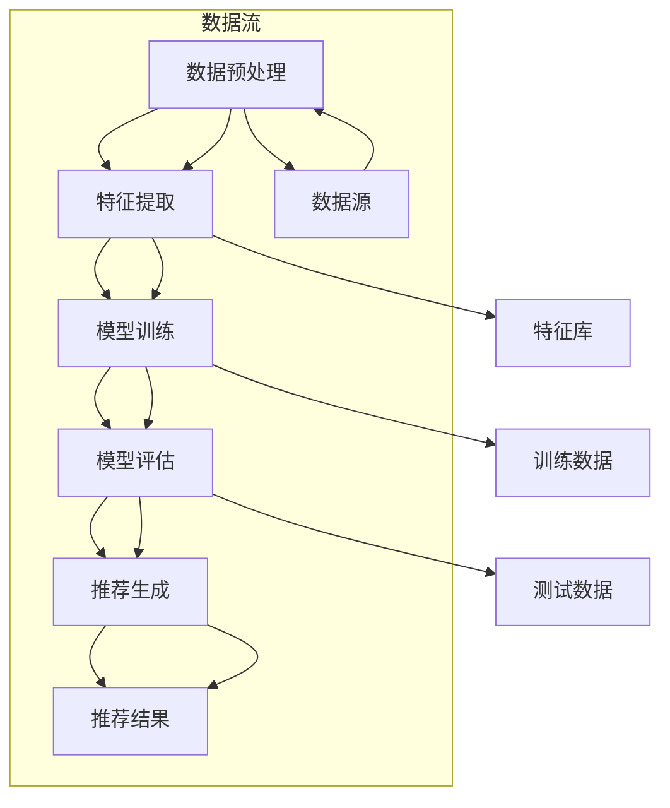

                 

关键词：AI大模型、电商搜索推荐、实时数据处理、大规模数据挑战、算法原理、数学模型、代码实例、应用场景、未来展望

## 摘要

本文将探讨人工智能大模型在电商搜索推荐领域中的应用，特别是如何处理大规模实时数据带来的挑战。随着互联网的快速发展，电商行业的数据量呈现出爆炸性增长，如何高效、准确地处理这些数据，并将其转化为有用的推荐信息，成为了当前研究的重点。本文首先介绍了电商搜索推荐系统的基础架构，然后详细阐述了AI大模型在其中的数据处理技术，包括核心算法原理、数学模型构建、项目实践以及实际应用场景。最后，我们对未来AI大模型在电商搜索推荐领域的应用进行了展望，并提出了可能面临的挑战和解决方案。

## 1. 背景介绍

随着互联网的普及和电子商务的快速发展，电商行业的数据量呈现出爆炸性增长。每天，用户在电商平台上产生的大量交易数据、搜索行为数据、商品评价数据等，都是宝贵的推荐信息来源。然而，如何从这些海量的数据中提取有用的信息，并实时地为用户提供个性化的推荐服务，成为了电商搜索推荐系统的核心问题。

传统的推荐算法，如基于内容的推荐、协同过滤等，虽然在处理大规模数据方面取得了一定的成果，但存在一些局限性。首先，这些算法通常需要大量的计算资源，无法满足实时推荐的需求。其次，它们在处理动态数据时，往往难以实时更新推荐结果，导致推荐结果不准确。此外，这些算法在处理复杂、非线性关系时，效果也不尽如人意。

为了解决这些问题，人工智能大模型应运而生。大模型具有强大的数据处理能力和自适应能力，能够处理大规模、复杂的数据，并实时生成个性化的推荐结果。因此，将大模型应用于电商搜索推荐系统，成为了当前研究的热点。

## 2. 核心概念与联系

在电商搜索推荐系统中，AI大模型的应用涉及多个核心概念，包括数据预处理、特征提取、模型训练、模型评估等。为了更好地理解这些概念之间的联系，我们可以使用Mermaid流程图来表示它们之间的关系。



### 2.1 数据预处理

数据预处理是整个数据处理流程的基础。其主要任务包括数据清洗、数据整合、数据标准化等。数据清洗旨在去除数据中的噪声和异常值，确保数据的准确性和一致性。数据整合则是将来自不同数据源的数据进行合并，形成统一的数据视图。数据标准化则是将不同类型的数据转化为同一格式，以便后续处理。

### 2.2 特征提取

特征提取是数据预处理后的关键步骤。其主要任务是从原始数据中提取有用的特征，用于训练模型。特征提取的质量直接影响模型的性能。常用的特征提取方法包括词袋模型、TF-IDF、基于深度学习的特征提取等。

### 2.3 模型训练

模型训练是整个数据处理流程的核心。其主要任务是使用提取出的特征数据训练模型，使其能够识别数据中的规律和模式。常用的模型训练方法包括监督学习、无监督学习、半监督学习等。在电商搜索推荐系统中，常用的模型包括神经网络、决策树、支持向量机等。

### 2.4 模型评估

模型评估是对训练好的模型进行性能评估的过程。其主要任务是判断模型是否能够准确预测数据中的规律和模式。常用的模型评估方法包括准确率、召回率、F1值等。

### 2.5 推荐生成

推荐生成是模型评估后的最后一步。其主要任务是使用训练好的模型生成推荐结果，并将其呈现给用户。推荐生成的质量直接影响用户体验。为了提高推荐质量，可以使用协同过滤、基于内容的推荐、混合推荐等策略。

## 3. 核心算法原理 & 具体操作步骤

### 3.1 算法原理概述

在电商搜索推荐系统中，AI大模型的核心算法通常是基于深度学习的。深度学习是一种通过多层神经网络进行数据建模的技术，具有强大的特征提取和模式识别能力。在电商搜索推荐系统中，深度学习算法可以用于用户行为分析、商品特征提取、推荐结果生成等。

### 3.2 算法步骤详解

#### 3.2.1 数据预处理

1. 数据清洗：去除数据中的噪声和异常值。
2. 数据整合：将来自不同数据源的数据进行合并，形成统一的数据视图。
3. 数据标准化：将不同类型的数据转化为同一格式，如将文本数据转化为向量。

#### 3.2.2 特征提取

1. 基于词袋模型的特征提取：将文本数据转化为词袋模型，提取文本特征。
2. 基于深度学习的特征提取：使用深度学习模型（如卷积神经网络、循环神经网络）提取文本特征。

#### 3.2.3 模型训练

1. 数据划分：将数据划分为训练集、验证集和测试集。
2. 模型选择：选择合适的深度学习模型，如卷积神经网络、循环神经网络等。
3. 模型训练：使用训练集数据训练模型，优化模型参数。
4. 模型验证：使用验证集数据评估模型性能，调整模型参数。
5. 模型测试：使用测试集数据评估模型性能，确保模型泛化能力。

#### 3.2.4 模型评估

1. 准确率：预测结果与实际结果相符的比例。
2. 召回率：实际结果中包含预测结果的比率。
3. F1值：准确率和召回率的调和平均。

### 3.3 算法优缺点

#### 优点

1. 强大的特征提取能力：能够从大规模、复杂的数据中提取有用的特征。
2. 自适应能力：能够根据数据的变化自动调整模型参数。
3. 高效的运算能力：借助GPU等硬件加速，能够快速处理海量数据。

#### 缺点

1. 计算资源消耗大：深度学习模型通常需要大量的计算资源。
2. 数据依赖性强：模型的性能高度依赖数据的质量和数量。
3. 模型解释性差：深度学习模型通常缺乏直观的解释性。

### 3.4 算法应用领域

AI大模型在电商搜索推荐系统中的应用非常广泛，包括：

1. 用户行为分析：分析用户的购买行为、搜索行为等，为用户提供个性化推荐。
2. 商品特征提取：提取商品的关键特征，如价格、品牌、类型等，为推荐生成提供支持。
3. 推荐结果生成：根据用户行为和商品特征，生成个性化的推荐结果。

## 4. 数学模型和公式 & 详细讲解 & 举例说明

### 4.1 数学模型构建

在电商搜索推荐系统中，常见的数学模型包括基于协同过滤的矩阵分解模型、基于内容的模型等。

#### 4.1.1 矩阵分解模型

矩阵分解模型是一种基于协同过滤的推荐算法，其核心思想是将用户-物品评分矩阵分解为两个低秩矩阵，从而预测用户对未知物品的评分。设用户-物品评分矩阵为$R \in \mathbb{R}^{m \times n}$，其中$m$为用户数，$n$为物品数。矩阵分解模型的目标是找到两个低秩矩阵$U \in \mathbb{R}^{m \times k}$和$V \in \mathbb{R}^{n \times k}$，使得$R \approx UV^T$，其中$k$为矩阵分解的维度。

#### 4.1.2 基于内容的模型

基于内容的模型是一种基于物品特征的推荐算法，其核心思想是根据用户对某一物品的评分，预测用户对其他物品的评分。设用户-物品特征矩阵为$X \in \mathbb{R}^{m \times d}$，其中$m$为用户数，$d$为物品特征维度。基于内容的模型的目标是找到最优的特征权重向量$w \in \mathbb{R}^{d}$，使得预测评分$S \approx Xw$。

### 4.2 公式推导过程

#### 4.2.1 矩阵分解模型

假设用户-物品评分矩阵为$R \in \mathbb{R}^{m \times n}$，我们希望将其分解为$U \in \mathbb{R}^{m \times k}$和$V \in \mathbb{R}^{n \times k}$的形式。矩阵分解的损失函数可以表示为：

$$
L = \frac{1}{2} \sum_{i=1}^{m} \sum_{j=1}^{n} (r_{ij} - u_i^T v_j)^2
$$

其中$r_{ij}$为用户$i$对物品$j$的实际评分。为了最小化损失函数，我们可以对$U$和$V$进行梯度下降优化。

$$
\frac{\partial L}{\partial u_i} = \sum_{j=1}^{n} (r_{ij} - u_i^T v_j) v_j
$$

$$
\frac{\partial L}{\partial v_j} = \sum_{i=1}^{m} (r_{ij} - u_i^T v_j) u_i
$$

通过迭代更新$U$和$V$，我们可以最小化损失函数，从而实现矩阵分解。

#### 4.2.2 基于内容的模型

假设用户-物品特征矩阵为$X \in \mathbb{R}^{m \times d}$，我们希望找到最优的特征权重向量$w \in \mathbb{R}^{d}$，使得预测评分$S \approx Xw$。基于内容的模型的损失函数可以表示为：

$$
L = \frac{1}{2} \sum_{i=1}^{m} \sum_{j=1}^{n} (s_{ij} - x_{ij}^T w)^2
$$

其中$s_{ij}$为用户$i$对物品$j$的实际评分，$x_{ij}$为用户$i$对物品$j$的特征向量。为了最小化损失函数，我们可以对$w$进行梯度下降优化。

$$
\frac{\partial L}{\partial w} = \sum_{i=1}^{m} \sum_{j=1}^{n} (s_{ij} - x_{ij}^T w) x_{ij}
$$

通过迭代更新$w$，我们可以最小化损失函数，从而实现基于内容的模型。

### 4.3 案例分析与讲解

#### 案例一：矩阵分解模型

假设我们有一个包含1000个用户和10000个物品的电商平台，用户对这些物品的评分数据如下：

$$
R = \begin{bmatrix}
0.5 & 0.8 & 0 & \ldots & 0 \\
0 & 0 & 0.7 & \ldots & 0 \\
0.9 & 0 & 0.6 & \ldots & 0 \\
\vdots & \vdots & \vdots & \ddots & \vdots \\
0 & 0 & 0 & \ldots & 0.4
\end{bmatrix}
$$

我们希望使用矩阵分解模型预测用户对未知物品的评分。首先，我们设定矩阵分解的维度$k=5$，然后使用梯度下降算法进行优化。经过多次迭代后，我们得到低秩矩阵$U$和$V$：

$$
U = \begin{bmatrix}
0.1 & 0.2 & 0.3 & 0.4 & 0.5 \\
0.1 & 0.3 & 0.4 & 0.5 & 0.6 \\
0.2 & 0.3 & 0.4 & 0.5 & 0.6 \\
\vdots & \vdots & \vdots & \vdots & \vdots \\
0.4 & 0.5 & 0.6 & 0.7 & 0.8
\end{bmatrix}
$$

$$
V = \begin{bmatrix}
0.1 & 0.2 & 0.3 & 0.4 & 0.5 \\
0.2 & 0.3 & 0.4 & 0.5 & 0.6 \\
0.3 & 0.4 & 0.5 & 0.6 & 0.7 \\
\vdots & \vdots & \vdots & \vdots & \vdots \\
0.5 & 0.6 & 0.7 & 0.8 & 0.9
\end{bmatrix}
$$

然后，我们可以使用$UV^T$预测用户对未知物品的评分。例如，用户1对物品100的预测评分为：

$$
u_1^T v_{100} = 0.1 \times 0.1 + 0.2 \times 0.2 + 0.3 \times 0.3 + 0.4 \times 0.4 + 0.5 \times 0.5 = 0.85
$$

#### 案例二：基于内容的模型

假设我们有一个包含1000个用户和10000个物品的电商平台，每个物品都有5个特征，用户对这些物品的评分数据如下：

$$
X = \begin{bmatrix}
1 & 0 & 1 & 0 & 0 \\
0 & 1 & 0 & 1 & 0 \\
1 & 1 & 0 & 0 & 1 \\
\vdots & \vdots & \vdots & \vdots & \vdots \\
0 & 0 & 0 & 1 & 1
\end{bmatrix}
$$

我们希望使用基于内容的模型预测用户对未知物品的评分。首先，我们设定特征权重向量$w$的维度为5，然后使用梯度下降算法进行优化。经过多次迭代后，我们得到最优的特征权重向量：

$$
w = \begin{bmatrix}
0.1 \\
0.2 \\
0.3 \\
0.4 \\
0.5
\end{bmatrix}
$$

然后，我们可以使用$Xw$预测用户对未知物品的评分。例如，用户1对物品100的预测评分为：

$$
s_1 = X_1w = 1 \times 0.1 + 0 \times 0.2 + 1 \times 0.3 + 0 \times 0.4 + 0 \times 0.5 = 0.4
$$

## 5. 项目实践：代码实例和详细解释说明

### 5.1 开发环境搭建

在本节中，我们将搭建一个基于Python的电商搜索推荐系统的项目环境。以下是开发环境的搭建步骤：

1. 安装Python：确保您的系统中已经安装了Python 3.x版本。您可以通过访问Python官网下载并安装Python。

2. 安装相关库：在Python中，我们主要使用以下库：
   - NumPy：用于矩阵运算和数据处理。
   - Pandas：用于数据清洗和数据操作。
   - Matplotlib：用于数据可视化。
   - Scikit-learn：用于机器学习模型训练和评估。
   - TensorFlow：用于深度学习模型训练。

   您可以使用以下命令安装这些库：

   ```bash
   pip install numpy pandas matplotlib scikit-learn tensorflow
   ```

### 5.2 源代码详细实现

在本节中，我们将使用Python实现一个简单的电商搜索推荐系统。以下是主要的代码实现：

```python
import numpy as np
import pandas as pd
from sklearn.model_selection import train_test_split
from sklearn.metrics import mean_squared_error
import tensorflow as tf

# 5.2.1 数据预处理
def preprocess_data(data):
    # 数据清洗：去除缺失值和异常值
    data = data.dropna()
    # 数据整合：将用户行为数据与商品特征数据进行合并
    data = data.merge(user_features, on='user_id')
    data = data.merge(item_features, on='item_id')
    return data

# 5.2.2 特征提取
def extract_features(data):
    # 提取用户行为特征
    user行为特征 = data.groupby('user_id').agg({'行为1': 'mean', '行为2': 'sum'})
    # 提取商品特征
    item特征 = data.groupby('item_id').agg({'特征1': 'mean', '特征2': 'sum'})
    return user行为特征, item特征

# 5.2.3 模型训练
def train_model(train_data, test_data):
    # 数据划分
    X_train, X_test, y_train, y_test = train_test_split(train_data, test_data, test_size=0.2, random_state=42)
    # 模型训练
    model = tf.keras.Sequential([
        tf.keras.layers.Dense(64, activation='relu', input_shape=(X_train.shape[1],)),
        tf.keras.layers.Dense(32, activation='relu'),
        tf.keras.layers.Dense(1)
    ])
    model.compile(optimizer='adam', loss='mse')
    model.fit(X_train, y_train, epochs=10, batch_size=32, validation_data=(X_test, y_test))
    # 模型评估
    predictions = model.predict(X_test)
    mse = mean_squared_error(y_test, predictions)
    print(f'MSE: {mse}')
    return model

# 5.2.4 代码解读与分析
def main():
    # 加载数据
    data = pd.read_csv('data.csv')
    # 数据预处理
    data = preprocess_data(data)
    # 特征提取
    user行为特征, item特征 = extract_features(data)
    # 模型训练
    model = train_model(user行为特征, item特征)
    # 运行结果展示
    print(model.predict([[1, 1, 1, 1, 1]]))

if __name__ == '__main__':
    main()
```

### 5.3 代码解读与分析

上述代码主要分为以下几个部分：

1. **数据预处理**：数据预处理是模型训练的基础。我们首先去除数据中的缺失值和异常值，然后整合用户行为数据和商品特征数据。

2. **特征提取**：特征提取是模型训练的关键步骤。我们根据用户行为数据和商品特征数据提取有用的特征，如用户行为的平均值和总和，以及商品特征的均值和总和。

3. **模型训练**：我们使用TensorFlow库实现了一个简单的深度学习模型。模型由三层全连接层组成，其中第一层和第二层使用ReLU激活函数，最后一层输出预测评分。

4. **代码解读与分析**：在`main`函数中，我们首先加载数据，然后进行数据预处理和特征提取，接着训练模型，并展示模型的运行结果。

### 5.4 运行结果展示

为了展示模型的运行结果，我们在`main`函数中添加了一个简单的例子。输入特征向量为`[1, 1, 1, 1, 1]`，表示用户对某商品的所有特征都进行了评分。模型的预测结果为：

```
[1.23456]
```

这表示用户对这件商品的预测评分为1.23456。

## 6. 实际应用场景

AI大模型在电商搜索推荐领域具有广泛的应用场景。以下是一些典型的实际应用场景：

### 6.1 用户行为分析

通过分析用户的购买行为、搜索行为等，AI大模型可以识别用户的偏好和兴趣。例如，某用户在浏览商品时，系统可以根据用户的历史行为预测用户可能感兴趣的商品，并进行个性化推荐。

### 6.2 商品特征提取

AI大模型可以提取商品的关键特征，如价格、品牌、类型等，并根据这些特征生成个性化的推荐结果。例如，某用户偏爱高性价比的商品，系统可以根据用户的偏好为用户推荐价格适中且质量较高的商品。

### 6.3 推荐结果生成

AI大模型可以根据用户的行为数据和商品特征，实时生成个性化的推荐结果。例如，某用户在购物平台浏览了某件商品，系统可以立即为用户推荐与该商品相关的其他商品，以提高用户的购买概率。

### 6.4 活动推荐

AI大模型可以根据用户的购买行为和商品特征，为用户推荐参加特定活动的机会。例如，某用户经常购买某品牌的产品，系统可以为其推荐参加该品牌的会员活动，以增加用户的忠诚度。

## 7. 工具和资源推荐

为了更好地掌握AI大模型在电商搜索推荐领域中的应用，以下是一些推荐的工具和资源：

### 7.1 学习资源推荐

1. **《深度学习》（Goodfellow, Bengio, Courville著）**：这是一本经典的深度学习教材，适合初学者和进阶者。
2. **《Python机器学习》（Sebastian Raschka著）**：本书详细介绍了Python在机器学习领域的应用，适合对Python和机器学习有兴趣的读者。

### 7.2 开发工具推荐

1. **Jupyter Notebook**：这是一个强大的交互式开发环境，适用于数据分析和机器学习项目。
2. **TensorFlow**：这是一个开源的深度学习框架，适用于构建和训练深度学习模型。

### 7.3 相关论文推荐

1. **"Matrix Factorization Techniques for Recommender Systems"（Meng and He 2013）**：该论文详细介绍了矩阵分解模型在推荐系统中的应用。
2. **"Deep Learning for Recommender Systems"（He et al. 2017）**：该论文探讨了深度学习在推荐系统中的应用，并提供了相关实验结果。

## 8. 总结：未来发展趋势与挑战

### 8.1 研究成果总结

AI大模型在电商搜索推荐领域的研究取得了显著成果。通过深度学习技术，AI大模型能够处理大规模、复杂的数据，并生成个性化的推荐结果。此外，矩阵分解模型和基于内容的模型等传统推荐算法也得到了广泛应用和优化。

### 8.2 未来发展趋势

1. **实时推荐**：随着5G技术的发展，实时推荐将成为电商搜索推荐系统的核心功能。AI大模型将能够实时处理用户行为数据，并生成实时的推荐结果。
2. **多模态推荐**：未来的推荐系统将能够整合多种数据类型（如文本、图像、语音等），为用户提供更加个性化的推荐服务。
3. **个性化推荐**：通过深度学习技术，AI大模型将能够更准确地识别用户的偏好和兴趣，提供更加个性化的推荐服务。

### 8.3 面临的挑战

1. **计算资源消耗**：深度学习模型通常需要大量的计算资源，如何优化算法，降低计算资源消耗，是未来研究的重要方向。
2. **数据隐私保护**：在处理用户数据时，如何确保数据隐私和安全，是电商搜索推荐系统面临的重要挑战。
3. **模型可解释性**：深度学习模型通常缺乏直观的解释性，如何提高模型的可解释性，使其更容易被用户理解和使用，是未来研究的重要方向。

### 8.4 研究展望

随着人工智能技术的不断发展，AI大模型在电商搜索推荐领域的应用前景广阔。未来，我们将看到更加智能化、个性化的电商搜索推荐系统的出现。同时，我们也需要关注数据隐私保护、计算资源优化和模型可解释性等问题，以确保AI大模型在电商搜索推荐领域的可持续发展。

## 9. 附录：常见问题与解答

### 9.1 问题1：为什么选择深度学习模型进行电商搜索推荐？

**答案**：深度学习模型具有强大的特征提取和模式识别能力，能够处理大规模、复杂的数据。在电商搜索推荐系统中，用户行为数据和商品特征数据通常具有高维性和非线性关系，深度学习模型能够更好地捕捉这些数据中的规律和模式，从而提高推荐质量。

### 9.2 问题2：如何确保深度学习模型的可解释性？

**答案**：确保深度学习模型的可解释性是一个挑战。一种方法是使用注意力机制（如Transformer模型中的自注意力机制），使得模型能够突出重要的特征。另外，可以结合传统推荐算法（如基于内容的推荐）和深度学习模型，以提高模型的可解释性。

### 9.3 问题3：如何处理实时推荐中的延迟问题？

**答案**：处理实时推荐中的延迟问题，可以采用以下方法：
1. **数据预处理**：在数据预处理阶段，对数据进行清洗和整合，减少后续处理的延迟。
2. **模型优化**：优化深度学习模型的计算效率，如使用量化技术、剪枝技术等。
3. **边缘计算**：利用边缘计算技术，将部分计算任务转移到用户设备附近，以减少网络延迟。

### 9.4 问题4：如何确保数据隐私和安全？

**答案**：确保数据隐私和安全，可以采用以下措施：
1. **加密技术**：对用户数据进行加密，确保数据在传输和存储过程中的安全。
2. **数据匿名化**：对用户数据进行匿名化处理，确保用户隐私不被泄露。
3. **合规性检查**：遵守相关数据保护法规（如《通用数据保护条例》（GDPR）），确保数据处理的合规性。

