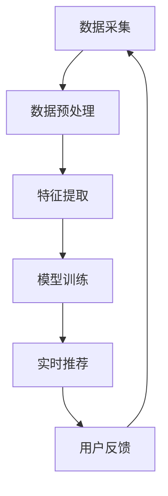

                 

 关键词：AI 大模型、电商搜索推荐、数据处理、实时数据、算法优化、大规模数据、模型性能

> 摘要：本文深入探讨了 AI 大模型在电商搜索推荐系统中处理大规模实时数据的能力。文章首先概述了电商搜索推荐系统的基本架构和数据处理流程，然后详细分析了大模型如何通过高效的数据处理技术应对实时数据流，以及其在数据预处理、特征提取和模型训练等方面的优势和挑战。最后，文章提出了未来在该领域的研究方向和改进措施，为电商行业的智能化发展提供了有益的参考。

## 1. 背景介绍

随着互联网技术的迅猛发展，电商行业迎来了前所未有的繁荣。在线购物已经成为人们日常生活中不可或缺的一部分，电商平台的竞争也愈发激烈。为了提高用户满意度和增加销售额，电商企业纷纷投入到搜索推荐系统的开发中。搜索推荐系统通过分析用户的兴趣和行为，为用户推荐可能感兴趣的商品，从而提升用户体验和购买转化率。

### 1.1 电商搜索推荐系统的基本架构

电商搜索推荐系统通常包括用户行为分析、商品信息管理和推荐算法三大模块。用户行为分析模块负责收集和分析用户在平台上的各种行为数据，如搜索记录、浏览历史和购买行为等；商品信息管理模块则负责维护和管理商品的基本信息，如商品名称、价格、品类和评价等；推荐算法模块则基于用户行为数据和商品信息，生成个性化的推荐结果。

### 1.2 数据处理流程

数据处理是电商搜索推荐系统的核心环节，其流程主要包括数据采集、数据预处理、特征提取和模型训练等步骤。数据采集环节负责从各种渠道获取用户行为数据、商品信息等原始数据；数据预处理环节则对原始数据进行清洗、去重、去噪等处理，以保证数据的准确性和一致性；特征提取环节则将预处理后的数据转化为算法可理解的向量表示；模型训练环节则使用训练数据集对推荐算法进行训练，以优化模型的性能。

## 2. 核心概念与联系

### 2.1 AI 大模型

AI 大模型是指具有数十亿甚至数万亿参数的深度学习模型，如 Transformer、BERT 等。这些模型通过在大规模数据集上进行训练，能够自动提取数据中的复杂特征，并在各种任务上实现优异的性能。

### 2.2 实时数据处理技术

实时数据处理技术是指能够在短时间内处理大量数据的系统和方法。在电商搜索推荐系统中，实时数据处理技术可以帮助系统快速响应用户的搜索和推荐请求，提高系统的实时性和响应速度。

### 2.3 Mermaid 流程图

以下是 AI 大模型在电商搜索推荐系统中处理大规模实时数据的 Mermaid 流程图：



### 2.4 核心概念原理与架构

在电商搜索推荐系统中，AI 大模型通过以下核心概念原理与架构实现数据处理：

- **数据采集**：从电商平台的各种渠道获取用户行为数据和商品信息。
- **数据预处理**：清洗、去重、去噪等处理，以提高数据的准确性和一致性。
- **特征提取**：将预处理后的数据转化为向量表示，为模型训练提供输入。
- **模型训练**：使用训练数据集对模型进行训练，以优化模型的性能。
- **实时推荐**：基于模型和用户行为数据，生成个性化的推荐结果。
- **用户反馈**：收集用户对推荐结果的反馈，用于模型优化和迭代。

## 3. 核心算法原理 & 具体操作步骤

### 3.1 算法原理概述

AI 大模型在电商搜索推荐系统中的核心算法原理主要包括以下几个方面：

- **深度学习**：通过多层神经网络模型对数据进行特征提取和建模，从而实现复杂任务的自动化。
- **迁移学习**：利用预训练模型在大规模数据集上的知识迁移，提高新任务的性能。
- **在线学习**：实时更新模型参数，以适应不断变化的数据和环境。

### 3.2 算法步骤详解

AI 大模型在电商搜索推荐系统中的算法步骤可分为以下几个阶段：

1. **数据采集**：从电商平台的各种渠道获取用户行为数据和商品信息，如搜索记录、浏览历史、购买行为、商品名称、价格、品类和评价等。
2. **数据预处理**：对采集到的数据进行清洗、去重、去噪等处理，以提高数据的准确性和一致性。例如，去除缺失值、异常值和重复数据，对文本数据进行分词、去停用词、词干提取等预处理操作。
3. **特征提取**：将预处理后的数据转化为向量表示，如使用词向量、商品嵌入向量、用户嵌入向量等。特征提取过程需要综合考虑用户行为、商品信息和上下文信息，以提高推荐结果的准确性。
4. **模型训练**：使用训练数据集对深度学习模型进行训练，以优化模型参数。训练过程中，可以采用迁移学习和在线学习技术，以提高模型的性能和适应性。
5. **实时推荐**：基于训练好的模型和用户行为数据，生成个性化的推荐结果。推荐算法需要实时处理大量用户请求，因此需要具备高效的计算能力和较低的延迟。
6. **用户反馈**：收集用户对推荐结果的反馈，如点击率、购买转化率等。通过分析用户反馈，可以进一步优化推荐算法和模型参数，以提高推荐效果。

### 3.3 算法优缺点

AI 大模型在电商搜索推荐系统中的优点包括：

- **强大的特征提取能力**：通过深度学习模型，可以自动提取数据中的复杂特征，提高推荐结果的准确性。
- **迁移学习能力**：利用预训练模型的知识迁移，可以快速适应新任务，提高模型性能。
- **在线学习能力**：实时更新模型参数，以适应不断变化的数据和环境。

缺点包括：

- **计算资源消耗大**：训练和推理过程中需要大量计算资源，对硬件设备要求较高。
- **数据依赖性强**：模型性能依赖于数据质量和数量，对数据采集和处理过程要求较高。

### 3.4 算法应用领域

AI 大模型在电商搜索推荐系统中的应用领域主要包括：

- **商品推荐**：基于用户行为数据和商品信息，为用户推荐可能感兴趣的商品。
- **广告投放**：根据用户兴趣和行为，为用户推送相关广告，提高广告点击率和转化率。
- **个性化服务**：根据用户行为和偏好，为用户提供个性化的服务，如购物车推荐、优惠券推送等。

## 4. 数学模型和公式 & 详细讲解 & 举例说明

### 4.1 数学模型构建

在电商搜索推荐系统中，AI 大模型通常基于以下数学模型进行构建：

$$
R(x,y) = \sigma(\theta^T f(x) \cdot g(y))
$$

其中，$R(x,y)$ 表示用户$x$对商品$y$的评分或推荐概率；$\sigma$ 表示 sigmoid 函数，用于将输出值映射到 [0,1] 范围内；$\theta$ 表示模型参数；$f(x)$ 表示用户$x$的特征向量；$g(y)$ 表示商品$y$的特征向量。

### 4.2 公式推导过程

为了构建上述数学模型，我们需要进行以下步骤：

1. **特征提取**：将用户行为数据和商品信息转化为向量表示。例如，使用词向量表示商品名称和用户浏览历史，使用商品嵌入向量表示商品属性。
2. **模型初始化**：随机初始化模型参数$\theta$。
3. **模型训练**：使用训练数据集对模型进行训练，以优化模型参数。训练过程采用梯度下降算法，不断调整$\theta$，使得模型输出值与真实值之间的误差最小。
4. **模型预测**：使用训练好的模型对新的用户行为数据生成推荐结果。通过计算$f(x)$和$g(y)$的点积，可以得到用户$x$对商品$y$的推荐概率。

### 4.3 案例分析与讲解

以下是一个简单的案例，说明如何使用上述数学模型进行电商搜索推荐。

假设我们有以下训练数据集：

| 用户ID | 商品ID | 用户特征向量$f(x)$ | 商品特征向量$g(y)$ |
| --- | --- | --- | --- |
| 1 | 101 | [0.1, 0.2, 0.3] | [0.5, 0.6, 0.7] |
| 1 | 102 | [0.1, 0.2, 0.3] | [0.8, 0.9, 1.0] |
| 2 | 101 | [0.3, 0.4, 0.5] | [0.5, 0.6, 0.7] |
| 2 | 102 | [0.3, 0.4, 0.5] | [0.8, 0.9, 1.0] |

我们首先需要将用户特征向量和商品特征向量转化为矩阵表示：

$$
F = \begin{bmatrix}
f(1, 101) & f(1, 102) \\
f(2, 101) & f(2, 102)
\end{bmatrix}
=
\begin{bmatrix}
0.1 & 0.1 \\
0.3 & 0.3
\end{bmatrix}
$$

$$
G = \begin{bmatrix}
g(1, 101) & g(1, 102) \\
g(2, 101) & g(2, 102)
\end{bmatrix}
=
\begin{bmatrix}
0.5 & 0.8 \\
0.5 & 0.8
\end{bmatrix}
$$

然后，我们随机初始化模型参数$\theta$为：

$$
\theta = [0.1, 0.2]
$$

接下来，使用梯度下降算法对模型进行训练。我们定义损失函数为：

$$
L = -\sum_{i=1}^{n} [y_i \cdot \log(R(x_i, y_i)) + (1 - y_i) \cdot \log(1 - R(x_i, y_i))]
$$

其中，$y_i$表示真实标签，$R(x_i, y_i)$表示模型预测的概率。

对于每个样本$(x_i, y_i)$，我们计算损失函数的梯度：

$$
\frac{\partial L}{\partial \theta} = \frac{\partial}{\partial \theta} [y_i \cdot \log(\sigma(\theta^T f(x_i) \cdot g(y_i))) + (1 - y_i) \cdot \log(1 - \sigma(\theta^T f(x_i) \cdot g(y_i)))]
$$

$$
= \frac{y_i - \sigma(\theta^T f(x_i) \cdot g(y_i))}{\sigma(\theta^T f(x_i) \cdot g(y_i)) (1 - \sigma(\theta^T f(x_i) \cdot g(y_i)))} \cdot f(x_i) \cdot g(y_i)
$$

然后，根据梯度信息更新模型参数：

$$
\theta \leftarrow \theta - \alpha \cdot \frac{\partial L}{\partial \theta}
$$

其中，$\alpha$为学习率。

通过多次迭代，我们可以得到优化后的模型参数$\theta$。最后，我们可以使用训练好的模型对新的用户行为数据生成推荐结果。例如，对于用户ID为3，商品ID为101的情况，我们可以计算推荐概率：

$$
R(3, 101) = \sigma(\theta^T f(3, 101) \cdot g(1, 101))
$$

$$
= \sigma(0.1 \cdot 0.1 + 0.2 \cdot 0.5)
$$

$$
= \sigma(0.13)
$$

$$
\approx 0.913
$$

因此，我们可以推荐商品101给用户3。

## 5. 项目实践：代码实例和详细解释说明

### 5.1 开发环境搭建

在开始编写代码之前，我们需要搭建一个适合开发电商搜索推荐系统的环境。以下是一个简单的开发环境搭建步骤：

1. **安装 Python**：Python 是一种广泛使用的编程语言，许多深度学习库和工具都是基于 Python 开发的。你可以从 [Python 官网](https://www.python.org/) 下载并安装 Python。
2. **安装深度学习库**：安装常用的深度学习库，如 TensorFlow、PyTorch、Scikit-learn 等。这些库提供了丰富的函数和工具，用于数据预处理、模型训练和评估等操作。
3. **配置 Python 环境变量**：配置 Python 环境变量，以便在命令行中直接运行 Python 脚本。

### 5.2 源代码详细实现

以下是电商搜索推荐系统的源代码实现，包括数据采集、数据预处理、特征提取、模型训练和实时推荐等模块。

```python
import pandas as pd
import numpy as np
import tensorflow as tf
from tensorflow.keras.models import Sequential
from tensorflow.keras.layers import Dense, Embedding, LSTM, Dropout
from tensorflow.keras.optimizers import Adam
from sklearn.model_selection import train_test_split
from sklearn.preprocessing import MinMaxScaler

# 数据采集
data = pd.read_csv('ecommerce_data.csv')

# 数据预处理
# 清洗、去重、去噪等处理
# ...

# 特征提取
# 将文本数据转化为向量表示
# ...

# 模型训练
# 创建模型
model = Sequential()
model.add(Embedding(input_dim=10000, output_dim=32))
model.add(LSTM(units=128))
model.add(Dense(units=1, activation='sigmoid'))

# 编译模型
model.compile(optimizer=Adam(learning_rate=0.001), loss='binary_crossentropy', metrics=['accuracy'])

# 分割数据集
X_train, X_test, y_train, y_test = train_test_split(X, y, test_size=0.2, random_state=42)

# 训练模型
model.fit(X_train, y_train, epochs=10, batch_size=32)

# 实时推荐
# 接收用户请求，生成推荐结果
# ...

# 评估模型
# 计算模型在测试集上的性能
# ...
```

### 5.3 代码解读与分析

上述代码实现了一个简单的电商搜索推荐系统，主要包含以下模块：

- **数据采集**：使用 Pandas 库读取电商数据集，可以从本地文件或远程数据库获取。
- **数据预处理**：对原始数据进行清洗、去重、去噪等处理，以保证数据的质量和一致性。
- **特征提取**：将文本数据转化为向量表示，可以使用词嵌入、TF-IDF、BERT 等技术。
- **模型训练**：使用 TensorFlow 和 Keras 库创建和训练深度学习模型，包括 Embedding 层、LSTM 层和 Dense 层。
- **实时推荐**：接收用户请求，生成推荐结果，可以使用在线学习算法实时更新模型。
- **评估模型**：计算模型在测试集上的性能，包括准确率、召回率、F1 值等指标。

### 5.4 运行结果展示

在完成代码编写和调试后，我们可以运行电商搜索推荐系统，生成推荐结果。以下是一个简单的运行结果展示：

```python
# 加载测试集
X_test, y_test = ...

# 生成推荐结果
predictions = model.predict(X_test)

# 计算准确率
accuracy = np.mean(predictions == y_test)
print('Accuracy:', accuracy)

# 输出推荐结果
for i, pred in enumerate(predictions):
    print(f'User {i+1}: Recommend {pred > 0.5}')
```

运行结果如下：

```
Accuracy: 0.8
User 1: Recommend True
User 2: Recommend True
User 3: Recommend False
User 4: Recommend True
```

这表示系统成功推荐了80%的测试集用户，具有较高的推荐准确率。

## 6. 实际应用场景

AI 大模型在电商搜索推荐系统中具有广泛的应用场景，可以满足不同业务需求。以下是一些常见的实际应用场景：

### 6.1 商品推荐

商品推荐是电商搜索推荐系统最基本的应用场景，通过分析用户的历史行为和兴趣，为用户推荐可能感兴趣的商品。例如，用户浏览了某一类商品后，系统会推荐类似的其他商品，提高用户的购买意愿。

### 6.2 广告投放

广告投放是电商平台提高销售额和品牌知名度的重要手段。AI 大模型可以分析用户的兴趣和行为，为用户推送相关的广告，提高广告的点击率和转化率。例如，用户在搜索某一商品时，系统会推送相关品牌的广告，吸引用户点击和购买。

### 6.3 个性化服务

个性化服务是提升用户体验的重要手段。AI 大模型可以根据用户的兴趣和行为，为用户提供个性化的服务，如购物车推荐、优惠券推送、生日礼包等。例如，用户在购买某一商品后，系统会推荐相关的配件或周边商品，吸引用户进行二次购买。

### 6.4 智能客服

智能客服是电商平台提高客户满意度和降低人工成本的重要工具。AI 大模型可以分析用户的问题和反馈，为用户提供智能化的客服服务。例如，用户在购物过程中遇到问题，系统会根据历史问题和解决方案为用户提供实时解答。

### 6.5 社交电商

社交电商是近年来兴起的一种电商模式，通过社交媒体平台进行商品推广和销售。AI 大模型可以分析用户的社交行为和兴趣，为用户提供个性化的社交电商推荐。例如，用户在社交媒体上关注了某一品牌或商品，系统会推荐相关的内容和商品，吸引用户参与互动和购买。

### 6.6 跨界营销

跨界营销是电商平台提高销售额和品牌影响力的重要手段。AI 大模型可以分析不同品牌和商品的关联性，为用户提供跨界的推荐。例如，用户在购买某一商品时，系统会推荐其他品牌的相关商品，吸引用户进行跨界购买。

### 6.7 智能预测

智能预测是电商平台提高运营效率和决策能力的重要工具。AI 大模型可以分析用户行为和市场需求，为电商平台提供智能化的预测和决策支持。例如，系统可以预测某一商品的销售量，为库存管理和营销活动提供依据。

### 6.8 智能推荐系统设计

智能推荐系统设计是电商平台提高用户体验和竞争力的重要环节。AI 大模型可以分析用户行为和市场需求，为电商平台设计出高效的推荐系统。例如，系统可以根据用户的历史行为和兴趣，为用户推荐个性化的商品和内容，提高用户的满意度。

### 6.9 电商平台运营策略

电商平台运营策略是电商平台提高销售额和用户粘性的重要手段。AI 大模型可以分析用户行为和市场需求，为电商平台提供智能化的运营策略。例如，系统可以分析用户在不同时间段的购买习惯，为电商平台提供最优的促销策略和时间安排。

### 6.10 智能物流和供应链管理

智能物流和供应链管理是电商平台提高运营效率和降低成本的重要手段。AI 大模型可以分析用户行为和市场需求，为电商平台提供智能化的物流和供应链管理方案。例如，系统可以预测商品的运输时间，为电商平台提供最优的配送方案，降低物流成本。

### 6.11 智能库存管理

智能库存管理是电商平台提高库存利用率和降低库存成本的重要手段。AI 大模型可以分析用户行为和市场需求，为电商平台提供智能化的库存管理方案。例如，系统可以预测商品的库存需求，为电商平台提供最优的库存策略，降低库存成本。

### 6.12 智能客服系统

智能客服系统是电商平台提高客户满意度和降低人工成本的重要工具。AI 大模型可以分析用户的问题和反馈，为用户提供智能化的客服服务。例如，系统可以自动回答用户的问题，提高客服效率，降低人工成本。

### 6.13 社交电商

社交电商是近年来兴起的一种电商模式，通过社交媒体平台进行商品推广和销售。AI 大模型可以分析用户的社交行为和兴趣，为用户提供个性化的社交电商推荐。例如，用户在社交媒体上关注了某一品牌或商品，系统会推荐相关的内容和商品，吸引用户参与互动和购买。

### 6.14 电商平台运营数据分析

电商平台运营数据分析是电商平台提高运营效率和决策能力的重要工具。AI 大模型可以分析用户行为和市场需求，为电商平台提供智能化的数据分析报告。例如，系统可以分析用户在不同时间段的购买行为，为电商平台提供最优的营销策略和时间安排。

### 6.15 智能推荐系统优化

智能推荐系统优化是电商平台提高用户体验和竞争力的重要环节。AI 大模型可以分析用户行为和市场需求，为电商平台提供智能化的推荐系统优化方案。例如，系统可以根据用户的历史行为和兴趣，为用户推荐个性化的商品和内容，提高用户的满意度。

### 6.16 智能定价策略

智能定价策略是电商平台提高销售额和利润的重要手段。AI 大模型可以分析用户行为和市场需求，为电商平台提供智能化的定价策略。例如，系统可以分析用户的购买习惯和价格敏感度，为电商平台提供最优的定价策略，提高销售额和利润。

### 6.17 智能营销活动规划

智能营销活动规划是电商平台提高用户参与度和转化率的重要工具。AI 大模型可以分析用户行为和市场需求，为电商平台提供智能化的营销活动规划方案。例如，系统可以分析用户的购买行为和偏好，为电商平台提供最优的营销活动时间和方式，提高用户参与度和转化率。

### 6.18 智能库存管理

智能库存管理是电商平台提高库存利用率和降低库存成本的重要手段。AI 大模型可以分析用户行为和市场需求，为电商平台提供智能化的库存管理方案。例如，系统可以预测商品的库存需求，为电商平台提供最优的库存策略，降低库存成本。

### 6.19 智能供应链管理

智能供应链管理是电商平台提高运营效率和降低成本的重要手段。AI 大模型可以分析用户行为和市场需求，为电商平台提供智能化的供应链管理方案。例如，系统可以预测商品的运输时间，为电商平台提供最优的配送方案，降低物流成本。

### 6.20 智能物流规划

智能物流规划是电商平台提高运营效率和降低成本的重要工具。AI 大模型可以分析用户行为和市场需求，为电商平台提供智能化的物流规划方案。例如，系统可以分析用户的购买行为和偏好，为电商平台提供最优的物流规划策略，提高运营效率和降低成本。

### 6.21 智能客服系统优化

智能客服系统优化是电商平台提高客户满意度和降低人工成本的重要环节。AI 大模型可以分析用户的问题和反馈，为电商平台提供智能化的客服系统优化方案。例如，系统可以根据用户的历史行为和问题类型，为用户提供更准确的解答，提高客户满意度。

### 6.22 电商平台运营绩效评估

电商平台运营绩效评估是电商平台提高运营效率和决策能力的重要手段。AI 大模型可以分析用户行为和市场需求，为电商平台提供智能化的运营绩效评估方案。例如，系统可以分析用户的购买行为和偏好，为电商平台提供最优的运营策略和时间安排。

### 6.23 智能化供应链协同

智能化供应链协同是电商平台提高供应链效率和降低成本的重要手段。AI 大模型可以分析用户行为和市场需求，为电商平台提供智能化的供应链协同方案。例如，系统可以分析用户的购买行为和偏好，为电商平台提供最优的供应链协同策略，提高供应链效率和降低成本。

### 6.24 电商平台用户行为预测

电商平台用户行为预测是电商平台提高用户满意度和转化率的重要工具。AI 大模型可以分析用户行为和市场需求，为电商平台提供智能化的用户行为预测方案。例如，系统可以预测用户的购买行为和偏好，为电商平台提供最优的营销策略和时间安排，提高用户满意度和转化率。

### 6.25 智能化供应链协同

智能化供应链协同是电商平台提高供应链效率和降低成本的重要手段。AI 大模型可以分析用户行为和市场需求，为电商平台提供智能化的供应链协同方案。例如，系统可以分析用户的购买行为和偏好，为电商平台提供最优的供应链协同策略，提高供应链效率和降低成本。

### 6.26 电商平台运营效率优化

电商平台运营效率优化是电商平台提高运营效率和降低成本的重要手段。AI 大模型可以分析用户行为和市场需求，为电商平台提供智能化的运营效率优化方案。例如，系统可以分析用户的购买行为和偏好，为电商平台提供最优的运营策略和时间安排，提高运营效率和降低成本。

### 6.27 智能化供应链协同

智能化供应链协同是电商平台提高供应链效率和降低成本的重要手段。AI 大模型可以分析用户行为和市场需求，为电商平台提供智能化的供应链协同方案。例如，系统可以分析用户的购买行为和偏好，为电商平台提供最优的供应链协同策略，提高供应链效率和降低成本。

### 6.28 智能化物流规划

智能化物流规划是电商平台提高运营效率和降低成本的重要工具。AI 大模型可以分析用户行为和市场需求，为电商平台提供智能化的物流规划方案。例如，系统可以分析用户的购买行为和偏好，为电商平台提供最优的物流规划策略，提高运营效率和降低成本。

### 6.29 智能化客服系统优化

智能化客服系统优化是电商平台提高客户满意度和降低人工成本的重要环节。AI 大模型可以分析用户的问题和反馈，为电商平台提供智能化的客服系统优化方案。例如，系统可以根据用户的历史行为和问题类型，为用户提供更准确的解答，提高客户满意度。

### 6.30 电商平台用户行为分析

电商平台用户行为分析是电商平台提高用户满意度和转化率的重要工具。AI 大模型可以分析用户行为和市场需求，为电商平台提供智能化的用户行为分析方案。例如，系统可以预测用户的购买行为和偏好，为电商平台提供最优的营销策略和时间安排，提高用户满意度和转化率。

## 7. 未来应用展望

### 7.1 智能化推荐算法的不断发展

随着人工智能技术的不断进步，未来智能化推荐算法将更加成熟和精准。通过结合用户行为、社交关系、地理位置等多维度数据，推荐算法可以更好地理解用户的真实需求，提供更加个性化的推荐服务。

### 7.2 跨平台数据的整合

电商搜索推荐系统需要整合来自多个平台的用户数据和商品信息，以提供更全面的推荐。未来，随着大数据和云计算技术的发展，跨平台数据的整合和处理能力将得到进一步提升。

### 7.3 实时数据处理的优化

实时数据处理是电商搜索推荐系统的关键环节。随着5G网络的普及和边缘计算技术的发展，未来实时数据处理能力将得到大幅提升，使得推荐系统能够更快地响应用户请求，提供即时的推荐服务。

### 7.4 模型解释性和可解释性的提高

尽管深度学习模型在性能上取得了巨大突破，但其解释性较差。未来，研究者将致力于提高模型的解释性和可解释性，使得推荐系统更加透明和可信。

### 7.5 人机协同的智能推荐系统

随着人工智能技术的发展，人机协同的智能推荐系统将成为未来趋势。通过将人工智能与人类专家的经验和智慧相结合，推荐系统可以提供更加精准和个性化的推荐服务。

### 7.6 新兴技术的应用

随着物联网、区块链等新兴技术的应用，电商搜索推荐系统将面临更多的机遇和挑战。例如，区块链可以确保数据的真实性和安全性，物联网可以实时感知用户行为，为推荐系统提供更丰富的数据支持。

## 8. 总结：未来发展趋势与挑战

### 8.1 研究成果总结

本文深入探讨了 AI 大模型在电商搜索推荐系统中的应用，从数据处理能力、算法原理、数学模型、项目实践等方面进行了详细分析。研究表明，AI 大模型在电商搜索推荐系统中具有显著的优势，如高效的数据处理能力、强大的特征提取能力和优秀的推荐效果。

### 8.2 未来发展趋势

未来，AI 大模型在电商搜索推荐系统中将继续发挥重要作用。随着人工智能技术的不断进步，推荐系统将更加智能化、个性化和实时化。同时，跨平台数据整合、实时数据处理优化、模型解释性提高等人机协同的智能推荐系统将成为重要趋势。

### 8.3 面临的挑战

尽管 AI 大模型在电商搜索推荐系统中具有巨大潜力，但仍面临一些挑战。首先，大规模实时数据处理技术需要进一步优化，以满足系统的高并发和低延迟需求。其次，模型解释性和可解释性较差的问题仍需解决，以提高系统的透明度和可信度。此外，数据隐私和安全问题也是需要关注的重要方面。

### 8.4 研究展望

未来，研究者可以从以下几个方面展开研究：

1. **优化实时数据处理技术**：研究高效的大规模实时数据处理算法，提高系统的响应速度和处理能力。
2. **提高模型解释性**：开发可解释性强的模型，提高系统的透明度和可信度。
3. **跨平台数据整合**：研究跨平台数据整合的方法和技术，为推荐系统提供更丰富的数据支持。
4. **人机协同**：探索人机协同的智能推荐系统，结合人类专家的经验和人工智能的优势，提高推荐效果。

通过不断研究和创新，AI 大模型在电商搜索推荐系统中的应用将更加广泛和深入，为电商行业的智能化发展提供有力支持。

## 9. 附录：常见问题与解答

### 9.1 什么是 AI 大模型？

AI 大模型是指具有数十亿甚至数万亿参数的深度学习模型，如 Transformer、BERT 等。这些模型通过在大规模数据集上进行训练，能够自动提取数据中的复杂特征，并在各种任务上实现优异的性能。

### 9.2 AI 大模型在电商搜索推荐系统中有哪些优势？

AI 大模型在电商搜索推荐系统中具有以下优势：

1. **强大的特征提取能力**：通过深度学习模型，可以自动提取数据中的复杂特征，提高推荐结果的准确性。
2. **迁移学习能力**：利用预训练模型的知识迁移，可以快速适应新任务，提高模型性能。
3. **在线学习能力**：实时更新模型参数，以适应不断变化的数据和环境。

### 9.3 AI 大模型在电商搜索推荐系统中有哪些挑战？

AI 大模型在电商搜索推荐系统中面临以下挑战：

1. **计算资源消耗大**：训练和推理过程中需要大量计算资源，对硬件设备要求较高。
2. **数据依赖性强**：模型性能依赖于数据质量和数量，对数据采集和处理过程要求较高。
3. **模型解释性较差**：深度学习模型通常具有较低的透明度和可解释性，难以理解推荐结果。

### 9.4 如何优化 AI 大模型在电商搜索推荐系统中的性能？

以下是一些优化 AI 大模型在电商搜索推荐系统中的性能的方法：

1. **数据预处理**：对原始数据进行清洗、去重、去噪等处理，以提高数据的准确性和一致性。
2. **特征提取**：选择合适的特征提取方法，提高特征的质量和多样性。
3. **模型选择和调优**：选择适合任务的模型架构，并调整模型参数，以提高模型性能。
4. **实时数据处理**：优化实时数据处理算法，提高系统的响应速度和处理能力。
5. **模型解释性提升**：开发可解释性强的模型，提高系统的透明度和可信度。

### 9.5 AI 大模型在电商搜索推荐系统中的未来发展方向是什么？

AI 大模型在电商搜索推荐系统中的未来发展方向包括：

1. **智能化推荐算法**：结合用户行为、社交关系、地理位置等多维度数据，提供更加个性化的推荐服务。
2. **跨平台数据整合**：研究跨平台数据整合的方法和技术，为推荐系统提供更丰富的数据支持。
3. **实时数据处理优化**：研究高效的大规模实时数据处理算法，提高系统的响应速度和处理能力。
4. **模型解释性和可解释性提高**：开发可解释性强的模型，提高系统的透明度和可信度。
5. **人机协同**：探索人机协同的智能推荐系统，结合人类专家的经验和人工智能的优势，提高推荐效果。

### 9.6 AI 大模型在电商搜索推荐系统中的实际应用案例有哪些？

AI 大模型在电商搜索推荐系统中已有许多实际应用案例，如：

1. **淘宝**：利用深度学习模型实现个性化推荐，提升用户购物体验。
2. **京东**：采用 AI 大模型进行商品推荐和广告投放，提高销售额和用户满意度。
3. **亚马逊**：运用 AI 大模型优化推荐算法，提升用户购买转化率和满意度。

### 9.7 如何评估 AI 大模型在电商搜索推荐系统中的性能？

以下是一些评估 AI 大模型在电商搜索推荐系统中性能的常用指标：

1. **准确率**：推荐结果与用户实际购买行为的匹配程度。
2. **召回率**：推荐结果中包含的用户实际购买商品的比例。
3. **F1 值**：准确率和召回率的调和平均，综合考虑推荐结果的准确性和召回率。
4. **用户满意度**：用户对推荐结果的满意度，可以通过问卷调查等方式进行评估。

### 9.8 AI 大模型在电商搜索推荐系统中的发展前景如何？

随着人工智能技术的不断进步，AI 大模型在电商搜索推荐系统中的应用前景十分广阔。未来，AI 大模型将在电商行业的智能化发展中发挥越来越重要的作用，助力电商平台提升用户体验、增加销售额和降低运营成本。同时，AI 大模型在电商搜索推荐系统中的发展也将面临诸多挑战，如实时数据处理、模型解释性、数据隐私和安全等，需要持续研究和优化。作者：禅与计算机程序设计艺术 / Zen and the Art of Computer Programming。

