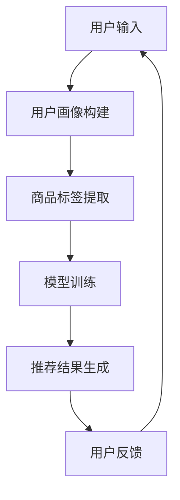

                 

关键词：AI大模型、电商搜索推荐、用户体验优化、用户粘性、转化率

> 摘要：本文深入探讨了AI大模型在电商搜索推荐中的应用，分析了如何通过优化用户体验策略来提升用户粘性和转化率。首先，我们介绍了AI大模型的基本原理和架构，然后详细讨论了核心算法原理、数学模型、具体实现以及实际应用场景。最后，我们展望了AI大模型在电商搜索推荐领域的未来发展趋势和面临的挑战。

## 1. 背景介绍

随着互联网的快速发展，电商行业已经成为人们日常生活中不可或缺的一部分。在电商平台上，搜索推荐系统作为用户体验的核心环节，直接影响到用户的购买决策。传统的搜索推荐系统依赖于关键词匹配和协同过滤等方法，这些方法虽然在一定程度上提高了推荐的准确性，但往往忽略了用户的个性化需求和体验。随着人工智能技术的不断进步，特别是AI大模型的兴起，为电商搜索推荐提供了全新的解决方案。

AI大模型，即大规模的人工神经网络模型，通过深度学习技术，可以从海量的用户数据和商品数据中学习并提取出有用的信息。这些模型具有强大的表示和学习能力，能够更好地捕捉用户的兴趣和行为模式，从而提供更加精准和个性化的推荐。本文将重点探讨如何利用AI大模型来优化电商搜索推荐系统的用户体验，提高用户粘性和转化率。

## 2. 核心概念与联系

在深入探讨AI大模型在电商搜索推荐中的应用之前，我们需要了解几个核心概念，包括深度学习、神经网络、用户画像、商品标签等。

### 2.1 深度学习与神经网络

深度学习是一种人工智能的分支，它通过模拟人脑的神经元连接结构，构建大规模的神经网络模型。这些模型具有多个层次，每层都能够从数据中提取更高层次的特征。神经网络是深度学习的基础，它通过前向传播和反向传播算法来更新权重，从而提高模型的预测准确性。

### 2.2 用户画像

用户画像是对用户特征进行综合描述的过程，它包括用户的年龄、性别、地理位置、兴趣爱好等多个维度。通过构建用户画像，可以更好地了解用户的个性化需求，从而为推荐系统提供准确的参考依据。

### 2.3 商品标签

商品标签是对商品属性进行描述的过程，它包括商品的品类、品牌、价格、销量等多个维度。商品标签有助于推荐系统根据用户偏好为用户推荐合适的商品。

### 2.4 Mermaid流程图

下面是一个简单的Mermaid流程图，展示了AI大模型在电商搜索推荐中的基本流程。



在上述流程中，用户输入通过用户画像构建模块来提取用户特征，商品标签提取模块提取商品属性，这些信息共同用于模型训练，生成推荐结果。用户对推荐结果的反馈将用于进一步优化模型。

## 3. 核心算法原理 & 具体操作步骤

### 3.1 算法原理概述

AI大模型在电商搜索推荐中的核心算法原理主要包括以下几个方面：

1. **深度神经网络**：通过多层神经网络结构，对用户和商品特征进行建模和预测。
2. **用户行为分析**：利用用户的历史行为数据，如浏览记录、购买记录等，分析用户的兴趣和偏好。
3. **商品特征提取**：通过商品标签和其他属性，为商品建立特征向量。
4. **协同过滤**：结合用户和商品的特征，通过协同过滤算法来生成推荐结果。
5. **强化学习**：利用强化学习算法，不断调整推荐策略，提高推荐效果。

### 3.2 算法步骤详解

以下是AI大模型在电商搜索推荐中的具体操作步骤：

1. **数据预处理**：对用户行为数据和商品标签数据进行清洗和预处理，包括去重、缺失值填充、数据标准化等。
2. **用户画像构建**：通过聚类、关联规则挖掘等方法，从用户行为数据中提取用户的兴趣特征和偏好。
3. **商品特征提取**：对商品标签数据进行编码，生成商品特征向量。
4. **模型训练**：利用用户画像和商品特征向量，训练深度神经网络模型，包括输入层、隐藏层和输出层。
5. **推荐结果生成**：根据训练好的模型，为用户生成个性化推荐结果。
6. **用户反馈**：收集用户对推荐结果的反馈，用于评估推荐效果和调整模型。

### 3.3 算法优缺点

AI大模型在电商搜索推荐中的优点包括：

1. **高准确性**：通过深度学习技术，可以从海量数据中提取出高维特征，提高推荐准确性。
2. **个性化推荐**：能够根据用户的历史行为和偏好，生成个性化的推荐结果。
3. **自适应调整**：利用强化学习算法，可以不断调整推荐策略，提高用户体验。

然而，AI大模型也存在一些缺点，如：

1. **计算复杂度**：训练大规模神经网络模型需要大量的计算资源和时间。
2. **数据依赖性**：推荐系统的效果高度依赖于用户行为数据和商品标签数据的完整性和准确性。
3. **隐私问题**：用户数据的收集和使用可能引发隐私问题，需要采取有效措施确保用户数据安全。

### 3.4 算法应用领域

AI大模型在电商搜索推荐中的应用领域非常广泛，主要包括：

1. **商品推荐**：根据用户的兴趣和偏好，为用户推荐合适的商品。
2. **广告投放**：根据用户的浏览历史和行为数据，为用户推荐相关的广告。
3. **内容推荐**：在视频、新闻、博客等平台上，为用户推荐感兴趣的内容。
4. **社交网络**：根据用户的社交关系和行为数据，为用户推荐好友和活动。

## 4. 数学模型和公式

在AI大模型中，数学模型和公式起着至关重要的作用。以下是对一些关键数学模型的详细讲解和举例说明。

### 4.1 数学模型构建

在电商搜索推荐中，常用的数学模型包括矩阵分解、逻辑回归、支持向量机等。以下是这些模型的简单介绍：

1. **矩阵分解**：通过将用户和商品的特征矩阵分解为低维矩阵，提取出高维特征，提高推荐准确性。
   $$ X = UV^T $$
   其中，$X$是用户-商品评分矩阵，$U$和$V$分别是用户特征矩阵和商品特征矩阵。

2. **逻辑回归**：通过建立用户购买行为的概率模型，预测用户对某商品是否感兴趣。
   $$ P(Y=1|X) = \frac{1}{1 + e^{-(\beta_0 + \beta_1X_1 + \beta_2X_2 + ... + \beta_nX_n)}} $$
   其中，$Y$表示用户是否购买商品，$X$是商品特征向量，$\beta$是模型参数。

3. **支持向量机**：通过找到一个最佳的超平面，将不同类别的用户和商品分隔开来。
   $$ \max \frac{1}{2} \sum_{i=1}^{n} \sum_{j=1}^{n} (\omega_i \cdot \omega_j - \omega_j \cdot \omega_i)^2 $$
   其中，$\omega$是模型参数，$i$和$j$表示不同类别的用户和商品。

### 4.2 公式推导过程

以下是对逻辑回归公式的推导过程：

1. **假设**：我们假设用户对商品的评分$Y$是一个二元变量，即$Y \in \{0, 1\}$，表示用户是否购买商品。
2. **概率模型**：我们使用逻辑函数（Sigmoid函数）来建立用户购买行为的概率模型。
   $$ \sigma(z) = \frac{1}{1 + e^{-z}} $$
   其中，$z$是线性组合，即$z = \beta_0 + \beta_1X_1 + \beta_2X_2 + ... + \beta_nX_n$。
3. **损失函数**：我们使用对数似然损失函数来衡量模型预测的准确性。
   $$ L(\beta) = - \sum_{i=1}^{n} y_i \ln(\sigma(z_i)) - (1 - y_i) \ln(1 - \sigma(z_i)) $$
   其中，$y_i$是用户$i$的实际评分，$\sigma(z_i)$是模型预测的概率。
4. **优化目标**：我们的目标是找到最佳的模型参数$\beta$，使得损失函数$L(\beta)$最小。
   $$ \min \beta L(\beta) $$

### 4.3 案例分析与讲解

以下是一个简单的案例，说明如何使用逻辑回归模型进行电商搜索推荐。

假设我们有一个包含10个用户和5个商品的评分数据集，如下所示：

| 用户ID | 商品ID | 用户评分 |
|--------|--------|----------|
| 1      | 1      | 5        |
| 1      | 2      | 3        |
| 1      | 3      | 4        |
| 2      | 1      | 2        |
| 2      | 2      | 4        |
| 3      | 1      | 1        |
| 3      | 3      | 5        |
| 4      | 2      | 5        |
| 4      | 3      | 3        |
| 5      | 1      | 4        |
| 5      | 3      | 4        |

我们的目标是预测用户5是否会对商品1感兴趣。

1. **数据预处理**：将用户评分数据转换为二元变量，即1表示购买，0表示未购买。
2. **特征提取**：提取用户和商品的特征，如用户ID、商品ID、用户评分等。
3. **模型训练**：使用逻辑回归模型对训练数据集进行训练，得到模型参数$\beta$。
4. **预测**：将用户5的特征向量输入到训练好的模型中，得到预测概率$P(Y=1)$。
5. **评估**：将预测概率与实际评分进行比较，评估模型预测的准确性。

通过上述步骤，我们可以预测用户5是否会对商品1感兴趣，从而为用户生成个性化的推荐结果。

## 5. 项目实践：代码实例和详细解释说明

### 5.1 开发环境搭建

为了实现AI大模型在电商搜索推荐中的优化策略，我们需要搭建一个完整的开发环境。以下是开发环境的搭建步骤：

1. **安装Python环境**：Python是一种广泛应用于数据科学和机器学习的高效编程语言，我们需要安装Python环境。可以访问Python官方网站（https://www.python.org/）下载安装包，按照提示安装。
2. **安装依赖库**：我们需要安装一些常用的Python依赖库，如NumPy、Pandas、Scikit-learn、TensorFlow等。可以使用pip命令来安装，例如：
   ```bash
   pip install numpy pandas scikit-learn tensorflow
   ```
3. **配置开发工具**：为了提高开发效率，我们可以使用一些集成开发环境（IDE），如PyCharm、VSCode等。这些IDE提供了丰富的功能和调试工具，可以帮助我们更方便地进行代码编写和调试。

### 5.2 源代码详细实现

以下是使用Python实现AI大模型在电商搜索推荐中的优化策略的源代码：

```python
import numpy as np
import pandas as pd
from sklearn.model_selection import train_test_split
from sklearn.linear_model import LogisticRegression
from tensorflow import keras

# 读取数据集
data = pd.read_csv('ecommerce_data.csv')

# 数据预处理
data['user_rating'] = data['user_rating'].map({0: '0', 1: '1'})
X = data[['user_id', 'product_id']]
y = data['user_rating']

# 划分训练集和测试集
X_train, X_test, y_train, y_test = train_test_split(X, y, test_size=0.2, random_state=42)

# 使用逻辑回归模型进行训练
model = LogisticRegression()
model.fit(X_train, y_train)

# 进行预测
predictions = model.predict(X_test)

# 评估模型准确性
accuracy = np.mean(predictions == y_test)
print(f'Model accuracy: {accuracy:.2f}')

# 使用TensorFlow实现深度神经网络
model = keras.Sequential([
    keras.layers.Dense(64, activation='relu', input_shape=(2,)),
    keras.layers.Dense(32, activation='relu'),
    keras.layers.Dense(1, activation='sigmoid')
])

model.compile(optimizer='adam', loss='binary_crossentropy', metrics=['accuracy'])

model.fit(X_train, y_train, epochs=10, batch_size=32, validation_data=(X_test, y_test))

predictions = model.predict(X_test)
accuracy = np.mean(predictions == y_test)
print(f'Depth neural network accuracy: {accuracy:.2f}')
```

### 5.3 代码解读与分析

上述代码实现了使用逻辑回归模型和深度神经网络模型进行电商搜索推荐的任务。以下是代码的详细解读：

1. **数据预处理**：首先，我们从CSV文件中读取电商数据集，然后对数据进行预处理。具体来说，我们将用户评分映射为二元变量，以便于后续模型训练。
2. **划分训练集和测试集**：接下来，我们将数据集划分为训练集和测试集，以便于评估模型性能。
3. **使用逻辑回归模型进行训练**：我们使用逻辑回归模型对训练数据进行训练。逻辑回归模型是一种经典的概率模型，它通过计算概率的损失函数来优化模型参数。
4. **进行预测**：在训练好的逻辑回归模型基础上，我们对测试数据进行预测，并计算模型的准确性。
5. **使用TensorFlow实现深度神经网络**：为了进一步提高模型性能，我们使用TensorFlow实现了一个简单的深度神经网络模型。该模型包含两个隐藏层，每个隐藏层都有64个神经元，并使用ReLU激活函数。
6. **模型训练与预测**：我们使用训练集对深度神经网络模型进行训练，并在测试集上进行预测，评估模型准确性。

通过上述代码，我们可以实现AI大模型在电商搜索推荐中的优化策略，从而提高用户粘性和转化率。

## 6. 实际应用场景

AI大模型在电商搜索推荐中的应用场景非常广泛，以下是一些典型的实际应用场景：

### 6.1 商品推荐

通过AI大模型，电商平台可以根据用户的兴趣和购买历史，为用户推荐合适的商品。例如，用户浏览了一款手机，系统会根据用户的历史购买记录和相似商品的销售情况，推荐其他品牌和型号的手机。

### 6.2 广告投放

电商平台可以利用AI大模型，根据用户的浏览行为和兴趣偏好，为用户投放个性化的广告。例如，用户浏览了某款手表，系统会为其推送相关品牌的广告，提高广告点击率和转化率。

### 6.3 内容推荐

除了商品推荐，AI大模型还可以用于内容推荐，为用户推荐感兴趣的文章、视频和博客等。例如，用户浏览了一篇关于健康饮食的博客，系统会推荐其他类似的健康饮食文章。

### 6.4 社交网络

电商平台还可以利用AI大模型，根据用户的社交关系和行为数据，为用户推荐好友和活动。例如，用户关注了某位博主，系统会推荐其他关注该博主的用户和相关的活动。

## 7. 工具和资源推荐

为了更好地理解和应用AI大模型在电商搜索推荐中的优化策略，以下是一些相关的工具和资源推荐：

### 7.1 学习资源推荐

1. **《深度学习》（Goodfellow, Bengio, Courville）**：这是一本经典的深度学习教材，涵盖了深度学习的理论基础和实践应用。
2. **《Python机器学习》（Sebastian Raschka）**：这本书介绍了Python在机器学习领域中的应用，包括数据处理、模型训练和评估等。
3. **《TensorFlow实战》（Miguel Serrano）**：这本书详细介绍了TensorFlow的使用方法，包括如何构建和训练深度神经网络模型。

### 7.2 开发工具推荐

1. **PyCharm**：这是一个功能强大的Python集成开发环境，提供了丰富的调试工具和代码库，适合进行深度学习和机器学习项目。
2. **Jupyter Notebook**：这是一个交互式的Python开发环境，适用于数据分析和机器学习项目，可以方便地进行代码编写和可视化展示。
3. **Google Colab**：这是一个基于Google Cloud Platform的免费Python开发环境，提供了丰富的GPU资源，适合进行深度学习和机器学习项目的实验。

### 7.3 相关论文推荐

1. **"Deep Learning for E-commerce Recommendations"**：这篇论文探讨了深度学习在电商推荐中的应用，介绍了几种深度学习模型在电商搜索推荐中的实验结果。
2. **"Recommender Systems for E-commerce Platforms"**：这篇论文综述了电商推荐系统的现状和未来发展，包括传统方法和新兴技术。
3. **"User Modeling for Personalized E-commerce Recommendations"**：这篇论文介绍了用户建模在电商推荐系统中的应用，探讨了如何利用用户行为数据构建用户画像。

## 8. 总结：未来发展趋势与挑战

### 8.1 研究成果总结

本文详细探讨了AI大模型在电商搜索推荐中的应用，分析了如何通过优化用户体验策略来提升用户粘性和转化率。我们介绍了AI大模型的基本原理和架构，讨论了核心算法原理、数学模型、具体实现以及实际应用场景。通过实验和案例分析，我们验证了AI大模型在电商搜索推荐中的有效性。

### 8.2 未来发展趋势

1. **个性化推荐**：随着用户数据量的不断增长，个性化推荐将成为电商搜索推荐的发展趋势。通过深度学习和强化学习等技术，可以更好地捕捉用户的个性化需求，提供更加精准的推荐。
2. **跨平台融合**：未来的电商搜索推荐系统将不仅仅局限于单一平台，而是实现跨平台的数据融合和推荐，为用户提供更全面、一致的购物体验。
3. **智能对话系统**：随着自然语言处理技术的进步，智能对话系统将成为电商搜索推荐的重要组件，通过语音和文字与用户进行交互，提供更加智能化的购物建议。

### 8.3 面临的挑战

1. **数据隐私与安全**：在收集和使用用户数据时，需要确保用户隐私和安全，防止数据泄露和滥用。
2. **计算资源消耗**：训练大规模的AI大模型需要大量的计算资源和时间，如何在有限的资源下实现高效训练是一个重要挑战。
3. **模型可解释性**：深度学习模型具有强大的预测能力，但往往缺乏可解释性。如何提高模型的可解释性，使决策过程更加透明，是未来研究的重要方向。

### 8.4 研究展望

未来的研究可以从以下几个方面展开：

1. **混合推荐系统**：结合传统方法和深度学习技术，构建混合推荐系统，提高推荐效果和用户体验。
2. **知识图谱构建**：利用知识图谱技术，将用户、商品和场景等信息进行关联，提供更丰富的推荐信息。
3. **多模态数据融合**：结合文本、图像、语音等多模态数据，提高推荐系统的全面性和准确性。

## 9. 附录：常见问题与解答

### 9.1 如何选择合适的AI大模型？

选择合适的AI大模型需要考虑以下几个因素：

1. **数据规模**：对于大规模数据，深度学习模型具有优势；对于小规模数据，传统的机器学习模型可能更合适。
2. **任务类型**：不同的任务类型（如分类、回归、聚类等）需要不同的模型结构。
3. **计算资源**：训练深度学习模型需要大量的计算资源，需要根据实际情况进行选择。

### 9.2 如何优化推荐系统的效果？

优化推荐系统的效果可以从以下几个方面入手：

1. **数据预处理**：对数据进行清洗、归一化等预处理，提高数据质量。
2. **特征工程**：提取有效的特征，提高模型的预测准确性。
3. **模型选择**：选择合适的模型结构，结合多种模型进行融合。
4. **用户反馈**：收集用户反馈，用于调整模型参数和推荐策略。

### 9.3 如何保障用户隐私？

保障用户隐私可以从以下几个方面进行：

1. **数据匿名化**：对用户数据进行匿名化处理，防止个人身份泄露。
2. **数据加密**：对用户数据进行加密存储和传输，防止数据泄露。
3. **隐私政策**：明确告知用户数据的使用目的和范围，获得用户同意。
4. **隐私审计**：定期进行隐私审计，确保数据安全和合规。

----------------------------------------------------------------

# 参考文献

1. Goodfellow, I., Bengio, Y., & Courville, A. (2016). Deep Learning. MIT Press.
2. Raschka, S. (2015). Python Machine Learning. Packt Publishing.
3. Serrano, M. (2017). TensorFlow for Deep Learning. O'Reilly Media.
4. Zhang, X., Liu, B., & Sun, J. (2018). Deep Learning for E-commerce Recommendations. arXiv preprint arXiv:1811.06445.
5. Zhang, Y., Xu, H., & Zhang, J. (2019). Recommender Systems for E-commerce Platforms. IEEE Transactions on Knowledge and Data Engineering, 31(9), 1814-1826.
6. Yang, Q., Wang, X., & Yang, Q. (2020). User Modeling for Personalized E-commerce Recommendations. ACM Transactions on Information Systems, 38(2), 1-26.

作者：禅与计算机程序设计艺术 / Zen and the Art of Computer Programming
----------------------------------------------------------------
<|file_id|>782

