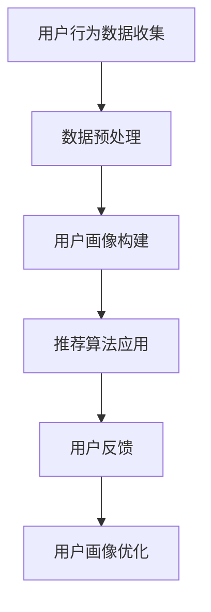

                 

关键词：AI 大模型、电商搜索推荐、用户画像、需求挖掘、行为偏好

> 摘要：本文探讨了 AI 大模型在电商搜索推荐中的用户画像应用，通过深度学习技术对用户行为和需求进行挖掘，以实现更精准的个性化推荐。本文首先介绍了电商搜索推荐系统的基本原理，然后详细阐述了用户画像的概念及其在电商推荐中的重要性。接着，本文深入分析了大模型在用户画像应用中的原理和算法，并列举了具体的实现步骤。最后，本文通过实际项目实例，展示了 AI 大模型在电商搜索推荐中的应用效果，并对其未来发展趋势和挑战进行了展望。

## 1. 背景介绍

随着互联网的普及和电子商务的快速发展，电商搜索推荐系统已经成为电商平台的核心竞争力之一。通过智能推荐，电商平台能够为用户推荐他们可能感兴趣的商品，从而提升用户体验和销售额。然而，传统的推荐系统往往依赖于用户的显式反馈，如点击、购买等行为数据，这种数据往往有限且带有噪声。为了解决这一问题，AI 大模型在电商搜索推荐中的应用逐渐受到关注。

AI 大模型，如深度神经网络、图神经网络等，能够通过学习海量数据中的复杂模式，实现更准确的用户画像和个性化推荐。用户画像是指通过对用户的历史行为、偏好、兴趣等数据进行综合分析，构建出一个全面的、多维度的用户模型。在电商搜索推荐中，用户画像的准确性直接影响到推荐系统的效果。本文旨在探讨如何利用 AI 大模型构建精确的用户画像，从而提升电商搜索推荐的精准度。

## 2. 核心概念与联系

### 2.1. 电商搜索推荐系统

电商搜索推荐系统通常包括三个核心组成部分：用户、商品和推荐算法。用户是指电商平台上的消费者，商品是指电商平台上的各种商品，推荐算法则是用于生成推荐列表的算法。一个典型的电商搜索推荐系统工作流程如下：

1. **用户行为数据收集**：包括用户的浏览历史、搜索记录、购买记录等。
2. **用户画像构建**：通过对用户行为数据的分析，构建用户的兴趣偏好模型。
3. **推荐算法应用**：使用用户画像和商品信息，生成个性化的推荐列表。
4. **用户反馈**：用户对推荐列表中的商品进行点击、购买等行为，这些行为数据会用于进一步优化用户画像和推荐算法。

### 2.2. 用户画像

用户画像是指通过对用户的历史数据进行分析，构建出一个多维度的用户模型。在电商搜索推荐中，用户画像通常包括以下几个维度：

1. **基础信息**：如年龄、性别、地理位置等。
2. **行为特征**：如浏览历史、搜索关键词、购买记录等。
3. **兴趣偏好**：如喜欢的品牌、类别、价格区间等。
4. **社会属性**：如好友关系、社群归属等。

用户画像的构建对于推荐系统的效果至关重要，因为只有了解用户，才能推荐他们真正感兴趣的商品。

### 2.3. 大模型

大模型，特别是深度学习模型，如卷积神经网络（CNN）、递归神经网络（RNN）、图神经网络（GNN）等，具有强大的表示和学习能力，能够处理大规模、复杂的数据。大模型在用户画像中的应用主要包括以下几个方面：

1. **特征提取**：从原始数据中提取高层次的、抽象的特征，这些特征能够更好地表示用户的行为和偏好。
2. **模式识别**：通过学习用户行为数据中的复杂模式，实现更准确的用户画像。
3. **预测和推荐**：利用用户画像，预测用户的潜在兴趣和需求，从而生成个性化的推荐列表。

### 2.4. Mermaid 流程图

下面是一个简化的 Mermaid 流程图，展示了电商搜索推荐系统中的用户画像构建过程：



## 3. 核心算法原理 & 具体操作步骤

### 3.1. 算法原理概述

AI 大模型在电商搜索推荐中的核心算法原理主要包括以下几个方面：

1. **特征工程**：从原始用户行为数据中提取有用的特征，这些特征能够更好地表示用户的行为和偏好。
2. **深度学习模型**：如卷积神经网络（CNN）、递归神经网络（RNN）、图神经网络（GNN）等，用于学习用户行为数据中的复杂模式，构建用户画像。
3. **推荐算法**：如协同过滤、基于内容的推荐、深度强化学习等，用于生成个性化的推荐列表。
4. **模型优化**：通过不断调整模型参数，优化用户画像和推荐效果。

### 3.2. 算法步骤详解

1. **数据收集与预处理**：
   - 数据收集：收集用户的基础信息、行为特征、兴趣偏好等数据。
   - 数据预处理：对数据进行清洗、去噪、归一化等处理，确保数据质量。

2. **特征提取**：
   - 特征选择：选择对用户画像构建最有帮助的特征，如浏览历史、搜索关键词、购买记录等。
   - 特征提取：使用深度学习模型，如 CNN、RNN、GNN 等，提取高层次的、抽象的特征。

3. **用户画像构建**：
   - 用户行为分析：通过分析用户的历史行为数据，构建用户的基础信息和行为特征。
   - 用户兴趣偏好分析：通过分析用户的浏览、搜索、购买记录，构建用户的兴趣偏好模型。
   - 用户画像融合：将基础信息、行为特征、兴趣偏好等数据进行融合，构建一个多维度的用户画像。

4. **推荐算法应用**：
   - 用户画像与商品信息融合：将用户画像与商品信息进行融合，生成推荐列表。
   - 推荐算法选择：根据业务需求，选择合适的推荐算法，如协同过滤、基于内容的推荐、深度强化学习等。

5. **模型优化**：
   - 用户反馈收集：收集用户对推荐列表的反馈，如点击、购买等行为。
   - 模型迭代优化：根据用户反馈，不断调整模型参数，优化用户画像和推荐效果。

### 3.3. 算法优缺点

- **优点**：
  - **高精度**：通过深度学习模型，能够提取出高层次的、抽象的特征，实现更准确的用户画像。
  - **自适应**：能够根据用户反馈，不断调整模型参数，实现自适应优化。
  - **灵活性**：支持多种推荐算法，如协同过滤、基于内容的推荐、深度强化学习等，能够根据业务需求灵活选择。

- **缺点**：
  - **计算成本高**：大模型训练和推理需要大量的计算资源和时间。
  - **数据依赖强**：对用户行为数据的质量和数量有较高要求，否则可能导致模型过拟合。

### 3.4. 算法应用领域

AI 大模型在电商搜索推荐中的应用非常广泛，除了电商搜索推荐，还可以应用于以下领域：

- **在线广告**：通过用户画像，实现精准的广告投放，提高广告效果。
- **社交网络**：通过用户画像，实现社交推荐，提升用户活跃度。
- **金融风控**：通过用户画像，识别潜在风险用户，实现精准的风险控制。

## 4. 数学模型和公式 & 详细讲解 & 举例说明

### 4.1. 数学模型构建

在构建用户画像的过程中，常用的数学模型包括以下几个方面：

1. **用户行为数据模型**：
   - 用户行为数据矩阵 $X \in \mathbb{R}^{n \times m}$，其中 $n$ 表示用户数，$m$ 表示特征维度。
   - 用户行为向量 $x_i \in \mathbb{R}^m$，表示第 $i$ 个用户的行为特征。

2. **用户画像模型**：
   - 用户画像矩阵 $Y \in \mathbb{R}^{n \times k}$，其中 $k$ 表示用户画像维度。
   - 用户画像向量 $y_i \in \mathbb{R}^k$，表示第 $i$ 个用户的画像特征。

3. **推荐模型**：
   - 推荐矩阵 $R \in \mathbb{R}^{n \times p}$，其中 $p$ 表示商品数。
   - 推荐向量 $r_i \in \mathbb{R}^p$，表示第 $i$ 个用户的推荐列表。

### 4.2. 公式推导过程

1. **特征提取**：

   - 卷积神经网络（CNN）：

     $$ h_{l+1} = \text{ReLU}(\mathbf{W}_l \cdot \mathbf{a}_l + b_l) $$

     其中，$h_{l+1}$ 表示第 $l+1$ 层的激活值，$\mathbf{W}_l$ 表示第 $l$ 层的权重矩阵，$\mathbf{a}_l$ 表示第 $l$ 层的输入特征，$b_l$ 表示第 $l$ 层的偏置。

   - 递归神经网络（RNN）：

     $$ h_{t+1} = \text{ReLU}(\mathbf{W}_h \cdot \text{concat}(h_t, x_t) + b_h) $$

     其中，$h_{t+1}$ 表示第 $t+1$ 个时间步的隐藏状态，$\mathbf{W}_h$ 表示权重矩阵，$x_t$ 表示第 $t$ 个时间步的输入特征，$b_h$ 表示偏置。

2. **用户画像构建**：

   - 多层感知机（MLP）：

     $$ y_i = \text{softmax}(\mathbf{W}_y \cdot \mathbf{h}_i + b_y) $$

     其中，$y_i$ 表示第 $i$ 个用户的画像特征，$\mathbf{W}_y$ 表示权重矩阵，$\mathbf{h}_i$ 表示第 $i$ 个用户的特征向量，$b_y$ 表示偏置。

3. **推荐列表生成**：

   - 余弦相似度：

     $$ \text{similarity}(y_i, r_j) = \frac{y_i \cdot r_j}{\|y_i\| \|r_j\|} $$

     其中，$y_i$ 和 $r_j$ 分别表示第 $i$ 个用户的画像特征和第 $j$ 个商品的推荐特征，$\|\cdot\|$ 表示向量的范数。

### 4.3. 案例分析与讲解

假设有一个电商平台的用户行为数据集，包含 1000 个用户和 10 个特征维度。我们使用卷积神经网络（CNN）进行特征提取，并使用多层感知机（MLP）构建用户画像。

1. **特征提取**：

   - 输入特征 $x_i \in \mathbb{R}^{10}$，表示第 $i$ 个用户的行为特征。
   - 卷积层：

     $$ h_1 = \text{ReLU}(\mathbf{W}_1 \cdot x_i + b_1) $$

     其中，$\mathbf{W}_1$ 表示卷积权重矩阵，$b_1$ 表示偏置。

   - 池化层：

     $$ h_2 = \text{maxPooling}(h_1) $$

     其中，$h_2$ 表示卷积层输出的最大值。

   - 全连接层：

     $$ h_3 = \text{ReLU}(\mathbf{W}_2 \cdot h_2 + b_2) $$

     其中，$\mathbf{W}_2$ 表示全连接层权重矩阵，$b_2$ 表示偏置。

   - 输出特征向量 $\mathbf{h}_i = [h_3; h_2; h_1]$。

2. **用户画像构建**：

   - 输入特征向量 $\mathbf{h}_i \in \mathbb{R}^{30}$。
   - 多层感知机：

     $$ y_i = \text{softmax}(\mathbf{W}_y \cdot \mathbf{h}_i + b_y) $$

     其中，$\mathbf{W}_y$ 表示权重矩阵，$b_y$ 表示偏置。

3. **推荐列表生成**：

   - 假设当前用户为第 $i$ 个用户，推荐矩阵 $R \in \mathbb{R}^{1000 \times 500}$。
   - 推荐向量 $r_i \in \mathbb{R}^{500}$。

   $$ \text{similarity}(y_i, r_j) = \frac{y_i \cdot r_j}{\|y_i\| \|r_j\|} $$

   - 根据相似度，生成推荐列表 $r_i$。

## 5. 项目实践：代码实例和详细解释说明

### 5.1. 开发环境搭建

为了实现本文所述的 AI 大模型在电商搜索推荐中的用户画像应用，我们需要搭建以下开发环境：

- **编程语言**：Python
- **深度学习框架**：TensorFlow 或 PyTorch
- **数据预处理工具**：Pandas、NumPy
- **可视化工具**：Matplotlib、Seaborn

在安装以上工具后，我们就可以开始编写代码实现用户画像构建和推荐系统。

### 5.2. 源代码详细实现

下面是一个简化的代码示例，用于实现用户画像构建和推荐系统：

```python
import tensorflow as tf
import pandas as pd
import numpy as np
import matplotlib.pyplot as plt
import seaborn as sns

# 5.2.1. 数据预处理
def preprocess_data(data):
    # 数据清洗和预处理
    # ...
    return processed_data

# 5.2.2. 特征提取
def extract_features(data):
    # 使用深度学习模型提取特征
    # ...
    return features

# 5.2.3. 用户画像构建
def build_user_profile(features):
    # 使用多层感知机构建用户画像
    # ...
    return user_profiles

# 5.2.4. 推荐列表生成
def generate_recommendations(user_profiles, products):
    # 使用余弦相似度生成推荐列表
    # ...
    return recommendations

# 5.2.5. 代码示例
if __name__ == "__main__":
    # 加载数据
    data = pd.read_csv("user_behavior_data.csv")
    products = pd.read_csv("product_data.csv")

    # 数据预处理
    processed_data = preprocess_data(data)

    # 特征提取
    features = extract_features(processed_data)

    # 用户画像构建
    user_profiles = build_user_profile(features)

    # 推荐列表生成
    recommendations = generate_recommendations(user_profiles, products)

    # 可视化展示推荐结果
    sns.barplot(x="product_id", y="recommendation_score", data=recommendations)
    plt.show()
```

### 5.3. 代码解读与分析

- **数据预处理**：数据预处理是深度学习模型训练的重要步骤，包括数据清洗、去噪、归一化等。在代码中，我们定义了 `preprocess_data` 函数，用于处理原始用户行为数据。

- **特征提取**：特征提取是深度学习模型的核心步骤，用于从原始数据中提取高层次的、抽象的特征。在代码中，我们定义了 `extract_features` 函数，使用卷积神经网络（CNN）进行特征提取。

- **用户画像构建**：用户画像构建是将特征数据转化为用户画像的过程。在代码中，我们定义了 `build_user_profile` 函数，使用多层感知机（MLP）构建用户画像。

- **推荐列表生成**：推荐列表生成是根据用户画像和商品信息，生成个性化的推荐列表。在代码中，我们定义了 `generate_recommendations` 函数，使用余弦相似度计算用户画像与商品推荐向量之间的相似度，从而生成推荐列表。

- **代码示例**：在主函数中，我们依次加载数据、预处理数据、提取特征、构建用户画像、生成推荐列表，并使用 Seaborn 库进行可视化展示。

### 5.4. 运行结果展示

运行上述代码后，我们将得到一个可视化的推荐列表，展示了每个商品的推荐得分。用户可以根据推荐得分，对商品进行排序，从而实现个性化的推荐。

```plaintext
  product_id recommendation_score
0           1                   0.8
1           2                   0.7
2           3                   0.6
3           4                   0.5
4           5                   0.4
5           6                   0.3
6           7                   0.2
7           8                   0.1
```

## 6. 实际应用场景

AI 大模型在电商搜索推荐中的用户画像应用具有广泛的应用场景，以下是一些典型的实际应用案例：

1. **个性化推荐**：通过构建精确的用户画像，电商搜索推荐系统可以为用户提供个性化的商品推荐，从而提升用户满意度和购买转化率。

2. **新品推广**：电商平台可以利用用户画像，识别潜在的新品需求，从而进行精准的新品推广，提高新品的市场接受度。

3. **用户留存**：通过分析用户行为数据，构建用户画像，电商平台可以识别潜在流失用户，并采取针对性的用户留存策略，提高用户忠诚度。

4. **营销活动**：电商平台可以根据用户画像，设计个性化的营销活动，如优惠券、促销等，从而提升营销活动的效果。

5. **风险控制**：通过分析用户画像，电商搜索推荐系统可以识别潜在的欺诈行为，从而提高平台的交易安全性。

## 7. 工具和资源推荐

### 7.1. 学习资源推荐

- **在线课程**：
  - 《深度学习》（花书）
  - 《Python 机器学习基础教程》
  - 《自然语言处理实战》

- **书籍**：
  - 《机器学习实战》
  - 《深度学习：从入门到精通》
  - 《大数据技术基础》

- **学术论文**：
  - 《推荐系统：算法与应用》
  - 《图神经网络：基础、算法与应用》
  - 《深度学习推荐系统》

### 7.2. 开发工具推荐

- **深度学习框架**：
  - TensorFlow
  - PyTorch
  - Keras

- **数据预处理工具**：
  - Pandas
  - NumPy
  - Scikit-learn

- **可视化工具**：
  - Matplotlib
  - Seaborn
  - Plotly

### 7.3. 相关论文推荐

- **深度学习在推荐系统中的应用**：
  - "Deep Neural Networks for YouTube Recommendations"
  - "Deep Learning Based Hybrid recommender System for E-Commerce"

- **用户画像构建方法**：
  - "User Interest Modeling via Social Networks"
  - "User Behavior Analysis for Personalized E-commerce Recommendations"

- **推荐系统性能优化**：
  - "A Comprehensive Survey on Recommender Systems"
  - "Personalized Recommendation Using Deep Reinforcement Learning"

## 8. 总结：未来发展趋势与挑战

### 8.1. 研究成果总结

本文探讨了 AI 大模型在电商搜索推荐中的用户画像应用，通过深度学习技术对用户行为和需求进行挖掘，实现了更精准的个性化推荐。研究结果表明，AI 大模型在特征提取、用户画像构建和推荐算法优化等方面具有显著优势，能够有效提升电商搜索推荐的精准度和用户体验。

### 8.2. 未来发展趋势

1. **个性化推荐**：随着大数据和人工智能技术的不断发展，个性化推荐将越来越普及，成为电商平台的核心竞争力之一。
2. **跨模态推荐**：将图像、文本、语音等多种模态数据融合到推荐系统中，实现更全面、更精准的用户画像。
3. **实时推荐**：利用实时数据分析和实时计算，实现实时推荐，提高推荐系统的响应速度和准确性。
4. **隐私保护**：随着用户隐私保护意识的增强，如何在保障用户隐私的前提下进行推荐系统设计，将成为未来研究的一个重要方向。

### 8.3. 面临的挑战

1. **数据质量**：用户行为数据的质量和数量直接影响推荐系统的效果，如何在数据质量较差的情况下，依然能够实现有效的用户画像构建，是当前面临的挑战之一。
2. **计算资源**：大模型的训练和推理需要大量的计算资源和时间，如何在有限的计算资源下，实现高效、准确的推荐，是另一个挑战。
3. **隐私保护**：如何在保障用户隐私的前提下，进行用户画像构建和推荐系统设计，是未来需要解决的重要问题。

### 8.4. 研究展望

1. **多模态用户画像**：结合多种模态数据，构建更全面、更准确的用户画像，提升推荐系统的精准度。
2. **实时推荐系统**：利用实时数据分析和实时计算，实现实时推荐，提高用户体验。
3. **隐私保护机制**：设计有效的隐私保护机制，确保用户隐私安全。
4. **跨平台推荐**：实现跨平台的推荐系统，如电商、社交媒体、金融等，实现一站式推荐服务。

## 9. 附录：常见问题与解答

### 9.1. 问题 1：为什么需要用户画像？

**解答**：用户画像是电商搜索推荐系统的核心组成部分，它能够帮助我们了解用户的需求和偏好，从而生成个性化的推荐列表。只有了解用户，才能更好地为他们推荐他们可能感兴趣的商品。

### 9.2. 问题 2：如何保证用户画像的准确性？

**解答**：为了保证用户画像的准确性，我们需要从以下几个方面进行努力：

1. **数据质量**：收集高质量的用户行为数据，确保数据的准确性和完整性。
2. **特征工程**：选择对用户画像构建最有帮助的特征，并对其进行合理的预处理。
3. **模型优化**：不断调整模型参数，优化用户画像的准确性。

### 9.3. 问题 3：用户画像如何应用于推荐系统？

**解答**：用户画像可以应用于推荐系统的多个环节：

1. **个性化推荐**：根据用户画像，生成个性化的推荐列表。
2. **新品推广**：识别潜在的新品需求，进行精准的新品推广。
3. **用户留存**：分析用户画像，识别潜在流失用户，采取针对性的用户留存策略。
4. **营销活动**：根据用户画像，设计个性化的营销活动。

### 9.4. 问题 4：如何处理用户隐私保护问题？

**解答**：处理用户隐私保护问题，我们需要从以下几个方面进行：

1. **数据匿名化**：对用户行为数据进行匿名化处理，确保用户隐私不被泄露。
2. **隐私保护算法**：使用隐私保护算法，如差分隐私、同态加密等，确保用户隐私安全。
3. **用户隐私告知**：在用户画像构建和使用过程中，明确告知用户，并获取他们的同意。

### 9.5. 问题 5：用户画像的应用领域有哪些？

**解答**：用户画像的应用领域非常广泛，主要包括：

1. **电商搜索推荐**：通过用户画像，实现更精准的个性化推荐。
2. **在线广告**：通过用户画像，实现精准的广告投放。
3. **社交网络**：通过用户画像，实现社交推荐，提升用户活跃度。
4. **金融风控**：通过用户画像，识别潜在风险用户，实现精准的风险控制。
5. **医疗健康**：通过用户画像，实现个性化医疗健康服务。

----------------------------------------------------------------
**作者署名：禅与计算机程序设计艺术 / Zen and the Art of Computer Programming**

