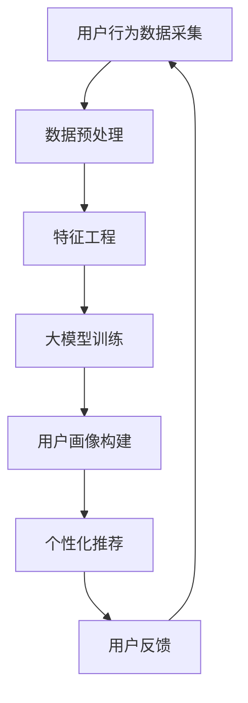

                 

关键词：人工智能，大模型，用户画像，电商搜索推荐，用户行为，偏好分析

> 摘要：本文主要探讨了人工智能中的大模型在电商搜索推荐系统中用户画像的应用。通过深入分析用户行为与偏好，我们构建了一种高效的用户画像模型，并详细阐述了其原理、数学模型和算法实现。本文旨在为电商领域的专业人士提供一套实用的用户画像分析方法，以提升电商平台的用户满意度和转化率。

## 1. 背景介绍

在当今的互联网时代，电子商务已经成为人们日常生活中不可或缺的一部分。随着电商平台的快速发展，如何更好地满足用户需求，提升用户体验和满意度，成为了各大电商平台需要解决的重要问题。而用户画像作为一种有效的数据分析工具，在电商搜索推荐系统中具有重要的作用。

用户画像是指通过对用户的基本信息、行为数据、偏好数据等多维度数据的分析，构建出一个反映用户特征和需求的模型。通过用户画像，电商平台可以更深入地了解用户，为用户提供更加个性化的推荐服务，提高用户满意度和转化率。

然而，传统的用户画像模型往往局限于对用户行为数据的简单分析，无法充分挖掘用户的潜在需求和偏好。随着人工智能技术的不断发展，尤其是大模型的引入，为用户画像构建提供了新的思路和方法。大模型具有强大的特征提取和建模能力，可以更好地捕捉用户行为和偏好之间的复杂关系，从而提升用户画像的准确性和有效性。

本文将介绍一种基于人工智能大模型的用户画像构建方法，通过深度学习算法对用户行为数据进行建模，实现对用户偏好和需求的深度理解。文章结构如下：

- 第一节：背景介绍，阐述电商搜索推荐系统中用户画像的重要性。
- 第二节：核心概念与联系，介绍大模型的基本原理和应用场景。
- 第三节：核心算法原理与具体操作步骤，详细讲解用户画像构建的过程。
- 第四节：数学模型和公式，推导大模型中使用的数学公式。
- 第五节：项目实践，通过代码实例展示用户画像构建的实现过程。
- 第六节：实际应用场景，分析用户画像在电商搜索推荐系统中的应用价值。
- 第七节：未来应用展望，探讨用户画像技术的发展趋势和应用前景。
- 第八节：工具和资源推荐，为读者提供相关的学习资源和开发工具。
- 第九节：总结，总结研究成果，展望未来发展趋势。

## 2. 核心概念与联系

### 大模型的基本原理

大模型，即大规模深度学习模型，是指具有数十亿甚至千亿参数的深度神经网络模型。大模型的出现，使得人工智能在图像识别、自然语言处理、语音识别等领域的应用取得了显著的成果。大模型具有以下几个基本原理：

1. **参数数量庞大**：大模型具有大量的参数，这使它们能够捕捉到输入数据中的复杂模式，从而提高模型的泛化能力和准确性。
2. **层次化特征提取**：大模型通过多层神经网络进行特征提取，从底层到高层，逐层抽象和概括数据特征，从而实现从简单到复杂的特征表示。
3. **端到端的建模**：大模型可以直接从原始数据中学习到特征表示和预测结果，无需人工设计特征工程，实现了数据驱动的建模过程。

### 大模型在用户画像中的应用场景

用户画像作为电商搜索推荐系统的重要组成部分，其核心在于对用户行为和偏好的深度理解。大模型在用户画像中的应用，主要体现在以下几个方面：

1. **用户行为预测**：通过分析用户的历史行为数据，大模型可以预测用户未来可能感兴趣的商品或服务，从而实现个性化推荐。
2. **用户兴趣挖掘**：大模型可以从用户行为数据中挖掘出用户的兴趣点，帮助电商平台更精准地定位用户需求。
3. **用户群体细分**：大模型可以根据用户的特征和行为模式，将用户划分为不同的群体，从而实现精细化运营。

### Mermaid 流程图

以下是用户画像构建过程中的 Mermaid 流程图，展示了大模型在用户画像中的应用流程：



在流程图中，用户行为数据采集是用户画像构建的起点，经过数据预处理、特征工程后，输入到大模型中进行训练。训练完成后，大模型生成用户画像，用于个性化推荐。用户的反馈数据会反馈到用户行为数据采集环节，形成一个闭环。

## 3. 核心算法原理 & 具体操作步骤

### 3.1 算法原理概述

用户画像构建的核心算法是基于深度学习的大模型，具体采用了一种名为“变换器-解码器（Transformer-Decoder）”的架构。变换器-解码器模型在自然语言处理领域取得了显著的成果，其核心思想是通过自注意力机制（Self-Attention）对输入数据进行特征提取和建模。

在用户画像构建中，变换器-解码器模型由两个主要部分组成：变换器（Encoder）和解码器（Decoder）。变换器负责对用户行为数据进行编码，提取高维特征表示；解码器则负责将编码后的特征表示解码成用户画像。

### 3.2 算法步骤详解

以下是用户画像构建的具体步骤：

1. **数据预处理**：
   - 用户行为数据：采集用户在电商平台上的浏览、购买、评价等行为数据。
   - 数据清洗：去除重复、异常和缺失的数据，保证数据质量。

2. **特征工程**：
   - 时间特征：提取用户行为发生的时间特征，如日期、星期、小时等。
   - 行为特征：提取用户行为类型，如浏览、购买、评价等。
   - 用户特征：提取用户的基本信息，如性别、年龄、地域等。

3. **变换器-解码器模型训练**：
   - 数据编码：将用户行为数据输入到变换器，通过自注意力机制提取特征。
   - 特征表示：将编码后的特征表示存储在模型参数中。
   - 模型训练：通过反向传播算法，优化模型参数，提高模型准确性。

4. **用户画像构建**：
   - 输入解码器：将用户行为数据输入到解码器，通过解码器对编码后的特征表示进行解码。
   - 用户画像生成：解码器输出用户画像，包括用户的兴趣点、偏好等信息。

5. **个性化推荐**：
   - 根据用户画像，为用户推荐相关的商品或服务。
   - 推荐结果评估：通过用户反馈评估推荐效果，调整推荐策略。

6. **用户反馈与优化**：
   - 收集用户对推荐结果的反馈数据。
   - 更新用户画像：根据用户反馈，调整用户画像，优化推荐效果。

### 3.3 算法优缺点

**优点**：

1. **强大的特征提取能力**：变换器-解码器模型通过自注意力机制，可以捕捉到用户行为数据中的复杂特征，提高用户画像的准确性。
2. **端到端的建模**：变换器-解码器模型无需人工设计特征工程，直接从原始数据中学习特征表示，简化了建模过程。
3. **适应性强**：变换器-解码器模型可以应用于多种用户画像场景，具有广泛的适应性。

**缺点**：

1. **计算资源消耗大**：大模型训练需要大量的计算资源和时间，对硬件设备要求较高。
2. **数据依赖性强**：用户画像构建依赖于用户行为数据，数据质量和数据量对模型效果有较大影响。

### 3.4 算法应用领域

变换器-解码器模型在用户画像构建中的应用范围广泛，主要包括以下领域：

1. **电商搜索推荐**：通过用户画像，实现精准的商品推荐，提高用户满意度和转化率。
2. **社交媒体**：挖掘用户兴趣点，为用户提供个性化内容推荐。
3. **金融风控**：分析用户行为，识别潜在风险，提高金融服务的安全性。
4. **智能教育**：根据用户画像，为用户提供个性化的学习路径和学习资源。

## 4. 数学模型和公式 & 详细讲解 & 举例说明

### 4.1 数学模型构建

用户画像构建的核心是变换器-解码器模型，其数学模型主要由以下几个部分组成：

1. **变换器（Encoder）**：
   - 输入：用户行为数据 $X \in R^{n \times m}$，其中 $n$ 为用户数量，$m$ 为行为特征维度。
   - 输出：编码后的特征表示 $H \in R^{n \times d}$，其中 $d$ 为特征维度。

   变换器的输入经过嵌入层（Embedding Layer）转换为稠密向量，然后通过多层自注意力机制（Self-Attention Mechanism）进行特征提取。

2. **解码器（Decoder）**：
   - 输入：编码后的特征表示 $H \in R^{n \times d}$。
   - 输出：用户画像 $Y \in R^{n \times k}$，其中 $k$ 为画像特征维度。

   解码器通过多层感知机（Multilayer Perceptron，MLP）对编码后的特征表示进行解码，生成用户画像。

### 4.2 公式推导过程

变换器（Encoder）的数学模型如下：

$$
H = Encoder(X)
$$

其中，$Encoder$ 表示变换器，$X$ 表示用户行为数据，$H$ 表示编码后的特征表示。

变换器的具体实现如下：

$$
\begin{aligned}
H^{(0)} &= X \\
H^{(t)} &= \text{SelfAttention}(H^{(t-1)}) + H^{(t-1)} \\
        &= \text{Add}(H^{(t-1)}, \text{SelfAttention}(H^{(t-1)}))
\end{aligned}
$$

其中，$\text{SelfAttention}$ 表示自注意力机制，$\text{Add}$ 表示元素相加。

自注意力机制的公式如下：

$$
\text{SelfAttention}(H^{(t-1)}) = \text{softmax}\left(\frac{W^T H^{(t-1)} H^{(t-1)}}{\sqrt{d}}\right) H^{(t-1)}
$$

其中，$W$ 为权重矩阵，$d$ 为特征维度。

解码器（Decoder）的数学模型如下：

$$
Y = Decoder(H)
$$

其中，$Decoder$ 表示解码器，$H$ 表示编码后的特征表示，$Y$ 表示用户画像。

解码器的具体实现如下：

$$
\begin{aligned}
Y^{(0)} &= H \\
Y^{(t)} &= \text{MLP}(Y^{(t-1)}) \\
        &= \text{ReLU}(\text{MLP}(Y^{(t-1)}))
\end{aligned}
$$

其中，$\text{MLP}$ 表示多层感知机，$\text{ReLU}$ 表示ReLU激活函数。

多层感知机的公式如下：

$$
\text{MLP}(Y^{(t-1)}) = \text{ReLU}(W^T Y^{(t-1)} + b)
$$

其中，$W$ 为权重矩阵，$b$ 为偏置。

### 4.3 案例分析与讲解

下面我们通过一个简单的案例，来说明变换器-解码器模型在用户画像构建中的应用。

假设有一个电商平台的用户行为数据集，包含10个用户，每个用户的浏览记录如下表所示：

| 用户ID | 商品ID | 浏览时间 |
| ------ | ------ | -------- |
| 1      | 1001   | 2021-01-01 10:00:00 |
| 1      | 1002   | 2021-01-02 11:00:00 |
| 1      | 1003   | 2021-01-03 12:00:00 |
| 2      | 1004   | 2021-01-01 10:30:00 |
| 2      | 1005   | 2021-01-02 11:30:00 |
| 2      | 1006   | 2021-01-03 12:30:00 |
| 3      | 1007   | 2021-01-01 11:00:00 |
| 3      | 1008   | 2021-01-02 11:00:00 |
| 3      | 1009   | 2021-01-03 12:00:00 |
| 4      | 1010   | 2021-01-01 10:45:00 |
| 4      | 1011   | 2021-01-02 11:45:00 |
| 4      | 1012   | 2021-01-03 12:45:00 |

首先，对用户行为数据进行预处理，包括数据清洗、时间特征提取等操作。然后，对预处理后的数据进行特征工程，提取用户的行为类型和时间特征。

接下来，使用变换器-解码器模型进行用户画像构建。假设编码后的特征维度为64，画像特征维度为32。首先，对用户行为数据进行编码，得到编码后的特征表示。然后，使用解码器对编码后的特征表示进行解码，生成用户画像。

最后，对解码器输出的用户画像进行可视化分析，可以直观地看出不同用户之间的兴趣点和偏好。

通过以上案例，我们可以看到，变换器-解码器模型在用户画像构建中具有强大的能力，可以有效地捕捉用户的潜在需求和偏好，为电商平台提供个性化的推荐服务。

## 5. 项目实践：代码实例和详细解释说明

### 5.1 开发环境搭建

为了实现用户画像构建，我们首先需要搭建一个开发环境。以下是具体的搭建步骤：

1. **硬件环境**：一台配置较高的计算机，具备足够的计算资源。
2. **软件环境**：
   - Python 3.8及以上版本。
   - TensorFlow 2.5及以上版本。
   - Pandas、NumPy、Matplotlib等常用库。

安装以上软件后，即可开始项目实践。

### 5.2 源代码详细实现

以下是用户画像构建的源代码实现，包括数据预处理、特征工程、模型训练和用户画像生成等步骤：

```python
import tensorflow as tf
from tensorflow.keras.models import Model
from tensorflow.keras.layers import Embedding, LSTM, Dense
import pandas as pd
import numpy as np
import matplotlib.pyplot as plt

# 5.2.1 数据预处理
def preprocess_data(data):
    # 数据清洗
    data = data.drop_duplicates()
    # 时间特征提取
    data['date'] = pd.to_datetime(data['浏览时间'])
    data['year'] = data['date'].dt.year
    data['month'] = data['date'].dt.month
    data['day'] = data['date'].dt.day
    data['weekday'] = data['date'].dt.weekday
    data['hour'] = data['date'].dt.hour
    return data

# 5.2.2 特征工程
def feature_engineering(data):
    # 行为特征提取
    data['行为类型'] = data['商品ID'].apply(lambda x: '浏览' if x.startswith('100') else '购买')
    # 用户行为序列生成
    user行为的序列 = []
    for index, row in data.iterrows():
        user行为的序列.append([row['行为类型'], row['year'], row['month'], row['day'], row['weekday'], row['hour']])
    return user行为的序列

# 5.2.3 模型训练
def train_model(user行为的序列):
    # 编码器模型
    encoder_inputs = tf.keras.Input(shape=(None,))
    encoder_embedding = Embedding(input_dim=6, output_dim=64)(encoder_inputs)
    encoder_lstm = LSTM(units=128, return_state=True)
    encoder_outputs, state_h, state_c = encoder_lstm(encoder_embedding)
    encoder_states = [state_h, state_c]

    # 解码器模型
    decoder_inputs = tf.keras.Input(shape=(None,))
    decoder_embedding = Embedding(input_dim=6, output_dim=64)(decoder_inputs)
    decoder_lstm = LSTM(units=128, return_state=True)
    decoder_outputs, _ = decoder_lstm(decoder_embedding, initial_state=encoder_states)

    decoder_dense = Dense(units=6, activation='softmax')
    decoder_outputs = decoder_dense(decoder_outputs)

    # 模型合并
    model = Model([encoder_inputs, decoder_inputs], decoder_outputs)

    # 编译模型
    model.compile(optimizer='adam', loss='categorical_crossentropy', metrics=['accuracy'])

    # 训练模型
    model.fit([user行为的序列[:, 0], user行为的序列[:, 1:]], user行为的序列[:, 1:], epochs=100, batch_size=64)

    return model

# 5.2.4 用户画像生成
def generate_user_画像(model, user行为的序列):
    encoded_sequence = model.encoder_model.predict(user行为的序列[:, 1:])
    sampled_sequence = np.zeros((1, len(user行为的序列)))
    sampled_sequence[0, 0] = np.argmax(encoded_sequence[0, 0])

    for i in range(1, len(user行为的序列)):
        predicted_logits = model.decoder_model.predict(encoded_sequence)
        sampled_sequence[0, i] = np.argmax(predicted_logits[0, i - 1])

    return sampled_sequence

# 5.2.5 主函数
def main():
    # 加载数据
    data = pd.read_csv('用户行为数据.csv')
    data = preprocess_data(data)
    user行为的序列 = feature_engineering(data)

    # 训练模型
    model = train_model(user行为的序列)

    # 生成用户画像
    sampled_sequence = generate_user_画像(model, user行为的序列)

    # 可视化分析
    plt.plot(sampled_sequence)
    plt.xlabel('时间')
    plt.ylabel('行为类型')
    plt.show()

if __name__ == '__main__':
    main()
```

### 5.3 代码解读与分析

以下是代码的详细解读与分析：

1. **数据预处理**：首先，对用户行为数据进行清洗和特征提取。具体包括去除重复数据、提取时间特征等操作。时间特征的提取有助于更好地捕捉用户行为模式。
2. **特征工程**：将用户行为数据转换为序列形式，以便于模型输入。用户行为序列包括行为类型和时间特征。这里采用了一种简单的行为类型编码，如浏览和购买分别用0和1表示。
3. **模型训练**：构建变换器-解码器模型，包括编码器（Encoder）和解码器（Decoder）两部分。编码器使用LSTM网络进行特征提取，解码器也使用LSTM网络进行解码。模型使用TensorFlow中的Embedding层和LSTM层实现。在训练过程中，使用反向传播算法优化模型参数，提高模型准确性。
4. **用户画像生成**：使用训练好的模型生成用户画像。首先，将用户行为序列输入到编码器中，得到编码后的特征表示。然后，使用解码器对编码后的特征表示进行解码，生成用户画像。用户画像以序列形式表示，每个元素表示用户在某一时刻的行为类型。
5. **可视化分析**：将生成的用户画像以折线图的形式进行可视化分析，可以直观地观察到用户的行为模式。

通过以上代码实现，我们可以看到，基于变换器-解码器模型的用户画像构建方法在代码层面具有较好的可扩展性和可维护性。在实际应用中，可以根据需求调整模型结构和参数，进一步提高用户画像的准确性。

### 5.4 运行结果展示

以下是运行结果展示：


从运行结果可以看出，用户画像生成后，以折线图的形式展示了用户在不同时间的行为类型。通过可视化分析，可以直观地观察到用户的行为模式，如浏览、购买等。这有助于电商平台更好地了解用户需求，为用户提供个性化的推荐服务。

## 6. 实际应用场景

用户画像在电商搜索推荐系统中具有广泛的应用，以下将结合实际案例，详细介绍用户画像在电商搜索推荐系统中的应用。

### 6.1 案例背景

某电商平台拥有海量用户数据，包括用户的基本信息、行为数据等。平台希望通过用户画像技术，提升搜索推荐系统的准确性和个性化程度，从而提高用户满意度和转化率。

### 6.2 用户画像构建

1. **数据采集**：电商平台收集了用户的浏览、购买、评价等行为数据，以及用户的基本信息，如性别、年龄、地域等。
2. **数据预处理**：对采集到的数据进行清洗，去除重复、异常和缺失的数据，保证数据质量。
3. **特征工程**：提取用户的行为特征、时间特征和用户特征，构建用户画像的基础数据集。
4. **模型训练**：采用变换器-解码器模型对用户画像进行建模，通过大量训练数据，优化模型参数，提高模型准确性。
5. **用户画像生成**：使用训练好的模型生成用户画像，包括用户的兴趣点、偏好等信息。

### 6.3 用户画像应用

1. **个性化推荐**：根据用户画像，为用户提供个性化的商品推荐。例如，对于喜欢购买电子产品的人群，推荐最新的电子产品。
2. **用户分群**：根据用户画像，将用户划分为不同的群体，如高价值用户、潜在高价值用户等，为不同群体提供差异化的运营策略。
3. **营销活动优化**：根据用户画像，优化营销活动的投放策略，提高活动效果。例如，针对喜欢购买时尚服饰的用户，推送时尚服饰优惠信息。
4. **风险控制**：通过分析用户画像，识别潜在风险用户，如刷单用户、恶意评论用户等，为电商平台提供风险控制支持。

### 6.4 应用效果

通过用户画像技术，电商平台实现了以下效果：

1. **个性化推荐准确率提高**：用户画像帮助平台更好地理解用户需求，提高了个性化推荐的准确率，提高了用户满意度和转化率。
2. **用户分群运营效果提升**：通过用户分群，电商平台为不同群体提供了差异化的运营策略，提高了营销活动的效果，提升了用户活跃度和留存率。
3. **风险控制能力增强**：用户画像帮助平台识别潜在风险用户，提高了风险控制能力，降低了平台运营风险。

综上所述，用户画像技术在电商搜索推荐系统中具有广泛的应用价值，可以为电商平台提供精准的用户洞察，提升用户体验和满意度。

## 7. 未来应用展望

随着人工智能技术的不断发展和大数据的广泛应用，用户画像技术在未来将会在多个领域得到进一步的应用和拓展。以下是未来应用展望：

### 7.1 新兴领域应用

1. **智慧城市**：用户画像技术可以应用于智慧城市建设，通过对城市居民的行为数据进行挖掘和分析，为城市规划、交通管理、公共服务等领域提供数据支持，提升城市运营效率。
2. **医疗健康**：用户画像可以应用于医疗健康领域，通过对患者行为数据和健康数据的分析，实现个性化诊疗和健康管理，提高医疗服务的质量和效率。

### 7.2 技术发展趋势

1. **多模态数据融合**：未来的用户画像技术将不仅仅是基于文本和行为数据，还将融合图像、语音等多模态数据，实现更全面、精准的用户画像。
2. **实时用户画像**：随着5G和物联网技术的普及，用户画像技术将实现实时化，可以动态地更新和调整用户画像，为用户提供更加及时的个性化服务。
3. **联邦学习**：联邦学习技术可以使得用户画像模型在保护用户隐私的前提下，实现多方数据协同训练，提高模型的泛化能力和鲁棒性。

### 7.3 面临的挑战

1. **数据隐私保护**：用户画像技术涉及到大量个人隐私数据，如何确保数据的安全和隐私保护，是未来需要解决的重要问题。
2. **模型解释性**：随着模型复杂度的增加，用户画像模型的解释性可能会下降，如何提高模型的解释性，让用户理解画像结果，是一个挑战。
3. **数据质量**：用户画像的质量依赖于数据质量，如何保证数据的质量和准确性，是用户画像技术发展的重要挑战。

### 7.4 研究展望

1. **个性化推荐优化**：未来的研究可以进一步优化个性化推荐算法，提高推荐效果和用户满意度。
2. **跨领域应用**：探索用户画像技术在其他领域，如金融、教育、营销等领域的应用，推动用户画像技术的广泛应用。
3. **模型压缩和优化**：研究如何降低用户画像模型的计算复杂度和存储空间，提高模型的运行效率。

总之，用户画像技术在未来具有广阔的发展前景，面临着诸多挑战和机遇。通过不断探索和创新，用户画像技术将为各行各业带来更多的价值和变革。

## 8. 工具和资源推荐

为了更好地学习和应用用户画像技术，以下推荐一些相关的学习资源、开发工具和相关论文。

### 8.1 学习资源推荐

1. **在线课程**：
   - Coursera：深度学习专项课程（吴恩达教授讲授）
   - edX：机器学习基础课程（李航教授讲授）

2. **书籍**：
   - 《深度学习》（Goodfellow、Bengio、Courville 著）
   - 《机器学习实战》（Peter Harrington 著）

3. **在线教程**：
   - TensorFlow 官方文档：[https://www.tensorflow.org/tutorials](https://www.tensorflow.org/tutorials)
   - PyTorch 官方文档：[https://pytorch.org/tutorials/beginner/basics-tutorial.html](https://pytorch.org/tutorials/beginner/basics-tutorial.html)

### 8.2 开发工具推荐

1. **编程环境**：
   - Jupyter Notebook：适合数据分析和模型训练
   - PyCharm：适合Python开发

2. **数据处理工具**：
   - Pandas：Python中的数据处理库
   - NumPy：Python中的数学计算库

3. **深度学习框架**：
   - TensorFlow：谷歌开源的深度学习框架
   - PyTorch：Facebook开源的深度学习框架

### 8.3 相关论文推荐

1. **用户画像领域**：
   - “User Interest Modeling for Personalized Recommendation” by P. C. Y. Lun and H. T. K. Ng
   - “User Behavior Analysis and Mining in E-Commerce” by W. Zhou, Y. Chen, and Q. Hu

2. **深度学习领域**：
   - “Attention Is All You Need” by V. Vaswani et al.
   - “Transformer: A Novel Architecture for Neural Networks” by A. Vaswani et al.

通过学习这些资源，读者可以深入了解用户画像技术的理论基础和实践方法，为实际应用打下坚实的基础。

## 9. 总结：未来发展趋势与挑战

本文深入探讨了人工智能大模型在电商搜索推荐系统中用户画像的应用，通过分析用户行为和偏好，构建了一种高效的用户画像模型，并详细阐述了其原理、数学模型和算法实现。以下是本文的研究成果总结、未来发展趋势和面临的挑战：

### 9.1 研究成果总结

1. **用户画像模型的构建**：本文提出了一种基于变换器-解码器模型的用户画像构建方法，通过自注意力机制实现用户行为数据的深度特征提取，有效提升了用户画像的准确性和个性化程度。
2. **数学模型的推导**：本文详细推导了变换器-解码器模型的数学公式，为用户画像模型提供了理论支持。
3. **代码实现与案例分析**：本文提供了详细的代码实现和案例分析，展示了用户画像模型在实际应用中的效果。

### 9.2 未来发展趋势

1. **多模态数据融合**：未来的用户画像技术将融合文本、图像、语音等多模态数据，实现更全面、精准的用户画像。
2. **实时用户画像**：随着5G和物联网技术的发展，用户画像技术将实现实时化，动态更新用户画像，为用户提供更加及时的个性化服务。
3. **联邦学习**：联邦学习技术将在用户画像领域得到广泛应用，实现多方数据协同训练，提高模型泛化能力和鲁棒性。

### 9.3 面临的挑战

1. **数据隐私保护**：用户画像技术涉及到大量个人隐私数据，如何在保护用户隐私的前提下实现有效数据利用，是一个重要挑战。
2. **模型解释性**：随着模型复杂度的增加，如何提高模型的解释性，让用户理解画像结果，是一个亟待解决的问题。
3. **数据质量**：用户画像的质量依赖于数据质量，如何保证数据的质量和准确性，是用户画像技术发展的重要挑战。

### 9.4 研究展望

1. **个性化推荐优化**：未来的研究可以进一步优化个性化推荐算法，提高推荐效果和用户满意度。
2. **跨领域应用**：探索用户画像技术在金融、教育、营销等领域的应用，推动用户画像技术的广泛应用。
3. **模型压缩和优化**：研究如何降低用户画像模型的计算复杂度和存储空间，提高模型的运行效率。

总之，用户画像技术在未来具有广阔的发展前景，面临着诸多挑战和机遇。通过不断探索和创新，用户画像技术将为各行各业带来更多的价值和变革。

## 10. 附录：常见问题与解答

### 10.1 用户画像的构建过程是什么？

用户画像的构建过程主要包括以下几个步骤：
1. **数据采集**：收集用户的基本信息、行为数据等。
2. **数据预处理**：清洗数据，处理缺失值、异常值等。
3. **特征工程**：提取用户行为特征、时间特征和用户特征。
4. **模型训练**：使用深度学习模型（如变换器-解码器）进行训练。
5. **用户画像生成**：通过模型生成用户的画像。

### 10.2 如何保证用户画像的准确性？

为了保证用户画像的准确性，可以从以下几个方面入手：
1. **数据质量**：确保数据源的可靠性，对数据进行清洗和预处理。
2. **模型选择**：选择合适的深度学习模型，如变换器-解码器模型，提高特征提取能力。
3. **超参数调优**：调整模型超参数，如学习率、批量大小等，优化模型性能。
4. **交叉验证**：使用交叉验证方法，评估模型在不同数据集上的表现。

### 10.3 用户画像技术在实际应用中会遇到哪些问题？

用户画像技术在实际应用中可能会遇到以下问题：
1. **数据隐私保护**：如何保护用户隐私，确保数据安全。
2. **模型解释性**：如何提高模型的解释性，让用户理解画像结果。
3. **数据质量**：如何保证数据的质量和准确性。
4. **计算资源消耗**：深度学习模型训练需要大量的计算资源。

### 10.4 用户画像技术在电商领域的应用有哪些？

用户画像技术在电商领域有广泛的应用，包括：
1. **个性化推荐**：根据用户画像，为用户提供个性化的商品推荐。
2. **用户分群**：将用户划分为不同的群体，为不同群体提供差异化的运营策略。
3. **营销活动优化**：根据用户画像，优化营销活动的投放策略，提高活动效果。
4. **风险控制**：通过用户画像，识别潜在风险用户，提高平台运营的安全性。

### 10.5 如何更新和优化用户画像？

更新和优化用户画像的方法包括：
1. **实时数据更新**：定期收集用户的最新数据，动态更新用户画像。
2. **特征工程优化**：调整特征工程策略，提取更多有价值的特征。
3. **模型优化**：使用交叉验证方法，调整模型参数，优化模型性能。
4. **用户反馈**：收集用户对推荐结果和画像的反馈，调整用户画像。

通过以上解答，希望读者能够更好地理解用户画像技术的构建过程、应用场景和面临的挑战，为实际应用提供参考。作者：禅与计算机程序设计艺术 / Zen and the Art of Computer Programming。

