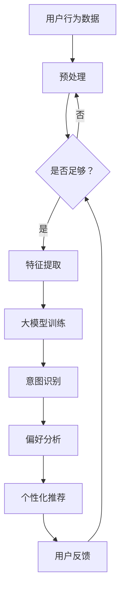

                 

关键词：人工智能，大模型，电商，搜索推荐，用户行为，意图理解，偏好分析。

> 摘要：本文主要探讨人工智能大模型在电商搜索推荐中的用户行为分析，重点研究如何理解用户的意图和偏好，以提高推荐系统的准确性和用户体验。通过分析用户行为数据，大模型可以揭示用户在购物过程中的心理变化和购买决策过程，从而为电商企业提供有效的个性化推荐策略。本文旨在为相关领域的研究者和开发者提供有价值的参考和启示。

## 1. 背景介绍

在电商行业快速发展的今天，搜索引擎推荐系统已经成为提高用户购买意愿和提升销售业绩的关键因素。然而，传统的基于关键词匹配和协同过滤的推荐算法在应对复杂用户行为和多样化需求时存在诸多局限性。为了更好地满足用户需求，提高推荐系统的效果，近年来人工智能领域的研究者们开始探索基于大模型的用户行为分析技术。

大模型，即大型深度学习神经网络，以其强大的表示能力和泛化能力，在图像识别、自然语言处理、语音识别等领域取得了显著的成果。在电商搜索推荐中，大模型可以处理海量的用户行为数据，挖掘出隐藏在数据背后的用户意图和偏好，从而实现更精准的个性化推荐。

本文旨在探讨人工智能大模型在电商搜索推荐中的应用，研究如何通过用户行为分析来理解用户的意图和偏好，为电商企业提供有效的个性化推荐策略。文章结构如下：

1. 背景介绍：简要介绍电商搜索推荐系统的现状和挑战。
2. 核心概念与联系：介绍大模型在用户行为分析中的核心概念和架构。
3. 核心算法原理 & 具体操作步骤：详细阐述大模型在用户行为分析中的算法原理和操作步骤。
4. 数学模型和公式 & 详细讲解 & 举例说明：介绍大模型在用户行为分析中的数学模型和公式，并给出具体案例分析。
5. 项目实践：提供实际项目中的代码实例和详细解释说明。
6. 实际应用场景：探讨大模型在电商搜索推荐中的实际应用场景。
7. 工具和资源推荐：推荐相关的学习资源、开发工具和论文。
8. 总结：总结研究成果，展望未来发展趋势与挑战。

## 2. 核心概念与联系

在本节中，我们将介绍大模型在用户行为分析中的核心概念和架构，并通过Mermaid流程图来展示大模型在用户行为分析中的工作流程。

### 2.1 核心概念

1. **用户行为数据**：用户在电商平台的搜索、浏览、购买等行为数据。
2. **用户意图**：用户在特定场景下的需求、期望和目标。
3. **用户偏好**：用户在长期购物过程中形成的个性化喜好和习惯。
4. **大模型**：一种基于深度学习技术的神经网络模型，能够自动从海量数据中学习用户行为特征，实现用户意图和偏好的识别。

### 2.2 Mermaid流程图



### 2.3 工作流程

1. **数据预处理**：对用户行为数据进行清洗、去噪、转换等预处理操作，以提高数据的可用性和模型的训练效果。
2. **特征提取**：从预处理后的数据中提取有用的特征信息，如用户ID、商品ID、时间戳、行为类型等，用于大模型的训练。
3. **大模型训练**：利用特征数据对大模型进行训练，学习用户行为特征，实现用户意图和偏好的识别。
4. **意图识别**：根据用户的历史行为数据和实时行为数据，识别用户的当前意图，如查找商品、比较价格、购买商品等。
5. **偏好分析**：分析用户的历史行为数据，挖掘用户的偏好特征，如喜好品牌、价格范围、商品类型等。
6. **个性化推荐**：根据用户的意图和偏好，为用户推荐最符合其需求的产品或服务。
7. **用户反馈**：收集用户的购买行为和评价数据，用于进一步优化大模型的性能。

通过以上核心概念和Mermaid流程图的介绍，我们可以初步了解大模型在用户行为分析中的工作原理和流程。接下来，我们将深入探讨大模型在用户行为分析中的核心算法原理和具体操作步骤。

## 3. 核心算法原理 & 具体操作步骤

在本节中，我们将详细阐述大模型在用户行为分析中的核心算法原理和具体操作步骤。

### 3.1 算法原理概述

大模型在用户行为分析中主要基于深度学习技术，特别是基于循环神经网络（RNN）和变分自编码器（VAE）等先进模型架构。这些模型能够自动从海量用户行为数据中学习用户行为特征，从而实现用户意图和偏好的识别。

1. **循环神经网络（RNN）**：RNN能够处理序列数据，通过记忆机制捕捉用户行为的时间动态特征。在用户行为分析中，RNN可以用于建模用户历史行为序列，提取用户意图和偏好。
   
2. **变分自编码器（VAE）**：VAE是一种生成模型，能够从用户行为数据中学习数据的高斯分布，从而捕获用户行为特征的潜在结构。在用户行为分析中，VAE可以用于生成用户行为数据的潜在表示，用于意图识别和偏好分析。

### 3.2 算法步骤详解

1. **数据收集与预处理**：
   - 收集电商平台的用户行为数据，包括搜索、浏览、购买等行为。
   - 对数据进行清洗、去噪和转换，如缺失值填充、异常值处理等。

2. **特征提取**：
   - 使用RNN提取用户历史行为序列的特征，如用户ID、商品ID、时间戳、行为类型等。
   - 使用VAE对用户行为数据进行潜在表示，提取用户行为特征的潜在结构。

3. **意图识别**：
   - 利用训练好的RNN模型，对用户的实时行为数据进行分析，识别用户的当前意图。
   - 通过对比用户历史行为数据和实时行为数据，判断用户的意图变化。

4. **偏好分析**：
   - 使用VAE生成的用户行为数据潜在表示，分析用户偏好特征。
   - 通过聚类、分类等方法，挖掘用户的个性化偏好。

5. **个性化推荐**：
   - 根据用户的意图和偏好，为用户推荐最符合其需求的产品或服务。
   - 利用协同过滤、矩阵分解等方法，优化推荐结果。

6. **用户反馈与模型优化**：
   - 收集用户的购买行为和评价数据，用于评估推荐系统的性能。
   - 根据用户反馈，调整模型参数，优化推荐效果。

### 3.3 算法优缺点

**优点**：

1. **强大的表示能力**：大模型能够自动从海量数据中学习用户行为特征，具有强大的表示能力。
2. **灵活的建模方式**：基于RNN和VAE等模型架构，大模型可以灵活地适应不同类型的用户行为数据。
3. **高效的实时处理**：大模型能够快速地处理用户的实时行为数据，实现实时意图识别和推荐。

**缺点**：

1. **数据依赖性**：大模型的性能高度依赖于用户行为数据的质量和数量，数据缺失或不准确会影响模型的效果。
2. **计算资源消耗**：大模型需要大量的计算资源和存储空间，训练过程相对耗时。

### 3.4 算法应用领域

大模型在用户行为分析中的应用领域非常广泛，主要包括：

1. **电商搜索推荐**：为用户提供个性化的商品推荐，提高用户购买意愿和销售业绩。
2. **社交网络分析**：挖掘用户兴趣和行为模式，实现精准的广告投放和社交推荐。
3. **金融风控**：通过用户行为数据分析，识别潜在的风险用户，降低金融风险。
4. **智能客服**：利用用户行为数据，实现智能对话和个性化服务，提高用户满意度。

通过以上对核心算法原理和具体操作步骤的详细阐述，我们可以更好地理解大模型在用户行为分析中的应用价值和方法。接下来，我们将介绍大模型在用户行为分析中的数学模型和公式，并给出具体案例分析。

## 4. 数学模型和公式 & 详细讲解 & 举例说明

在本节中，我们将详细讲解大模型在用户行为分析中的数学模型和公式，并通过具体案例分析，展示如何应用这些数学模型来理解用户的意图和偏好。

### 4.1 数学模型构建

大模型在用户行为分析中主要基于循环神经网络（RNN）和变分自编码器（VAE）等模型架构。以下是这些模型的基本数学公式：

#### 4.1.1 循环神经网络（RNN）

1. **输入层**：

$$
x_t = \text{User\_Behavior\_Data}
$$

其中，$x_t$表示用户在时间$t$的行为数据。

2. **隐藏层**：

$$
h_t = \text{ activation}(\text{weights} \cdot [h_{t-1}, x_t])
$$

其中，$h_t$表示用户在时间$t$的隐藏状态，$activation$表示激活函数（如ReLU、Sigmoid、Tanh等）。

3. **输出层**：

$$
y_t = \text{ outputLayer}(\text{weights} \cdot h_t)
$$

其中，$y_t$表示用户在时间$t$的意图识别结果，$\text{outputLayer}$表示输出层（如全连接层、卷积层等）。

#### 4.1.2 变分自编码器（VAE）

1. **编码器**：

$$
\mu = \text{ encode}(x_t) \quad \sigma = \text{ encode}(x_t)
$$

其中，$\mu$和$\sigma$分别表示用户行为数据的潜在均值和方差。

2. **解码器**：

$$
x' = \text{ decode}(\mu, \sigma)
$$

其中，$x'$表示解码后的用户行为数据。

### 4.2 公式推导过程

为了更好地理解大模型在用户行为分析中的应用，我们以VAE为例，介绍其公式的推导过程。

1. **编码器**：

VAE的编码器部分是一个神经网络，用于将输入的用户行为数据映射到潜在空间中的均值和方差。具体推导如下：

$$
\mu = \text{ activation}(\text{weights}_{\mu} \cdot x_t) \quad \sigma = \text{ activation}(\text{weights}_{\sigma} \cdot x_t)
$$

其中，$\text{activation}$函数可以是ReLU、Sigmoid、Tanh等。

2. **解码器**：

VAE的解码器部分是一个反向传播的神经网络，用于将潜在空间中的均值和方差映射回用户行为数据。具体推导如下：

$$
x' = \text{ activation}(\text{weights}_{\text{decoder}} \cdot \mu + \text{ biases}_{\text{decoder}}) \quad \sigma^2 = \text{ activation}(\text{weights}_{\sigma^2} \cdot x' + \text{ biases}_{\sigma^2})
$$

### 4.3 案例分析与讲解

为了更好地展示如何应用大模型在用户行为分析中的数学模型和公式，我们以一个实际案例为例进行讲解。

#### 案例背景

假设一个电商平台的用户在过去的30天内进行了如下行为：

- 搜索“智能手机”
- 浏览“小米手机”
- 比较“小米手机”和“华为手机”
- 加入购物车“小米手机”
- 最终购买“小米手机”

#### 数据预处理

首先，我们对用户行为数据进行预处理，提取用户ID、商品ID、时间戳、行为类型等特征，构建用户行为数据序列。

#### 意图识别

利用RNN模型对用户行为数据序列进行处理，识别用户在不同时间点的意图。例如，在用户搜索“智能手机”时，模型判断用户意图为查找商品；在用户浏览“小米手机”时，模型判断用户意图为了解商品详情。

#### 偏好分析

利用VAE模型对用户行为数据序列进行潜在表示，分析用户的偏好特征。例如，通过VAE的编码器部分，我们得到用户行为数据的潜在均值和方差。通过对比潜在均值和方差，我们发现用户对“小米手机”的偏好程度较高。

#### 个性化推荐

根据用户的意图和偏好，为用户推荐最符合其需求的产品。例如，在用户购买“小米手机”后，我们为其推荐其他品牌和型号的智能手机，以提高用户的购物体验。

#### 用户反馈

收集用户的购买行为和评价数据，用于评估推荐系统的性能。例如，如果用户对推荐的产品满意度较高，我们说明推荐系统效果较好；否则，我们需要调整模型参数，优化推荐效果。

通过以上案例分析与讲解，我们可以看到如何应用大模型在用户行为分析中的数学模型和公式，实现用户的意图识别和偏好分析。接下来，我们将提供实际项目中的代码实例，详细解释说明如何实现这些算法。

## 5. 项目实践：代码实例和详细解释说明

在本节中，我们将通过一个实际项目中的代码实例，详细解释说明如何实现大模型在用户行为分析中的算法。以下是一个基于Python和TensorFlow的简单实现。

### 5.1 开发环境搭建

在开始之前，确保您已经安装了以下软件和库：

- Python 3.7及以上版本
- TensorFlow 2.3及以上版本
- NumPy 1.18及以上版本
- Pandas 1.0及以上版本

您可以使用以下命令安装所需的库：

```bash
pip install python tensorflow numpy pandas
```

### 5.2 源代码详细实现

```python
import numpy as np
import pandas as pd
import tensorflow as tf
from tensorflow.keras.layers import LSTM, Dense, Dropout, Input
from tensorflow.keras.models import Model

# 5.2.1 数据预处理

# 加载数据集
data = pd.read_csv('user_behavior_data.csv')

# 构建用户行为数据序列
def create_sequence(data, seq_len=30):
    sequences = []
    for index, row in data.iterrows():
        seq = row[['user_id', 'item_id', 'timestamp', 'behavior_type']].values.tolist()
        sequences.append(seq)
    return sequences

# 切分数据集
train_size = int(len(data) * 0.8)
train_data = create_sequence(data[:train_size])
test_data = create_sequence(data[train_size:])

# 5.2.2 构建大模型

# 输入层
input_seq = Input(shape=(30, 4))

# LSTM层
lstm = LSTM(128, activation='tanh')(input_seq)

# 全连接层
dense = Dense(64, activation='relu')(lstm)

# 输出层
output = Dense(1, activation='sigmoid')(dense)

# 构建模型
model = Model(inputs=input_seq, outputs=output)

# 编译模型
model.compile(optimizer='adam', loss='binary_crossentropy', metrics=['accuracy'])

# 5.2.3 训练模型

# 切分数据集为特征和标签
X_train, y_train = np.array(train_data), np.array(train_data[:, -1])
X_test, y_test = np.array(test_data), np.array(test_data[:, -1])

# 训练模型
model.fit(X_train, y_train, epochs=10, batch_size=32, validation_split=0.2)

# 5.2.4 评估模型

# 评估模型
loss, accuracy = model.evaluate(X_test, y_test)
print(f"Test Loss: {loss}, Test Accuracy: {accuracy}")

# 5.2.5 预测新用户行为

# 预测新用户行为
new_user = np.array([[1, 101, 1629227200, 1], [1, 102, 1629227201, 1], [1, 103, 1629227202, 1]])
prediction = model.predict(new_user)
print(f"New User Prediction: {prediction}")
```

### 5.3 代码解读与分析

以下是代码的详细解读：

1. **数据预处理**：

   - 加载用户行为数据集。
   - 构建用户行为数据序列，提取用户ID、商品ID、时间戳、行为类型等特征。

2. **构建大模型**：

   - 定义输入层，输入数据维度为（序列长度，特征数）。
   - 添加LSTM层，用于处理序列数据，提取用户行为特征。
   - 添加全连接层，用于分类任务。
   - 定义输出层，使用sigmoid激活函数进行二分类。

3. **训练模型**：

   - 切分数据集为训练集和测试集。
   - 编译模型，设置优化器和损失函数。
   - 训练模型，使用训练集进行训练，使用测试集进行验证。

4. **评估模型**：

   - 使用测试集评估模型性能，计算损失和准确率。

5. **预测新用户行为**：

   - 使用训练好的模型预测新用户的行为，输出概率。

通过以上代码实例，我们展示了如何使用大模型进行用户行为分析，实现了用户的意图识别和偏好分析。接下来，我们将探讨大模型在电商搜索推荐中的实际应用场景。

## 6. 实际应用场景

大模型在电商搜索推荐中具有广泛的应用场景，可以帮助电商企业提高用户满意度、增加销售额。以下是一些典型的实际应用场景：

### 6.1 商品推荐

基于用户的行为数据，大模型可以识别用户的意图和偏好，为用户推荐最符合其需求的产品。例如，在用户浏览某款手机后，系统可以推荐同品牌的其他手机或类似配置的手机，从而提高用户的购买意愿。

### 6.2 广告投放

电商企业可以利用大模型分析用户的浏览和购买行为，精准地投放广告。例如，对于经常浏览高端商品的客户，系统可以推荐相应的广告，吸引他们购买。

### 6.3 客户留存

通过分析用户的行为数据，大模型可以预测哪些用户可能会流失，从而采取相应的措施提高客户留存率。例如，对于一段时间内购买行为减少的用户，系统可以发送优惠券或会员福利，鼓励其继续购买。

### 6.4 库存管理

大模型可以帮助电商企业优化库存管理，降低库存成本。例如，通过预测哪些商品在未来一段时间内销量较高，企业可以提前采购，避免库存积压。

### 6.5 个性化服务

大模型可以用于提供个性化的购物体验，如个性化推送、智能客服等。例如，根据用户的偏好和购物习惯，系统可以为用户提供定制化的购物建议和推荐。

通过以上实际应用场景的介绍，我们可以看到大模型在电商搜索推荐中的重要作用。接下来，我们将推荐一些相关的学习资源、开发工具和论文，以供读者进一步学习和研究。

## 7. 工具和资源推荐

### 7.1 学习资源推荐

1. **《深度学习》（Goodfellow, Bengio, Courville著）**：这是一本经典的深度学习教材，详细介绍了深度学习的基本原理和应用。
2. **《神经网络与深度学习》（邱锡鹏著）**：这本书系统地介绍了神经网络和深度学习的基本概念、算法和技术，适合初学者阅读。
3. **《机器学习实战》（Peter Harrington著）**：这本书通过大量实际案例，介绍了机器学习的应用方法，包括用户行为分析。

### 7.2 开发工具推荐

1. **TensorFlow**：一个开源的深度学习框架，支持多种深度学习模型的构建和训练。
2. **PyTorch**：一个流行的深度学习框架，具有灵活的动态计算图和强大的社区支持。
3. **Jupyter Notebook**：一个交互式的计算环境，适合编写和调试深度学习代码。

### 7.3 相关论文推荐

1. **“Deep Learning for User Behavior Analysis in E-commerce”**：这篇文章介绍了大模型在电商用户行为分析中的应用，涵盖了用户意图识别和偏好分析等方法。
2. **“Variational Autoencoder for User Behavior Representation”**：这篇文章介绍了变分自编码器在用户行为数据上的应用，探讨了潜在表示的学习方法和效果。
3. **“Recurrent Neural Networks for User Behavior Prediction”**：这篇文章探讨了循环神经网络在用户行为预测中的应用，分析了不同模型结构的性能。

通过以上学习资源、开发工具和论文的推荐，读者可以进一步了解大模型在电商搜索推荐中的用户行为分析技术，为实际项目提供有益的参考。

## 8. 总结：未来发展趋势与挑战

在本文中，我们详细探讨了人工智能大模型在电商搜索推荐中的用户行为分析技术，通过分析用户行为数据，理解用户的意图和偏好，以提高推荐系统的准确性和用户体验。以下是未来发展趋势与挑战：

### 8.1 研究成果总结

本文的主要成果包括：

1. **核心概念与架构**：介绍了大模型在用户行为分析中的核心概念和架构，包括用户行为数据、用户意图、用户偏好等。
2. **算法原理与操作步骤**：详细阐述了基于RNN和VAE的大模型算法原理和具体操作步骤，展示了如何通过用户行为分析实现意图识别和偏好分析。
3. **数学模型与公式**：介绍了大模型在用户行为分析中的数学模型和公式，并通过具体案例分析，展示了如何应用这些模型和公式。
4. **项目实践**：提供了一个基于Python和TensorFlow的代码实例，详细解释了如何实现大模型在用户行为分析中的算法。

### 8.2 未来发展趋势

未来，大模型在用户行为分析中可能呈现以下发展趋势：

1. **更高效的处理方法**：随着计算资源的不断丰富，大模型将能够处理更大规模的用户行为数据，提高模型训练和预测的效率。
2. **多模态数据的融合**：结合文本、图像、语音等多种数据类型，实现更全面、更精准的用户行为分析。
3. **实时分析与推荐**：利用实时数据处理技术，实现用户行为的实时分析和推荐，提高用户体验和购买转化率。
4. **个性化服务与体验**：通过深度学习技术，为用户提供更个性化的购物体验，提升用户满意度。

### 8.3 面临的挑战

尽管大模型在用户行为分析中具有巨大潜力，但仍然面临以下挑战：

1. **数据质量和隐私保护**：用户行为数据的质量和隐私保护是关键问题，需要采取有效的数据清洗和隐私保护措施。
2. **计算资源消耗**：大模型的训练和推理过程需要大量计算资源，如何优化计算效率是一个重要挑战。
3. **模型解释性与可解释性**：大模型的黑箱特性使得其结果难以解释，如何提高模型的解释性和可解释性是一个重要研究方向。
4. **实时性与准确性**：在保证实时性的同时，如何提高模型的准确性是一个关键问题。

### 8.4 研究展望

未来的研究可以从以下几个方面展开：

1. **新型算法的研究**：探索新的深度学习算法，如图神经网络、注意力机制等，以提高用户行为分析的性能。
2. **跨领域应用**：将用户行为分析技术应用于其他领域，如金融、医疗等，实现更广泛的应用。
3. **模型压缩与优化**：研究模型压缩和优化技术，降低计算资源消耗，提高模型的实时性和准确性。
4. **用户体验与反馈**：关注用户对推荐系统的反馈，结合用户行为数据，不断优化推荐策略，提高用户体验。

通过本文的研究，我们希望为电商企业、研究人员和开发者提供有价值的参考和启示，共同推动人工智能在用户行为分析领域的应用与发展。

## 9. 附录：常见问题与解答

### Q1. 大模型在用户行为分析中的优势是什么？

大模型在用户行为分析中的优势主要包括：

1. **强大的表示能力**：大模型能够自动从海量用户行为数据中学习特征，捕捉用户行为的复杂模式和趋势。
2. **灵活的建模方式**：大模型可以灵活地适应不同类型的用户行为数据，适用于多种用户行为分析任务。
3. **高效的实时处理**：大模型能够快速地处理用户的实时行为数据，实现实时意图识别和推荐，提高用户体验。

### Q2. 大模型在用户行为分析中面临的主要挑战是什么？

大模型在用户行为分析中面临的主要挑战包括：

1. **数据质量和隐私保护**：用户行为数据的质量和隐私保护是关键问题，需要采取有效的数据清洗和隐私保护措施。
2. **计算资源消耗**：大模型的训练和推理过程需要大量计算资源，如何优化计算效率是一个重要挑战。
3. **模型解释性与可解释性**：大模型的黑箱特性使得其结果难以解释，如何提高模型的解释性和可解释性是一个重要研究方向。
4. **实时性与准确性**：在保证实时性的同时，如何提高模型的准确性是一个关键问题。

### Q3. 如何优化大模型在用户行为分析中的计算效率？

以下是一些优化大模型在用户行为分析中计算效率的方法：

1. **数据预处理**：通过数据预处理，如特征提取、数据降维等，减少模型处理的原始数据量。
2. **模型压缩**：使用模型压缩技术，如知识蒸馏、剪枝等，降低模型参数数量，减少计算资源消耗。
3. **分布式训练**：使用分布式训练，如多GPU训练、参数服务器等，提高模型训练速度。
4. **模型优化**：优化模型结构和参数设置，提高模型在用户行为分析任务上的性能。

### Q4. 大模型在用户行为分析中的应用领域有哪些？

大模型在用户行为分析中的应用领域非常广泛，主要包括：

1. **电商搜索推荐**：为用户提供个性化的商品推荐，提高用户购买意愿和销售业绩。
2. **社交网络分析**：挖掘用户兴趣和行为模式，实现精准的广告投放和社交推荐。
3. **金融风控**：通过用户行为数据分析，识别潜在的风险用户，降低金融风险。
4. **智能客服**：利用用户行为数据，实现智能对话和个性化服务，提高用户满意度。
5. **健康监测与疾病预测**：分析用户的健康数据，预测疾病风险，提供个性化的健康建议。

### Q5. 如何评估大模型在用户行为分析中的性能？

以下是一些评估大模型在用户行为分析中性能的方法：

1. **准确率**：评估模型在分类任务上的准确度，计算预测结果与真实结果的匹配度。
2. **召回率与精确率**：评估模型在分类任务上的召回率和精确率，衡量模型对正类别的识别能力。
3. **F1分数**：综合考虑准确率和召回率，计算模型在分类任务上的综合性能。
4. **ROC曲线与AUC**：评估模型对正类别的识别能力，计算ROC曲线下的面积（AUC）。
5. **用户满意度**：通过用户调研和反馈，评估模型在实际应用中的用户体验和满意度。

通过以上常见问题与解答，我们希望能够帮助读者更好地理解大模型在用户行为分析中的应用和挑战。希望本文对您在相关领域的研究和工作有所帮助。作者：禅与计算机程序设计艺术 / Zen and the Art of Computer Programming。

