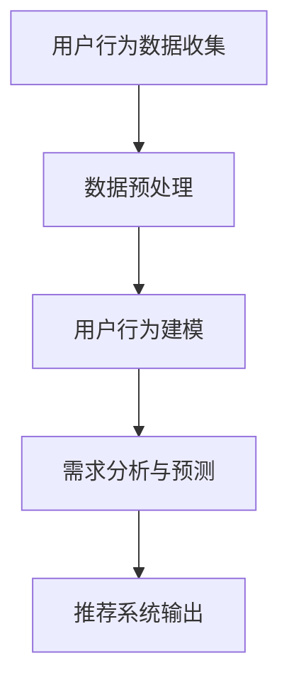

                 

关键词：人工智能，大模型，电商搜索推荐，用户行为，需求分析，购买偏好

摘要：本文探讨了人工智能大模型在电商搜索推荐系统中如何通过用户行为分析来理解用户的需求和购买偏好。通过对用户行为数据的收集、处理和建模，本文介绍了一种基于深度学习的用户行为分析算法，并详细阐述了其在电商推荐系统中的应用和优势。此外，本文还对未来人工智能在电商推荐领域的发展趋势和面临的挑战进行了展望。

## 1. 背景介绍

### 1.1 电商搜索推荐系统的现状

电商搜索推荐系统是现代电子商务的核心组成部分，旨在通过向用户提供个性化的商品推荐，提升用户的购物体验和购物满意度。传统的推荐系统主要依赖于基于内容的推荐（Content-Based Filtering）和协同过滤（Collaborative Filtering）两种方法。然而，随着用户生成数据的爆炸性增长，这些方法在处理复杂用户行为和提供精准推荐方面面临着巨大的挑战。

### 1.2 大模型在推荐系统中的应用

近年来，人工智能和深度学习技术的飞速发展，为大模型在电商推荐系统中的应用提供了新的可能性。大模型能够处理海量数据，提取用户行为中的潜在特征，从而实现更加精准的推荐。本文旨在探讨如何利用人工智能大模型来分析用户行为，理解用户的需求和购买偏好，进而提升电商搜索推荐系统的效果。

## 2. 核心概念与联系

### 2.1 大模型的基本原理

大模型，通常指的是具有海量参数和强大计算能力的深度学习模型。它们能够通过学习大量数据来提取复杂的信息和模式。在电商推荐系统中，大模型通常用于用户行为数据的分析和预测。

### 2.2 用户行为分析的关键概念

用户行为分析包括用户搜索行为、点击行为、购买行为等多个方面。这些行为反映了用户的需求和偏好，是构建个性化推荐系统的关键。

### 2.3 Mermaid 流程图



## 3. 核心算法原理 & 具体操作步骤

### 3.1 算法原理概述

本文采用了一种基于深度学习的方法进行用户行为分析。该方法主要包括以下几个步骤：

1. 数据收集：收集用户在电商平台上的搜索、点击、购买等行为数据。
2. 数据预处理：对收集到的数据进行清洗、去重和特征提取。
3. 用户行为建模：使用深度学习模型对用户行为进行建模，提取用户的需求和偏好特征。
4. 需求分析与预测：基于模型输出，分析用户的需求和购买偏好，并预测其未来的行为。
5. 推荐系统输出：根据用户的需求和偏好，生成个性化的商品推荐列表。

### 3.2 算法步骤详解

#### 3.2.1 数据收集

数据收集是用户行为分析的基础。本文通过以下渠道收集用户行为数据：

- 用户搜索记录：包括用户搜索的关键词、搜索时间等。
- 用户点击记录：包括用户点击的商品ID、点击时间等。
- 用户购买记录：包括用户购买的商品ID、购买时间、购买金额等。

#### 3.2.2 数据预处理

数据预处理包括以下步骤：

- 数据清洗：去除重复数据、缺失数据和异常数据。
- 特征提取：将原始行为数据转换为特征向量，包括用户行为的时间特征、内容特征等。

#### 3.2.3 用户行为建模

用户行为建模采用了一种基于变分自编码器（Variational Autoencoder, VAE）的深度学习模型。VAE能够通过无监督学习提取用户行为的潜在特征，从而实现对用户需求的建模。

#### 3.2.4 需求分析与预测

基于VAE模型的输出，我们可以对用户的需求和购买偏好进行量化分析。具体方法如下：

- 用户需求分析：通过分析用户行为数据的分布和相关性，提取用户的主要需求特征。
- 购买偏好预测：使用序列模型（如循环神经网络RNN）对用户的未来购买行为进行预测。

#### 3.2.5 推荐系统输出

基于用户的需求和购买偏好预测，我们可以生成个性化的商品推荐列表。推荐系统可以采用基于内容的推荐、协同过滤等方法，将用户感兴趣的商品推荐给用户。

### 3.3 算法优缺点

#### 优点

- **高效性**：大模型能够处理海量数据，提取用户行为中的潜在特征，从而实现高效的用户行为分析。
- **精准性**：基于深度学习的用户行为建模方法能够更好地理解用户的需求和购买偏好，提升推荐系统的效果。
- **灵活性**：大模型可以适应不同的业务场景和数据特点，具有较强的灵活性。

#### 缺点

- **计算资源需求**：大模型通常需要大量的计算资源和时间进行训练和推理。
- **数据质量依赖**：用户行为数据的质量直接影响大模型的效果。

### 3.4 算法应用领域

用户行为分析算法可以广泛应用于电商、金融、教育等多个领域，为用户提供个性化的服务和推荐。

## 4. 数学模型和公式 & 详细讲解 & 举例说明

### 4.1 数学模型构建

用户行为建模采用变分自编码器（VAE）模型。VAE是一种基于概率生成模型的无监督学习方法，能够在无监督条件下学习输入数据的潜在特征。

#### 4.1.1 VAE 模型公式

VAE 模型由两个神经网络组成：编码器（Encoder）和解码器（Decoder）。编码器将输入数据映射到一个潜在空间，解码器将潜在空间的数据映射回输入空间。

$$
\begin{aligned}
\text{编码器}:& \quad z = \mu(x) + \sigma(x) \odot \epsilon, \\
\text{解码器}:& \quad x' = \phi(z).
\end{aligned}
$$

其中，$z$ 是潜在空间中的点，$\mu(x)$ 和 $\sigma(x)$ 分别是编码器输出的均值和方差，$\epsilon$ 是噪声，$\phi(z)$ 是解码器。

#### 4.1.2 损失函数

VAE 的损失函数由两部分组成：重构损失和 KL 散度。

$$
\begin{aligned}
L(x, x') &= \sum_{i=1}^{n} \log p_\phi(x' | z), \\
D_{KL}(\mu(x), \sigma(x)) &= \sum_{i=1}^{n} \mu(x) \log \frac{\mu(x)}{\sigma(x)^2} + \sigma(x) - \frac{1}{2}.
\end{aligned}
$$

其中，$L(x, x')$ 是重构损失，$D_{KL}(\mu(x), \sigma(x))$ 是 KL 散度。

### 4.2 公式推导过程

VAE 的推导过程主要包括以下几个方面：

#### 4.2.1 潜在空间选择

潜在空间通常选择高斯分布，因为它能够很好地建模连续数据。

#### 4.2.2 编码器与解码器设计

编码器和解码器的设计取决于输入数据的类型和复杂度。通常，编码器和解码器都是多层感知机（MLP）。

#### 4.2.3 损失函数优化

VAE 的损失函数由两部分组成：重构损失和 KL 散度。重构损失用于衡量输入数据和重构数据之间的相似度，KL 散度用于确保潜在空间的高斯分布。

### 4.3 案例分析与讲解

假设我们有一个电商平台的用户行为数据集，包括用户的搜索记录、点击记录和购买记录。我们希望通过 VAE 模型提取用户的潜在特征，并基于这些特征进行个性化推荐。

#### 4.3.1 数据预处理

首先，我们对用户行为数据进行清洗和特征提取。例如，我们将搜索记录转换为文本特征，点击记录转换为商品ID特征，购买记录转换为商品ID特征和购买金额特征。

#### 4.3.2 VAE 模型训练

我们使用 TensorFlow 和 Keras 等深度学习框架，设计并训练一个 VAE 模型。具体实现如下：

```python
from tensorflow import keras
from tensorflow.keras import layers

# 编码器
encoder_input = keras.Input(shape=(input_shape,))
encoded = layers.Dense(units=64, activation='relu')(encoder_input)
encoded = layers.Dense(units=32, activation='relu')(encoded)
mu = layers.Dense(units=z_dim, activation='sigmoid')(encoded)
sigma = layers.Dense(units=z_dim, activation='sigmoid')(encoded)

# 解码器
z = keras.Input(shape=(z_dim,))
decoded = layers.Dense(units=32, activation='relu')(z)
decoded = layers.Dense(units=64, activation='relu')(decoded)
decoded = layers.Dense(units=input_shape, activation='sigmoid')(decoded)

# VAE 模型
vae = keras.Model([encoder_input, z], decoded)
vae.add_loss(keras.backend.mean(keras.losses.sigmoid_cross_entropy_from_logits(encoded, x)))
vae.add_loss(keras.backend.mean(keras.losses.kl_divergence(mu, sigma)))
vae.compile(optimizer='adam')
vae.fit(x_train, z_train, epochs=100)
```

#### 4.3.3 用户特征提取

通过训练好的 VAE 模型，我们可以提取用户的潜在特征。具体方法如下：

```python
# 编码器模型
encoder = keras.Model(encoder_input, mu, name='encoder')
z_train = encoder.predict(x_train)
```

#### 4.3.4 个性化推荐

基于提取的用户潜在特征，我们可以使用基于内容的推荐、协同过滤等方法，为用户提供个性化的商品推荐。例如，我们可以使用基于 k-近邻的协同过滤方法，计算用户之间的相似度，并将相似的用户喜欢的商品推荐给其他用户。

```python
from sklearn.neighbors import NearestNeighbors

# 训练 NearestNeighbors 模型
nearest_neighbors = NearestNeighbors(n_neighbors=k, algorithm='auto')
nearest_neighbors.fit(z_train)

# 计算用户之间的相似度
similarity = nearest_neighbors.kneighbors([z_test], return_distance=True)
```

## 5. 项目实践：代码实例和详细解释说明

### 5.1 开发环境搭建

在本文的项目实践中，我们将使用 Python 作为主要编程语言，并结合 TensorFlow 和 Keras 深度学习框架来构建和训练 VAE 模型。以下是开发环境的搭建步骤：

1. 安装 Python 3.7 或以上版本。
2. 安装 TensorFlow 和 Keras：
   ```bash
   pip install tensorflow
   pip install keras
   ```

### 5.2 源代码详细实现

以下是一个简单的 VAE 模型实现示例，包括数据预处理、模型定义、模型训练和用户特征提取。

#### 5.2.1 数据预处理

```python
import numpy as np
import pandas as pd
from sklearn.model_selection import train_test_split
from sklearn.preprocessing import StandardScaler

# 读取数据
data = pd.read_csv('user_behavior_data.csv')

# 数据预处理
X = data[['search_terms', 'clicks', 'purchases']]
X_train, X_test, y_train, y_test = train_test_split(X, test_size=0.2, random_state=42)

# 标准化数据
scaler = StandardScaler()
X_train_scaled = scaler.fit_transform(X_train)
X_test_scaled = scaler.transform(X_test)
```

#### 5.2.2 模型定义

```python
from tensorflow.keras.layers import Input, Dense, Lambda
from tensorflow.keras.models import Model

# 定义编码器和解码器
input_shape = X_train_scaled.shape[1]
z_dim = 20

input_img = Input(shape=input_shape)
x = Dense(64, activation='relu')(input_img)
x = Dense(32, activation='relu')(x)

# 编码器输出均值和方差
mu = Dense(z_dim, activation='sigmoid')(x)
sigma = Dense(z_dim, activation='sigmoid')(x)

# 编码器模型
encoder = Model(input_img, [mu, sigma], name='encoder')

# 解码器输入
z = Input(shape=(z_dim,))
x_decoded = Dense(32, activation='relu')(z)
x_decoded = Dense(64, activation='relu')(x_decoded)
x_decoded = Dense(input_shape, activation='sigmoid')(x_decoded)

# 解码器模型
decoder = Model(z, x_decoded, name='decoder')

# VAE 模型
output_img = decoder(encoder(input_img)[1])
vae = Model(input_img, output_img, name='vae')

# 损失函数
reconstruction_loss = keras.losses.binary_crossentropy(input_img, output_img)
reconstruction_loss *= input_shape
kl_loss = 1 + mu - keras.backend.square(mu) - keras.backend.exp(sigma)
kl_loss = keras.backend.mean(kl_loss * sigma)
vae.add_loss(kl_loss)
vae.add_loss(reconstruction_loss)
vae.compile(optimizer='adam')
```

#### 5.2.3 模型训练

```python
vae.fit(X_train_scaled, X_train_scaled, epochs=50, batch_size=16, validation_data=(X_test_scaled, X_test_scaled))
```

#### 5.2.4 用户特征提取

```python
# 编码器模型用于提取用户特征
encoder_model = Model(input_img, encoder.output[0])
z_train_encoded = encoder_model.predict(X_train_scaled)

# 提取用户特征
user_features = z_train_encoded
```

### 5.3 代码解读与分析

上述代码首先进行了数据预处理，包括数据读取、分

