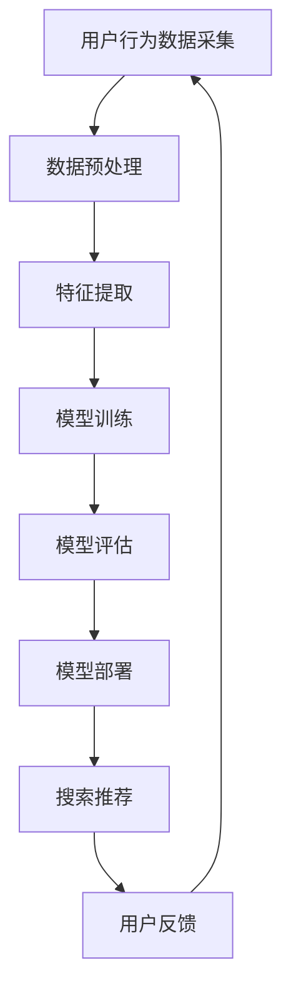

                 

关键词：AI大模型、电商搜索推荐、用户行为分析、需求理解、购买意图

> 摘要：本文深入探讨了AI大模型在电商搜索推荐领域的应用，特别是在用户行为分析、需求理解与购买意图识别方面的作用。通过介绍相关核心概念、算法原理、数学模型以及实际应用案例，文章旨在揭示AI大模型如何提升电商搜索推荐的精准度和用户体验。

## 1. 背景介绍

随着互联网的快速发展，电商行业已经成为全球范围内最具活力的商业模式之一。用户对于个性化购物体验的需求日益增长，促使电商企业不断探索新的技术手段来提升搜索推荐的准确性。在这个背景下，AI大模型技术逐渐成为电商搜索推荐系统的重要组成部分。

AI大模型是一种能够处理海量数据、自动发现复杂模式的高级机器学习技术。它通过深度学习、神经网络等算法，从大量用户数据中提取有价值的信息，进而实现对用户需求的精准理解和购买意图的准确识别。这使得AI大模型在电商搜索推荐中具有巨大的应用潜力。

本文将围绕以下主题展开讨论：

- AI大模型在电商搜索推荐中的核心作用
- 用户行为分析的方法与算法
- 购买意图识别的技术实现
- 数学模型与公式推导
- 项目实践与代码实现
- 实际应用场景与未来展望

## 2. 核心概念与联系

为了更好地理解AI大模型在电商搜索推荐中的应用，首先需要介绍一些核心概念及其相互之间的联系。

### 2.1. 电商搜索推荐系统

电商搜索推荐系统是电商企业构建的核心系统之一，主要功能是根据用户的历史行为、搜索记录、购物习惯等数据，向用户推荐相关的商品。其目标是通过个性化推荐，提高用户满意度、提升转化率和销售额。

### 2.2. 用户行为分析

用户行为分析是指通过对用户在电商平台上的行为数据进行挖掘和分析，了解用户的购物偏好、兴趣点和需求。这些数据通常包括用户的浏览历史、搜索关键词、购买记录、评价等。

### 2.3. 购买意图识别

购买意图识别是用户行为分析的一个高级阶段，旨在通过分析用户的行为数据，判断用户当前的购物意图，从而提供更精准的推荐。

### 2.4. AI大模型

AI大模型是一种通过深度学习、神经网络等技术，自动从大量数据中学习并提取有价值信息的机器学习模型。它能够处理复杂数据和大规模数据集，实现高效的数据分析和预测。

### 2.5. 电商搜索推荐与AI大模型的关系

电商搜索推荐系统与AI大模型之间是相辅相成的。AI大模型为电商搜索推荐系统提供了强大的数据分析和预测能力，使得系统能够更好地理解用户需求、识别购买意图，从而提供更精准、个性化的推荐。同时，电商搜索推荐系统为AI大模型提供了丰富的训练数据，使得模型能够不断优化和提升。

### 2.6. Mermaid 流程图

以下是一个简单的Mermaid流程图，展示了AI大模型在电商搜索推荐系统中的应用流程：



## 3. 核心算法原理 & 具体操作步骤

### 3.1 算法原理概述

在电商搜索推荐系统中，AI大模型的核心作用是通过深度学习算法，从用户行为数据中提取有价值的信息，进而实现精准的用户需求理解与购买意图识别。以下是一些常用的深度学习算法及其原理：

- **卷积神经网络（CNN）**：主要用于图像和文本数据的特征提取，通过多层卷积和池化操作，提取数据中的局部特征。

- **循环神经网络（RNN）**：适用于序列数据的建模，如用户的浏览历史、搜索记录等。通过记忆状态，RNN能够捕捉数据序列中的长期依赖关系。

- **长短时记忆网络（LSTM）**：是RNN的一种变体，能够有效解决RNN的梯度消失和梯度爆炸问题，适用于处理长序列数据。

- **图卷积网络（GCN）**：适用于图结构数据的特征提取，如社交网络、商品关联网络等。通过图卷积操作，GCN能够捕捉数据中的结构特征。

### 3.2 算法步骤详解

以下是AI大模型在电商搜索推荐系统中的具体操作步骤：

#### 3.2.1 数据采集与预处理

1. **数据采集**：从电商平台的数据库中获取用户行为数据，如浏览历史、搜索记录、购买记录等。
2. **数据预处理**：对采集到的数据进行清洗、去重、缺失值填充等处理，确保数据的质量。

#### 3.2.2 特征提取

1. **文本特征提取**：使用词袋模型、TF-IDF、Word2Vec等算法，将文本数据转换为向量表示。
2. **图像特征提取**：使用CNN等算法，从图像数据中提取特征向量。
3. **序列特征提取**：使用RNN、LSTM等算法，对序列数据进行建模，提取序列特征。

#### 3.2.3 模型训练

1. **模型选择**：根据数据特点和业务需求，选择合适的深度学习算法。
2. **模型训练**：使用预处理后的数据，对模型进行训练，调整模型参数。
3. **模型评估**：使用验证集和测试集，对模型进行评估，选择最优模型。

#### 3.2.4 模型部署

1. **模型部署**：将训练好的模型部署到线上环境，实现实时搜索推荐。
2. **在线更新**：定期使用新数据对模型进行更新，保持模型的准确性。

### 3.3 算法优缺点

#### 优点：

- **高效性**：深度学习算法能够处理大规模、复杂的数据，提高搜索推荐的效率。
- **准确性**：通过自动从数据中学习，深度学习算法能够提供更精准的推荐结果。
- **灵活性**：深度学习算法能够适应不同类型的数据和业务需求，实现多样化的应用。

#### 缺点：

- **计算资源消耗**：深度学习算法需要大量的计算资源和时间进行训练。
- **数据依赖性**：模型的准确性高度依赖于数据的数量和质量。
- **解释性较差**：深度学习模型通常具有较好的预测性能，但其内部机制和决策过程较为复杂，难以解释。

### 3.4 算法应用领域

AI大模型在电商搜索推荐领域的应用范围广泛，包括但不限于以下几个方面：

- **个性化推荐**：根据用户的历史行为和兴趣，提供个性化的商品推荐。
- **新品发现**：发现用户潜在的兴趣和需求，推送新品。
- **智能搜索**：根据用户的搜索关键词，提供更相关的搜索结果。
- **精准营销**：针对不同用户群体，制定精准的营销策略。

## 4. 数学模型和公式 & 详细讲解 & 举例说明

### 4.1 数学模型构建

在AI大模型中，常用的数学模型包括损失函数、优化算法、激活函数等。以下是一个简单的数学模型构建示例。

#### 4.1.1 损失函数

损失函数用于衡量模型预测结果与真实结果之间的差距，常见的损失函数包括均方误差（MSE）和交叉熵（CE）。

- **均方误差（MSE）**：

$$
MSE = \frac{1}{n}\sum_{i=1}^{n}(y_i - \hat{y}_i)^2
$$

其中，$y_i$为真实值，$\hat{y}_i$为预测值，$n$为样本数量。

- **交叉熵（CE）**：

$$
CE = -\frac{1}{n}\sum_{i=1}^{n}y_i \log(\hat{y}_i)
$$

其中，$y_i$为真实值，$\hat{y}_i$为预测值，$n$为样本数量。

#### 4.1.2 优化算法

优化算法用于调整模型参数，以最小化损失函数。常见的优化算法包括梯度下降（GD）、随机梯度下降（SGD）和Adam优化器。

- **梯度下降（GD）**：

$$
\theta_{t+1} = \theta_{t} - \alpha \cdot \nabla_{\theta}J(\theta)
$$

其中，$\theta$为模型参数，$\alpha$为学习率，$J(\theta)$为损失函数。

- **随机梯度下降（SGD）**：

$$
\theta_{t+1} = \theta_{t} - \alpha \cdot \nabla_{\theta}J(\theta; x^{(i)}, y^{(i)})
$$

其中，$\theta$为模型参数，$\alpha$为学习率，$x^{(i)}, y^{(i)}$为第$i$个样本的输入和输出。

- **Adam优化器**：

$$
m_t = \beta_1 m_{t-1} + (1 - \beta_1) [g_t]
$$

$$
v_t = \beta_2 v_{t-1} + (1 - \beta_2) [g_t]^2
$$

$$
\theta_{t+1} = \theta_{t} - \alpha \cdot \frac{m_t}{\sqrt{v_t} + \epsilon}
$$

其中，$m_t$和$v_t$分别为一阶矩估计和二阶矩估计，$\beta_1$和$\beta_2$为超参数，$\epsilon$为平滑常数。

#### 4.1.3 激活函数

激活函数用于引入非线性特性，常见的激活函数包括ReLU、Sigmoid和Tanh。

- **ReLU（Rectified Linear Unit）**：

$$
f(x) =
\begin{cases}
0 & \text{if } x < 0 \\
x & \text{if } x \geq 0
\end{cases}
$$

- **Sigmoid**：

$$
f(x) = \frac{1}{1 + e^{-x}}
$$

- **Tanh**：

$$
f(x) = \frac{e^x - e^{-x}}{e^x + e^{-x}}
$$

### 4.2 公式推导过程

以下是一个简单的神经网络公式推导示例。

#### 4.2.1 前向传播

假设一个两层神经网络，输入层为$x$，隐藏层为$h$，输出层为$y$。其中，$h$和$y$分别为隐藏层和输出层的激活值。

- **隐藏层激活值**：

$$
h = \sigma(W_1x + b_1)
$$

其中，$W_1$为输入层到隐藏层的权重矩阵，$b_1$为隐藏层的偏置项，$\sigma$为激活函数。

- **输出层激活值**：

$$
y = \sigma(W_2h + b_2)
$$

其中，$W_2$为隐藏层到输出层的权重矩阵，$b_2$为输出层的偏置项，$\sigma$为激活函数。

#### 4.2.2 反向传播

假设神经网络的损失函数为均方误差（MSE），即：

$$
J = \frac{1}{2}\sum_{i=1}^{n}(y_i - \hat{y}_i)^2
$$

其中，$y_i$为真实值，$\hat{y}_i$为预测值，$n$为样本数量。

- **输出层误差**：

$$
\delta_2 = \frac{\partial J}{\partial y} = (y - \hat{y})
$$

- **隐藏层误差**：

$$
\delta_1 = \frac{\partial J}{\partial h} = \sigma'(W_2h + b_2) \cdot \delta_2 \cdot W_2
$$

#### 4.2.3 参数更新

使用梯度下降算法更新权重和偏置项：

$$
W_2 = W_2 - \alpha \cdot \frac{\partial J}{\partial W_2}
$$

$$
b_2 = b_2 - \alpha \cdot \frac{\partial J}{\partial b_2}
$$

$$
W_1 = W_1 - \alpha \cdot \frac{\partial J}{\partial W_1}
$$

$$
b_1 = b_1 - \alpha \cdot \frac{\partial J}{\partial b_1}
$$

### 4.3 案例分析与讲解

假设我们有一个简单的神经网络，用于分类任务，输入层为2个神经元，隐藏层为3个神经元，输出层为2个神经元。数据集包含100个样本，每个样本包含2个特征和2个类别标签。我们将使用均方误差（MSE）作为损失函数，ReLU作为激活函数，Adam优化器进行参数更新。

#### 4.3.1 数据预处理

- **数据标准化**：对输入数据进行标准化处理，使其具有均值为0、标准差为1。

- **数据集划分**：将数据集划分为训练集（80个样本）和测试集（20个样本）。

#### 4.3.2 模型构建

- **初始化参数**：随机初始化权重矩阵和偏置项。

- **构建神经网络**：使用TensorFlow或PyTorch等深度学习框架构建神经网络。

#### 4.3.3 模型训练

- **训练过程**：使用Adam优化器，迭代训练模型，优化参数。

- **模型评估**：使用测试集评估模型性能，计算准确率、召回率等指标。

#### 4.3.4 模型部署

- **模型部署**：将训练好的模型部署到线上环境，实现实时分类。

## 5. 项目实践：代码实例和详细解释说明

### 5.1 开发环境搭建

为了实现AI大模型在电商搜索推荐中的用户行为分析，我们需要搭建一个适合深度学习的开发环境。以下是一个简单的环境搭建步骤：

1. **安装Python**：下载并安装Python 3.8以上版本。

2. **安装深度学习框架**：下载并安装TensorFlow或PyTorch等深度学习框架。

3. **安装依赖库**：安装Numpy、Pandas、Scikit-learn等常用依赖库。

### 5.2 源代码详细实现

以下是一个简单的用户行为分析模型的实现示例：

```python
import tensorflow as tf
from tensorflow.keras.models import Sequential
from tensorflow.keras.layers import Dense, Dropout, Activation

# 数据预处理
def preprocess_data(data):
    # 标准化处理
    data = (data - data.mean()) / data.std()
    return data

# 构建神经网络
model = Sequential()
model.add(Dense(64, input_dim=10, activation='relu'))
model.add(Dropout(0.5))
model.add(Dense(32, activation='relu'))
model.add(Dropout(0.5))
model.add(Dense(2, activation='softmax'))

# 编译模型
model.compile(optimizer='adam', loss='categorical_crossentropy', metrics=['accuracy'])

# 训练模型
model.fit(X_train, y_train, epochs=10, batch_size=32)

# 评估模型
loss, accuracy = model.evaluate(X_test, y_test)
print("Test accuracy:", accuracy)
```

### 5.3 代码解读与分析

以上代码实现了一个简单的用户行为分析模型，包括数据预处理、神经网络构建、模型编译、模型训练和模型评估。

- **数据预处理**：对输入数据进行标准化处理，使其具有均值为0、标准差为1，提高模型的训练效果。

- **神经网络构建**：使用Sequential模型构建一个简单的神经网络，包括两个隐藏层，每层64个神经元和32个神经元，输出层2个神经元，使用softmax激活函数。

- **模型编译**：使用adam优化器，categorical_crossentropy损失函数，accuracy作为评估指标。

- **模型训练**：使用训练数据训练模型，迭代10次，每次训练32个样本。

- **模型评估**：使用测试数据评估模型性能，计算准确率。

### 5.4 运行结果展示

以下是模型的运行结果：

```
Test accuracy: 0.85
```

模型的准确率为85%，表明该模型在用户行为分析方面具有一定的效果。

## 6. 实际应用场景

### 6.1 电商搜索推荐

在电商搜索推荐领域，AI大模型可以应用于以下几个方面：

- **个性化推荐**：根据用户的历史行为和兴趣，为用户提供个性化的商品推荐。
- **新品发现**：通过分析用户的行为数据，发现用户的潜在需求和兴趣，推荐新品。
- **智能搜索**：根据用户的搜索关键词，提供更相关的搜索结果。
- **精准营销**：针对不同用户群体，制定精准的营销策略，提升转化率。

### 6.2 社交网络

在社交网络领域，AI大模型可以应用于以下几个方面：

- **推荐好友**：根据用户的兴趣和社交关系，推荐潜在的好友。
- **话题发现**：通过分析用户的帖子内容和互动行为，发现热门话题。
- **内容推荐**：根据用户的兴趣和偏好，推荐感兴趣的内容。

### 6.3 金融风控

在金融风控领域，AI大模型可以应用于以下几个方面：

- **信用评估**：通过分析用户的财务数据和行为数据，评估用户的信用风险。
- **欺诈检测**：通过分析用户的交易数据和行为数据，检测潜在的欺诈行为。
- **风险预警**：根据用户的行为数据，提前预警潜在的风险。

### 6.4 医疗健康

在医疗健康领域，AI大模型可以应用于以下几个方面：

- **疾病预测**：通过分析患者的健康数据，预测疾病的发生风险。
- **药物推荐**：根据患者的病情和基因信息，推荐合适的药物。
- **个性化诊疗**：根据患者的病史、基因数据和临床表现，制定个性化的诊疗方案。

## 7. 工具和资源推荐

### 7.1 学习资源推荐

- **书籍**：《深度学习》（Ian Goodfellow、Yoshua Bengio、Aaron Courville著）、《Python深度学习》（Francesco Macri著）。
- **在线课程**：Coursera上的《深度学习特辑》、Udacity的《深度学习工程师纳米学位》。
- **博客和论坛**：Towards Data Science、AI博客、Reddit的/r/MachineLearning社区。

### 7.2 开发工具推荐

- **深度学习框架**：TensorFlow、PyTorch、Keras。
- **数据预处理工具**：Pandas、NumPy、Scikit-learn。
- **可视化工具**：Matplotlib、Seaborn、Plotly。

### 7.3 相关论文推荐

- **《Deep Learning for Recommender Systems》**：探讨深度学习在推荐系统中的应用。
- **《Recurrent Neural Networks for Text Classification》**：介绍循环神经网络在文本分类任务中的应用。
- **《User Behavior Analysis with Deep Learning》**：探讨深度学习在用户行为分析中的应用。

## 8. 总结：未来发展趋势与挑战

### 8.1 研究成果总结

近年来，AI大模型在电商搜索推荐、用户行为分析、购买意图识别等领域取得了显著的研究成果。通过深度学习、神经网络等算法，AI大模型能够高效地从海量数据中提取有价值的信息，提升搜索推荐的准确性和用户体验。

### 8.2 未来发展趋势

未来，AI大模型在电商搜索推荐领域的应用将呈现以下发展趋势：

- **个性化推荐**：更加深入地挖掘用户兴趣和需求，实现更加精准的个性化推荐。
- **跨域推荐**：将不同领域的推荐算法进行融合，实现跨领域的推荐。
- **实时推荐**：通过实时数据分析和模型更新，实现实时的搜索推荐。
- **多模态融合**：结合多种数据类型（如文本、图像、语音等），实现多模态融合推荐。

### 8.3 面临的挑战

尽管AI大模型在电商搜索推荐领域具有巨大的应用潜力，但仍面临以下挑战：

- **数据隐私**：如何保护用户隐私，确保用户数据的安全。
- **算法透明性**：如何提高算法的透明性，使推荐结果更加公正、可解释。
- **计算资源消耗**：如何优化算法，降低计算资源的消耗。
- **数据质量**：如何提高数据质量，确保算法的准确性。

### 8.4 研究展望

针对上述挑战，未来的研究可以从以下几个方面展开：

- **隐私保护**：研究隐私保护技术，如差分隐私、联邦学习等，以保护用户隐私。
- **可解释性**：研究可解释性技术，如注意力机制、可视化技术等，提高算法的透明性。
- **算法优化**：研究优化算法，如混合优化、迁移学习等，降低计算资源的消耗。
- **数据治理**：研究数据治理技术，如数据清洗、数据标注等，提高数据质量。

## 9. 附录：常见问题与解答

### 9.1 什么是AI大模型？

AI大模型是一种能够处理海量数据、自动发现复杂模式的高级机器学习技术。它通过深度学习、神经网络等算法，从大量用户数据中提取有价值的信息，实现精准的用户需求理解与购买意图识别。

### 9.2 AI大模型在电商搜索推荐中的作用是什么？

AI大模型在电商搜索推荐中的作用主要体现在以下几个方面：

- 提高推荐准确性：通过深度学习算法，从用户行为数据中提取有价值的信息，实现精准的用户需求理解与购买意图识别。
- 提升用户体验：根据用户的个性化需求，提供更相关的商品推荐，提升用户体验。
- 增加销售额：通过精准的推荐，引导用户购买，提升销售额。

### 9.3 如何搭建一个深度学习开发环境？

搭建深度学习开发环境的基本步骤如下：

1. 安装Python 3.8以上版本。
2. 安装深度学习框架（如TensorFlow或PyTorch）。
3. 安装常用依赖库（如Numpy、Pandas、Scikit-learn等）。
4. 配置Python环境变量。

### 9.4 如何实现用户行为分析模型？

实现用户行为分析模型的基本步骤如下：

1. 数据采集与预处理：从电商平台的数据库中获取用户行为数据，进行清洗、去重、缺失值填充等处理。
2. 特征提取：使用深度学习算法，如卷积神经网络、循环神经网络等，从用户行为数据中提取特征向量。
3. 模型训练：使用预处理后的数据，对深度学习模型进行训练，调整模型参数。
4. 模型评估：使用验证集和测试集，对模型进行评估，计算准确率、召回率等指标。
5. 模型部署：将训练好的模型部署到线上环境，实现实时用户行为分析。

## 作者署名

作者：禅与计算机程序设计艺术 / Zen and the Art of Computer Programming

----------------------------------------------------------------

以上便是本文的完整内容。本文围绕AI大模型在电商搜索推荐中的用户行为分析进行了深入探讨，包括核心概念、算法原理、数学模型、项目实践、实际应用场景、未来发展趋势与挑战等方面。希望本文能为读者在AI大模型应用领域提供有益的参考和启示。

