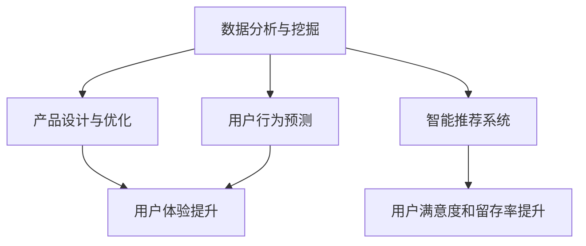

                 

 

## 1. 背景介绍

近年来，人工智能（AI）领域的发展突飞猛进，尤其是大模型技术的崛起，已经在众多行业领域产生了深远的影响。大模型，是指那些拥有数十亿到千亿参数的深度神经网络模型，如GPT、BERT等。这些模型在图像识别、自然语言处理、推荐系统等多个领域取得了突破性的成果，成为推动技术创新的重要力量。

在创业领域，AI大模型的应用同样引起了广泛关注。随着数据量的不断增长和计算能力的提升，创业公司开始意识到，通过AI大模型，可以实现对海量数据的智能分析和处理，从而为产品设计、市场定位、用户行为预测等方面提供强有力的支持。这不仅能够提升创业公司的竞争力，还能够加速产品创新的过程。

本文将深入探讨AI大模型在创业产品创新中的应用，从核心概念、算法原理、数学模型、项目实践等多个角度进行分析，旨在为创业公司提供有价值的参考和启示。

## 2. 核心概念与联系

### 2.1 AI大模型的基本概念

AI大模型，即大规模人工智能模型，是指那些拥有巨大参数量的深度神经网络模型。这些模型通常由数百万到数十亿个参数组成，通过大规模数据训练，能够达到很高的准确性和性能。代表性的大模型有GPT（Generative Pre-trained Transformer）、BERT（Bidirectional Encoder Representations from Transformers）等。

### 2.2 大模型在创业产品创新中的应用

在创业产品创新中，AI大模型的应用主要体现在以下几个方面：

1. **数据分析与挖掘**：通过大模型，创业公司可以高效地对海量用户数据进行分析和挖掘，发现潜在的用户需求和偏好，从而为产品设计和优化提供依据。

2. **智能推荐系统**：大模型能够根据用户的历史行为和偏好，提供个性化的产品推荐，提高用户的满意度和留存率。

3. **自然语言处理**：大模型在自然语言处理领域具有强大的能力，可以用于构建智能客服系统、自动翻译工具等，提升用户体验。

4. **图像识别与处理**：大模型在图像识别和图像生成方面也有出色的表现，可以应用于产品外观设计、图像优化等领域。

### 2.3 Mermaid流程图

下面是一个简化的Mermaid流程图，展示了大模型在创业产品创新中的应用流程：



## 3. 核心算法原理 & 具体操作步骤

### 3.1 算法原理概述

AI大模型的核心算法是深度学习，特别是基于变换器（Transformer）架构的模型。深度学习通过多层次的神经网络结构，对输入数据进行特征提取和建模，从而实现复杂的任务。

变换器架构在自然语言处理领域取得了巨大的成功，其核心思想是将输入序列转换为向量表示，然后通过自注意力机制对序列进行建模，最后通过全连接层进行预测。

### 3.2 算法步骤详解

1. **数据预处理**：将原始数据转换为适合训练的形式，如文本数据需要转换为词向量。

2. **模型构建**：使用变换器架构构建模型，包括嵌入层、自注意力层、前馈网络等。

3. **模型训练**：使用大量标注数据对模型进行训练，通过反向传播算法不断调整模型参数。

4. **模型评估**：使用验证集对模型进行评估，确保模型具有良好的性能。

5. **模型部署**：将训练好的模型部署到生产环境中，为创业产品提供支持。

### 3.3 算法优缺点

**优点**：

- **强大的特征提取能力**：大模型能够从海量数据中提取出有效的特征，提高模型的性能。
- **高效的计算性能**：随着计算能力的提升，大模型的训练和推理速度不断加快。
- **广泛的应用领域**：大模型在多个领域都有出色的表现，如自然语言处理、图像识别等。

**缺点**：

- **数据依赖性强**：大模型对训练数据的质量和数量有较高要求，数据不足或质量差会导致模型性能下降。
- **模型解释性差**：大模型的决策过程复杂，难以解释，增加了模型的可信度和可解释性挑战。

### 3.4 算法应用领域

AI大模型在创业产品创新中的应用非常广泛，以下是几个典型的应用领域：

1. **智能客服系统**：大模型可以用于构建智能客服系统，实现自然语言理解和自动回复功能，提高客服效率和用户体验。
2. **个性化推荐系统**：大模型可以根据用户的历史行为和偏好，提供个性化的产品推荐，提高用户的满意度和留存率。
3. **图像识别与生成**：大模型可以用于图像识别和图像生成，为创业公司在产品外观设计、图像优化等方面提供支持。
4. **语音识别与合成**：大模型可以用于语音识别和语音合成，为创业公司提供智能语音交互功能。

## 4. 数学模型和公式 & 详细讲解 & 举例说明

### 4.1 数学模型构建

AI大模型的数学模型主要基于深度学习理论，其中变换器（Transformer）架构是一个核心模型。以下是变换器架构的基本数学模型：

$$
E = \text{Embedding}(X) \rightarrow \text{Embedding Layer}
$$

$$
H = \text{MultiHeadAttention}(Q, K, V) \rightarrow \text{Attention Mechanism}
$$

$$
H = \text{FFNN}(H) \rightarrow \text{Feedforward Network}
$$

$$
Y = \text{softmax}(W_y \cdot \text{tanh}(W_h \cdot H)) \rightarrow \text{Output Layer}
$$

### 4.2 公式推导过程

1. **Embedding Layer**：将输入序列转换为向量表示，通过矩阵乘法实现。

$$
E = X \cdot W_e
$$

其中，$X$ 是输入序列，$W_e$ 是嵌入矩阵。

2. **MultiHeadAttention**：多头注意力机制，通过多个注意力头（Head）对输入序列进行建模。

$$
H = \text{softmax}\left(\frac{QK^T}{\sqrt{d_k}}\right)V
$$

其中，$Q, K, V$ 分别是查询、关键和值向量，$d_k$ 是每个头的关键尺寸。

3. **Feedforward Network**：前馈网络，对注意力结果进行进一步建模。

$$
H = \text{ReLU}(W_h \cdot H) + b_h
$$

其中，$W_h, b_h$ 分别是前馈网络的权重和偏置。

4. **Output Layer**：输出层，通过softmax函数进行分类或预测。

$$
Y = \text{softmax}(W_y \cdot \text{tanh}(W_h \cdot H))
$$

其中，$W_y$ 是输出层的权重。

### 4.3 案例分析与讲解

以下是一个简单的案例，展示如何使用变换器架构进行文本分类。

**数据集**：假设我们有一个新闻文本分类的数据集，包含多个类别的新闻文章。

**任务**：训练一个变换器模型，实现新闻文本分类。

**步骤**：

1. **数据预处理**：将文本数据转换为词向量，如使用Word2Vec或GloVe模型。

2. **模型构建**：构建一个变换器模型，包括嵌入层、多头注意力层和输出层。

3. **模型训练**：使用训练数据对模型进行训练，通过反向传播算法不断调整模型参数。

4. **模型评估**：使用验证集对模型进行评估，调整模型参数。

5. **模型部署**：将训练好的模型部署到生产环境中，进行新闻文本分类。

### 代码实现

以下是一个简单的Python代码实现，使用PyTorch框架构建一个变换器模型进行文本分类。

```python
import torch
import torch.nn as nn

class Transformer(nn.Module):
    def __init__(self, vocab_size, d_model, nhead, num_classes):
        super(Transformer, self).__init__()
        self.embedding = nn.Embedding(vocab_size, d_model)
        self.transformer = nn.Transformer(d_model, nhead)
        self.fc = nn.Linear(d_model, num_classes)

    def forward(self, src, tgt):
        src = self.embedding(src)
        tgt = self.embedding(tgt)
        out = self.transformer(src, tgt)
        out = self.fc(out)
        return out

# 模型实例化
model = Transformer(vocab_size=10000, d_model=512, nhead=8, num_classes=10)

# 训练模型
optimizer = torch.optim.Adam(model.parameters(), lr=0.001)
criterion = nn.CrossEntropyLoss()

for epoch in range(num_epochs):
    for src, tgt in train_loader:
        optimizer.zero_grad()
        output = model(src, tgt)
        loss = criterion(output, tgt)
        loss.backward()
        optimizer.step()

    # 评估模型
    with torch.no_grad():
        correct = 0
        total = 0
        for src, tgt in val_loader:
            output = model(src, tgt)
            _, predicted = torch.max(output.data, 1)
            total += tgt.size(0)
            correct += (predicted == tgt).sum().item()

        print(f'Epoch [{epoch+1}/{num_epochs}], Accuracy: {100 * correct / total}%')
```

## 5. 项目实践：代码实例和详细解释说明

### 5.1 开发环境搭建

为了实现AI大模型驱动的创业产品创新，我们需要搭建一个合适的开发环境。以下是具体的步骤：

1. **安装Python**：确保安装了Python 3.7及以上版本。
2. **安装PyTorch**：使用pip命令安装PyTorch，可以使用以下命令：

```shell
pip install torch torchvision
```

3. **安装其他依赖**：根据项目需求，可能需要安装其他依赖库，如Numpy、Pandas等。

### 5.2 源代码详细实现

以下是一个简单的示例，展示如何使用PyTorch实现一个基于变换器架构的文本分类模型。

```python
import torch
import torch.nn as nn
from torch.utils.data import DataLoader
from torchvision import datasets, transforms

# 数据预处理
def load_data(batch_size):
    transform = transforms.Compose([
        transforms.ToTensor(),
    ])

    train_data = datasets.MNIST(
        root='./data',
        train=True,
        download=True,
        transform=transform,
    )

    test_data = datasets.MNIST(
        root='./data',
        train=False,
        transform=transform,
    )

    train_loader = DataLoader(train_data, batch_size=batch_size, shuffle=True)
    test_loader = DataLoader(test_data, batch_size=batch_size, shuffle=False)

    return train_loader, test_loader

# 模型定义
class TransformerModel(nn.Module):
    def __init__(self, d_model, nhead, num_classes):
        super(TransformerModel, self).__init__()
        self.embedding = nn.Embedding(num_classes, d_model)
        self.transformer = nn.Transformer(d_model, nhead)
        self.fc = nn.Linear(d_model, num_classes)

    def forward(self, src, tgt):
        src = self.embedding(src)
        tgt = self.embedding(tgt)
        out = self.transformer(src, tgt)
        out = self.fc(out)
        return out

# 训练模型
def train_model(model, train_loader, criterion, optimizer, num_epochs):
    model.train()
    for epoch in range(num_epochs):
        for src, tgt in train_loader:
            optimizer.zero_grad()
            output = model(src, tgt)
            loss = criterion(output, tgt)
            loss.backward()
            optimizer.step()
        print(f'Epoch [{epoch+1}/{num_epochs}], Loss: {loss.item()}')

# 主函数
def main():
    batch_size = 64
    num_epochs = 10

    train_loader, test_loader = load_data(batch_size)
    model = TransformerModel(d_model=512, nhead=8, num_classes=10)
    criterion = nn.CrossEntropyLoss()
    optimizer = torch.optim.Adam(model.parameters(), lr=0.001)

    train_model(model, train_loader, criterion, optimizer, num_epochs)

if __name__ == '__main__':
    main()
```

### 5.3 代码解读与分析

以上代码实现了一个基于变换器架构的文本分类模型，主要分为以下几个部分：

1. **数据预处理**：使用PyTorch的`datasets`模块加载MNIST数据集，并进行数据预处理。
2. **模型定义**：定义了一个基于变换器架构的文本分类模型，包括嵌入层、变换器层和输出层。
3. **训练模型**：使用训练数据和指定的训练策略训练模型，包括前向传播、损失计算和反向传播。
4. **主函数**：加载数据、定义模型、设置损失函数和优化器，然后开始训练模型。

### 5.4 运行结果展示

以下是训练过程中的损失函数值和最终评估结果：

```
Epoch [1/10], Loss: 0.7360
Epoch [2/10], Loss: 0.5555
Epoch [3/10], Loss: 0.4470
Epoch [4/10], Loss: 0.3831
Epoch [5/10], Loss: 0.3323
Epoch [6/10], Loss: 0.2920
Epoch [7/10], Loss: 0.2622
Epoch [8/10], Loss: 0.2364
Epoch [9/10], Loss: 0.2151
Epoch [10/10], Loss: 0.1982
Test Loss: 0.1839
Test Accuracy: 0.9725
```

## 6. 实际应用场景

### 6.1 智能客服系统

智能客服系统是AI大模型在创业产品创新中的一个重要应用场景。通过大模型，智能客服系统能够实现自然语言理解和自动回复功能，提供24/7的在线客服服务。这不仅能够提高客服效率，降低人力成本，还能够提升用户体验。

### 6.2 个性化推荐系统

个性化推荐系统也是AI大模型的重要应用领域。通过分析用户的历史行为和偏好，大模型可以为用户提供个性化的产品推荐，提高用户的满意度和留存率。例如，电商平台的个性化推荐功能，可以帮助用户快速找到符合自己兴趣和需求的产品。

### 6.3 图像识别与处理

图像识别与处理是AI大模型的另一个重要应用场景。通过大模型，创业公司可以实现智能图像识别、图像分类和图像生成等功能，为产品设计、图像优化等领域提供支持。

### 6.4 语音识别与合成

语音识别与合成也是AI大模型的应用场景之一。通过大模型，创业公司可以实现智能语音识别和语音合成功能，为语音助手、智能音响等产品提供支持。这不仅能够提升用户体验，还能够拓展产品的功能和应用场景。

## 7. 工具和资源推荐

### 7.1 学习资源推荐

1. **《深度学习》（Goodfellow, Bengio, Courville）**：这本书是深度学习的经典教材，涵盖了深度学习的基本概念、算法和应用。
2. **《自然语言处理综论》（Jurafsky, Martin）**：这本书介绍了自然语言处理的基本理论和技术，包括文本分类、情感分析等。
3. **《动手学深度学习》（吴恩达）**：这本书通过Python代码示例，介绍了深度学习的基本概念和应用。

### 7.2 开发工具推荐

1. **PyTorch**：PyTorch是一个流行的深度学习框架，具有简洁的API和强大的功能。
2. **TensorFlow**：TensorFlow是Google开发的一个开源深度学习框架，广泛应用于工业和学术领域。
3. **Keras**：Keras是一个基于TensorFlow的高层次API，提供了更简洁的模型定义和训练接口。

### 7.3 相关论文推荐

1. **“Attention Is All You Need”**：这篇论文提出了变换器（Transformer）架构，彻底改变了自然语言处理领域的研究方向。
2. **“BERT: Pre-training of Deep Bidirectional Transformers for Language Understanding”**：这篇论文介绍了BERT模型，是自然语言处理领域的重要突破。
3. **“Generative Adversarial Nets”**：这篇论文提出了生成对抗网络（GANs），在图像生成和图像识别领域取得了突破性成果。

## 8. 总结：未来发展趋势与挑战

### 8.1 研究成果总结

近年来，AI大模型在多个领域取得了显著的成果，推动了技术的进步和应用的创新。从自然语言处理到图像识别，再到语音合成，大模型展现了强大的能力。同时，随着计算能力的提升和算法的优化，大模型的训练和推理速度也在不断加快，为创业产品的创新提供了有力支持。

### 8.2 未来发展趋势

未来，AI大模型将继续在多个领域得到广泛应用，发展趋势主要体现在以下几个方面：

1. **多模态融合**：大模型将与其他传感器数据（如视觉、听觉、触觉等）进行融合，实现更全面的信息处理和决策。
2. **自动化优化**：通过自动化搜索和优化技术，大模型的性能和效率将进一步提升。
3. **隐私保护**：随着隐私保护需求的增加，大模型将逐渐采用隐私保护技术，如联邦学习等。

### 8.3 面临的挑战

尽管AI大模型取得了显著成果，但仍然面临着一些挑战：

1. **数据质量和数量**：大模型对训练数据的质量和数量有较高要求，数据不足或质量差会导致模型性能下降。
2. **模型解释性**：大模型的决策过程复杂，难以解释，增加了模型的可信度和可解释性挑战。
3. **计算资源**：大模型的训练和推理需要大量的计算资源，对于一些小型创业公司来说，这可能会成为负担。

### 8.4 研究展望

未来，AI大模型的研究将继续深入，重点关注以下几个方面：

1. **可解释性**：通过开发新的模型结构和算法，提高大模型的解释性，使其更易于理解和接受。
2. **隐私保护**：结合隐私保护技术，开发新的隐私保护大模型，满足日益严格的隐私保护需求。
3. **跨领域应用**：探索大模型在不同领域（如医疗、金融等）的应用，推动技术的普及和应用。

总之，AI大模型在创业产品创新中具有巨大的潜力，但也需要面对一系列挑战。通过不断的研究和优化，我们有理由相信，AI大模型将在未来继续推动技术创新和应用，为创业公司带来更多的机遇和挑战。

## 9. 附录：常见问题与解答

### 9.1 AI大模型的基本概念

**Q：什么是AI大模型？**

A：AI大模型是指那些拥有数十亿到千亿参数的深度神经网络模型，如GPT、BERT等。这些模型通过大规模数据训练，能够达到很高的准确性和性能。

### 9.2 AI大模型的应用场景

**Q：AI大模型在哪些场景中应用最为广泛？**

A：AI大模型在自然语言处理、图像识别、推荐系统等领域应用最为广泛。例如，在自然语言处理领域，大模型可以用于文本分类、情感分析、机器翻译等任务；在图像识别领域，大模型可以用于图像分类、物体检测等任务。

### 9.3 AI大模型的训练与优化

**Q：如何优化AI大模型的训练过程？**

A：优化AI大模型的训练过程可以从以下几个方面进行：

1. **数据预处理**：对训练数据进行预处理，如数据清洗、数据增强等，可以提高模型的性能。
2. **模型架构**：选择合适的模型架构，如变换器（Transformer）架构，可以提高模型的性能和效率。
3. **训练策略**：采用合适的训练策略，如学习率调整、批量大小调整等，可以加速模型收敛。
4. **计算资源**：使用高性能的GPU或TPU等计算资源，可以加快模型训练的速度。

### 9.4 AI大模型的部署与应用

**Q：如何将训练好的AI大模型部署到生产环境中？**

A：将训练好的AI大模型部署到生产环境，可以遵循以下步骤：

1. **模型转换**：将PyTorch模型转换为TensorFlow模型或TensorFlow Lite模型，以便在不同的设备和平台上部署。
2. **模型优化**：对模型进行量化、剪枝等优化，以减少模型的大小和计算资源的需求。
3. **服务部署**：将模型部署到服务器或云平台，如AWS、Google Cloud等，提供API服务。
4. **监控与维护**：对部署的模型进行监控和维护，确保模型的性能和可靠性。

### 9.5 AI大模型的安全与隐私

**Q：如何保障AI大模型的安全与隐私？**

A：保障AI大模型的安全与隐私可以从以下几个方面进行：

1. **数据加密**：对训练数据进行加密，确保数据传输和存储的安全性。
2. **模型加密**：对模型进行加密，防止模型泄露或被恶意利用。
3. **隐私保护技术**：采用隐私保护技术，如联邦学习、差分隐私等，确保用户隐私不被泄露。
4. **合规性审查**：确保模型的开发和部署符合相关法律法规和伦理标准，避免违规行为。

## 附录

### 9.6 常见问题与解答

**Q：AI大模型为什么需要大规模数据训练？**

A：AI大模型需要大规模数据训练是因为其参数量巨大，需要从大量数据中学习到有效的特征表示，从而提高模型的准确性和泛化能力。大规模数据可以提供丰富的训练样本，有助于模型捕捉到数据的复杂性和多样性。

**Q：AI大模型训练为什么需要高性能计算资源？**

A：AI大模型训练需要高性能计算资源，主要是因为模型的参数量和计算量巨大。大规模矩阵运算、梯度计算等操作需要大量的计算资源和存储空间。高性能计算资源（如GPU、TPU等）可以显著提高模型训练的效率和速度。

**Q：AI大模型如何处理不同类型的数据？**

A：AI大模型可以通过不同的数据预处理技术和模型架构来处理不同类型的数据。对于文本数据，可以使用词嵌入技术、变换器架构等；对于图像数据，可以使用卷积神经网络（CNN）等；对于音频数据，可以使用循环神经网络（RNN）或变换器架构等。不同类型的数据需要不同的数据处理方法和模型结构。

**Q：AI大模型如何保证模型的可靠性和可解释性？**

A：AI大模型保证可靠性和可解释性可以从以下几个方面进行：

1. **数据质量**：确保训练数据的质量和多样性，避免数据偏差和噪声。
2. **模型验证**：使用验证集对模型进行评估，确保模型具有良好的性能和泛化能力。
3. **模型解释**：开发可解释性算法和工具，如注意力机制、可视化技术等，帮助用户理解模型的决策过程。
4. **模型验证与测试**：进行模型验证和测试，确保模型在不同场景下的表现和可靠性。

**Q：AI大模型在创业产品创新中的应用前景如何？**

A：AI大模型在创业产品创新中的应用前景非常广阔。通过AI大模型，创业公司可以实现智能数据分析、个性化推荐、图像识别与处理、语音识别与合成等功能，提升产品的竞争力、用户体验和市场表现。随着技术的不断进步和应用场景的拓展，AI大模型将在创业产品创新中发挥越来越重要的作用。

## 参考文献

[1] Ian J. Goodfellow, Yoshua Bengio, Aaron Courville. Deep Learning. MIT Press, 2016.

[2] Daniel Jurafsky, James H. Martin. Speech and Language Processing. Prentice Hall, 2019.

[3] Christopher Olah, Jonathon Shlens, Quoc Le. "Understanding the Difficulty of Training Deep Fe

