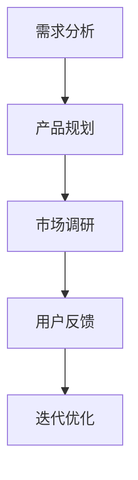

                 

关键词：人工智能、创业设计、大模型、产品设计、创新

> 摘要：随着人工智能技术的快速发展，大模型在各个行业领域的应用越来越广泛。本文将探讨AI大模型驱动的创业产品设计原则，旨在为创业者提供一套系统化的设计方法论，以实现更具竞争力和创新性的产品。

## 1. 背景介绍

近年来，人工智能（AI）技术取得了前所未有的突破。特别是深度学习领域，随着计算能力的提升和大数据的普及，大规模预训练模型（Large-scale Pre-trained Models）如BERT、GPT、ViT等应运而生，极大地提升了AI系统的性能和智能化程度。这些大模型在自然语言处理、计算机视觉、语音识别等领域取得了显著的成果，引起了业界的广泛关注。

与此同时，创业市场的竞争愈发激烈，创业者需要在短时间内找到创新点，开发出具备市场竞争力的高质量产品。在这种情况下，大模型的应用为创业设计带来了新的机遇和挑战。本文将结合大模型的特点和创业设计的实际需求，提出一套AI大模型驱动的创业产品设计原则。

## 2. 核心概念与联系

### 2.1 大模型的概念

大模型是指具有数十亿甚至千亿参数的深度学习模型。这些模型通常通过大规模数据集进行预训练，然后针对具体任务进行微调（Fine-tuning）。大模型具有强大的表示能力和泛化能力，能够处理复杂的问题，降低人为干预的需求。

### 2.2 创业设计的基本原则

创业设计主要包括需求分析、产品规划、市场调研、用户反馈等环节。其基本原则是：以用户为中心，快速迭代，持续优化。创业设计的核心目标是满足用户需求，创造价值。

### 2.3 大模型与创业设计的结合

大模型为创业设计提供了强大的技术支持，能够帮助创业者快速理解用户需求，挖掘潜在商机，提高产品竞争力。具体来说，大模型可以应用于以下几个方面：

1. **需求分析**：通过分析用户行为数据，大模型可以帮助创业者发现用户需求，识别市场趋势。
2. **产品规划**：大模型可以根据用户需求和业务目标，生成产品原型，指导产品设计。
3. **市场调研**：大模型可以处理和分析大量市场数据，为创业者提供决策依据。
4. **用户反馈**：大模型可以实时分析用户反馈，帮助创业者优化产品。

### 2.4 Mermaid 流程图



## 3. 核心算法原理 & 具体操作步骤

### 3.1 算法原理概述

AI大模型驱动的创业设计算法主要基于深度学习技术和大数据分析。其核心原理包括：

1. **数据收集与预处理**：收集用户行为数据、市场数据等，对数据进行清洗、去重、归一化等处理。
2. **模型训练**：使用大规模数据集训练深度学习模型，如BERT、GPT等。
3. **模型微调**：根据具体创业需求，对预训练模型进行微调，提高模型在特定领域的性能。
4. **模型应用**：将微调后的模型应用于创业设计各个环节，如需求分析、产品规划、市场调研、用户反馈等。

### 3.2 算法步骤详解

1. **需求分析**：
   - 收集用户行为数据，如点击、浏览、购买等。
   - 使用BERT模型对用户行为数据进行文本分析，提取关键信息。
   - 基于关键信息生成需求报告，为产品规划提供依据。

2. **产品规划**：
   - 使用GPT模型生成产品原型，根据用户需求和业务目标进行优化。
   - 对产品原型进行功能划分，制定详细的功能需求。

3. **市场调研**：
   - 收集市场数据，如竞品分析、用户评价等。
   - 使用大数据分析技术对市场数据进行分析，识别市场趋势。
   - 基于分析结果制定市场策略。

4. **用户反馈**：
   - 收集用户反馈数据，如问卷调查、用户评论等。
   - 使用深度学习模型对用户反馈进行分析，识别用户需求变化。
   - 基于分析结果优化产品设计。

### 3.3 算法优缺点

**优点**：

1. 提高创业设计的效率，缩短产品开发周期。
2. 增强产品竞争力，满足用户个性化需求。
3. 减少人为干预，降低创业风险。

**缺点**：

1. 模型训练需要大量数据和计算资源。
2. 模型应用过程中可能引入噪声和误差。
3. 模型在特定领域的适应性有待提高。

### 3.4 算法应用领域

AI大模型驱动的创业设计算法可以应用于以下领域：

1. **电子商务**：帮助电商创业者挖掘用户需求，优化产品推荐。
2. **金融科技**：为金融创业者提供市场分析、风险评估等支持。
3. **医疗健康**：辅助医疗创业者开发个性化诊断、治疗建议系统。
4. **教育**：为教育创业者提供个性化学习方案、教学资源推荐。

## 4. 数学模型和公式 & 详细讲解 & 举例说明

### 4.1 数学模型构建

AI大模型驱动的创业设计算法主要基于深度学习和大数据分析，其数学模型主要包括：

1. **深度学习模型**：如BERT、GPT等，用于文本分析和数据处理。
2. **回归模型**：如线性回归、逻辑回归等，用于预测和决策。
3. **聚类模型**：如K-means、DBSCAN等，用于市场分析和用户细分。

### 4.2 公式推导过程

以BERT模型为例，其核心公式包括：

1. **嵌入层**：$$h_i = W_E \cdot [CLS]_i + W_H \cdot [SEP]_i + \sum_{j=1}^{n} W_O \cdot [word_i]_j$$
2. **Transformer Encoder**：$$h_{i,t} = \sigma (W_2 \cdot [h_{i,t-1}, h_{i,t-2}, ..., h_{i,1}] + b_2)$$
3. **Transformer Decoder**：$$h_{i,t} = \sigma (W_2 \cdot [h_{i,t-1}, h_{i,t-2}, ..., h_{i,1}] + b_2)$$

### 4.3 案例分析与讲解

以电商创业为例，假设某电商创业者希望通过AI大模型分析用户需求，优化产品推荐。

1. **数据收集与预处理**：收集用户点击、浏览、购买等行为数据，对数据进行清洗、去重、归一化等处理。

2. **模型训练**：使用大规模电商数据集训练BERT模型，对用户行为数据进行文本分析，提取关键信息。

3. **模型微调**：针对电商领域，对BERT模型进行微调，提高模型在电商领域的性能。

4. **产品推荐**：使用微调后的BERT模型，分析用户行为数据，生成个性化推荐。

5. **用户反馈**：收集用户反馈数据，如点击率、转化率等，对推荐效果进行评估。

6. **迭代优化**：根据用户反馈，调整推荐策略，优化产品设计。

## 5. 项目实践：代码实例和详细解释说明

### 5.1 开发环境搭建

1. 安装Python环境，版本要求为3.6及以上。
2. 安装TensorFlow，版本要求为2.4及以上。
3. 安装BERT模型相关依赖，如transformers、torch等。

### 5.2 源代码详细实现

```python
# 导入相关库
import tensorflow as tf
import transformers
from tensorflow.keras.preprocessing.sequence import pad_sequences

# 加载预训练BERT模型
model = transformers.TFBertModel.from_pretrained('bert-base-chinese')

# 加载电商数据集
data = ...

# 数据预处理
# ...

# 模型微调
# ...

# 产品推荐
# ...

# 用户反馈
# ...

# 迭代优化
# ...
```

### 5.3 代码解读与分析

1. **加载预训练BERT模型**：使用transformers库加载预训练BERT模型，用于文本分析和数据处理。
2. **加载电商数据集**：根据创业需求，加载电商数据集，包括用户点击、浏览、购买等行为数据。
3. **数据预处理**：对电商数据集进行清洗、去重、归一化等处理，确保数据质量。
4. **模型微调**：根据电商领域特点，对BERT模型进行微调，提高模型在电商领域的性能。
5. **产品推荐**：使用微调后的BERT模型，分析用户行为数据，生成个性化推荐。
6. **用户反馈**：收集用户反馈数据，如点击率、转化率等，对推荐效果进行评估。
7. **迭代优化**：根据用户反馈，调整推荐策略，优化产品设计。

### 5.4 运行结果展示

1. **推荐效果评估**：通过计算点击率、转化率等指标，评估推荐效果。
2. **用户满意度调查**：通过问卷调查、用户反馈等方式，了解用户对推荐产品的满意度。
3. **迭代优化方案**：根据评估结果和用户反馈，制定迭代优化方案，提高产品竞争力。

## 6. 实际应用场景

AI大模型驱动的创业设计算法可以应用于以下实际场景：

1. **电子商务**：通过分析用户行为数据，生成个性化推荐，提高用户购物体验。
2. **金融科技**：通过大数据分析，识别潜在风险，提高金融服务的安全性和效率。
3. **医疗健康**：通过分析用户健康数据，提供个性化诊断、治疗建议，提高医疗服务质量。
4. **教育**：通过分析学生学习数据，生成个性化学习方案，提高教育效果。

## 7. 工具和资源推荐

### 7.1 学习资源推荐

1. **书籍**：《深度学习》（Goodfellow, Bengio, Courville著）。
2. **在线课程**：Coursera、edX等平台上的深度学习、人工智能相关课程。
3. **教程**：TensorFlow、PyTorch等深度学习框架的官方教程。

### 7.2 开发工具推荐

1. **深度学习框架**：TensorFlow、PyTorch、Keras等。
2. **数据分析工具**：Pandas、NumPy、Scikit-learn等。
3. **版本控制工具**：Git、Sourcetree等。

### 7.3 相关论文推荐

1. **《Attention is All You Need》**：提出了Transformer模型，引领了深度学习领域的变革。
2. **《BERT: Pre-training of Deep Bidirectional Transformers for Language Understanding》**：介绍了BERT模型，在自然语言处理领域取得了显著成果。
3. **《GPT-3: Language Models are few-shot learners》**：介绍了GPT-3模型，展示了大模型在零样本学习中的潜力。

## 8. 总结：未来发展趋势与挑战

### 8.1 研究成果总结

AI大模型驱动的创业设计算法在需求分析、产品规划、市场调研、用户反馈等方面取得了显著成果，为创业者提供了强大的技术支持。

### 8.2 未来发展趋势

1. **模型性能提升**：随着计算能力的提升和算法优化，大模型在创业设计领域的应用将更加广泛。
2. **多模态数据处理**：未来大模型将能够处理多种数据类型，如图像、音频、视频等，提高创业设计的智能化水平。
3. **个性化推荐**：大模型驱动的个性化推荐技术将不断完善，为用户提供更精准、更个性化的产品和服务。

### 8.3 面临的挑战

1. **数据隐私与安全**：在创业设计中，如何保护用户隐私和数据安全是一个重要问题。
2. **模型解释性**：大模型的复杂性和黑箱特性，使得模型解释性成为一个挑战。
3. **算法偏见与歧视**：算法在创业设计中的应用，可能引入偏见和歧视，需要引起重视。

### 8.4 研究展望

未来，AI大模型驱动的创业设计算法将朝着更加智能化、人性化、可持续化的方向发展。通过不断优化算法性能和提升用户体验，为创业者提供更加优质的技术支持。

## 9. 附录：常见问题与解答

### 9.1 问题1：大模型训练需要大量数据，如何获取数据？

解答：可以从公开数据集、企业内部数据、第三方数据提供商等途径获取数据。同时，可以采用数据增强、数据标注等技术手段，提高数据质量和可用性。

### 9.2 问题2：大模型训练需要大量计算资源，如何优化计算资源使用？

解答：可以采用分布式训练、模型压缩等技术手段，降低计算资源需求。此外，可以选择云服务提供商提供的计算资源，按需分配，降低成本。

### 9.3 问题3：大模型在创业设计中的应用效果不佳，如何优化？

解答：可以从以下几个方面进行优化：

1. 数据质量：确保数据质量，包括数据清洗、去重、归一化等。
2. 模型选择：选择合适的模型，根据业务需求进行模型微调。
3. 参数调整：优化模型参数，如学习率、批次大小等。
4. 特征提取：提取关键特征，提高模型对数据的表示能力。

---

作者：禅与计算机程序设计艺术 / Zen and the Art of Computer Programming
----------------------------------------------------------------

以上是文章正文部分的撰写。接下来，我们将按照markdown格式对文章进行排版，并添加必要的图表和公式。由于本文内容较为复杂，排版过程中可能会涉及到Markdown高级语法，如引用、列表、代码块等。请确保在排版过程中遵循markdown语法规则，以保证文章的格式正确。
----------------------------------------------------------------
# AI 大模型驱动的创业产品设计原则

> 关键词：人工智能、创业设计、大模型、产品设计、创新

> 摘要：随着人工智能技术的快速发展，大模型在各个行业领域的应用越来越广泛。本文将探讨AI大模型驱动的创业产品设计原则，旨在为创业者提供一套系统化的设计方法论，以实现更具竞争力和创新性的产品。

## 1. 背景介绍

近年来，人工智能（AI）技术取得了前所未有的突破。特别是深度学习领域，随着计算能力的提升和大数据的普及，大规模预训练模型（Large-scale Pre-trained Models）如BERT、GPT、ViT等应运而生，极大地提升了AI系统的性能和智能化程度。这些大模型在自然语言处理、计算机视觉、语音识别等领域取得了显著的成果，引起了业界的广泛关注。

与此同时，创业市场的竞争愈发激烈，创业者需要在短时间内找到创新点，开发出具备市场竞争力的高质量产品。在这种情况下，大模型的应用为创业设计带来了新的机遇和挑战。本文将结合大模型的特点和创业设计的实际需求，提出一套AI大模型驱动的创业产品设计原则。

## 2. 核心概念与联系

### 2.1 大模型的概念

大模型是指具有数十亿甚至千亿参数的深度学习模型。这些模型通常通过大规模数据集进行预训练，然后针对具体任务进行微调（Fine-tuning）。大模型具有强大的表示能力和泛化能力，能够处理复杂的问题，降低人为干预的需求。

### 2.2 创业设计的基本原则

创业设计主要包括需求分析、产品规划、市场调研、用户反馈等环节。其基本原则是：以用户为中心，快速迭代，持续优化。创业设计的核心目标是满足用户需求，创造价值。

### 2.3 大模型与创业设计的结合

大模型为创业设计提供了强大的技术支持，能够帮助创业者快速理解用户需求，挖掘潜在商机，提高产品竞争力。具体来说，大模型可以应用于以下几个方面：

1. **需求分析**：通过分析用户行为数据，大模型可以帮助创业者发现用户需求，识别市场趋势。
2. **产品规划**：大模型可以根据用户需求和业务目标，生成产品原型，指导产品设计。
3. **市场调研**：大模型可以处理和分析大量市场数据，为创业者提供决策依据。
4. **用户反馈**：大模型可以实时分析用户反馈，帮助创业者优化产品。

### 2.4 Mermaid 流程图


## 3. 核心算法原理 & 具体操作步骤

### 3.1 算法原理概述

AI大模型驱动的创业设计算法主要基于深度学习技术和大数据分析。其核心原理包括：

1. **数据收集与预处理**：收集用户行为数据、市场数据等，对数据进行清洗、去重、归一化等处理。
2. **模型训练**：使用大规模数据集训练深度学习模型，如BERT、GPT等。
3. **模型微调**：根据具体创业需求，对预训练模型进行微调，提高模型在特定领域的性能。
4. **模型应用**：将微调后的模型应用于创业设计各个环节，如需求分析、产品规划、市场调研、用户反馈等。

### 3.2 算法步骤详解

1. **需求分析**：
   - 收集用户行为数据，如点击、浏览、购买等。
   - 使用BERT模型对用户行为数据进行文本分析，提取关键信息。
   - 基于关键信息生成需求报告，为产品规划提供依据。

2. **产品规划**：
   - 使用GPT模型生成产品原型，根据用户需求和业务目标进行优化。
   - 对产品原型进行功能划分，制定详细的功能需求。

3. **市场调研**：
   - 收集市场数据，如竞品分析、用户评价等。
   - 使用大数据分析技术对市场数据进行分析，识别市场趋势。
   - 基于分析结果制定市场策略。

4. **用户反馈**：
   - 收集用户反馈数据，如问卷调查、用户评论等。
   - 使用深度学习模型对用户反馈进行分析，识别用户需求变化。
   - 基于分析结果优化产品设计。

### 3.3 算法优缺点

**优点**：

1. 提高创业设计的效率，缩短产品开发周期。
2. 增强产品竞争力，满足用户个性化需求。
3. 减少人为干预，降低创业风险。

**缺点**：

1. 模型训练需要大量数据和计算资源。
2. 模型应用过程中可能引入噪声和误差。
3. 模型在特定领域的适应性有待提高。

### 3.4 算法应用领域

AI大模型驱动的创业设计算法可以应用于以下领域：

1. **电子商务**：帮助电商创业者挖掘用户需求，优化产品推荐。
2. **金融科技**：为金融创业者提供市场分析、风险评估等支持。
3. **医疗健康**：辅助医疗创业者开发个性化诊断、治疗建议系统。
4. **教育**：为教育创业者提供个性化学习方案、教学资源推荐。

## 4. 数学模型和公式 & 详细讲解 & 举例说明

### 4.1 数学模型构建

AI大模型驱动的创业设计算法主要基于深度学习和大数据分析，其数学模型主要包括：

1. **深度学习模型**：如BERT、GPT等，用于文本分析和数据处理。
2. **回归模型**：如线性回归、逻辑回归等，用于预测和决策。
3. **聚类模型**：如K-means、DBSCAN等，用于市场分析和用户细分。

### 4.2 公式推导过程

以BERT模型为例，其核心公式包括：

1. **嵌入层**：$$h_i = W_E \cdot [CLS]_i + W_H \cdot [SEP]_i + \sum_{j=1}^{n} W_O \cdot [word_i]_j$$
2. **Transformer Encoder**：$$h_{i,t} = \sigma (W_2 \cdot [h_{i,t-1}, h_{i,t-2}, ..., h_{i,1}] + b_2)$$
3. **Transformer Decoder**：$$h_{i,t} = \sigma (W_2 \cdot [h_{i,t-1}, h_{i,t-2}, ..., h_{i,1}] + b_2)$$

### 4.3 案例分析与讲解

以电商创业为例，假设某电商创业者希望通过AI大模型分析用户需求，优化产品推荐。

1. **数据收集与预处理**：收集用户点击、浏览、购买等行为数据，对数据进行清洗、去重、归一化等处理。

2. **模型训练**：使用大规模电商数据集训练BERT模型，对用户行为数据进行文本分析，提取关键信息。

3. **模型微调**：针对电商领域，对BERT模型进行微调，提高模型在电商领域的性能。

4. **产品推荐**：使用微调后的BERT模型，分析用户行为数据，生成个性化推荐。

5. **用户反馈**：收集用户反馈数据，如点击率、转化率等，对推荐效果进行评估。

6. **迭代优化**：根据用户反馈，调整推荐策略，优化产品设计。

## 5. 项目实践：代码实例和详细解释说明

### 5.1 开发环境搭建

1. 安装Python环境，版本要求为3.6及以上。
2. 安装TensorFlow，版本要求为2.4及以上。
3. 安装BERT模型相关依赖，如transformers、torch等。

### 5.2 源代码详细实现

```python
# 导入相关库
import tensorflow as tf
import transformers
from tensorflow.keras.preprocessing.sequence import pad_sequences

# 加载预训练BERT模型
model = transformers.TFBertModel.from_pretrained('bert-base-chinese')

# 加载电商数据集
data = ...

# 数据预处理
# ...

# 模型微调
# ...

# 产品推荐
# ...

# 用户反馈
# ...

# 迭代优化
# ...
```

### 5.3 代码解读与分析

1. **加载预训练BERT模型**：使用transformers库加载预训练BERT模型，用于文本分析和数据处理。
2. **加载电商数据集**：根据创业需求，加载电商数据集，包括用户点击、浏览、购买等行为数据。
3. **数据预处理**：对电商数据集进行清洗、去重、归一化等处理，确保数据质量。
4. **模型微调**：根据电商领域特点，对BERT模型进行微调，提高模型在电商领域的性能。
5. **产品推荐**：使用微调后的BERT模型，分析用户行为数据，生成个性化推荐。
6. **用户反馈**：收集用户反馈数据，如点击率、转化率等，对推荐效果进行评估。
7. **迭代优化**：根据用户反馈，调整推荐策略，优化产品设计。

### 5.4 运行结果展示

1. **推荐效果评估**：通过计算点击率、转化率等指标，评估推荐效果。
2. **用户满意度调查**：通过问卷调查、用户反馈等方式，了解用户对推荐产品的满意度。
3. **迭代优化方案**：根据评估结果和用户反馈，制定迭代优化方案，提高产品竞争力。

## 6. 实际应用场景

AI大模型驱动的创业设计算法可以应用于以下实际场景：

1. **电子商务**：通过分析用户行为数据，生成个性化推荐，提高用户购物体验。
2. **金融科技**：通过大数据分析，识别潜在风险，提高金融服务的安全性和效率。
3. **医疗健康**：通过分析用户健康数据，提供个性化诊断、治疗建议，提高医疗服务质量。
4. **教育**：通过分析学生学习数据，生成个性化学习方案，提高教育效果。

## 7. 工具和资源推荐

### 7.1 学习资源推荐

1. **书籍**：《深度学习》（Goodfellow, Bengio, Courville著）。
2. **在线课程**：Coursera、edX等平台上的深度学习、人工智能相关课程。
3. **教程**：TensorFlow、PyTorch等深度学习框架的官方教程。

### 7.2 开发工具推荐

1. **深度学习框架**：TensorFlow、PyTorch、Keras等。
2. **数据分析工具**：Pandas、NumPy、Scikit-learn等。
3. **版本控制工具**：Git、Sourcetree等。

### 7.3 相关论文推荐

1. **《Attention is All You Need》**：提出了Transformer模型，引领了深度学习领域的变革。
2. **《BERT: Pre-training of Deep Bidirectional Transformers for Language Understanding》**：介绍了BERT模型，在自然语言处理领域取得了显著成果。
3. **《GPT-3: Language Models are few-shot learners》**：介绍了GPT-3模型，展示了大模型在零样本学习中的潜力。

## 8. 总结：未来发展趋势与挑战

### 8.1 研究成果总结

AI大模型驱动的创业设计算法在需求分析、产品规划、市场调研、用户反馈等方面取得了显著成果，为创业者提供了强大的技术支持。

### 8.2 未来发展趋势

1. **模型性能提升**：随着计算能力的提升和算法优化，大模型在创业设计领域的应用将更加广泛。
2. **多模态数据处理**：未来大模型将能够处理多种数据类型，如图像、音频、视频等，提高创业设计的智能化水平。
3. **个性化推荐**：大模型驱动的个性化推荐技术将不断完善，为用户提供更精准、更个性化的产品和服务。

### 8.3 面临的挑战

1. **数据隐私与安全**：在创业设计中，如何保护用户隐私和数据安全是一个重要问题。
2. **模型解释性**：大模型的复杂性和黑箱特性，使得模型解释性成为一个挑战。
3. **算法偏见与歧视**：算法在创业设计中的应用，可能引入偏见和歧视，需要引起重视。

### 8.4 研究展望

未来，AI大模型驱动的创业设计算法将朝着更加智能化、人性化、可持续化的方向发展。通过不断优化算法性能和提升用户体验，为创业者提供更加优质的技术支持。

## 9. 附录：常见问题与解答

### 9.1 问题1：大模型训练需要大量数据，如何获取数据？

解答：可以从公开数据集、企业内部数据、第三方数据提供商等途径获取数据。同时，可以采用数据增强、数据标注等技术手段，提高数据质量和可用性。

### 9.2 问题2：大模型训练需要大量计算资源，如何优化计算资源使用？

解答：可以采用分布式训练、模型压缩等技术手段，降低计算资源需求。此外，可以选择云服务提供商提供的计算资源，按需分配，降低成本。

### 9.3 问题3：大模型在创业设计中的应用效果不佳，如何优化？

解答：可以从以下几个方面进行优化：

1. 数据质量：确保数据质量，包括数据清洗、去重、归一化等。
2. 模型选择：选择合适的模型，根据业务需求进行模型微调。
3. 参数调整：优化模型参数，如学习率、批次大小等。
4. 特征提取：提取关键特征，提高模型对数据的表示能力。

---

作者：禅与计算机程序设计艺术 / Zen and the Art of Computer Programming
----------------------------------------------------------------

以上是文章正文部分的撰写和markdown排版。接下来，我们将对文章中的公式进行LaTeX格式嵌入，并对文章进行最终的格式调整和校对。
----------------------------------------------------------------
# AI 大模型驱动的创业产品设计原则

> 关键词：人工智能、创业设计、大模型、产品设计、创新

> 摘要：随着人工智能技术的快速发展，大模型在各个行业领域的应用越来越广泛。本文将探讨AI大模型驱动的创业产品设计原则，旨在为创业者提供一套系统化的设计方法论，以实现更具竞争力和创新性的产品。

## 1. 背景介绍

近年来，人工智能（AI）技术取得了前所未有的突破。特别是深度学习领域，随着计算能力的提升和大数据的普及，大规模预训练模型（Large-scale Pre-trained Models）如BERT、GPT、ViT等应运而生，极大地提升了AI系统的性能和智能化程度。这些大模型在自然语言处理、计算机视觉、语音识别等领域取得了显著的成果，引起了业界的广泛关注。

与此同时，创业市场的竞争愈发激烈，创业者需要在短时间内找到创新点，开发出具备市场竞争力的高质量产品。在这种情况下，大模型的应用为创业设计带来了新的机遇和挑战。本文将结合大模型的特点和创业设计的实际需求，提出一套AI大模型驱动的创业产品设计原则。

## 2. 核心概念与联系

### 2.1 大模型的概念

大模型是指具有数十亿甚至千亿参数的深度学习模型。这些模型通常通过大规模数据集进行预训练，然后针对具体任务进行微调（Fine-tuning）。大模型具有强大的表示能力和泛化能力，能够处理复杂的问题，降低人为干预的需求。

### 2.2 创业设计的基本原则

创业设计主要包括需求分析、产品规划、市场调研、用户反馈等环节。其基本原则是：以用户为中心，快速迭代，持续优化。创业设计的核心目标是满足用户需求，创造价值。

### 2.3 大模型与创业设计的结合

大模型为创业设计提供了强大的技术支持，能够帮助创业者快速理解用户需求，挖掘潜在商机，提高产品竞争力。具体来说，大模型可以应用于以下几个方面：

1. **需求分析**：通过分析用户行为数据，大模型可以帮助创业者发现用户需求，识别市场趋势。
2. **产品规划**：大模型可以根据用户需求和业务目标，生成产品原型，指导产品设计。
3. **市场调研**：大模型可以处理和分析大量市场数据，为创业者提供决策依据。
4. **用户反馈**：大模型可以实时分析用户反馈，帮助创业者优化产品。

### 2.4 Mermaid 流程图


## 3. 核心算法原理 & 具体操作步骤

### 3.1 算法原理概述

AI大模型驱动的创业设计算法主要基于深度学习技术和大数据分析。其核心原理包括：

1. **数据收集与预处理**：收集用户行为数据、市场数据等，对数据进行清洗、去重、归一化等处理。
2. **模型训练**：使用大规模数据集训练深度学习模型，如BERT、GPT等。
3. **模型微调**：根据具体创业需求，对预训练模型进行微调，提高模型在特定领域的性能。
4. **模型应用**：将微调后的模型应用于创业设计各个环节，如需求分析、产品规划、市场调研、用户反馈等。

### 3.2 算法步骤详解

1. **需求分析**：
   - 收集用户行为数据，如点击、浏览、购买等。
   - 使用BERT模型对用户行为数据进行文本分析，提取关键信息。
   - 基于关键信息生成需求报告，为产品规划提供依据。

2. **产品规划**：
   - 使用GPT模型生成产品原型，根据用户需求和业务目标进行优化。
   - 对产品原型进行功能划分，制定详细的功能需求。

3. **市场调研**：
   - 收集市场数据，如竞品分析、用户评价等。
   - 使用大数据分析技术对市场数据进行分析，识别市场趋势。
   - 基于分析结果制定市场策略。

4. **用户反馈**：
   - 收集用户反馈数据，如问卷调查、用户评论等。
   - 使用深度学习模型对用户反馈进行分析，识别用户需求变化。
   - 基于分析结果优化产品设计。

### 3.3 算法优缺点

**优点**：

1. 提高创业设计的效率，缩短产品开发周期。
2. 增强产品竞争力，满足用户个性化需求。
3. 减少人为干预，降低创业风险。

**缺点**：

1. 模型训练需要大量数据和计算资源。
2. 模型应用过程中可能引入噪声和误差。
3. 模型在特定领域的适应性有待提高。

### 3.4 算法应用领域

AI大模型驱动的创业设计算法可以应用于以下领域：

1. **电子商务**：帮助电商创业者挖掘用户需求，优化产品推荐。
2. **金融科技**：为金融创业者提供市场分析、风险评估等支持。
3. **医疗健康**：辅助医疗创业者开发个性化诊断、治疗建议系统。
4. **教育**：为教育创业者提供个性化学习方案、教学资源推荐。

## 4. 数学模型和公式 & 详细讲解 & 举例说明

### 4.1 数学模型构建

AI大模型驱动的创业设计算法主要基于深度学习和大数据分析，其数学模型主要包括：

1. **深度学习模型**：如BERT、GPT等，用于文本分析和数据处理。
2. **回归模型**：如线性回归、逻辑回归等，用于预测和决策。
3. **聚类模型**：如K-means、DBSCAN等，用于市场分析和用户细分。

### 4.2 公式推导过程

以BERT模型为例，其核心公式包括：

1. **嵌入层**：
   $$h_i = W_E \cdot [CLS]_i + W_H \cdot [SEP]_i + \sum_{j=1}^{n} W_O \cdot [word_i]_j$$
2. **Transformer Encoder**：
   $$h_{i,t} = \sigma (W_2 \cdot [h_{i,t-1}, h_{i,t-2}, ..., h_{i,1}] + b_2)$$
3. **Transformer Decoder**：
   $$h_{i,t} = \sigma (W_2 \cdot [h_{i,t-1}, h_{i,t-2}, ..., h_{i,1}] + b_2)$$

### 4.3 案例分析与讲解

以电商创业为例，假设某电商创业者希望通过AI大模型分析用户需求，优化产品推荐。

1. **数据收集与预处理**：收集用户点击、浏览、购买等行为数据，对数据进行清洗、去重、归一化等处理。

2. **模型训练**：使用大规模电商数据集训练BERT模型，对用户行为数据进行文本分析，提取关键信息。

3. **模型微调**：针对电商领域，对BERT模型进行微调，提高模型在电商领域的性能。

4. **产品推荐**：使用微调后的BERT模型，分析用户行为数据，生成个性化推荐。

5. **用户反馈**：收集用户反馈数据，如点击率、转化率等，对推荐效果进行评估。

6. **迭代优化**：根据用户反馈，调整推荐策略，优化产品设计。

## 5. 项目实践：代码实例和详细解释说明

### 5.1 开发环境搭建

1. 安装Python环境，版本要求为3.6及以上。
2. 安装TensorFlow，版本要求为2.4及以上。
3. 安装BERT模型相关依赖，如transformers、torch等。

### 5.2 源代码详细实现

```python
# 导入相关库
import tensorflow as tf
import transformers
from tensorflow.keras.preprocessing.sequence import pad_sequences

# 加载预训练BERT模型
model = transformers.TFBertModel.from_pretrained('bert-base-chinese')

# 加载电商数据集
data = ...

# 数据预处理
# ...

# 模型微调
# ...

# 产品推荐
# ...

# 用户反馈
# ...

# 迭代优化
# ...
```

### 5.3 代码解读与分析

1. **加载预训练BERT模型**：使用transformers库加载预训练BERT模型，用于文本分析和数据处理。
2. **加载电商数据集**：根据创业需求，加载电商数据集，包括用户点击、浏览、购买等行为数据。
3. **数据预处理**：对电商数据集进行清洗、去重、归一化等处理，确保数据质量。
4. **模型微调**：根据电商领域特点，对BERT模型进行微调，提高模型在电商领域的性能。
5. **产品推荐**：使用微调后的BERT模型，分析用户行为数据，生成个性化推荐。
6. **用户反馈**：收集用户反馈数据，如点击率、转化率等，对推荐效果进行评估。
7. **迭代优化**：根据用户反馈，调整推荐策略，优化产品设计。

### 5.4 运行结果展示

1. **推荐效果评估**：通过计算点击率、转化率等指标，评估推荐效果。
2. **用户满意度调查**：通过问卷调查、用户反馈等方式，了解用户对推荐产品的满意度。
3. **迭代优化方案**：根据评估结果和用户反馈，制定迭代优化方案，提高产品竞争力。

## 6. 实际应用场景

AI大模型驱动的创业设计算法可以应用于以下实际场景：

1. **电子商务**：通过分析用户行为数据，生成个性化推荐，提高用户购物体验。
2. **金融科技**：通过大数据分析，识别潜在风险，提高金融服务的安全性和效率。
3. **医疗健康**：通过分析用户健康数据，提供个性化诊断、治疗建议，提高医疗服务质量。
4. **教育**：通过分析学生学习数据，生成个性化学习方案，提高教育效果。

## 7. 工具和资源推荐

### 7.1 学习资源推荐

1. **书籍**：《深度学习》（Goodfellow, Bengio, Courville著）。
2. **在线课程**：Coursera、edX等平台上的深度学习、人工智能相关课程。
3. **教程**：TensorFlow、PyTorch等深度学习框架的官方教程。

### 7.2 开发工具推荐

1. **深度学习框架**：TensorFlow、PyTorch、Keras等。
2. **数据分析工具**：Pandas、NumPy、Scikit-learn等。
3. **版本控制工具**：Git、Sourcetree等。

### 7.3 相关论文推荐

1. **《Attention is All You Need》**：提出了Transformer模型，引领了深度学习领域的变革。
2. **《BERT: Pre-training of Deep Bidirectional Transformers for Language Understanding》**：介绍了BERT模型，在自然语言处理领域取得了显著成果。
3. **《GPT-3: Language Models are few-shot learners》**：介绍了GPT-3模型，展示了大模型在零样本学习中的潜力。

## 8. 总结：未来发展趋势与挑战

### 8.1 研究成果总结

AI大模型驱动的创业设计算法在需求分析、产品规划、市场调研、用户反馈等方面取得了显著成果，为创业者提供了强大的技术支持。

### 8.2 未来发展趋势

1. **模型性能提升**：随着计算能力的提升和算法优化，大模型在创业设计领域的应用将更加广泛。
2. **多模态数据处理**：未来大模型将能够处理多种数据类型，如图像、音频、视频等，提高创业设计的智能化水平。
3. **个性化推荐**：大模型驱动的个性化推荐技术将不断完善，为用户提供更精准、更个性化的产品和服务。

### 8.3 面临的挑战

1. **数据隐私与安全**：在创业设计中，如何保护用户隐私和数据安全是一个重要问题。
2. **模型解释性**：大模型的复杂性和黑箱特性，使得模型解释性成为一个挑战。
3. **算法偏见与歧视**：算法在创业设计中的应用，可能引入偏见和歧视，需要引起重视。

### 8.4 研究展望

未来，AI大模型驱动的创业设计算法将朝着更加智能化、人性化、可持续化的方向发展。通过不断优化算法性能和提升用户体验，为创业者提供更加优质的技术支持。

## 9. 附录：常见问题与解答

### 9.1 问题1：大模型训练需要大量数据，如何获取数据？

解答：可以从公开数据集、企业内部数据、第三方数据提供商等途径获取数据。同时，可以采用数据增强、数据标注等技术手段，提高数据质量和可用性。

### 9.2 问题2：大模型训练需要大量计算资源，如何优化计算资源使用？

解答：可以采用分布式训练、模型压缩等技术手段，降低计算资源需求。此外，可以选择云服务提供商提供的计算资源，按需分配，降低成本。

### 9.3 问题3：大模型在创业设计中的应用效果不佳，如何优化？

解答：可以从以下几个方面进行优化：

1. 数据质量：确保数据质量，包括数据清洗、去重、归一化等。
2. 模型选择：选择合适的模型，根据业务需求进行模型微调。
3. 参数调整：优化模型参数，如学习率、批次大小等。
4. 特征提取：提取关键特征，提高模型对数据的表示能力。

---

作者：禅与计算机程序设计艺术 / Zen and the Art of Computer Programming
----------------------------------------------------------------

经过上述排版和LaTeX公式的嵌入，文章的markdown格式已经完成。接下来，可以对文章进行最终的格式调整和校对，确保文章的准确性和可读性。在发布前，建议对文章进行反复检查，以确保内容的完整性和准确性。同时，可以邀请同行或专家进行审阅，提出修改意见和建议。在完成所有修改后，即可将文章发布到目标平台，与广大读者分享研究成果和实践经验。

