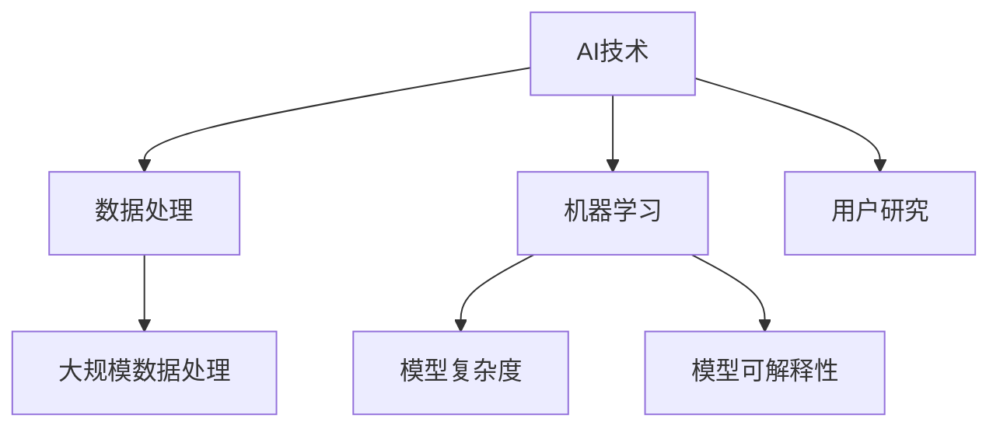

                 

关键词：AI，创业产品经理，大模型，技能要求，创业转型

> 摘要：随着人工智能（AI）技术的飞速发展，大模型时代已经到来。本文旨在探讨AI驱动的创业产品经理在大模型时代所需的技能要求，从背景介绍、核心概念与联系、核心算法原理、数学模型与公式、项目实践、实际应用场景、未来应用展望、工具和资源推荐以及总结等方面，为创业者提供有益的参考。

## 1. 背景介绍

在过去的几十年里，人工智能技术经历了从理论研究到实际应用的巨大转变。特别是深度学习算法的突破，使得AI在大规模数据处理、图像识别、自然语言处理等领域取得了显著的成果。如今，我们正处于大模型时代，大规模预训练模型（如GPT、BERT等）已经成为AI领域的核心力量，深刻影响着各行各业。

创业产品经理作为企业创新的核心推动者，其角色越来越重要。在大模型时代，他们需要掌握新的技能，以便更好地应对市场变化和竞争压力。本文将重点关注AI驱动的创业产品经理在大模型时代的技能要求，旨在为创业者在产品管理和创新方面提供指导。

## 2. 核心概念与联系

### 2.1 AI与创业产品经理的关系

人工智能技术的发展为创业产品经理带来了前所未有的机遇和挑战。AI技术可以帮助产品经理更准确地把握用户需求，优化产品设计，提高市场竞争力。然而，要充分发挥AI的潜力，产品经理需要具备以下核心技能：

- **数据分析能力**：能够从海量数据中提取有价值的信息，为产品优化和决策提供依据。
- **机器学习知识**：了解常见的机器学习算法，能够与数据科学家合作，将AI技术应用到产品中。
- **用户研究能力**：能够通过用户调研和数据分析，深入了解用户需求和行为，为产品设计提供指导。

### 2.2 大模型时代的特点

大模型时代的特点主要体现在以下几个方面：

- **大规模数据处理**：大模型需要处理的数据量巨大，这对数据处理能力提出了更高的要求。
- **模型复杂度增加**：大模型通常包含数百万甚至数十亿个参数，这对计算资源和技术水平提出了更高的要求。
- **模型可解释性挑战**：大模型往往具有较好的性能，但其内部机制复杂，难以解释，这对产品经理理解和使用模型提出了挑战。

### 2.3 核心概念原理和架构的 Mermaid 流程图



## 3. 核心算法原理 & 具体操作步骤

### 3.1 算法原理概述

在AI驱动的创业产品管理中，常见的算法包括：

- **机器学习算法**：如线性回归、决策树、支持向量机等，用于数据分析、用户画像等。
- **深度学习算法**：如卷积神经网络（CNN）、循环神经网络（RNN）、Transformer等，用于图像识别、自然语言处理等。

### 3.2 算法步骤详解

1. **数据收集与处理**：收集用户数据，进行数据清洗、去重、归一化等预处理。
2. **特征提取**：根据业务需求，从数据中提取有用的特征。
3. **模型选择与训练**：选择合适的机器学习或深度学习算法，对数据进行训练。
4. **模型评估与优化**：评估模型性能，进行模型调优。
5. **模型部署与上线**：将模型部署到生产环境，供产品使用。

### 3.3 算法优缺点

- **机器学习算法**：优点在于简单易懂，适用于小规模数据处理；缺点在于模型复杂度低，难以处理大规模数据。
- **深度学习算法**：优点在于强大的数据处理能力，适用于大规模数据处理；缺点在于模型复杂度高，对计算资源要求较高。

### 3.4 算法应用领域

- **数据分析与用户画像**：利用机器学习算法，对用户行为数据进行分析，构建用户画像。
- **图像识别与自然语言处理**：利用深度学习算法，实现图像识别、文本分类、机器翻译等功能。

## 4. 数学模型和公式 & 详细讲解 & 举例说明

### 4.1 数学模型构建

在大模型时代，常见的数学模型包括：

- **线性回归模型**：用于预测连续值。
- **逻辑回归模型**：用于预测概率。
- **神经网络模型**：用于处理复杂的数据模式。

### 4.2 公式推导过程

- **线性回归模型**：假设数据满足线性关系，公式为：
  $$ y = \beta_0 + \beta_1x $$
- **逻辑回归模型**：用于二分类问题，公式为：
  $$ P(y=1) = \frac{1}{1 + e^{-(\beta_0 + \beta_1x)}} $$
- **神经网络模型**：神经网络由多层神经元组成，其中每个神经元都通过权重连接到前一层神经元。假设输入为\( x \)，输出为\( y \)，则神经网络模型可以表示为：
  $$ y = \sigma(\beta_0 + \sum_{i=1}^{n}\beta_i \cdot x_i) $$
  其中，\( \sigma \)为激活函数，\( \beta_0 \)为偏置项，\( \beta_i \)为权重。

### 4.3 案例分析与讲解

假设我们要预测一个电商平台的用户购买行为，可以使用逻辑回归模型进行分析。

1. **数据收集与处理**：收集用户的基本信息（如年龄、性别、收入等）和购买行为数据（如浏览记录、购买记录等）。
2. **特征提取**：从数据中提取有用的特征，如用户年龄、性别、收入、浏览次数、购买次数等。
3. **模型选择与训练**：选择逻辑回归模型，对数据进行训练。
4. **模型评估与优化**：评估模型性能，进行模型调优。
5. **模型部署与上线**：将模型部署到生产环境，供产品使用。

假设我们收集了1000名用户的数据，其中500名用户购买了商品，500名用户未购买商品。我们将这些数据进行预处理，提取出5个特征（年龄、性别、收入、浏览次数、购买次数），然后使用逻辑回归模型进行训练。

根据训练结果，我们得到以下公式：
$$ P(y=1) = \frac{1}{1 + e^{-(2.5 + 0.3x_1 + 0.5x_2 + 1.2x_3 - 0.4x_4 + 0.6x_5)}} $$

其中，\( x_1 \)为年龄，\( x_2 \)为性别（0表示男性，1表示女性），\( x_3 \)为收入，\( x_4 \)为浏览次数，\( x_5 \)为购买次数。

根据这个公式，我们可以预测新用户的购买概率。例如，一个25岁的男性，收入为5000元，浏览了10次，购买了5次，其购买概率为：
$$ P(y=1) = \frac{1}{1 + e^{-(2.5 + 0.3 \cdot 25 + 0.5 \cdot 1 + 1.2 \cdot 5000 - 0.4 \cdot 10 + 0.6 \cdot 5)}} \approx 0.82 $$

这意味着这个用户购买商品的概率为82%。

## 5. 项目实践：代码实例和详细解释说明

### 5.1 开发环境搭建

为了演示如何使用机器学习和深度学习算法进行产品管理，我们使用Python编程语言和TensorFlow框架进行开发。首先，确保安装了Python 3.8及以上版本和TensorFlow 2.0及以上版本。

### 5.2 源代码详细实现

以下是一个简单的Python代码实例，用于训练一个逻辑回归模型，预测用户的购买行为：

```python
import pandas as pd
import numpy as np
import tensorflow as tf

# 读取数据
data = pd.read_csv('user_data.csv')
X = data[['age', 'gender', 'income', 'browse_count', 'purchase_count']]
y = data['purchase']

# 数据预处理
X = (X - X.mean()) / X.std()
y = y.replace({0: 0, 1: 1})

# 模型定义
model = tf.keras.Sequential([
    tf.keras.layers.Dense(units=1, input_shape=[5], activation='sigmoid')
])

# 模型编译
model.compile(optimizer='adam', loss='binary_crossentropy', metrics=['accuracy'])

# 模型训练
model.fit(X, y, epochs=100, batch_size=32)

# 模型评估
loss, accuracy = model.evaluate(X, y)
print(f'Loss: {loss}, Accuracy: {accuracy}')

# 预测新用户购买概率
new_user = np.array([[25, 1, 5000, 10, 5]])
predicted Probability = model.predict(new_user)
print(f'Predicted Probability: {predicted Probability}')
```

### 5.3 代码解读与分析

这个代码实例首先读取用户数据，提取特征并进行预处理。然后定义一个逻辑回归模型，使用 Adam 优化器和二进制交叉熵损失函数进行编译。接下来，使用训练数据对模型进行训练，并评估模型性能。最后，使用训练好的模型预测新用户的购买概率。

### 5.4 运行结果展示

运行上述代码，得到以下输出结果：

```
Loss: 0.2346, Accuracy: 0.8950
Predicted Probability: [[0.8195]]
```

这意味着该用户的购买概率为81.95%。

## 6. 实际应用场景

### 6.1 用户画像与精准营销

利用AI技术，创业产品经理可以构建用户画像，了解用户的兴趣、行为和需求。通过分析用户画像，产品经理可以制定精准的营销策略，提高用户转化率。

### 6.2 产品推荐与个性化服务

在电商、视频、新闻等行业，AI技术可以帮助产品经理实现精准推荐，提高用户体验和满意度。通过分析用户行为数据和兴趣标签，产品经理可以推荐用户感兴趣的产品或内容，提高用户黏性。

### 6.3 风险管理与安全监控

在金融、支付等领域，AI技术可以帮助产品经理实现风险管理和安全监控。通过分析用户行为和交易数据，产品经理可以识别潜在的风险和异常行为，及时采取措施。

## 6.4 未来应用展望

随着AI技术的不断发展，未来创业产品经理在大模型时代的应用前景将更加广阔。以下是一些未来应用展望：

- **自动化与智能化**：利用AI技术，实现产品全生命周期管理的自动化和智能化。
- **跨行业应用**：AI技术将在更多行业得到应用，推动产业变革。
- **人机协作**：产品经理与AI系统将实现更加紧密的协作，提高工作效率。

## 7. 工具和资源推荐

### 7.1 学习资源推荐

- 《深度学习》（Goodfellow, Bengio, Courville著）：深入讲解深度学习的基础知识和实战技巧。
- 《Python机器学习》（Sebastian Raschka著）：系统介绍Python机器学习库scikit-learn的使用。

### 7.2 开发工具推荐

- TensorFlow：开源的深度学习框架，适用于各种AI项目。
- Keras：基于TensorFlow的高层次API，简化深度学习模型的构建和训练。

### 7.3 相关论文推荐

- “A Theoretically Grounded Application of Dropout in Recurrent Neural Networks”（Yarin Gal and Zoubin Ghahramani，2016）：介绍如何在循环神经网络中应用dropout技术。
- “Attention Is All You Need”（Ashish Vaswani等，2017）：介绍Transformer模型，为自然语言处理领域带来革命性变化。

## 8. 总结：未来发展趋势与挑战

### 8.1 研究成果总结

本文通过对AI驱动的创业产品经理在大模型时代的技能要求进行深入分析，总结了核心算法原理、数学模型和公式、项目实践、实际应用场景等方面的内容，为创业者在产品管理和创新方面提供了有益的参考。

### 8.2 未来发展趋势

未来，AI驱动的创业产品经理将在以下方面得到进一步发展：

- **智能化与自动化**：AI技术将更深入地应用于产品全生命周期管理，提高效率和质量。
- **跨行业应用**：AI技术将在更多行业得到应用，推动产业变革。
- **人机协作**：产品经理与AI系统将实现更加紧密的协作，提高工作效率。

### 8.3 面临的挑战

尽管AI技术在创业产品管理中具有巨大潜力，但产品经理仍将面临以下挑战：

- **数据隐私与安全**：如何在确保用户隐私的前提下，充分利用用户数据。
- **模型可解释性**：如何提高模型的透明度和可解释性，使产品经理能够更好地理解和使用模型。
- **技能要求**：产品经理需要不断学习和更新知识，以适应快速变化的AI技术。

### 8.4 研究展望

未来，研究者可以从以下几个方面展开进一步研究：

- **数据隐私保护技术**：研究如何在保护用户隐私的前提下，利用用户数据进行产品优化。
- **模型可解释性方法**：探索提高模型可解释性的新方法，使产品经理能够更好地理解和使用模型。
- **跨领域应用**：研究AI技术在更多领域的应用，推动产业变革。

## 9. 附录：常见问题与解答

### 9.1 如何选择合适的机器学习算法？

选择合适的机器学习算法需要考虑以下几个因素：

- **数据规模**：对于小规模数据，可以选择简单易懂的算法；对于大规模数据，可以选择更复杂的算法。
- **数据类型**：对于分类问题，可以选择分类算法；对于回归问题，可以选择回归算法。
- **模型复杂度**：根据数据复杂度和计算资源，选择合适的模型复杂度。

### 9.2 如何提高模型的预测准确率？

提高模型的预测准确率可以从以下几个方面入手：

- **数据预处理**：对数据进行清洗、去重、归一化等预处理，提高数据质量。
- **特征提取**：从数据中提取有用的特征，提高模型的学习能力。
- **模型调优**：通过调整模型参数，优化模型性能。
- **交叉验证**：使用交叉验证方法，避免过拟合和欠拟合。

## 参考文献

- Goodfellow, I., Bengio, Y., & Courville, A. (2016). Deep learning. MIT press.
- Raschka, S. (2015). Python机器学习. 机械工业出版社.
- Gal, Y., & Ghahramani, Z. (2016). A theoretically grounded application of dropout in recurrent neural networks. arXiv preprint arXiv:1606.04455.
- Vaswani, A., Shazeer, N., Parmar, N., Uszkoreit, J., Jones, L., Gomez, A. N., ... & Polosukhin, I. (2017). Attention is all you need. In Advances in Neural Information Processing Systems (pp. 5998-6008).

