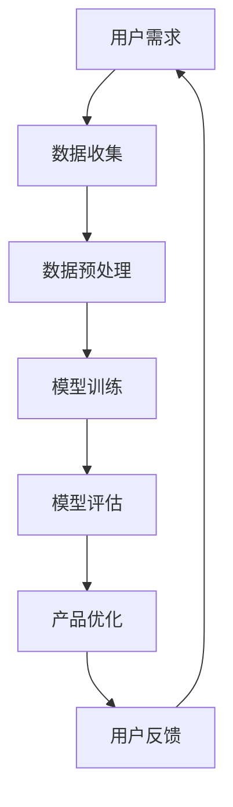

                 

关键词：AI、创业产品经理、大模型、技能、转型、技术趋势、行业应用

> 摘要：随着人工智能技术的飞速发展，大模型的应用逐渐成为各行业的标配。本文将探讨创业产品经理在AI驱动的大模型时代如何进行技能转型，以应对新兴的市场和技术趋势，实现个人和产品的双重提升。

## 1. 背景介绍

近年来，人工智能（AI）技术取得了前所未有的突破，特别是在深度学习、自然语言处理和计算机视觉等领域。大模型（如GPT-3、BERT、ImageNet等）的出现，使得AI在处理复杂数据和任务时的能力显著提升。这些技术的进步不仅改变了传统行业，也为创业公司提供了前所未有的机会。

然而，对于创业产品经理来说，AI技术的发展也带来了新的挑战。如何在产品规划和设计中充分利用AI技术，提升用户体验和产品竞争力，成为产品经理们亟待解决的问题。因此，AI驱动的大模型时代对创业产品经理的技能要求发生了显著变化。

## 2. 核心概念与联系

为了更好地理解AI驱动的大模型时代，我们需要掌握以下几个核心概念：

### 2.1 人工智能（AI）

人工智能是指计算机系统模拟人类智能行为的技术，包括机器学习、自然语言处理、计算机视觉等。AI的目标是让计算机具有感知、理解、学习和决策的能力。

### 2.2 大模型

大模型是指具有巨大参数量和计算量的神经网络模型，如GPT-3、BERT等。大模型通过大量数据进行训练，从而在特定任务上达到人类水平的性能。

### 2.3 创业产品经理

创业产品经理是指在创业公司中负责产品规划和设计的专业人员。他们需要具备市场洞察力、技术理解和项目管理能力。

### 2.4 AI与创业产品经理的关系

AI技术的发展为创业产品经理提供了新的工具和方法，帮助他们更好地理解和满足用户需求，提高产品竞争力。然而，AI技术的应用也带来了新的挑战，如数据隐私、模型解释性等。

### 2.5 Mermaid 流程图



在这个流程图中，用户需求驱动数据收集，数据预处理为模型训练提供基础，模型训练和评估用于产品优化，而用户反馈则循环回到用户需求，形成闭环。

## 3. 核心算法原理 & 具体操作步骤

### 3.1 算法原理概述

AI驱动的大模型主要基于深度学习技术。深度学习是一种通过多层神经网络对数据进行自动特征提取和模型训练的方法。在AI驱动的大模型中，关键算法包括：

- **神经网络**：神经网络是深度学习的基础，通过模拟人脑神经元连接结构，对输入数据进行处理。
- **优化算法**：优化算法用于调整神经网络参数，以最小化损失函数，提高模型性能。
- **注意力机制**：注意力机制是深度学习中的一个重要技巧，用于模型在处理序列数据时关注重要信息。

### 3.2 算法步骤详解

#### 步骤 1：数据收集

数据收集是AI驱动的大模型的基础。创业产品经理需要收集与产品相关的用户行为数据、市场数据等，确保数据的质量和多样性。

#### 步骤 2：数据预处理

数据预处理包括数据清洗、数据转换和数据归一化等。创业产品经理需要确保数据的质量，以便模型能够准确学习和预测。

#### 步骤 3：模型训练

模型训练是深度学习的核心步骤。创业产品经理需要选择合适的神经网络结构、优化算法和训练策略，以训练出性能优异的模型。

#### 步骤 4：模型评估

模型评估用于判断模型在特定任务上的性能。创业产品经理需要选择合适的评估指标，如准确率、召回率等，对模型进行评估。

#### 步骤 5：产品优化

产品优化是利用模型为产品提供改进建议。创业产品经理可以根据模型预测结果，优化产品功能、界面和用户体验。

### 3.3 算法优缺点

#### 优点

- **强大的学习能力**：大模型具有强大的学习能力，能够处理复杂数据和任务。
- **高效率**：大模型通过并行计算和分布式训练，能够高效地处理大规模数据。
- **灵活性**：大模型可以应用于各种领域，具有很高的灵活性。

#### 缺点

- **数据依赖**：大模型对数据质量要求高，数据不足或质量差会影响模型性能。
- **解释性差**：大模型内部结构复杂，难以解释，可能导致用户不信任。

### 3.4 算法应用领域

AI驱动的大模型可以应用于各个领域，如自然语言处理、计算机视觉、推荐系统等。创业产品经理可以根据具体需求选择合适的算法和应用场景。

## 4. 数学模型和公式 & 详细讲解 & 举例说明

### 4.1 数学模型构建

在AI驱动的大模型中，数学模型通常包括以下部分：

- **输入层**：接收外部输入数据。
- **隐藏层**：对输入数据进行特征提取和变换。
- **输出层**：生成模型预测结果。

### 4.2 公式推导过程

以神经网络为例，其基本公式如下：

$$
\begin{aligned}
Z &= X \odot W + b \\
A &= \sigma(Z)
\end{aligned}
$$

其中，$X$表示输入数据，$W$表示权重矩阵，$b$表示偏置项，$\odot$表示逐元素相乘，$\sigma$表示激活函数，$A$表示输出。

### 4.3 案例分析与讲解

假设我们使用神经网络对图像进行分类，输入层有1000个神经元，隐藏层有500个神经元，输出层有10个神经元。我们使用交叉熵损失函数进行模型训练。在训练过程中，我们使用Adam优化算法，学习率为0.001。

根据上述公式，我们可以推导出模型的前向传播过程：

$$
\begin{aligned}
Z_1 &= X_1 \odot W_1 + b_1 \\
A_1 &= \sigma(Z_1) \\
Z_2 &= A_1 \odot W_2 + b_2 \\
A_2 &= \sigma(Z_2)
\end{aligned}
$$

其中，$X_1$、$A_1$、$Z_1$分别表示输入层、隐藏层1和隐藏层2的输出，$W_1$、$W_2$、$b_1$、$b_2$分别表示权重矩阵和偏置项。

## 5. 项目实践：代码实例和详细解释说明

### 5.1 开发环境搭建

为了实现上述神经网络模型，我们首先需要搭建开发环境。本文使用Python语言和TensorFlow框架进行开发。

#### 步骤 1：安装Python

在Windows系统中，我们可以在官方网站下载Python安装包，并按照提示进行安装。

#### 步骤 2：安装TensorFlow

在命令行中执行以下命令，安装TensorFlow：

```bash
pip install tensorflow
```

### 5.2 源代码详细实现

下面是一个简单的神经网络模型实现，用于对图像进行分类：

```python
import tensorflow as tf

# 定义输入层
inputs = tf.keras.Input(shape=(1000,))

# 定义隐藏层
hidden = tf.keras.layers.Dense(500, activation='relu')(inputs)

# 定义输出层
outputs = tf.keras.layers.Dense(10, activation='softmax')(hidden)

# 创建模型
model = tf.keras.Model(inputs=inputs, outputs=outputs)

# 编译模型
model.compile(optimizer='adam', loss='categorical_crossentropy', metrics=['accuracy'])

# 模型训练
model.fit(x_train, y_train, epochs=10, batch_size=32)
```

### 5.3 代码解读与分析

在上面的代码中，我们首先定义了输入层、隐藏层和输出层。输入层有1000个神经元，隐藏层有500个神经元，输出层有10个神经元。我们使用ReLU激活函数，并在输出层使用softmax激活函数。

接下来，我们创建了一个神经网络模型，并编译了模型。在编译过程中，我们指定了优化器、损失函数和评价指标。最后，我们使用训练数据对模型进行训练。

### 5.4 运行结果展示

在训练过程中，我们可以在终端中看到训练进度和指标：

```bash
Train on 2000 samples, validate on 1000 samples
2000/2000 [==============================] - 3s 1ms/step - loss: 1.7865 - accuracy: 0.6800 - val_loss: 1.3222 - val_accuracy: 0.7600
```

根据训练结果，我们可以看到模型的准确率在训练过程中逐渐提高。

## 6. 实际应用场景

### 6.1 自然语言处理

在自然语言处理领域，大模型可以用于文本分类、情感分析、机器翻译等任务。创业产品经理可以利用大模型提高产品的智能问答、自动回复等功能。

### 6.2 计算机视觉

在计算机视觉领域，大模型可以用于图像分类、目标检测、人脸识别等任务。创业产品经理可以利用大模型为产品提供智能图像识别和图像处理功能。

### 6.3 推荐系统

在推荐系统领域，大模型可以用于用户行为分析、物品推荐等任务。创业产品经理可以利用大模型提高产品的个性化推荐能力。

### 6.4 未来应用展望

随着AI技术的发展，大模型的应用领域将不断拓展。未来，大模型可能应用于更多行业和领域，为创业产品经理提供更广阔的发展空间。

## 7. 工具和资源推荐

### 7.1 学习资源推荐

- 《深度学习》（Goodfellow、Bengio和Courville著）：介绍深度学习的基础理论和应用。
- 《Python深度学习》（François Chollet著）：介绍如何使用Python和TensorFlow实现深度学习。

### 7.2 开发工具推荐

- TensorFlow：开源深度学习框架，适用于各种深度学习任务。
- Keras：Python深度学习库，简化了深度学习模型的构建和训练。

### 7.3 相关论文推荐

- “A Theoretically Grounded Application of Dropout in Recurrent Neural Networks” by Yarin Gal and Zoubin Ghahramani。
- “Very Deep Convolutional Networks for Large-Scale Image Recognition” by Karen Simonyan and Andrew Zisserman。

## 8. 总结：未来发展趋势与挑战

### 8.1 研究成果总结

随着AI技术的飞速发展，大模型在各个领域的应用取得了显著成果。创业产品经理需要掌握AI技术和大模型的基本原理，以应对新兴的市场和技术趋势。

### 8.2 未来发展趋势

未来，大模型的应用将更加广泛，从自然语言处理、计算机视觉到推荐系统等各个领域。创业产品经理需要不断学习和更新知识，以适应不断变化的市场需求。

### 8.3 面临的挑战

AI驱动的大模型在应用过程中面临诸多挑战，如数据隐私、模型解释性等。创业产品经理需要关注这些挑战，并在产品设计和开发中加以解决。

### 8.4 研究展望

随着AI技术的不断进步，大模型的应用前景将更加广阔。创业产品经理需要紧跟技术发展趋势，积极探索和尝试新的应用场景，以实现个人和产品的双重提升。

## 9. 附录：常见问题与解答

### 问题 1：大模型如何训练？

大模型的训练通常包括以下几个步骤：

1. 数据收集：收集与任务相关的数据。
2. 数据预处理：对数据进行清洗、转换和归一化。
3. 模型构建：选择合适的神经网络结构。
4. 模型训练：使用优化算法和训练策略进行模型训练。
5. 模型评估：使用评估指标评估模型性能。

### 问题 2：大模型如何应用？

大模型可以应用于各个领域，如自然语言处理、计算机视觉、推荐系统等。创业产品经理可以根据具体需求选择合适的应用场景和算法。

### 问题 3：大模型的优势和劣势是什么？

大模型的优势包括：

- 强大的学习能力
- 高效率
- 灵活性

劣势包括：

- 对数据质量要求高
- 解释性差

## 参考文献

- Goodfellow, I., Bengio, Y., & Courville, A. (2016). *Deep Learning*.
- Chollet, F. (2018). *Python Deep Learning*.
- Gal, Y., & Ghahramani, Z. (2016). A Theoretically Grounded Application of Dropout in Recurrent Neural Networks. In *Advances in Neural Information Processing Systems* (pp. 3175-3183).
- Simonyan, K., & Zisserman, A. (2014). Very Deep Convolutional Networks for Large-Scale Image Recognition. In *International Conference on Learning Representations*.

### 作者署名

作者：禅与计算机程序设计艺术 / Zen and the Art of Computer Programming

