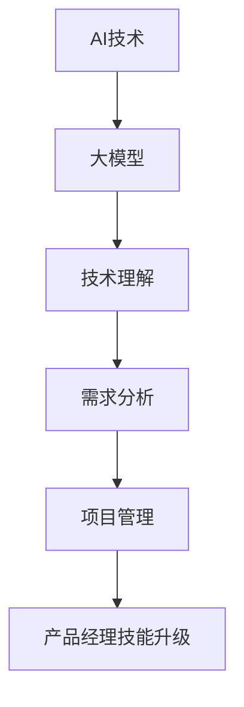

                 

关键词：AI、创业产品经理、大模型、技能升级、技术架构

> 摘要：随着人工智能技术的快速发展，大模型在各个领域的应用越来越广泛。作为创业产品经理，掌握AI驱动的技能升级变得至关重要。本文将深入探讨大模型时代的技能升级路径，帮助创业产品经理在快速变化的技术环境中保持竞争力。

## 1. 背景介绍

近年来，人工智能（AI）技术的飞速发展给各行各业带来了深远影响。特别是大模型的出现，如GPT、BERT等，不仅在自然语言处理领域取得了显著成果，还在计算机视觉、语音识别、推荐系统等多个领域展现出了巨大的潜力。创业产品经理作为推动企业创新和增长的关键角色，面对这一技术变革，需要及时更新和提升自身的技能，以更好地应对市场变化和用户需求。

### 大模型的兴起

大模型是指通过深度学习技术训练出的具有极高参数量的神经网络模型。这些模型拥有强大的表征能力和泛化能力，能够在处理复杂数据时取得优异的性能。例如，GPT-3模型拥有1750亿个参数，能够生成流畅的自然语言文本，广泛应用于聊天机器人、自动写作、翻译等领域。BERT模型则在文本理解任务中表现出色，被广泛应用于搜索引擎、问答系统等。

### 创业产品经理的角色

创业产品经理是连接技术和市场的重要桥梁，他们不仅要理解技术，还要洞察市场需求，规划产品方向，推动产品开发。随着大模型技术的应用，产品经理需要具备以下能力：

- **技术理解能力**：理解大模型的基本原理和实现方法，能够与技术人员有效沟通。
- **需求分析能力**：洞察用户需求，将技术优势转化为实际产品功能。
- **项目管理能力**：协调团队资源，确保产品按时按质完成。

## 2. 核心概念与联系

为了更好地理解大模型时代的产品经理技能升级，我们首先需要明确几个核心概念：

### 2.1 人工智能（AI）

人工智能是指使计算机模拟人类智能行为的技术。AI可以分为两大类：弱AI和强AI。弱AI专注于特定任务的智能，如聊天机器人、自动驾驶等，而强AI则具备普遍的智能，能够在任何领域表现出人类级别的智能。

### 2.2 大模型（Big Model）

大模型是指参数量非常大的神经网络模型，通常通过大量的数据训练得到。大模型的优势在于其强大的表征能力和泛化能力，能够处理复杂的数据任务。

### 2.3 产品经理的技能

产品经理的技能包括技术理解、需求分析、项目管理等多方面。在AI驱动的大模型时代，产品经理需要更加深入地理解技术，以便更好地应用AI技术。

### 2.4 Mermaid 流程图

为了更直观地展示大模型与产品经理技能的联系，我们使用Mermaid绘制一个流程图：



## 3. 核心算法原理 & 具体操作步骤

### 3.1 算法原理概述

大模型的算法原理主要基于深度学习。深度学习是一种基于多层神经网络的学习方法，通过前向传播和反向传播更新网络权重，从而实现模型的训练。大模型通常包含数百万甚至数亿个参数，能够对复杂的数据进行高效处理。

### 3.2 算法步骤详解

大模型的训练过程可以分为以下几个步骤：

1. **数据预处理**：对原始数据进行清洗、归一化等处理，使其适合模型训练。
2. **模型设计**：设计神经网络结构，确定网络的层数、层间连接方式等。
3. **模型训练**：使用训练数据对模型进行训练，通过反向传播算法更新网络权重。
4. **模型评估**：使用验证数据对模型进行评估，调整模型参数以优化性能。
5. **模型部署**：将训练好的模型部署到产品中，供用户使用。

### 3.3 算法优缺点

大模型的优点包括：

- **强大的表征能力**：能够对复杂数据进行高效处理。
- **广泛的适用性**：适用于多个领域的任务。

大模型的缺点包括：

- **计算资源消耗大**：训练和部署大模型需要大量的计算资源和存储空间。
- **数据依赖性强**：模型的性能高度依赖于训练数据的质量。

### 3.4 算法应用领域

大模型在多个领域得到了广泛应用，如：

- **自然语言处理**：用于自动写作、聊天机器人、翻译等。
- **计算机视觉**：用于图像识别、物体检测等。
- **语音识别**：用于语音识别、语音生成等。

## 4. 数学模型和公式 & 详细讲解 & 举例说明

### 4.1 数学模型构建

大模型通常基于多层感知机（MLP）或卷积神经网络（CNN）等结构。以MLP为例，其数学模型可以表示为：

$$y = f(W_n \cdot a_{n-1} + b_n)$$

其中，$y$ 是输出，$f$ 是激活函数，$W_n$ 和 $b_n$ 分别是第 $n$ 层的权重和偏置。

### 4.2 公式推导过程

以卷积神经网络为例，其前向传播过程可以表示为：

$$
\begin{aligned}
h^{(l)}_{ij} &= \sigma \left( \sum_{k=1}^{m} W^{(l)}_{ik} h^{(l-1)}_{kj} + b^{(l)}_i \right) \\
Z^{(l)}_{ij} &= W^{(l)}_{ik} h^{(l-1)}_{kj} + b^{(l)}_i
\end{aligned}
$$

其中，$h^{(l)}_{ij}$ 是第 $l$ 层的第 $i$ 个神经元与第 $j$ 个特征之间的连接权重，$Z^{(l)}_{ij}$ 是第 $l$ 层的第 $i$ 个神经元的输入。

### 4.3 案例分析与讲解

以GPT-3模型为例，其训练过程可以简化为：

1. **数据预处理**：将文本数据转换为序列。
2. **模型设计**：设计多层感知机结构，确定网络的层数和神经元数量。
3. **模型训练**：使用训练数据对模型进行训练，通过反向传播更新网络权重。
4. **模型评估**：使用验证数据对模型进行评估，调整模型参数。

## 5. 项目实践：代码实例和详细解释说明

### 5.1 开发环境搭建

为了实现一个简单的大模型，我们使用Python编程语言和TensorFlow框架。首先，我们需要安装TensorFlow：

```bash
pip install tensorflow
```

### 5.2 源代码详细实现

以下是一个简单的大模型实现：

```python
import tensorflow as tf

# 定义模型
model = tf.keras.Sequential([
    tf.keras.layers.Dense(128, activation='relu', input_shape=(784,)),
    tf.keras.layers.Dense(10, activation='softmax')
])

# 编译模型
model.compile(optimizer='adam',
              loss='categorical_crossentropy',
              metrics=['accuracy'])

# 训练模型
model.fit(x_train, y_train, epochs=5)
```

### 5.3 代码解读与分析

上述代码定义了一个简单的多层感知机模型，包含一个输入层、一个隐藏层和一个输出层。输入层有784个神经元，对应28x28像素的图像。隐藏层有128个神经元，输出层有10个神经元，对应10个类别。

在编译模型时，我们指定了优化器和损失函数。这里使用的是交叉熵损失函数，适用于多分类问题。

在训练模型时，我们使用的是训练数据，并指定了训练的轮次。

### 5.4 运行结果展示

```python
# 测试模型
loss, accuracy = model.evaluate(x_test, y_test)
print(f"Test accuracy: {accuracy:.2f}")
```

上述代码用于评估模型的测试集性能。测试集性能可以帮助我们了解模型在未知数据上的表现。

## 6. 实际应用场景

### 6.1 自然语言处理

在自然语言处理领域，大模型如GPT-3被广泛应用于自动写作、聊天机器人、翻译等任务。例如，GPT-3可以生成流畅的自然语言文本，用于新闻写作、产品评论等。

### 6.2 计算机视觉

在计算机视觉领域，大模型如ResNet、VGG等被广泛应用于图像识别、物体检测等任务。例如，可以使用ResNet模型对图像中的猫进行识别。

### 6.3 语音识别

在语音识别领域，大模型如CTC、Seq2Seq等被广泛应用于语音识别、语音合成等任务。例如，可以使用CTC模型将语音信号转换为文本。

## 7. 工具和资源推荐

### 7.1 学习资源推荐

- 《深度学习》（Goodfellow, Bengio, Courville）是一本经典的深度学习教材，适合初学者和进阶者。
- TensorFlow官方文档提供了丰富的教程和案例，适合实战学习。

### 7.2 开发工具推荐

- Jupyter Notebook：一个交互式计算环境，适合编写和运行代码。
- Google Colab：基于Jupyter Notebook的在线平台，提供免费的GPU资源，适合深度学习实践。

### 7.3 相关论文推荐

- "Attention Is All You Need"：介绍Transformer模型的经典论文。
- "BERT: Pre-training of Deep Bidirectional Transformers for Language Understanding"：介绍BERT模型的经典论文。

## 8. 总结：未来发展趋势与挑战

### 8.1 研究成果总结

大模型技术取得了显著的成果，不仅在学术领域，还在实际应用中展现出了巨大的潜力。未来，大模型技术有望在更多领域取得突破。

### 8.2 未来发展趋势

- **更大规模的模型**：随着计算资源的提升，更大规模的模型将不断出现。
- **更精细的任务划分**：大模型将应用于更细分的任务，如医学影像分析、金融风控等。

### 8.3 面临的挑战

- **计算资源消耗**：大模型的训练和部署需要大量的计算资源和存储空间。
- **数据隐私和安全**：大模型训练过程中涉及大量数据，如何保障数据隐私和安全是一个重要问题。

### 8.4 研究展望

未来，大模型技术将在更多领域得到应用，推动人工智能的发展。同时，我们也需要关注计算资源、数据隐私等挑战，确保大模型技术的可持续发展。

## 9. 附录：常见问题与解答

### 9.1 什么是大模型？

大模型是指参数量非常大的神经网络模型，通常通过深度学习技术训练得到。大模型拥有强大的表征能力和泛化能力，能够在处理复杂数据时取得优异的性能。

### 9.2 大模型有什么应用领域？

大模型广泛应用于自然语言处理、计算机视觉、语音识别、推荐系统等多个领域。例如，GPT-3模型在自然语言处理领域取得了显著成果，ResNet模型在计算机视觉领域表现优异。

### 9.3 如何训练大模型？

训练大模型通常包括以下步骤：数据预处理、模型设计、模型训练、模型评估和模型部署。具体实现可以参考TensorFlow、PyTorch等深度学习框架的官方文档。

### 9.4 大模型有什么优缺点？

大模型的优点包括强大的表征能力和广泛的适用性，缺点包括计算资源消耗大、数据依赖性强。在实际应用中，需要根据具体任务和资源情况选择合适的模型。

### 9.5 大模型的发展趋势是什么？

未来，大模型技术将在更多领域得到应用，推动人工智能的发展。同时，计算资源、数据隐私等挑战也需要得到关注和解决。

### 9.6 大模型是否会导致失业？

大模型技术的发展可能会对某些工作岗位造成冲击，但同时也会创造新的就业机会。例如，在人工智能领域，需要大量的算法工程师、数据科学家、产品经理等人才。因此，关键在于如何适应这一变化，不断提升自身的技能。

---

作者：禅与计算机程序设计艺术 / Zen and the Art of Computer Programming
----------------------------------------------------------------
>

