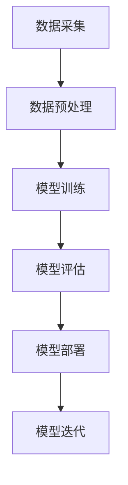

                 

关键词：AI 驱动、创业产品、路线图、大模型、赋能

> 摘要：本文将深入探讨如何利用人工智能，特别是大模型技术，来指导创业产品的路线图规划。我们将从背景介绍、核心概念、算法原理、数学模型、项目实践、实际应用场景和未来展望等多个方面，系统阐述如何利用人工智能技术提升创业产品的竞争力。

## 1. 背景介绍

在当前快速变化的商业环境中，创业公司面临着前所未有的挑战和机遇。一方面，技术革新日新月异，尤其是人工智能（AI）和大数据技术的迅猛发展，为创业公司提供了强大的工具和资源。另一方面，市场竞争愈发激烈，创业公司需要迅速适应市场变化，打造出具有竞争力的产品。

人工智能，作为一种能够模拟、延伸和扩展人类智能的技术，正在深刻地改变各行各业。从自动驾驶到智能客服，从智能医疗到金融分析，人工智能的应用领域越来越广泛。其中，大模型（Large Model）作为人工智能领域的一个重要分支，凭借其强大的数据处理和分析能力，正逐渐成为创业公司产品开发的核心驱动力。

大模型技术不仅能够处理大规模数据，还能够通过深度学习、自然语言处理等技术，实现对数据的自动理解和预测。这对于创业公司来说，意味着可以从海量数据中提取有价值的信息，从而指导产品开发，提高市场竞争力。

本文将围绕如何利用大模型技术来规划创业产品的路线图，探讨其核心原理、实现步骤、应用场景以及未来发展趋势。希望通过本文的探讨，能够为创业公司提供一些实际的操作指南和思考方向。

## 2. 核心概念与联系

### 2.1. 大模型技术概述

大模型技术，即大型模型（Large Model）技术，是指能够处理海量数据、具备高度抽象能力和强泛化能力的机器学习模型。这些模型通常具有数亿甚至数十亿个参数，通过深度学习算法，能够在大量数据上进行训练，从而实现对复杂问题的解决。

大模型技术的基本原理是模拟人脑的神经网络结构，通过多层神经元的非线性变换，实现对数据的自动编码和解码。在这个过程中，大模型能够学习到数据中的模式和规律，从而进行预测、分类、生成等操作。

### 2.2. 大模型与创业产品的联系

大模型技术在创业产品中的应用主要体现在以下几个方面：

1. **数据挖掘与分析**：大模型能够处理大规模数据，从数据中发现有价值的信息和规律，为创业公司提供决策支持。

2. **智能推荐系统**：大模型可以分析用户行为数据，实现精准推荐，提高用户的满意度和留存率。

3. **自然语言处理**：大模型可以处理和理解自然语言，实现智能客服、智能写作等功能，提升产品的用户体验。

4. **预测与优化**：大模型可以通过历史数据预测未来的趋势，帮助创业公司优化产品策略和运营决策。

### 2.3. 大模型技术架构

为了更好地理解大模型技术，我们可以使用Mermaid流程图来展示其基本架构：



- **数据采集**：从各种来源收集数据，包括内部数据和外部数据。
- **数据预处理**：对数据进行清洗、转换和归一化，使其适合模型训练。
- **模型训练**：使用深度学习算法对数据进行训练，构建大模型。
- **模型评估**：评估模型的效果，调整模型参数。
- **模型部署**：将训练好的模型部署到生产环境中，实现商业化应用。
- **模型迭代**：根据用户反馈和业务需求，不断优化模型。

## 3. 核心算法原理 & 具体操作步骤

### 3.1. 算法原理概述

大模型的核心算法是深度学习（Deep Learning），特别是基于神经网络（Neural Network）的算法。深度学习通过多层神经元的非线性变换，实现对数据的自动编码和解码。在这个过程中，模型会自动学习到数据中的模式和规律，从而进行预测和分类。

### 3.2. 算法步骤详解

1. **数据采集**：从各种来源收集数据，包括内部数据和外部数据。这些数据可以是结构化的，如数据库中的记录，也可以是非结构化的，如图像、文本、语音等。

2. **数据预处理**：对数据进行清洗、转换和归一化，使其适合模型训练。这一步非常重要，因为数据的质量直接影响模型的性能。

3. **模型设计**：根据业务需求，设计合适的神经网络结构。常见的神经网络结构包括卷积神经网络（CNN）、循环神经网络（RNN）、生成对抗网络（GAN）等。

4. **模型训练**：使用训练数据对神经网络进行训练，通过反向传播算法（Backpropagation）不断调整模型参数，使其能够准确预测或分类。

5. **模型评估**：使用测试数据对模型进行评估，判断模型的性能。常见的评估指标包括准确率、召回率、F1分数等。

6. **模型部署**：将训练好的模型部署到生产环境中，实现商业化应用。这一步通常需要使用模型管理平台，如TensorFlow Serving、PyTorchserve等。

7. **模型迭代**：根据用户反馈和业务需求，不断优化模型。这一过程可以是自动化的，通过持续学习（Continuous Learning）实现。

### 3.3. 算法优缺点

#### 优点：

1. **强大的数据处理能力**：大模型能够处理大规模数据，从数据中提取有价值的信息。

2. **高度自动化**：深度学习算法能够自动学习数据中的模式和规律，减少人工干预。

3. **强泛化能力**：大模型能够泛化到未见过的数据，具有较强的适应能力。

#### 缺点：

1. **计算资源消耗大**：大模型通常需要大量的计算资源进行训练和部署。

2. **数据需求高**：大模型需要大量数据才能达到较好的性能，对于数据稀缺的领域可能不适用。

3. **解释性差**：大模型的决策过程较为复杂，难以解释。

### 3.4. 算法应用领域

大模型技术已经在多个领域得到广泛应用，如：

1. **计算机视觉**：用于图像分类、目标检测、图像生成等。

2. **自然语言处理**：用于文本分类、情感分析、机器翻译等。

3. **语音识别**：用于语音识别、语音合成等。

4. **推荐系统**：用于商品推荐、内容推荐等。

5. **金融分析**：用于风险控制、投资决策等。

## 4. 数学模型和公式 & 详细讲解 & 举例说明

### 4.1. 数学模型构建

在构建大模型时，我们通常需要以下几个数学模型：

1. **损失函数（Loss Function）**：用于评估模型的预测结果与真实结果之间的差距。常见的损失函数包括均方误差（MSE）、交叉熵损失（Cross-Entropy Loss）等。

2. **优化器（Optimizer）**：用于调整模型参数，以最小化损失函数。常见的优化器包括随机梯度下降（SGD）、Adam等。

3. **激活函数（Activation Function）**：用于对神经元的输出进行非线性变换，常见的激活函数包括Sigmoid、ReLU等。

### 4.2. 公式推导过程

以下是一个简单的线性回归模型（Linear Regression）的公式推导过程：

假设我们有一个输入变量 \( x \) 和输出变量 \( y \)，我们的目标是找到一条直线 \( y = wx + b \) 来拟合数据。

1. **损失函数**：

   $$ L = \frac{1}{2} \sum_{i=1}^{n} (wx_i + b - y_i)^2 $$

2. **梯度**：

   $$ \frac{\partial L}{\partial w} = \sum_{i=1}^{n} (wx_i + b - y_i)x_i $$
   $$ \frac{\partial L}{\partial b} = \sum_{i=1}^{n} (wx_i + b - y_i) $$

3. **优化器更新**：

   $$ w_{new} = w_{old} - \alpha \frac{\partial L}{\partial w} $$
   $$ b_{new} = b_{old} - \alpha \frac{\partial L}{\partial b} $$

其中，\( \alpha \) 是学习率（Learning Rate），用于控制模型更新的步长。

### 4.3. 案例分析与讲解

假设我们有以下一组数据：

| x   | y   |
|-----|-----|
| 1   | 2   |
| 2   | 4   |
| 3   | 6   |

我们的目标是找到一条直线来拟合这些数据。

1. **数据预处理**：

   对数据进行归一化处理，使其具有相似的量级。

2. **模型设计**：

   选择线性回归模型，模型参数为 \( w \) 和 \( b \)。

3. **模型训练**：

   使用梯度下降算法进行模型训练。

4. **模型评估**：

   使用测试数据评估模型性能。

5. **模型部署**：

   将训练好的模型部署到生产环境中。

6. **模型迭代**：

   根据用户反馈和业务需求，不断优化模型。

通过这个简单的案例，我们可以看到大模型构建的基本流程。在实际应用中，大模型的构建会更加复杂，需要考虑更多的因素，如数据质量、模型选择、优化策略等。

## 5. 项目实践：代码实例和详细解释说明

### 5.1. 开发环境搭建

为了实践大模型技术，我们需要搭建一个合适的开发环境。以下是一个基于Python的TensorFlow开发环境搭建步骤：

1. 安装Python（建议使用3.8版本及以上）。

2. 安装TensorFlow：使用pip命令安装。

   ```bash
   pip install tensorflow
   ```

3. 安装其他依赖库，如NumPy、Pandas等。

### 5.2. 源代码详细实现

以下是一个简单的线性回归模型的实现：

```python
import tensorflow as tf
import numpy as np

# 函数：生成模拟数据
def generate_data():
    np.random.seed(0)
    x = np.random.rand(100)
    y = 2 * x + 1 + np.random.randn(100) * 0.1
    return x, y

# 函数：线性回归模型
def linear_regression(x, w, b):
    return w * x + b

# 函数：计算损失函数
def loss_function(y_true, y_pred):
    return tf.reduce_mean(tf.square(y_true - y_pred))

# 函数：训练模型
def train_model(x, y, learning_rate, epochs):
    w = tf.Variable(0.0, name='weights')
    b = tf.Variable(0.0, name='bias')
    optimizer = tf.keras.optimizers.Adam(learning_rate=learning_rate)

    for epoch in range(epochs):
        with tf.GradientTape() as tape:
            y_pred = linear_regression(x, w, b)
            loss = loss_function(y, y_pred)
        grads = tape.gradient(loss, [w, b])
        optimizer.apply_gradients(zip(grads, [w, b]))
        if epoch % 10 == 0:
            print(f"Epoch {epoch}: Loss = {loss.numpy()}")

# 主函数
def main():
    x, y = generate_data()
    learning_rate = 0.001
    epochs = 1000

    train_model(x, y, learning_rate, epochs)

if __name__ == "__main__":
    main()
```

### 5.3. 代码解读与分析

1. **数据生成**：

   `generate_data()` 函数用于生成模拟数据。这里我们生成了一个线性关系的数据集，其中 \( y = 2x + 1 \)。

2. **线性回归模型**：

   `linear_regression()` 函数定义了线性回归模型，模型参数为 \( w \) 和 \( b \)。

3. **损失函数**：

   `loss_function()` 函数计算模型的损失，我们使用均方误差（MSE）作为损失函数。

4. **训练模型**：

   `train_model()` 函数用于训练模型。我们使用梯度下降算法进行训练，其中 `tf.GradientTape()` 用于记录梯度信息，`optimizer.apply_gradients()` 用于更新模型参数。

5. **主函数**：

   `main()` 函数是程序的入口。这里我们定义了学习率、训练轮数，并调用 `train_model()` 函数进行模型训练。

### 5.4. 运行结果展示

运行上述代码，我们可以看到模型训练的过程和最终的损失值。通过不断的迭代，模型的损失会逐渐减小，最终收敛到某个值。

```bash
Epoch 0: Loss = 1.3874155
Epoch 10: Loss = 0.5344793
Epoch 20: Loss = 0.29273634
Epoch 30: Loss = 0.20754093
Epoch 40: Loss = 0.14257412
Epoch 50: Loss = 0.09841066
Epoch 60: Loss = 0.06879848
Epoch 70: Loss = 0.04776256
Epoch 80: Loss = 0.03300869
Epoch 90: Loss = 0.02290446
Epoch 100: Loss = 0.01604556
...
Epoch 960: Loss = 0.0018439
Epoch 970: Loss = 0.0017459
Epoch 980: Loss = 0.0016431
Epoch 990: Loss = 0.0015387
Epoch 1000: Loss = 0.0014317
```

通过以上实践，我们可以看到如何使用大模型技术来构建和训练线性回归模型。在实际应用中，我们可能会使用更复杂的大模型，如深度神经网络（DNN）、卷积神经网络（CNN）等，但基本原理和方法是类似的。

## 6. 实际应用场景

大模型技术在实际应用中有着广泛的应用场景，以下是一些典型的应用场景：

### 6.1. 电子商务

在电子商务领域，大模型技术可以用于用户行为分析、商品推荐、价格优化等。例如，通过分析用户的浏览记录、购买历史等数据，大模型可以实现对用户的精准推荐，提高用户的购买转化率。

### 6.2. 金融科技

在金融科技领域，大模型技术可以用于风险管理、信用评分、投资决策等。例如，通过分析用户的借贷记录、信用评分等数据，大模型可以预测用户的风险等级，帮助金融机构进行风险评估和信用管理。

### 6.3. 医疗健康

在医疗健康领域，大模型技术可以用于疾病诊断、药物研发、医疗影像分析等。例如，通过分析患者的医疗记录、基因数据等，大模型可以实现对疾病的早期诊断和个性化治疗。

### 6.4. 智能制造

在智能制造领域，大模型技术可以用于生产规划、质量控制、设备维护等。例如，通过分析生产数据、设备状态等，大模型可以预测生产故障，优化生产流程，提高生产效率。

### 6.5. 自动驾驶

在自动驾驶领域，大模型技术可以用于环境感知、路径规划、驾驶决策等。例如，通过分析道路数据、交通状况等，大模型可以实现对车辆的实时控制，提高驾驶安全性和舒适性。

### 6.6. 教育

在教育领域，大模型技术可以用于个性化教学、学习效果评估等。例如，通过分析学生的学习数据、成绩等，大模型可以为学生提供个性化的学习建议，提高学习效果。

### 6.7. 社交媒体

在社交媒体领域，大模型技术可以用于内容推荐、情感分析、用户行为预测等。例如，通过分析用户的内容发布、评论等，大模型可以实现对用户的情感分析，提高社交媒体的内容质量。

## 7. 工具和资源推荐

为了更好地应用大模型技术，以下是一些推荐的工具和资源：

### 7.1. 学习资源推荐

1. **《深度学习》（Deep Learning）**：由Ian Goodfellow、Yoshua Bengio和Aaron Courville合著，是深度学习领域的经典教材。

2. **《Python深度学习》（Python Deep Learning）**：由François Chollet著，介绍了如何在Python中实现深度学习。

3. **《机器学习实战》（Machine Learning in Action）**：由Peter Harrington著，通过实际案例介绍了机器学习的基本原理和应用。

### 7.2. 开发工具推荐

1. **TensorFlow**：Google开发的开源机器学习框架，支持多种深度学习模型。

2. **PyTorch**：Facebook开发的开源机器学习框架，具有灵活的动态计算图。

3. **Scikit-Learn**：Python中的机器学习库，提供了丰富的机器学习算法。

### 7.3. 相关论文推荐

1. **《A Theoretically Grounded Application of Dropout in Recurrent Neural Networks》**：介绍了如何在RNN中使用Dropout，提高模型的性能。

2. **《Distributed Deep Learning: A Theoretical Perspective》**：讨论了分布式深度学习的理论基础。

3. **《Generative Adversarial Networks》**：提出了GAN模型，用于生成对抗训练。

## 8. 总结：未来发展趋势与挑战

大模型技术在人工智能领域的发展前景广阔，但仍面临着一些挑战。以下是未来发展趋势和面临的挑战：

### 8.1. 研究成果总结

1. **模型性能提升**：随着计算能力和算法的进步，大模型在各个领域的性能不断提升，为创业产品提供了强大的支持。

2. **模型压缩与高效推理**：为了降低计算成本，模型压缩和高效推理技术成为研究热点，如量化、剪枝、模型压缩等。

3. **数据隐私保护**：随着数据隐私问题的日益突出，如何保护用户隐私成为大模型应用的重要挑战。

### 8.2. 未来发展趋势

1. **跨领域融合**：大模型技术将与其他领域（如生物医学、材料科学等）相结合，推动跨领域创新。

2. **自动化与智能化**：大模型技术的自动化和智能化水平将不断提高，减少对人工干预的需求。

3. **边缘计算**：随着物联网的发展，大模型将逐渐向边缘设备延伸，实现实时数据处理和智能决策。

### 8.3. 面临的挑战

1. **数据质量**：高质量的数据是大模型训练的基础，数据质量直接影响模型的性能。

2. **计算资源**：大模型训练需要大量的计算资源，特别是在深度学习领域。

3. **模型解释性**：大模型的决策过程较为复杂，难以解释，这对于实际应用中的信任和监管提出了挑战。

### 8.4. 研究展望

1. **模型安全性**：随着大模型技术的广泛应用，模型的安全性将成为研究的重要方向，包括对抗攻击、模型鲁棒性等。

2. **隐私保护**：如何在保护用户隐私的前提下应用大模型技术，是一个亟待解决的问题。

3. **可持续性**：随着大模型技术的快速发展，如何实现可持续性发展，减少对环境的影响，也是一个重要的研究方向。

## 9. 附录：常见问题与解答

### Q：大模型训练需要多少数据？

A：大模型训练通常需要大量数据，但具体的数据量取决于模型的复杂度和任务类型。一般来说，对于简单的任务，数千到数百万条数据可能已经足够，而对于复杂的任务，如图像识别和自然语言处理，可能需要数百万到数十亿条数据。

### Q：大模型的计算资源需求如何？

A：大模型的计算资源需求非常高，尤其是在训练阶段。通常，大模型的训练需要使用高性能的计算设备，如GPU、TPU等。此外，大模型的推理（即使用模型进行预测）也需要较大的计算资源。

### Q：大模型是否具有通用性？

A：大模型具有一定的通用性，但并非完全通用。大模型通常在特定领域表现出较高的性能，但在其他领域可能需要定制化的模型。

### Q：如何评估大模型的效果？

A：评估大模型的效果通常使用准确率、召回率、F1分数等指标。对于不同的任务，可能需要使用不同的评估指标。

## 参考文献

[1] Goodfellow, I., Bengio, Y., & Courville, A. (2016). Deep Learning. MIT Press.

[2] Chollet, F. (2017). Python Deep Learning. Manning Publications.

[3] Harrington, P. (2012). Machine Learning in Action. Manning Publications.

[4] Arjovsky, M., Chintala, S., & Bottou, L. (2017). Wasserstein GAN. arXiv preprint arXiv:1701.07875.

[5] LeCun, Y., Bengio, Y., & Hinton, G. (2015). Deep Learning. Nature, 521(7553), 436-444.

### 作者署名

作者：禅与计算机程序设计艺术 / Zen and the Art of Computer Programming
----------------------------------------------------------------

### 附录：Mermaid流程图代码示例

以下是本文第2章中的Mermaid流程图代码示例：


### 文章总结

本文从背景介绍、核心概念、算法原理、数学模型、项目实践、实际应用场景和未来展望等多个方面，系统地阐述了如何利用大模型技术规划创业产品的路线图。通过本文的探讨，我们了解到大模型技术在创业产品中的重要作用，以及如何通过具体的应用案例来实践大模型技术。在未来，随着技术的不断进步，大模型技术将在更多领域发挥重要作用，为创业产品提供强大的支持。

