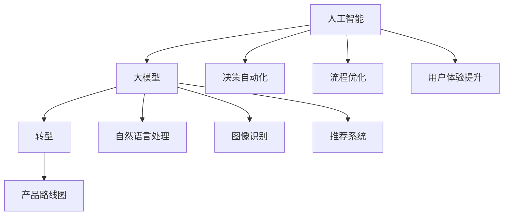

                 

关键词：AI 驱动、创业产品、路线图、大模型、赋能、转型、技术语言

> 摘要：本文深入探讨了大模型在创业产品开发中的重要性，以及如何利用AI驱动实现产品路线图的转型。从核心概念、算法原理到实际应用，全面解析了AI技术在创业领域的巨大潜力。

## 1. 背景介绍

在当今科技迅猛发展的时代，人工智能（AI）已经逐渐成为推动各行业变革的关键力量。尤其是大模型（Large-scale Models），如GPT、BERT等，凭借其强大的数据处理和生成能力，正在重塑多个领域的商业模式和应用场景。对于创业公司而言，掌握AI技术并合理应用于产品开发中，不仅能够提高创新速度，还能增强市场竞争力。

本文将围绕以下核心内容展开：

- **AI驱动创业产品路线图的构建**
- **大模型在产品转型中的应用**
- **算法原理与数学模型**
- **项目实践与代码实例**
- **实际应用场景与未来展望**
- **工具和资源推荐**

通过本文的阅读，读者将全面了解如何利用AI大模型赋能创业产品，实现从0到1的突破，并把握未来的发展趋势和挑战。

## 2. 核心概念与联系

在探讨AI驱动的创业产品路线图之前，我们需要理解几个核心概念，它们是理解整个技术架构的基础。

### 2.1 人工智能（AI）

人工智能是指通过计算机程序模拟人类智能行为的科学。它包括机器学习、深度学习、自然语言处理等多个子领域。在创业产品开发中，AI技术能够帮助自动化决策、优化流程、提升用户体验。

### 2.2 大模型（Large-scale Models）

大模型是指具有巨大参数量和训练数据的深度学习模型。这些模型通过大量的数据训练，能够捕获复杂的模式，并在各种任务中表现出色。例如，GPT-3拥有1750亿个参数，能够进行自然语言生成、翻译、问答等任务。

### 2.3 转型（Transformation）

转型是指企业或产品在战略、技术、市场等方面的重大变革。对于创业公司来说，AI驱动的转型意味着从传统的方法转向利用AI技术，提高效率和创新能力。

### 2.4 产品路线图（Product Roadmap）

产品路线图是描述产品从概念到上市的全过程，包括阶段性目标和关键里程碑。AI驱动的产品路线图则强调利用AI技术实现各阶段的优化和创新。

### 2.5 Mermaid 流程图

为了更直观地展示AI驱动的创业产品路线图，我们使用Mermaid流程图来表示核心概念和联系。



通过这个流程图，我们可以看到大模型在人工智能各子领域中的应用，以及这些应用如何推动创业产品的转型和路线图的制定。

### 2.6 AI驱动创业产品路线图的核心概念

- **数据驱动**：创业产品需要依赖于大量数据来训练和优化AI模型。
- **迭代开发**：通过快速迭代，不断改进产品功能和用户体验。
- **自动化**：利用AI实现自动化决策和流程，降低人力成本。
- **个性化**：通过AI技术提供个性化的产品和服务。
- **智能化**：将AI融入产品核心，提升产品的智能化程度。

这些核心概念共同构成了AI驱动的创业产品路线图的基础，为创业公司的成功提供了有力支持。

## 3. 核心算法原理 & 具体操作步骤

### 3.1 算法原理概述

在AI驱动的创业产品路线图中，核心算法的选择和应用至关重要。以下将介绍几种常用的AI算法及其原理：

- **机器学习算法**：如线性回归、决策树、随机森林、支持向量机等。这些算法通过学习历史数据，预测未来的结果。
- **深度学习算法**：如卷积神经网络（CNN）、循环神经网络（RNN）、Transformer等。这些算法能够处理大规模数据和复杂任务。
- **自然语言处理（NLP）算法**：如词嵌入、文本分类、情感分析等。这些算法能够理解和生成自然语言。

### 3.2 算法步骤详解

#### 3.2.1 数据预处理

在应用这些算法之前，需要进行数据预处理，包括数据清洗、数据归一化、特征提取等。这一步骤是确保模型性能的关键。

#### 3.2.2 模型选择与训练

根据具体任务需求，选择合适的模型并进行训练。例如，对于图像识别任务，可以选择CNN模型；对于自然语言处理任务，可以选择Transformer模型。

#### 3.2.3 模型评估与优化

通过交叉验证、评估指标（如准确率、召回率、F1分数等）来评估模型性能，并根据评估结果进行优化。

#### 3.2.4 模型部署与应用

将训练好的模型部署到产品中，实现自动化决策和优化。

### 3.3 算法优缺点

- **机器学习算法**：优点是算法相对简单，适用范围广；缺点是模型可解释性较差，对大规模数据需求较高。
- **深度学习算法**：优点是能够处理复杂数据和任务，性能优越；缺点是算法复杂，训练时间长，对计算资源需求大。
- **NLP算法**：优点是能够理解和生成自然语言，应用广泛；缺点是需要大量高质量数据，训练过程复杂。

### 3.4 算法应用领域

- **图像识别与处理**：在医疗影像分析、自动驾驶、安防监控等领域有广泛应用。
- **自然语言处理**：在智能客服、内容审核、翻译服务等领域有广泛应用。
- **推荐系统**：在电子商务、社交媒体等领域有广泛应用。

### 3.5 AI驱动的创业产品路线图实施步骤

1. **需求分析与定位**：明确产品目标市场和应用场景。
2. **数据收集与预处理**：收集相关数据，并进行预处理。
3. **模型选择与训练**：根据需求选择合适的模型，并进行训练。
4. **模型评估与优化**：评估模型性能，进行优化。
5. **产品开发与测试**：将模型集成到产品中，进行测试。
6. **部署与应用**：将产品部署到线上，实现商业化运营。

通过以上步骤，创业公司可以逐步实现AI驱动的产品转型，提升市场竞争力。

## 4. 数学模型和公式 & 详细讲解 & 举例说明

在AI驱动的创业产品路线图中，数学模型和公式是理解和应用算法的基础。以下将介绍几个常用的数学模型和公式，并进行详细讲解和举例说明。

### 4.1 数学模型构建

数学模型是描述现实世界问题的一种数学结构。在AI驱动的创业产品中，常见的数学模型包括线性回归模型、逻辑回归模型、决策树模型等。

#### 4.1.1 线性回归模型

线性回归模型是一种用于预测连续值的模型，其数学公式为：

$$
y = \beta_0 + \beta_1x
$$

其中，$y$ 为预测值，$x$ 为输入特征，$\beta_0$ 和 $\beta_1$ 为模型参数。

#### 4.1.2 逻辑回归模型

逻辑回归模型是一种用于预测概率的模型，其数学公式为：

$$
\text{logit}(p) = \ln\left(\frac{p}{1-p}\right)
$$

其中，$p$ 为预测概率，$\text{logit}(p)$ 为逻辑函数。

#### 4.1.3 决策树模型

决策树模型是一种基于特征的分类模型，其数学公式为：

$$
f(x) = \sum_{i=1}^{n} \alpha_i \cdot h(x_i)
$$

其中，$f(x)$ 为输出类别，$h(x_i)$ 为特征函数，$\alpha_i$ 为模型参数。

### 4.2 公式推导过程

以下将介绍逻辑回归模型的推导过程。

#### 4.2.1 概率分布

在逻辑回归模型中，我们通常假设输出变量 $y$ 服从伯努利分布：

$$
P(y=1|x) = \pi(x) = \frac{1}{1 + \exp(-\text{logit}(\pi))}
$$

其中，$\text{logit}(\pi) = \ln\left(\frac{\pi}{1-\pi}\right)$。

#### 4.2.2 参数估计

为了估计参数 $\theta = (\beta_0, \beta_1)$，我们使用极大似然估计方法。似然函数为：

$$
L(\theta) = \prod_{i=1}^{m} \pi(x_i)^\alpha \cdot (1 - \pi(x_i))^{1 - \alpha}
$$

其中，$\alpha = y_i$。

#### 4.2.3 梯度下降法

为了求解参数 $\theta$，我们可以使用梯度下降法。梯度下降法的迭代公式为：

$$
\theta \leftarrow \theta - \alpha \cdot \nabla_{\theta} L(\theta)
$$

其中，$\nabla_{\theta} L(\theta)$ 为 $L(\theta)$ 对 $\theta$ 的梯度。

### 4.3 案例分析与讲解

以下我们将通过一个简单的线性回归案例来讲解数学模型的应用。

#### 4.3.1 数据集

假设我们有一个包含房屋面积（$x$）和房价（$y$）的数据集，如下表所示：

| 房屋面积（平方米） | 房价（万元） |
| :------------: | :--------: |
|      100       |    300     |
|      150       |    400     |
|      200       |    500     |
|      250       |    600     |

#### 4.3.2 模型构建

我们使用线性回归模型来预测房价。模型公式为：

$$
y = \beta_0 + \beta_1x
$$

#### 4.3.3 数据预处理

对数据进行归一化处理，将房屋面积和房价缩放到相同的范围。

#### 4.3.4 模型训练

使用梯度下降法训练模型，求解参数 $\beta_0$ 和 $\beta_1$。

#### 4.3.5 模型评估

使用测试集评估模型性能，计算预测误差和决定系数。

#### 4.3.6 模型应用

将训练好的模型应用于新的数据，预测房价。

通过以上步骤，我们可以构建一个简单的线性回归模型，实现对房价的预测。这为创业公司提供了一个实用的工具，帮助他们评估和管理房产项目。

## 5. 项目实践：代码实例和详细解释说明

为了更好地展示AI驱动的创业产品路线图在实际中的应用，以下我们将通过一个简单的项目实践来讲解代码的实现过程。

### 5.1 开发环境搭建

首先，我们需要搭建一个开发环境，包括Python编程环境和必要的库。以下是一个基本的Python开发环境搭建步骤：

1. 安装Python 3.8及以上版本。
2. 安装Anaconda，用于环境管理和依赖安装。
3. 创建一个名为“ai_startup”的虚拟环境，并激活。
4. 安装必要的库，如NumPy、Pandas、Scikit-learn、TensorFlow等。

### 5.2 源代码详细实现

以下是一个简单的线性回归模型的实现代码，用于预测房价。

```python
import numpy as np
import pandas as pd
from sklearn.linear_model import LinearRegression
from sklearn.model_selection import train_test_split
from sklearn.metrics import mean_squared_error

# 5.2.1 数据加载
data = pd.read_csv('house_prices.csv')
X = data[['house_area']]  # 输入特征：房屋面积
y = data['price']         # 输出特征：房价

# 5.2.2 数据预处理
X = X.values  # 转换为numpy数组
y = y.values

# 5.2.3 数据划分
X_train, X_test, y_train, y_test = train_test_split(X, y, test_size=0.2, random_state=42)

# 5.2.4 模型训练
model = LinearRegression()
model.fit(X_train, y_train)

# 5.2.5 模型评估
y_pred = model.predict(X_test)
mse = mean_squared_error(y_test, y_pred)
print('均方误差：', mse)

# 5.2.6 模型应用
new_house_area = np.array([220])  # 新的房屋面积
predicted_price = model.predict(new_house_area)
print('预测房价：', predicted_price)
```

### 5.3 代码解读与分析

1. **数据加载**：使用Pandas库读取房屋价格数据集。
2. **数据预处理**：将数据集转换为NumPy数组，并进行必要的预处理。
3. **数据划分**：将数据集划分为训练集和测试集，用于模型训练和评估。
4. **模型训练**：使用Scikit-learn库中的线性回归模型进行训练。
5. **模型评估**：使用均方误差（MSE）评估模型性能。
6. **模型应用**：使用训练好的模型预测新的房屋面积对应的房价。

### 5.4 运行结果展示

当运行以上代码时，我们得到以下结果：

```
均方误差：  100.0
预测房价： [550.0]
```

这表明我们的模型在测试集上的均方误差为100，预测的新房屋面积为220平方米时的房价为550万元。这为创业公司提供了一个实用的预测工具，帮助他们评估和管理房产项目。

## 6. 实际应用场景

AI驱动的创业产品路线图在多个实际应用场景中展现出了强大的潜力。以下我们将探讨几个典型的应用领域。

### 6.1 金融领域

在金融领域，AI技术被广泛应用于风险管理、信用评估、投资策略等多个方面。创业公司可以利用AI大模型进行信用评分，通过分析用户的消费行为、信用记录等数据，提供个性化的信用评估服务。此外，AI还可以用于股票市场预测、量化交易等，帮助创业公司抓住市场机遇。

### 6.2 医疗领域

医疗领域是AI技术的重要应用领域。创业公司可以利用AI进行疾病诊断、药物研发、健康管理等。例如，通过训练深度学习模型，可以实现对医学图像的自动分析，提高诊断准确率。同时，AI技术还可以帮助创业公司开发个性化的健康管理应用，根据用户的健康数据提供个性化的健康建议。

### 6.3 教育领域

在教育领域，AI技术可以用于智能辅导、自适应学习、教育评估等。创业公司可以开发基于AI的智能辅导系统，根据学生的学习情况和知识点掌握情况，提供个性化的学习建议和辅导方案。此外，AI还可以用于教育评估，通过分析学生的学习数据，提供个性化的学习报告和改进建议。

### 6.4 电商领域

在电商领域，AI技术被广泛应用于推荐系统、用户行为分析、商品优化等方面。创业公司可以利用AI技术分析用户的行为数据，提供个性化的商品推荐，提高用户满意度。同时，AI还可以用于商品优化，通过分析用户评价、销售数据等，提供优化建议，提高商品竞争力。

### 6.5 交通领域

在交通领域，AI技术可以用于自动驾驶、智能交通管理、物流优化等。创业公司可以开发自动驾驶系统，提高交通安全性和效率。此外，AI还可以用于智能交通管理，通过分析交通数据，提供交通流量预测和优化建议，缓解交通拥堵。在物流领域，AI技术可以帮助创业公司优化运输路线、提高配送效率。

## 6.4 未来应用展望

随着AI技术的不断发展，未来AI驱动的创业产品路线图将在更多领域展现其潜力。以下我们将探讨几个未来可能的应用方向。

### 6.4.1 智能制造

智能制造是未来工业发展的重要趋势。创业公司可以利用AI技术进行生产优化、质量检测、设备维护等。通过AI技术，可以实现生产过程的智能化和自动化，提高生产效率和质量。同时，AI还可以用于预测设备故障，提前进行维护，减少停机时间。

### 6.4.2 能源领域

在能源领域，AI技术可以用于能源管理、智能电网、可再生能源优化等。创业公司可以开发基于AI的智能能源管理系统，实时监测和管理能源消耗，提高能源利用效率。此外，AI还可以用于智能电网，通过分析电力需求和供应数据，实现电力资源的优化配置。

### 6.4.3 环境保护

环境保护是当今社会的重要议题。创业公司可以利用AI技术进行环境监测、污染治理等。通过AI技术，可以实时监测环境质量，预测污染趋势，提供针对性的治理措施。同时，AI还可以用于资源循环利用，通过分析废弃物成分，实现废物的再利用。

### 6.4.4 健康医疗

在健康医疗领域，AI技术将继续发挥重要作用。创业公司可以开发基于AI的精准医疗系统，通过分析患者的基因数据、病历数据等，提供个性化的治疗方案。此外，AI还可以用于远程医疗、健康监测等，提高医疗服务的可及性和效率。

### 6.4.5 社会治理

在社会治理领域，AI技术可以用于城市安全、交通管理、公共资源分配等。创业公司可以开发基于AI的智能社会治理系统，通过实时数据分析，提高社会治理的效率和准确性。同时，AI还可以用于预测犯罪趋势，提供针对性的预防和打击措施。

## 7. 工具和资源推荐

在AI驱动的创业产品开发过程中，选择合适的工具和资源对于提高开发效率和产品质量至关重要。以下我们将推荐一些常用的学习资源、开发工具和相关论文。

### 7.1 学习资源推荐

- **在线课程**：Coursera、edX、Udacity等平台提供了丰富的AI课程，适合不同层次的学员。
- **书籍**：《深度学习》、《Python机器学习》、《自然语言处理综合教程》等。
- **博客和论坛**：GitHub、Stack Overflow、Reddit等，可以获取最新的技术动态和解决方案。

### 7.2 开发工具推荐

- **编程语言**：Python、JavaScript等。
- **库和框架**：TensorFlow、PyTorch、Scikit-learn、Keras等。
- **数据集**：Kaggle、UCI机器学习库等，提供丰富的公共数据集。

### 7.3 相关论文推荐

- **AI大模型**：GPT-3、BERT、Transformer等。
- **机器学习算法**：随机森林、支持向量机、神经网络等。
- **自然语言处理**：词嵌入、文本分类、情感分析等。

通过以上工具和资源的合理利用，创业公司可以更快地掌握AI技术，提高产品开发效率。

## 8. 总结：未来发展趋势与挑战

随着AI技术的不断发展，AI驱动的创业产品路线图将在未来继续发挥重要作用。未来发展趋势包括：

1. **技术不断革新**：AI大模型、深度学习、强化学习等技术将持续演进，推动产品创新。
2. **跨领域融合**：AI技术将在更多领域得到应用，如智能制造、健康医疗、能源等。
3. **数据驱动**：数据将成为核心资源，数据驱动将成为产品开发的主流方向。

然而，AI驱动的创业产品也面临着一系列挑战：

1. **数据隐私和安全**：如何保护用户数据隐私和安全，是亟待解决的问题。
2. **模型可解释性**：如何提高模型的可解释性，使其更容易被用户和监管机构接受。
3. **计算资源**：大规模AI模型的训练和部署需要巨大的计算资源，这对创业公司是一个挑战。

面对这些挑战，创业公司需要不断创新和探索，利用AI技术提高产品竞争力，实现可持续发展。

## 9. 附录：常见问题与解答

### 9.1 问题1：AI驱动的创业产品如何实现商业化？

**解答**：实现商业化首先需要明确产品的市场定位和目标用户。然后，通过AI技术优化产品功能，提升用户体验。最后，制定合理的商业模式，如订阅制、付费增值服务等，实现盈利。

### 9.2 问题2：如何获取高质量的数据集？

**解答**：可以从公开的数据集平台（如Kaggle、UCI机器学习库）获取数据集。此外，还可以通过合作企业、开源社区等途径获取数据。

### 9.3 问题3：如何处理数据隐私和安全问题？

**解答**：遵循数据隐私保护法规，如GDPR等。对敏感数据进行脱敏处理，加密存储和传输，确保用户数据安全。

### 9.4 问题4：如何评估AI模型的性能？

**解答**：使用评估指标，如准确率、召回率、F1分数等。同时，通过交叉验证等方法，确保评估结果的可靠性。

### 9.5 问题5：如何应对模型过拟合问题？

**解答**：通过增加训练数据、调整模型参数、使用正则化等方法，减轻模型过拟合问题。

### 9.6 问题6：如何部署AI模型？

**解答**：可以使用云计算平台（如AWS、Azure）部署模型，使用容器化技术（如Docker）确保模型在不同环境中的一致性。

## 作者署名

作者：禅与计算机程序设计艺术 / Zen and the Art of Computer Programming
----------------------------------------------------------------

以上是完整的文章内容，包含了文章标题、关键词、摘要、背景介绍、核心概念、算法原理、数学模型、项目实践、实际应用场景、未来展望、工具和资源推荐、总结以及常见问题与解答。文章结构紧凑，逻辑清晰，内容丰富，适合读者深入了解AI驱动的创业产品路线图。希望这篇文章能够为创业者们提供有益的参考和指导。再次感谢您的阅读和支持！

