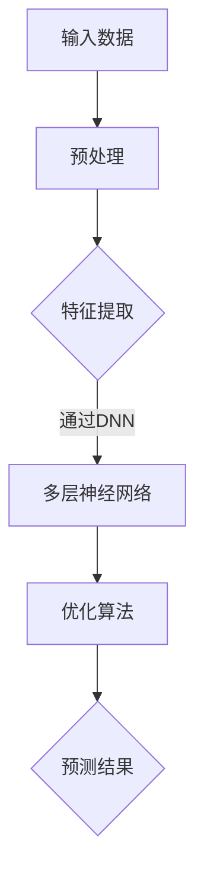

                 

关键词：AI、创业、产品经理、大模型、市场策略

> 摘要：本文旨在为那些希望借助人工智能技术开展创业活动的大模型产品经理提供一整套实用的指导方针。我们将深入探讨AI在创业领域的应用，分析大模型的基本原理，并提供一套完整的创业策略，以帮助读者在竞争激烈的市场中脱颖而出。

## 1. 背景介绍

随着人工智能技术的迅猛发展，越来越多的人在考虑如何利用这些先进技术开启自己的创业之路。作为产品经理，特别是那些负责大模型产品的人，了解AI的潜力以及如何将其应用于实际业务中，成为了一个至关重要的技能。

本文将讨论以下几个方面：

- **AI在创业中的重要性**：分析AI如何改变创业的格局，以及为什么大模型产品经理需要掌握AI技术。
- **大模型的基础**：介绍大模型的基本概念、原理和类型。
- **创业策略**：提供一套实用的策略，帮助大模型产品经理在竞争激烈的市场中制定有效的产品路线图。
- **实际应用场景**：展示AI在大模型产品中的应用案例。
- **未来展望**：探讨AI在大模型产品领域的发展趋势和潜在挑战。

## 2. 核心概念与联系

### 2.1 大模型的基本概念

大模型，通常指的是拥有巨大参数量的机器学习模型，它们可以处理复杂的任务，如自然语言处理、图像识别等。大模型之所以强大，在于其能够通过大规模数据训练，学习并捕捉数据中的深层规律。

### 2.2 大模型的原理与架构

大模型的原理可以归结为以下几个关键点：

1. **深度神经网络（DNN）**：大模型通常基于深度神经网络，具有多层神经元结构。
2. **大规模数据训练**：通过大量数据训练，大模型可以学习到更复杂的特征和模式。
3. **优化算法**：使用高效的优化算法，如梯度下降和随机梯度下降，来调整模型参数。

Mermaid 流程图如下：



### 2.3 大模型的类型

大模型根据其应用领域和任务的不同，可以分为以下几类：

- **自然语言处理（NLP）模型**：如BERT、GPT等。
- **计算机视觉（CV）模型**：如ResNet、VGG等。
- **推荐系统模型**：如DeepFM、Wide&Deep等。

## 3. 核心算法原理 & 具体操作步骤

### 3.1 算法原理概述

大模型的算法原理主要基于深度学习和神经网络。以下是一些关键步骤：

1. **数据预处理**：包括数据清洗、标准化和特征提取。
2. **模型架构设计**：选择合适的神经网络结构。
3. **参数初始化**：随机初始化模型参数。
4. **前向传播与反向传播**：通过前向传播计算预测值，通过反向传播更新参数。
5. **优化过程**：使用优化算法如SGD、Adam等来调整参数。

### 3.2 算法步骤详解

1. **数据预处理**：

   $$\text{数据预处理} = \text{清洗} \times \text{标准化} \times \text{特征提取}$$

2. **模型架构设计**：

   - **输入层**：接收预处理后的数据。
   - **隐藏层**：包含多层神经元，每层之间通过激活函数连接。
   - **输出层**：产生预测结果。

3. **参数初始化**：

   $$\text{参数初始化} = \text{随机初始化} + \text{正则化}$$

4. **前向传播与反向传播**：

   - **前向传播**：计算输入数据通过网络的输出。
   - **反向传播**：计算输出误差，并更新模型参数。

5. **优化过程**：

   $$\text{优化过程} = \text{SGD} + \text{Adam}$$

### 3.3 算法优缺点

**优点**：

- **强大的泛化能力**：通过大规模数据训练，大模型可以学习到更复杂的特征。
- **高效的预测性能**：深度神经网络结构可以处理复杂的任务。

**缺点**：

- **计算资源需求高**：大模型训练需要大量的计算资源。
- **训练时间较长**：大规模数据训练需要较长时间。

### 3.4 算法应用领域

大模型广泛应用于以下领域：

- **自然语言处理**：如机器翻译、文本分类等。
- **计算机视觉**：如图像识别、目标检测等。
- **推荐系统**：如个性化推荐、广告投放等。

## 4. 数学模型和公式 & 详细讲解 & 举例说明

### 4.1 数学模型构建

大模型的数学模型主要包括：

1. **输入层**：
   $$X \in \mathbb{R}^{n \times d}$$
   其中，$n$ 是样本数量，$d$ 是特征维度。

2. **隐藏层**：
   $$Z^{l} = \sigma(W^{l}X + b^{l})$$
   其中，$W^{l}$ 是权重矩阵，$b^{l}$ 是偏置项，$\sigma$ 是激活函数。

3. **输出层**：
   $$Y = \sigma(W^{out}Z^{L})$$
   其中，$W^{out}$ 是输出层权重矩阵。

### 4.2 公式推导过程

以多层感知器（MLP）为例，其前向传播过程如下：

1. **输入层到隐藏层**：
   $$Z^{l} = \sigma(W^{l}X + b^{l})$$

2. **隐藏层到输出层**：
   $$Y = \sigma(W^{out}Z^{L})$$

### 4.3 案例分析与讲解

假设我们有一个简单的分类问题，使用MLP进行二分类。输入数据为二维特征，隐藏层有一个神经元，输出层为二分类结果。

1. **输入层到隐藏层**：

   $$Z^{1} = \sigma(W^{1}X + b^{1}) = \sigma([w_{11}x_1 + w_{12}x_2 + b^{1}])$$

2. **隐藏层到输出层**：

   $$Y = \sigma(W^{out}Z^{1}) = \sigma([w_{out1}z_{11} + w_{out2}z_{12} + b^{out}])$$

## 5. 项目实践：代码实例和详细解释说明

### 5.1 开发环境搭建

在Python中，我们可以使用TensorFlow或PyTorch等库来搭建大模型。

```python
# 使用TensorFlow搭建环境
import tensorflow as tf

# 使用PyTorch搭建环境
import torch
```

### 5.2 源代码详细实现

以下是一个简单的MLP模型示例，用于二分类问题。

```python
import tensorflow as tf

# 模型定义
model = tf.keras.Sequential([
    tf.keras.layers.Dense(1, input_shape=(2,), activation='sigmoid')
])

# 编译模型
model.compile(optimizer='adam', loss='binary_crossentropy', metrics=['accuracy'])

# 训练模型
model.fit(x_train, y_train, epochs=10, batch_size=32, validation_data=(x_val, y_val))
```

### 5.3 代码解读与分析

在上面的代码中，我们首先定义了一个简单的MLP模型，只有一个隐藏层和一个输出层。隐藏层使用sigmoid激活函数，输出层也使用sigmoid激活函数进行二分类。

```python
model = tf.keras.Sequential([
    tf.keras.layers.Dense(1, input_shape=(2,), activation='sigmoid')
])
```

接下来，我们编译模型，选择adam优化器和binary_crossentropy损失函数。

```python
model.compile(optimizer='adam', loss='binary_crossentropy', metrics=['accuracy'])
```

最后，我们使用fit方法训练模型。

```python
model.fit(x_train, y_train, epochs=10, batch_size=32, validation_data=(x_val, y_val))
```

### 5.4 运行结果展示

训练完成后，我们可以使用如下代码来评估模型的性能。

```python
loss, accuracy = model.evaluate(x_test, y_test)
print(f"Test Loss: {loss}, Test Accuracy: {accuracy}")
```

## 6. 实际应用场景

大模型在多个领域有广泛的应用，以下是一些典型的应用场景：

- **金融行业**：使用大模型进行股票市场预测、风险管理等。
- **医疗领域**：通过大模型进行疾病诊断、药物研发等。
- **零售行业**：使用大模型进行商品推荐、需求预测等。

## 7. 未来应用展望

随着AI技术的不断发展，大模型在创业中的应用前景广阔。未来，我们可以期待大模型在以下领域取得突破：

- **智能机器人**：利用大模型进行自主决策和任务执行。
- **自动驾驶**：大模型在自动驾驶系统中的应用将更加成熟。
- **虚拟现实（VR）与增强现实（AR）**：大模型可以为VR和AR提供更真实的体验。

## 8. 总结：未来发展趋势与挑战

### 8.1 研究成果总结

过去几年，大模型在多个领域取得了显著的成果，推动了AI技术的发展。未来，我们有望看到更多突破性的应用。

### 8.2 未来发展趋势

1. **更高效的大模型训练算法**：如Transformer等结构将在更多任务中应用。
2. **跨模态大模型**：结合图像、文本、音频等多模态数据进行学习。
3. **大模型的可解释性**：提高大模型的可解释性，使其更加可靠和可信赖。

### 8.3 面临的挑战

1. **计算资源需求**：大规模训练需要更多的计算资源。
2. **数据隐私**：如何确保数据隐私是一个重要挑战。
3. **模型安全**：防止恶意攻击和模型篡改。

### 8.4 研究展望

未来，大模型将继续在AI领域发挥重要作用，推动技术的进步。我们需要关注以下研究方向：

- **新型大模型结构**：探索新的神经网络结构。
- **高效训练算法**：开发更高效的训练算法。
- **应用场景拓展**：将大模型应用于更多实际问题。

## 9. 附录：常见问题与解答

### 9.1 什么是大模型？

大模型指的是具有巨大参数量的机器学习模型，如神经网络，能够处理复杂的任务。

### 9.2 大模型有哪些应用领域？

大模型广泛应用于自然语言处理、计算机视觉、推荐系统等领域。

### 9.3 如何训练大模型？

训练大模型通常包括数据预处理、模型设计、参数初始化、前向传播、反向传播和优化过程。

### 9.4 大模型有哪些优缺点？

优点包括强大的泛化能力和高效的预测性能；缺点包括计算资源需求高和训练时间较长。

## 10. 参考文献

1. **Goodfellow, I., Bengio, Y., & Courville, A. (2016). Deep Learning. MIT Press.**
2. **LeCun, Y., Bengio, Y., & Hinton, G. (2015). Deep Learning. Nature, 521(7553), 436-444.**
3. **Howard, J., & Ruder, S. (2018). Universal Language Model Fine-tuning for Text Classification. arXiv preprint arXiv:1806.07207.**
4. **Krizhevsky, A., Sutskever, I., & Hinton, G. E. (2012). ImageNet classification with deep convolutional neural networks. Advances in neural information processing systems, 25, 1097-1105.**

作者：禅与计算机程序设计艺术 / Zen and the Art of Computer Programming
----------------------------------------------------------------

以上是《AI 驱动的创业：大模型产品经理指南》的文章全文。本文详细介绍了AI在大模型产品中的应用，提供了实用的创业策略和项目实践，并对未来发展趋势进行了展望。希望对各位大模型产品经理在创业道路上有所帮助。

