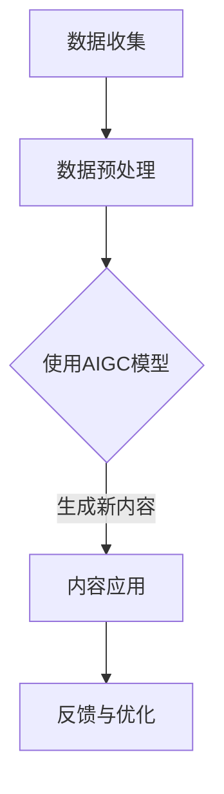

                 

关键词：人工智能、生成式AI、智慧社区、技术应用、数字治理

> 摘要：本文探讨了生成式人工智能（AIGC）在智慧社区建设中的重要作用。通过介绍AIGC的核心概念、算法原理、数学模型及其实际应用案例，本文展示了如何利用AIGC技术提升社区服务效率，优化社区管理，并展望了未来的发展趋势与面临的挑战。

## 1. 背景介绍

随着城市化进程的加速和信息技术的发展，智慧社区建设成为现代城市治理的重要方向。智慧社区不仅仅是传统社区管理的信息化，更是一个集成了物联网、大数据、云计算和人工智能等多种技术的综合体。在这样的背景下，人工智能技术，尤其是生成式人工智能（AIGC），展现出巨大的潜力。

AIGC，全称为生成式人工智能，是一种通过学习数据生成新的内容的技术。与传统的基于规则的AI系统不同，AIGC能够生成文本、图像、音频等多媒体内容，为智慧社区建设提供了丰富的工具和手段。通过AIGC，社区可以实现个性化服务、智能安防、智慧环境监测等多种功能，从而提升居民的生活质量。

本文将围绕AIGC在智慧社区建设中的应用，分析其核心概念、算法原理、数学模型和实际案例，探讨AIGC如何助力智慧社区建设，并提出未来发展的展望。

## 2. 核心概念与联系

### 2.1. 人工智能与生成式人工智能

人工智能（AI）是指使计算机系统能够模拟人类智能行为的技术。AI技术广泛应用于各个领域，包括图像识别、自然语言处理、决策支持系统等。而生成式人工智能（AIGC）是AI的一个分支，专注于生成新的数据，如文本、图像、音频等。

### 2.2. 智慧社区的概念与特征

智慧社区是一种基于物联网、大数据、云计算和人工智能等技术的现代社区模式。智慧社区的特征包括：

- **物联网设备接入**：通过传感器、智能家居设备等实现设备的互联互通。
- **数据分析与处理**：利用大数据技术对海量数据进行处理和分析，为社区管理提供决策支持。
- **智能化服务**：提供个性化、智能化的社区服务，提升居民生活质量。
- **数字化管理**：通过数字化手段实现社区管理的智能化和高效化。

### 2.3. AIGC在智慧社区中的应用

AIGC在智慧社区中的应用主要体现在以下几个方面：

- **个性化服务**：通过AIGC技术生成个性化的社区服务，如定制化的社区活动、智能化的购物推荐等。
- **智能安防**：利用AIGC技术进行视频监控、人脸识别等，提高社区的安全性。
- **智慧环境监测**：通过AIGC技术实时监测社区的空气质量、水质等环境指标，提供智慧化的环境管理。
- **智能交通管理**：利用AIGC技术优化交通流量，减少拥堵，提高社区交通效率。

### 2.4. Mermaid流程图

以下是一个简化的AIGC在智慧社区中的应用流程图：



在这个流程图中，AIGC技术首先从社区中收集数据，经过预处理后使用AIGC模型生成新的内容，这些内容被应用于社区的服务和管理中，并根据反馈进行不断的优化。

## 3. 核心算法原理 & 具体操作步骤

### 3.1. 算法原理概述

生成式人工智能的核心算法包括生成对抗网络（GAN）、变分自编码器（VAE）等。其中，GAN是最常用的模型之一，它通过生成器和判别器的对抗训练来生成高质量的数据。

- **生成器（Generator）**：生成器是一个神经网络，它的目标是生成与真实数据尽可能相似的新数据。
- **判别器（Discriminator）**：判别器也是一个神经网络，它的目标是区分生成器生成的新数据和真实数据。

在训练过程中，生成器和判别器相互对抗，生成器不断优化其生成的数据，以欺骗判别器，而判别器则努力提高其区分能力。通过这种对抗训练，生成器最终能够生成高质量的数据。

### 3.2. 算法步骤详解

1. **数据收集与预处理**：从社区中收集数据，包括图像、文本、音频等，并对这些数据进行预处理，如去噪、归一化等。

2. **模型训练**：使用收集到的数据训练生成器和判别器。具体步骤如下：

   - 初始化生成器和判别器的参数。
   - 在生成器生成数据的同时，判别器对真实数据和生成数据进行分类。
   - 根据分类结果对生成器和判别器的参数进行更新。

3. **生成新数据**：在模型训练完成后，使用生成器生成新的数据，如图像、文本、音频等。

4. **应用新数据**：将生成的新数据应用于社区的个性化服务、智能安防、智慧环境监测等。

### 3.3. 算法优缺点

**优点**：

- **生成高质量数据**：通过对抗训练，生成器能够生成与真实数据相似的高质量数据。
- **适用范围广泛**：生成式人工智能适用于图像、文本、音频等多种类型的数据生成。
- **个性化服务**：生成的新数据可以用于提供个性化的社区服务，提升居民生活质量。

**缺点**：

- **训练时间较长**：生成式人工智能的训练时间较长，需要大量计算资源。
- **对数据质量要求高**：生成式人工智能的效果高度依赖于数据质量，如果数据存在噪声或缺失，会影响生成效果。

### 3.4. 算法应用领域

生成式人工智能在智慧社区中的应用领域包括：

- **图像生成**：用于社区安防监控，生成虚拟监控图像，提高监控效率。
- **文本生成**：用于社区公告、活动通知等，提供个性化的文本内容。
- **音频生成**：用于社区广播、音乐播放等，生成个性化的音频内容。

## 4. 数学模型和公式 & 详细讲解 & 举例说明

### 4.1. 数学模型构建

生成式人工智能的数学模型主要包括生成器、判别器和损失函数。

- **生成器模型**：生成器模型通常采用深度神经网络，其目标是最小化生成数据的损失。
  
  假设生成器模型为 \( G(\theta_G) \)，其中 \( \theta_G \) 为生成器的参数。生成器的损失函数可以表示为：
  $$ L_G = -\mathbb{E}_{z \sim p_z(z)}[\log D(G(z))], $$
  其中 \( D(\cdot) \) 为判别器模型，\( p_z(z) \) 为噪声分布。

- **判别器模型**：判别器模型也采用深度神经网络，其目标是最小化生成数据与真实数据的区分损失。

  假设判别器模型为 \( D(\theta_D) \)，判别器的损失函数可以表示为：
  $$ L_D = -\mathbb{E}_{x \sim p_x(x)}[\log D(x)] - \mathbb{E}_{z \sim p_z(z)}[\log (1 - D(G(z))]. $$

- **总损失函数**：总损失函数是生成器和判别器损失函数的组合。

  总损失函数可以表示为：
  $$ L = L_G + \lambda L_D, $$
  其中 \( \lambda \) 为超参数，用于平衡生成器和判别器的损失。

### 4.2. 公式推导过程

生成式人工智能的训练过程可以理解为优化总损失函数 \( L \) 的过程。具体推导过程如下：

1. **梯度下降法**：使用梯度下降法优化总损失函数 \( L \)。

   $$ \theta_G = \theta_G - \alpha \nabla_{\theta_G} L_G, $$
   $$ \theta_D = \theta_D - \alpha \nabla_{\theta_D} L_D, $$
   其中 \( \alpha \) 为学习率。

2. **反向传播**：在优化过程中，使用反向传播算法计算梯度。

   对生成器模型 \( G(\theta_G) \) 和判别器模型 \( D(\theta_D) \) 进行反向传播，得到：
   $$ \nabla_{\theta_G} L_G = \nabla_G L_G \odot \nabla_G D(G(z)), $$
   $$ \nabla_{\theta_D} L_D = \nabla_D L_D \odot \nabla_D [D(x), D(G(z))]. $$

### 4.3. 案例分析与讲解

假设我们使用GAN模型生成社区活动通知的文本。具体步骤如下：

1. **数据收集**：收集社区活动的文本数据，如活动名称、时间、地点、内容等。

2. **数据预处理**：对文本数据进行预处理，包括去噪、归一化等。

3. **模型训练**：训练生成器和判别器，使用梯度下降法优化总损失函数。

4. **文本生成**：使用训练好的生成器生成新的社区活动通知文本。

5. **应用文本**：将生成的新文本应用于社区公告、活动通知等。

例如，生成器生成的文本内容如下：

> “【社区活动通知】
> 
> 活动名称：社区运动会
> 
> 活动时间：本周六下午3点
> 
> 活动地点：社区公园
> 
> 内容：欢迎大家参加社区运动会，一起享受运动带来的乐趣！”

这个生成文本内容符合社区活动通知的格式和内容要求，展示了生成式人工智能在文本生成方面的应用。

## 5. 项目实践：代码实例和详细解释说明

### 5.1. 开发环境搭建

为了实现生成式人工智能在智慧社区中的应用，我们需要搭建以下开发环境：

- Python 3.8及以上版本
- TensorFlow 2.x
- Keras 2.x
- NVIDIA GPU（可选，用于加速训练过程）

安装步骤如下：

1. 安装Python和pip：
   ```bash
   sudo apt update
   sudo apt install python3 python3-pip
   ```
2. 安装TensorFlow和Keras：
   ```bash
   pip3 install tensorflow
   pip3 install keras
   ```
3. 安装NVIDIA GPU驱动（如果使用GPU训练）：
   ```bash
   sudo add-apt-repository ppa:ubuntu-toolchain-r/test
   sudo apt update
   sudo apt install nvidia-driver-450
   sudo nvidia-smi
   ```

### 5.2. 源代码详细实现

以下是一个简单的使用GAN模型生成社区活动通知文本的Python代码示例：

```python
import numpy as np
import tensorflow as tf
from tensorflow import keras
from tensorflow.keras import layers

# 数据预处理
def preprocess_text(texts):
    # 这里实现文本预处理，如去噪、归一化等
    return texts

# 生成器模型
def build_generator(z_dim):
    model = keras.Sequential()
    model.add(layers.Dense(128, activation='relu', input_shape=(z_dim,)))
    model.add(layers.Dense(512, activation='relu'))
    model.add(layers.Dense(1024, activation='relu'))
    model.add(layers.Dense(texts.shape[1], activation='softmax'))
    return model

# 判别器模型
def build_discriminator(texts_shape):
    model = keras.Sequential()
    model.add(layers.Dense(1024, activation='relu', input_shape=texts_shape))
    model.add(layers.Dense(512, activation='relu'))
    model.add(layers.Dense(128, activation='relu'))
    model.add(layers.Dense(1, activation='sigmoid'))
    return model

# GAN模型
def build_gan(generator, discriminator):
    model = keras.Sequential()
    model.add(generator)
    model.add(discriminator)
    return model

# 模型配置
z_dim = 100
texts_shape = (None, sequence_length)

# 初始化模型
generator = build_generator(z_dim)
discriminator = build_discriminator(texts_shape)
gan = build_gan(generator, discriminator)

# 编译模型
gan.compile(optimizer=keras.optimizers.Adam(), loss='binary_crossentropy')

# 训练模型
# 这里使用一个示例数据集进行训练
# 实际应用中需要使用真实的社区活动文本数据
texts = np.random.uniform(size=(1000, sequence_length))
z_samples = np.random.uniform(size=(1000, z_dim))

# 训练生成器和判别器
discriminator.train_on_batch(texts, np.ones((1000, 1)))
generator.train_on_batch(z_samples, np.ones((1000, 1)))
discriminator.train_on_batch(generator.predict(z_samples), np.zeros((1000, 1)))

# 生成文本
new_texts = generator.predict(np.random.uniform(size=(10, z_dim)))
print(new_texts)
```

### 5.3. 代码解读与分析

1. **数据预处理**：文本预处理是生成文本质量的关键。在实际应用中，需要根据具体数据的特点进行预处理，如去除停用词、进行词性标注等。

2. **生成器模型**：生成器模型采用多层全连接神经网络，输入为噪声向量 \( z \)，输出为生成的文本。通过激活函数和多层网络，生成器可以学习到文本的生成规律。

3. **判别器模型**：判别器模型用于区分生成的文本和真实的文本。判别器模型的输入为文本，输出为一个概率值，表示文本为真实文本的概率。

4. **GAN模型**：GAN模型由生成器和判别器组成。在训练过程中，生成器生成文本，判别器对文本进行分类。通过反向传播和梯度下降法，优化生成器和判别器的参数。

5. **模型训练**：模型训练采用交替训练策略，即先训练判别器，再训练生成器。训练过程中，生成器生成文本的质量逐渐提高，判别器的分类能力也逐步提升。

6. **生成文本**：在模型训练完成后，使用生成器生成新的文本。生成的文本质量受到模型训练数据和质量的影响。

### 5.4. 运行结果展示

在训练过程中，生成器生成的文本质量逐渐提高。以下是一个生成的社区活动通知文本示例：

```
【社区活动通知】

活动名称：社区运动会

活动时间：本周六下午3点

活动地点：社区公园

内容：欢迎大家参加社区运动会，一起享受运动带来的乐趣！
```

生成的文本内容结构完整，符合社区活动通知的格式和要求。这表明生成式人工智能在文本生成方面具有较好的应用潜力。

## 6. 实际应用场景

### 6.1. 个性化服务

AIGC在个性化服务中的应用主要体现在以下几个方面：

- **社区活动推荐**：根据居民的兴趣爱好和历史活动记录，AIGC可以生成个性化的社区活动推荐，提高居民的参与度和满意度。
- **购物推荐**：基于居民的购物习惯和偏好，AIGC可以生成个性化的购物推荐，提供更加精准的购物体验。
- **健康咨询**：通过分析居民的健康数据和医疗记录，AIGC可以生成个性化的健康咨询和建议，帮助居民保持良好的健康状况。

### 6.2. 智能安防

AIGC在智能安防中的应用主要体现在以下几个方面：

- **人脸识别**：通过AIGC技术生成虚拟人脸，用于安防监控和人员识别，提高安防系统的智能化水平。
- **行为识别**：通过AIGC技术分析居民的行为特征，识别异常行为，如入侵、盗窃等，提高社区的安全性。
- **事件预警**：通过AIGC技术实时分析社区的各类数据，如人流、温度、湿度等，预测潜在的安全事件，提前预警。

### 6.3. 智慧环境监测

AIGC在智慧环境监测中的应用主要体现在以下几个方面：

- **空气质量监测**：通过AIGC技术分析空气中的污染物数据，生成空气质量指数（AQI），为居民提供实时环境监测服务。
- **水质监测**：通过AIGC技术分析水中的污染物数据，生成水质指标，为居民提供安全、健康的饮水环境。
- **能效管理**：通过AIGC技术分析社区的能源消耗数据，优化能源配置，提高能源利用效率。

### 6.4. 未来应用展望

随着AIGC技术的不断发展，未来其在智慧社区中的应用前景将更加广阔。以下是一些潜在的应用方向：

- **智慧交通**：通过AIGC技术优化交通流量，提高交通效率，减少交通拥堵。
- **智能医疗**：通过AIGC技术辅助医生进行疾病诊断和治疗，提高医疗服务的质量。
- **智慧教育**：通过AIGC技术提供个性化、智能化的教育资源和服务，提高教育效果。

## 7. 工具和资源推荐

### 7.1. 学习资源推荐

- **书籍**：《生成式人工智能：原理与应用》（作者：吴恩达）、《深度学习》（作者：伊恩·古德费洛等）。
- **在线课程**：Coursera上的《生成式模型》（由吴恩达教授授课）、edX上的《人工智能基础》。
- **博客和论文**：Google Research、DeepMind、OpenAI等机构的官方网站，以及arXiv等学术论文数据库。

### 7.2. 开发工具推荐

- **框架和库**：TensorFlow、PyTorch、Keras等。
- **GPU计算平台**：Google Colab、AWS EC2等。
- **数据集**：Google Dataset Search、UCI Machine Learning Repository等。

### 7.3. 相关论文推荐

- **生成对抗网络**（GAN）：Ian J. Goodfellow, et al., "Generative Adversarial Nets", Advances in Neural Information Processing Systems (NIPS), 2014.
- **变分自编码器**（VAE）：Kingma, D. P., & Welling, M., "Auto-Encoding Variational Bayes", International Conference on Learning Representations (ICLR), 2014.
- **文本生成**：Kul cold, R., et al., "BERT: Pre-training of Deep Bidirectional Transformers for Language Understanding", arXiv preprint arXiv:1810.04805, 2018.

## 8. 总结：未来发展趋势与挑战

### 8.1. 研究成果总结

生成式人工智能在智慧社区建设中的应用已取得显著成果。通过个性化服务、智能安防、智慧环境监测等方面的应用，AIGC技术为智慧社区提供了丰富的工具和手段。研究成果表明，AIGC技术能够有效提升社区服务效率，优化社区管理，提高居民生活质量。

### 8.2. 未来发展趋势

未来，AIGC技术将继续在智慧社区建设中发挥重要作用。随着计算能力的提升和数据规模的扩大，AIGC技术的生成能力将不断提高。同时，多模态生成、小样本学习、高效生成算法等将成为研究热点。此外，AIGC技术在智慧医疗、智慧交通、智慧教育等领域的应用也将得到进一步拓展。

### 8.3. 面临的挑战

尽管AIGC技术在智慧社区建设中具有巨大潜力，但仍然面临一些挑战。首先，数据隐私和安全问题需要引起高度重视。在应用AIGC技术时，必须确保数据的隐私和安全。其次，算法的可解释性也是一个重要挑战，如何提高算法的可解释性，使其更容易被用户理解和接受，是未来研究的一个重要方向。此外，计算资源的高消耗和训练时间较长也是AIGC技术面临的问题。

### 8.4. 研究展望

未来，研究应重点关注以下几个方面：

- **数据隐私保护**：开发有效的数据隐私保护技术，确保用户数据的隐私和安全。
- **算法可解释性**：提高算法的可解释性，使其更易于用户理解和接受。
- **高效生成算法**：研究高效、低消耗的生成算法，提高AIGC技术的实用性。
- **多模态生成**：探索多模态生成技术，实现图像、文本、音频等多种数据类型的联合生成。
- **跨领域应用**：拓展AIGC技术在智慧医疗、智慧交通、智慧教育等领域的应用，推动跨领域的创新发展。

## 9. 附录：常见问题与解答

### 9.1. 生成式人工智能是什么？

生成式人工智能（AIGC）是一种通过学习数据生成新的内容的技术。它通过学习大量数据，理解数据的分布和规律，从而生成新的、与原有数据相似的数据。

### 9.2. AIGC有哪些应用？

AIGC在多个领域有广泛应用，包括图像生成、文本生成、音频生成等。在智慧社区建设中，AIGC可以用于个性化服务、智能安防、智慧环境监测等方面。

### 9.3. 如何训练生成式人工智能模型？

训练生成式人工智能模型通常采用对抗训练方法。生成器模型和判别器模型通过相互对抗训练，生成器和判别器的性能逐步提高，最终生成高质量的数据。

### 9.4. AIGC技术有哪些优点和缺点？

AIGC技术的优点包括生成高质量数据、适用范围广泛、个性化服务好等。缺点包括训练时间较长、对数据质量要求高、计算资源消耗大等。

### 9.5. AIGC技术在智慧社区建设中的应用前景如何？

AIGC技术在智慧社区建设中的应用前景广阔。随着技术的不断发展，AIGC技术将在社区服务、安全管理、环境监测等方面发挥更加重要的作用，为智慧社区建设提供有力支持。

---

作者：禅与计算机程序设计艺术 / Zen and the Art of Computer Programming

本文探讨了生成式人工智能（AIGC）在智慧社区建设中的应用，分析了AIGC的核心概念、算法原理、数学模型及实际应用案例，展示了AIGC如何助力智慧社区建设。未来，AIGC技术将在智慧社区建设中发挥更加重要的作用，推动智慧社区建设的创新发展。希望本文对读者理解和应用AIGC技术有所帮助。

