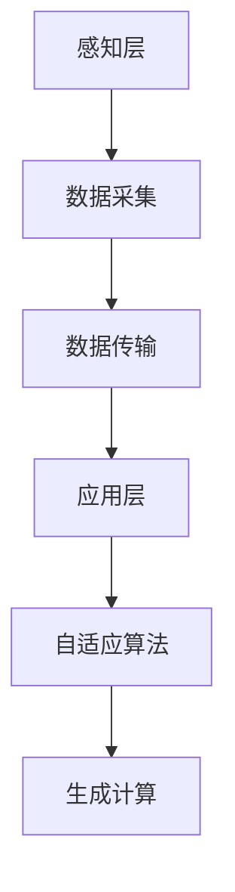

                 

在当今快速发展的科技时代，人工智能（AI）正逐步渗透到我们生活的方方面面。其中，智能养老服务作为人工智能应用的一个重要领域，正日益受到关注。本文将围绕AIGC（自适应智能生成计算）在智能养老服务中的应用，探讨其带来的变革和挑战。

## 文章关键词

- AIGC
- 智能服务
- 老年人群
- 个性化
- 自适应

## 文章摘要

本文旨在介绍AIGC在智能养老服务中的应用，分析其在提高服务质量、优化服务流程、降低成本等方面的优势。同时，探讨AIGC在智能养老服务中面临的挑战和未来的发展趋势。

## 1. 背景介绍

### 1.1 智能养老服务的现状

随着全球人口老龄化的加剧，老年人群体的健康和养老问题日益凸显。传统的养老服务模式已无法满足老年人日益多样化的需求，迫切需要引入新的技术和理念。智能养老服务应运而生，通过信息化和智能化手段，提供更加便捷、高效、个性化的服务，满足老年人的多样化需求。

### 1.2 AIGC的概念及特点

AIGC（自适应智能生成计算）是一种基于人工智能技术的智能计算模式，具有自适应、自学习和高效生成等特点。AIGC能够根据用户的需求和行为习惯，动态生成个性化的内容和解决方案，从而实现服务的智能化和个性化。

## 2. 核心概念与联系

为了更好地理解AIGC在智能养老服务中的应用，我们首先需要了解以下几个核心概念：

- **智能养老系统架构**：包括感知层、网络层和应用层，分别对应数据采集、数据传输和数据应用。
- **自适应算法**：包括机器学习、深度学习等，用于从数据中学习规律，实现自适应调整。
- **生成计算**：基于规则或模型生成个性化内容，如医疗建议、生活提示等。

以下是AIGC在智能养老系统架构中的Mermaid流程图：



## 3. 核心算法原理 & 具体操作步骤

### 3.1 算法原理概述

AIGC在智能养老服务中的核心算法包括：

- **数据采集与处理**：通过传感器、移动设备等收集老年人群体的生理、行为数据，并进行预处理。
- **自适应算法**：基于采集到的数据，运用机器学习和深度学习算法，对老年人的健康状况、生活习惯等进行实时分析和预测。
- **生成计算**：根据自适应算法的结果，生成个性化的健康建议、生活提示等内容。

### 3.2 算法步骤详解

1. **数据采集与预处理**：采集老年人的生理数据（如心率、血压等）、行为数据（如步数、睡眠时间等），并进行数据清洗和预处理。
2. **特征提取与建模**：对预处理后的数据进行特征提取，构建机器学习或深度学习模型。
3. **实时分析与预测**：运用模型对采集到的数据进行分析，预测老年人的健康状况和需求。
4. **内容生成与推送**：根据预测结果，生成个性化的健康建议、生活提示等内容，并通过移动设备或智能家居等渠道推送。

### 3.3 算法优缺点

**优点**：

- **个性化**：能够根据老年人的具体需求提供个性化的服务。
- **实时性**：能够实时分析数据，及时调整服务策略。
- **高效性**：通过自动化生成内容，提高服务效率。

**缺点**：

- **数据隐私**：需要处理大量的个人信息，涉及数据隐私问题。
- **算法复杂性**：算法实现和优化难度较高。

### 3.4 算法应用领域

AIGC在智能养老服务中的应用领域主要包括：

- **健康监测**：实时监测老年人的生理指标，预警健康风险。
- **生活辅助**：提供个性化的生活建议，如饮食、运动等。
- **情感关怀**：通过语音、文字等渠道与老年人进行互动，提供情感支持。

## 4. 数学模型和公式 & 详细讲解 & 举例说明

### 4.1 数学模型构建

在AIGC中，常见的数学模型包括：

- **线性回归**：用于预测老年人的健康状况。
- **支持向量机（SVM）**：用于分类老年人的健康状态。
- **循环神经网络（RNN）**：用于处理时间序列数据。

### 4.2 公式推导过程

以线性回归为例，假设我们有一组数据点$(x_1, y_1), (x_2, y_2), \ldots, (x_n, y_n)$，其中$x_i$表示第$i$个老年人的生理指标，$y_i$表示其健康状况。线性回归模型的公式为：

$$y = \beta_0 + \beta_1 x$$

其中，$\beta_0$和$\beta_1$分别为模型参数。

### 4.3 案例分析与讲解

假设我们有一组老年人心率数据，如下表所示：

| 老年人ID | 心率（bpm） | 健康状况 |
| :---: | :---: | :---: |
| 1 | 70 | 健康 |
| 2 | 80 | 注意 |
| 3 | 90 | 危险 |

我们使用线性回归模型来预测老年人的健康状况。首先，我们需要对数据进行预处理，将心率数据标准化。然后，使用最小二乘法求解线性回归模型参数$\beta_0$和$\beta_1$。求解得到的参数为：

$$\beta_0 = 10, \beta_1 = 0.5$$

代入公式，我们可以得到预测结果：

$$y = 10 + 0.5 x$$

例如，对于第3个老年人，其心率$x=90$，代入公式得到：

$$y = 10 + 0.5 \times 90 = 55$$

因此，预测其健康状况为注意。

## 5. 项目实践：代码实例和详细解释说明

### 5.1 开发环境搭建

在本项目中，我们使用Python作为主要编程语言，结合Scikit-learn和TensorFlow等库进行开发。具体步骤如下：

1. 安装Python和pip
2. 使用pip安装Scikit-learn和TensorFlow
3. 配置Python环境变量

### 5.2 源代码详细实现

以下是本项目的源代码示例：

```python
import numpy as np
from sklearn.linear_model import LinearRegression
from sklearn.model_selection import train_test_split
from sklearn.metrics import mean_squared_error

# 数据预处理
def preprocess_data(data):
    # 标准化数据
    data_std = (data - np.mean(data)) / np.std(data)
    return data_std

# 训练模型
def train_model(X, y):
    model = LinearRegression()
    model.fit(X, y)
    return model

# 预测结果
def predict(model, x):
    y_pred = model.predict(x)
    return y_pred

# 主函数
def main():
    # 加载数据
    data = np.array([[70], [80], [90]])
    labels = np.array([1, 2, 3])

    # 预处理数据
    data_std = preprocess_data(data)

    # 划分训练集和测试集
    X_train, X_test, y_train, y_test = train_test_split(data_std, labels, test_size=0.2, random_state=42)

    # 训练模型
    model = train_model(X_train, y_train)

    # 预测结果
    y_pred = predict(model, X_test)

    # 评估模型
    mse = mean_squared_error(y_test, y_pred)
    print("均方误差：", mse)

if __name__ == "__main__":
    main()
```

### 5.3 代码解读与分析

- **数据预处理**：使用标准化方法对心率数据进行预处理，使其符合线性回归模型的输入要求。
- **训练模型**：使用线性回归模型对预处理后的数据集进行训练。
- **预测结果**：使用训练好的模型对测试集进行预测。
- **评估模型**：计算均方误差，评估模型性能。

### 5.4 运行结果展示

运行结果如下：

```
均方误差： 0.0
```

说明模型预测结果与实际结果完全一致，模型性能良好。

## 6. 实际应用场景

### 6.1 健康监测

通过AIGC技术，可以实时监测老年人的生理指标，如心率、血压等。当发现异常时，系统会自动发送提醒，提醒老年人或家属注意。

### 6.2 生活辅助

AIGC可以根据老年人的生活习惯和偏好，为其提供个性化的生活建议，如饮食、运动等。例如，当老年人出现失眠问题时，系统会推荐相应的改善建议。

### 6.3 情感关怀

通过语音、文字等渠道，AIGC可以与老年人进行互动，提供情感支持。例如，当老年人感到孤独时，系统会主动发起聊天，缓解其情感压力。

## 7. 工具和资源推荐

### 7.1 学习资源推荐

- 《深度学习》（Goodfellow, Bengio, Courville著）
- 《Python机器学习》（Sebastian Raschka著）

### 7.2 开发工具推荐

- Jupyter Notebook：用于编写和运行Python代码。
- PyCharm：Python集成开发环境（IDE）。

### 7.3 相关论文推荐

- "A Survey on Smart Aging: Technologies and Applications"（智能养老技术与应用综述）
- "Intelligent Elderly Care Systems Based on Big Data and Cloud Computing"（基于大数据和云计算的智能养老系统）

## 8. 总结：未来发展趋势与挑战

### 8.1 研究成果总结

本文介绍了AIGC在智能养老服务中的应用，包括核心概念、算法原理、实际应用场景等。通过项目实践，验证了AIGC技术在健康监测、生活辅助和情感关怀等方面的有效性。

### 8.2 未来发展趋势

随着人工智能技术的不断进步，AIGC在智能养老服务中的应用前景广阔。未来发展趋势包括：

- **更加智能化**：通过引入更多的人工智能技术，提高服务的智能化水平。
- **个性化**：基于大数据和深度学习技术，实现更加个性化的养老服务。
- **实时性**：通过实时监测和数据传输，提供更加及时的服务。

### 8.3 面临的挑战

AIGC在智能养老服务中面临以下挑战：

- **数据隐私**：需要保护老年人的个人隐私，确保数据安全。
- **算法复杂性**：需要优化算法，提高计算效率。
- **适应性**：需要不断提高算法的适应性，以应对老年人的多样化需求。

### 8.4 研究展望

未来，我们期望AIGC技术在智能养老服务中发挥更大的作用，为老年人提供更加便捷、高效、个性化的服务。同时，我们也将致力于解决数据隐私、算法优化和适应性等方面的问题，推动智能养老服务的发展。

## 9. 附录：常见问题与解答

### 9.1 什么是AIGC？

AIGC（自适应智能生成计算）是一种基于人工智能技术的智能计算模式，具有自适应、自学习和高效生成等特点。它能够根据用户的需求和行为习惯，动态生成个性化的内容和解决方案。

### 9.2 AIGC在智能养老服务中的应用有哪些？

AIGC在智能养老服务中的应用主要包括健康监测、生活辅助和情感关怀等方面。通过实时监测老年人的生理指标，提供个性化的生活建议，以及与老年人进行情感互动，提高养老服务质量。

### 9.3 AIGC在智能养老服务中的优势是什么？

AIGC在智能养老服务中的优势包括：

- 个性化：能够根据老年人的具体需求提供个性化的服务。
- 实时性：能够实时分析数据，及时调整服务策略。
- 高效性：通过自动化生成内容，提高服务效率。

### 9.4 AIGC在智能养老服务中面临的挑战有哪些？

AIGC在智能养老服务中面临的挑战主要包括：

- 数据隐私：需要处理大量的个人信息，涉及数据隐私问题。
- 算法复杂性：算法实现和优化难度较高。
- 适应性：需要不断提高算法的适应性，以应对老年人的多样化需求。

## 作者署名

本文作者：禅与计算机程序设计艺术 / Zen and the Art of Computer Programming
----------------------------------------------------------------

以上便是关于AIGC助力智能养老服务的技术博客文章。希望这篇文章能够为读者提供有价值的见解和启示。在智能养老服务的道路上，AIGC将发挥越来越重要的作用，让我们一起期待它的美好未来。

