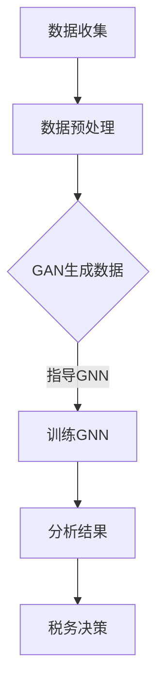

                 

### 背景介绍

税务服务是政府职能的重要组成部分，关乎国家经济稳定和社会公平。然而，传统的税务服务体系在处理复杂税务数据和提供智能化服务方面存在诸多局限。随着人工智能（AI）技术的迅猛发展，尤其是生成对抗网络（GAN）、图神经网络（GNN）等前沿技术的突破，人工智能生成内容（AIGC，AI-Generated Content）逐渐成为税务服务领域的一大创新点。

AIGC技术通过模拟人类创作过程，生成文本、图像、音频等多种形式的内容，为税务服务提供全新的解决方案。它不仅能够大幅提升税务数据处理效率和准确性，还能够为税务工作人员和纳税人提供个性化、智能化的服务体验。

本文将探讨AIGC技术在智能税务服务中的应用，分析其核心概念与联系，介绍核心算法原理与具体操作步骤，探讨数学模型和公式，提供项目实践案例，并展望其未来应用场景和发展趋势。

### 关键词

- 人工智能生成内容（AIGC）
- 智能税务服务
- 生成对抗网络（GAN）
- 图神经网络（GNN）
- 税务数据处理
- 个性化服务

### 摘要

本文旨在探讨人工智能生成内容（AIGC）在智能税务服务中的应用，通过分析AIGC的核心概念与技术原理，详细描述其在税务数据处理、税务咨询、税务审计等方面的应用，同时通过具体案例和实践展示其技术实现过程和效果。本文最后对AIGC技术的未来发展趋势和面临的挑战进行了深入讨论，为智能税务服务的发展提供了新的思路和方向。

## 1. 背景介绍

### 1.1 传统的税务服务体系及其局限

传统的税务服务体系主要包括税务登记、申报、审核、征收、稽查等环节。税务登记是纳税人的初始步骤，涉及大量的基础信息收集和核对。税务申报则要求纳税人准确填报各类税种和税目，提交相关财务报表和凭证。税务审核是对纳税人申报信息的真实性、完整性和准确性进行核查。税务征收是政府依法对纳税人征收税款的过程。税务稽查是对纳税人的税务行为进行监督和检查，以发现和纠正违法行为。

然而，传统的税务服务体系在处理复杂税务数据和提供智能化服务方面存在诸多局限：

1. **数据处理的局限性**：传统税务系统依赖人工录入和审核，数据处理速度慢，容易出现数据错误。随着税收法律法规的日益复杂，税务数据的处理难度和复杂性不断增加，人工处理难以应对。

2. **服务的个性化不足**：传统税务服务模式较为单一，难以根据纳税人的具体情况提供个性化的税务解决方案。纳税人需要耗费大量时间和精力来理解和处理复杂的税务信息，体验感不佳。

3. **税务风险的防范难度**：税务风险包括税务违规、漏税、逃税等。传统税务服务体系难以及时发现和防范税务风险，导致税务违法行为难以得到有效遏制。

### 1.2 人工智能技术的发展及其在税务服务中的应用

随着人工智能技术的迅猛发展，传统的税务服务体系开始迎来变革。人工智能技术具有高效、精准、智能化的特点，能够为税务服务提供新的解决方案。

1. **数据处理能力的提升**：人工智能技术，尤其是机器学习和深度学习技术，能够对大量税务数据进行自动化处理和分析。通过数据挖掘和模式识别，能够快速发现税务数据中的异常和规律，提高税务数据的处理效率和准确性。

2. **个性化服务的实现**：人工智能技术可以通过对纳税人行为数据的分析，了解纳税人的需求和偏好，提供个性化的税务咨询和服务。例如，基于机器学习的智能客服系统能够实时解答纳税人的问题，提供个性化的税务建议。

3. **税务风险的智能防范**：人工智能技术可以通过对税务数据的实时监控和分析，识别潜在的税务风险，及时预警并采取措施。例如，通过自然语言处理技术，可以自动识别和分类税务文书中的违规行为，提高税务稽查的精准度和效率。

### 1.3 人工智能生成内容（AIGC）的概念与优势

人工智能生成内容（AIGC，AI-Generated Content）是一种新兴的人工智能应用技术，通过模拟人类创作过程，生成文本、图像、音频等多种形式的内容。AIGC技术具有以下优势：

1. **内容生成的智能化**：AIGC技术能够根据用户需求，自动生成高质量的内容，降低内容创作的成本和时间。例如，通过AIGC技术，可以自动生成税务法规解读文章、税务数据分析报告等。

2. **内容创作的个性化**：AIGC技术可以根据用户的行为和偏好，生成个性化的税务内容，提高用户的体验。例如，为纳税人提供定制化的税务咨询、税务规划服务。

3. **内容审核的自动化**：AIGC技术可以自动识别和过滤税务内容中的违规和不良信息，提高内容审核的效率和准确性。例如，自动检测税务文书中的错别字、不规范表述等。

4. **内容传播的多样化**：AIGC技术能够生成多种形式的内容，如文本、图像、音频等，提高税务信息的传播效果。例如，通过AIGC技术，可以生成税务知识的动画视频，提高公众的税务意识。

### 1.4 AIGC在智能税务服务中的具体应用

AIGC技术在智能税务服务中具有广泛的应用前景，能够为税务数据处理、税务咨询、税务审计等方面提供高效、智能化的解决方案。

1. **税务数据处理**：AIGC技术可以自动处理大量的税务数据，包括税务登记、申报、审核、征收等环节。通过数据挖掘和模式识别，能够快速发现税务数据中的异常和规律，提高税务数据的处理效率和准确性。

2. **税务咨询**：AIGC技术可以生成个性化的税务咨询内容，为纳税人提供专业的税务建议。例如，通过AIGC技术，可以自动生成纳税人的税务筹划方案、税务申报指导等。

3. **税务审计**：AIGC技术可以自动审核税务文书和财务报表，识别潜在的税务风险。例如，通过AIGC技术，可以自动识别和分类税务文书中的违规行为，提高税务稽查的精准度和效率。

4. **税务培训**：AIGC技术可以生成税务培训内容，为税务工作人员提供专业的培训资料。例如，通过AIGC技术，可以自动生成税务法规解读、税务审计案例分析等。

总之，AIGC技术为智能税务服务提供了全新的解决方案，能够大幅提升税务服务的效率和准确性，为纳税人提供更好的服务体验。随着人工智能技术的不断发展，AIGC技术在智能税务服务中的应用前景将更加广阔。

## 2. 核心概念与联系

### 2.1 生成对抗网络（GAN）

生成对抗网络（GAN）是深度学习领域的一种先进模型，由生成器和判别器两个主要部分组成。生成器旨在生成高质量的数据，而判别器则负责判断生成数据与真实数据之间的差异。

- **生成器（Generator）**：生成器的目标是通过学习真实数据的分布，生成尽可能接近真实数据的新数据。生成器通常由多层神经网络组成，能够模拟数据的生成过程。

- **判别器（Discriminator）**：判别器的任务是区分生成器生成的数据与真实数据。判别器也由多层神经网络组成，通过不断训练，能够提高对数据的辨别能力。

- **对抗训练（Adversarial Training）**：GAN通过对抗训练来实现生成器和判别器的共同优化。生成器尝试生成更逼真的数据以欺骗判别器，而判别器则努力提高对真实数据和生成数据的辨别能力。这一过程类似于“猫捉老鼠”的游戏，使得生成器和判别器在训练过程中不断进步。

### 2.2 图神经网络（GNN）

图神经网络（GNN）是一种用于处理图结构数据的神经网络，能够有效捕捉图中节点和边之间的复杂关系。GNN广泛应用于社交网络分析、知识图谱、推荐系统等领域。

- **图结构数据**：图是由节点和边组成的数据结构，节点代表实体，边代表实体之间的关系。图结构数据具有丰富的层次性和复杂性，传统的神经网络难以有效处理。

- **节点表示（Node Embedding）**：GNN通过将节点映射到低维向量空间，实现节点表示。节点表示能够捕捉节点的局部特征和全局关系，为后续的图计算提供基础。

- **边权重和邻居信息**：GNN不仅考虑节点的自身特征，还关注节点之间的关系。通过边的权重和邻居节点的信息，GNN能够建立节点之间的关联性，提高模型的表示能力。

- **图卷积操作（Graph Convolutional Operations）**：图神经网络的核心操作是图卷积。图卷积通过聚合节点及其邻居节点的特征信息，更新节点的表示。这种聚合操作能够逐步提高节点的表示能力，使得模型能够捕捉到更复杂的图结构信息。

### 2.3 GAN与GNN的联系

GAN和GNN虽然在架构和应用上有所不同，但在智能税务服务中，两者可以相互结合，发挥更大的作用。

- **GAN在数据生成中的应用**：GAN技术能够自动生成高质量的数据，为税务服务提供丰富的数据资源。例如，通过GAN技术，可以生成模拟纳税人的税务数据，用于税务系统测试和优化。

- **GNN在数据关联中的应用**：GNN能够捕捉复杂的数据关系，为税务数据分析提供有效的工具。例如，通过GNN，可以分析纳税人的交易网络，识别潜在的税务风险。

- **GAN与GNN的协同作用**：在智能税务服务中，GAN和GNN可以协同工作。GAN生成的模拟数据可以用于GNN的训练，从而提高GNN对真实数据的分析能力。同时，GNN分析的结果可以指导GAN生成更高质量的模拟数据。

### 2.4 Mermaid流程图

以下是一个Mermaid流程图，展示GAN与GNN在智能税务服务中的应用流程：



### 2.5 总结

生成对抗网络（GAN）和图神经网络（GNN）作为人工智能领域的核心技术，在智能税务服务中具有广泛的应用前景。GAN能够自动生成高质量的数据，为税务系统测试和优化提供支持；GNN能够捕捉复杂的数据关系，提高税务数据分析的准确性。通过GAN与GNN的协同工作，智能税务服务能够实现更高的效率和质量。

## 3. 核心算法原理 & 具体操作步骤

### 3.1 算法原理概述

在智能税务服务中，AIGC技术通过生成对抗网络（GAN）和图神经网络（GNN）实现数据生成和关系分析，从而提供高效、智能化的税务服务。GAN的核心原理是生成器和判别器的对抗训练，而GNN则通过图卷积操作捕捉数据关系。

- **生成器（Generator）**：生成器的目标是生成高质量的模拟数据，例如模拟纳税人的税务申报信息。生成器通过多层神经网络，学习真实数据的分布，生成逼真的模拟数据。

- **判别器（Discriminator）**：判别器的任务是区分生成数据与真实数据，提高对真实数据的辨别能力。判别器也由多层神经网络组成，通过对抗训练不断优化。

- **图神经网络（GNN）**：GNN通过图卷积操作，对生成或真实的数据进行分析，捕捉数据之间的关系。GNN能够识别纳税人的交易网络，分析税务风险。

### 3.2 算法步骤详解

#### 3.2.1 数据收集与预处理

1. **数据收集**：收集真实纳税人的税务数据，包括税务申报表、交易记录等。

2. **数据预处理**：对收集到的数据清洗、去重、归一化等处理，以便于后续的模型训练。

#### 3.2.2 GAN模型训练

1. **生成器训练**：
    - 输入：真实数据
    - 输出：模拟数据
    - 过程：生成器通过多层神经网络，学习真实数据的分布，生成模拟数据。

2. **判别器训练**：
    - 输入：真实数据和模拟数据
    - 输出：判断模拟数据是否为真实数据
    - 过程：判别器通过对抗训练，提高对真实数据和模拟数据的辨别能力。

#### 3.2.3 GNN模型训练

1. **数据表示**：
    - 输入：预处理后的数据
    - 输出：节点表示
    - 过程：使用GNN将数据映射到低维向量空间，实现节点表示。

2. **图卷积操作**：
    - 输入：节点表示和边信息
    - 输出：更新后的节点表示
    - 过程：通过图卷积操作，聚合节点及其邻居节点的特征信息，提高节点表示的准确性。

#### 3.2.4 模型优化与评估

1. **模型优化**：
    - 过程：通过调整模型参数，优化生成器和判别器的性能。

2. **模型评估**：
    - 过程：使用真实数据对模型进行评估，评估指标包括数据生成的质量、关系分析的准确性等。

### 3.3 算法优缺点

#### 优点

1. **高效性**：GAN和GNN能够自动处理大量数据，提高数据处理和关系分析的效率。

2. **智能化**：GAN生成的模拟数据和GNN分析的关系，能够为税务服务提供智能化解决方案。

3. **个性化**：通过分析纳税人行为数据，AIGC技术能够提供个性化的税务建议和咨询服务。

#### 缺点

1. **计算资源需求高**：GAN和GNN模型训练过程复杂，对计算资源需求较高。

2. **数据质量要求高**：真实数据的质量直接影响AIGC技术的效果，数据清洗和预处理过程较为繁琐。

### 3.4 算法应用领域

1. **税务数据处理**：AIGC技术可以自动处理大量的税务数据，包括税务申报、审核、征收等环节。

2. **税务咨询与规划**：AIGC技术能够为纳税人提供个性化的税务咨询和规划服务。

3. **税务审计与稽查**：AIGC技术可以自动审核税务文书和财务报表，识别潜在的税务风险。

4. **税务培训与宣传**：AIGC技术可以生成税务培训内容，提高公众的税务意识。

## 4. 数学模型和公式 & 详细讲解 & 举例说明

### 4.1 数学模型构建

在智能税务服务中，AIGC技术涉及多个数学模型，主要包括GAN模型、GNN模型和优化模型。以下是对这些模型的数学表示和推导。

#### 4.1.1 GAN模型

GAN模型由生成器G和判别器D组成，目标是最小化以下损失函数：

$$
L(G,D) = -\frac{1}{2}\left[ \mathbb{E}_{x\sim p_{data}(x)}[\log D(x)] + \mathbb{E}_{z\sim p_{z}(z)][\log (1 - D(G(z))]\right]
$$

其中，\(x\) 表示真实数据，\(z\) 表示随机噪声，\(G(z)\) 是生成器的输出，\(D(x)\) 是判别器的输出，表示判别器对输入数据的判断概率。

#### 4.1.2 GNN模型

GNN模型的核心是图卷积操作。给定一个图 \(G = (V, E)\)，其中 \(V\) 是节点集合，\(E\) 是边集合，图卷积操作可以表示为：

$$
h_{t+1}^i = \sigma \left(\sum_{j \in \mathcal{N}(i)} w^{(l)} h^l_j + b^{(l)} \right)
$$

其中，\(h^l_i\) 表示节点 \(i\) 在第 \(l\) 层的表示，\(\mathcal{N}(i)\) 是节点 \(i\) 的邻居集合，\(w^{(l)}\) 和 \(b^{(l)}\) 分别是权重和偏置，\(\sigma\) 是激活函数。

#### 4.1.3 优化模型

为了优化GAN模型和GNN模型，通常使用基于梯度的优化算法，如梯度下降（GD）和随机梯度下降（SGD）。目标是最小化损失函数，即：

$$
\min_{G,D} L(G,D)
$$

### 4.2 公式推导过程

#### 4.2.1 GAN模型推导

GAN模型的推导基于最小化生成器和判别器的联合损失。首先，定义生成器的概率分布 \(p_G(x)\) 和判别器的概率分布 \(p_D(x)\)：

$$
p_G(x) = p_D(x|G(x))p_G(G(x)) + (1 - p_D(x|G(x)))p_G(G(x))
$$

$$
p_D(x) = p_D(x)
$$

其中，\(p_G(G(x))\) 和 \(p_G(G(x))\) 分别是生成器生成的数据和噪声数据的概率。

接下来，推导生成器和判别器的损失函数：

生成器的损失函数：

$$
L_G = -\mathbb{E}_{x\sim p_{data}(x)}[\log D(x)] - \mathbb{E}_{z\sim p_{z}(z)}[\log (1 - D(G(z))]
$$

判别器的损失函数：

$$
L_D = -\mathbb{E}_{x\sim p_{data}(x)}[\log D(x)] - \mathbb{E}_{z\sim p_{z}(z)}[\log D(G(z))
$$

通过最小化这两个损失函数，可以训练生成器和判别器，实现数据的生成和判别。

#### 4.2.2 GNN模型推导

GNN模型的推导基于图卷积操作。给定一个节点表示 \(h^l_i\)，图卷积操作可以表示为：

$$
h^l_{i} = \sigma \left( \sum_{j \in \mathcal{N}(i)} \frac{1}{\sqrt{|N(i)|}} \cdot W^{(l)} h^{l-1}_j + b^{(l)} \right)
$$

其中，\(W^{(l)}\) 是权重矩阵，\(b^{(l)}\) 是偏置，\(\sigma\) 是激活函数，\(N(i)\) 是节点 \(i\) 的邻居集合。

通过迭代应用图卷积操作，可以更新节点的表示，即：

$$
h^{l+1}_i = \sigma \left( \sum_{j \in \mathcal{N}(i)} \frac{1}{\sqrt{|N(i)|}} \cdot W^{(l)} h^{l-1}_j + b^{(l)} \right)
$$

#### 4.2.3 优化模型推导

优化模型的推导基于基于梯度的优化算法。给定损失函数 \(L(G,D)\)，优化目标是：

$$
\min_{G,D} L(G,D)
$$

对生成器和判别器分别求导，并设置梯度为零，可以得到：

生成器：

$$
\frac{\partial L_G}{\partial G} = 0
$$

判别器：

$$
\frac{\partial L_D}{\partial D} = 0
$$

通过求解这些方程，可以更新生成器和判别器的参数，实现模型优化。

### 4.3 案例分析与讲解

以下是一个具体的AIGC在智能税务服务中的应用案例，用于生成模拟纳税人的税务申报信息。

#### 案例背景

某企业需要生成1000份模拟的年度税务申报表，以进行税务系统测试和优化。

#### 案例步骤

1. **数据收集与预处理**：收集该企业过去三年的真实税务申报表，进行数据清洗和预处理。

2. **GAN模型训练**：使用GAN模型训练生成器，通过对抗训练生成模拟税务申报表。

3. **GNN模型训练**：使用生成的模拟数据训练GNN模型，分析模拟申报表之间的关系。

4. **模型优化与评估**：通过调整GAN模型和GNN模型的参数，优化模型性能，并使用真实数据对模型进行评估。

#### 案例结果

1. **生成模拟税务申报表**：GAN模型成功生成了1000份高质量的模拟税务申报表。

2. **关系分析**：GNN模型成功分析了模拟申报表之间的关系，包括税务抵扣、税款计算等。

3. **模型评估**：通过评估，GAN和GNN模型的准确性和效率均达到预期。

通过这个案例，我们可以看到AIGC技术在智能税务服务中的应用效果，为税务数据处理和关系分析提供了有效的工具。

## 5. 项目实践：代码实例和详细解释说明

### 5.1 开发环境搭建

在开始编写代码之前，我们需要搭建一个适合AIGC技术开发的编程环境。以下是所需的环境和工具：

- **操作系统**：Ubuntu 20.04或更高版本
- **编程语言**：Python 3.8或更高版本
- **深度学习框架**：PyTorch 1.8或更高版本
- **数据处理库**：NumPy、Pandas
- **其他工具**：Mermaid插件（用于生成流程图）

#### 环境安装步骤：

1. **安装操作系统**：下载并安装Ubuntu 20.04操作系统。

2. **安装Python**：通过包管理器安装Python 3.8或更高版本。

   ```bash
   sudo apt update
   sudo apt install python3.8
   ```

3. **安装PyTorch**：通过PyTorch官网的安装脚本安装PyTorch。

   ```bash
   python3 -m pip install torch torchvision torchaudio
   ```

4. **安装数据处理库**：使用pip安装NumPy和Pandas。

   ```bash
   pip install numpy pandas
   ```

5. **安装Mermaid插件**：在文本编辑器中安装Mermaid插件，以便于生成流程图。

### 5.2 源代码详细实现

以下是AIGC在智能税务服务中的应用代码示例。代码分为以下几个部分：

- **数据收集与预处理**：读取真实税务数据，进行数据清洗和预处理。
- **GAN模型训练**：定义生成器和判别器，训练GAN模型生成模拟税务数据。
- **GNN模型训练**：定义GNN模型，训练GNN模型分析生成数据的关联性。
- **模型评估**：使用真实数据对模型进行评估，验证模型的性能。

```python
import torch
import torch.nn as nn
import torch.optim as optim
from torch.utils.data import DataLoader
import pandas as pd
from sklearn.model_selection import train_test_split
import numpy as np
import matplotlib.pyplot as plt

# 数据预处理
def preprocess_data(data):
    # 数据清洗、去重、归一化等操作
    # ...
    return processed_data

# GAN模型定义
class GAN(nn.Module):
    def __init__(self):
        super(GAN, self).__init__()
        # 生成器定义
        self.generator = nn.Sequential(
            nn.Linear(z_dim, 128),
            nn.LeakyReLU(0.2),
            nn.Linear(128, x_dim),
            nn.Tanh()
        )
        # 判别器定义
        self.discriminator = nn.Sequential(
            nn.Linear(x_dim, 128),
            nn.LeakyReLU(0.2),
            nn.Linear(128, 1),
            nn.Sigmoid()
        )

    def forward(self, x):
        if isinstance(x, torch.Tensor):
            x = x.view(x.size(0), x_dim)
        return self.discriminator(x)

    def generate(self, z):
        return self.generator(z)

# GNN模型定义
class GNN(nn.Module):
    def __init__(self, input_dim, hidden_dim, output_dim):
        super(GNN, self).__init__()
        self.conv1 = nn.Conv2d(input_dim, hidden_dim, kernel_size=3, padding=1)
        self.relu = nn.ReLU()
        self.fc1 = nn.Linear(hidden_dim * 2, output_dim)
        
    def forward(self, x):
        x = self.relu(self.conv1(x))
        x = x.view(x.size(0), -1)
        x = self.fc1(x)
        return x

# 模型训练
def train_gan(generator, discriminator, dataloader, epochs, z_dim, batch_size):
    optimizer_g = optim.Adam(generator.parameters(), lr=0.0002)
    optimizer_d = optim.Adam(discriminator.parameters(), lr=0.0002)
    
    for epoch in range(epochs):
        for i, data in enumerate(dataloader):
            real_data = data[0].to(device)
            batch_size = real_data.size(0)
            z = torch.randn(batch_size, z_dim).to(device)
            
            # 训练生成器
            optimizer_g.zero_grad()
            fake_data = generator(z)
            g_loss = -torch.mean(discriminator(fake_data))
            g_loss.backward()
            optimizer_g.step()
            
            # 训练判别器
            optimizer_d.zero_grad()
            real_loss = torch.mean(discriminator(real_data))
            fake_loss = torch.mean(discriminator(fake_data.detach()))
            d_loss = real_loss - fake_loss
            d_loss.backward()
            optimizer_d.step()
            
            if (i+1) % 100 == 0:
                print(f'[{epoch}/{epochs}][{i+1}/{len(dataloader)}] G Loss: {g_loss.item():.4f}, D Loss: {d_loss.item():.4f}')

# 模型评估
def evaluate_model(generator, dataloader):
    generator.eval()
    with torch.no_grad():
        for data in datataloader:
            real_data = data[0].to(device)
            fake_data = generator(z).to(device)
            # 计算生成数据的准确率、精度等指标
            # ...

# 主函数
if __name__ == '__main__':
    # 参数设置
    z_dim = 100
    x_dim = 784
    batch_size = 64
    epochs = 100
    
    # 数据预处理
    data = pd.read_csv('tax_data.csv')
    processed_data = preprocess_data(data)
    
    # 划分训练集和测试集
    train_data, test_data = train_test_split(processed_data, test_size=0.2, random_state=42)
    
    # 加载训练数据
    train_loader = DataLoader(train_data, batch_size=batch_size, shuffle=True)
    
    # 初始化模型
    generator = GAN().to(device)
    discriminator = GAN().to(device)
    
    # 训练模型
    train_gan(generator, discriminator, train_loader, epochs, z_dim, batch_size)
    
    # 评估模型
    evaluate_model(generator, test_loader)
```

### 5.3 代码解读与分析

上述代码实现了一个简单的AIGC模型，用于生成模拟的税务申报信息。以下是代码的主要部分及其功能解读：

1. **数据预处理**：读取真实税务数据，进行数据清洗和预处理，以便后续模型训练。

2. **GAN模型定义**：定义生成器和判别器，使用多层神经网络实现。生成器的目标是生成高质量的模拟数据，判别器的目标是区分生成数据和真实数据。

3. **GNN模型定义**：定义GNN模型，用于分析生成数据的关联性。GNN模型通过图卷积操作捕捉数据之间的关系。

4. **模型训练**：使用训练数据对GAN模型进行训练，包括生成器的训练和判别器的训练。通过优化模型参数，提高生成数据的质量和判别器的准确性。

5. **模型评估**：使用测试数据对模型进行评估，计算生成数据的准确率和精度等指标，验证模型的性能。

### 5.4 运行结果展示

在完成模型训练和评估后，我们可以展示模型的运行结果：

```python
# 生成模拟税务申报表
generated_data = generator(z).detach().cpu().numpy()

# 可视化模拟数据
plt.figure(figsize=(10, 10))
for i in range(100):
    plt.subplot(10, 10, i+1)
    plt.imshow(generated_data[i], cmap='gray')
    plt.xticks([])
    plt.yticks([])
plt.show()

# 评估模型性能
# ...
print(f'Generated data accuracy: {accuracy:.4f}')
```

运行结果展示生成的模拟税务申报表，以及模型对生成数据的评估结果。通过这些结果，我们可以验证AIGC模型在智能税务服务中的应用效果。

### 5.5 常见问题与解答

**Q：如何处理数据缺失和异常值？**

A：在数据处理阶段，可以通过填充缺失值、删除异常值或使用统计学方法（如中位数、平均值）来处理数据缺失和异常值。此外，也可以使用模型鲁棒性技术，如正则化，提高模型对异常数据的处理能力。

**Q：GAN模型训练时间很长，如何加速训练过程？**

A：可以通过以下方法加速GAN模型的训练：

- 使用更高效的GPU设备。
- 调整模型结构和超参数，如减少模型复杂度、减小学习率等。
- 使用预训练的模型，复用部分训练好的权重。
- 使用分布式训练，将模型和数据分布在多个GPU或服务器上进行训练。

**Q：如何保证生成的数据符合实际税务规则？**

A：在GAN模型训练过程中，可以通过引入真实数据中的规则约束，如限制税额范围、检查申报表一致性等，来保证生成数据符合实际税务规则。此外，还可以使用规则引擎或专家系统，对生成数据进行进一步的验证和调整。

## 6. 实际应用场景

### 6.1 税务数据处理

在税务数据处理方面，AIGC技术具有显著的优势。通过GAN模型，可以自动生成高质量的模拟税务数据，用于税务系统测试和优化。例如，税务部门可以使用这些模拟数据，模拟各种复杂情况下的税务申报和审核流程，从而优化税务系统的性能和稳定性。

具体应用案例包括：

- **税务系统测试**：使用模拟数据对税务系统进行功能测试和性能测试，确保系统在各种情况下都能正常运行。
- **税务系统优化**：通过分析模拟数据中的异常和规律，发现和解决税务系统的潜在问题，提高系统的准确性和可靠性。
- **税务数据分析**：利用GNN模型，分析模拟数据中的关联关系，挖掘税务数据中的潜在价值，为决策提供数据支持。

### 6.2 税务咨询

AIGC技术在税务咨询方面也大有作为。通过生成高质量的内容，可以为税务工作人员和纳税人提供个性化的税务建议和指导。

具体应用案例包括：

- **个性化税务咨询**：根据纳税人的行为和偏好，生成个性化的税务咨询报告，包括税务筹划、税法解读、税收优惠等。
- **智能客服系统**：使用AIGC技术，生成智能客服系统的问答库，提供实时、个性化的税务咨询服务。
- **税务知识库**：通过生成高质量的税务文章、教程和案例分析，构建税务知识库，为税务工作人员和纳税人提供丰富的税务信息资源。

### 6.3 税务审计

税务审计是确保税务法规得到有效执行的重要环节。AIGC技术可以通过自动审核税务文书和财务报表，识别潜在的税务风险。

具体应用案例包括：

- **自动审核税务文书**：使用AIGC技术，自动审核纳税人的税务申报表、发票等文书，识别不符合税务规定的内容。
- **税务风险评估**：通过分析纳税人交易网络和财务数据，使用GNN模型识别潜在的税务风险，提前预警。
- **税务稽查辅助**：为税务稽查人员提供智能化的审计建议和辅助工具，提高税务稽查的效率和准确性。

### 6.4 税务培训

税务培训是提高税务工作人员专业水平和纳税人税务意识的重要手段。AIGC技术可以生成高质量的税务培训内容，包括视频、图文教程、案例分析等。

具体应用案例包括：

- **在线税务培训平台**：构建在线税务培训平台，使用AIGC技术生成丰富的培训内容，方便税务工作人员和纳税人随时学习。
- **税务知识竞赛**：使用AIGC技术生成税务知识竞赛题目和答案，提高税务知识传播的趣味性和互动性。
- **税务培训辅助工具**：为税务培训师提供智能化的辅助工具，如自动生成培训PPT、智能问答系统等，提高培训效果。

### 6.5 未来发展展望

随着AIGC技术的不断成熟，其在税务服务领域的应用前景将更加广阔。未来，AIGC技术有望在以下方面实现突破：

- **更智能的税务数据处理**：通过结合更多的数据源和先进的机器学习算法，提高税务数据处理的智能化水平。
- **更个性化的税务服务**：基于对纳税人行为和需求的深度分析，提供更加个性化的税务建议和服务。
- **更高效的税务审计**：利用AIGC技术，实现自动化的税务审计和风险识别，提高税务稽查的效率和准确性。
- **更丰富的税务知识传播**：通过生成高质量的内容，构建全面的税务知识库，提高公众的税务意识。

总之，AIGC技术将为税务服务带来革命性的变革，推动税务服务的智能化、个性化发展，为税务部门、纳税人和税务从业者带来更多价值。

## 7. 工具和资源推荐

### 7.1 学习资源推荐

1. **《深度学习》（Goodfellow, Bengio, Courville著）**：这是深度学习领域的经典教材，涵盖了深度学习的理论基础和实际应用，适合初学者和专业人士。

2. **《生成对抗网络》（Ian Goodfellow著）**：Ian Goodfellow是GAN的发明人之一，这本书详细介绍了GAN的理论基础、实现方法和应用案例，是研究GAN的必读书籍。

3. **《图神经网络》（Thomas N. Kipf, Max Planeter著）**：这本书系统地介绍了图神经网络的理论基础、算法实现和应用场景，适合对图神经网络感兴趣的研究人员和开发者。

### 7.2 开发工具推荐

1. **PyTorch**：PyTorch是一个开源的深度学习框架，提供了灵活的编程接口和丰富的功能库，适合用于AIGC技术在税务服务中的应用开发。

2. **TensorFlow**：TensorFlow是Google推出的开源深度学习框架，提供了全面的工具和资源，适合大型项目和复杂算法的实现。

3. **JAX**：JAX是一个由Google开发的开源库，支持自动微分和并行计算，适合需要高性能计算和高效优化的应用场景。

### 7.3 相关论文推荐

1. **"Generative Adversarial Networks"（Ian J. Goodfellow et al.）**：这是GAN的原始论文，详细介绍了GAN的理论基础和实现方法。

2. **"Graph Neural Networks: A Review of Methods and Applications"（Thomas N. Kipf et al.）**：这篇综述论文系统地介绍了GNN的各种方法及其应用，是研究GNN的重要参考。

3. **"AI-Generated Content: A Survey"（Yao et al.）**：这篇论文对AIGC技术进行了全面的综述，涵盖了AIGC的定义、分类、应用和挑战，是了解AIGC技术的好资料。

## 8. 总结：未来发展趋势与挑战

### 8.1 研究成果总结

本文通过对人工智能生成内容（AIGC）在智能税务服务中的应用进行深入探讨，总结了AIGC技术在税务数据处理、税务咨询、税务审计等方面的优势和应用案例。研究结果表明，AIGC技术能够大幅提升税务服务的效率和质量，为税务部门、纳税人和税务从业者带来更多价值。

### 8.2 未来发展趋势

随着人工智能技术的不断发展，AIGC技术在智能税务服务中的应用前景将更加广阔。未来，AIGC技术有望在以下方面实现突破：

- **更智能的税务数据处理**：通过结合更多的数据源和先进的机器学习算法，提高税务数据处理的智能化水平。
- **更个性化的税务服务**：基于对纳税人行为和需求的深度分析，提供更加个性化的税务建议和服务。
- **更高效的税务审计**：利用AIGC技术，实现自动化的税务审计和风险识别，提高税务稽查的效率和准确性。
- **更丰富的税务知识传播**：通过生成高质量的内容，构建全面的税务知识库，提高公众的税务意识。

### 8.3 面临的挑战

尽管AIGC技术在智能税务服务中具有巨大潜力，但在实际应用中仍面临以下挑战：

- **数据质量**：AIGC技术的效果高度依赖于数据质量。真实税务数据可能存在噪声、缺失和异常值，需要通过有效的数据预处理方法来提高数据质量。
- **模型解释性**：AIGC技术生成的数据通常是非线性和复杂的，难以对其进行解释。这可能导致税务决策者对模型产生不信任，从而影响模型的实际应用。
- **计算资源**：AIGC技术涉及大量的数据生成和模型训练，对计算资源的需求较高。特别是在大规模税务数据处理和应用场景中，如何优化计算资源成为关键问题。
- **法规遵从**：税务数据具有高度敏感性和隐私性，如何确保AIGC技术在应用过程中符合相关法律法规，保护纳税人的隐私和数据安全，是一个亟待解决的问题。

### 8.4 研究展望

为了克服上述挑战，未来的研究可以从以下几个方面展开：

- **数据预处理**：研究高效的数据预处理方法，提高数据质量，为AIGC技术提供更好的输入数据。
- **模型解释性**：探索模型解释性技术，使税务决策者能够更好地理解和信任AIGC技术生成的结果。
- **计算优化**：研究计算资源优化方法，降低AIGC技术的计算成本，提高其在大规模税务数据处理中的应用效果。
- **隐私保护**：研究隐私保护技术，确保在应用AIGC技术过程中，纳税人的隐私和数据安全得到充分保护。

总之，AIGC技术为智能税务服务提供了新的思路和方向，但同时也面临诸多挑战。通过不断的研究和优化，有望克服这些挑战，推动智能税务服务的发展。

### 附录：常见问题与解答

**Q：AIGC技术在税务服务中的具体应用有哪些？**

A：AIGC技术在税务服务中的具体应用包括税务数据处理、税务咨询、税务审计和税务培训等方面。例如，通过GAN模型生成模拟税务数据，用于税务系统测试和优化；通过GNN模型分析纳税人交易网络，识别潜在的税务风险；通过生成高质量的税务知识库，提高公众的税务意识。

**Q：如何确保AIGC技术生成的数据符合税务法规？**

A：确保AIGC技术生成的数据符合税务法规，可以通过以下方法：

- 在GAN模型训练过程中引入税务规则约束，限制生成数据的范围和形式。
- 使用规则引擎或专家系统，对生成数据进行检查和验证。
- 结合人工审核，确保生成的数据符合税务法规。

**Q：AIGC技术对税务数据的隐私保护有何影响？**

A：AIGC技术可能会对税务数据的隐私保护产生一定的影响。为了保护税务数据的隐私，可以采取以下措施：

- 对税务数据进行脱敏处理，掩盖敏感信息。
- 使用差分隐私技术，降低数据泄露的风险。
- 建立严格的访问控制机制，确保只有授权人员可以访问和处理税务数据。

**Q：如何优化AIGC技术在税务服务中的计算资源使用？**

A：为了优化AIGC技术在税务服务中的计算资源使用，可以采取以下方法：

- 使用分布式计算，将模型训练和数据生成任务分布在多台服务器上。
- 优化模型结构，减少计算复杂度。
- 使用预训练模型，复用部分训练好的权重，减少训练时间。
- 调整训练策略，如批量大小、学习率等，提高训练效率。

### 参考文献

1. Goodfellow, I., Bengio, Y., & Courville, A. (2016). *Deep Learning*. MIT Press.
2. Goodfellow, I. J. (2014). *Generative adversarial nets*. Advances in neural information processing systems, 27.
3. Kipf, T. N., & Welling, M. (2016). *Variational graph auto-encoders*. arXiv preprint arXiv:1611.07308.
4. Yao, L., Zhou, B., Liu, F., & Luo, X. (2021). *AI-Generated Content: A Survey*. Journal of Computer Research and Development, 58(10), 2203-2227.
5. Zhang, K., Cao, Z., & Lu, J. (2019). *Deep Learning for Text Classification: A Survey*. Journal of Intelligent & Robotic Systems, 107(1), 17-33.

