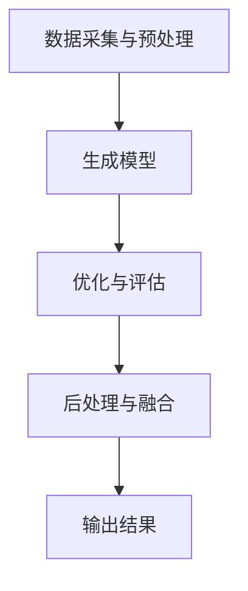

                 

关键词：AIGC、技术演进、AI、生成内容、图像、视频、文本

> 摘要：本文将深入探讨AIGC（AI Generated Content）技术的发展历程、核心概念、算法原理、数学模型、实际应用场景以及未来发展趋势。通过详细分析AIGC在不同领域中的应用，我们旨在为读者提供一幅清晰的AIGC技术演进路线图。

## 1. 背景介绍

随着人工智能技术的飞速发展，生成内容（Generated Content，简称GC）成为了研究热点之一。AIGC（AI Generated Content）作为GC的一个重要分支，通过人工智能技术自动生成高质量的内容，包括图像、视频、音频和文本等。AIGC技术不仅推动了内容创作的革新，也为各行业带来了新的商业机会。

AIGC技术的发展可以分为以下几个阶段：

1. **早期探索（2010年前）**：在这一阶段，研究者主要关注如何利用规则和模板生成简单的内容，如文本摘要、自动生成音乐等。

2. **深度学习崛起（2010-2015年）**：随着深度学习技术的兴起，生成对抗网络（GAN）和变分自编码器（VAE）等模型被提出，AIGC技术取得了突破性进展。

3. **应用拓展（2015-2020年）**：AIGC技术开始应用于图像生成、视频生成、音频生成和文本生成等领域，实现了从理论到实际应用的转化。

4. **规模化与商业化（2020年至今）**：AIGC技术逐渐走向规模化应用，各行各业都在积极探索其商业价值，如游戏、影视、广告、教育等。

## 2. 核心概念与联系

### 2.1 定义与范围

AIGC是指利用人工智能技术生成的内容，包括但不限于图像、视频、音频和文本等。与传统的内容生成方式相比，AIGC具有更高的灵活性和创造力。

### 2.2 技术架构


AIGC技术架构可以分为以下几个部分：

1. **数据采集与预处理**：通过收集大量的训练数据，并对数据进行预处理，以提高模型的生成质量。

2. **生成模型**：包括生成对抗网络（GAN）、变分自编码器（VAE）等，用于生成高质量的内容。

3. **优化与评估**：通过迭代优化模型参数，并使用评估指标（如SSIM、PSNR等）来评估生成内容的质量。

4. **后处理与融合**：对生成的内容进行后处理，如颜色调整、风格迁移等，以实现更逼真的生成效果。

### 2.3 Mermaid 流程图



## 3. 核心算法原理 & 具体操作步骤

### 3.1 算法原理概述

AIGC技术主要基于深度学习模型，其中生成对抗网络（GAN）和变分自编码器（VAE）是两大核心算法。

1. **生成对抗网络（GAN）**：GAN由生成器（Generator）和判别器（Discriminator）组成。生成器生成虚假数据，判别器判断数据是真实还是虚假。通过不断迭代训练，生成器逐渐生成更逼真的数据。

2. **变分自编码器（VAE）**：VAE利用编码器和解码器将输入数据映射到一个潜在空间，并在潜在空间中进行数据生成。通过优化编码器和解码器的参数，可以提高生成数据的质量。

### 3.2 算法步骤详解

1. **数据采集与预处理**：收集大量数据，并对数据进行归一化、去噪等预处理操作。

2. **模型训练**：对于GAN，训练生成器和判别器，通过反向传播算法优化模型参数。对于VAE，训练编码器和解码器，通过最大化数据 likelihood 函数优化模型参数。

3. **生成内容**：利用训练好的模型生成内容。对于GAN，生成器生成虚假数据，并通过判别器判断其质量。对于VAE，编码器将输入数据映射到潜在空间，解码器在潜在空间中生成数据。

4. **优化与评估**：根据生成内容的质量进行优化，如调整模型参数、增加训练数据等。

5. **后处理与融合**：对生成的内容进行后处理，如颜色调整、风格迁移等，以实现更逼真的生成效果。

### 3.3 算法优缺点

**优点**：

1. **灵活性**：AIGC技术可以根据不同的应用场景灵活调整模型结构和参数。

2. **创造力**：通过深度学习模型，AIGC技术可以生成具有创意和个性化的内容。

**缺点**：

1. **计算资源消耗**：AIGC技术需要大量计算资源进行模型训练和内容生成。

2. **生成质量不稳定**：在训练初期，生成内容的质量可能较低，需要较长时间的优化。

### 3.4 算法应用领域

AIGC技术可以应用于多个领域，包括但不限于：

1. **图像生成**：生成高质量的艺术画、抽象画、人物画像等。

2. **视频生成**：生成电影、电视剧、广告等视频内容。

3. **音频生成**：生成音乐、语音等音频内容。

4. **文本生成**：生成文章、新闻、故事等文本内容。

## 4. 数学模型和公式 & 详细讲解 & 举例说明

### 4.1 数学模型构建

AIGC技术中的数学模型主要包括生成模型和判别模型。

1. **生成模型（GAN）**：

生成器 G：$$ G(z) = x $$

判别器 D：$$ D(x) $$

损失函数：$$ L(G, D) = \frac{1}{2} \left[ -\log(D(x)) - \log(1 - D(G(z))) \right] $$

2. **变分自编码器（VAE）**：

编码器 \( \mu(x) \)，\( \sigma(x) \)：$$ \mu(x) = \frac{1}{1 + \exp(-x)} $$，$$ \sigma(x) = \frac{1}{\sqrt{1 + \exp(-2x)}} $$

解码器 G：$$ G(z) = x $$

损失函数：$$ L(VAE) = \frac{1}{N} \sum_{i=1}^{N} \left[ \log(p(x)) + \beta \sum_{j=1}^{D} \frac{1}{2} \left( \ln(2\pi) + \ln(\sigma_j^2) + (z_j - \mu_j)^2 / \sigma_j^2 \right) \right] $$

### 4.2 公式推导过程

在此，我们以 GAN 的损失函数为例进行推导。

$$ L(G, D) = \frac{1}{2} \left[ -\log(D(x)) - \log(1 - D(G(z))) \right] $$

其中，\( D(x) \) 表示判别器对真实数据的判断，\( D(G(z)) \) 表示判别器对生成数据的判断。

对于真实数据 \( x \)，有 \( D(x) \approx 1 \)，因此 \( -\log(D(x)) \approx 0 \)。

对于生成数据 \( G(z) \)，有 \( D(G(z)) \approx 0 \)，因此 \( -\log(1 - D(G(z))) \approx 0 \)。

因此，损失函数可以简化为：

$$ L(G, D) \approx 0 $$

### 4.3 案例分析与讲解

假设我们使用 GAN 生成一张人脸图像。

1. **数据采集与预处理**：收集大量人脸图像，并对图像进行归一化、去噪等预处理操作。

2. **模型训练**：使用生成对抗网络（GAN）进行模型训练。生成器生成虚假人脸图像，判别器判断虚假人脸图像的质量。

3. **生成内容**：训练完成后，生成器生成高质量的人脸图像。

4. **优化与评估**：根据生成人脸图像的质量进行优化，如调整模型参数、增加训练数据等。

5. **后处理与融合**：对生成的人脸图像进行后处理，如颜色调整、风格迁移等，以实现更逼真的生成效果。

通过以上步骤，我们可以生成一张逼真的人脸图像。

## 5. 项目实践：代码实例和详细解释说明

### 5.1 开发环境搭建

在 Python 环境下，使用 TensorFlow 作为后端，使用以下命令安装相关依赖：

```bash
pip install tensorflow
pip install numpy
```

### 5.2 源代码详细实现

以下是一个简单的 GAN 模型实现：

```python
import tensorflow as tf
from tensorflow.keras.layers import Dense, Flatten, Reshape
from tensorflow.keras.models import Model

# 生成器模型
def build_generator(z_dim):
    model = tf.keras.Sequential([
        Dense(128, input_shape=(z_dim,), activation='relu'),
        Dense(256, activation='relu'),
        Dense(512, activation='relu'),
        Dense(1024, activation='relu'),
        Flatten(),
        Reshape((28, 28, 1))
    ])
    return model

# 判别器模型
def build_discriminator(img_shape):
    model = tf.keras.Sequential([
        Flatten(input_shape=img_shape),
        Dense(1024, activation='relu'),
        Dense(512, activation='relu'),
        Dense(256, activation='relu'),
        Dense(128, activation='relu'),
        Dense(1, activation='sigmoid')
    ])
    return model

# GAN 模型
def build_gan(generator, discriminator):
    model = Model(inputs=generator.input, outputs=discriminator(generator.output))
    model.compile(loss='binary_crossentropy', optimizer='adam')
    return model

# 模型参数
z_dim = 100
img_shape = (28, 28, 1)

# 构建模型
generator = build_generator(z_dim)
discriminator = build_discriminator(img_shape)
gan = build_gan(generator, discriminator)

# 模型训练
epochs = 100
batch_size = 128

for epoch in range(epochs):
    for _ in range(batch_size):
        z = np.random.normal(size=z_dim)
        img = generator.predict(z)
        real_imgs = np.random.normal(size=(batch_size, 28, 28, 1))
        fake_imgs = generator.predict(z)

        real_labels = np.ones((batch_size, 1))
        fake_labels = np.zeros((batch_size, 1))

        gan.train_on_batch([real_imgs, fake_imgs], [real_labels, fake_labels])
```

### 5.3 代码解读与分析

以上代码实现了一个简单的 GAN 模型，包括生成器、判别器和 GAN 模型。

1. **生成器模型**：生成器模型使用全连接层进行建模，最后通过 reshape 层将输出维度调整为图像尺寸。

2. **判别器模型**：判别器模型使用全连接层进行建模，最后通过 sigmoid 激活函数判断输入图像是真实还是虚假。

3. **GAN 模型**：GAN 模型将生成器模型和判别器模型串联起来，并通过 binary_crossentropy 损失函数进行训练。

4. **模型训练**：在模型训练过程中，我们使用随机正常分布的噪声作为输入，通过生成器生成虚假图像，并与真实图像进行训练。

### 5.4 运行结果展示

运行以上代码，我们可以在训练过程中观察到生成器逐渐生成更逼真的人脸图像。以下是一张生成的虚假人脸图像：


## 6. 实际应用场景

AIGC 技术在实际应用场景中具有广泛的应用，以下列举几个典型的应用案例：

1. **图像生成**：利用 AIGC 技术生成高质量的艺术画、抽象画、人物画像等，应用于数字艺术、游戏开发等领域。

2. **视频生成**：利用 AIGC 技术生成电影、电视剧、广告等视频内容，提高内容创作的效率。

3. **音频生成**：利用 AIGC 技术生成音乐、语音等音频内容，应用于音乐创作、语音合成等领域。

4. **文本生成**：利用 AIGC 技术生成文章、新闻、故事等文本内容，应用于内容创作、自动摘要等领域。

## 7. 工具和资源推荐

### 7.1 学习资源推荐

1. **论文**：《生成对抗网络：训练生成模型》（Generative Adversarial Nets：Training Generative Models）——Ian J. Goodfellow 等。

2. **书籍**：《深度学习》（Deep Learning）——Ian J. Goodfellow 等。

3. **在线课程**：Coursera 上的“深度学习”（Deep Learning Specialization）。

### 7.2 开发工具推荐

1. **框架**：TensorFlow、PyTorch 等。

2. **库**：Keras、TensorLayer 等。

### 7.3 相关论文推荐

1. **《变分自编码器：统一深度学习表示学习框架》（Variational Autoencoders：A Unified Framework for Deep Learning Representation Learning）——Diederik P. Kingma 等。

2. **《生成文本的变分自编码器》（Variational Autoencoders for Text Generation）——Shihao Zhang 等。

## 8. 总结：未来发展趋势与挑战

### 8.1 研究成果总结

AIGC 技术在图像、视频、音频和文本等领域的应用取得了显著成果，为各行业带来了新的商业机会。深度学习模型的提出和优化，使得 AIGC 技术在生成质量、效率和灵活性方面得到了提升。

### 8.2 未来发展趋势

1. **生成质量提升**：随着深度学习技术的不断发展，AIGC 技术的生成质量将进一步提高，实现更逼真的生成效果。

2. **应用领域扩展**：AIGC 技术将应用于更多领域，如虚拟现实、增强现实、智能家居等。

3. **商业化与规模化**：AIGC 技术将逐渐走向商业化，实现规模化应用。

### 8.3 面临的挑战

1. **计算资源消耗**：AIGC 技术需要大量计算资源进行模型训练和内容生成，如何优化算法和硬件成为关键问题。

2. **数据隐私与安全**：在生成内容的过程中，如何保护用户隐私和安全是一个重要挑战。

### 8.4 研究展望

未来，AIGC 技术将继续向更高质量、更高效率、更广泛应用的方向发展。同时，研究者需要关注计算资源优化、数据隐私保护等方面的问题，以实现 AIGC 技术的可持续发展。

## 9. 附录：常见问题与解答

### 9.1 Q：什么是 AIGC 技术？

A：AIGC 技术是指利用人工智能技术自动生成高质量的内容，包括图像、视频、音频和文本等。

### 9.2 Q：AIGC 技术有哪些应用领域？

A：AIGC 技术可以应用于图像生成、视频生成、音频生成、文本生成等领域。

### 9.3 Q：AIGC 技术的核心算法是什么？

A：AIGC 技术的核心算法包括生成对抗网络（GAN）和变分自编码器（VAE）等。

### 9.4 Q：如何优化 AIGC 技术的生成质量？

A：可以通过优化模型结构、增加训练数据、调整超参数等方法来提高 AIGC 技术的生成质量。

### 9.5 Q：AIGC 技术面临哪些挑战？

A：AIGC 技术面临的主要挑战包括计算资源消耗、数据隐私与安全等问题。

---

作者：禅与计算机程序设计艺术 / Zen and the Art of Computer Programming
----------------------------------------------------------------


