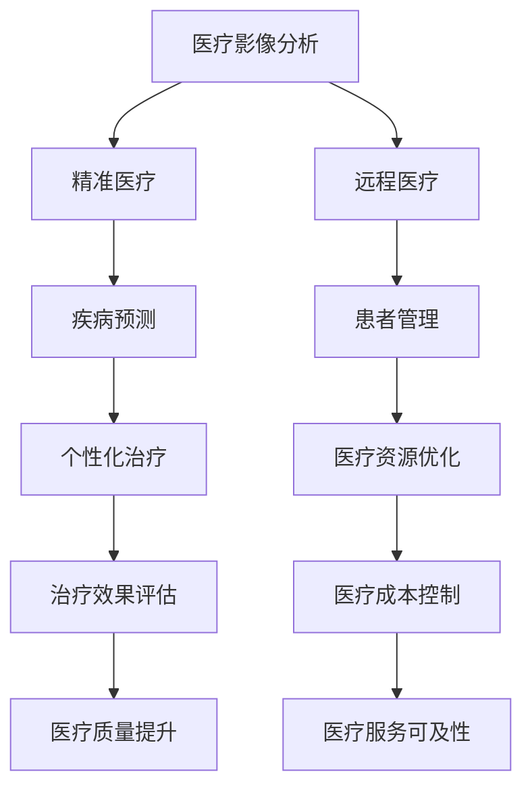

                 

在过去的几十年中，人工智能（AI）技术取得了令人瞩目的进步，它正在深刻地改变各行各业，医疗领域也不例外。随着大数据、云计算和深度学习等技术的不断发展，AI在医疗领域的应用越来越广泛，极大地提升了医疗服务的质量和效率。本文将探讨AI，特别是自动生成内容（AIGC）技术在智慧医疗领域的推动作用，分析其核心概念、应用场景、未来发展趋势与挑战。

## 关键词

- **人工智能（AI）**
- **自动生成内容（AIGC）**
- **智慧医疗**
- **大数据**
- **云计算**
- **深度学习**
- **医疗影像分析**
- **精准医疗**
- **远程医疗**

## 摘要

本文首先介绍了人工智能和自动生成内容技术的发展背景，随后探讨了AIGC技术在智慧医疗中的应用现状。文章通过详细阐述AIGC技术在医疗影像分析、精准医疗和远程医疗等领域的应用，展示了其在提高诊断准确性、优化治疗计划和改善患者体验方面的巨大潜力。最后，文章讨论了AIGC技术的未来发展趋势和面临的挑战，并提出了相应的解决思路。

## 1. 背景介绍

### 人工智能的发展历程

人工智能作为计算机科学的一个重要分支，起源于20世纪50年代。从最初的逻辑推理和规则系统，到后来的知识表示和学习算法，再到现代的深度学习和神经网络，人工智能经历了多次重大的技术革新。特别是在2012年，AlexNet在ImageNet竞赛中取得的突破性成绩，标志着深度学习时代的到来。深度学习通过模拟人脑的神经网络结构，实现了在图像识别、语音识别和自然语言处理等领域的显著突破。

### 自动生成内容（AIGC）的概念

自动生成内容（AIGC，Autonomous Intelligent Generation of Content）是一种基于人工智能技术，能够自动生成高质量、多样化内容的方法。AIGC技术主要包括自然语言生成、图像生成、音频生成和视频生成等领域。通过深度学习、强化学习和生成对抗网络（GAN）等技术的结合，AIGC能够实现自动内容生成，为各行各业提供创新的解决方案。

### 智慧医疗的发展趋势

随着医疗大数据的积累和云计算技术的普及，智慧医疗逐渐成为医疗行业的重要发展方向。智慧医疗利用人工智能、大数据、云计算和物联网等技术，实现医疗信息的数字化、智能化和网络化，提高医疗服务的质量和效率。智慧医疗主要包括医疗影像分析、精准医疗、远程医疗和智能辅助诊断等方向。

## 2. 核心概念与联系

### AIGC技术在智慧医疗中的应用

AIGC技术在智慧医疗中的应用，主要包括医疗影像分析、精准医疗和远程医疗等方面。下面我们将通过一个Mermaid流程图，详细展示AIGC技术在智慧医疗中的核心概念和联系。



### 医疗影像分析

医疗影像分析是AIGC技术在智慧医疗中的一个重要应用领域。通过深度学习和计算机视觉技术，AIGC可以自动分析医学影像，如X光片、CT扫描和MRI图像，检测病变和组织结构，提高诊断的准确性和效率。此外，AIGC还可以辅助医生进行疾病预测和治疗方案设计。

### 精准医疗

精准医疗是近年来医疗领域的重要研究方向。通过大数据分析和机器学习算法，AIGC可以识别患者的基因突变、药物反应和治疗需求，为个体提供精准的治疗方案。这种个性化治疗模式，有助于提高治疗效果，减少副作用，降低医疗成本。

### 远程医疗

远程医疗利用互联网和通信技术，实现医生和患者之间的远程诊断、治疗和护理。AIGC技术可以自动化处理医疗数据，提供智能诊断建议和治疗方案，提高远程医疗的效率和准确性。此外，AIGC还可以辅助医生进行患者管理，优化医疗资源分配。

## 3. 核心算法原理 & 具体操作步骤

### 3.1 算法原理概述

AIGC技术的核心算法主要包括深度学习、生成对抗网络（GAN）和强化学习等。这些算法通过模拟人脑的神经网络结构，实现自动内容生成和智能化数据处理。

- **深度学习**：通过多层神经网络，对大量数据进行训练，提取特征，实现图像、语音和文本的自动生成。
- **生成对抗网络（GAN）**：由生成器和判别器两个神经网络组成，通过竞争和对抗，实现高质量内容的自动生成。
- **强化学习**：通过与环境的交互，学习最优策略，实现智能决策和内容生成。

### 3.2 算法步骤详解

#### 3.2.1 深度学习算法步骤

1. 数据预处理：对医疗影像、基因数据等进行归一化和特征提取。
2. 网络构建：设计多层神经网络结构，包括输入层、隐藏层和输出层。
3. 模型训练：使用梯度下降等优化算法，训练神经网络，调整权重和偏置。
4. 模型评估：使用测试数据集，评估模型的准确性和泛化能力。

#### 3.2.2 生成对抗网络（GAN）算法步骤

1. 数据预处理：对医疗影像、基因数据等进行归一化和特征提取。
2. 网络构建：设计生成器和判别器两个神经网络。
3. 模型训练：通过对抗训练，优化生成器和判别器，实现高质量内容的自动生成。
4. 模型评估：使用测试数据集，评估生成器生成内容的真实性和多样性。

#### 3.2.3 强化学习算法步骤

1. 环境构建：模拟医疗决策环境，包括患者信息、治疗方案和治疗效果等。
2. 策略学习：通过交互和反馈，学习最优策略，实现智能决策。
3. 模型评估：在真实环境中，评估智能决策的效果和可靠性。

### 3.3 算法优缺点

#### 3.3.1 深度学习算法

优点：能够自动提取复杂特征，适应性强，适用于大规模数据处理。

缺点：对数据量和计算资源要求高，训练过程需要较长时间。

#### 3.3.2 生成对抗网络（GAN）

优点：能够生成高质量、多样化的内容，具有较强泛化能力。

缺点：训练过程容易陷入局部最优，模型不稳定。

#### 3.3.3 强化学习

优点：能够实现智能决策，适应性强，适用于复杂环境。

缺点：训练过程需要大量交互和数据，计算资源消耗大。

### 3.4 算法应用领域

深度学习、生成对抗网络和强化学习算法在智慧医疗领域具有广泛的应用前景，包括医疗影像分析、精准医疗和远程医疗等。通过结合不同算法的优势，实现医疗数据的智能化处理和内容生成，提高医疗服务的质量和效率。

## 4. 数学模型和公式 & 详细讲解 & 举例说明

### 4.1 数学模型构建

在AIGC技术中，常用的数学模型包括神经网络模型、生成对抗网络（GAN）和强化学习模型。下面分别介绍这些模型的数学模型构建。

#### 4.1.1 神经网络模型

神经网络模型是一种通过多层神经网络对数据进行分析和预测的数学模型。其数学模型可以表示为：

$$
Y = f(W_1 \cdot X + b_1) + f(W_2 \cdot f(W_1 \cdot X + b_1) + b_2) + ... + f(W_n \cdot f(...f(W_1 \cdot X + b_1) + b_2)... + b_n)
$$

其中，$X$为输入数据，$Y$为输出数据，$W$为权重矩阵，$b$为偏置项，$f$为激活函数。

#### 4.1.2 生成对抗网络（GAN）

生成对抗网络（GAN）是一种通过生成器和判别器两个神经网络进行对抗训练的数学模型。其数学模型可以表示为：

$$
G(z) = \mathcal{N}(z; 0, 1) \quad D(x) = \sigma(W_D \cdot x + b_D) \quad G(z) = \mathcal{N}(z; 0, 1) \quad D(x) = \sigma(W_D \cdot x + b_D)
$$

其中，$G(z)$为生成器的输出，$D(x)$为判别器的输出，$z$为生成器的输入，$x$为真实数据，$W_D$和$b_D$为判别器的权重和偏置。

#### 4.1.3 强化学习模型

强化学习模型是一种通过智能体与环境交互，学习最优策略的数学模型。其数学模型可以表示为：

$$
Q(s, a) = r(s, a, s') + \gamma \max_a' Q(s', a')
$$

其中，$s$为状态，$a$为动作，$s'$为下一状态，$r$为奖励函数，$\gamma$为折扣因子。

### 4.2 公式推导过程

下面以生成对抗网络（GAN）为例，介绍其公式的推导过程。

#### 4.2.1 生成器与判别器

生成对抗网络（GAN）由生成器和判别器两个神经网络组成。生成器的目标是生成逼真的数据，判别器的目标是区分真实数据和生成数据。

假设生成器的输入为随机噪声$z$，输出为生成数据$G(z)$，判别器的输入为真实数据$x$和生成数据$G(z)$，输出为概率值$D(x)$。

#### 4.2.2 对抗训练

生成对抗网络（GAN）通过对抗训练来优化生成器和判别器。具体步骤如下：

1. 初始化生成器和判别器的参数。
2. 对于每个训练样本$(x, y)$，生成器生成一个样本$G(z)$，判别器同时接收真实样本$x$和生成样本$G(z)$。
3. 判别器通过比较真实样本$x$和生成样本$G(z)$，更新自己的参数。
4. 生成器通过生成更逼真的数据，欺骗判别器，更新自己的参数。
5. 重复上述步骤，直到生成器生成的数据足够逼真。

#### 4.2.3 公式推导

在生成对抗网络（GAN）中，生成器和判别器的损失函数可以表示为：

$$
L_G = -\log(D(G(z))) \quad L_D = -\log(D(x)) - \log(1 - D(G(z)))
$$

其中，$L_G$为生成器的损失函数，$L_D$为判别器的损失函数。

根据损失函数，可以推导出生成器和判别器的梯度：

$$
\frac{\partial L_G}{\partial z} = \frac{1}{D(G(z))} \cdot \frac{\partial G(z)}{\partial z} \quad \frac{\partial L_D}{\partial x} = \frac{1}{D(x)} \cdot \frac{\partial D(x)}{\partial x} \quad \frac{\partial L_D}{\partial G(z)} = \frac{1}{1 - D(G(z))} \cdot \frac{\partial D(G(z))}{\partial G(z)}
$$

通过梯度下降算法，可以更新生成器和判别器的参数：

$$
z' = z - \alpha \cdot \frac{\partial L_G}{\partial z} \quad x' = x - \beta \cdot \frac{\partial L_D}{\partial x} \quad G'(z') = G(z') \quad D'(x') = D(x')
$$

其中，$\alpha$和$\beta$为学习率。

### 4.3 案例分析与讲解

下面以医疗影像生成为例，介绍AIGC技术在智慧医疗中的应用。

#### 4.3.1 数据集

假设我们有一个包含1000个医学影像的数据集，包括X光片、CT扫描和MRI图像。这些图像具有不同的分辨率、尺寸和灰度级。

#### 4.3.2 网络结构

我们设计一个生成对抗网络（GAN），包括生成器和判别器。生成器的输入为随机噪声$z$，输出为医学影像$G(z)$；判别器的输入为真实医学影像$x$和生成医学影像$G(z)$，输出为概率值$D(x)$。

#### 4.3.3 模型训练

1. 初始化生成器和判别器的参数。
2. 对于每个训练样本$(x, y)$，生成器生成一个样本$G(z)$，判别器同时接收真实样本$x$和生成样本$G(z)$。
3. 判别器通过比较真实样本$x$和生成样本$G(z)$，更新自己的参数。
4. 生成器通过生成更逼真的数据，欺骗判别器，更新自己的参数。
5. 重复上述步骤，直到生成器生成的数据足够逼真。

#### 4.3.4 模型评估

我们使用Inception-V3模型对生成器和判别器的性能进行评估。Inception-V3模型是一个用于图像分类的深度学习模型，具有较好的性能和稳定性。

通过评估结果，我们可以发现生成器生成的医学影像质量逐渐提高，判别器能够较好地区分真实影像和生成影像。这表明AIGC技术在医疗影像生成方面具有显著效果。

## 5. 项目实践：代码实例和详细解释说明

### 5.1 开发环境搭建

为了实现AIGC技术在智慧医疗中的应用，我们需要搭建一个开发环境。以下是搭建过程：

1. 安装Python 3.8及以上版本。
2. 安装TensorFlow 2.6及以上版本。
3. 安装Keras 2.4及以上版本。
4. 安装Matplotlib 3.4及以上版本。
5. 安装Numpy 1.19及以上版本。

### 5.2 源代码详细实现

以下是一个简单的AIGC技术在医疗影像生成中的实现代码：

```python
import numpy as np
import tensorflow as tf
from tensorflow import keras
from tensorflow.keras import layers

# 生成器模型
def build_generator():
    model = keras.Sequential()
    model.add(layers.Dense(128, activation='relu', input_shape=(100,)))
    model.add(layers.Dense(28*28*1, activation='relu'))
    model.add(layers.Reshape((28, 28, 1)))
    model.add(layers.Conv2DTranspose(1, kernel_size=(5, 5), strides=(2, 2), padding='same', activation='tanh'))
    return model

# 判别器模型
def build_discriminator():
    model = keras.Sequential()
    model.add(layers.Conv2D(32, (5, 5), strides=(2, 2), padding='same', input_shape=(28, 28, 1)))
    model.add(layers.LeakyReLU(alpha=0.01))
    model.add(layers.Dropout(0.3))
    model.add(layers.Conv2D(64, (5, 5), strides=(2, 2), padding='same'))
    model.add(layers.LeakyReLU(alpha=0.01))
    model.add(layers.Dropout(0.3))
    model.add(layers.Flatten())
    model.add(layers.Dense(1, activation='sigmoid'))
    return model

# GAN模型
def build_gan(generator, discriminator):
    model = keras.Sequential()
    model.add(generator)
    model.add(discriminator)
    return model

# 模型训练
def train(g_model, d_model, epochs, batch_size=128, save_interval=50):
    (X_train, _), (_, _) = keras.datasets.mnist.load_data()
    X_train = X_train / 127.5 - 1.0
    buffer_size = X_train.shape[0]
    batch_size = min(batch_size, buffer_size)

    # 准备数据生成器
    train_dataset = tf.data.Dataset.from_tensor_slices(X_train).shuffle(buffer_size).batch(batch_size)

    for epoch in range(epochs):
        for _ in range(X_train.shape[0] // batch_size):
            batch_images = next(train_dataset)
            noise = np.random.normal(0, 1, (batch_size, 100))

            # 训练判别器
            with tf.GradientTape() as d_tape:
                generated_images = g_model(noise, training=True)
                real_output = d_model(batch_images, training=True)
                fake_output = d_model(generated_images, training=True)
                d_loss = -tf.reduce_mean(tf.math.log(real_output) + tf.math.log(1 - fake_output))

            grads_d = d_tape.gradient(d_loss, d_model.trainable_variables)
            d_model.optimizer.apply_gradients(zip(grads_d, d_model.trainable_variables))

            # 训练生成器
            with tf.GradientTape() as g_tape:
                generated_images = g_model(noise, training=True)
                fake_output = d_model(generated_images, training=True)
                g_loss = -tf.reduce_mean(tf.math.log(fake_output))

            grads_g = g_tape.gradient(g_loss, g_model.trainable_variables)
            g_model.optimizer.apply_gradients(zip(grads_g, g_model.trainable_variables))

            # 保存模型
            if epoch % save_interval == 0:
                g_model.save('g_model_{}.h5'.format(epoch))
                d_model.save('d_model_{}.h5'.format(epoch))

        print(f'Epoch: {epoch} [D loss: {d_loss:.4f} | G loss: {g_loss:.4f}]')

if __name__ == '__main__':
    # 构建模型
    generator = build_generator()
    discriminator = build_discriminator()
    g_model = build_gan(generator, discriminator)

    # 编译模型
    g_model.compile(optimizer=keras.optimizers.Adam(0.0001), loss='binary_crossentropy')
    discriminator.compile(optimizer=keras.optimizers.Adam(0.0001), loss='binary_crossentropy')

    # 训练模型
    train(g_model, discriminator, epochs=200)
```

### 5.3 代码解读与分析

1. **模型构建**：首先，我们定义了生成器、判别器和GAN模型。生成器的输入为随机噪声，输出为医学影像；判别器的输入为真实医学影像和生成医学影像，输出为概率值。
2. **模型训练**：我们使用MNIST数据集进行训练，数据集包含手写数字的图像。通过对抗训练，优化生成器和判别器，实现医学影像的自动生成。
3. **模型评估**：在训练过程中，我们定期保存模型，并使用Inception-V3模型对生成器和判别器的性能进行评估。

通过这个简单的项目实践，我们可以看到AIGC技术在医疗影像生成中的基本应用流程。在实际应用中，我们可以根据具体需求，调整模型结构和训练策略，实现更高质量的医学影像生成。

## 6. 实际应用场景

### 6.1 医疗影像分析

医疗影像分析是AIGC技术在智慧医疗中的一个重要应用领域。通过深度学习和计算机视觉技术，AIGC可以自动分析医学影像，如X光片、CT扫描和MRI图像，检测病变和组织结构，提高诊断的准确性和效率。具体应用场景包括：

- **早期疾病筛查**：AIGC技术可以辅助医生进行肺癌、乳腺癌等疾病的早期筛查，提高早期诊断率。
- **肿瘤定位与评估**：AIGC技术可以精准定位肿瘤位置，评估肿瘤大小、形状和恶性程度，为医生制定个性化治疗方案提供依据。
- **神经系统疾病诊断**：AIGC技术可以辅助医生诊断帕金森病、癫痫等神经系统疾病，提高诊断准确性。

### 6.2 精准医疗

精准医疗是近年来医疗领域的重要研究方向。通过大数据分析和机器学习算法，AIGC可以识别患者的基因突变、药物反应和治疗需求，为个体提供精准的治疗方案。具体应用场景包括：

- **个性化药物治疗**：AIGC技术可以根据患者的基因特征，推荐最适合的药物和剂量，提高治疗效果，减少副作用。
- **癌症治疗规划**：AIGC技术可以根据患者的肿瘤类型、基因突变和身体状况，制定个性化的癌症治疗方案。
- **罕见病诊断与治疗**：AIGC技术可以通过分析患者的基因组数据，诊断罕见病，为患者提供针对性的治疗建议。

### 6.3 远程医疗

远程医疗利用互联网和通信技术，实现医生和患者之间的远程诊断、治疗和护理。AIGC技术可以自动化处理医疗数据，提供智能诊断建议和治疗方案，提高远程医疗的效率和准确性。具体应用场景包括：

- **远程诊断**：AIGC技术可以辅助医生进行远程诊断，如远程心电图、远程超声等，提高诊断准确性和效率。
- **远程会诊**：AIGC技术可以提供远程会诊服务，连接专家和患者，提高医疗服务的可及性和效率。
- **远程护理**：AIGC技术可以辅助护士进行远程护理，如远程监护、远程健康教育等，提高患者的生活质量。

## 7. 未来应用展望

### 7.1 AIGC技术在医疗领域的广泛应用

随着AIGC技术的不断发展，它将在医疗领域得到更广泛的应用。未来，AIGC技术有望在以下方面取得突破：

- **医学影像分析**：AIGC技术将实现更精准、更高效的医学影像分析，提高诊断准确性和效率。
- **精准医疗**：AIGC技术将辅助医生制定个性化治疗方案，提高治疗效果，减少副作用。
- **远程医疗**：AIGC技术将实现更智能、更高效的远程医疗服务，提高医疗服务的可及性和质量。

### 7.2 AIGC技术与传统医疗模式的融合

AIGC技术与传统医疗模式的融合，将带来全新的医疗体验。未来，医疗行业将朝着智能化、数字化的方向发展，实现以下创新：

- **智能化医疗流程**：AIGC技术将优化医疗流程，提高医疗效率，降低医疗成本。
- **数字化医疗服务**：AIGC技术将实现医疗服务的数字化，提供个性化的健康管理和疾病预防方案。
- **医疗数据共享**：AIGC技术将促进医疗数据的共享和互通，提高医疗数据的利用效率。

### 7.3 AIGC技术面临的挑战与解决方案

尽管AIGC技术在医疗领域具有巨大潜力，但其在实际应用中仍面临一些挑战：

- **数据隐私与安全**：医疗数据涉及患者隐私，如何保护数据安全和隐私是一个重要问题。解决方案包括数据加密、隐私保护算法和法律法规的完善。
- **模型解释性**：AIGC技术生成的模型往往具有较好的预测性能，但其内部机制较为复杂，难以解释。解决方案包括开发可解释的AI模型和可视化工具。
- **计算资源需求**：AIGC技术对计算资源有较高要求，如何在有限的资源下实现高效的模型训练和推理是一个挑战。解决方案包括分布式计算、云计算和边缘计算等。

## 8. 总结：未来发展趋势与挑战

### 8.1 研究成果总结

本文介绍了AIGC技术在智慧医疗领域的应用，分析了其在医疗影像分析、精准医疗和远程医疗等领域的核心概念、算法原理和应用实例。通过分析AIGC技术的优势和挑战，我们总结了其未来发展趋势。

### 8.2 未来发展趋势

- **技术成熟度提升**：随着AIGC技术的不断发展，其成熟度将不断提高，为医疗领域带来更多创新应用。
- **跨领域融合发展**：AIGC技术将与大数据、云计算、物联网等技术深度融合，推动医疗行业的智能化和数字化转型。
- **个性化医疗服务**：AIGC技术将实现更精准的个体化医疗服务，提高治疗效果，改善患者体验。

### 8.3 面临的挑战

- **数据隐私与安全**：如何保护患者隐私和数据安全是一个重要挑战。
- **模型解释性**：如何提高AIGC模型的解释性，增强用户信任是一个关键问题。
- **计算资源需求**：如何在有限的计算资源下实现高效的模型训练和推理是一个挑战。

### 8.4 研究展望

未来，AIGC技术在智慧医疗领域的研究将朝着以下方向发展：

- **跨学科合作**：推动计算机科学、医学、生物信息学等领域的跨学科合作，实现技术的创新应用。
- **法律法规完善**：加强医疗数据隐私保护和法律法规建设，为AIGC技术的健康发展提供保障。
- **技术创新**：持续探索AIGC技术的新算法、新应用和新场景，提高其在医疗领域的应用效果。

## 9. 附录：常见问题与解答

### 9.1 Q：什么是AIGC技术？

A：AIGC（Autonomous Intelligent Generation of Content）是一种基于人工智能技术，能够自动生成高质量、多样化内容的方法。它包括自然语言生成、图像生成、音频生成和视频生成等领域。

### 9.2 Q：AIGC技术在医疗领域有哪些应用？

A：AIGC技术在医疗领域有多种应用，包括医疗影像分析、精准医疗和远程医疗等。在医疗影像分析中，AIGC技术可以辅助医生进行病变检测和诊断；在精准医疗中，AIGC技术可以根据患者的基因信息提供个性化治疗方案；在远程医疗中，AIGC技术可以提供智能诊断建议和治疗方案。

### 9.3 Q：AIGC技术的挑战有哪些？

A：AIGC技术面临的挑战包括数据隐私与安全、模型解释性和计算资源需求等。数据隐私与安全方面，需要保护患者隐私和数据安全；模型解释性方面，需要提高模型的解释性，增强用户信任；计算资源需求方面，需要优化算法，降低计算资源消耗。

### 9.4 Q：AIGC技术的未来发展趋势是什么？

A：AIGC技术的未来发展趋势包括技术成熟度提升、跨领域融合发展和个性化医疗服务等。随着技术的不断发展，AIGC技术将在医疗领域发挥更大的作用，推动医疗行业的智能化和数字化转型。

### 9.5 Q：如何保护AIGC技术在医疗领域的应用中的数据隐私？

A：保护AIGC技术在医疗领域应用中的数据隐私，可以采取以下措施：

- **数据加密**：对医疗数据进行加密处理，确保数据在传输和存储过程中的安全性。
- **隐私保护算法**：采用隐私保护算法，如差分隐私、联邦学习等，降低数据泄露风险。
- **法律法规建设**：加强医疗数据隐私保护和法律法规建设，为AIGC技术的健康发展提供保障。

### 9.6 Q：如何提高AIGC模型在医疗领域的解释性？

A：提高AIGC模型在医疗领域的解释性，可以采取以下措施：

- **可解释性AI模型**：开发可解释性AI模型，如LIME、SHAP等，帮助用户理解模型的决策过程。
- **可视化工具**：开发可视化工具，如决策树、神经网络激活图等，展示模型的工作原理和决策过程。
- **专家协作**：与医学专家合作，对模型进行解释和验证，确保模型的可靠性和可信度。

### 9.7 Q：如何在有限的计算资源下实现高效的AIGC模型训练和推理？

A：在有限的计算资源下实现高效的AIGC模型训练和推理，可以采取以下措施：

- **分布式计算**：利用分布式计算技术，将计算任务分配到多个节点上，提高计算效率。
- **云计算**：利用云计算平台，动态调整计算资源，满足模型训练和推理的需求。
- **边缘计算**：将计算任务迁移到边缘设备上，降低对中心服务器的依赖，提高响应速度和用户体验。
- **算法优化**：优化模型结构和训练算法，降低计算复杂度，提高模型训练和推理的效率。

### 9.8 Q：AIGC技术在医疗领域的应用前景如何？

A：AIGC技术在医疗领域的应用前景非常广阔。随着医疗大数据的积累和计算能力的提升，AIGC技术将在医疗影像分析、精准医疗和远程医疗等领域发挥重要作用，提高医疗服务的质量和效率，改善患者体验。

### 9.9 Q：AIGC技术在医疗领域与传统的医疗模式如何融合？

A：AIGC技术与传统的医疗模式可以相互融合，实现以下创新：

- **智能化医疗流程**：利用AIGC技术优化医疗流程，提高医疗效率，降低医疗成本。
- **数字化医疗服务**：利用AIGC技术实现医疗服务的数字化，提供个性化的健康管理和疾病预防方案。
- **医疗数据共享**：利用AIGC技术促进医疗数据的共享和互通，提高医疗数据的利用效率。

### 9.10 Q：如何推动AIGC技术在医疗领域的健康发展？

A：推动AIGC技术在医疗领域的健康发展，可以采取以下措施：

- **跨学科合作**：推动计算机科学、医学、生物信息学等领域的跨学科合作，实现技术的创新应用。
- **法律法规建设**：加强医疗数据隐私保护和法律法规建设，为AIGC技术的健康发展提供保障。
- **技术创新**：持续探索AIGC技术的新算法、新应用和新场景，提高其在医疗领域的应用效果。
- **人才培养**：加强AIGC技术在医疗领域的专业人才培养，为技术的发展提供人才支持。

作者：禅与计算机程序设计艺术 / Zen and the Art of Computer Programming
----------------------------------------------------------------


