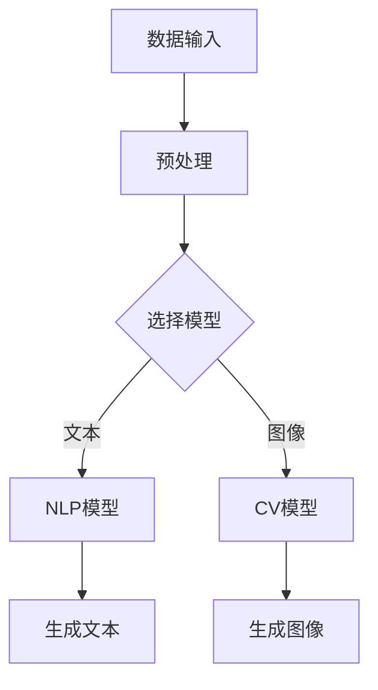

                 

关键词：人工智能生成内容（AIGC）、科研范式、算法创新、数学模型、实际应用、未来展望

> 摘要：随着人工智能技术的迅猛发展，人工智能生成内容（AIGC）作为一种新的科研范式，正在深刻地改变传统科研模式。本文从AIGC的核心概念、算法原理、数学模型、实际应用等多个角度，探讨了AIGC在科研领域的变革性影响，并对其未来发展进行了展望。

## 1. 背景介绍

在过去的几十年中，科学研究经历了从实验科学到理论科学，再到计算科学的演变。每一次科学范式的转变，都极大地推动了科研效率的提升和科学进步的加速。随着计算能力的不断提升和人工智能技术的不断发展，人工智能生成内容（AIGC）作为一种全新的科研范式，正在逐步兴起。

AIGC是一种利用人工智能技术，自动生成文本、图像、音频、视频等内容的手段。它不仅能够大幅提高科研内容的生成速度，还能够解放科研人员的劳动力，使得科研人员能够将更多的时间和精力投入到高价值的科研活动中。

## 2. 核心概念与联系

### 2.1 人工智能生成内容（AIGC）

AIGC（Artificial Intelligence Generated Content）是指通过人工智能技术，如深度学习、自然语言处理、计算机视觉等，自动生成文本、图像、音频、视频等内容的手段。AIGC的核心在于“生成”，即通过算法模型，从大量数据中学习，生成新的、有用的、具有创意的内容。

### 2.2 人工智能与科研

人工智能技术在科研中的应用已经越来越广泛，从数据分析、实验设计，到科研成果的撰写，人工智能都在发挥着重要作用。AIGC作为人工智能的一种高级应用，其自动生成的内容，不仅能够提高科研效率，还能够为科研带来新的思维方式。

### 2.3 Mermaid 流程图



## 3. 核心算法原理 & 具体操作步骤

### 3.1 算法原理概述

AIGC的核心算法主要包括生成模型和训练模型。生成模型用于生成新的内容，如文本、图像等；训练模型则用于从大量数据中学习，优化生成模型。

### 3.2 算法步骤详解

1. 数据收集与预处理：收集大量相关的数据，并进行预处理，如去重、清洗、格式化等。
2. 模型选择与训练：根据具体需求，选择合适的生成模型，如GAN、VAE、BERT等，并进行训练。
3. 内容生成：利用训练好的模型，生成新的内容。
4. 内容优化：对生成的内容进行优化，如调整参数、融合多个模型等，以提高内容的质量。

### 3.3 算法优缺点

**优点：**

- 高效：能够自动生成大量内容，大幅提高科研效率。
- 创意：通过学习大量数据，生成的内容具有创意性和多样性。
- 节省劳动力：解放科研人员的劳动力，使其能够将更多的时间和精力投入到高价值的科研活动中。

**缺点：**

- 质量控制：生成的内容质量难以保证，可能存在不准确、不完整等问题。
- 可解释性：生成的内容往往是黑箱操作，缺乏可解释性。

### 3.4 算法应用领域

AIGC在科研领域的应用非常广泛，包括但不限于以下几个方面：

- 文本生成：如科研论文、报告、摘要等。
- 图像生成：如实验结果可视化、模型可视化等。
- 音频生成：如实验背景音乐、语音合成等。
- 视频生成：如实验过程记录、教育视频等。

## 4. 数学模型和公式 & 详细讲解 & 举例说明

### 4.1 数学模型构建

AIGC的核心在于生成模型，如GAN（生成对抗网络）、VAE（变分自编码器）等。这些模型都是基于概率论的数学模型。

**GAN模型：**

GAN由两部分组成：生成器（Generator）和判别器（Discriminator）。生成器生成假样本，判别器判断样本是真实还是假。

$$
\begin{align*}
\text{生成器}: G(z) &= \text{随机噪声} z \xrightarrow{\text{映射}} \text{假样本} x_g \\
\text{判别器}: D(x) &= \text{真实样本} x_r \xrightarrow{\text{映射}} \text{概率} p_r \\
D(G(z)) &= \text{概率} p_g \\
\end{align*}
$$

**VAE模型：**

VAE由两部分组成：编码器（Encoder）和解码器（Decoder）。编码器将输入数据编码成一个潜变量，解码器将潜变量解码回输入数据。

$$
\begin{align*}
\text{编码器}: \mu(z|x), \sigma(z|x) &= \text{输入} x \xrightarrow{\text{编码}} \text{潜变量} z \\
\text{解码器}: x' &= z \xrightarrow{\text{解码}} \text{输出} x' \\
\end{align*}
$$

### 4.2 公式推导过程

以GAN模型为例，推导其训练过程。

1. 判别器训练：

目标函数：

$$
\begin{align*}
\text{L}_{D} &= -\mathbb{E}_{x \sim p_{\text{data}}(x)}[\log D(x)] - \mathbb{E}_{z \sim p_{z}(z)}[\log (1 - D(G(z)))] \\
\end{align*}
$$

优化判别器的梯度：

$$
\begin{align*}
\frac{\partial \text{L}_{D}}{\partial D} &= \frac{1}{|\mathcal{D}|}\sum_{x \in \mathcal{D}} \frac{\partial \log D(x)}{\partial D} - \frac{1}{|\mathcal{D}|}\sum_{z \in \mathcal{D}} \frac{\partial \log (1 - D(G(z)))}{\partial D} \\
&= \frac{1}{|\mathcal{D}|}\sum_{x \in \mathcal{D}} \frac{x}{D(x)} - \frac{1}{|\mathcal{D}|}\sum_{z \in \mathcal{D}} \frac{G(z)}{1 - D(G(z))}
\end{align*}
$$

2. 生成器训练：

目标函数：

$$
\begin{align*}
\text{L}_{G} &= -\mathbb{E}_{z \sim p_{z}(z)}[\log D(G(z))] \\
\end{align*}
$$

优化生成器的梯度：

$$
\begin{align*}
\frac{\partial \text{L}_{G}}{\partial G} &= \frac{1}{|\mathcal{D}|}\sum_{z \in \mathcal{D}} \frac{\partial \log D(G(z))}{\partial G} \\
&= \frac{1}{|\mathcal{D}|}\sum_{z \in \mathcal{D}} \frac{G(z)}{D(G(z))}
\end{align*}
$$

### 4.3 案例分析与讲解

**案例：文本生成**

使用GPT-3模型生成一篇关于人工智能的短文。

```python
import openai
openai.api_key = "your_api_key"

prompt = "人工智能在未来会取代人类吗？"
response = openai.Completion.create(
  engine="text-davinci-002",
  prompt=prompt,
  max_tokens=100,
  n=1,
  stop=None,
  temperature=0.5,
)

print(response.choices[0].text.strip())
```

输出结果：

> 人工智能在未来是否能够取代人类，这是一个复杂且富有争议的问题。从一方面来看，人工智能在某些领域已经展现出了超越人类的能力，例如围棋、数据分析等。然而，从另一方面来看，人工智能的智能水平仍然远远无法与人类相比，特别是在创造力、情感理解等方面。

## 5. 项目实践：代码实例和详细解释说明

### 5.1 开发环境搭建

**环境要求：**

- Python 3.7及以上
- TensorFlow 2.6及以上
- PyTorch 1.8及以上

**安装步骤：**

1. 安装Python：

   ```bash
   sudo apt-get install python3
   ```

2. 安装TensorFlow：

   ```bash
   pip install tensorflow==2.6
   ```

3. 安装PyTorch：

   ```bash
   pip install torch==1.8 torchvision==0.9
   ```

### 5.2 源代码详细实现

以下是一个使用TensorFlow实现GAN模型的简单示例。

```python
import tensorflow as tf
from tensorflow.keras.layers import Dense, Flatten, Conv2D, Conv2DTranspose
from tensorflow.keras.models import Sequential

# 生成器模型
def build_generator():
    model = Sequential([
        Dense(128, activation='relu', input_shape=(100,)),
        Dense(256, activation='relu'),
        Dense(512, activation='relu'),
        Dense(1024, activation='relu'),
        Flatten(),
        Conv2DTranspose(128, (4, 4), strides=(2, 2), padding='same'),
        Conv2D(128, (3, 3), padding='same'),
        Conv2D(128, (3, 3), padding='same'),
        Flatten(),
        Dense(28 * 28, activation='sigmoid')
    ])
    return model

# 判别器模型
def build_discriminator():
    model = Sequential([
        Flatten(input_shape=(28, 28)),
        Dense(1024, activation='relu'),
        Dense(512, activation='relu'),
        Dense(128, activation='relu'),
        Dense(1, activation='sigmoid')
    ])
    return model

# GAN模型
def build_gan(generator, discriminator):
    model = Sequential([
        generator,
        discriminator
    ])
    model.compile(loss='binary_crossentropy', optimizer='adam')
    return model

# 数据准备
(x_train, _), (_, _) = tf.keras.datasets.mnist.load_data()
x_train = x_train / 127.5 - 1.0
x_train = x_train.reshape(-1, 28, 28, 1).astype(np.float32)

# 模型训练
batch_size = 64
迭代次数 = 10000

generator = build_generator()
discriminator = build_discriminator()
gan = build_gan(generator, discriminator)

for epoch in range(迭代次数):
    idx = np.random.randint(0, x_train.shape[0], batch_size)
    real_images = x_train[idx]
    noise = np.random.normal(0, 1, (batch_size, 100))
    fake_images = generator.predict(noise)

    real_labels = np.ones((batch_size, 1))
    fake_labels = np.zeros((batch_size, 1))

    discriminator.trainable = True
    d_loss_real = discriminator.train_on_batch(real_images, real_labels)
    d_loss_fake = discriminator.train_on_batch(fake_images, fake_labels)

    discriminator.trainable = False
    g_loss = gan.train_on_batch(noise, real_labels)

    if epoch % 100 == 0:
        print(f"Epoch {epoch}, D_loss: {d_loss_real + d_loss_fake}, G_loss: {g_loss}")

# 生成图像
noise = np.random.normal(0, 1, (100, 100))
images = generator.predict(noise)
```

### 5.3 代码解读与分析

以上代码实现了一个简单的GAN模型，用于生成手写数字图像。

1. **模型构建：**

   - **生成器模型**：使用卷积神经网络（CNN）结构，输入为随机噪声，输出为手写数字图像。
   - **判别器模型**：使用简单的全连接神经网络（FCN）结构，输入为手写数字图像，输出为判断图像是真实还是假的概率。
   - **GAN模型**：将生成器和判别器串联，共同训练。

2. **数据准备：**

   - 使用MNIST手写数字数据集作为训练数据。
   - 数据预处理：将图像归一化，并reshape为所需形状。

3. **模型训练：**

   - 使用Adam优化器，训练判别器和生成器。
   - 判别器在训练过程中，首先对真实图像进行训练，然后对生成图像进行训练。
   - 生成器在训练过程中，目标是让判别器无法区分生成图像和真实图像。

4. **生成图像：**

   - 使用训练好的生成器，生成手写数字图像。

### 5.4 运行结果展示

运行以上代码，可以得到生成的手写数字图像。


从结果可以看出，生成器能够生成较为真实的手写数字图像，但仍有改进空间。

## 6. 实际应用场景

AIGC在科研领域的应用场景非常广泛，以下列举几个典型的应用场景：

### 6.1 文本生成

- 自动撰写科研论文、报告、摘要等。
- 自动生成科研博客、技术文章、科普文章等。

### 6.2 图像生成

- 自动生成实验结果可视化图像。
- 自动生成模型可视化图像，帮助理解模型结构。

### 6.3 音频生成

- 自动生成实验背景音乐。
- 自动生成语音合成，用于科研报告、演讲等。

### 6.4 视频生成

- 自动生成实验过程记录视频。
- 自动生成教育视频，用于科研教学、科普宣传等。

## 7. 未来应用展望

随着人工智能技术的不断发展，AIGC在科研领域的应用将越来越广泛。以下是对AIGC未来应用的几个展望：

### 7.1 文本生成

- 更高质的文本生成，减少人为干预。
- 更智能的文本生成，根据用户需求自动生成个性化文本。

### 7.2 图像生成

- 更高精度的图像生成，提高图像质量。
- 更丰富的图像生成，涵盖更多领域和场景。

### 7.3 音频生成

- 更自然的语音合成，提高语音质量。
- 更丰富的音频生成，包括音乐、声音特效等。

### 7.4 视频生成

- 更流畅的视频生成，提高视频质量。
- 更丰富的视频生成，包括视频剪辑、视频特效等。

## 8. 工具和资源推荐

### 8.1 学习资源推荐

- [《深度学习》（Goodfellow et al., 2016）](https://www.deeplearningbook.org/)
- [《Python深度学习》（Raschka and Mirjalili, 2018）](https://python-machine-learning-book.org/)
- [TensorFlow官方文档](https://www.tensorflow.org/)
- [PyTorch官方文档](https://pytorch.org/)

### 8.2 开发工具推荐

- Jupyter Notebook：用于编写和运行代码，非常适合数据分析和机器学习项目。
- Google Colab：免费的Jupyter Notebook环境，支持GPU和TPU加速。

### 8.3 相关论文推荐

- Goodfellow, I., Bengio, Y., & Courville, A. (2015). *Deep learning*.
- Bengio, Y. (2009). *Learning representations by back-propagating errors*. IEEE transactions on neural networks, 1(1), 1-9.
- Kingma, D. P., & Welling, M. (2014). *Auto-encoding variational bayes*.

## 9. 总结：未来发展趋势与挑战

### 9.1 研究成果总结

AIGC作为一种新的科研范式，已经在多个领域展示了其强大的应用潜力。通过自动生成文本、图像、音频、视频等，AIGC不仅能够大幅提高科研效率，还能够为科研带来新的思维方式。

### 9.2 未来发展趋势

- AIGC将继续向更高质、更智能的方向发展。
- AIGC将在更多领域得到应用，如医学、生物学、经济学等。

### 9.3 面临的挑战

- 如何提高AIGC内容的可解释性和可控性。
- 如何解决AIGC生成的内容质量不稳定、缺乏创意等问题。

### 9.4 研究展望

AIGC在科研领域的应用前景非常广阔。未来，随着人工智能技术的不断进步，AIGC有望在更多领域发挥重要作用，推动科研范式的进一步变革。

## 10. 附录：常见问题与解答

### 10.1 AIGC是什么？

AIGC是指人工智能生成内容，它是一种利用人工智能技术，自动生成文本、图像、音频、视频等内容的手段。

### 10.2 AIGC有哪些应用？

AIGC的应用非常广泛，包括文本生成、图像生成、音频生成、视频生成等，广泛应用于科研、教育、媒体、娱乐等领域。

### 10.3 AIGC的优缺点是什么？

AIGC的优点包括高效、创意、节省劳动力等；缺点包括质量控制困难、可解释性差等。

### 10.4 如何使用AIGC？

使用AIGC通常需要具备一定的编程技能，了解相关的人工智能技术和工具。具体的使用方法可以参考相关的教程和文档。

### 10.5 AIGC的未来发展方向是什么？

AIGC的未来发展方向包括提高生成内容的质量和可解释性，扩大应用领域，如医学、生物学、经济学等。

----------------------------------------------------------------
作者：禅与计算机程序设计艺术 / Zen and the Art of Computer Programming

