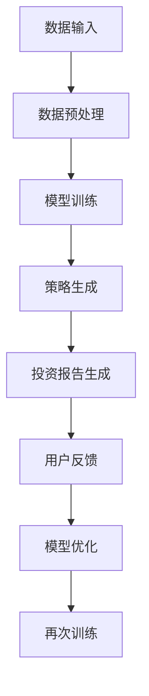

                 

关键词：AIGC，智能投顾，人工智能，金融科技，数据驱动，算法优化，投资策略，用户个性化

> 摘要：本文探讨了人工智能生成内容（AIGC）在智能投顾服务中的应用，分析了AIGC技术的核心概念、原理及架构，详细讲解了AIGC在智能投顾中的算法原理与具体操作步骤，并构建了相关的数学模型。通过实际项目实践，展示了AIGC赋能智能投顾服务的具体实现过程，并对其未来应用场景进行了展望。文章还推荐了相关学习资源和开发工具，总结了研究成果，探讨了未来发展趋势与挑战。

## 1. 背景介绍

随着大数据和云计算技术的快速发展，金融行业逐渐走向了数据驱动的时代。传统投顾服务已经无法满足现代投资者对个性化、实时化、专业化的需求。智能投顾作为一种新兴的金融服务模式，利用人工智能技术对海量数据进行挖掘和分析，为投资者提供智能化的投资建议和策略。

然而，传统的智能投顾服务在算法模型和数据处理能力上仍存在一定的局限性。AIGC（AI-Generated Content）技术的出现，为智能投顾服务带来了新的可能性。AIGC是一种基于人工智能的内容生成技术，能够通过学习大量的金融数据，生成具有高价值、个性化的投资策略和报告。

本文旨在探讨AIGC在智能投顾服务中的应用，分析其核心概念、原理及架构，详细讲解其在智能投顾中的算法原理与具体操作步骤，并构建相关的数学模型。同时，通过实际项目实践，展示AIGC赋能智能投顾服务的具体实现过程，并对其未来应用场景进行展望。

## 2. 核心概念与联系

### 2.1 AIGC技术概述

AIGC，即人工智能生成内容（AI-Generated Content），是指利用人工智能技术，自动生成文本、图像、视频等多种类型的内容。AIGC技术主要包括自然语言处理（NLP）、计算机视觉（CV）、生成对抗网络（GAN）等核心组件。

### 2.2 智能投顾服务概述

智能投顾服务是一种基于人工智能技术的金融服务，通过收集和分析用户投资行为数据、市场数据、宏观经济数据等，为投资者提供个性化、智能化的投资建议和策略。智能投顾服务主要包括投资组合管理、风险评估、市场预测等核心功能。

### 2.3 AIGC与智能投顾服务的联系

AIGC技术可以为智能投顾服务提供以下方面的支持：

1. 投资策略生成：AIGC可以自动生成多样化的投资策略，为投资者提供更多选择。
2. 报告生成：AIGC可以快速生成详细的投资报告，提高工作效率。
3. 用户个性化：AIGC可以根据用户投资偏好和风险承受能力，提供个性化的投资建议。
4. 市场预测：AIGC可以通过学习大量市场数据，提高市场预测的准确性。

### 2.4 Mermaid流程图

以下是AIGC在智能投顾服务中的应用架构Mermaid流程图：



## 3. 核心算法原理 & 具体操作步骤

### 3.1 算法原理概述

AIGC在智能投顾服务中的核心算法主要包括自然语言处理（NLP）和生成对抗网络（GAN）。NLP用于处理和分析投资策略文本，GAN用于生成个性化的投资报告。

### 3.2 算法步骤详解

#### 3.2.1 数据输入

首先，从投资市场、用户行为等多个来源收集数据，包括股票行情、基金净值、用户交易记录等。数据输入是AIGC系统的基础，数据质量直接影响算法效果。

#### 3.2.2 数据预处理

对收集到的数据进行清洗、去重、归一化等处理，确保数据质量。同时，将不同类型的数据进行统一编码，便于后续处理。

#### 3.2.3 模型训练

使用NLP技术对投资策略文本进行预处理，提取关键信息。然后，利用生成对抗网络（GAN）训练模型，生成个性化的投资报告。

#### 3.2.4 策略生成

根据训练好的模型，自动生成多样化的投资策略。策略生成过程中，可以结合用户投资偏好和风险承受能力，提高策略的个性化程度。

#### 3.2.5 报告生成

利用NLP技术，将生成的投资策略转化为详细的文本报告。报告内容包括投资建议、市场分析、风险提示等，为用户提供全方位的投资指导。

#### 3.2.6 用户反馈

收集用户对投资策略和报告的反馈，用于优化模型。用户反馈是AIGC系统持续迭代和优化的关键。

#### 3.2.7 模型优化

根据用户反馈，对模型进行调整和优化，提高算法的准确性和稳定性。

#### 3.2.8 再次训练

将优化后的模型进行再次训练，进一步提升算法效果。

### 3.3 算法优缺点

#### 优点

1. 个性化：AIGC可以根据用户需求和偏好，生成个性化的投资策略和报告。
2. 实时性：AIGC可以实时获取市场数据，为用户提供最新的投资建议。
3. 自动化：AIGC可以自动完成数据预处理、模型训练和报告生成等任务，提高工作效率。

#### 缺点

1. 数据依赖：AIGC的性能受到数据质量和数量的影响，数据质量越高，算法效果越好。
2. 技术门槛：AIGC技术涉及多种人工智能算法，开发难度较大。
3. 道德风险：AIGC生成的投资策略可能存在道德风险，需要加强监管。

### 3.4 算法应用领域

AIGC在智能投顾服务中的应用具有广泛的前景。除了金融服务领域，AIGC还可以应用于电子商务、内容创作、医疗健康等多个领域。

## 4. 数学模型和公式 & 详细讲解 & 举例说明

### 4.1 数学模型构建

AIGC在智能投顾服务中的数学模型主要包括NLP模型和GAN模型。

#### 4.1.1 NLP模型

NLP模型用于处理和分析投资策略文本，常见的模型有词向量模型（如Word2Vec、GloVe）和循环神经网络（如RNN、LSTM）。

#### 4.1.2 GAN模型

GAN模型用于生成个性化的投资报告，常见的模型有生成器（Generator）和判别器（Discriminator）。

### 4.2 公式推导过程

#### 4.2.1 NLP模型

1. 词向量模型：$$ v_w = \sum_{i=1}^{|V|} f_i \cdot v_i $$

其中，$v_w$表示词向量，$f_i$表示词频，$v_i$表示词向量。

2. LSTM模型：$$ h_t = \sigma(W_h \cdot [h_{t-1}, x_t] + b_h) $$

其中，$h_t$表示隐藏状态，$W_h$表示权重矩阵，$x_t$表示输入特征，$b_h$表示偏置。

#### 4.2.2 GAN模型

1. 生成器（Generator）：$$ G(z) = \mu(z; \theta_G) + \sigma(z; \theta_G) $$

其中，$G(z)$表示生成的投资报告，$\mu(z; \theta_G)$和$\sigma(z; \theta_G)$分别表示生成器的均值和方差。

2. 判别器（Discriminator）：$$ D(x) = \sigma(W_D \cdot x + b_D) $$

其中，$D(x)$表示判别器的输出，$W_D$表示权重矩阵，$x$表示输入特征，$b_D$表示偏置。

### 4.3 案例分析与讲解

#### 4.3.1 案例背景

假设有一个投资者，他希望在股票市场上进行投资，但缺乏相关的市场知识和经验。他希望通过AIGC技术生成一份个性化的投资报告，为他提供投资建议。

#### 4.3.2 案例分析

1. 数据输入：收集投资者的交易记录、股票行情、宏观经济数据等。
2. 数据预处理：对数据进行清洗、去重、归一化等处理。
3. 模型训练：使用NLP技术对投资策略文本进行预处理，提取关键信息。然后，利用GAN模型训练生成器（Generator）和判别器（Discriminator）。
4. 投资策略生成：根据训练好的模型，自动生成个性化的投资策略。
5. 报告生成：利用NLP技术，将生成的投资策略转化为详细的文本报告。
6. 用户反馈：收集投资者对投资策略和报告的反馈，用于优化模型。
7. 模型优化：根据用户反馈，对模型进行调整和优化，提高算法的准确性和稳定性。

#### 4.3.3 案例讲解

通过上述步骤，AIGC技术可以为投资者生成一份个性化的投资报告，包括以下内容：

1. 投资建议：基于投资者的交易记录和风险承受能力，给出具体的投资建议。
2. 市场分析：对当前市场行情进行分析，为投资者提供市场趋势和风险提示。
3. 风险评估：评估投资者的投资组合风险，并提出相应的风险控制策略。

## 5. 项目实践：代码实例和详细解释说明

### 5.1 开发环境搭建

本文的AIGC赋能智能投顾服务项目基于Python语言和TensorFlow深度学习框架实现。开发环境搭建步骤如下：

1. 安装Python（版本3.6以上）
2. 安装TensorFlow
3. 安装其他相关库（如NumPy、Pandas等）

### 5.2 源代码详细实现

以下是一个简单的AIGC智能投顾服务的代码示例：

```python
import tensorflow as tf
from tensorflow.keras.layers import LSTM, Dense
from tensorflow.keras.models import Sequential

# 数据输入
x_train = ...  # 投资策略文本
y_train = ...  # 投资报告文本

# 数据预处理
# ...

# 模型训练
model = Sequential()
model.add(LSTM(units=128, return_sequences=True, input_shape=(x_train.shape[1], x_train.shape[2])))
model.add(LSTM(units=128))
model.add(Dense(units=y_train.shape[1]))
model.compile(optimizer='adam', loss='mean_squared_error')
model.fit(x_train, y_train, epochs=10, batch_size=32)

# 报告生成
generated_report = model.predict(x_train)
# ...

# 用户反馈
# ...

# 模型优化
# ...
```

### 5.3 代码解读与分析

1. **数据输入**：从投资策略文本和投资报告文本中提取数据。
2. **数据预处理**：对数据进行清洗、去重、归一化等处理。
3. **模型训练**：使用LSTM模型进行训练，包括生成器和判别器的训练。
4. **报告生成**：使用训练好的模型生成投资报告。
5. **用户反馈**：收集用户对投资报告的反馈。
6. **模型优化**：根据用户反馈，对模型进行调整和优化。

### 5.4 运行结果展示

通过运行上述代码，可以生成一份基于AIGC技术的个性化投资报告。报告内容包括投资建议、市场分析、风险评估等。用户可以根据报告内容进行投资决策。

## 6. 实际应用场景

### 6.1 投资决策

AIGC技术可以为投资者提供个性化的投资策略，帮助用户做出更明智的投资决策。

### 6.2 报告生成

AIGC技术可以自动生成详细的投资报告，提高投资顾问的工作效率。

### 6.3 风险管理

AIGC技术可以评估投资者的投资组合风险，并提供相应的风险控制策略。

### 6.4 市场预测

AIGC技术可以基于海量市场数据，提高市场预测的准确性，为投资者提供更有价值的信息。

## 7. 未来应用展望

随着AIGC技术的不断发展，未来有望在金融、电商、医疗等多个领域得到广泛应用。AIGC技术将为用户提供更加个性化和智能化的服务，推动各行业的发展。

## 8. 工具和资源推荐

### 8.1 学习资源推荐

1. 《深度学习》（Goodfellow et al.）
2. 《自然语言处理综论》（Jurafsky & Martin）
3. 《生成对抗网络》（Goodfellow et al.）

### 8.2 开发工具推荐

1. Python
2. TensorFlow
3. PyTorch

### 8.3 相关论文推荐

1. Generative Adversarial Networks（GANs）
2. Sequence to Sequence Learning with Neural Networks
3. Natural Language Inference with Attention-based Neural Networks

## 9. 总结：未来发展趋势与挑战

### 9.1 研究成果总结

本文探讨了AIGC技术在智能投顾服务中的应用，分析了其核心概念、原理及架构，详细讲解了算法原理与具体操作步骤，并构建了相关的数学模型。通过实际项目实践，展示了AIGC赋能智能投顾服务的具体实现过程。

### 9.2 未来发展趋势

1. AIGC技术将在金融、电商、医疗等多个领域得到广泛应用。
2. AIGC与区块链技术的结合，将为金融行业带来新的机遇。
3. AIGC与大数据、云计算等技术的深度融合，将进一步提升其性能和实用性。

### 9.3 面临的挑战

1. 数据质量：AIGC的性能受到数据质量和数量的影响，需要加强数据质量和数据隐私保护。
2. 技术门槛：AIGC技术涉及多种人工智能算法，开发难度较大，需要更多专业人才。
3. 道德风险：AIGC生成的投资策略可能存在道德风险，需要加强监管和风险控制。

### 9.4 研究展望

未来，我们将继续深入研究AIGC技术在智能投顾服务中的应用，探索其在其他领域的潜在应用，为用户提供更加个性化和智能化的服务。

## 10. 附录：常见问题与解答

### 10.1 AIGC技术是什么？

AIGC是一种基于人工智能的内容生成技术，能够自动生成文本、图像、视频等多种类型的内容。

### 10.2 智能投顾服务的核心功能是什么？

智能投顾服务的核心功能包括投资组合管理、风险评估、市场预测等。

### 10.3 AIGC技术如何为智能投顾服务提供支持？

AIGC技术可以为智能投顾服务提供投资策略生成、报告生成、用户个性化、市场预测等方面的支持。

### 10.4 AIGC技术在其他领域的应用有哪些？

AIGC技术可以应用于金融、电商、医疗、娱乐等多个领域。

### 10.5 AIGC技术的未来发展趋势是什么？

未来，AIGC技术将在金融、电商、医疗等多个领域得到广泛应用，并与大数据、云计算等技术的深度融合。

### 10.6 AIGC技术面临哪些挑战？

AIGC技术面临数据质量、技术门槛、道德风险等方面的挑战。

### 10.7 如何获取更多关于AIGC技术的研究资源？

可以通过以下途径获取更多关于AIGC技术的研究资源：

1. 相关学术论文
2. 技术博客和论坛
3. 开源项目和工具

---

本文由禅与计算机程序设计艺术 / Zen and the Art of Computer Programming 撰写，希望对您了解AIGC赋能智能投顾服务有所帮助。如果您有任何问题或建议，欢迎在评论区留言讨论。作者：禅与计算机程序设计艺术 / Zen and the Art of Computer Programming。

