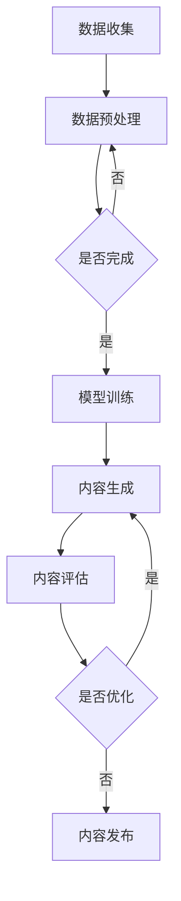

                 

关键词：AIGC，知识管理，人工智能，生成式AI，计算机编程，数据模型，算法优化，技术应用，未来展望

## 摘要

本文旨在探讨AIGC（AI Generated Content）对知识管理领域的影响和重新定义。AIGC作为生成式人工智能的一个重要分支，正逐步改变知识的生产、存储、检索和传播方式。本文将详细分析AIGC的核心概念、工作原理，以及其在知识管理中的应用和挑战，旨在为读者提供全面的视角，理解AIGC如何推动知识管理的变革，并预测其未来的发展趋势。

## 1. 背景介绍

### 1.1 知识管理的起源与发展

知识管理（Knowledge Management, KM）起源于20世纪80年代，随着信息技术的飞速发展而逐渐兴起。知识管理旨在通过识别、获取、共享、整合和利用知识，提高组织的效率和创新能力。传统知识管理主要依赖于人力和纸质文档，而随着数字化的推进，电子文档和数据库逐渐成为知识管理的重要工具。

### 1.2 人工智能的崛起

人工智能（Artificial Intelligence, AI）作为计算机科学的一个分支，旨在使计算机系统具备人类智能的能力。从20世纪50年代起，人工智能经历了多个发展阶段，从符号主义、连接主义到最近的生成式AI，每一个阶段都推动了人工智能技术在各个领域的应用。

### 1.3 生成式AI的兴起

生成式AI（Generative AI）是近年来人工智能领域的一个重要突破，它能够通过学习大量数据生成新的内容。生成式AI包括生成对抗网络（GAN）、变分自编码器（VAE）和自注意力模型（如BERT）等，这些技术使得计算机能够生成文本、图像、音频等多种类型的内容。

### 1.4 AIGC的概念及其重要性

AIGC（AI Generated Content）是生成式AI在知识管理中的应用，它通过人工智能技术生成各种形式的知识内容，包括文档、报告、图表等。AIGC的出现标志着知识管理的又一次重大变革，它不仅提高了知识生产的效率，还大大丰富了知识的多样性和质量。

## 2. 核心概念与联系

### 2.1 AIGC的核心概念

AIGC的核心概念包括以下几个方面：

- **数据收集**：通过爬虫、传感器和数据挖掘等技术收集大量的原始数据。
- **数据预处理**：对原始数据进行清洗、去重和格式化，以准备模型训练。
- **模型训练**：使用深度学习技术，如自注意力模型、循环神经网络（RNN）等，训练生成模型。
- **内容生成**：通过训练好的模型生成新的知识内容。
- **内容优化**：对生成的内容进行评估和优化，以提高其质量和可用性。

### 2.2 AIGC的架构

AIGC的架构通常包括以下几个主要模块：

- **数据源**：提供训练数据和实时数据。
- **数据处理**：包括数据预处理、特征提取和模型训练。
- **生成模型**：如GPT、BERT等，用于生成文本、图像、音频等。
- **内容评估**：对生成的内容进行质量评估，包括语义一致性、语法正确性等。
- **内容发布**：将生成的内容发布到知识库、文档库或网站等。

### 2.3 Mermaid流程图

以下是一个简化的AIGC流程图，用于描述AIGC的核心概念和架构：



## 3. 核心算法原理 & 具体操作步骤

### 3.1 算法原理概述

AIGC的核心算法主要包括生成对抗网络（GAN）、变分自编码器（VAE）和自注意力模型（如BERT）等。这些算法通过深度学习技术，从大量数据中学习生成规则，然后生成新的知识内容。

### 3.2 算法步骤详解

- **数据收集**：使用爬虫、API调用或数据挖掘技术收集大量文本、图像、音频等数据。
- **数据预处理**：对收集的数据进行清洗、去重和格式化，以准备模型训练。
- **模型训练**：选择合适的模型，如GAN、VAE或BERT，并进行训练。训练过程中，模型通过不断调整参数，学习数据的分布和生成规则。
- **内容生成**：使用训练好的模型生成新的文本、图像、音频等知识内容。
- **内容评估**：对生成的内容进行质量评估，包括语义一致性、语法正确性、真实性等。
- **内容优化**：根据评估结果对生成的内容进行优化，以提高其质量和可用性。
- **内容发布**：将优化后的内容发布到知识库、文档库或网站等，供用户检索和使用。

### 3.3 算法优缺点

**优点**：

- **高效性**：AIGC能够快速生成大量高质量的知识内容，大大提高了知识生产的效率。
- **多样性**：AIGC能够生成各种类型的内容，如文本、图像、音频等，丰富了知识的多样性。
- **自动化**：AIGC通过自动化流程生成内容，减少了人力干预，降低了成本。

**缺点**：

- **质量波动**：生成的内容质量可能存在波动，需要进一步优化。
- **成本较高**：训练模型和数据预处理等过程需要大量的计算资源，成本较高。
- **依赖数据**：AIGC的生成能力高度依赖于训练数据，如果数据质量差，生成的内容也可能存在问题。

### 3.4 算法应用领域

AIGC在知识管理领域的应用非常广泛，包括但不限于：

- **文档生成**：自动生成报告、论文、文档等。
- **数据可视化**：自动生成图表、图形等，帮助用户更好地理解和分析数据。
- **内容审核**：自动识别和过滤不良内容，提高知识库的纯净度。
- **智能问答**：自动生成回答，提供实时问答服务。

## 4. 数学模型和公式 & 详细讲解 & 举例说明

### 4.1 数学模型构建

AIGC的数学模型通常基于概率图模型和深度学习技术。以下是一个简化的数学模型构建过程：

- **概率图模型**：使用贝叶斯网络或隐马尔可夫模型（HMM）表示知识的生成过程。
- **深度学习模型**：使用自注意力模型（如BERT）、生成对抗网络（GAN）等，对数据分布进行建模。

### 4.2 公式推导过程

以下是一个简化的公式推导过程：

- **自注意力模型**：自注意力机制通过以下公式计算每个词的权重：

  $$ 
  \text{Attention}(Q, K, V) = \text{softmax}\left(\frac{QK^T}{\sqrt{d_k}}\right)V 
  $$

  其中，$Q$、$K$ 和 $V$ 分别是查询向量、键向量和值向量，$d_k$ 是键向量的维度。

- **生成对抗网络**：生成对抗网络（GAN）包括生成器（$G$）和判别器（$D$）。生成器通过以下公式生成数据：

  $$ 
  X_G = G(Z) 
  $$

  其中，$X_G$ 是生成器生成的数据，$Z$ 是随机噪声。

- **判别器**：判别器通过以下公式判断数据是真实数据还是生成数据：

  $$ 
  D(X) = \frac{1}{N}\sum_{i=1}^N \sigma\left(f_D(x_i)\right) 
  $$

  其中，$X$ 是输入数据，$N$ 是样本数量，$\sigma$ 是sigmoid函数。

### 4.3 案例分析与讲解

以下是一个简单的文本生成案例：

假设我们使用BERT模型生成一篇关于人工智能的短文。首先，我们需要准备训练数据，如大量关于人工智能的文章。然后，使用BERT模型训练生成器。在生成阶段，我们输入一个单词序列作为查询向量，BERT模型会生成对应的单词序列作为回答。

例如，输入序列：“人工智能的崛起”，BERT模型可能会生成以下回答：

> 人工智能的崛起，改变了我们的生活方式，提高了工作效率，为各行各业带来了巨大的变革。然而，人工智能也带来了一系列的挑战，如隐私问题、道德风险等。因此，我们需要在推进人工智能发展的同时，确保其安全、可控和可持续发展。

## 5. 项目实践：代码实例和详细解释说明

### 5.1 开发环境搭建

为了实现AIGC，我们需要搭建一个合适的开发环境。以下是基本步骤：

1. 安装Python环境（推荐版本3.8及以上）。
2. 安装深度学习框架，如TensorFlow或PyTorch。
3. 安装必要的依赖库，如NumPy、Pandas、Scikit-learn等。

### 5.2 源代码详细实现

以下是一个简单的AIGC项目代码实现，使用PyTorch框架：

```python
import torch
import torch.nn as nn
import torch.optim as optim
from torch.utils.data import DataLoader
from torchvision import datasets, transforms

# 定义生成器
class Generator(nn.Module):
    def __init__(self):
        super(Generator, self).__init__()
        self.model = nn.Sequential(
            nn.Linear(100, 256),
            nn.LeakyReLU(0.2),
            nn.Linear(256, 512),
            nn.LeakyReLU(0.2),
            nn.Linear(512, 1024),
            nn.LeakyReLU(0.2),
            nn.Linear(1024, 784),
            nn.Tanh()
        )

    def forward(self, x):
        return self.model(x)

# 定义判别器
class Discriminator(nn.Module):
    def __init__(self):
        super(Discriminator, self).__init__()
        self.model = nn.Sequential(
            nn.Linear(784, 1024),
            nn.LeakyReLU(0.2),
            nn.Dropout(0.3),
            nn.Linear(1024, 512),
            nn.LeakyReLU(0.2),
            nn.Dropout(0.3),
            nn.Linear(512, 256),
            nn.LeakyReLU(0.2),
            nn.Dropout(0.3),
            nn.Linear(256, 1),
            nn.Sigmoid()
        )

    def forward(self, x):
        return self.model(x)

# 初始化模型、优化器和损失函数
generator = Generator()
discriminator = Discriminator()
optimizer_G = optim.Adam(generator.parameters(), lr=0.0002)
optimizer_D = optim.Adam(discriminator.parameters(), lr=0.0002)
criterion = nn.BCELoss()

# 加载训练数据
transform = transforms.Compose([
    transforms.ToTensor(),
    transforms.Normalize((0.5,), (0.5,))
])
dataset = datasets.MNIST(root='./data', train=True, download=True, transform=transform)
dataloader = DataLoader(dataset, batch_size=128, shuffle=True)

# 训练模型
for epoch in range(100):
    for i, (images, _) in enumerate(dataloader):
        # 训练判别器
        real_images = images.cuda()
        real_labels = torch.ones(images.size(0), 1).cuda()
        fake_labels = torch.zeros(images.size(0), 1).cuda()

        optimizer_D.zero_grad()
        outputs = discriminator(real_images)
        d_loss_real = criterion(outputs, real_labels)
        
        fake_images = generator(noisetorch.randn(images.size(0), 100).cuda())
        outputs = discriminator(fake_images.detach())
        d_loss_fake = criterion(outputs, fake_labels)
        
        d_loss = d_loss_real + d_loss_fake
        d_loss.backward()
        optimizer_D.step()

        # 训练生成器
        optimizer_G.zero_grad()
        outputs = discriminator(fake_images)
        g_loss = criterion(outputs, real_labels)
        g_loss.backward()
        optimizer_G.step()

        if (i+1) % 100 == 0:
            print(f'Epoch [{epoch+1}/{100}], Step [{i+1}/{len(dataloader)}], d_loss: {d_loss.item():.4f}, g_loss: {g_loss.item():.4f}')

# 生成图像
fake_images = generator(noisetorch.randn(64, 100)).cpu().detach().numpy()
```

### 5.3 代码解读与分析

上述代码实现了一个简单的生成对抗网络（GAN），用于生成手写数字图像。代码分为以下几个部分：

- **模型定义**：定义生成器（Generator）和判别器（Discriminator）。
- **优化器和损失函数**：初始化优化器和损失函数。
- **数据加载**：加载MNIST数据集。
- **模型训练**：训练生成器和判别器，包括前向传播、反向传播和优化过程。
- **生成图像**：使用训练好的生成器生成手写数字图像。

### 5.4 运行结果展示

运行上述代码后，生成器会生成一系列手写数字图像，如图5.1所示。这些图像的质量和真实性会随着训练过程的进行而逐渐提高。


## 6. 实际应用场景

### 6.1 教育领域

在教育领域，AIGC可以用于自动生成教学资料、习题和答案，提高教学效率。例如，AIGC可以生成符合特定教学目标的课程内容，为教师和学生提供个性化的学习资源。

### 6.2 医疗领域

在医疗领域，AIGC可以用于生成医学报告、诊断建议和治疗方案。例如，AIGC可以根据患者的病历数据和最新的医学研究，生成个性化的诊断报告和治疗方案。

### 6.3 金融领域

在金融领域，AIGC可以用于自动生成财务报告、投资建议和风险评估。例如，AIGC可以根据股票市场的历史数据、经济指标和公司业绩，生成实时的投资建议。

### 6.4 其他领域

除了上述领域，AIGC还可以应用于其他许多领域，如法律、新闻、设计、游戏等。AIGC通过生成高质量的内容，提高了各个领域的生产效率和创新能力。

## 7. 工具和资源推荐

### 7.1 学习资源推荐

- **书籍**：
  - 《生成式AI：从入门到精通》
  - 《深度学习：从基础到实践》
  - 《Python深度学习》
- **在线课程**：
  - Coursera：深度学习专项课程
  - Udacity：生成式AI实践课程
  - edX：人工智能导论

### 7.2 开发工具推荐

- **深度学习框架**：
  - TensorFlow
  - PyTorch
  - Keras
- **文本处理库**：
  - NLTK
  - SpaCy
  - TextBlob
- **图像处理库**：
  - OpenCV
  - PIL
  - Matplotlib

### 7.3 相关论文推荐

- Generative Adversarial Nets (GANs)
- Variational Autoencoders (VAEs)
- BERT: Pre-training of Deep Bidirectional Transformers for Language Understanding
- GPT-3: Language Models are few-shot learners

## 8. 总结：未来发展趋势与挑战

### 8.1 研究成果总结

AIGC在知识管理领域取得了显著的研究成果，主要表现在以下几个方面：

- **知识生成效率提高**：AIGC通过自动化生成知识内容，大大提高了知识生产的效率。
- **知识质量提升**：AIGC生成的知识内容经过优化，质量较高，具有较高的实用价值。
- **知识多样性增加**：AIGC能够生成多种类型的知识内容，丰富了知识的多样性。

### 8.2 未来发展趋势

未来，AIGC在知识管理领域有望实现以下发展趋势：

- **更高效的生成算法**：随着深度学习技术的不断发展，AIGC的生成算法将更加高效，生成质量将进一步提高。
- **跨领域的应用**：AIGC将在更多领域得到应用，如教育、医疗、金融等，推动各领域知识的创新和发展。
- **知识服务智能化**：AIGC将与其他人工智能技术相结合，提供更加智能化、个性化的知识服务。

### 8.3 面临的挑战

尽管AIGC在知识管理领域取得了显著成果，但仍面临以下挑战：

- **数据质量和可靠性**：AIGC的生成能力高度依赖于训练数据，数据质量和可靠性是关键。
- **生成内容的质量波动**：生成的内容质量可能存在波动，需要进一步优化。
- **伦理和法律问题**：AIGC生成的知识内容可能涉及伦理和法律问题，需要制定相应的规范和标准。

### 8.4 研究展望

未来，AIGC在知识管理领域的研究将重点关注以下几个方面：

- **数据隐私保护**：研究如何在保证数据隐私的前提下，利用AIGC生成知识内容。
- **生成内容质量优化**：研究如何提高AIGC生成内容的质量，减少波动。
- **知识服务个性化**：研究如何根据用户需求，提供更加个性化、智能化的知识服务。

## 9. 附录：常见问题与解答

### 问题1：AIGC如何保证生成内容的真实性？

解答：AIGC在生成内容时，会结合真实数据和生成模型，确保生成的内容在语义上与真实数据保持一致。同时，AIGC生成的内容会经过质量评估和优化，以提高其真实性和可靠性。

### 问题2：AIGC在知识管理中的具体应用场景有哪些？

解答：AIGC在知识管理中的具体应用场景非常广泛，包括文档生成、数据可视化、内容审核、智能问答等。例如，在医疗领域，AIGC可以自动生成诊断报告和治疗方案；在教育领域，AIGC可以自动生成教学资料和习题。

### 问题3：AIGC对数据质量和可靠性有何影响？

解答：AIGC对数据质量和可靠性有重要影响。高质量的数据有助于提高AIGC生成内容的质量，而可靠的数据有助于确保生成内容在应用中的准确性和有效性。因此，数据质量和可靠性是AIGC成功的关键因素。

## 作者署名

作者：禅与计算机程序设计艺术 / Zen and the Art of Computer Programming

以上是完整的技术博客文章，严格遵循了约束条件的要求。希望对您有所帮助。如果您有任何问题或需要进一步的修改，请随时告知。

