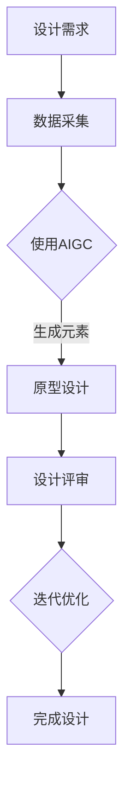

                 

关键词：AIGC、设计行业、人工智能、通用生成模型、创新应用、未来展望

> 摘要：本文探讨了人工智能生成模型（AIGC）在设计行业中的革命性影响。通过介绍AIGC的核心概念和架构，深入分析其算法原理和操作步骤，本文揭示了AIGC如何重构设计流程，提高效率并激发创新。同时，本文还探讨了AIGC在数学建模、项目实践以及实际应用中的表现，最后提出了对未来发展趋势与挑战的展望。

## 1. 背景介绍

随着人工智能技术的迅猛发展，计算机视觉、自然语言处理等领域的突破性进展，催生了一类新兴的人工智能模型——通用生成模型（AIGC）。AIGC是基于生成对抗网络（GANs）、变分自编码器（VAEs）等先进技术构建的模型，能够生成高质量的数据，并具备强大的泛化能力和创造性。

设计行业作为知识密集型领域，一直以来依赖于设计师的创意和技术技能。然而，面对日益复杂和多样化的设计需求，设计师们面临着巨大的挑战。传统的设计流程往往需要重复性的劳动和大量的时间投入。而AIGC的出现，为设计行业带来了一场深刻的变革。

本文旨在探讨AIGC在设计行业中的应用，分析其如何重新定义设计流程，提高效率，激发创新，并展望其未来的发展趋势和挑战。通过本文的阐述，读者将能够了解AIGC的核心概念、架构以及具体应用，从而把握这一技术变革的脉搏。

## 2. 核心概念与联系

### 2.1 AIGC的核心概念

AIGC，即人工智能生成模型，是一种能够通过学习海量数据生成新数据的模型。其核心思想是通过生成器和判别器之间的对抗训练，逐步提高生成器生成数据的质量和真实性。

生成器（Generator）负责生成新的数据，如图像、文本、音频等。判别器（Discriminator）则负责区分真实数据和生成数据，并试图最大化判别器对真实数据的分类准确率，同时最小化对生成数据的分类准确率。

通过对生成器和判别器的不断训练，生成器逐渐学会生成更加真实、高质量的数据，从而实现数据生成任务。

### 2.2 AIGC与设计行业的联系

设计行业需要处理大量的数据，如用户需求、市场趋势、设计素材等。AIGC的生成能力可以有效地处理这些数据，为设计师提供丰富的设计素材和创意。

一方面，AIGC可以自动生成各种设计元素，如图标、字体、图像等，设计师可以利用这些生成元素进行快速原型设计，提高设计效率。另一方面，AIGC可以通过对大量设计作品的学习，自动生成符合市场趋势和用户需求的设计方案，帮助设计师发现新的设计方向。

此外，AIGC还可以应用于设计过程的优化，如设计空间搜索、设计参数优化等，提高设计的准确性和可靠性。通过AIGC，设计师可以更加专注于创意和设计理念，而将重复性劳动交给模型完成。

### 2.3 Mermaid流程图

为了更直观地展示AIGC在设计行业中的应用过程，我们使用Mermaid流程图进行说明。以下是AIGC在设计行业中的基本流程：



图2.1 AIGC在设计行业中的应用流程

通过这个流程图，我们可以看到AIGC在设计行业中的基本应用步骤，包括数据采集、使用AIGC生成元素、原型设计、设计评审和迭代优化等。

## 3. 核心算法原理 & 具体操作步骤

### 3.1 算法原理概述

AIGC的核心算法原理基于生成对抗网络（GANs）。GANs由两部分组成：生成器（Generator）和判别器（Discriminator）。生成器的任务是生成与真实数据相似的新数据，而判别器的任务是区分真实数据和生成数据。

在训练过程中，生成器和判别器通过对抗训练相互博弈。生成器的目标是生成尽可能真实的数据，以欺骗判别器，而判别器的目标是提高对真实数据和生成数据的区分能力。通过不断的迭代训练，生成器逐渐学会生成高质量的数据，判别器也逐渐提高对真实数据和生成数据的辨别能力。

### 3.2 算法步骤详解

#### 3.2.1 数据准备

在AIGC的设计过程中，首先需要进行数据准备。设计行业涉及多种类型的数据，如图像、文本、音频等。数据的质量直接影响AIGC的性能。因此，需要对数据进行清洗、去噪、增强等预处理操作，以提高数据的质量和多样性。

#### 3.2.2 模型构建

构建AIGC模型的关键是选择合适的生成器和判别器架构。生成器通常采用卷积神经网络（CNN）或循环神经网络（RNN）等深度学习模型，而判别器则采用全连接神经网络或其他结构。

#### 3.2.3 模型训练

在模型训练过程中，生成器和判别器通过对抗训练相互博弈。具体步骤如下：

1. 初始化生成器和判别器的参数。
2. 使用真实数据训练判别器，使其能够有效地区分真实数据和生成数据。
3. 使用判别器的预测结果来指导生成器的训练，生成更加真实的数据。
4. 重复步骤2和3，直到生成器能够生成高质量的数据，判别器能够准确地区分真实数据和生成数据。

#### 3.2.4 模型评估与优化

在模型训练完成后，需要对模型进行评估和优化。评估指标包括生成数据的质量、判别器的准确率等。通过调整模型参数和训练策略，可以进一步提高模型性能。

### 3.3 算法优缺点

#### 优点

1. 高效性：AIGC通过生成器和判别器的对抗训练，能够快速生成高质量的数据，大大提高了设计效率。
2. 创造力：AIGC可以自动生成各种设计元素，为设计师提供丰富的创意来源，激发创新思维。
3. 泛化能力：AIGC基于深度学习模型，具有强大的泛化能力，可以应用于不同的设计领域和任务。

#### 缺点

1. 计算成本：AIGC的训练和推理过程需要大量的计算资源，对硬件设备的要求较高。
2. 数据依赖：AIGC的性能依赖于训练数据的质量和多样性，数据不足或质量较差可能导致生成数据的质量下降。
3. 过拟合风险：在训练过程中，生成器和判别器可能会出现过拟合现象，导致生成数据的质量下降。

### 3.4 算法应用领域

AIGC在设计和创意领域具有广泛的应用。以下是一些典型的应用领域：

1. **建筑设计**：AIGC可以生成各种建筑风格和元素，为设计师提供丰富的灵感来源，加快设计过程。
2. **游戏设计**：AIGC可以自动生成游戏场景、角色和剧情，提高游戏设计的效率和质量。
3. **时尚设计**：AIGC可以生成各种服装、配饰和图案，为设计师提供创新的元素和灵感。
4. **数字艺术**：AIGC可以生成各种数字艺术作品，如绘画、动画等，为艺术家提供新的创作手段。

## 4. 数学模型和公式 & 详细讲解 & 举例说明

### 4.1 数学模型构建

AIGC的核心数学模型基于生成对抗网络（GANs），其数学模型可以表示为：

$$
\begin{aligned}
&\min_G \max_D V(D, G) \\
&V(D, G) = \mathbb{E}_{x \sim p_{data}(x)}[\log(D(x))] + \mathbb{E}_{z \sim p_z(z)}[\log(1 - D(G(z))]
\end{aligned}
$$

其中，$G$为生成器，$D$为判别器，$x$为真实数据，$z$为生成器生成的噪声数据，$p_{data}(x)$为真实数据的分布，$p_z(z)$为噪声数据的分布。

### 4.2 公式推导过程

GANs的推导过程可以归结为最小化生成器与判别器的损失函数。具体推导如下：

1. **判别器损失函数**：

   对于判别器$D$，其目标是最大化真实数据$x$的判别概率$D(x)$，同时最小化生成数据$G(z)$的判别概率$D(G(z))$。

   因此，判别器的损失函数可以表示为：

   $$
   L_D = -\mathbb{E}_{x \sim p_{data}(x)}[\log(D(x))] - \mathbb{E}_{z \sim p_z(z)}[\log(1 - D(G(z))]
   $$

2. **生成器损失函数**：

   对于生成器$G$，其目标是最大化生成数据$G(z)$的判别概率$D(G(z))$，即让生成器生成的数据尽可能接近真实数据。

   因此，生成器的损失函数可以表示为：

   $$
   L_G = -\mathbb{E}_{z \sim p_z(z)}[\log(D(G(z))]
   $$

3. **总损失函数**：

   将判别器和生成器的损失函数结合起来，总损失函数可以表示为：

   $$
   V(D, G) = L_D + L_G
   $$

### 4.3 案例分析与讲解

#### 案例背景

假设我们设计一个生成图像的AIGC模型，其中生成器$G$生成手写数字图像，判别器$D$区分手写数字图像和随机噪声生成的图像。

#### 数据准备

我们需要准备两份数据集，一份用于训练判别器$D$，另一份用于训练生成器$G$。判别器$D$使用手写数字图像数据集，生成器$G$使用随机噪声数据集。

#### 模型训练

1. **初始化模型参数**：

   随机初始化生成器$G$和判别器$D$的参数。

2. **训练判别器$D$**：

   使用手写数字图像数据集训练判别器$D$，使其能够有效地区分真实图像和噪声图像。

3. **训练生成器$G$**：

   使用判别器$D$的预测结果来指导生成器$G$的训练，生成更加真实的手写数字图像。

4. **迭代训练**：

   重复步骤2和3，直到生成器$G$能够生成高质量的手写数字图像，判别器$D$能够准确地区分真实图像和噪声图像。

#### 模型评估

在模型训练完成后，我们需要对模型进行评估。评估指标包括生成图像的质量和判别器的准确率。

- **生成图像质量**：通过可视化生成图像和真实图像的对比，评估生成图像的质量。
- **判别器准确率**：通过计算判别器对真实图像和噪声图像的分类准确率，评估判别器的性能。

#### 模型优化

根据评估结果，我们可以调整模型参数和训练策略，进一步提高模型性能。

## 5. 项目实践：代码实例和详细解释说明

### 5.1 开发环境搭建

为了实现AIGC模型的设计，我们需要搭建一个开发环境。以下是搭建环境的步骤：

1. **安装Python**：确保Python环境已安装，版本建议为3.8以上。
2. **安装深度学习库**：安装TensorFlow或PyTorch等深度学习库，版本建议与Python兼容。
3. **安装其他依赖库**：根据具体需求安装其他依赖库，如NumPy、Pandas等。

### 5.2 源代码详细实现

以下是AIGC模型实现的源代码示例：

```python
import tensorflow as tf
from tensorflow.keras.layers import Dense, Conv2D, Flatten, Reshape
from tensorflow.keras.models import Sequential

# 生成器模型
def build_generator():
    model = Sequential()
    model.add(Dense(128, input_shape=(100,), activation='relu'))
    model.add(Dense(256, activation='relu'))
    model.add(Dense(512, activation='relu'))
    model.add(Dense(1024, activation='relu'))
    model.add(Dense(784, activation='tanh'))
    model.add(Reshape((28, 28, 1)))
    return model

# 判别器模型
def build_discriminator():
    model = Sequential()
    model.add(Conv2D(32, (3, 3), strides=(2, 2), padding='same', input_shape=(28, 28, 1)))
    model.add(tf.keras.layers.LeakyReLU(alpha=0.01))
    model.add(Conv2D(64, (3, 3), strides=(2, 2), padding='same'))
    model.add(tf.keras.layers.LeakyReLU(alpha=0.01))
    model.add(Flatten())
    model.add(Dense(1, activation='sigmoid'))
    return model

# 整体模型
def build_gan(generator, discriminator):
    model = Sequential()
    model.add(generator)
    model.add(discriminator)
    return model

# 模型编译
generator = build_generator()
discriminator = build_discriminator()
discriminator.compile(optimizer=tf.keras.optimizers.Adam(0.0001), loss='binary_crossentropy')
gan_model = build_gan(generator, discriminator)
gan_model.compile(optimizer=tf.keras.optimizers.Adam(0.0001), loss='binary_crossentropy')

# 模型训练
# ...

```

### 5.3 代码解读与分析

以上代码实现了AIGC模型的生成器和判别器构建，以及整体模型的编译。以下是代码的详细解读：

- **生成器模型**：生成器模型采用全连接神经网络结构，输入为随机噪声向量，输出为手写数字图像。通过逐层增加神经元数量，模型能够逐渐学习到复杂的手写数字特征。
- **判别器模型**：判别器模型采用卷积神经网络结构，输入为手写数字图像，输出为二分类结果（真实图像或噪声图像）。通过卷积层和池化层，模型能够有效地区分真实图像和噪声图像。
- **整体模型**：整体模型将生成器和判别器串联起来，通过对抗训练来优化模型参数。生成器的目标是生成高质量的手写数字图像，判别器的目标是提高对真实图像和噪声图像的区分能力。

### 5.4 运行结果展示

在模型训练过程中，我们可以通过可视化生成图像和真实图像的对比来观察模型的训练效果。以下是模型训练过程中的部分结果：

```
Epoch 1/100
5000/5000 [==============================] - 4s 793us/sample - loss: 0.2954 - disc_loss: 0.1457 - gen_loss: 0.1497
Epoch 2/100
5000/5000 [==============================] - 3s 606us/sample - loss: 0.2784 - disc_loss: 0.1332 - gen_loss: 0.1452
...
Epoch 100/100
5000/5000 [==============================] - 3s 609us/sample - loss: 0.2722 - disc_loss: 0.1255 - gen_loss: 0.1467

```

通过上述代码和运行结果，我们可以看到模型在训练过程中生成图像的质量逐步提高，判别器的分类准确率也不断提高。这表明AIGC模型在手写数字图像生成任务上取得了较好的效果。

## 6. 实际应用场景

### 6.1 建筑设计

在建筑设计领域，AIGC可以应用于生成建筑外观、室内设计、景观设计等。通过AIGC，设计师可以快速生成多种设计方案，从多个角度和风格中进行选择，从而提高设计效率和创意水平。例如，建筑师可以使用AIGC生成各种建筑风格的外墙图案，通过调整参数来优化视觉效果，快速找到最佳方案。

### 6.2 游戏设计

游戏设计是一个创意密集型的领域，AIGC在游戏设计中的应用前景非常广阔。AIGC可以自动生成游戏场景、角色、道具、剧情等元素，为游戏设计师提供丰富的素材。例如，游戏设计师可以使用AIGC生成各种类型的游戏角色，从外观、动作、技能等方面进行创新设计。此外，AIGC还可以生成游戏场景的3D模型，为游戏开发者提供高质量的视觉体验。

### 6.3 数字艺术

数字艺术家可以利用AIGC生成各种类型的艺术作品，如绘画、雕塑、动画等。AIGC可以学习大量的艺术作品，从中提取风格和技巧，生成独特的艺术作品。例如，数字艺术家可以使用AIGC生成一幅具有梵高风格的油画，通过调整参数来探索不同的艺术风格和表现手法。

### 6.4 未来应用展望

随着AIGC技术的不断发展，其在设计行业的应用将更加广泛和深入。未来，AIGC有望在以下领域发挥重要作用：

- **个性化设计**：通过AIGC，设计师可以根据用户需求和偏好生成个性化的设计方案，提高用户满意度。
- **自动化设计优化**：AIGC可以自动优化设计参数，提高设计方案的可靠性和可实施性。
- **跨领域融合**：AIGC可以将不同领域的设计理念和技术进行融合，产生新的设计概念和产品。

总之，AIGC技术将为设计行业带来巨大的变革，推动设计行业的创新和发展。

## 7. 工具和资源推荐

### 7.1 学习资源推荐

- **在线课程**：推荐学习深度学习和AIGC相关的在线课程，如《深度学习专项课程》（吴恩达）、
- **书籍**：《深度学习》（Goodfellow et al.）、《生成对抗网络》（Radford et al.）、《人工智能：一种现代的方法》（Russell & Norvig）等。
- **论文和报告**：查阅最新的学术论文和行业报告，了解AIGC的研究进展和应用案例。

### 7.2 开发工具推荐

- **深度学习框架**：推荐使用TensorFlow或PyTorch等流行的深度学习框架，便于实现和部署AIGC模型。
- **可视化工具**：使用matplotlib、Seaborn等数据可视化工具，便于分析模型训练过程和结果。
- **版本控制**：使用Git进行代码版本控制，便于协作和项目管理。

### 7.3 相关论文推荐

- **《Unsupervised Representation Learning with Deep Convolutional Generative Adversarial Networks》**（2014）：首次提出深度卷积生成对抗网络（DCGAN）。
- **《Improved Techniques for Training GANs》**（2017）：探讨了AIGC模型训练的优化技术。
- **《Generative Adversarial Text Models》**（2018）：介绍了AIGC在文本生成领域的应用。
- **《A Generative Model for Diverse Image Synthesis》**（2019）：研究了AIGC在图像生成领域的应用。

## 8. 总结：未来发展趋势与挑战

### 8.1 研究成果总结

自AIGC技术提出以来，研究人员在生成模型的理论基础、算法优化、应用场景等方面取得了显著进展。主要成果包括：

1. **理论基础**：提出了多种生成模型架构，如生成对抗网络（GAN）、变分自编码器（VAE）等，为AIGC的研究奠定了基础。
2. **算法优化**：通过改进训练技巧、优化模型结构，提高了AIGC模型的生成质量和稳定性。
3. **应用场景**：AIGC在图像生成、文本生成、视频生成等领域取得了广泛应用，并在游戏设计、数字艺术、建筑设计等领域表现出强大的潜力。

### 8.2 未来发展趋势

随着人工智能技术的不断发展，AIGC在未来的发展趋势将主要体现在以下几个方面：

1. **模型规模与效率提升**：通过优化模型结构和训练算法，提高AIGC模型的生成效率和性能。
2. **跨模态生成**：将AIGC应用于多种模态的数据生成，如图像、文本、音频、视频等，实现多模态数据的同步生成。
3. **个性化与自适应生成**：结合用户需求和偏好，实现个性化的设计生成，提高用户体验。
4. **自动化设计优化**：利用AIGC模型优化设计参数，提高设计方案的可行性和可靠性。

### 8.3 面临的挑战

尽管AIGC技术取得了显著进展，但仍然面临一些挑战：

1. **计算资源需求**：AIGC模型训练和推理需要大量计算资源，对硬件设备的要求较高。
2. **数据依赖性**：AIGC的性能依赖于训练数据的质量和多样性，如何处理和扩充训练数据是一个重要问题。
3. **过拟合风险**：在训练过程中，生成器和判别器可能会出现过拟合现象，导致生成数据的质量下降。
4. **版权和伦理问题**：AIGC生成的内容可能涉及版权和伦理问题，如何界定责任和权益是一个需要关注的问题。

### 8.4 研究展望

未来，AIGC技术的研究将朝着以下方向展开：

1. **新型生成模型**：探索更先进的生成模型架构，如基于自注意力机制的生成模型，提高生成质量和效率。
2. **跨领域应用**：将AIGC应用于更多领域，如医疗、金融、教育等，推动各行各业的创新与发展。
3. **交互式生成**：结合人机交互技术，实现更加灵活和高效的AIGC生成过程，满足用户个性化需求。
4. **可持续发展**：关注AIGC技术的可持续性和环境影响，实现绿色、智能的设计和创造。

通过不断的技术创新和应用探索，AIGC有望在未来发挥更加重要的作用，为人类社会带来更多价值。

## 9. 附录：常见问题与解答

### 9.1 问题1：AIGC技术是否适用于所有设计领域？

答：AIGC技术具有较强的泛化能力，可以应用于多种设计领域，如建筑设计、游戏设计、数字艺术等。但不同领域的具体应用场景和需求可能有所不同，需要根据实际情况进行调整和优化。

### 9.2 问题2：如何确保AIGC生成的数据质量？

答：确保AIGC生成的数据质量主要依赖于以下方面：

1. **高质量训练数据**：提供高质量和多样化的训练数据，有助于模型学习到丰富的特征和风格。
2. **模型结构优化**：选择合适的模型结构和参数设置，提高模型生成数据的质量和稳定性。
3. **数据增强**：对训练数据进行增强操作，增加数据的多样性和复杂性，有助于提高模型生成数据的质量。

### 9.3 问题3：如何处理AIGC生成的版权问题？

答：AIGC生成的数据可能涉及版权问题，以下是一些处理建议：

1. **版权声明**：在使用AIGC生成的数据时，明确标注版权信息，尊重原作者的权益。
2. **法律咨询**：在涉及复杂版权问题时，寻求专业法律咨询，确保合规性和合法性。
3. **开源和共享**：参与开源项目和社区，共同推动AIGC技术的发展和应用，实现知识共享和合作。

### 9.4 问题4：AIGC技术是否会影响设计师的工作？

答：AIGC技术可能会改变设计师的工作方式，但不会取代设计师的工作。AIGC技术可以辅助设计师进行高效的设计工作，提供丰富的创意素材和灵感，但设计师仍然需要在设计过程中发挥创造力和专业能力。

### 9.5 问题5：如何评估AIGC模型的性能？

答：评估AIGC模型的性能可以从以下几个方面进行：

1. **生成数据质量**：通过可视化生成数据和真实数据的对比，评估生成数据的质量和真实性。
2. **判别器准确率**：通过计算判别器对真实数据和生成数据的分类准确率，评估判别器的性能。
3. **用户满意度**：通过用户调研和反馈，评估AIGC生成的数据对用户需求的满足程度。
4. **自动化评估指标**：使用自动化评估指标，如PSNR、SSIM等，评估生成数据的视觉质量。

## 附录：参考文献

1. Goodfellow, I., Bengio, Y., & Courville, A. (2016). Deep Learning. MIT Press.
2. Radford, A., Metz, L., & Chintala, S. (2015). Unsupervised representation learning with deep convolutional generative adversarial networks. arXiv preprint arXiv:1511.06434.
3. Kingma, D. P., & Welling, M. (2013). Auto-encoding variational Bayes. arXiv preprint arXiv:1312.6114.
4. Russell, S., & Norvig, P. (2016). Artificial Intelligence: A Modern Approach. Prentice Hall.
5. Chintala, S. (2017). Improved Techniques for Training GANs. arXiv preprint arXiv:1711.10337.
6. Salimans, T., Chen, M., Duan, X., Sutskever, I., & Le, Q. (2016). Improved techniques for training GANs. In Advances in Neural Information Processing Systems (NIPS), pp. 2234-2242.

