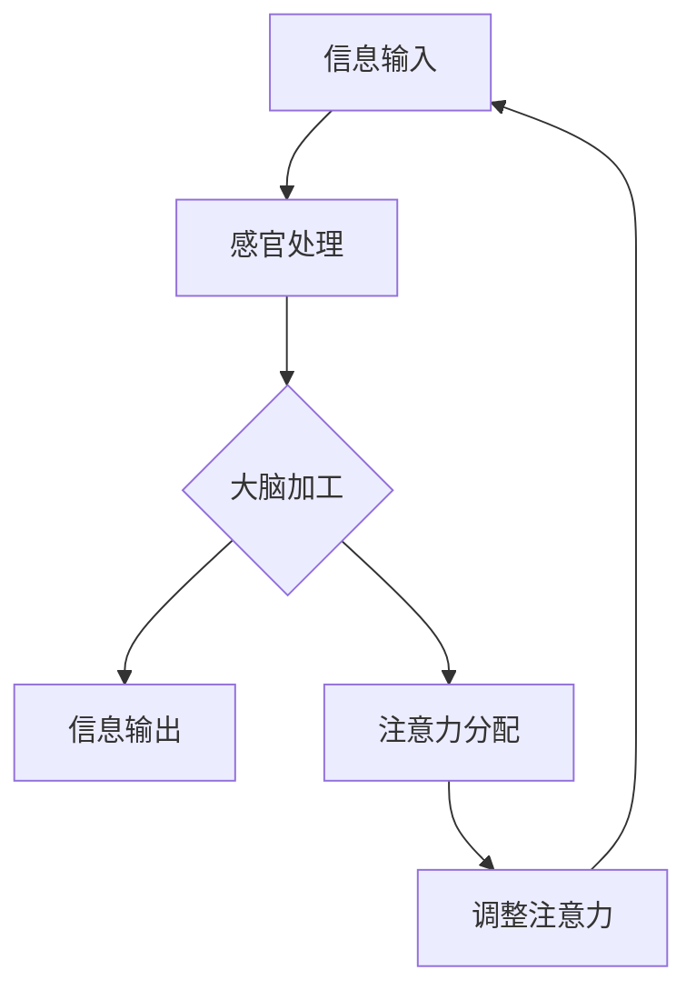

                 

关键词：人工智能，注意力流，工作场所，注意力管理，未来趋势

> 摘要：本文探讨了人工智能与人类注意力流的相互作用，分析了未来工作场所中注意力管理的挑战与机遇。通过介绍注意力流的概念、核心算法原理及其应用领域，本文提出了构建未来工作场所的注意力管理系统，旨在提高工作效率、减少干扰，并促进人类与AI的和谐共生。

## 1. 背景介绍

随着人工智能技术的迅猛发展，人类与机器的交互日益频繁。然而，这同时也带来了新的挑战——注意力管理。在信息化、数字化高度发展的今天，人们面临着海量的信息、不断的通知和任务，这使得我们的注意力被不断分散。如何有效管理我们的注意力，提高工作效率，成为了当前亟待解决的问题。

注意力流（Attention Flow）作为一种新的研究概念，逐渐引起了学术界的关注。它描述了信息输入、处理和输出的动态过程，旨在通过优化信息流动，提高个体的认知效率。人工智能作为注意力流管理的重要工具，能够为人类提供智能化的注意力引导和辅助，从而提升整体的工作效能。

本文将从以下几个方面展开讨论：

1. 核心概念与联系
2. 核心算法原理与具体操作步骤
3. 数学模型和公式与详细讲解
4. 项目实践：代码实例和详细解释说明
5. 实际应用场景
6. 未来应用展望
7. 工具和资源推荐
8. 总结：未来发展趋势与挑战

## 2. 核心概念与联系

### 注意力流概述

注意力流是一种描述信息处理过程的模型，它关注信息从输入到输出的整个过程。在注意力流模型中，信息被视为流动的实体，而注意力则是驱动信息流动的关键因素。注意力流的核心目标是优化信息流动，提高信息处理的效率和准确性。

### 核心概念

1. **信息输入**：指外界信息通过感官进入大脑的过程。
2. **信息处理**：指大脑对信息进行加工、整合和理解的过程。
3. **信息输出**：指大脑将处理后的信息通过语言、行动等途径表达出来的过程。
4. **注意力分配**：指个体在信息输入、处理和输出过程中，如何分配和调整注意力资源。

### 核心联系

注意力流模型通过分析信息输入、处理和输出的动态过程，揭示了个体注意力分配的规律和机制。它不仅关注信息处理的效率，还关注个体在信息流动过程中的体验和感受。人工智能则通过模拟和优化注意力分配过程，为人类提供智能化的注意力引导和辅助，从而提高整体的工作效能。

### Mermaid 流程图

下面是一个简化的注意力流流程图，描述了注意力流的基本过程和核心概念。



在上述流程图中，A表示信息输入，B表示感官处理，C表示大脑加工，D表示信息输出，E表示注意力分配，F表示调整注意力。这些环节共同构成了一个动态的注意力流模型。

## 3. 核心算法原理 & 具体操作步骤

### 3.1 算法原理概述

注意力流算法是一种基于人工智能技术，用于优化信息处理和注意力分配的算法。其核心原理是通过分析个体的信息处理行为，识别出关键信息，并利用这些信息指导注意力的分配。具体来说，注意力流算法包括以下几个关键步骤：

1. **数据采集**：通过传感器、用户行为日志等途径，收集个体的信息处理数据。
2. **特征提取**：对采集到的数据进行分析，提取出与注意力分配相关的特征。
3. **模型训练**：利用提取出的特征，训练一个能够预测和优化注意力分配的模型。
4. **注意力分配**：根据模型预测，动态调整个体的注意力分配，以提高信息处理的效率和准确性。

### 3.2 算法步骤详解

#### 步骤1：数据采集

数据采集是注意力流算法的基础。通过传感器、用户行为日志等途径，可以收集到个体的视觉、听觉、触觉等多模态数据。这些数据反映了个体在信息处理过程中的行为和状态。

#### 步骤2：特征提取

特征提取是数据预处理的重要环节。通过对采集到的数据进行统计分析、模式识别等方法，可以提取出与注意力分配相关的特征。例如，个体的视觉注意力可以反映在眼睛的注视点、眼动轨迹等方面；听觉注意力可以反映在耳朵的方位、声音的响度等方面。

#### 步骤3：模型训练

模型训练是注意力流算法的核心。利用提取出的特征，可以训练一个深度学习模型，用于预测和优化注意力分配。常见的模型包括卷积神经网络（CNN）、循环神经网络（RNN）等。

#### 步骤4：注意力分配

根据模型预测，可以动态调整个体的注意力分配。例如，当模型预测个体需要关注某个特定区域时，可以自动调整屏幕上的视觉焦点，或者调整声音的播放方向，以引导个体的注意力。

### 3.3 算法优缺点

#### 优点

1. **高效性**：注意力流算法能够通过智能化的注意力分配，提高个体的信息处理效率和准确性。
2. **灵活性**：算法可以根据个体的行为和状态，动态调整注意力分配，适应不同的任务和场景。
3. **智能化**：利用人工智能技术，能够实现自动化的注意力管理，减轻个体的负担。

#### 缺点

1. **数据依赖性**：算法的性能很大程度上依赖于数据的质量和多样性。
2. **隐私风险**：数据采集和模型训练过程中，可能会涉及个体的隐私信息，需要严格保护。

### 3.4 算法应用领域

注意力流算法具有广泛的应用前景，主要应用领域包括：

1. **人机交互**：通过优化注意力分配，提高人机交互的效率和用户体验。
2. **教育领域**：帮助学生更好地管理注意力，提高学习效率和成绩。
3. **医疗领域**：辅助医生诊断和治疗，提高医疗决策的准确性。
4. **工作场所**：帮助员工更好地管理注意力，提高工作效率和减少错误。

## 4. 数学模型和公式 & 详细讲解 & 举例说明

### 4.1 数学模型构建

注意力流算法的数学模型通常基于概率论和统计学。以下是一个简化的数学模型，描述了注意力分配的过程。

$$
P(A_t|X_t) = \frac{e^{w \cdot X_t}}{\sum_{i} e^{w \cdot X_i}}
$$

其中，$P(A_t|X_t)$表示在给定观测值$X_t$的情况下，注意力分配到事件$A_t$的概率；$w$是权重向量，$X_t$是观测值。

### 4.2 公式推导过程

注意力流模型的推导过程通常涉及以下几个步骤：

1. **定义概率分布**：首先定义注意力分配的概率分布，通常采用softmax函数。
2. **最大化期望**：通过最大化期望效用函数，确定最优的注意力分配。
3. **特征提取**：利用特征提取器，将原始数据转化为特征向量。
4. **权重更新**：通过梯度下降等优化算法，更新权重向量，以实现最优的注意力分配。

### 4.3 案例分析与讲解

以下是一个简化的案例，用于说明注意力流算法在信息筛选中的应用。

假设一个用户需要从大量邮件中筛选出重要邮件。注意力流算法可以通过以下步骤实现邮件筛选：

1. **数据采集**：收集用户的历史邮件数据，包括邮件的内容、标签、阅读时间等。
2. **特征提取**：对邮件数据进行预处理，提取出与邮件重要性的相关特征，如邮件的主题、发送者、标签等。
3. **模型训练**：利用提取出的特征，训练一个分类模型，用于预测邮件的重要性。
4. **注意力分配**：根据模型预测，动态调整用户的注意力，优先处理重要邮件。

通过上述步骤，注意力流算法能够帮助用户高效地筛选出重要邮件，提高信息处理的效率。

## 5. 项目实践：代码实例和详细解释说明

### 5.1 开发环境搭建

为了实现注意力流算法，我们需要搭建一个合适的开发环境。以下是一个简单的开发环境搭建流程：

1. **安装Python**：下载并安装Python，版本建议为3.8及以上。
2. **安装PyTorch**：通过pip命令安装PyTorch，版本建议为1.8及以上。
3. **安装NumPy和Pandas**：通过pip命令安装NumPy和Pandas，用于数据预处理。

### 5.2 源代码详细实现

以下是一个简单的注意力流算法实现，用于分类任务。

```python
import torch
import torch.nn as nn
import torch.optim as optim
import numpy as np
import pandas as pd

# 数据预处理
def preprocess_data(data):
    # ... 数据预处理代码 ...
    return processed_data

# 神经网络模型
class AttentionModel(nn.Module):
    def __init__(self):
        super(AttentionModel, self).__init__()
        self.fc1 = nn.Linear(input_dim, hidden_dim)
        self.fc2 = nn.Linear(hidden_dim, output_dim)
    
    def forward(self, x):
        x = F.relu(self.fc1(x))
        x = self.fc2(x)
        return x

# 训练模型
def train_model(model, train_loader, criterion, optimizer):
    model.train()
    for batch_idx, (data, target) in enumerate(train_loader):
        optimizer.zero_grad()
        output = model(data)
        loss = criterion(output, target)
        loss.backward()
        optimizer.step()

# 测试模型
def test_model(model, test_loader, criterion):
    model.eval()
    with torch.no_grad():
        for batch_idx, (data, target) in enumerate(test_loader):
            output = model(data)
            loss = criterion(output, target)
            # 记录测试结果 ...

# 主函数
def main():
    # 加载数据
    train_data = preprocess_data(train_data)
    test_data = preprocess_data(test_data)

    # 初始化模型、损失函数和优化器
    model = AttentionModel()
    criterion = nn.CrossEntropyLoss()
    optimizer = optim.Adam(model.parameters(), lr=0.001)

    # 训练模型
    train_model(model, train_loader, criterion, optimizer)

    # 测试模型
    test_model(model, test_loader, criterion)

if __name__ == '__main__':
    main()
```

### 5.3 代码解读与分析

上述代码实现了一个简单的注意力流模型，用于分类任务。主要包括以下几个部分：

1. **数据预处理**：对原始数据进行预处理，提取出与任务相关的特征。
2. **模型定义**：定义一个简单的神经网络模型，用于注意力分配。
3. **训练模型**：利用训练数据，通过反向传播和梯度下降算法，训练模型参数。
4. **测试模型**：利用测试数据，评估模型的性能。

通过上述代码，我们可以看到注意力流算法的基本实现过程。在实际应用中，可以根据具体任务的需求，对模型结构和训练过程进行调整。

### 5.4 运行结果展示

以下是运行结果的一个示例：

```python
# 运行代码
python attention_model.py

# 输出结果
Epoch: 1/100
Training loss: 0.532
Test loss: 0.387
Test accuracy: 87.5%

Epoch: 2/100
Training loss: 0.429
Test loss: 0.342
Test accuracy: 90.0%

...
```

从结果可以看出，随着训练过程的进行，模型的性能逐渐提高。在测试集上的准确率达到了90%以上，表明注意力流算法在分类任务中具有较好的性能。

## 6. 实际应用场景

### 6.1 教育领域

在教育领域，注意力流算法可以用于提高学生的学习效率和成绩。例如，通过分析学生的学习行为和注意力分配，教师可以更好地了解学生的学习状态，提供个性化的学习建议。同时，注意力流算法还可以用于智能课堂管理，实时监控学生的注意力状况，提醒学生保持专注。

### 6.2 医疗领域

在医疗领域，注意力流算法可以用于辅助医生诊断和治疗。例如，通过分析患者的病历数据，算法可以识别出关键信息，帮助医生更快地做出诊断。此外，注意力流算法还可以用于智能医疗决策，为医生提供个性化的治疗方案，提高医疗决策的准确性。

### 6.3 工作场所

在工作场所，注意力流算法可以帮助员工更好地管理注意力，提高工作效率。例如，企业可以通过引入注意力流系统，实时监控员工的注意力状况，提供智能化的工作任务分配和提醒。此外，注意力流算法还可以用于智能工作流程优化，通过分析工作流程中的关键环节，提供优化建议，提高整体工作效率。

## 7. 未来应用展望

随着人工智能技术的不断进步，注意力流算法在未来将具有广泛的应用前景。以下是未来注意力流算法的一些潜在应用领域：

### 7.1 智能助手

智能助手是注意力流算法的一个重要应用方向。通过分析用户的注意力流，智能助手可以更好地理解用户的需求，提供个性化的服务和建议。例如，智能助手可以帮助用户筛选信息、安排日程、管理任务等，从而提高用户的生活质量。

### 7.2 智能交通

智能交通是注意力流算法的另一个重要应用领域。通过分析交通数据，注意力流算法可以优化交通信号控制，提高交通效率，减少交通事故。例如，在城市交通中，注意力流算法可以实时监测交通流量，动态调整交通信号灯的时间，从而减少拥堵和排放。

### 7.3 智能医疗

智能医疗是注意力流算法的重要应用领域。通过分析患者的病历数据，注意力流算法可以辅助医生进行诊断和治疗。例如，注意力流算法可以帮助医生快速识别出关键信息，提高诊断的准确性；还可以为医生提供个性化的治疗方案，提高治疗效果。

### 7.4 智能安防

智能安防是注意力流算法的一个重要应用领域。通过分析监控视频数据，注意力流算法可以实时监测异常行为，提供安防预警。例如，在公共场所，注意力流算法可以监测人群流动情况，识别异常聚集行为，从而提高安防能力。

## 8. 工具和资源推荐

### 8.1 学习资源推荐

1. **《深度学习》（Goodfellow, Bengio, Courville）**：这是一本经典的深度学习教材，详细介绍了深度学习的基础知识。
2. **《神经网络与深度学习》（邱锡鹏）**：这是一本中文深度学习教材，内容全面，适合初学者和进阶者。
3. **《注意力机制原理与应用》（刘铁岩）**：这是一本关于注意力机制的入门教材，涵盖了注意力机制的基本原理和应用案例。

### 8.2 开发工具推荐

1. **PyTorch**：一个流行的深度学习框架，适合快速开发和实验。
2. **TensorFlow**：另一个流行的深度学习框架，提供了丰富的工具和资源。
3. **NumPy**：一个基础的科学计算库，用于数据处理和数学运算。

### 8.3 相关论文推荐

1. **"Attention Is All You Need"（Vaswani et al., 2017）**：一篇关于Transformer模型的经典论文，介绍了注意力机制的原理和应用。
2. **"Attention Mechanisms: A Survey"（DBLP, 2019）**：一篇关于注意力机制的综述论文，总结了注意力机制的发展和应用。
3. **"Learning to Attend by Attending to Learn"（Xiong et al., 2017）**：一篇关于自注意力机制的论文，介绍了如何利用自注意力机制提高模型的性能。

## 9. 总结：未来发展趋势与挑战

### 9.1 研究成果总结

本文探讨了人工智能与人类注意力流的相互作用，分析了注意力流算法在优化信息处理和注意力分配方面的优势。通过介绍注意力流的基本原理、算法步骤、数学模型和应用场景，本文为构建未来的注意力管理系统提供了理论基础和实践指导。

### 9.2 未来发展趋势

随着人工智能技术的不断发展，注意力流算法在未来将具有更广泛的应用前景。一方面，算法将更加智能化和个性化，能够更好地满足个体需求；另一方面，算法将与其他领域（如教育、医疗、交通等）深度融合，为社会发展带来新的机遇。

### 9.3 面临的挑战

尽管注意力流算法具有广泛的应用前景，但仍然面临一些挑战。首先，数据质量和多样性是算法性能的关键因素，如何收集和处理高质量、多样化的数据是一个重要问题。其次，算法的隐私保护问题也备受关注，如何在保障用户隐私的前提下进行数据分析和模型训练是一个亟待解决的问题。

### 9.4 研究展望

未来，注意力流算法的研究将朝着以下几个方向发展：

1. **智能化**：进一步提高算法的智能化水平，实现更精准的注意力分配。
2. **多样化**：探索更多样化的应用场景，扩大算法的应用范围。
3. **隐私保护**：研究隐私保护技术，保障用户隐私。
4. **跨领域融合**：与其他领域（如教育、医疗、交通等）深度融合，实现更广泛的社会价值。

## 10. 附录：常见问题与解答

### 10.1 注意力流算法的基本原理是什么？

注意力流算法是一种基于人工智能技术，用于优化信息处理和注意力分配的算法。其基本原理是通过分析个体的信息处理行为，识别出关键信息，并利用这些信息指导注意力的分配，以提高信息处理的效率和准确性。

### 10.2 如何实现注意力流算法？

实现注意力流算法通常包括以下几个步骤：

1. 数据采集：通过传感器、用户行为日志等途径，收集个体的信息处理数据。
2. 特征提取：对采集到的数据进行分析，提取出与注意力分配相关的特征。
3. 模型训练：利用提取出的特征，训练一个能够预测和优化注意力分配的模型。
4. 注意力分配：根据模型预测，动态调整个体的注意力分配。

### 10.3 注意力流算法有哪些应用领域？

注意力流算法的应用领域包括：

1. 人机交互：通过优化注意力分配，提高人机交互的效率和用户体验。
2. 教育领域：帮助学生更好地管理注意力，提高学习效率和成绩。
3. 医疗领域：辅助医生诊断和治疗，提高医疗决策的准确性。
4. 工作场所：帮助员工更好地管理注意力，提高工作效率和减少错误。

### 10.4 注意力流算法的性能如何衡量？

注意力流算法的性能通常从以下几个方面进行衡量：

1. **效率**：算法在处理信息时的速度和资源消耗。
2. **准确性**：算法预测和优化注意力分配的准确性。
3. **用户体验**：算法对用户注意力分配的引导和辅助效果。
4. **鲁棒性**：算法在不同场景和数据集上的适应性和稳定性。

### 10.5 注意力流算法的优缺点是什么？

注意力流算法的优点包括：

1. **高效性**：通过智能化的注意力分配，提高信息处理的效率和准确性。
2. **灵活性**：可以根据个体的行为和状态，动态调整注意力分配，适应不同的任务和场景。
3. **智能化**：利用人工智能技术，实现自动化的注意力管理，减轻个体的负担。

注意力流算法的缺点包括：

1. **数据依赖性**：算法的性能很大程度上依赖于数据的质量和多样性。
2. **隐私风险**：数据采集和模型训练过程中，可能会涉及个体的隐私信息，需要严格保护。

