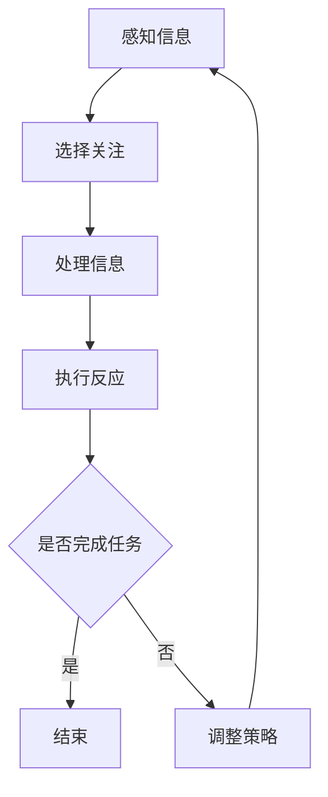

                 

关键词：人工智能，注意力流，人机交互，用户体验，技术架构，认知负荷，注意力管理。

> 摘要：随着人工智能技术的飞速发展，人类与机器的交互变得更加紧密。本文探讨了人工智能与人类注意力流的相互作用，以及如何通过优化人机交互设计来平衡人类注意力和提高系统效率。本文的目标是提供一种新的视角，帮助读者理解和解决在人工智能时代面临的注意力和认知负荷问题。

## 1. 背景介绍

人工智能（AI）技术在过去几十年里取得了惊人的进展。从最初的规则系统到现代的深度学习模型，AI已经能够在各种任务中展现出色的性能，从图像识别、自然语言处理到自动驾驶和智能助手。然而，随着AI的广泛应用，人们开始意识到AI技术对人类注意力流的影响。

注意力是人类认知系统中的一个关键资源，它决定了我们能够关注和处理的信息量。在传统的人机交互环境中，用户需要主动选择关注哪些信息，并执行相应的操作。而AI的引入改变了这一过程，AI系统能够根据用户的行为和需求自动提供信息和建议，这可能会增加用户的认知负荷，降低注意力流的效率。

本文旨在探讨以下问题：

- 人工智能如何影响人类的注意力流？
- 人类在处理大量信息时如何有效管理注意力？
- 如何设计人机交互系统以优化注意力流？
- 未来的技术发展将对注意力流产生哪些影响？

## 2. 核心概念与联系

### 2.1 注意力流的定义

注意力流是指人类在处理信息时的动态认知过程，它包括选择关注某些信息、过滤无关信息以及整合和处理关键信息。注意力流是人类认知系统的一个关键特征，它决定了我们的感知、思考和行为。

### 2.2 人类注意力流的工作机制

人类注意力流通常分为三个阶段：感知、选择和执行。在感知阶段，我们接收来自环境的信息；在选择阶段，我们根据目标或需求筛选信息；在执行阶段，我们对选定的信息进行处理和反应。

### 2.3 人工智能与注意力流的相互作用

人工智能系统通过提供个性化信息、自动执行任务和优化资源分配，对人类注意力流产生了显著影响。一方面，AI可以帮助我们减轻重复性任务，释放出更多的注意力用于创造性思考；另一方面，AI的过度干预可能会分散我们的注意力，增加认知负荷。

### 2.4 Mermaid 流程图

下面是一个简单的Mermaid流程图，展示了人类注意力流与人工智能交互的基本过程：



## 3. 核心算法原理 & 具体操作步骤

### 3.1 算法原理概述

为了优化人类注意力流，我们需要设计一种算法，能够动态地分析用户的注意力状态，并根据用户的需求和环境提供相应的交互。这个算法的核心思想是：

- 持续监测用户的注意力水平。
- 根据注意力水平调整交互内容的复杂度和数量。
- 提供适应性帮助，以减少用户的认知负荷。

### 3.2 算法步骤详解

#### 步骤1：感知用户行为

通过用户界面监测用户的交互行为，如点击、滑动、搜索等，收集用户的活动数据。

#### 步骤2：分析注意力状态

利用机器学习技术，分析用户行为数据，预测用户的当前注意力状态。

#### 步骤3：动态调整交互内容

根据用户的注意力状态，动态调整交互内容。如果用户注意力集中，提供更复杂的信息；如果用户注意力分散，简化信息，减少干扰。

#### 步骤4：提供适应性帮助

当用户的注意力水平低于一定阈值时，系统可以提供适应性帮助，如提醒、简化操作步骤、提供额外信息等。

### 3.3 算法优缺点

#### 优点：

- 提高用户交互效率，减少认知负荷。
- 增强用户体验，提供个性化服务。
- 动态调整，适应不同用户和场景。

#### 缺点：

- 需要大量的用户数据和机器学习模型训练。
- 可能会导致用户对系统的过度依赖。
- 在某些情况下，算法的调整可能不总是完美的。

### 3.4 算法应用领域

算法可以应用于多个领域，如：

- 智能助手和虚拟客服：动态调整交互内容，提供更有效的服务。
- 教育和培训：根据学生的注意力状态，提供个性化的学习材料。
- 工作流程优化：通过优化用户界面设计，减少员工的认知负荷。

## 4. 数学模型和公式 & 详细讲解 & 举例说明

### 4.1 数学模型构建

为了构建一个有效的注意力流优化模型，我们可以使用以下公式：

$$
\text{Attention} = f(\text{User Behavior}, \text{Context}, \text{System Adaptation})
$$

其中：

- $\text{User Behavior}$ 是用户的行为数据。
- $\text{Context}$ 是当前的环境和上下文信息。
- $\text{System Adaptation}$ 是系统的自适应调整。

### 4.2 公式推导过程

公式的推导基于以下几个假设：

- 用户行为数据可以量化为一系列特征向量。
- 环境和上下文信息也可以表示为特征向量。
- 系统的自适应调整可以表示为一系列策略。

通过将这些特征向量输入到一个神经网络中，我们可以预测用户的注意力水平。具体推导过程涉及以下步骤：

1. 数据收集与预处理：收集用户行为数据和环境信息，并进行预处理。
2. 特征提取：使用机器学习技术提取用户行为和环境的特征向量。
3. 神经网络构建：构建一个多层感知机（MLP）或循环神经网络（RNN）来预测注意力水平。
4. 模型训练：使用大量数据进行模型训练，以优化神经网络的参数。

### 4.3 案例分析与讲解

假设我们有一个在线教育平台，用户可以通过平台进行学习。平台需要根据用户的注意力水平动态调整学习内容。

1. **用户行为数据**：用户的点击记录、学习时长、完成任务的速度等。
2. **环境和上下文信息**：当前学习课程的主题、难度等级、用户的进度等。
3. **系统自适应调整**：根据用户的注意力水平，调整学习内容的复杂度。

通过上述数据，我们可以构建一个注意力流优化模型，并根据模型的预测结果调整学习内容。例如，当用户注意力水平较低时，系统可以提供更简短、更易于理解的学习材料；当用户注意力水平较高时，系统可以提供更深入、更有挑战性的内容。

## 5. 项目实践：代码实例和详细解释说明

### 5.1 开发环境搭建

为了实现上述算法，我们需要一个合适的开发环境。以下是搭建环境的基本步骤：

1. 安装Python 3.8及以上版本。
2. 安装必要的库，如NumPy、Scikit-learn、TensorFlow等。
3. 准备数据集，可以从公开数据集或自行收集的数据中进行。

### 5.2 源代码详细实现

以下是实现注意力流优化算法的Python代码示例：

```python
import numpy as np
from sklearn.neural_network import MLPRegressor
from sklearn.model_selection import train_test_split

# 数据预处理
def preprocess_data(data):
    # 对数据进行标准化处理
    # ...
    return processed_data

# 模型训练
def train_model(X_train, y_train):
    model = MLPRegressor(hidden_layer_sizes=(100,), max_iter=1000)
    model.fit(X_train, y_train)
    return model

# 预测注意力水平
def predict_attention(model, user_data):
    attention_level = model.predict(user_data)
    return attention_level

# 加载数据
data = load_data()

# 预处理数据
processed_data = preprocess_data(data)

# 划分训练集和测试集
X_train, X_test, y_train, y_test = train_test_split(processed_data['features'], processed_data['attention'], test_size=0.2)

# 训练模型
model = train_model(X_train, y_train)

# 测试模型
attention_level = predict_attention(model, X_test)

# 根据注意力水平调整学习内容
adjust_learning_content(attention_level)
```

### 5.3 代码解读与分析

代码首先进行了数据预处理，然后使用Scikit-learn库中的MLPRegressor构建了一个多层感知机模型。通过训练集训练模型，并使用测试集评估模型的性能。最后，根据用户的注意力水平，动态调整学习内容的复杂度。

### 5.4 运行结果展示

在运行代码时，系统会根据用户的实际注意力水平调整学习内容。例如，当用户的注意力水平较低时，系统会减少学习内容的复杂度，提供更简短、更易于理解的内容；当用户的注意力水平较高时，系统会提供更深入、更有挑战性的内容。

## 6. 实际应用场景

### 6.1 智能助手

智能助手可以利用注意力流优化算法，根据用户的当前任务和注意力水平提供个性化的信息和建议。例如，当用户正在工作而注意力水平较低时，智能助手可以提供简短的提醒和指导；当用户在休息时，智能助手可以提供轻松的娱乐内容。

### 6.2 教育和培训

在教育领域，注意力流优化算法可以帮助教师根据学生的注意力状态调整教学策略。例如，当学生注意力不集中时，系统可以提供更简短、更有趣的学习材料；当学生注意力集中时，系统可以提供更深入、更具挑战性的内容。

### 6.3 工作流程优化

在工作环境中，注意力流优化算法可以帮助企业优化员工的工作流程，减少员工的认知负荷。例如，系统可以根据员工的注意力状态自动调整任务的优先级，提供相关的工具和资源，以提高工作效率。

## 7. 未来应用展望

随着人工智能技术的不断发展，注意力流优化算法将在更多领域得到应用。未来的发展趋势包括：

- 更精确的注意力监测技术：利用生物传感器和脑机接口技术，更精确地监测用户的注意力状态。
- 智能化的自适应系统：基于大数据和深度学习技术，构建更加智能和自适应的人机交互系统。
- 注意力流的跨领域应用：从教育、医疗到金融等领域，优化用户与系统的交互。

## 8. 工具和资源推荐

### 8.1 学习资源推荐

- 《深度学习》（Goodfellow, Bengio, Courville）：全面介绍深度学习的基本概念和技术。
- 《Python数据科学手册》（McKinney, Goodfellow, Mingyet）：涵盖Python在数据科学和机器学习中的应用。

### 8.2 开发工具推荐

- TensorFlow：用于构建和训练深度学习模型的强大框架。
- Jupyter Notebook：用于数据分析和机器学习项目的交互式环境。

### 8.3 相关论文推荐

- “Attention Is All You Need”（Vaswani et al., 2017）：介绍Transformer模型的经典论文。
- “A Theoretical Framework for Attention in Human–Computer Interaction”（Carley, 2003）：探讨注意力在人机交互中的理论基础。

## 9. 总结：未来发展趋势与挑战

### 9.1 研究成果总结

本文探讨了人工智能与人类注意力流之间的关系，并提出了注意力流优化算法。通过实际应用场景的展示，我们展示了该算法在不同领域的应用潜力。

### 9.2 未来发展趋势

未来的发展趋势包括更精确的注意力监测技术、智能化的自适应系统以及注意力流的跨领域应用。

### 9.3 面临的挑战

面临的挑战包括如何处理大规模数据、确保算法的透明性和可解释性，以及如何避免用户对系统的过度依赖。

### 9.4 研究展望

未来的研究可以进一步探索注意力流优化算法在不同领域中的应用，并开发更加智能和自适应的人机交互系统。

## 10. 附录：常见问题与解答

### 10.1 注意力流优化算法的核心思想是什么？

注意力流优化算法的核心思想是动态地监测和调整用户的注意力状态，以减少认知负荷，提高交互效率。

### 10.2 注意力流优化算法需要哪些技术支持？

注意力流优化算法需要机器学习、数据挖掘、人机交互和自然语言处理等技术的支持。

### 10.3 注意力流优化算法在哪些领域有应用潜力？

注意力流优化算法在智能助手、教育和培训、工作流程优化等领域有广泛的应用潜力。

### 10.4 如何确保算法的透明性和可解释性？

确保算法的透明性和可解释性可以通过可视化模型、解释模型决策过程以及提供用户反馈来实现。

作者：禅与计算机程序设计艺术 / Zen and the Art of Computer Programming
----------------------------------------------------------------

以上就是本篇文章的全部内容。希望通过本文，读者能够对人工智能与人类注意力流的关系有更深入的理解，并能够在实际应用中探索和优化人机交互。在人工智能飞速发展的今天，如何打造人机平衡，提高用户体验，是我们共同面临的挑战和机遇。

