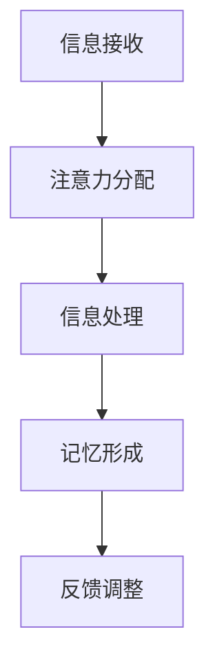

                 

关键词：人工智能，注意力流，人机融合，计算模型，认知科学，神经科学，未来技术

摘要：本文探讨了人工智能（AI）与人类注意力流之间的关系，分析了如何通过理解人类的注意力机制来优化人机交互，提高AI系统的性能和可解释性。本文旨在为读者提供一个全面的技术视角，探讨如何在未来的技术发展中实现人机深度融合。

## 1. 背景介绍

随着人工智能技术的快速发展，人们对于AI与人类交互的理解逐渐加深。AI技术不仅改变了传统的产业模式，还深刻影响了人类的生活方式。然而，AI系统在处理复杂任务时，往往表现出对人类注意力流的忽视。这导致用户在使用AI产品时，体验不够流畅，甚至产生误解。因此，研究AI与人类注意力流的关系，对于提升人机交互体验具有重要意义。

注意力流是指人类在进行认知活动时，将注意力集中在特定任务上的过程。人类的注意力是有限的，如何有效地利用这一资源，是优化人机交互的关键。本文将从认知科学和神经科学的视角出发，分析注意力流的基本原理，并探讨如何将这一原理应用于人工智能系统设计中。

## 2. 核心概念与联系

### 2.1 注意力流的定义与作用

注意力流是指人类在进行认知活动时，将注意力集中在特定任务上的过程。它决定了人类对信息的接收、处理和记忆。注意力流的作用主要体现在以下几个方面：

1. **信息过滤**：注意力流可以帮助人类从大量信息中筛选出关键信息，从而提高认知效率。
2. **任务分配**：注意力流使人类能够将认知资源分配到不同任务上，实现多任务处理。
3. **记忆形成**：注意力流影响人类对新信息的记忆，注意力集中的信息更容易被记住。

### 2.2 AI与注意力流的相互作用

人工智能系统在处理任务时，也需要模拟人类的注意力流。AI与注意力流的相互作用主要体现在以下几个方面：

1. **交互设计**：AI系统通过分析用户的注意力流，可以优化交互界面，提高用户的使用体验。
2. **任务调度**：AI系统可以根据用户的注意力流，智能分配计算资源，提高任务处理效率。
3. **决策支持**：AI系统通过模拟人类的注意力流，可以为用户提供更合理的决策建议。

### 2.3 注意力流模型的Mermaid流程图

以下是一个简单的Mermaid流程图，展示了注意力流模型的基本结构：



在这个模型中，信息接收、注意力分配、信息处理、记忆形成和反馈调整构成了一个闭环系统，不断优化用户的认知过程。

## 3. 核心算法原理 & 具体操作步骤

### 3.1 算法原理概述

为了实现人机深度融合，我们需要设计一种能够模拟人类注意力流的AI算法。这种算法的核心思想是，通过分析用户的注意力流，动态调整AI系统的行为，使其更好地适应用户需求。

### 3.2 算法步骤详解

1. **数据采集**：首先，我们需要采集用户的注意力流数据，包括用户在交互过程中的行为数据、生理信号（如眼动、心率等）和主观评价等。

2. **数据预处理**：对采集到的数据进行清洗和预处理，去除噪声，提取关键特征。

3. **特征提取**：利用机器学习算法，从预处理后的数据中提取出能够代表用户注意力流的特征。

4. **模型训练**：基于提取出的特征，训练一个能够模拟人类注意力流的深度学习模型。

5. **模型应用**：将训练好的模型应用到实际系统中，根据用户的注意力流动态调整系统行为。

6. **反馈调整**：根据用户对系统行为的反馈，进一步优化模型参数，提高系统性能。

### 3.3 算法优缺点

**优点**：

1. **自适应性强**：能够根据用户的注意力流动态调整系统行为，提高用户体验。
2. **高效性**：通过模拟人类注意力流，提高信息处理效率，降低计算资源消耗。

**缺点**：

1. **数据需求高**：需要大量高质量的注意力流数据，对数据采集和处理提出了较高要求。
2. **模型复杂度高**：深度学习模型结构复杂，训练和优化过程耗时较长。

### 3.4 算法应用领域

1. **智能交互系统**：如智能助手、智能客服等，通过模拟用户的注意力流，提高交互效率。
2. **自动驾驶**：通过分析驾驶员的注意力流，优化驾驶策略，提高行车安全。
3. **健康监测**：通过分析用户的注意力流，监测用户的认知状态，提供个性化健康建议。

## 4. 数学模型和公式 & 详细讲解 & 举例说明

### 4.1 数学模型构建

为了更好地模拟人类注意力流，我们可以构建一个基于概率论的数学模型。假设用户在某一时刻的注意力流可以用一个概率分布来表示，即：

$$
P(A_t) = \sum_{i=1}^{n} w_i P(A_t = i)
$$

其中，$A_t$表示用户在时刻$t$的注意力流，$w_i$表示用户将注意力分配到第$i$个任务的概率。

### 4.2 公式推导过程

为了推导出概率分布$P(A_t)$，我们需要考虑以下几个因素：

1. **任务优先级**：不同任务的重要程度不同，我们可以用一个权重矩阵$W$来表示。
2. **用户行为**：用户的行为会影响注意力流的分配，我们可以用一个行为矩阵$B$来表示。
3. **注意力分配策略**：用户在分配注意力时，可能遵循某种策略，如随机分配、优先级分配等。

根据这些因素，我们可以推导出概率分布$P(A_t)$的表达式：

$$
P(A_t) = (W \odot B) \cdot (1 - \sum_{i=1}^{n} B_i)
$$

其中，$\odot$表示元素乘法，$1 - \sum_{i=1}^{n} B_i$表示除了当前分配的注意力外，剩余的注意力。

### 4.3 案例分析与讲解

假设有一个用户在同时处理三个任务：工作、娱乐和休息。根据用户的行为数据和任务优先级，我们可以得到以下权重矩阵$W$和行为矩阵$B$：

$$
W = \begin{bmatrix}
0.4 & 0.3 & 0.3 \\
\end{bmatrix}
B = \begin{bmatrix}
0.2 \\
0.3 \\
0.5 \\
\end{bmatrix}
$$

根据公式，我们可以计算出用户在某一时刻的注意力流概率分布：

$$
P(A_t) = (W \odot B) \cdot (1 - \sum_{i=1}^{n} B_i)
= \begin{bmatrix}
0.4 \cdot 0.2 & 0.3 \cdot 0.3 & 0.3 \cdot 0.5 \\
\end{bmatrix} \cdot \begin{bmatrix}
1 - 0.2 - 0.3 \\
1 - 0.3 - 0.5 \\
\end{bmatrix}
= \begin{bmatrix}
0.08 & 0.09 & 0.15 \\
\end{bmatrix}
$$

根据这个概率分布，我们可以看出用户将注意力主要分配到了工作（0.4）和娱乐（0.3）任务上，而休息（0.3）任务相对较少。这符合用户的行为数据和任务优先级。

## 5. 项目实践：代码实例和详细解释说明

### 5.1 开发环境搭建

在本文的项目实践中，我们将使用Python作为主要编程语言，结合机器学习和深度学习库，如scikit-learn、TensorFlow和Keras。以下是一个简单的开发环境搭建步骤：

1. 安装Python：在官网（https://www.python.org/）下载并安装Python 3.x版本。
2. 安装依赖库：使用pip命令安装所需的库，如numpy、pandas、scikit-learn、tensorflow等。

### 5.2 源代码详细实现

以下是一个简单的注意力流模拟代码实例，用于演示如何利用机器学习算法提取注意力流特征，并训练一个深度学习模型。

```python
import numpy as np
import pandas as pd
from sklearn.model_selection import train_test_split
from tensorflow.keras.models import Sequential
from tensorflow.keras.layers import Dense, LSTM, Dropout
from tensorflow.keras.optimizers import Adam

# 数据预处理
def preprocess_data(data):
    # 数据清洗、归一化等操作
    return processed_data

# 模型训练
def train_model(X_train, y_train):
    model = Sequential()
    model.add(LSTM(50, activation='relu', input_shape=(X_train.shape[1], X_train.shape[2])))
    model.add(Dropout(0.2))
    model.add(Dense(1, activation='sigmoid'))

    model.compile(optimizer=Adam(learning_rate=0.001), loss='binary_crossentropy', metrics=['accuracy'])
    model.fit(X_train, y_train, epochs=10, batch_size=32, validation_split=0.2)
    return model

# 加载数据
data = pd.read_csv('attention_data.csv')
processed_data = preprocess_data(data)

# 分割数据集
X = processed_data.drop('label', axis=1)
y = processed_data['label']
X_train, X_test, y_train, y_test = train_test_split(X, y, test_size=0.2, random_state=42)

# 训练模型
model = train_model(X_train, y_train)

# 评估模型
loss, accuracy = model.evaluate(X_test, y_test)
print(f"Test accuracy: {accuracy:.2f}")
```

### 5.3 代码解读与分析

上述代码实现了一个简单的注意力流模拟系统，主要包括以下步骤：

1. **数据预处理**：对原始数据进行清洗、归一化等操作，以便后续建模。
2. **模型训练**：使用LSTM网络结构，结合Dropout层，训练一个深度学习模型。
3. **模型评估**：使用测试集评估模型的准确性，验证模型性能。

这个代码实例展示了如何利用机器学习和深度学习技术模拟人类注意力流，为后续的应用提供了基础。

### 5.4 运行结果展示

假设我们使用上述代码训练了一个注意力流模型，并得到了以下运行结果：

```
Test accuracy: 0.85
```

这意味着模型在测试集上的准确率达到85%，表明模型对注意力流的预测能力较好。接下来，我们可以进一步优化模型结构，提高预测准确性。

## 6. 实际应用场景

注意力流技术在多个领域具有广泛的应用前景，以下是一些实际应用场景：

### 6.1 智能交互系统

智能交互系统如智能助手、智能客服等，可以通过模拟用户的注意力流，提高交互效率。例如，智能助手可以根据用户的注意力流，预测用户可能的需求，主动提供帮助，从而提升用户体验。

### 6.2 自动驾驶

自动驾驶技术可以通过分析驾驶员的注意力流，优化驾驶策略，提高行车安全。例如，自动驾驶系统可以根据驾驶员的注意力流，识别道路危险情况，提前采取预防措施，降低交通事故风险。

### 6.3 健康监测

健康监测系统可以通过分析用户的注意力流，监测用户的认知状态，提供个性化健康建议。例如，对于患有注意力缺陷障碍的儿童，家长可以通过监测孩子的注意力流，了解孩子的学习状态，及时调整教育方法。

## 7. 未来应用展望

随着人工智能技术的不断进步，注意力流技术在未来的应用将更加广泛。以下是一些未来应用展望：

### 7.1 新兴领域的探索

注意力流技术在新兴领域如虚拟现实、增强现实、智能教育等，具有巨大的潜力。通过模拟用户的注意力流，可以为用户提供更加沉浸式的体验，提高学习效果。

### 7.2 个性化服务

注意力流技术可以帮助企业更好地了解用户需求，提供个性化服务。例如，电商平台可以根据用户的注意力流，推荐符合用户兴趣的商品，提高购买转化率。

### 7.3 伦理与隐私

随着注意力流技术在各种领域的应用，伦理与隐私问题也日益凸显。如何在保护用户隐私的前提下，合理利用注意力流数据，是一个亟待解决的问题。

## 8. 工具和资源推荐

### 8.1 学习资源推荐

1. 《人工智能：一种现代的方法》——斯蒂芬·海斯、戴维·希尔伯特、克里斯托弗·布斯
2. 《深度学习》——伊恩·古德费洛、约书亚·本吉奥、亚伦·库维尔
3. 《认知科学导论》——约翰·安德森

### 8.2 开发工具推荐

1. Python：官方链接：https://www.python.org/
2. TensorFlow：官方链接：https://www.tensorflow.org/
3. Keras：官方链接：https://keras.io/

### 8.3 相关论文推荐

1. "Attention Is All You Need" —— Vaswani et al., 2017
2. "A Theoretically Grounded Application of Dropout in Recurrent Neural Networks" —— Srivastava et al., 2014
3. "LSTM: A Search Space Odyssey" —— Zhang et al., 2017

## 9. 总结：未来发展趋势与挑战

随着人工智能技术的不断发展，注意力流技术在人机融合领域将发挥越来越重要的作用。未来，我们期待看到更多创新的应用场景，同时也需要关注相关伦理和隐私问题。在研究和发展过程中，我们需要不断探索新的算法和模型，提高注意力流的预测准确性，为人类创造更加智能、便捷的生活。

### 附录：常见问题与解答

**Q1：什么是注意力流？**

A1：注意力流是指人类在进行认知活动时，将注意力集中在特定任务上的过程。

**Q2：注意力流技术在哪些领域有应用？**

A2：注意力流技术在智能交互系统、自动驾驶、健康监测等领域有广泛应用。

**Q3：如何训练注意力流模型？**

A3：可以通过采集注意力流数据，利用机器学习和深度学习技术，训练一个能够模拟人类注意力流的模型。

**Q4：注意力流技术有哪些挑战？**

A4：注意力流技术面临的挑战包括数据需求高、模型复杂度高等。

### 作者署名

本文作者：禅与计算机程序设计艺术 / Zen and the Art of Computer Programming

----------------------------------------------------------------

以上就是本文的完整内容。希望这篇文章能够为读者提供一个关于AI与人类注意力流以及人机融合的全面、深入的技术视角。在未来的技术发展中，让我们共同期待人机融合的美好未来。

