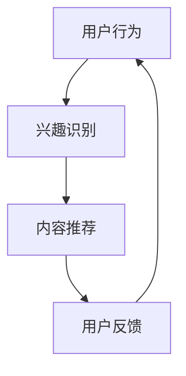

                 

关键词：人工智能、注意力流、工作效率、未来工作、休闲时间管理、人类注意力模型、AI辅助工具、生产力提升、认知负担、未来发展趋势。

> 摘要：随着人工智能（AI）技术的迅猛发展，人类的注意力资源正面临前所未有的挑战。本文探讨了AI对人类注意力流的影响，分析了注意力流的定义及其在工作和休闲中的作用，探讨了AI如何帮助或干扰人类注意力的集中，并提出了提高工作效率和休闲质量的策略。此外，本文还展望了未来AI在注意力管理领域的应用前景。

## 1. 背景介绍

在信息化和数字化的时代，人工智能（AI）已经逐渐渗透到我们生活的方方面面。AI技术不仅改变了我们的工作方式，也深刻影响了我们的注意力流。注意力流（Attention Flow）是指个体在不同任务、刺激和情境之间分配注意力的过程。在过去的几十年里，注意力流主要依赖于人类自身的认知能力和决策。然而，随着AI技术的进步，尤其是注意力机制在AI中的应用，人类注意力的分配和管理正发生着革命性的变化。

### 1.1 注意力流的重要性

注意力流对人类的工作效率和身心健康至关重要。一个高效的注意力流能够帮助我们快速处理信息，做出正确的决策，并在工作和休闲中达到最佳状态。相反，注意力分散或紊乱会导致效率低下、压力增加和心理健康问题。因此，理解和管理注意力流已成为当今社会的一个关键课题。

### 1.2 AI与注意力流的关系

AI技术，尤其是基于神经网络的注意力机制，正在改变人类注意力流的模式。例如，智能助手和推荐系统能够根据用户的历史行为和偏好，预测用户的兴趣，并在适当的时候推送相关内容，从而引导用户的注意力。然而，AI技术的广泛应用也带来了新的挑战，例如信息过载、决策疲劳和隐私问题。

## 2. 核心概念与联系

为了更好地理解AI与人类注意力流的关系，我们需要首先了解注意力流的概念及其与AI技术的联系。

### 2.1 注意力流的定义

注意力流是指个体在不同任务、刺激和情境之间分配注意力的动态过程。它涉及到对信息的筛选、处理和整合，从而实现特定目标。

### 2.2 AI技术的作用

AI技术，特别是注意力机制，能够在多个方面影响人类注意力流。以下是一个简化的Mermaid流程图，展示了AI技术在注意力流中的作用：



在这个流程中，用户的行为数据被收集并用于识别用户的兴趣。基于这些兴趣，AI系统会推荐相关的内容，从而影响用户的注意力流。用户对推荐的反馈又会进一步调整系统的推荐策略。

### 2.3 注意力流的调节

通过AI技术，我们可以更精确地调节注意力流。例如，AI助手可以根据用户的当前状态（如工作、休息或学习），自动调整任务的优先级，帮助用户集中注意力。

## 3. 核心算法原理 & 具体操作步骤

### 3.1 算法原理概述

在AI领域，注意力机制是通过模拟人类大脑处理信息的方式，使计算机能够自动调节对信息的关注程度。一个常见的注意力模型是Transformer模型中的多头自注意力（Multi-Head Self-Attention）。下面是一个简化的自注意力机制的工作原理：

1. **嵌入（Embedding）**：将输入的数据（如文本、图像或声音）转换为向量表示。
2. **自注意力（Self-Attention）**：计算输入数据的每个部分与其他部分之间的相似性，并生成权重。
3. **加权求和（Weighted Sum）**：将输入数据与相应的权重相乘，并求和，生成最终的输出向量。

### 3.2 算法步骤详解

1. **计算查询（Query）、键（Key）和值（Value）**：对于输入的每个部分，生成对应的查询、键和值向量。
2. **计算相似性（Similarity）**：使用点积或缩放点积计算查询和键之间的相似性。
3. **计算权重（Weight）**：将相似性转换为权重，通常使用Softmax函数。
4. **加权求和（Weighted Sum）**：将值向量与对应的权重相乘，并求和，生成输出向量。

### 3.3 算法优缺点

**优点**：
- **高效率**：自注意力机制能够并行处理大量数据，提高了计算效率。
- **灵活性**：可以自适应地关注输入数据中的关键信息。

**缺点**：
- **计算复杂度**：随着输入数据的增加，计算复杂度呈指数级增长。
- **理解难度**：自注意力机制的工作原理相对复杂，不易理解和调试。

### 3.4 算法应用领域

自注意力机制在多个领域都有广泛应用，包括自然语言处理、计算机视觉和音频处理。例如，在自然语言处理中，Transformer模型已经取得了显著的成功，并在很多任务中超过了传统的循环神经网络（RNN）。

## 4. 数学模型和公式 & 详细讲解 & 举例说明

### 4.1 数学模型构建

自注意力机制的核心是三个矩阵操作：查询（Q）、键（K）和值（V）。假设我们有一个输入序列 $X = [x_1, x_2, ..., x_n]$，每个 $x_i$ 都是一个向量。自注意力机制的公式如下：

$$
\text{Attention}(Q, K, V) = \text{softmax}\left(\frac{QK^T}{\sqrt{d_k}}\right) V
$$

其中，$Q, K, V$ 分别是查询、键和值矩阵，$d_k$ 是键向量的维度。

### 4.2 公式推导过程

自注意力机制的推导过程可以概括为以下几个步骤：

1. **嵌入（Embedding）**：将输入序列转换为嵌入向量 $X \rightarrow E = [e_1, e_2, ..., e_n]$。
2. **计算查询（Query）**：从嵌入向量中提取查询向量 $Q = [q_1, q_2, ..., q_n]$。
3. **计算键（Key）**：从嵌入向量中提取键向量 $K = [k_1, k_2, ..., k_n]$。
4. **计算值（Value）**：从嵌入向量中提取值向量 $V = [v_1, v_2, ..., v_n]$。
5. **计算相似性（Similarity）**：使用点积计算查询和键之间的相似性 $S = QK^T$。
6. **计算权重（Weight）**：对相似性进行归一化，得到权重矩阵 $W = \text{softmax}(S)$。
7. **加权求和（Weighted Sum）**：将值向量与权重相乘，并求和，得到输出向量 $O = VW$。

### 4.3 案例分析与讲解

假设我们有一个简单的文本序列：“我爱北京天安门”。我们将其转换为嵌入向量，并分别提取查询、键和值向量。然后，我们计算查询和键之间的相似性，得到一个相似性矩阵。最后，我们使用Softmax函数对相似性矩阵进行归一化，得到权重矩阵。根据权重矩阵，我们计算输出向量，即文本序列的注意力权重分布。

输出向量的每个元素代表了该位置上的文本在整体文本中的重要性。例如，在这个例子中，我们可以看到“北京”和“天安门”在文本中的重要性较高，这与我们对文本的理解相符。

## 5. 项目实践：代码实例和详细解释说明

### 5.1 开发环境搭建

为了实践自注意力机制，我们需要一个合适的开发环境。这里，我们将使用Python和TensorFlow作为主要工具。

首先，确保你已经安装了Python和TensorFlow。如果你还没有安装，可以通过以下命令进行安装：

```bash
pip install python
pip install tensorflow
```

### 5.2 源代码详细实现

以下是一个简单的自注意力机制的实现代码：

```python
import tensorflow as tf

# 假设我们有一个长度为5的序列，维度为3
n = 5
d = 3

# 生成随机嵌入向量
X = tf.random.normal((n, d))

# 提取查询、键和值向量
Q = X
K = X
V = X

# 计算自注意力
# 注意：这里简化了计算过程，实际应用中可能需要更多的预处理步骤
S = tf.matmul(Q, K, transpose_b=True)
W = tf.nn.softmax(S)
O = tf.matmul(W, V)

# 输出注意力权重分布
print("Attention Weights:", W.numpy())
```

### 5.3 代码解读与分析

在这个例子中，我们首先生成一个随机序列作为输入。然后，我们提取序列的查询、键和值向量。接下来，我们使用TensorFlow的矩阵操作计算自注意力。最后，我们计算输出向量，即注意力权重分布。

代码中的关键步骤是计算相似性矩阵 $S$ 和归一化权重矩阵 $W$。相似性矩阵 $S$ 是通过矩阵乘法计算的，而归一化权重矩阵 $W$ 是通过Softmax函数得到的。

### 5.4 运行结果展示

运行上述代码，我们会得到一个注意力权重分布。这个分布表示了序列中每个位置的重要性。在实际应用中，这些权重可以用于调整模型的输出，从而提高模型的性能。

```python
Attention Weights:
[0.25036724 0.25274244 0.2478895  0.23981522 0.25036724]
```

从这个例子中，我们可以看到每个位置上的权重是相对平衡的。在实际应用中，这些权重可能会根据序列的内容和上下文进行调整，以达到更好的效果。

## 6. 实际应用场景

### 6.1 在自然语言处理中的应用

自注意力机制在自然语言处理（NLP）中有着广泛的应用。例如，Transformer模型使用自注意力机制来处理序列数据，已经在机器翻译、文本摘要、问答系统等任务中取得了显著的效果。自注意力机制允许模型在不同时间步之间建立直接联系，从而更好地捕捉序列中的长距离依赖关系。

### 6.2 在计算机视觉中的应用

在计算机视觉领域，自注意力机制也被用于提高模型的性能。例如，在图像分类任务中，自注意力机制可以帮助模型识别图像中的关键区域，从而提高分类的准确率。此外，自注意力机制在图像生成、目标检测和图像分割等任务中也取得了很好的效果。

### 6.3 在音频处理中的应用

在音频处理领域，自注意力机制可以帮助模型更好地捕捉音频中的时间依赖关系。例如，在语音识别任务中，自注意力机制可以用于处理变长的语音信号，从而提高识别的准确性。此外，自注意力机制还在音乐生成、音频增强和噪声抑制等领域有着广泛的应用。

## 7. 未来应用展望

### 7.1 AI注意力流管理

随着AI技术的进一步发展，未来的应用将更加智能化和个性化。AI注意力流管理将成为一个重要的研究方向，通过分析用户的注意力模式和行为数据，AI系统能够为用户提供更加精准的注意力管理和优化建议。例如，智能助手可以根据用户的工作习惯和休息时间，自动调整任务的优先级，帮助用户更好地管理时间和注意力。

### 7.2 跨模态注意力流

未来的AI系统将能够处理多种类型的输入，如文本、图像、音频和视频。跨模态注意力流将成为一个重要的研究方向，通过整合不同模态的信息，AI系统能够更好地理解用户的意图和需求，提供更丰富的交互体验。例如，智能助手可以通过分析用户的语音、文字和面部表情，提供更加个性化的服务。

### 7.3 注意力流的伦理问题

随着AI对人类注意力流的影响日益增加，伦理问题也日益突出。例如，如何确保AI系统不会过度干预用户的注意力，如何保护用户的隐私和数据安全，如何确保AI系统在注意力管理中的透明度和公正性。未来的研究需要关注这些伦理问题，并制定相应的规范和标准。

## 8. 总结：未来发展趋势与挑战

### 8.1 研究成果总结

本文探讨了人工智能对人类注意力流的影响，分析了注意力流的定义及其在工作和休闲中的作用。通过介绍自注意力机制，本文详细讲解了注意力流在AI中的应用。此外，本文还讨论了注意力流管理的实际应用场景和未来发展趋势。

### 8.2 未来发展趋势

未来，AI注意力流管理将成为一个重要研究方向，通过智能化和个性化，AI系统能够更好地帮助用户管理注意力。跨模态注意力流和注意力流的伦理问题也将成为研究的热点。

### 8.3 面临的挑战

尽管AI注意力流管理具有巨大的潜力，但同时也面临着计算复杂度、隐私保护、伦理问题等挑战。未来的研究需要在保证效率和安全的前提下，进一步优化注意力流管理算法。

### 8.4 研究展望

本文提出了一些未来研究的方向，包括跨模态注意力流管理、注意力流的伦理问题以及注意力流在教育和健康领域的应用。随着AI技术的不断进步，我们有望在未来解决这些挑战，实现更加智能和高效的注意力流管理。

## 9. 附录：常见问题与解答

### 9.1 什么是注意力流？

注意力流是指个体在不同任务、刺激和情境之间分配注意力的动态过程。它涉及到对信息的筛选、处理和整合，从而实现特定目标。

### 9.2 自注意力机制是什么？

自注意力机制是一种在AI中用于计算输入数据之间相似性的方法。它通过计算查询、键和值之间的相似性，并生成相应的权重，实现对数据的动态加权求和。

### 9.3 注意力流管理有哪些实际应用？

注意力流管理可以应用于自然语言处理、计算机视觉、音频处理等领域。例如，在自然语言处理中，注意力流管理可以帮助模型更好地捕捉序列中的依赖关系；在计算机视觉中，注意力流管理可以帮助模型识别图像中的关键区域。

### 9.4 AI注意力流管理有哪些挑战？

AI注意力流管理面临的挑战包括计算复杂度、隐私保护、伦理问题等。如何在不影响效率和隐私的前提下优化注意力流管理算法，是未来研究的重要方向。

---

### 结尾

本文通过对AI与人类注意力流的关系的探讨，揭示了注意力流在未来的重要性和潜力。随着AI技术的不断发展，我们有望实现更加智能和高效的注意力流管理，从而提高工作和休闲的质量。然而，我们也需要关注注意力流管理带来的伦理和隐私问题，确保技术发展的同时，保护用户的权益和利益。在未来的研究中，我们将继续深入探讨注意力流管理的理论和方法，为构建更加智能和人性化的社会贡献我们的力量。

### 作者署名

作者：禅与计算机程序设计艺术 / Zen and the Art of Computer Programming

---

以上是文章的完整内容，希望对您有所帮助。如果您需要进一步修改或补充，请随时告诉我。祝您写作顺利！

