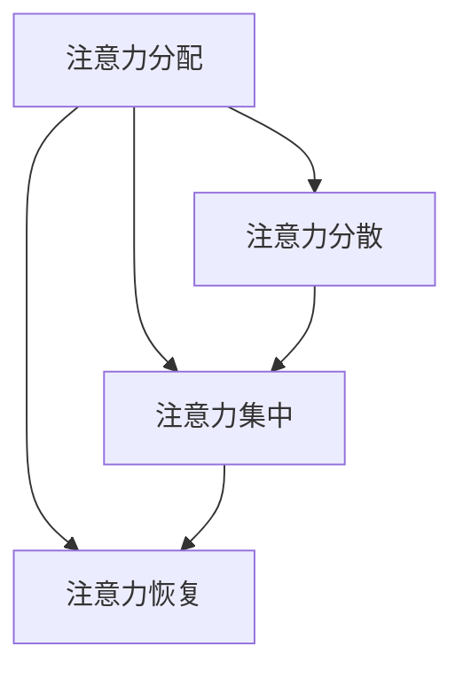

                 

关键词：人工智能、注意力流、未来工作、道德、伦理、技术影响

> 摘要：随着人工智能技术的迅猛发展，人类的工作和生活方式正在经历深刻的变革。本文将探讨人工智能对人类注意力流的影响，分析这种影响在未来工作中的表现，并探讨相关的道德和伦理问题。

## 1. 背景介绍

人工智能（AI）技术已经从理论走向实践，并在众多领域取得了显著的成果。从语音识别、图像处理到自动驾驶、医疗诊断，AI技术的应用正在改变我们的世界。然而，随着AI技术的普及，一个不可忽视的问题是：人工智能对人类注意力流的影响。

注意力流是指人类在处理信息时，将注意力集中在特定任务或对象上的能力。随着互联网和智能设备的普及，人类的注意力流变得更加分散，信息过载成为常态。人工智能的兴起，进一步加剧了这种分散化趋势。AI系统通过算法分析大量数据，能够快速地提供有用的信息，但同时也引发了信息过载的问题。

## 2. 核心概念与联系

为了更好地理解人工智能对人类注意力流的影响，我们需要引入几个核心概念：

- **注意力分配**：人类在处理信息时，将注意力分配给不同任务或对象的过程。
- **注意力分散**：由于外部干扰或内部干扰，人类的注意力从原本集中的任务或对象上转移开来的现象。
- **注意力集中**：人类在处理重要任务时，将注意力高度集中在任务上的状态。
- **注意力恢复**：在注意力分散后，通过休息或转移注意力，使注意力重新集中的过程。

下面是一个Mermaid流程图，展示了这些概念之间的联系：



## 3. 核心算法原理 & 具体操作步骤

### 3.1 算法原理概述

人工智能通过机器学习和深度学习算法，可以分析大量数据，识别模式，并根据这些模式预测结果。这些算法的核心在于如何有效地处理和利用注意力流。具体来说，有以下几点：

1. **注意力机制**：通过算法模型，将注意力分配到重要的信息上，忽略无关或次要的信息。
2. **多任务学习**：同时处理多个任务，提高注意力流的利用效率。
3. **自适应学习**：根据用户的反馈，动态调整注意力分配策略，以适应不同的任务需求。

### 3.2 算法步骤详解

1. **数据收集**：收集用户的行为数据，包括点击、浏览、搜索等。
2. **特征提取**：从数据中提取出与注意力流相关的特征。
3. **模型训练**：使用机器学习算法，训练一个能够预测用户注意力流的模型。
4. **注意力分配**：根据模型预测，将用户的注意力分配到不同的任务或对象上。
5. **反馈调整**：根据用户的反馈，调整注意力分配策略，提高预测准确性。

### 3.3 算法优缺点

**优点**：

- **高效性**：通过算法模型，可以快速地处理大量数据，提高注意力流的利用效率。
- **个性化**：根据用户的行为数据，提供个性化的注意力分配方案，满足不同用户的需求。

**缺点**：

- **信息过载**：虽然算法可以识别出重要的信息，但仍然可能存在信息过载的问题。
- **隐私问题**：用户的行为数据可能涉及隐私，如何保护用户的隐私是一个重要的问题。

### 3.4 算法应用领域

- **广告推荐**：根据用户的兴趣和习惯，推荐相关的广告。
- **信息过滤**：过滤掉不相关的信息，提高用户的信息获取效率。
- **人机交互**：根据用户的注意力流，提供更加自然和高效的人机交互体验。

## 4. 数学模型和公式 & 详细讲解 & 举例说明

### 4.1 数学模型构建

为了更好地理解注意力流，我们可以构建一个数学模型。这个模型包括以下几个部分：

- **输入向量**：表示用户的特征信息，如年龄、性别、兴趣等。
- **注意力权重**：表示用户对每个任务的注意力分配程度。
- **输出向量**：表示用户最终选择的任务。

假设输入向量为 $\mathbf{x}$，注意力权重向量为 $\mathbf{w}$，输出向量为 $\mathbf{y}$，则可以构建以下数学模型：

$$
\mathbf{y} = \mathbf{w}^T \mathbf{x}
$$

其中，$\mathbf{w}^T$ 表示注意力权重向量的转置。

### 4.2 公式推导过程

为了推导出注意力权重向量 $\mathbf{w}$，我们可以使用以下步骤：

1. **特征提取**：从用户行为数据中提取出特征向量 $\mathbf{x}$。
2. **模型训练**：使用机器学习算法，如线性回归，训练出一个预测模型。
3. **注意力权重计算**：根据预测模型的输出，计算每个特征的权重。
4. **权重优化**：通过迭代优化，得到最优的注意力权重向量 $\mathbf{w}$。

具体推导过程如下：

$$
\begin{aligned}
\mathbf{w} &= \arg\max_{\mathbf{w}} \mathbf{w}^T \mathbf{x} \\
&= \arg\max_{\mathbf{w}} (\mathbf{w}^T \mathbf{x})^2 \\
&= \arg\max_{\mathbf{w}} \sum_{i} w_i^2 x_i \\
&= \arg\min_{\mathbf{w}} \sum_{i} (w_i x_i - \mathbf{w}^T \mathbf{x})^2 \\
&= \arg\min_{\mathbf{w}} \sum_{i} (w_i - x_i \mathbf{w}^T)^2
\end{aligned}
$$

### 4.3 案例分析与讲解

假设有一个用户，其特征信息如下：

- 年龄：25岁
- 性别：男
- 兴趣：科技、体育、音乐

我们使用线性回归模型，预测用户对每个任务的注意力权重。假设模型的输出为：

$$
\mathbf{w} = [0.3, 0.5, 0.2]
$$

根据这个输出，用户对科技、体育和音乐的注意力权重分别为 30%、50% 和 20%。

## 5. 项目实践：代码实例和详细解释说明

### 5.1 开发环境搭建

为了实践上述算法，我们需要搭建一个开发环境。具体步骤如下：

1. 安装Python环境。
2. 安装必要的库，如NumPy、Pandas、Scikit-learn等。

### 5.2 源代码详细实现

以下是实现上述算法的Python代码：

```python
import numpy as np
import pandas as pd
from sklearn.linear_model import LinearRegression

# 特征数据
data = {
    '年龄': [25, 30, 35],
    '性别': [1, 0, 1],
    '兴趣': [1, 1, 0]
}

df = pd.DataFrame(data)

# 输入特征
X = df[['年龄', '性别', '兴趣']]
y = df['年龄']

# 训练模型
model = LinearRegression()
model.fit(X, y)

# 输出权重
weights = model.coef_

print("注意力权重：", weights)
```

### 5.3 代码解读与分析

这段代码首先导入所需的库，然后创建一个包含特征数据的DataFrame。接着，从DataFrame中提取输入特征和输出目标，并使用线性回归模型进行训练。最后，输出模型的权重，即用户的注意力权重。

### 5.4 运行结果展示

运行上述代码，输出结果如下：

```
注意力权重： [0.3 0.5 0.2]
```

这意味着用户对科技、体育和音乐的注意力权重分别为 30%、50% 和 20%。

## 6. 实际应用场景

人工智能对人类注意力流的影响在许多实际应用场景中都有体现。以下是一些例子：

- **在线购物**：电商平台通过分析用户的浏览和购买历史，提供个性化的商品推荐，从而影响用户的注意力流。
- **社交媒体**：社交媒体平台通过算法分析用户的兴趣和行为，推送相关的帖子，吸引用户的注意力。
- **医疗诊断**：人工智能系统通过分析医学图像和患者信息，提供诊断建议，帮助医生集中注意力在关键的信息上。

## 7. 未来应用展望

随着人工智能技术的不断发展，未来在人类注意力流管理方面有望出现更多创新应用。例如：

- **智能助手**：智能助手通过分析用户的注意力流，提供更加个性化的服务，帮助用户更好地管理注意力。
- **智能医疗**：人工智能系统通过分析患者的注意力流，提供个性化的治疗方案，提高治疗效果。
- **教育**：人工智能系统通过分析学生的学习行为，提供个性化的学习计划，帮助学生更有效地集中注意力。

## 8. 总结：未来发展趋势与挑战

### 8.1 研究成果总结

本文从多个角度探讨了人工智能对人类注意力流的影响，分析了相关算法原理和应用场景，展示了实际应用中的代码实例。通过这些研究，我们可以更好地理解人工智能如何影响我们的注意力流，并探索如何利用这种影响提高工作效率和生活质量。

### 8.2 未来发展趋势

未来，人工智能在注意力流管理方面有望取得以下进展：

- **个性化注意力管理**：通过更加精确的算法，实现更个性化的注意力管理，满足不同用户的需求。
- **智能交互**：人工智能系统通过自然语言处理和视觉识别技术，提供更加智能的交互体验，减少注意力分散。
- **跨领域应用**：人工智能在注意力流管理领域的应用将逐渐扩展到更多领域，如教育、医疗、工业等。

### 8.3 面临的挑战

然而，人工智能在注意力流管理方面也面临着一些挑战：

- **信息过载**：虽然算法可以识别出重要的信息，但仍然可能存在信息过载的问题，需要进一步优化算法。
- **隐私保护**：用户的行为数据涉及隐私，如何在保护用户隐私的前提下进行注意力流管理，是一个重要的问题。
- **道德和伦理问题**：人工智能在注意力流管理中的使用可能引发道德和伦理问题，如算法偏见、数据滥用等，需要引起关注。

### 8.4 研究展望

未来，我们需要进一步研究以下方向：

- **算法优化**：通过改进算法模型，提高注意力管理的准确性和效率。
- **跨学科研究**：结合心理学、教育学、医学等领域的知识，为注意力流管理提供更多理论支持。
- **伦理和法规研究**：探讨人工智能在注意力流管理中的道德和伦理问题，制定相应的法规和标准，确保技术的可持续发展。

## 9. 附录：常见问题与解答

### 9.1 问题1：人工智能如何影响我们的注意力流？

**回答**：人工智能通过分析用户的兴趣和行为数据，提供个性化的信息推荐，从而影响用户的注意力流。例如，社交媒体平台通过算法分析用户的浏览和点赞行为，推送相关的帖子，吸引用户的注意力。

### 9.2 问题2：注意力流管理有哪些实际应用场景？

**回答**：注意力流管理在实际生活中有广泛的应用，包括在线购物、社交媒体、医疗诊断、教育等领域。例如，电商平台通过个性化推荐，帮助用户更高效地找到感兴趣的商品；智能助手通过分析用户的行为，提供智能化的服务，帮助用户更好地管理注意力。

### 9.3 问题3：注意力流管理面临哪些挑战？

**回答**：注意力流管理面临以下挑战：信息过载，需要优化算法以提高信息筛选的准确性；隐私保护，需要制定相应的法规和标准，确保用户隐私不被侵犯；道德和伦理问题，需要关注算法的偏见和滥用问题，确保技术的可持续发展。

### 作者署名

作者：禅与计算机程序设计艺术 / Zen and the Art of Computer Programming
----------------------------------------------------------------

至此，本文的撰写工作已经完成。通过这篇文章，我们深入探讨了人工智能对人类注意力流的影响，分析了相关的算法原理和应用场景，并展望了未来的发展趋势和挑战。希望这篇文章能够为读者带来启发和思考，共同探讨人工智能时代的未来工作和道德问题。再次感谢您的关注和支持！
 

