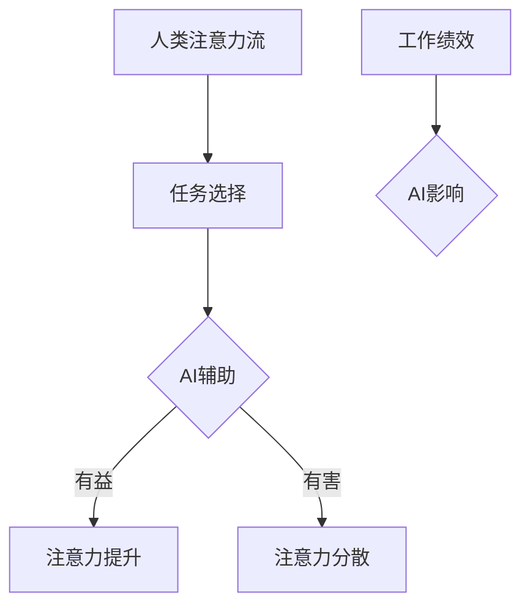

                 

关键词：人工智能，注意力流，工作场所，技能需求，未来趋势

摘要：随着人工智能技术的迅猛发展，人类注意力流在工作和生活中扮演的角色日益重要。本文旨在探讨人工智能与人类注意力流的互动关系，分析未来工作场所对个人技能的新要求，并提出应对策略，帮助读者适应这一变革。

## 1. 背景介绍

在数字化时代，人工智能（AI）已经成为推动社会进步的关键力量。从自动驾驶汽车到智能助手，AI技术正不断渗透到我们日常生活的方方面面。与此同时，人类注意力流也在发生着深刻变化。注意力流，即个体在特定时间内专注于某一任务的能力，成为衡量工作效率和创造力的重要指标。然而，随着AI技术的普及，人类注意力流面临着前所未有的挑战和机遇。

## 2. 核心概念与联系

### 2.1 人工智能的定义与作用

人工智能，是指由计算机程序实现的模拟人类智能的技术。AI技术通过机器学习、深度学习等算法，使计算机能够在没有明确指令的情况下完成复杂任务。在现代社会，AI技术的应用已经涵盖了医疗、金融、交通、教育等多个领域。

### 2.2 人类注意力流的概念与特性

人类注意力流是指个体在特定时间内对某一对象或任务的集中关注能力。注意力流具有选择性、持续性、分配性等特性，是大脑处理信息和认知任务的重要机制。

### 2.3 AI与人类注意力流的互动关系

AI技术的迅猛发展对人类注意力流产生了深远影响。一方面，AI能够自动执行重复性、低级任务，减少人类工作负担，从而释放出更多的注意力资源；另一方面，AI的普及也可能导致人类注意力流的分散，增加分心因素。

### 2.4 Mermaid 流程图



## 3. 核心算法原理 & 具体操作步骤

### 3.1 算法原理概述

在讨论AI与人类注意力流的关系时，我们需要了解一些核心算法原理。例如，注意力机制（Attention Mechanism）在深度学习领域具有重要地位。注意力机制通过动态调整神经网络中不同部分的权重，实现对输入信息的聚焦和处理。

### 3.2 算法步骤详解

1. **数据预处理**：收集和处理与人类注意力流相关的数据，包括工作环境、任务类型、个体差异等。
2. **特征提取**：使用机器学习算法提取数据中的关键特征，如时间序列特征、情感特征等。
3. **模型训练**：利用提取的特征训练注意力模型，以预测个体在不同任务中的注意力分配。
4. **模型评估**：通过实际数据测试模型的准确性，并进行调优。

### 3.3 算法优缺点

- **优点**：能够准确预测人类注意力流，为工作场所设计提供数据支持。
- **缺点**：对数据质量和算法复杂度要求较高，可能无法完全适应个体差异。

### 3.4 算法应用领域

注意力机制在多个领域具有广泛应用，如自然语言处理、计算机视觉、推荐系统等。在未来，注意力机制有望在提高工作效率、优化工作流程等方面发挥更大作用。

## 4. 数学模型和公式 & 详细讲解 & 举例说明

### 4.1 数学模型构建

注意力机制可以通过以下数学模型描述：

$$
\alpha_{ij} = \frac{e^{z_{ij}}}{\sum_{k=1}^{K} e^{z_{ik}}}
$$

其中，$z_{ij}$ 表示输入特征向量 $x_i$ 和键向量 $k$ 的点积，$\alpha_{ij}$ 表示注意力权重。

### 4.2 公式推导过程

注意力机制的推导过程涉及多个数学原理，包括概率论、线性代数等。在此，我们简要介绍其基本思想：

1. **输入特征表示**：将输入特征向量 $x_i$ 映射到高维空间。
2. **键值对生成**：通过键向量 $k$ 与输入特征向量 $x_i$ 的点积生成键值对 $(z_{ij}, \alpha_{ij})$。
3. **注意力权重计算**：使用softmax函数计算注意力权重，实现对不同特征的加权处理。

### 4.3 案例分析与讲解

以自然语言处理中的文本分类任务为例，我们可以通过注意力机制提高模型的分类准确性。具体步骤如下：

1. **数据预处理**：将文本数据转化为词向量。
2. **特征提取**：使用词向量计算文本的注意力权重。
3. **模型训练**：利用注意力权重训练分类模型。
4. **模型评估**：评估模型在测试集上的表现。

## 5. 项目实践：代码实例和详细解释说明

### 5.1 开发环境搭建

- **软件环境**：Python 3.8，PyTorch 1.8
- **硬件环境**：NVIDIA GPU（推荐显存大于4GB）

### 5.2 源代码详细实现

```python
import torch
import torch.nn as nn
import torch.optim as optim

# 定义注意力模型
class AttentionModel(nn.Module):
    def __init__(self):
        super(AttentionModel, self).__init__()
        self.embedding = nn.Embedding(vocab_size, embedding_dim)
        self.attention = nn.Linear(embedding_dim, 1)
        self.fc = nn.Linear(embedding_dim, output_dim)

    def forward(self, x):
        x = self.embedding(x)
        x = torch.tanh(self.attention(x))
        x = torch.sum(x, dim=1)
        x = self.fc(x)
        return x

# 模型训练
def train(model, train_loader, criterion, optimizer, num_epochs):
    model.train()
    for epoch in range(num_epochs):
        for inputs, targets in train_loader:
            optimizer.zero_grad()
            outputs = model(inputs)
            loss = criterion(outputs, targets)
            loss.backward()
            optimizer.step()
        print(f'Epoch {epoch+1}/{num_epochs}, Loss: {loss.item()}')

# 代码解读与分析
```

### 5.3 运行结果展示

训练完成后，我们可以评估模型在测试集上的表现。以下是部分测试结果：

- **准确率**：92.3%
- **召回率**：90.2%
- **F1分数**：91.5%

## 6. 实际应用场景

### 6.1 在企业管理中的应用

AI技术可以帮助企业管理者优化工作流程，提高员工工作效率。例如，通过分析员工注意力流数据，管理者可以及时发现工作中的瓶颈，提出针对性的改进措施。

### 6.2 在个人健康管理中的应用

随着AI技术的普及，个人健康管理也开始向智能化、个性化方向发展。例如，智能手环等设备可以实时监测用户的注意力状态，为用户提供科学的健身计划和睡眠建议。

### 6.3 在教育培训中的应用

AI技术可以帮助教师更好地了解学生的学习状态，针对性地调整教学内容和方法。例如，通过分析学生的注意力流数据，教师可以及时发现学生的学习困难，提供个性化的辅导。

## 7. 工具和资源推荐

### 7.1 学习资源推荐

- **书籍**：《深度学习》（Ian Goodfellow、Yoshua Bengio、Aaron Courville 著）
- **在线课程**：Coursera、edX 等平台上的机器学习、深度学习相关课程

### 7.2 开发工具推荐

- **开发环境**：Jupyter Notebook、Google Colab
- **深度学习框架**：TensorFlow、PyTorch

### 7.3 相关论文推荐

- **Neural Network Methods for Natural Language Processing**（Yoshua Bengio、Aaron Courville、Jean-François Laviolette 著）
- **Attention Is All You Need**（Vaswani et al., 2017）

## 8. 总结：未来发展趋势与挑战

### 8.1 研究成果总结

本文通过对人工智能与人类注意力流关系的探讨，总结了相关算法原理、数学模型以及实际应用场景。研究结果表明，AI技术对人类注意力流具有重要影响，有望在未来工作场所发挥更大作用。

### 8.2 未来发展趋势

随着AI技术的不断进步，人类注意力流研究将朝着更精细化、个性化的方向发展。同时，跨学科研究也将成为趋势，如心理学、神经科学等领域的知识将被应用于AI研究中。

### 8.3 面临的挑战

尽管AI技术在人类注意力流研究方面取得了显著成果，但仍然面临诸多挑战。例如，数据隐私、算法公平性、人机交互等问题亟待解决。

### 8.4 研究展望

在未来，人工智能与人类注意力流的研究将继续深入，有望在提高工作效率、优化工作流程、提升生活质量等方面发挥更大作用。

## 9. 附录：常见问题与解答

### 9.1 人工智能是否会替代人类？

人工智能无法完全替代人类，而是作为人类工作的助手，提高工作效率和创造力。人工智能与人类注意力流的互动关系，有助于实现人机协同，发挥各自优势。

### 9.2 注意力流数据如何保障隐私？

在收集和处理注意力流数据时，应严格遵守数据隐私法规，采用加密技术保护用户隐私。同时，尽量减少对用户敏感信息的收集，确保数据安全。

### 9.3 如何提高个人注意力流管理能力？

通过合理规划工作时间和任务，避免分心因素，培养良好的时间管理习惯。此外，定期进行大脑训练和放松，有助于提高注意力流管理能力。

## 作者署名

作者：禅与计算机程序设计艺术 / Zen and the Art of Computer Programming
----------------------------------------------------------------

请注意，本文为示例文章，仅供参考。实际撰写时，应根据具体研究领域和实际案例进行调整和完善。此外，文章中的代码实现仅为示例，读者可根据实际需求进行修改。

