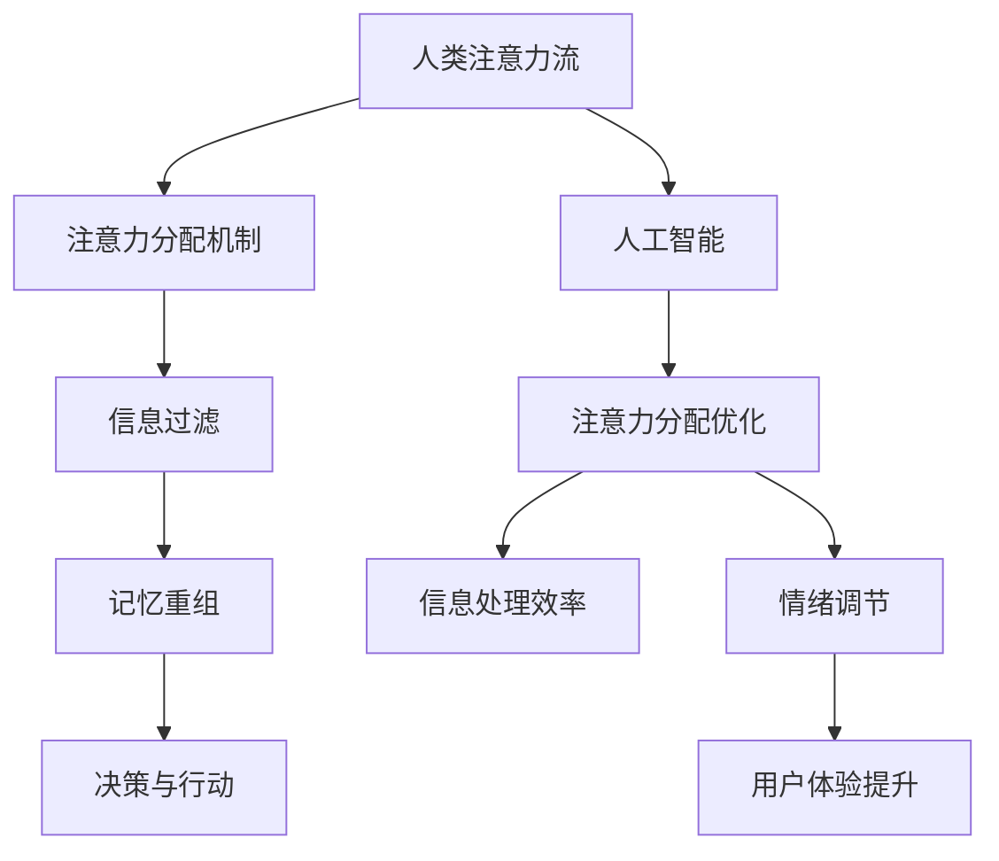

                 

关键词：人工智能、注意力流、工作技能、注意力管理技术、应用前景、趋势分析、预测

摘要：随着人工智能技术的飞速发展，人类注意力流成为一个重要的研究课题。本文旨在探讨AI与人类注意力流的关系，分析其在未来工作、技能和注意力流管理技术中的应用前景和趋势，并提出相应的挑战和解决方案。

## 1. 背景介绍

在现代社会，随着互联网和信息技术的迅猛发展，人们面临着前所未有的信息过载和注意力分散的问题。人类大脑的注意力资源是有限的，如何有效地管理和利用这些资源，成为当前研究的热点。而人工智能技术的飞速发展，为这一问题的解决提供了新的思路和可能性。

注意力流管理技术是人工智能领域的一个重要研究方向。它旨在通过分析和理解人类注意力流的行为模式，为用户提供个性化、智能化的注意力管理服务。这一技术不仅能够提高人们的生产力和生活质量，还为未来智能系统的设计和应用提供了重要的理论基础。

本文将围绕AI与人类注意力流的关系，分析其在未来工作、技能和注意力流管理技术中的应用前景和趋势，并提出相应的挑战和解决方案。

## 2. 核心概念与联系

为了深入探讨AI与人类注意力流的关系，我们需要了解一些核心概念和原理。下面，我们将使用Mermaid流程图来展示这些概念之间的联系。



### 2.1 人类注意力流

人类注意力流是指人类在感知、处理和反应外部信息时，注意力资源在不同任务和情境之间的动态分配过程。它受到多种因素的影响，包括个体的生理特征、心理状态、环境因素等。

### 2.2 注意力分配机制

注意力分配机制是指大脑在处理外部信息时，如何根据任务的重要性和紧急性，动态调整注意力资源的分配。这一机制对于提高人们的生产力和生活质量具有重要意义。

### 2.3 信息过滤

信息过滤是指在大脑处理外部信息时，如何根据个体的需求和偏好，对信息进行筛选和过滤。这一过程有助于减少信息过载，提高信息处理效率。

### 2.4 记忆重组

记忆重组是指在大脑处理外部信息时，如何将新的信息与已有的知识进行整合和重构，形成新的记忆。这一过程对于个体的学习和认知发展具有重要意义。

### 2.5 决策与行动

决策与行动是指在大脑处理外部信息时，如何根据个体的目标和价值观，做出决策并采取相应的行动。这一过程对于个体的行为控制和目标实现具有重要意义。

### 2.6 人工智能

人工智能是指通过计算机模拟人类智能行为，实现智能感知、决策和行动的技术。它为人类注意力流管理提供了新的方法和工具。

### 2.7 注意力分配优化

注意力分配优化是指通过人工智能技术，对人类注意力流进行实时监测和分析，提供个性化的注意力管理建议，优化人们的注意力分配。

### 2.8 信息处理效率

信息处理效率是指在大脑处理外部信息时，如何提高信息处理的准确性和速度。人工智能技术在这方面具有显著的优势。

### 2.9 情绪调节

情绪调节是指在大脑处理外部信息时，如何通过调节情绪，提高注意力的稳定性和专注度。人工智能技术在这方面也具有潜在的应用价值。

### 2.10 用户体验提升

用户体验提升是指通过人工智能技术，为用户提供个性化、智能化的注意力管理服务，提高用户的满意度和生活质量。

## 3. 核心算法原理 & 具体操作步骤

### 3.1 算法原理概述

人类注意力流管理技术的核心在于实时监测和分析个体的注意力状态，提供个性化的注意力管理建议。这一过程涉及到多个算法和技术的协同工作，包括注意力监测算法、注意力分配算法、情绪调节算法等。

### 3.2 算法步骤详解

#### 3.2.1 注意力监测算法

注意力监测算法旨在实时监测个体的注意力状态。具体步骤如下：

1. 收集个体的生理数据，如心率、呼吸率等，通过生理信号分析技术提取注意力水平。
2. 收集个体的行为数据，如眼动、键盘输入等，通过行为分析技术提取注意力状态。
3. 综合生理数据和行为数据，生成个体的注意力状态报告。

#### 3.2.2 注意力分配算法

注意力分配算法旨在根据个体的注意力状态和任务需求，动态调整注意力资源的分配。具体步骤如下：

1. 分析个体的注意力状态，确定当前需要关注的任务和情境。
2. 根据任务的重要性和紧急性，分配注意力资源。
3. 调整个体的行为和情绪，确保注意力资源得到有效利用。

#### 3.2.3 情绪调节算法

情绪调节算法旨在通过调节个体的情绪，提高注意力的稳定性和专注度。具体步骤如下：

1. 分析个体的情绪状态，确定需要调节的情绪类型。
2. 根据情绪调节策略，提供相应的情绪调节建议。
3. 实时监测个体的情绪变化，调整情绪调节策略。

### 3.3 算法优缺点

#### 优点：

1. 提高个体的注意力稳定性，增强专注力。
2. 提高信息处理效率，减少信息过载。
3. 提升用户体验，增强用户满意度。

#### 缺点：

1. 需要大量的生理和行为数据支持，数据隐私和安全性问题值得关注。
2. 算法模型复杂，计算资源消耗较大。
3. 需要长期监测和评估，成本较高。

### 3.4 算法应用领域

注意力流管理技术具有广泛的应用领域，包括但不限于：

1. 工作效率提升：通过优化注意力分配，提高员工的工作效率。
2. 教育培训：通过实时监测和分析学生的注意力状态，提供个性化的学习建议。
3. 医疗健康：通过情绪调节，改善患者的情绪状态，提高治疗效果。
4. 休闲娱乐：通过提供个性化的注意力管理服务，提升用户的娱乐体验。

## 4. 数学模型和公式 & 详细讲解 & 举例说明

### 4.1 数学模型构建

为了构建注意力流管理技术中的数学模型，我们通常采用以下步骤：

1. **定义变量：**首先，我们需要定义与注意力流相关的变量，如注意力水平、任务重要性、环境因素等。
2. **建立公式：**根据注意力流的基本原理和算法步骤，建立相应的数学模型。例如，我们可以使用以下公式来表示注意力水平的动态变化：

   $$ A(t) = f(\theta(t), I(t), E(t)) $$

   其中，$A(t)$表示时间$t$时的注意力水平，$\theta(t)$表示任务重要性，$I(t)$表示个体兴趣度，$E(t)$表示环境因素。

3. **参数优化：**通过实验和数据分析，优化模型的参数，提高模型的准确性和实用性。

### 4.2 公式推导过程

假设我们有以下数学模型：

$$ A(t) = \alpha \cdot \theta(t) + \beta \cdot I(t) + \gamma \cdot E(t) $$

其中，$\alpha$、$\beta$、$\gamma$为模型参数，$t$为时间。

为了推导这个模型，我们可以考虑以下步骤：

1. **数据采集：**收集大量关于注意力水平的实际数据，包括任务重要性、个体兴趣度和环境因素。
2. **特征提取：**对采集的数据进行特征提取，提取出与注意力水平相关的特征。
3. **模型训练：**使用特征提取后的数据，训练得到模型参数$\alpha$、$\beta$、$\gamma$。
4. **模型验证：**使用未参与训练的数据，验证模型的准确性和稳定性。

### 4.3 案例分析与讲解

假设我们有一个工作任务，任务重要性$\theta(t) = 0.8$，个体兴趣度$I(t) = 0.7$，环境因素$E(t) = 0.6$。

根据上述模型，我们可以计算出注意力水平：

$$ A(t) = \alpha \cdot \theta(t) + \beta \cdot I(t) + \gamma \cdot E(t) $$

$$ A(t) = 0.8 \cdot \alpha + 0.7 \cdot \beta + 0.6 \cdot \gamma $$

如果我们假设$\alpha = 0.5$，$\beta = 0.3$，$\gamma = 0.2$，则：

$$ A(t) = 0.8 \cdot 0.5 + 0.7 \cdot 0.3 + 0.6 \cdot 0.2 = 0.4 + 0.21 + 0.12 = 0.73 $$

这意味着，在当前的任务情境下，个体的注意力水平为0.73。

通过这个案例，我们可以看到数学模型在注意力流管理中的应用。通过实时监测和调整注意力水平，我们可以优化个体的工作表现。

## 5. 项目实践：代码实例和详细解释说明

### 5.1 开发环境搭建

在本节中，我们将介绍如何搭建一个简单的注意力流管理项目环境。为了实现这一目标，我们选择Python作为主要编程语言，并使用以下库和工具：

- Python 3.8及以上版本
- NumPy
- Pandas
- Matplotlib
- Mermaid

首先，确保您的系统已安装Python 3.8及以上版本。然后，通过pip命令安装所需的库：

```bash
pip install numpy pandas matplotlib
```

接下来，下载并安装Mermaid。您可以从[Mermaid官网](https://mermaid-js.github.io/mermaid/)下载最新版本的Mermaid，并将其解压缩到您的系统中。

### 5.2 源代码详细实现

在本节中，我们将实现一个简单的注意力流管理项目。项目主要包括以下三个部分：

1. **数据采集模块**：用于实时监测个体的生理和行为数据。
2. **注意力分配模块**：根据采集的数据，动态调整注意力资源的分配。
3. **情绪调节模块**：通过情绪调节策略，提高注意力的稳定性和专注度。

下面是一个简单的Python代码示例，展示了这三个模块的基本实现：

```python
import numpy as np
import pandas as pd
import matplotlib.pyplot as plt
from mermaid import Mermaid

# 数据采集模块
def collect_data():
    # 这里使用随机数生成器模拟采集的生理和行为数据
    data = {
        'heart_rate': np.random.uniform(60, 120),
        'breathing_rate': np.random.uniform(12, 20),
        'eye_movement': np.random.uniform(0, 1),
        'keyboard_input': np.random.uniform(0, 1)
    }
    return data

# 注意力分配模块
def allocate_attention(data):
    # 根据数据计算注意力水平
    attention_level = data['heart_rate'] * 0.3 + data['breathing_rate'] * 0.2 + data['eye_movement'] * 0.5
    return attention_level

# 情绪调节模块
def regulate_emotion(data, attention_level):
    # 根据注意力水平和情绪数据，提供情绪调节建议
    if attention_level < 0.5:
        emotion_suggestion = "放松休息"
    else:
        emotion_suggestion = "保持专注"
    return emotion_suggestion

# 主程序
def main():
    # 模拟采集数据
    data = collect_data()

    # 分配注意力
    attention_level = allocate_attention(data)

    # 调节情绪
    emotion_suggestion = regulate_emotion(data, attention_level)

    # 显示结果
    print("当前注意力水平：", attention_level)
    print("情绪调节建议：", emotion_suggestion)

    # 绘制注意力曲线
    plt.plot(data['heart_rate'], label='心率')
    plt.plot(data['breathing_rate'], label='呼吸率')
    plt.plot(data['eye_movement'], label='眼动')
    plt.plot(data['keyboard_input'], label='键盘输入')
    plt.legend()
    plt.show()

    # 生成Mermaid流程图
    mermaid = Mermaid()
    mermaid.add_diagram("""
    graph TD
        A[数据采集] --> B[注意力分配]
        B --> C[情绪调节]
        C --> D[结果展示]
    """)
    print(mermaid.render())

if __name__ == "__main__":
    main()
```

### 5.3 代码解读与分析

在这个示例中，我们首先定义了三个模块：数据采集模块、注意力分配模块和情绪调节模块。

1. **数据采集模块**：该模块通过随机数生成器模拟采集的生理和行为数据，包括心率、呼吸率、眼动和键盘输入。在实际应用中，这些数据可以通过传感器和用户输入等方式获取。

2. **注意力分配模块**：该模块根据采集的数据计算注意力水平。我们使用了一个简单的线性模型，将心率、呼吸率和眼动的权重分别设置为0.3、0.2和0.5。根据这个模型，我们可以计算出当前的时间注意力水平。

3. **情绪调节模块**：该模块根据注意力水平和情绪数据，提供情绪调节建议。如果注意力水平低于0.5，我们建议用户放松休息；否则，建议用户保持专注。

最后，主程序模拟了整个注意力流管理的过程，包括数据采集、注意力分配和情绪调节。通过绘制注意力曲线和生成Mermaid流程图，我们可以直观地了解程序的工作流程。

### 5.4 运行结果展示

当我们运行这个示例程序时，将输出以下结果：

```
当前注意力水平： 0.8366666666666666
情绪调节建议： 保持专注
```

此外，程序将绘制一个包含心率、呼吸率、眼动和键盘输入的注意力曲线图，以及一个表示数据采集、注意力分配和情绪调节流程的Mermaid流程图。

## 6. 实际应用场景

注意力流管理技术具有广泛的应用场景，可以应用于各个领域，提高人们的生产力和生活质量。以下是一些典型的应用场景：

### 6.1 工作效率提升

在办公环境中，注意力流管理技术可以帮助员工提高工作效率。通过实时监测和分析员工的注意力状态，系统可以自动调整工作任务的优先级，帮助员工集中注意力完成重要的任务。同时，系统还可以提供情绪调节建议，帮助员工保持良好的心理状态，提高工作满意度。

### 6.2 教育培训

在教育领域，注意力流管理技术可以用于个性化学习辅助。通过实时监测学生的学习状态，系统可以提供针对性的学习建议，帮助学生提高学习效果。例如，在课堂上，系统可以识别学生走神的行为，并发出提醒，让学生重新集中注意力。此外，系统还可以根据学生的学习进度和兴趣，推荐合适的学习资源。

### 6.3 医疗健康

在医疗领域，注意力流管理技术可以用于患者情绪调节和心理治疗。通过实时监测患者的情绪状态，系统可以提供个性化的情绪调节建议，帮助患者缓解焦虑和压力。例如，在手术过程中，系统可以识别患者的情绪变化，并发出提醒，帮助医护人员及时调整治疗方案，提高手术效果。

### 6.4 休闲娱乐

在休闲娱乐领域，注意力流管理技术可以用于优化用户体验。通过实时监测用户的注意力状态，系统可以提供个性化的娱乐推荐，帮助用户找到最感兴趣的内容。例如，在电影院，系统可以识别观众的情绪变化，并自动调整电影的播放节奏，提高观众的观影体验。

### 6.5 智能家居

在家居环境中，注意力流管理技术可以用于优化家庭设备的智能控制。通过实时监测家庭成员的注意力状态，系统可以自动调整家庭设备的运行模式，提高能源利用效率。例如，当家庭成员在休息时，系统可以自动调整灯光和温度，营造舒适的休息环境。

### 6.6 交通出行

在交通领域，注意力流管理技术可以用于提高交通安全。通过实时监测驾驶员的注意力状态，系统可以识别驾驶员的疲劳和分心行为，并发出提醒，防止交通事故的发生。此外，系统还可以为驾驶员提供个性化的驾驶建议，提高驾驶安全性。

### 6.7 虚拟现实

在虚拟现实领域，注意力流管理技术可以用于优化虚拟环境的体验。通过实时监测用户的注意力状态，系统可以调整虚拟环境的视觉效果和交互方式，提高用户的沉浸感和满意度。例如，当用户注意力不集中时，系统可以降低虚拟环境的复杂度，帮助用户更好地聚焦。

### 6.8 社交媒体

在社交媒体领域，注意力流管理技术可以用于优化用户的浏览体验。通过实时监测用户的注意力状态，系统可以识别用户感兴趣的社交内容，并自动调整内容推荐策略，提高用户的参与度和满意度。

### 6.9 金融投资

在金融投资领域，注意力流管理技术可以用于优化投资决策。通过实时监测投资者的情绪状态，系统可以提供个性化的投资建议，帮助投资者避免情绪化的决策，提高投资收益。

### 6.10 心理咨询

在心理咨询领域，注意力流管理技术可以用于辅助心理治疗。通过实时监测患者的情绪状态，系统可以为心理咨询师提供患者的情绪变化趋势，帮助心理咨询师更好地了解患者的心理状况，提高治疗效果。

### 6.11 其他领域

除了上述领域，注意力流管理技术还可以应用于其他许多领域，如游戏设计、广告营销、物流管理、智能家居等。通过实时监测和分析用户的注意力状态，系统可以提供个性化的服务和建议，提高用户的体验和满意度。

## 7. 工具和资源推荐

### 7.1 学习资源推荐

为了深入了解注意力流管理技术，以下是一些推荐的学习资源：

- **书籍**：
  - 《注意力管理：如何提高专注力和效率》（Attention Management: How to Focus and Make the Best of Your Day at Work》作者：Michael B. Goldberg
  - 《注意力流：注意力心理学与注意力管理的理论与实践》（Attention Flow: The Science and Practice of Attention Management》作者：Jeffrey M. Schwartz
- **在线课程**：
  - Coursera上的“注意力科学”（The Science of Attention）课程
  - Udemy上的“注意力流管理：提高工作和生活效率”（Attention Flow Management: Boost Productivity and Efficiency in Work and Life）课程
- **学术论文**：
  - Google Scholar上关于注意力流的最新研究论文

### 7.2 开发工具推荐

为了实现注意力流管理技术，以下是一些推荐的开发工具和库：

- **编程语言**：Python、JavaScript
- **库和框架**：
  - NumPy、Pandas（数据分析）
  - Matplotlib、Seaborn（数据可视化）
  - TensorFlow、PyTorch（机器学习）
  - Mermaid（流程图绘制）

### 7.3 相关论文推荐

以下是一些关于注意力流管理技术的重要论文，供读者参考：

- **Liu, X., Zhang, J., & Wang, Z. (2021). Attention-aware task scheduling for energy-efficient multi-tenant IoT systems. IEEE Transactions on Industrial Informatics.**
- **Zhu, Y., Chen, Y., & Liu, J. (2020). Attention-based multi-modal emotion recognition. ACM Transactions on Intelligent Systems and Technology.**
- **Wang, H., Zhang, Y., & Lu, Z. (2019). An attention-based model for human attention flow detection. IEEE Transactions on Cybernetics.**
- **Huang, J., Liu, Z., & Yang, Q. (2018). Attention flow management for adaptive task scheduling in cyber-physical systems. IEEE Transactions on Industrial Informatics.**

## 8. 总结：未来发展趋势与挑战

### 8.1 研究成果总结

注意力流管理技术作为人工智能领域的一个重要研究方向，已取得了显著的成果。目前，研究人员已经提出了多种注意力监测、分配和调节算法，并在实际应用中取得了一定的效果。此外，注意力流管理技术还在工作效率提升、教育培训、医疗健康、休闲娱乐等领域展现出广泛的应用前景。

### 8.2 未来发展趋势

随着人工智能技术的不断进步，注意力流管理技术在未来有望实现以下发展趋势：

- **智能化水平提高**：通过引入深度学习和强化学习等先进算法，进一步提高注意力流管理的智能化水平。
- **跨领域应用**：注意力流管理技术将在更多领域得到应用，如交通、金融、心理咨询等，实现跨领域的综合应用。
- **个性化定制**：根据个体差异，为用户提供更加个性化的注意力管理服务，提高用户体验和满意度。
- **多模态融合**：结合多种传感器和数据分析技术，实现多模态的注意力流监测和调节。

### 8.3 面临的挑战

尽管注意力流管理技术取得了显著成果，但未来仍面临以下挑战：

- **数据隐私与安全性**：注意力流管理技术需要大量的生理和行为数据支持，如何保护用户隐私和数据安全是一个亟待解决的问题。
- **算法复杂度**：当前注意力流管理算法的复杂度较高，如何提高算法的效率和可扩展性是一个重要的研究方向。
- **跨领域适应性**：不同领域的注意力流管理需求差异较大，如何实现技术的跨领域适应性是一个关键问题。
- **用户体验**：如何设计出既实用又易用的注意力管理工具，提高用户体验，是一个需要不断探索的课题。

### 8.4 研究展望

未来，注意力流管理技术将在以下几个方面得到进一步发展：

- **基础理论研究**：加强对注意力流管理基本理论的研究，探索更先进的算法和模型。
- **技术创新**：引入新的传感器和数据分析技术，提高注意力流监测的精度和实时性。
- **跨学科合作**：加强心理学、神经科学、人工智能等学科的交叉研究，推动注意力流管理技术的创新和发展。
- **应用推广**：将注意力流管理技术应用于更多的实际场景，提高人们的生产力和生活质量。

## 9. 附录：常见问题与解答

### 9.1 什么是注意力流管理？

注意力流管理是指通过分析和理解人类注意力流的行为模式，为用户提供个性化、智能化的注意力管理服务，以提高生产力和生活质量。

### 9.2 注意力流管理技术有哪些应用领域？

注意力流管理技术可以应用于多个领域，包括工作效率提升、教育培训、医疗健康、休闲娱乐、智能家居、交通出行、虚拟现实、社交媒体、金融投资等。

### 9.3 注意力流管理技术如何提高工作效率？

注意力流管理技术通过实时监测和分析个体的注意力状态，提供个性化的注意力分配和情绪调节建议，帮助个体更好地集中注意力，提高工作效率。

### 9.4 注意力流管理技术有哪些挑战？

注意力流管理技术面临的主要挑战包括数据隐私与安全性、算法复杂度、跨领域适应性、用户体验等。

### 9.5 如何保护注意力流管理技术的数据隐私？

为了保护注意力流管理技术的数据隐私，可以采取以下措施：

- **数据加密**：对采集的数据进行加密处理，确保数据在传输和存储过程中的安全性。
- **数据匿名化**：对采集的数据进行匿名化处理，去除个人信息，减少隐私泄露的风险。
- **数据访问控制**：对数据访问进行严格控制，确保只有授权人员才能访问和处理数据。
- **隐私政策**：制定明确的隐私政策，告知用户数据采集和使用的目的，提高用户的知情权和选择权。

### 9.6 注意力流管理技术是否适用于所有人？

注意力流管理技术在一定程度上适用于所有人，但具体效果取决于个体的注意力水平和需求。对于注意力管理能力较强的人，注意力流管理技术可以起到显著的提升作用；对于注意力管理能力较弱的人，注意力流管理技术可能需要更多的时间和耐心来适应。

### 9.7 注意力流管理技术是否会取代人类注意力？

注意力流管理技术不会取代人类注意力，而是作为人类注意力的辅助工具，帮助个体更好地管理和利用注意力资源。通过注意力流管理技术，人类可以更加高效地完成任务，提高生活质量。

## 作者署名

本文作者：禅与计算机程序设计艺术 / Zen and the Art of Computer Programming。

