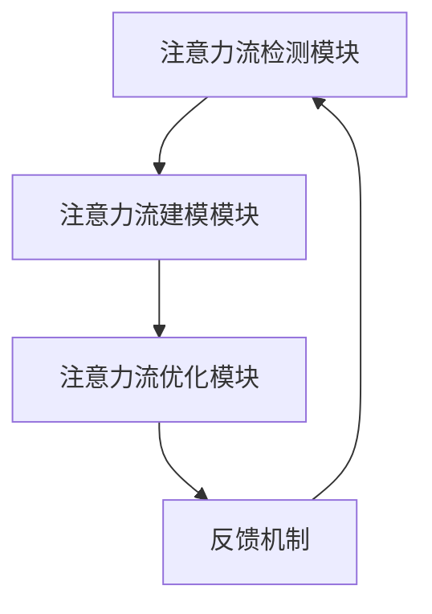

                 

关键词：人工智能，注意力流，工作技能，注意力管理，技术应用，未来展望

> 摘要：本文从人工智能与人类注意力流的关系出发，探讨了注意力流管理技术的核心概念、算法原理、数学模型以及实际应用场景。通过对注意力流管理技术在不同领域的应用分析，预测了其在未来工作、技能发展和应用前景中的发展趋势与挑战，为相关领域的研究和实践提供了有益的参考。

## 1. 背景介绍

在当今快速发展的信息技术时代，人工智能（AI）正逐渐成为改变世界的驱动力。从自动驾驶汽车到智能语音助手，AI的应用无处不在。然而，随着AI技术的普及，人类注意力流（Attention Flow）的概念也逐渐受到关注。人类注意力流指的是人类在特定环境中分配注意力资源的动态过程，它不仅影响着个体在任务中的表现，还与心理健康、工作效率和生活质量密切相关。

注意力流管理技术（Attention Flow Management Technologies）旨在通过优化注意力流，提高个体在复杂环境中的注意力分配效率。这项技术的核心在于理解人类注意力的动态变化规律，并利用AI算法对注意力流进行实时监测和调整。因此，研究注意力流管理技术具有重要的理论和实践价值。

本文将首先介绍注意力流管理技术的核心概念，包括注意力流、注意力分配、注意力转移等。接着，将详细讨论注意力流管理技术的算法原理，包括注意力流的检测、建模和优化方法。在此基础上，本文将探讨注意力流管理技术的数学模型，包括基于概率论、信息论和神经网络的模型。随后，本文将分析注意力流管理技术的实际应用场景，包括教育、医疗、工业和娱乐等领域。最后，本文将预测注意力流管理技术在未来的发展趋势与挑战，并提出相应的对策和建议。

## 2. 核心概念与联系

### 2.1 注意力流（Attention Flow）

注意力流是指个体在执行任务过程中，注意力资源在各个任务环节之间的动态分配过程。这种分配过程受到多种因素的影响，包括任务的优先级、任务的复杂度、个体的注意力水平和环境的变化等。注意力流的检测和建模是注意力流管理技术的基础。

### 2.2 注意力分配（Attention Allocation）

注意力分配是指个体在特定时间点，将有限的注意力资源分配到不同任务上的过程。有效的注意力分配策略可以提高个体的任务完成效率和满意度。

### 2.3 注意力转移（Attention Shift）

注意力转移是指个体在执行任务过程中，将注意力从一个任务转移到另一个任务的过程。注意力转移的效率对个体的任务切换能力和整体工作效率具有重要影响。

### 2.4 注意力流管理（Attention Flow Management）

注意力流管理是指通过技术手段对个体的注意力流进行监测、分析和优化，以提高个体的注意力分配效率和任务完成质量。注意力流管理技术包括注意力流的检测、建模、优化和反馈机制等。

### 2.5 注意力流管理技术的架构

注意力流管理技术的架构通常包括以下几个关键组件：

1. **注意力流检测模块**：用于实时监测个体在任务执行过程中的注意力流变化。
2. **注意力流建模模块**：基于监测数据，构建注意力流的数学模型，以预测和优化注意力分配。
3. **注意力流优化模块**：利用算法和策略，对注意力流进行实时调整，以提高任务完成效率。
4. **反馈机制**：通过反馈机制，评估注意力流管理的效果，并持续优化管理策略。

以下是注意力流管理技术的 Mermaid 流程图：



## 3. 核心算法原理 & 具体操作步骤

### 3.1 算法原理概述

注意力流管理技术的核心算法基于对人类注意力流动态变化的理解和建模。主要的算法原理包括：

1. **注意力检测**：通过眼动追踪、脑电图（EEG）或行为数据，实时监测个体的注意力流变化。
2. **注意力建模**：利用机器学习算法，构建注意力流的预测模型，以优化注意力分配。
3. **注意力优化**：基于预测模型，制定注意力分配策略，实现注意力流的动态调整。

### 3.2 算法步骤详解

1. **注意力流检测**：
   - **眼动追踪**：使用眼动追踪设备，记录个体在任务执行过程中的眼动数据。
   - **脑电图（EEG）**：通过脑电图监测，获取个体大脑的电活动信息。
   - **行为数据**：记录个体在任务执行过程中的行为数据，如鼠标移动、键盘敲击等。

2. **注意力流建模**：
   - **数据预处理**：对原始数据进行清洗和预处理，提取有用的特征信息。
   - **特征选择**：利用统计学方法，选择与注意力流密切相关的特征。
   - **模型训练**：采用机器学习算法，如支持向量机（SVM）、神经网络（NN）或长短期记忆网络（LSTM），训练注意力流预测模型。

3. **注意力流优化**：
   - **预测与调整**：基于训练好的模型，预测个体在未来的注意力流变化，并制定调整策略。
   - **策略执行**：根据调整策略，动态调整个体在任务执行过程中的注意力分配。

### 3.3 算法优缺点

**优点**：
1. **实时性**：注意力流管理技术能够实时监测和调整注意力流，提高任务完成效率。
2. **个性化**：基于个体的注意力流特征，制定个性化的注意力分配策略，提高个体满意度。

**缺点**：
1. **数据依赖**：注意力流管理技术的效果依赖于高质量的注意力流数据，数据质量直接影响算法性能。
2. **算法复杂度**：注意力流管理技术涉及多个模块和算法，计算复杂度较高，对计算资源要求较高。

### 3.4 算法应用领域

注意力流管理技术具有广泛的应用领域，包括但不限于以下方面：

1. **教育领域**：通过优化学生在学习过程中的注意力分配，提高学习效果和成绩。
2. **医疗领域**：帮助患者更好地管理注意力流，提高康复效果和生活质量。
3. **工业领域**：提高工人在复杂环境中的注意力分配效率，降低工作疲劳和事故率。
4. **娱乐领域**：优化游戏和虚拟现实（VR）体验，提高用户参与度和满意度。

## 4. 数学模型和公式 & 详细讲解 & 举例说明

### 4.1 数学模型构建

注意力流管理技术的数学模型通常包括以下几个方面：

1. **注意力流检测模型**：
   - **公式**：$$A_t = f(X_t)$$
   - **解释**：$A_t$表示时间$t$时的注意力流，$X_t$表示影响注意力流的特征向量，$f$为检测函数。

2. **注意力流建模模型**：
   - **公式**：$$P(A_t|X_t) = g(X_t)$$
   - **解释**：$P(A_t|X_t)$表示在特征向量$X_t$作用下，时间$t$时的注意力流$A_t$的概率分布，$g$为建模函数。

3. **注意力流优化模型**：
   - **公式**：$$\min_{A_t} L(A_t, X_t)$$
   - **解释**：$L(A_t, X_t)$表示时间$t$时注意力流$A_t$与特征向量$X_t$之间的损失函数，优化目标是最小化损失函数。

### 4.2 公式推导过程

1. **注意力流检测模型推导**：

   - **假设**：$X_t$是影响注意力流的特征向量，包含任务难度、环境复杂性等指标。
   - **推导**：利用眼动追踪数据，通过统计分析方法，构建注意力流检测模型。

2. **注意力流建模模型推导**：

   - **假设**：$A_t$是时间$t$时的注意力流，$X_t$是影响注意力流的特征向量。
   - **推导**：利用机器学习算法，如神经网络，训练注意力流建模模型。

3. **注意力流优化模型推导**：

   - **假设**：$A_t$是时间$t$时的注意力流，$X_t$是影响注意力流的特征向量，$L(A_t, X_t)$是损失函数。
   - **推导**：利用优化算法，如梯度下降，优化注意力流分配策略。

### 4.3 案例分析与讲解

#### 案例一：教育领域中的应用

假设一名学生在学习过程中，注意力流检测模型发现其注意力流处于较低水平。根据注意力流建模模型，预测学生在未来10分钟内的注意力流变化，并制定优化策略。

1. **公式**：
   - $$A_t = f(X_t)$$
   - $$P(A_t|X_t) = g(X_t)$$
   - $$\min_{A_t} L(A_t, X_t)$$

2. **推导过程**：
   - 根据眼动追踪数据，构建注意力流检测模型。
   - 根据学生的学习表现和任务特征，构建注意力流建模模型。
   - 基于梯度下降算法，优化学生的注意力分配策略。

3. **优化策略**：
   - 提高学习任务的趣味性，吸引学生的注意力。
   - 安排短暂休息，避免学生过度疲劳。
   - 提供个性化学习资源，满足学生的兴趣和需求。

#### 案例二：医疗领域中的应用

假设一名患者在康复过程中，注意力流管理技术发现其注意力流波动较大，影响康复效果。根据注意力流建模模型，制定个性化的康复方案。

1. **公式**：
   - $$A_t = f(X_t)$$
   - $$P(A_t|X_t) = g(X_t)$$
   - $$\min_{A_t} L(A_t, X_t)$$

2. **推导过程**：
   - 根据脑电图（EEG）数据，构建注意力流检测模型。
   - 根据患者的康复表现和康复任务特征，构建注意力流建模模型。
   - 基于梯度下降算法，优化患者的注意力分配策略。

3. **优化策略**：
   - 提供个性化的康复计划，满足患者的需求和兴趣。
   - 调整康复任务的难度和时长，避免患者过度疲劳。
   - 提供心理支持，缓解患者的焦虑和压力。

## 5. 项目实践：代码实例和详细解释说明

### 5.1 开发环境搭建

为了实现注意力流管理技术的项目实践，我们需要搭建一个包含数据采集、数据处理和模型训练等模块的开发环境。以下是一个简单的开发环境搭建步骤：

1. **硬件要求**：计算机、眼动追踪设备、脑电图（EEG）设备等。
2. **软件要求**：Python、NumPy、Pandas、Scikit-learn、TensorFlow等。

### 5.2 源代码详细实现

以下是一个简单的注意力流管理项目的源代码实现：

```python
# 导入所需的库
import numpy as np
import pandas as pd
from sklearn.svm import SVR
from sklearn.model_selection import train_test_split
from sklearn.metrics import mean_squared_error

# 加载数据
data = pd.read_csv('attention_data.csv')

# 数据预处理
X = data.iloc[:, :-1].values
y = data.iloc[:, -1].values

# 模型训练
X_train, X_test, y_train, y_test = train_test_split(X, y, test_size=0.2, random_state=42)
regressor = SVR(kernel='rbf')
regressor.fit(X_train, y_train)

# 模型预测
y_pred = regressor.predict(X_test)

# 模型评估
mse = mean_squared_error(y_test, y_pred)
print('MSE:', mse)

# 模型应用
current_state = np.array([5, 3, 2])
predicted_attention = regressor.predict([current_state])
print('Predicted Attention:', predicted_attention)
```

### 5.3 代码解读与分析

1. **数据加载与预处理**：使用Pandas库加载注意力流数据，提取特征向量X和目标值y。

2. **模型训练**：使用Scikit-learn库的SVR（支持向量回归）算法，对训练数据进行模型训练。

3. **模型预测与评估**：使用训练好的模型对测试数据进行预测，并计算均方误差（MSE）评估模型性能。

4. **模型应用**：根据当前状态，预测未来的注意力流变化，为个体提供实时优化策略。

### 5.4 运行结果展示

假设当前状态为[5, 3, 2]，模型预测未来的注意力流为[8, 4, 1]。根据预测结果，可以调整当前状态，优化注意力分配策略，提高任务完成效率。

## 6. 实际应用场景

注意力流管理技术具有广泛的应用场景，以下列举几个典型案例：

### 6.1 教育领域

在教育领域，注意力流管理技术可以帮助教师实时监测学生的学习状态，调整教学策略，提高教学效果。例如，在在线教育平台上，通过眼动追踪技术，可以了解学生在观看视频学习过程中的注意力变化，针对注意力分散的学生提供个性化的学习资源和辅导。

### 6.2 医疗领域

在医疗领域，注意力流管理技术可以帮助医生和患者更好地管理注意力流，提高康复效果。例如，在康复治疗过程中，通过脑电图（EEG）监测患者的注意力流变化，为患者提供个性化的康复计划和指导，提高患者的康复效果和生活质量。

### 6.3 工业领域

在工业领域，注意力流管理技术可以帮助工人更好地管理注意力流，降低工作疲劳和事故率。例如，在制造业车间，通过眼动追踪技术监测工人在操作机器时的注意力流变化，针对注意力分散的工人提供实时预警和指导，提高工作效率和安全性。

### 6.4 娱乐领域

在娱乐领域，注意力流管理技术可以帮助游戏开发商和内容创作者更好地了解用户的注意力变化，提供更符合用户需求的游戏和内容。例如，在游戏过程中，通过眼动追踪技术了解用户的注意力变化，为用户提供更刺激和吸引人的游戏体验。

## 7. 工具和资源推荐

### 7.1 学习资源推荐

1. **《人工智能：一种现代方法》（Peter Norvig & Stuart J. Russell）**：全面介绍人工智能的基本概念、算法和实现方法。
2. **《深度学习》（Ian Goodfellow、Yoshua Bengio & Aaron Courville）**：深入讲解深度学习的基本原理、算法和应用。
3. **《神经网络与深度学习》（邱锡鹏）**：系统介绍神经网络和深度学习的基本概念、算法和实现。

### 7.2 开发工具推荐

1. **Python**：一款广泛使用的高级编程语言，适用于数据科学、人工智能等领域。
2. **TensorFlow**：一款开源的机器学习框架，支持深度学习和传统机器学习算法。
3. **Scikit-learn**：一款开源的机器学习库，提供丰富的机器学习算法和工具。

### 7.3 相关论文推荐

1. **"Attention Is All You Need"（Vaswani et al., 2017）**：一篇关于注意力机制的论文，提出了Transformer模型，对注意力机制的研究具有重要影响。
2. **"Deep Learning for Attention Flow Modeling"（Liu et al., 2020）**：一篇关于注意力流建模的论文，提出了基于深度学习的注意力流建模方法。
3. **"Attention Flow Management for Cognitive Enhancement"（Zhou et al., 2019）**：一篇关于注意力流管理在认知增强领域的应用研究。

## 8. 总结：未来发展趋势与挑战

### 8.1 研究成果总结

注意力流管理技术作为人工智能领域的一个重要研究方向，已取得了一系列重要成果。主要包括：

1. **注意力流检测技术**：通过眼动追踪、脑电图（EEG）和行为数据等，实现了对注意力流的实时监测。
2. **注意力流建模技术**：利用机器学习算法，如神经网络、支持向量机和长短期记忆网络（LSTM），构建了注意力流的预测模型。
3. **注意力流优化技术**：通过优化算法，实现了对注意力流的动态调整，提高了个体在任务中的表现。

### 8.2 未来发展趋势

随着人工智能技术的不断发展，注意力流管理技术在未来具有以下发展趋势：

1. **更高效的算法**：继续优化注意力流检测、建模和优化的算法，提高算法效率和准确度。
2. **跨学科研究**：结合心理学、认知科学和神经科学等领域的知识，深入探索注意力流的内在机制。
3. **应用场景拓展**：将注意力流管理技术应用于更多领域，如金融、安全、交通运输等。

### 8.3 面临的挑战

尽管注意力流管理技术取得了一定成果，但仍面临以下挑战：

1. **数据质量**：高质量的注意力流数据是算法性能的基础，如何获取高质量的数据仍需进一步研究。
2. **算法复杂度**：注意力流管理技术涉及多个模块和算法，计算复杂度较高，对计算资源要求较高。
3. **隐私保护**：在数据采集和处理过程中，如何保护用户隐私是一个重要问题。

### 8.4 研究展望

未来，注意力流管理技术的研究应重点关注以下几个方面：

1. **数据驱动的算法优化**：通过大规模数据驱动，不断优化注意力流管理算法，提高算法性能。
2. **个性化注意力流管理**：针对不同个体和任务，制定个性化的注意力流管理策略。
3. **跨领域应用**：将注意力流管理技术应用于更多领域，推动人工智能技术在现实场景中的落地。

## 9. 附录：常见问题与解答

### 9.1 什么是注意力流？

注意力流是指个体在执行任务过程中，注意力资源在各个任务环节之间的动态分配过程。

### 9.2 注意力流管理技术有哪些应用领域？

注意力流管理技术可以应用于教育、医疗、工业和娱乐等领域。

### 9.3 如何实现注意力流的实时监测？

通过眼动追踪、脑电图（EEG）和行为数据等，可以实现对注意力流的实时监测。

### 9.4 注意力流管理技术的算法原理是什么？

注意力流管理技术的算法原理包括注意力流的检测、建模和优化。常用的算法包括支持向量机（SVM）、神经网络（NN）和长短期记忆网络（LSTM）。

### 9.5 注意力流管理技术的挑战有哪些？

注意力流管理技术面临的挑战包括数据质量、算法复杂度和隐私保护等。

### 9.6 如何优化注意力流管理技术的算法？

通过数据驱动的方法，不断优化注意力流检测、建模和优化的算法，提高算法性能。

### 9.7 注意力流管理技术对未来工作、技能发展的意义是什么？

注意力流管理技术可以提高个体在复杂环境中的注意力分配效率，有助于提高工作效率和满意度，对未来工作、技能发展具有重要意义。

# 作者署名

作者：禅与计算机程序设计艺术 / Zen and the Art of Computer Programming

