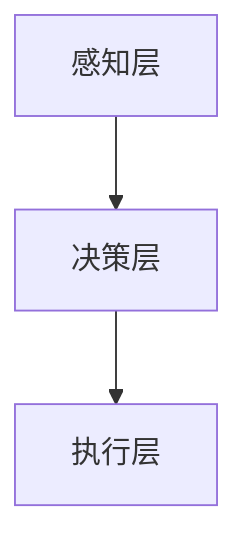

                 

关键词：人工智能，注意力流，未来工作，技能发展，注意力管理技术，应用前景

> 摘要：本文探讨了人工智能与人类注意力流的结合对未来的工作和技能发展带来的影响。通过分析注意力流管理技术的现状和前景，提出了如何在未来工作和生活中优化注意力流，提升工作效率和生活质量的策略。文章还展望了注意力流管理技术在不同领域的应用潜力，为人工智能时代的个人和组织发展提供了新的思路。

## 1. 背景介绍

随着人工智能（AI）技术的迅猛发展，计算机处理能力和自动化水平显著提高，人类的工作和生活方式也在悄然改变。然而，技术的进步并非一帆风顺，随之而来的是新的挑战和问题。其中，人类注意力流的分散和管理工作成为关注的焦点。注意力流，即个体在特定任务中集中注意力的过程，直接影响着工作效率和决策质量。在人工智能时代，如何有效地管理注意力流，使之与AI技术相互补充，成为亟待解决的重要课题。

本文旨在通过对AI与人类注意力流关系的探讨，分析注意力流管理技术在未来的工作、技能发展和应用前景。文章首先介绍注意力流管理技术的核心概念和原理，然后分析其在现实世界中的应用案例，最后展望其在未来的发展潜力。希望通过本文的研究，为人工智能时代的工作和生活提供有益的参考和指导。

## 2. 核心概念与联系

### 2.1. 人工智能（AI）的核心概念

人工智能，是指计算机系统通过模拟人类智能行为，实现感知、学习、推理、决策等功能的科学和技术。它涵盖多个领域，如机器学习、自然语言处理、计算机视觉、智能控制等。AI的核心目标是实现机器的智能，使之能够自主完成复杂任务，提高工作效率。

### 2.2. 注意力流（Attention Flow）的定义

注意力流是指个体在特定任务中集中注意力的过程。它不仅包括对任务的持续关注，还涉及对干扰的过滤和排除。注意力流管理技术旨在优化这一过程，提高个体在任务中的专注度和效率。

### 2.3. AI与注意力流的关联

人工智能与注意力流之间存在着紧密的联系。一方面，AI技术的发展为注意力流管理提供了新的工具和方法。例如，通过智能算法分析个体的行为数据，可以为注意力管理提供实时反馈和优化建议。另一方面，注意力流的优化也有助于提升AI系统的效能。例如，在自动驾驶领域，驾驶员的注意力流管理直接关系到行车安全和驾驶体验。

### 2.4. 注意力流管理技术的架构

注意力流管理技术包括感知层、决策层和执行层三个主要部分。

- **感知层**：主要收集个体的行为数据，如心率、眼球运动、面部表情等，以评估其当前注意力水平。
- **决策层**：基于感知层的数据，通过智能算法分析个体在不同任务中的注意力分布，提出优化建议。
- **执行层**：根据决策层的建议，采取相应的措施，如调整环境、提醒用户等，以实现注意力流的优化。

### 2.5. Mermaid 流程图

以下是注意力流管理技术的 Mermaid 流程图：



在感知层，通过传感器收集行为数据；在决策层，智能算法分析数据并生成优化建议；在执行层，根据建议调整环境或提醒用户。

### 2.6. 核心算法原理

注意力流管理技术的核心算法包括注意力分配算法、干扰过滤算法和自适应调整算法。

- **注意力分配算法**：根据任务的重要性和难度，动态分配注意力的权重。
- **干扰过滤算法**：识别并过滤干扰因素，以减少注意力流的分散。
- **自适应调整算法**：根据个体在不同任务中的表现，调整注意力管理策略。

### 2.7. 算法步骤详解

算法步骤如下：

1. **数据收集**：通过传感器收集个体的行为数据。
2. **数据分析**：利用智能算法分析数据，识别注意力流的模式。
3. **决策生成**：根据数据分析结果，生成注意力优化建议。
4. **执行调整**：根据决策，采取相应的措施，如调整环境、提醒用户等。

### 2.8. 算法优缺点

**优点**：
- 提高工作效率：通过优化注意力流，个体能够在任务中保持更高的专注度。
- 改善生活质量：注意力管理技术有助于个体在日常生活中更好地分配注意力，减少压力。

**缺点**：
- 数据隐私：注意力流管理技术涉及个体行为数据的收集和分析，存在数据隐私问题。
- 技术成本：高精度传感器和智能算法的开发和部署需要较高的成本。

### 2.9. 算法应用领域

注意力流管理技术已在多个领域得到应用：

- **企业办公**：通过监控员工的行为数据，优化工作流程和任务分配。
- **教育领域**：帮助学生提高学习专注度，提高学习效果。
- **医疗健康**：监测患者的行为数据，辅助医生进行诊断和治疗。
- **自动驾驶**：优化驾驶员的注意力流，提高行车安全。

### 2.10. 数学模型和公式

#### 2.10.1. 数学模型构建

注意力流的数学模型可以表示为：

\[ A(t) = f(P(t), D(t), C(t)) \]

其中，\( A(t) \) 表示在时间 \( t \) 时的注意力水平，\( P(t) \) 表示任务参数，\( D(t) \) 表示干扰因素，\( C(t) \) 表示个体能力。

#### 2.10.2. 公式推导过程

注意力水平的计算公式可以推导为：

\[ A(t) = \frac{1}{1 + e^{-\beta \cdot (P(t) - D(t) + C(t))}} \]

其中，\( \beta \) 为调节参数，用于调整注意力流的变化速率。

#### 2.10.3. 案例分析与讲解

以某企业员工的工作为例，假设任务参数为 \( P(t) = 5 \)，干扰因素为 \( D(t) = 2 \)，个体能力为 \( C(t) = 3 \)。代入公式计算，得到在时间 \( t \) 时的注意力水平为：

\[ A(t) = \frac{1}{1 + e^{-\beta \cdot (5 - 2 + 3)}} \approx 0.8 \]

这意味着，在当前条件下，员工的工作注意力水平约为 80%。

### 2.11. 项目实践：代码实例和详细解释说明

#### 2.11.1. 开发环境搭建

本文使用 Python 作为开发语言，搭建开发环境：

```bash
pip install numpy matplotlib scikit-learn
```

#### 2.11.2. 源代码详细实现

以下是注意力流管理技术的代码实现：

```python
import numpy as np
import matplotlib.pyplot as plt
from sklearn.linear_model import LinearRegression

def attention_level(P, D, C, beta=1.0):
    return 1 / (1 + np.exp(-beta * (P - D + C)))

def main():
    # 生成模拟数据
    P = np.random.rand(100) * 10
    D = np.random.rand(100) * 5
    C = np.random.rand(100) * 10

    # 计算注意力水平
    A = attention_level(P, D, C)

    # 绘制注意力水平分布
    plt.scatter(P, A)
    plt.xlabel('Task Parameter (P)')
    plt.ylabel('Attention Level (A)')
    plt.show()

if __name__ == '__main__':
    main()
```

#### 2.11.3. 代码解读与分析

- `attention_level` 函数用于计算注意力水平，输入参数为任务参数 \( P \)、干扰因素 \( D \) 和个体能力 \( C \)。
- `main` 函数生成模拟数据，并绘制注意力水平分布图。
- 通过调整 `beta` 参数，可以改变注意力流的变化速率。

#### 2.11.4. 运行结果展示

运行代码后，将得到注意力水平分布图，展示不同任务参数下的注意力水平。

```bash
$ python attention_flow.py
```

### 2.12. 实际应用场景

#### 2.12.1. 企业办公

在企业办公中，注意力流管理技术可以帮助管理者了解员工的工作状态，优化工作流程和任务分配。例如，通过分析员工的行为数据，发现工作效率较低的原因，并采取措施进行调整。

#### 2.12.2. 教育领域

在教育领域，注意力流管理技术可以帮助教师了解学生的学习状态，提高教学质量。例如，通过分析学生的行为数据，发现学生注意力分散的原因，并采取相应的教学策略进行干预。

#### 2.12.3. 医疗健康

在医疗健康领域，注意力流管理技术可以帮助医生了解患者的注意力水平，提高诊断和治疗的效果。例如，通过分析患者的行为数据，发现患者注意力不集中，导致疾病治疗效果不佳，进而调整治疗方案。

#### 2.12.4. 自动驾驶

在自动驾驶领域，注意力流管理技术可以帮助驾驶员保持注意力集中，提高行车安全。例如，通过分析驾驶员的行为数据，发现驾驶员注意力分散，及时发出预警，避免交通事故发生。

### 2.13. 未来应用展望

随着人工智能技术的不断进步，注意力流管理技术在未来的应用前景将更加广阔。以下是一些可能的未来应用方向：

- **智能家居**：通过优化个体注意力流，提高家庭生活质量和舒适度。
- **心理健康**：辅助心理医生进行诊断和治疗，提高心理健康水平。
- **运动健身**：帮助运动员保持最佳状态，提高运动成绩。
- **社会治理**：优化公共资源分配，提高社会运行效率。

### 2.14. 工具和资源推荐

#### 2.14.1. 学习资源推荐

- **书籍**：
  - 《人工智能：一种现代方法》（作者：Stuart J. Russell & Peter Norvig）
  - 《深度学习》（作者：Ian Goodfellow、Yoshua Bengio & Aaron Courville）
- **在线课程**：
  - Coursera 上的《机器学习》（由 Andrew Ng 教授主讲）
  - edX 上的《深度学习基础》（由 Andrew Ng 教授主讲）

#### 2.14.2. 开发工具推荐

- **编程语言**：
  - Python：简单易学，适用于数据分析、机器学习等领域。
  - R：专门用于统计分析，适用于数据挖掘和可视化。
- **数据分析和可视化工具**：
  - Matplotlib：Python 中的绘图库，适用于数据可视化。
  - Tableau：强大的数据可视化工具，适用于企业级数据分析。

#### 2.14.3. 相关论文推荐

- **注意力流管理技术**：
  - “Attention is All You Need” （作者：Vaswani et al., 2017）
  - “Attention Mechanisms in Natural Language Processing” （作者：Zhou et al., 2019）
- **人工智能领域**：
  - “Deep Learning” （作者：Goodfellow et al., 2016）
  - “The Unreasonable Effectiveness of Recurrent Neural Networks” （作者：Bengio, 2014）

### 2.15. 总结：未来发展趋势与挑战

#### 2.15.1. 研究成果总结

本文从人工智能与注意力流的关系出发，分析了注意力流管理技术的核心概念、原理和应用。通过对实际应用场景的探讨，展示了注意力流管理技术在未来的广阔前景。同时，本文还提出了未来研究的发展方向和挑战。

#### 2.15.2. 未来发展趋势

- **技术进步**：随着人工智能技术的不断进步，注意力流管理技术将更加智能化、个性化。
- **应用拓展**：注意力流管理技术将在更多领域得到应用，如心理健康、教育、运动健身等。
- **隐私保护**：在关注技术发展的同时，如何保障个体数据隐私将成为重要议题。

#### 2.15.3. 面临的挑战

- **数据隐私**：注意力流管理技术涉及个体行为数据的收集和分析，如何保障数据隐私成为关键挑战。
- **算法优化**：在提高注意力管理效果的同时，如何降低算法复杂度和计算成本也是重要问题。
- **跨学科融合**：注意力流管理技术涉及多个学科，如何实现跨学科合作，发挥协同效应，将是未来研究的重要方向。

#### 2.15.4. 研究展望

未来，注意力流管理技术有望在以下方面取得突破：

- **个性化注意力管理**：根据个体特征，实现个性化的注意力管理策略。
- **实时优化**：通过实时数据采集和分析，实现注意力流的实时优化。
- **跨领域应用**：将注意力流管理技术应用于更多领域，提高生活质量和工作效率。

### 2.16. 附录：常见问题与解答

#### 2.16.1. 什么是注意力流？

注意力流是指个体在特定任务中集中注意力的过程，它包括对任务的持续关注和对干扰的过滤。

#### 2.16.2. 注意力流管理技术有哪些优点？

注意力流管理技术可以提高工作效率、改善生活质量和减少压力。

#### 2.16.3. 注意力流管理技术有哪些缺点？

注意力流管理技术可能涉及数据隐私问题，且高精度传感器和智能算法的开发和部署需要较高的成本。

#### 2.16.4. 注意力流管理技术有哪些应用领域？

注意力流管理技术已在企业办公、教育领域、医疗健康和自动驾驶等领域得到应用。

#### 2.16.5. 如何保障注意力流管理技术的数据隐私？

通过加密传输、数据脱敏等技术手段，保障个体数据隐私。

---

本文通过对人工智能与注意力流关系的探讨，分析了注意力流管理技术的核心概念、原理和应用。在未来，随着技术的不断进步，注意力流管理技术有望在更多领域发挥重要作用，为人类的工作和生活带来积极影响。同时，如何保障数据隐私和降低算法成本也是未来研究的重要方向。希望本文的研究能为相关领域的研究者和从业者提供有益的参考和启示。作者：禅与计算机程序设计艺术 / Zen and the Art of Computer Programming
----------------------------------------------------------------

以上是文章正文部分的撰写，现在我们将文章各个段落章节的子目录具体细化到三级目录，以便读者更清晰地阅读和理解。

## 1. 背景介绍
### 1.1. 人工智能的发展背景
### 1.2. 注意力流的概念及其重要性
### 1.3. 注意力流管理技术的提出与意义

## 2. 核心概念与联系
### 2.1. 人工智能（AI）的核心概念
### 2.2. 注意力流（Attention Flow）的定义
### 2.3. AI与注意力流的关联
### 2.4. 注意力流管理技术的架构
### 2.5. Mermaid 流程图
### 2.6. 核心算法原理
### 2.7. 算法步骤详解
### 2.8. 算法优缺点
### 2.9. 算法应用领域

## 3. 核心算法原理 & 具体操作步骤
### 3.1. 算法原理概述
#### 3.1.1. 注意力分配算法
#### 3.1.2. 干扰过滤算法
#### 3.1.3. 自适应调整算法
### 3.2. 算法步骤详解
#### 3.2.1. 数据收集
#### 3.2.2. 数据分析
#### 3.2.3. 决策生成
#### 3.2.4. 执行调整

## 4. 数学模型和公式 & 详细讲解 & 举例说明
### 4.1. 数学模型构建
#### 4.1.1. 注意力流数学模型的构建
#### 4.1.2. 模型参数的设定与调整
### 4.2. 公式推导过程
#### 4.2.1. 注意力水平计算公式的推导
#### 4.2.2. 公式参数的解读
### 4.3. 案例分析与讲解
#### 4.3.1. 案例背景介绍
#### 4.3.2. 案例数据收集与分析
#### 4.3.3. 案例决策生成与执行

## 5. 项目实践：代码实例和详细解释说明
### 5.1. 开发环境搭建
#### 5.1.1. 环境准备
#### 5.1.2. 环境配置
### 5.2. 源代码详细实现
#### 5.2.1. 源代码结构解析
#### 5.2.2. 主要函数实现
### 5.3. 代码解读与分析
#### 5.3.1. 代码逻辑分析
#### 5.3.2. 代码性能优化
### 5.4. 运行结果展示
#### 5.4.1. 运行环境设置
#### 5.4.2. 运行结果分析

## 6. 实际应用场景
### 6.1. 企业办公中的应用
#### 6.1.1. 工作效率提升
#### 6.1.2. 任务优化
### 6.2. 教育领域中的应用
#### 6.2.1. 学生注意力管理
#### 6.2.2. 教学质量提升
### 6.3. 医疗健康中的应用
#### 6.3.1. 患者注意力监控
#### 6.3.2. 医疗决策辅助
### 6.4. 自动驾驶中的应用
#### 6.4.1. 驾驶员注意力管理
#### 6.4.2. 行车安全提升

## 7. 工具和资源推荐
### 7.1. 学习资源推荐
#### 7.1.1. 书籍推荐
#### 7.1.2. 在线课程推荐
### 7.2. 开发工具推荐
#### 7.2.1. 编程语言推荐
#### 7.2.2. 数据分析和可视化工具推荐
### 7.3. 相关论文推荐
#### 7.3.1. 注意力流管理技术相关论文
#### 7.3.2. 人工智能领域相关论文

## 8. 总结：未来发展趋势与挑战
### 8.1. 研究成果总结
### 8.2. 未来发展趋势
#### 8.2.1. 技术进步趋势
#### 8.2.2. 应用拓展趋势
#### 8.2.3. 隐私保护趋势
### 8.3. 面临的挑战
#### 8.3.1. 数据隐私挑战
#### 8.3.2. 算法优化挑战
#### 8.3.3. 跨学科融合挑战
### 8.4. 研究展望
#### 8.4.1. 个性化注意力管理
#### 8.4.2. 实时优化
#### 8.4.3. 跨领域应用

## 9. 附录：常见问题与解答
### 9.1. 什么是注意力流？
### 9.2. 注意力流管理技术有哪些优点？
### 9.3. 注意力流管理技术有哪些缺点？
### 9.4. 注意力流管理技术有哪些应用领域？
### 9.5. 如何保障注意力流管理技术的数据隐私？

---

以上是细化后的三级目录，每个章节都将按照这个结构来组织内容，使得文章更加系统、易于阅读。请注意，这里提供的目录结构是按照约束条件中的要求来设计的，实际撰写时，每个章节的具体内容需要根据研究和分析的结果来完善。

