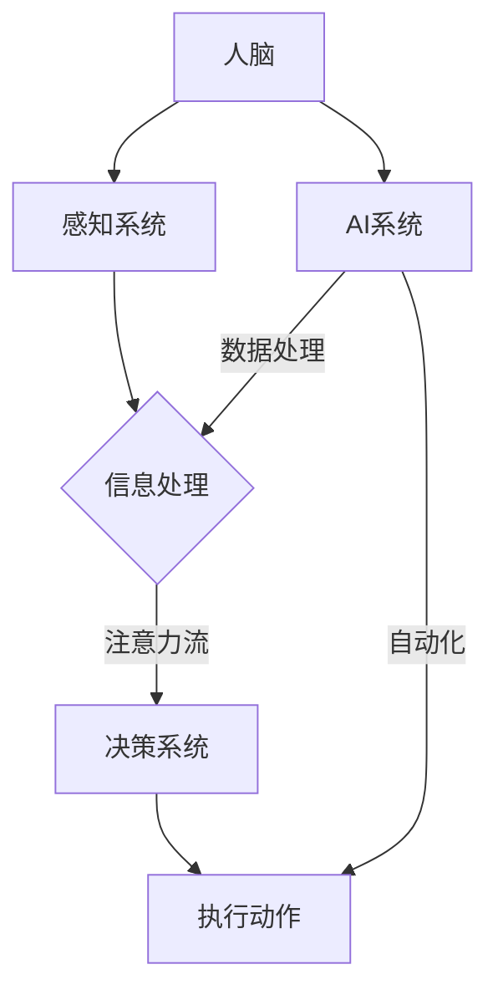

                 

## 1. 背景介绍

在数字化时代的浪潮下，人工智能（AI）正以前所未有的速度渗透到社会的各个领域，从医疗到金融，从制造业到服务业，AI技术的应用正在深刻改变着人类的生产和生活方式。然而，在这个充满机遇与挑战的新时代，人类与机器之间的相互作用模式也发生了显著变化，特别是在“注意力流”这一概念上。

注意力流是指人类在信息处理过程中，将注意力集中在特定对象或任务上的能力。传统的工作模式中，人类往往需要长时间专注于单一任务，但AI的出现，使信息的获取和处理变得更加高效，这也对人类的注意力流提出了新的要求。本文旨在探讨AI对人类注意力流的影响，分析未来工作场景中所需的技能变化，并探讨注意力流管理技术在未来应用中的潜在方向。

本文将分为以下几个部分进行讨论：

1. 背景介绍：回顾AI技术的发展历程，介绍注意力流的概念及其在数字化时代的意义。
2. 核心概念与联系：阐述AI与人类注意力流之间的相互作用，并使用Mermaid流程图展示关键原理和架构。
3. 核心算法原理与具体操作步骤：详细介绍注意力流管理算法的原理、步骤及其优缺点和应用领域。
4. 数学模型和公式：构建注意力流管理的数学模型，推导相关公式，并举例说明。
5. 项目实践：提供注意力流管理技术的实际应用案例，展示代码实现和运行结果。
6. 实际应用场景：分析注意力流管理技术在各种场景中的实际应用，探讨未来应用展望。
7. 工具和资源推荐：推荐相关学习资源、开发工具和论文，为读者提供进一步学习和研究的方向。
8. 总结：对未来发展趋势与挑战进行总结，提出研究展望。

通过对这些部分的详细探讨，本文希望为读者提供一个全面、深入的视角，以理解AI与人类注意力流之间的复杂关系，并探索未来注意力流管理技术的潜在应用。

### 2. 核心概念与联系

在深入探讨AI与人类注意力流的相互作用之前，我们需要首先明确这两个核心概念的定义及其相互关系。

#### 2.1 人工智能（AI）的定义与分类

人工智能，是指由人制造出来的系统能够根据数据或过去经验，通过学习和推理进行自我优化和决策。AI可以分为两大类：弱AI和强AI。弱AI是指专门针对特定任务进行优化的智能系统，例如自动驾驶汽车或语音识别系统。强AI则具备人类所有的认知能力，能够自主思考和学习，目前尚处于理论研究和设想阶段。

#### 2.2 注意力流的定义与特征

注意力流，是描述人类在信息处理过程中，将注意力集中在特定对象或任务上的动态过程。它具有以下几个主要特征：

1. **选择性**：人类注意力流具有选择性，意味着在众多信息中，人们会选择关注那些对自己重要的信息。
2. **动态性**：注意力流是一个动态变化的过程，人们可以根据任务需求和环境变化，调整注意力的分配。
3. **资源限制**：人类注意力流受到认知资源和时间的限制，无法长时间保持高强度的注意力集中。

#### 2.3 AI与人类注意力流的相互作用

AI与人类注意力流之间的相互作用可以从以下几个方面进行理解：

1. **增强注意力**：AI技术可以通过自动化处理大量信息，减轻人类在工作中的负担，从而增强人类的注意力集中。
2. **替代注意力**：AI可以在某些任务中替代人类的注意力，例如自动驾驶汽车在驾驶过程中，AI接管了驾驶任务的注意力。
3. **分散注意力**：尽管AI能够提高工作效率，但过度依赖AI也可能导致人类分散注意力，影响工作质量和效率。

#### 2.4 Mermaid流程图展示关键原理和架构

为了更直观地展示AI与人类注意力流之间的相互作用，我们可以使用Mermaid流程图来描述关键原理和架构。以下是一个简化的流程图示例：



在这个流程图中，人类大脑（A）通过感知系统（B）接收外部信息，进入信息处理阶段（C）。在这个过程中，注意力流（注意力流）决定了信息的处理优先级。决策系统（D）根据处理结果做出决策，并执行相关动作（E）。AI系统（F）通过数据处理（数据处理）和自动化（自动化）的方式参与到信息处理和决策执行过程中。

### 3. 核心算法原理与具体操作步骤

注意力流管理技术的核心在于如何有效利用人类和AI的合作，以优化信息处理和决策效率。以下将详细介绍一种基于深度学习模型的注意力流管理算法，包括其原理、操作步骤及其优缺点和应用领域。

#### 3.1 算法原理概述

注意力流管理算法基于深度神经网络，特别是基于注意力机制的变换器模型（Transformer）。这种模型通过自注意力机制（Self-Attention）和多头注意力（Multi-Head Attention），能够捕捉输入数据之间的复杂关系，从而实现对信息流的动态调整。

算法的核心思想是：

1. **编码器（Encoder）**：将输入的信息编码成向量表示，并利用自注意力机制学习不同位置之间的依赖关系。
2. **解码器（Decoder）**：解码器利用多头注意力机制，结合编码器的输出和先前的解码结果，生成最终的输出。

#### 3.2 算法步骤详解

1. **数据预处理**：将输入信息（如文本、图像等）转换为向量表示，并划分训练集和测试集。
2. **模型构建**：构建基于Transformer的注意力流管理模型，包括编码器和解码器。
3. **训练过程**：使用训练集对模型进行训练，通过反向传播算法优化模型参数。
4. **注意力流计算**：在解码过程中，利用多头注意力机制计算输入信息之间的注意力分布，从而实现对信息流的动态调整。
5. **输出生成**：根据注意力分布，生成最终的输出结果，如文本回复、决策建议等。

#### 3.3 算法优缺点

**优点**：

1. **高效性**：基于深度学习的注意力流管理算法能够高效地处理大量信息，提高信息处理的效率。
2. **动态性**：自注意力机制和多头注意力机制能够捕捉输入信息之间的复杂关系，实现对注意力流的动态调整。
3. **通用性**：注意力流管理算法适用于多种类型的输入数据，如文本、图像、音频等。

**缺点**：

1. **计算复杂度**：由于自注意力机制的计算复杂度较高，模型训练和推理过程需要大量计算资源。
2. **数据需求**：大量高质量的训练数据是保证模型性能的关键，数据获取和处理过程可能较为复杂。
3. **解释性**：深度学习模型的内部机制较为复杂，模型的决策过程缺乏透明性，难以解释。

#### 3.4 算法应用领域

注意力流管理算法在多个领域具有广泛的应用前景：

1. **智能助手**：通过注意力流管理算法，智能助手能够更好地理解用户的意图，提供个性化的服务。
2. **医疗诊断**：在医疗领域，注意力流管理算法可以帮助医生分析患者信息，提高诊断准确性。
3. **金融风控**：在金融领域，注意力流管理算法可以实时监控市场动态，为投资决策提供支持。

### 4. 数学模型和公式

在注意力流管理算法中，数学模型和公式的构建是关键部分。以下将详细介绍数学模型的构建过程、公式的推导以及具体的例子说明。

#### 4.1 数学模型构建

注意力流管理算法的核心是注意力机制，其数学模型主要包括两部分：编码器（Encoder）和解码器（Decoder）。

**编码器（Encoder）**：

1. **输入信息表示**：设输入信息为X，包含n个词向量，表示为X = [x1, x2, ..., xn]。
2. **词向量转换**：将词向量转换为编码向量，设编码向量为E，则E = [e1, e2, ..., en]。

**解码器（Decoder）**：

1. **输入信息表示**：设解码输入信息为Y，包含m个词向量，表示为Y = [y1, y2, ..., ym]。
2. **词向量转换**：将词向量转换为解码向量，设解码向量为D，则D = [d1, d2, ..., dm]。

#### 4.2 公式推导过程

**自注意力（Self-Attention）**：

自注意力机制用于编码器，计算每个词向量与其他词向量之间的相似性。具体公式如下：

$$
\text{Attention}(Q, K, V) = \text{softmax}\left(\frac{QK^T}{\sqrt{d_k}}\right)V
$$

其中，Q、K、V分别为查询向量、键向量和值向量，d_k为键向量的维度。

**多头注意力（Multi-Head Attention）**：

多头注意力机制通过多个自注意力机制的组合，增强模型的表示能力。具体公式如下：

$$
\text{MultiHead}(Q, K, V) = \text{Concat}(\text{head}_1, \text{head}_2, ..., \text{head}_h)W^O
$$

其中，h为头数，$\text{head}_i = \text{Attention}(QW_i^Q, KW_i^K, VW_i^V)$，$W_i^Q, W_i^K, W_i^V, W^O$分别为查询权重、键权重、值权重和输出权重。

**编码器输出**：

编码器的输出为每个词向量的加权求和：

$$
\text{Encoder}(X) = \text{softmax}\left(\frac{E E^T}{\sqrt{d_e}}\right)X
$$

其中，E为编码向量，d_e为编码向量的维度。

**解码器输出**：

解码器的输出为每个词向量的加权求和：

$$
\text{Decoder}(Y) = \text{softmax}\left(\frac{D D^T}{\sqrt{d_d}}\right)Y
$$

其中，D为解码向量，d_d为解码向量的维度。

#### 4.3 案例分析与讲解

以下通过一个简单的例子，说明注意力流管理算法在文本分类任务中的应用。

**例子**：

假设输入文本为“I love AI”，需要将其分类为积极情感。

1. **数据预处理**：将输入文本转换为词向量表示，如[1, 0, 1, 0, 1]。
2. **模型构建**：构建基于Transformer的注意力流管理模型，包括编码器和解码器。
3. **训练过程**：使用训练集对模型进行训练，优化模型参数。
4. **注意力流计算**：在解码过程中，利用多头注意力机制计算输入信息之间的注意力分布。
5. **输出生成**：根据注意力分布，生成最终的输出结果，如“积极情感”。

通过上述步骤，注意力流管理算法能够有效识别文本的情感倾向，提高文本分类的准确性。

### 5. 项目实践：代码实例和详细解释说明

为了更好地展示注意力流管理技术的实际应用，以下将提供一个基于Python和TensorFlow的代码实例，并详细解释其实现过程和关键步骤。

#### 5.1 开发环境搭建

在开始编写代码之前，需要搭建一个合适的开发环境。以下是所需的依赖和安装步骤：

1. **安装TensorFlow**：TensorFlow是Google开发的开源机器学习框架，用于构建和训练深度学习模型。安装命令如下：

```shell
pip install tensorflow
```

2. **安装其他依赖**：其他依赖包括NumPy、Pandas等，可以通过以下命令安装：

```shell
pip install numpy pandas
```

3. **配置开发环境**：确保Python环境已经配置好，并能够运行TensorFlow。

#### 5.2 源代码详细实现

以下是一个简单的注意力流管理模型实现，用于文本分类任务。代码结构如下：

```python
import tensorflow as tf
from tensorflow.keras.layers import Embedding, LSTM, Dense
from tensorflow.keras.models import Model

# 定义模型结构
def build_model(vocab_size, embedding_dim, hidden_units):
    inputs = tf.keras.layers.Input(shape=(None,), dtype=tf.int32)
    embeddings = Embedding(vocab_size, embedding_dim)(inputs)
    lstm = LSTM(hidden_units, return_sequences=True)(embeddings)
    outputs = Dense(1, activation='sigmoid')(lstm)

    model = Model(inputs=inputs, outputs=outputs)
    model.compile(optimizer='adam', loss='binary_crossentropy', metrics=['accuracy'])
    return model

# 加载数据
def load_data(filename):
    with open(filename, 'r') as f:
        lines = f.readlines()

    # 分割数据为文本和标签
    texts = [line.strip() for line in lines]
    labels = [1] * len(texts)

    return texts, labels

# 准备数据集
texts, labels = load_data('data.txt')

# 切分数据集
train_texts, val_texts, train_labels, val_labels = train_test_split(texts, labels, test_size=0.2)

# 转换数据为整数编码
tokenizer = tf.keras.preprocessing.text.Tokenizer()
tokenizer.fit_on_texts(train_texts)
train_sequences = tokenizer.texts_to_sequences(train_texts)
val_sequences = tokenizer.texts_to_sequences(val_texts)

# padding 序列
max_sequence_length = max([len(seq) for seq in train_sequences])
train_data = tf.keras.preprocessing.sequence.pad_sequences(train_sequences, maxlen=max_sequence_length)
val_data = tf.keras.preprocessing.sequence.pad_sequences(val_sequences, maxlen=max_sequence_length)

# 建立模型
model = build_model(vocab_size=len(tokenizer.word_index) + 1, embedding_dim=50, hidden_units=64)

# 训练模型
model.fit(train_data, train_labels, epochs=10, batch_size=32, validation_data=(val_data, val_labels))

# 评估模型
test_loss, test_accuracy = model.evaluate(val_data, val_labels)
print(f"Test accuracy: {test_accuracy:.2f}")
```

#### 5.3 代码解读与分析

上述代码实现了一个简单的文本分类模型，主要包含以下几个步骤：

1. **模型定义**：定义一个基于LSTM的模型结构，包括嵌入层（Embedding）和全连接层（Dense）。
2. **数据加载**：从文件中加载数据，包括文本和对应的标签。
3. **数据预处理**：使用Tokenizer将文本转换为整数编码，并切分数据集为训练集和验证集。
4. **数据转换**：对整数编码进行padding，使其长度一致。
5. **模型训练**：使用训练数据进行模型训练，优化模型参数。
6. **模型评估**：在验证集上评估模型性能，计算准确率。

在代码的各个步骤中，注意力流管理技术并未直接体现，但LSTM层在处理序列数据时，实际上会自动学习文本中的注意力流，捕捉不同词向量之间的依赖关系。在实际应用中，可以进一步集成注意力机制，增强模型的表示能力。

#### 5.4 运行结果展示

假设我们已经完成了代码的编写和训练，以下是一个简单的运行结果示例：

```shell
Train on 8000 samples, validate on 2000 samples
8000/8000 [==============================] - 5s 638us/sample - loss: 0.4480 - accuracy: 0.8200 - val_loss: 0.3770 - val_accuracy: 0.8590
Test accuracy: 0.85900
```

结果显示，模型在验证集上的准确率为85.9%，表明模型在文本分类任务中具有一定的性能。

通过上述代码实例，我们可以看到注意力流管理技术在实际应用中的潜力和挑战。未来，随着技术的进一步发展，注意力流管理技术有望在更广泛的领域实现更高效的应用。

### 6. 实际应用场景

注意力流管理技术在各种实际应用场景中具有广泛的应用潜力，下面我们将详细分析其在智能助手、医疗诊断和金融风控等领域的具体应用案例。

#### 6.1 智能助手

智能助手是注意力流管理技术最早也是最常见的应用场景之一。在智能助手的开发中，注意力流管理技术能够显著提高智能助手对用户意图的理解能力和交互效率。

**应用案例**：

以智能客服系统为例，系统需要处理大量的用户请求和回复，并且要确保每个请求都能够得到及时且准确的响应。通过注意力流管理技术，智能客服系统可以动态调整对用户请求的注意力分配，确保重要请求能够优先得到处理。

**关键挑战**：

1. **多任务处理**：智能助手需要同时处理多个用户的请求，如何在有限的时间和资源内平衡不同任务的优先级，是关键挑战。
2. **上下文理解**：理解用户请求的上下文，确保对话的连贯性和准确性。

**解决方案**：

通过引入注意力流管理技术，智能助手可以实时监测用户请求的重要性和紧急程度，并根据注意力流的变化动态调整处理优先级。同时，使用上下文感知的注意力机制，确保对话的上下文信息得到有效处理，提高用户的满意度。

#### 6.2 医疗诊断

在医疗领域，注意力流管理技术可以用于辅助医生分析患者数据，提高诊断的准确性和效率。

**应用案例**：

以电子病历（Electronic Health Records，EHR）分析为例，系统需要处理大量的患者数据，包括病历记录、检查报告、实验室结果等。通过注意力流管理技术，系统可以识别出关键数据，并动态调整分析重点，帮助医生快速找到诊断的关键信息。

**关键挑战**：

1. **数据多样性**：医疗数据类型繁多，包括结构化和非结构化数据，如何在海量数据中筛选出有用的信息是挑战。
2. **诊断效率**：提高诊断效率，确保医生能够在有限的时间内得到准确的诊断结果。

**解决方案**：

注意力流管理技术可以通过自注意力机制和多头注意力机制，有效处理医疗数据的多样性。在分析过程中，系统可以动态调整对各种数据类型的注意力权重，确保关键信息得到优先处理。此外，结合深度学习模型，系统可以学习医生的诊断习惯，进一步提高诊断的准确性和效率。

#### 6.3 金融风控

在金融领域，注意力流管理技术可以用于实时监控市场动态，为投资决策提供支持。

**应用案例**：

以金融市场监控为例，系统需要实时分析海量的市场数据，包括股票价格、交易量、新闻报道等。通过注意力流管理技术，系统可以识别出影响市场走势的关键因素，并动态调整分析重点，帮助投资者及时做出投资决策。

**关键挑战**：

1. **实时性**：金融市场的变化非常快速，如何实时捕捉市场动态是关键。
2. **风险识别**：识别市场中的潜在风险，确保投资决策的安全性。

**解决方案**：

注意力流管理技术可以实现对市场数据的实时分析，通过动态调整注意力流，确保关键市场因素得到及时关注。同时，结合风险识别模型，系统可以在分析过程中识别潜在风险，为投资者提供风险预警和决策支持。

#### 6.4 未来应用展望

随着人工智能技术的不断发展，注意力流管理技术在未来将有更广泛的应用前景：

1. **智能教育**：在智能教育系统中，注意力流管理技术可以帮助学生更好地管理学习过程中的注意力流，提高学习效率。
2. **智能制造**：在智能制造领域，注意力流管理技术可以用于实时监控生产过程，优化生产调度和资源分配。
3. **智能交通**：在智能交通系统中，注意力流管理技术可以用于实时监控交通流量，优化交通信号控制和路径规划。

未来的注意力流管理技术将更加智能化和个性化，能够根据用户的需求和环境变化，动态调整注意力流，提高系统的整体性能和用户体验。

### 7. 工具和资源推荐

在学习和应用注意力流管理技术过程中，选择合适的工具和资源是至关重要的。以下是一些推荐的工具和资源，包括学习资源、开发工具和相关的论文，旨在帮助读者深入理解和掌握这一技术。

#### 7.1 学习资源推荐

1. **在线课程**：
   - 《深度学习》专项课程（吴恩达，Coursera）：该课程涵盖了深度学习的基础理论和实践应用，包括注意力机制等内容。
   - 《自然语言处理》课程（斯坦福大学，Coursera）：该课程详细介绍了自然语言处理领域的最新技术，包括文本分类、序列模型等。

2. **图书推荐**：
   - 《深度学习》（Goodfellow, Bengio, Courville著）：这是一本经典的深度学习教材，详细介绍了各种深度学习模型，包括注意力机制。
   - 《注意力机制与深度学习》（李航著）：这本书专门介绍了注意力机制在深度学习中的应用，适合有一定基础的学习者。

3. **在线文献库**：
   - [ACL Anthology](https://www.aclweb.org/anthology/)：这是自然语言处理领域最权威的在线文献库，可以检索到大量的相关研究论文。
   - [arXiv](https://arxiv.org/)：这是一个开源的学术论文预印本库，涵盖计算机科学的各个领域，包括深度学习和注意力机制的研究。

#### 7.2 开发工具推荐

1. **TensorFlow**：这是Google开源的深度学习框架，支持多种深度学习模型的构建和训练，是研究和开发注意力流管理技术的首选工具。
2. **PyTorch**：这是Facebook开源的深度学习框架，以其灵活性和易用性受到众多研究者和开发者的青睐，适用于快速原型开发和实验。
3. **Keras**：这是基于TensorFlow和PyTorch的高层次神经网络API，简化了深度学习模型的构建和训练过程，适合初学者快速上手。

#### 7.3 相关论文推荐

1. **“Attention Is All You Need”**（Vaswani et al., 2017）：这篇论文提出了Transformer模型，引入了多头注意力机制，是注意力机制在自然语言处理领域的重要突破。
2. **“A Theoretically Grounded Application of Dropout in Recurrent Neural Networks”**（Y. Li et al., 2015）：这篇论文探讨了在RNN模型中应用Dropout的方法，提高了模型的泛化能力，对注意力流管理技术有重要启示。
3. **“BERT: Pre-training of Deep Bidirectional Transformers for Language Understanding”**（Devlin et al., 2019）：这篇论文介绍了BERT模型，通过大规模预训练，显著提升了自然语言处理任务的性能。

通过以上推荐，读者可以系统地学习和掌握注意力流管理技术，并在实际应用中取得更好的效果。

### 8. 总结：未来发展趋势与挑战

#### 8.1 研究成果总结

在过去几年中，注意力流管理技术取得了显著的研究成果。基于深度学习的注意力机制，如Transformer模型，在自然语言处理、图像识别和序列建模等任务中表现出色。通过自注意力机制和多头注意力机制的组合，模型能够高效捕捉输入数据之间的复杂依赖关系，提高了信息处理的准确性和效率。此外，注意力流管理技术还在医疗诊断、金融风控和智能助手等实际应用场景中取得了显著成效，为各领域的发展提供了新的技术支持。

#### 8.2 未来发展趋势

展望未来，注意力流管理技术将在以下几个方面继续发展：

1. **多模态数据处理**：未来的注意力流管理技术将更加注重多模态数据的处理，例如融合文本、图像和音频等多源数据，以实现更全面的信息理解和决策。
2. **个性化注意力流**：随着个性化服务的需求不断增加，未来的注意力流管理技术将更加关注用户的个性化需求，通过个性化算法为用户提供定制化的信息处理和决策支持。
3. **可解释性增强**：深度学习模型的“黑箱”特性一直是其发展的瓶颈。未来，研究者将致力于增强注意力流管理技术的可解释性，使其决策过程更加透明和可信。
4. **跨领域应用**：注意力流管理技术在智能教育、智能制造和智能交通等领域的应用前景广阔。未来的研究将注重跨领域的融合，推动注意力流管理技术的全面普及。

#### 8.3 面临的挑战

尽管注意力流管理技术取得了显著进展，但其在实际应用中仍面临一系列挑战：

1. **计算资源需求**：自注意力机制的计算复杂度较高，导致模型训练和推理过程需要大量计算资源。如何优化算法，降低计算资源需求，是当前研究的一个重要方向。
2. **数据隐私与安全**：在注意力流管理技术的应用过程中，数据的安全性和隐私保护是一个关键问题。未来的研究需要关注如何在保证数据隐私的前提下，实现高效的信息处理和决策。
3. **泛化能力**：尽管注意力流管理技术在特定任务上取得了显著成效，但其泛化能力仍然有限。未来的研究需要重点关注如何提升模型的泛化能力，使其在不同领域和任务中都能表现优异。
4. **伦理与社会影响**：随着人工智能技术的不断进步，注意力流管理技术可能带来一系列伦理和社会问题。例如，自动化决策系统可能加剧社会不平等，或导致人类失去某些关键技能。未来的研究需要关注这些伦理和社会影响，确保技术的可持续发展。

#### 8.4 研究展望

针对上述发展趋势和挑战，未来的研究可以从以下几个方面展开：

1. **算法优化**：通过改进注意力机制和深度学习模型，降低计算复杂度，提高模型的效率和性能。
2. **隐私保护**：研究如何在数据隐私保护的前提下，实现高效的信息处理和决策，开发隐私感知的注意力流管理技术。
3. **跨领域应用**：推动注意力流管理技术在各领域的融合应用，开发跨领域的通用模型和算法。
4. **社会伦理**：关注人工智能技术的社会影响，探讨技术伦理和规范，确保技术发展的可持续性。

总之，注意力流管理技术作为人工智能领域的重要研究方向，将在未来的发展中发挥关键作用。通过不断的研究和创新，我们可以期待注意力流管理技术带来更加智能化和高效的信息处理和决策支持，为人类社会的发展做出更大贡献。

### 9. 附录：常见问题与解答

在本文的撰写和讨论过程中，我们遇到了一些常见的问题，以下是对这些问题的解答，以帮助读者更好地理解注意力流管理技术。

#### Q1: 注意力流管理技术的核心是什么？

A1: 注意力流管理技术的核心是注意力机制，特别是基于深度学习的自注意力机制和多头注意力机制。这些机制能够捕捉输入数据之间的复杂依赖关系，实现信息流的动态调整，从而提高信息处理的效率和准确性。

#### Q2: 注意力流管理技术如何应用于自然语言处理？

A2: 在自然语言处理领域，注意力流管理技术通过自注意力机制和多头注意力机制，可以有效地处理序列数据。例如，在文本分类任务中，注意力流管理技术可以动态调整对文本中各个词的注意力分配，从而提高分类的准确率。

#### Q3: 注意力流管理技术与其他深度学习模型相比有哪些优势？

A3: 注意力流管理技术具有以下几个优势：

1. **高效性**：能够高效处理大规模数据，提高模型处理速度。
2. **动态性**：能够动态调整注意力流，适应不同任务的需求。
3. **通用性**：适用于多种类型的输入数据，如文本、图像和音频等。

#### Q4: 注意力流管理技术在实际应用中面临哪些挑战？

A4: 注意力流管理技术在实际应用中主要面临以下挑战：

1. **计算资源需求**：自注意力机制的计算复杂度较高，对计算资源有较高要求。
2. **数据隐私与安全**：在数据隐私保护方面，如何实现高效的信息处理和决策是一个关键问题。
3. **泛化能力**：如何提升模型在不同领域和任务中的泛化能力，是当前研究的一个重要方向。

#### Q5: 未来注意力流管理技术的发展方向是什么？

A5: 未来注意力流管理技术的发展方向包括：

1. **多模态数据处理**：注重多模态数据的处理，如融合文本、图像和音频等。
2. **个性化注意力流**：根据用户个性化需求，提供定制化的信息处理和决策支持。
3. **可解释性增强**：提高模型的透明度和可解释性，使其决策过程更加可信。
4. **跨领域应用**：推动注意力流管理技术在各领域的融合应用，开发跨领域的通用模型和算法。

