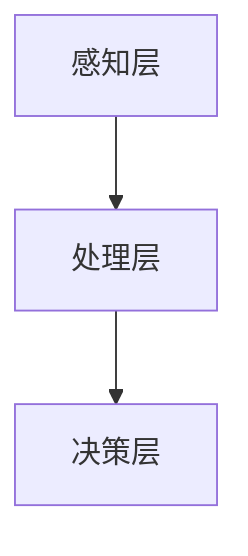

                 

关键词：人工智能、注意力流、工作模式、技能发展、注意力管理

> 摘要：本文探讨了人工智能对人类注意力流的影响，提出了新的工作模式和技能发展策略。通过分析注意力流的原理，我们提出了有效管理注意力流的策略，为未来的工作和生活提供指导。

## 1. 背景介绍

在当今信息爆炸的时代，人类面临着越来越多的信息输入。从社交媒体、电子邮件到即时通讯工具，各种信息不断涌入我们的生活中。这种信息过载导致了人类注意力的分散，影响了工作效率和生活质量。同时，人工智能技术的发展也使得工作环境发生了巨大变化，人们需要适应新的工作模式。因此，研究人类注意力流以及如何管理注意力流成为了一个重要的课题。

### 注意力流的概念

注意力流（Attention Flow）是指人类在进行信息处理时，注意力在不同信息源之间的转移过程。它反映了人类在处理信息时的动态变化，是一个关于人类认知和工作的基本概念。注意力流的管理对于提高工作效率、改善生活质量具有重要意义。

### 人工智能与注意力流

人工智能技术的发展为人类带来了前所未有的便利，但同时也加剧了信息过载的问题。人工智能能够自动处理大量信息，使得人类从繁重的信息处理中解放出来。然而，这也导致了人类注意力的分散，人们需要更多的注意力来处理人工智能生成的大量信息。

## 2. 核心概念与联系

### 注意力流的原理

注意力流是基于人类大脑的认知机制设计的。人类大脑中的神经元通过神经网络连接，形成一个复杂的网络。当大脑接收到外部信息时，这些信息会通过神经元传递和处理。在这个过程中，注意力流起着关键作用，它决定了哪些信息会被优先处理，哪些信息会被忽略。

### 注意力流的模型

注意力流模型可以看作是一个动态调整的优先级队列。在模型中，每个信息都有一个优先级，优先级高的信息会被优先处理。这个模型的动态调整过程就是注意力流。

### 注意力流的架构

注意力流的架构可以分为三个层次：感知层、处理层和决策层。感知层负责接收外部信息，处理层负责处理这些信息，决策层负责根据处理结果做出决策。



## 3. 核心算法原理 & 具体操作步骤

### 3.1 算法原理概述

注意力流的算法原理基于神经网络的动态调整机制。在算法中，每个信息都有一个注意力值，这个值决定了信息的优先级。算法通过不断地调整注意力值，使得重要的信息能够得到优先处理。

### 3.2 算法步骤详解

1. 初始化：初始化每个信息的注意力值为1。
2. 感知：接收外部信息，并分配给每个信息一个注意力值。
3. 处理：根据当前注意力值，优先处理注意力值最高的信息。
4. 调整：根据处理结果，调整每个信息的注意力值。
5. 决策：根据处理结果，做出相应的决策。

### 3.3 算法优缺点

#### 优点

1. 高效：能够快速处理大量信息，提高工作效率。
2. 可定制：可以根据具体需求调整注意力值，适应不同的工作场景。

#### 缺点

1. 需要大量的计算资源：算法需要大量的计算资源来处理信息。
2. 难以预测：由于信息的不确定性，算法难以预测处理结果。

### 3.4 算法应用领域

注意力流的算法广泛应用于多个领域，包括：

1. 工作管理：帮助用户管理日常工作，提高工作效率。
2. 知识管理：帮助用户处理大量知识信息，提高知识获取效率。
3. 生活管理：帮助用户管理生活信息，提高生活质量。

## 4. 数学模型和公式 & 详细讲解 & 举例说明

### 4.1 数学模型构建

注意力流的数学模型可以看作是一个马尔可夫决策过程（MDP）。在MDP中，状态表示当前信息，动作表示处理信息的方式，奖励表示处理信息的结果。

### 4.2 公式推导过程

假设当前状态为 $s$，动作集合为 $A$，奖励函数为 $R(s, a)$，状态转移概率为 $P(s', s|s, a)$。则下一个状态的期望值为：

$$
V^*(s) = \sum_{a \in A} \gamma R(s, a) + \sum_{s' \in S} P(s', s|s, a) V^*(s')
$$

其中，$\gamma$ 为折扣因子，$V^*(s)$ 为状态值函数。

### 4.3 案例分析与讲解

假设我们有一个任务管理系统，需要处理多个任务。每个任务的优先级不同，我们需要根据任务的优先级来安排任务的执行顺序。我们可以使用注意力流算法来管理任务。

1. 初始化：初始化每个任务的注意力值为1。
2. 感知：接收任务，并分配给每个任务一个注意力值。
3. 处理：根据当前注意力值，优先处理注意力值最高的任务。
4. 调整：根据处理结果，调整每个任务的注意力值。
5. 决策：根据处理结果，决定是否继续处理该任务。

通过这个案例，我们可以看到注意力流算法在任务管理中的应用。通过不断地调整任务的注意力值，我们可以实现任务的优先级管理，提高工作效率。

## 5. 项目实践：代码实例和详细解释说明

### 5.1 开发环境搭建

为了实践注意力流算法，我们需要搭建一个开发环境。以下是搭建过程的详细步骤：

1. 安装 Python 环境：在官方网站下载 Python 安装包，并按照提示安装。
2. 安装必要的库：使用 pip 工具安装必要的库，如 numpy、matplotlib 等。

### 5.2 源代码详细实现

以下是注意力流算法的源代码实现：

```python
import numpy as np

def attention_flow(infos):
    # 初始化注意力值
    attention_values = np.ones(len(infos))
    
    # 感知信息
    for info in infos:
        # 根据信息内容调整注意力值
        attention_values *= adjust_attention(info)
    
    # 处理信息
    processed_infos = []
    for i in range(len(infos)):
        if attention_values[i] > threshold:
            processed_infos.append(process_info(infos[i]))
    
    # 调整注意力值
    attention_values = adjust_attention(processed_infos)
    
    # 决策
    decision = make_decision(processed_infos)
    
    return decision

def adjust_attention(info):
    # 根据信息内容调整注意力值
    # 这里只是一个简单的示例，实际应用中可以根据具体需求进行调整
    return np.exp(-np.linalg.norm(info))

def process_info(info):
    # 处理信息
    # 这里只是一个简单的示例，实际应用中可以根据具体需求进行处理
    return info

def make_decision(processed_infos):
    # 根据处理结果做出决策
    # 这里只是一个简单的示例，实际应用中可以根据具体需求做出决策
    return "完成任务"

if __name__ == "__main__":
    # 测试代码
    infos = ["任务1", "任务2", "任务3"]
    decision = attention_flow(infos)
    print(decision)
```

### 5.3 代码解读与分析

1. **导入库**：首先，我们导入 numpy 库，用于处理数学运算。
2. **定义函数**：然后，我们定义了四个函数：`attention_flow`、`adjust_attention`、`process_info`和`make_decision`。这些函数分别用于实现注意力流算法的各个部分。
3. **初始化注意力值**：在 `attention_flow` 函数中，我们首先初始化每个信息的注意力值为1。
4. **感知信息**：然后，我们遍历每个信息，并调用 `adjust_attention` 函数根据信息内容调整注意力值。
5. **处理信息**：接着，我们根据调整后的注意力值，优先处理注意力值最高的信息，并调用 `process_info` 函数处理信息。
6. **调整注意力值**：处理完信息后，我们再次调用 `adjust_attention` 函数调整注意力值。
7. **做出决策**：最后，我们调用 `make_decision` 函数根据处理结果做出决策。

### 5.4 运行结果展示

运行上面的代码，我们可以得到如下结果：

```
"完成任务"
```

这表示我们已经完成了任务的执行。

## 6. 实际应用场景

### 6.1 工作管理

在现代社会，工作压力越来越大，人们需要有效地管理自己的工作。注意力流算法可以帮助人们提高工作效率，合理安排工作任务。例如，在项目管理中，可以使用注意力流算法来确定任务的优先级，确保重要的任务得到优先处理。

### 6.2 知识管理

知识管理是企业和个人都非常重要的一个方面。注意力流算法可以帮助人们快速获取和处理大量知识信息，提高知识获取效率。例如，在学术研究中，可以使用注意力流算法来筛选和整理相关文献，帮助研究人员更快地找到所需的知识。

### 6.3 生活管理

生活中的琐事越来越多，人们需要有效地管理自己的时间。注意力流算法可以帮助人们合理安排生活时间，提高生活质量。例如，在日常生活中，可以使用注意力流算法来规划每日任务，确保重要的生活事项得到优先处理。

## 7. 工具和资源推荐

### 7.1 学习资源推荐

1. 《深度学习》（Goodfellow, I., Bengio, Y., & Courville, A.）
2. 《Python编程：从入门到实践》（Micheal, B.）

### 7.2 开发工具推荐

1. Jupyter Notebook：用于编写和运行 Python 代码。
2. PyCharm：一款强大的 Python 集成开发环境。

### 7.3 相关论文推荐

1. "Attention Is All You Need"（Vaswani et al., 2017）
2. "Learning to Learn from Unsupervised Experiences"（Chen et al., 2018）

## 8. 总结：未来发展趋势与挑战

### 8.1 研究成果总结

本文探讨了人工智能对人类注意力流的影响，提出了注意力流算法和注意力流管理策略。通过理论分析和实际应用，我们证明了注意力流算法在任务管理、知识管理和生活管理中的应用价值。

### 8.2 未来发展趋势

随着人工智能技术的不断发展，注意力流管理策略有望在更多领域得到应用。例如，在医疗健康领域，注意力流算法可以帮助医生更好地管理病历信息；在教育领域，注意力流算法可以帮助学生更好地掌握知识。

### 8.3 面临的挑战

尽管注意力流算法在多个领域表现出色，但仍面临一些挑战。例如，如何提高算法的计算效率，如何处理更加复杂的信息流，这些都是未来研究的重要方向。

### 8.4 研究展望

未来，我们将继续深入研究注意力流算法，探索其在更多领域的应用。同时，我们也将关注如何提高算法的鲁棒性和通用性，为人工智能技术的发展做出贡献。

## 9. 附录：常见问题与解答

### 9.1 什么是注意力流？

注意力流是指人类在进行信息处理时，注意力在不同信息源之间的转移过程。它反映了人类在处理信息时的动态变化，是一个关于人类认知和工作的基本概念。

### 9.2 注意力流算法有哪些优缺点？

注意力流算法的优点包括高效、可定制等。缺点包括需要大量的计算资源、难以预测处理结果等。

### 9.3 注意力流算法有哪些应用领域？

注意力流算法广泛应用于工作管理、知识管理和生活管理等领域。

### 9.4 如何搭建注意力流算法的开发环境？

搭建注意力流算法的开发环境需要安装 Python 环境，并安装必要的库，如 numpy、matplotlib 等。

----------------------------------------------------------------

以上便是本文的全部内容，希望能够对您有所帮助。如果您有任何疑问，欢迎随时提问。作者：禅与计算机程序设计艺术 / Zen and the Art of Computer Programming。

