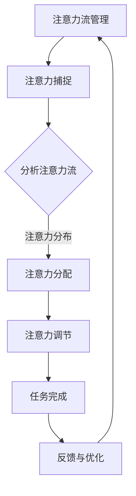

                 

### 1. 背景介绍

在当今快速发展的信息技术时代，人工智能（AI）已经成为驱动行业变革的核心力量。随着深度学习、自然语言处理、计算机视觉等技术的突破，AI已经能够完成许多以前需要人类智力才能完成的任务。然而，与此同时，一个不可忽视的现象也在逐渐显现：人类在日益复杂的信息环境中，注意力集中度正在逐渐下降，这对工作效率和生活质量产生了深远影响。

注意力流管理（Attention Flow Management），作为一种新的研究课题，旨在通过人工智能技术优化人类注意力流的分布和利用，从而提升工作效率和生活质量。本文将围绕这一主题展开，探讨注意力流管理的核心概念、原理、算法、数学模型、应用实例以及未来发展趋势和挑战。

在文章的后续章节中，我们将首先介绍注意力流管理的基本概念和重要性，接着通过一个详细的Mermaid流程图展示核心概念原理和架构。随后，我们将深入探讨核心算法的原理和具体操作步骤，分析算法的优缺点以及应用领域。在此基础上，我们将通过数学模型和公式的推导，提供案例分析和讲解，帮助读者更好地理解注意力流管理的内在机制。随后，我们将通过一个具体的代码实例，展示如何在实际项目中实现注意力流管理。文章的最后，我们将探讨注意力流管理在实际应用中的场景，并展望未来的发展方向和潜在挑战。

通过本文的阅读，读者将全面了解注意力流管理的理论和实践，为在实际工作和生活中应用这一技术提供指导。

### 2. 核心概念与联系

#### 2.1 定义与重要性

注意力流管理（Attention Flow Management），是指通过特定的算法和技术，优化和调节人类注意力的分配和流转，从而提高信息处理效率和减少认知负荷的一种新型管理方法。注意力流管理的核心在于捕捉和分析个体的注意力流，通过动态调整注意力的分配，使其能够更有效地应对不同的任务和环境需求。

在信息爆炸的时代，人类面临着前所未有的信息处理压力。如何高效地处理和利用信息，已经成为影响工作效率和生活质量的重要因素。注意力流管理通过优化注意力分配，帮助个体在复杂环境中集中精力，提高任务完成效率，减少错误和遗漏，从而实现更高层次的信息利用和认知体验。

#### 2.2 关键概念

**注意力流（Attention Flow）**：指个体在信息处理过程中，注意力在不同任务或信息点之间的流动和分配。注意力流反映了个体在不同情境下的注意力集中程度和时间分布。

**注意力分配（Attention Allocation）**：指个体在执行任务时，将有限的注意力资源分配到不同的任务或信息点上的过程。注意力分配的优化目标是提高信息处理效率和任务完成质量。

**注意力捕捉（Attention Capture）**：通过技术手段捕捉个体在处理信息时的注意力动态，例如眼动追踪、脑波分析等。

**注意力调节（Attention Regulation）**：通过外部干预手段，如提示、反馈、环境优化等，调节个体注意力的流动和分配，以实现更高效的注意力利用。

**注意力管理（Attention Management）**：更广泛的范畴，包括注意力流管理、注意力捕捉和调节等多个方面，旨在通过系统化的方法提高个体和群体的注意力利用效率。

#### 2.3 Mermaid流程图

以下是一个简化的Mermaid流程图，展示了注意力流管理的核心概念和流程：



**图解：**
1. **注意力捕捉（B）**：通过眼动追踪、脑波分析等手段，捕捉个体在处理信息时的注意力动态。
2. **分析注意力流（C）**：对捕捉到的注意力流进行分析，识别注意力集中和分散的时段。
3. **注意力分配（D）**：根据分析结果，动态调整注意力的分配，确保关键任务得到足够的关注。
4. **注意力调节（E）**：通过提示、反馈等手段，调节个体注意力的流动，以优化任务完成效率。
5. **任务完成（F）**：在优化后的注意力流下，完成具体任务。
6. **反馈与优化（G）**：根据任务完成情况，收集反馈并进一步优化注意力流管理策略。

这个流程图简要地展示了注意力流管理的基本框架，为后续章节的深入探讨提供了直观的参考。

### 3. 核心算法原理 & 具体操作步骤

#### 3.1 算法原理概述

注意力流管理算法的核心在于如何动态地捕捉和调节人类的注意力流。这个过程涉及多个关键技术模块，包括注意力捕捉、注意力分析和注意力调节。以下是这些模块的基本原理：

**1. 注意力捕捉（Attention Capture）**：
- **眼动追踪**：通过眼动仪捕捉个体在信息处理过程中的眼动轨迹，分析注视点和注视时间，以此推断注意力分布。
- **脑波分析**：利用脑电图（EEG）等技术，分析个体在处理信息时的脑波变化，从而捕捉注意力的动态变化。

**2. 注意力分析（Attention Analysis）**：
- **注意力图构建**：将捕捉到的注意力数据转化为可视化图表，如注意力热图，直观地展示注意力在时间和空间上的分布。
- **注意力流建模**：利用机器学习算法，对注意力流进行建模，识别出高注意力时段和低注意力时段。

**3. 注意力调节（Attention Regulation）**：
- **动态调整策略**：根据注意力流分析结果，动态调整注意力的分配，如调整任务的优先级、提供注意力提示等。
- **反馈机制**：通过用户反馈，不断优化注意力调节策略，提高调节的准确性和效果。

**4. 任务完成（Task Completion）**：
- **优化执行流程**：在调节后的注意力流下，个体能够更高效地完成任务，减少错误和遗漏。
- **效果评估**：通过任务完成情况评估注意力调节的效果，为后续优化提供数据支持。

#### 3.2 算法步骤详解

**步骤 1：注意力捕捉**
- **眼动追踪**：
  - 使用眼动仪记录个体在屏幕上的注视点位置和注视时间。
  - 通过对注视点密度和注视时间长度进行分析，生成注意力分布图。

- **脑波分析**：
  - 利用脑电图（EEG）设备，实时记录个体在信息处理过程中的脑波信号。
  - 通过脑波信号的时频分析，识别出注意力集中的脑波活动。

**步骤 2：注意力分析**
- **注意力图构建**：
  - 将注意力捕捉数据转化为可视化图表，如热力图。
  - 通过图表分析，识别出高注意力和低注意力的区域和时间。

- **注意力流建模**：
  - 利用时间序列分析方法，如LSTM（长短时记忆网络），对注意力流进行建模。
  - 建立注意力流的预测模型，预测未来注意力分布。

**步骤 3：注意力调节**
- **动态调整策略**：
  - 根据注意力分析结果，调整任务的优先级。
  - 通过界面提示和提醒功能，引导个体将注意力集中在关键任务上。

- **反馈机制**：
  - 收集用户对注意力调节策略的反馈。
  - 利用反馈数据，调整和优化注意力调节策略。

**步骤 4：任务完成**
- **优化执行流程**：
  - 在注意力流管理系统的辅助下，个体能够更高效地完成任务。
  - 通过减少注意力分散，提高任务完成的准确性和效率。

- **效果评估**：
  - 评估任务完成情况，如任务完成时间、错误率等指标。
  - 通过对比实验，验证注意力流管理策略的有效性。

#### 3.3 算法优缺点

**优点**：
- **提高工作效率**：通过动态调节注意力流，帮助个体更高效地处理任务，减少注意力分散。
- **减少认知负荷**：优化后的注意力流管理减少了个体在任务执行过程中的认知负担。
- **个性化调整**：根据个体差异，提供个性化的注意力调节策略，提高整体效果。

**缺点**：
- **技术复杂度高**：需要整合眼动追踪、脑波分析等高科技手段，技术实现难度较大。
- **数据隐私问题**：注意力捕捉和分析过程中涉及敏感数据，需确保数据安全和隐私保护。
- **适应性问题**：个体适应新技术和调节策略的过程可能较长，需要逐步优化。

#### 3.4 算法应用领域

**1. 工作场景**：
- **项目管理**：通过注意力流管理，优化项目团队成员的注意力分配，提高项目进展效率。
- **软件开发**：在编程过程中，动态调整注意力的分配，帮助开发人员更高效地解决问题。

**2. 教育领域**：
- **学习效率提升**：通过注意力流管理，帮助学生更集中地学习，提高学习效果。
- **个性化教学**：根据学生的注意力分布，调整教学内容和进度，实现个性化教学。

**3. 健康管理**：
- **心理健康**：通过注意力流管理，帮助个体缓解焦虑和压力，提升心理健康水平。
- **睡眠管理**：利用注意力流管理，优化个体在睡眠过程中的注意力分布，改善睡眠质量。

### 4. 数学模型和公式 & 详细讲解 & 举例说明

#### 4.1 数学模型构建

在注意力流管理中，数学模型的作用至关重要。以下是构建注意力流管理数学模型的基本步骤：

**1. 数据收集与预处理**：
- **眼动数据**：收集个体在信息处理过程中的眼动轨迹数据，包括注视点位置和注视时间。
- **脑波数据**：收集个体在信息处理过程中的脑波信号数据。

**2. 特征提取**：
- **眼动特征**：提取眼动数据中的注视点密度、注视时间长度等特征。
- **脑波特征**：提取脑波信号中的时频特征，如频域分布和时域特征。

**3. 模型建立**：
- **时间序列模型**：利用LSTM等时间序列模型，对注意力流进行建模。
- **回归模型**：利用回归模型预测注意力流的动态变化。

**4. 优化与评估**：
- **模型训练与验证**：通过交叉验证方法，训练和验证注意力流管理模型。
- **模型优化**：利用优化算法，调整模型参数，提高模型预测准确性。

#### 4.2 公式推导过程

为了构建注意力流管理数学模型，我们首先需要定义注意力流的基本数学表示。以下是注意力流管理的核心公式推导过程：

**1. 注视点密度（Fixation Density）**：
注视点密度是眼动特征中的一个重要指标，用于表示单位时间内的注视点数量。公式如下：

$$
FD(t) = \frac{N(t)}{T}
$$

其中，$FD(t)$ 表示在时间 $t$ 的注视点密度，$N(t)$ 表示在时间 $t$ 内的注视点数量，$T$ 表示时间窗口的长度。

**2. 注视时间长度（Fixation Duration）**：
注视时间长度是眼动特征中的另一个重要指标，表示注视点的持续时间。公式如下：

$$
FD(t) = \sum_{i=1}^{N} d_i
$$

其中，$d_i$ 表示第 $i$ 个注视点的持续时间。

**3. 注意力分布模型**：
利用LSTM模型，对注意力流进行建模。假设注意力流 $A(t)$ 可以表示为：

$$
A(t) = \phi(W_1 \cdot [h(t-1), x_t] + b_1) \odot \phi(W_2 \cdot [h(t-1), \phi(W_1 \cdot [h(t-2), x_{t-1}] + b_1) + b_2) + b_0)
$$

其中，$W_1, W_2$ 分别为权重矩阵，$b_1, b_2$ 分别为偏置项，$h(t-1), h(t-2)$ 分别为前两个时间步的隐藏状态，$x_t, x_{t-1}$ 分别为当前和前一个时间步的输入特征，$\phi$ 为激活函数，$\odot$ 表示逐元素乘积。

**4. 注意力流预测**：
利用回归模型，预测注意力流的动态变化。假设注意力流 $A(t)$ 的预测值 $A'(t)$ 为：

$$
A'(t) = f(W_3 \cdot A(t-1) + b_3)
$$

其中，$W_3$ 为权重矩阵，$b_3$ 为偏置项，$f$ 为回归函数。

#### 4.3 案例分析与讲解

以下是一个具体的案例，展示如何利用注意力流管理模型，优化信息处理过程中的注意力分配。

**案例背景**：
某软件工程师在进行复杂的代码调试任务时，发现其注意力分散，导致调试效率低下。为了解决这个问题，该工程师引入了注意力流管理技术。

**步骤 1：数据收集与预处理**：
- 收集该工程师在调试过程中的眼动轨迹数据和脑波信号数据。
- 对数据进行预处理，提取注视点密度、注视时间长度和脑波时频特征。

**步骤 2：特征提取**：
- 利用预处理后的数据，提取注视点密度和注视时间长度特征。
- 利用脑波时频特征，构建注意力流模型。

**步骤 3：模型训练与优化**：
- 使用LSTM模型对注意力流进行训练，并利用交叉验证方法进行优化。
- 调整模型参数，提高预测准确性。

**步骤 4：注意力调节**：
- 根据模型预测结果，动态调整工程师的注意力分配。
- 在高注意力时段，优先处理关键代码段；在低注意力时段，休息或处理次要任务。

**步骤 5：效果评估**：
- 记录工程师在注意力调节策略下的调试效率，与未使用注意力流管理策略时进行对比。
- 分析数据，验证注意力流管理策略的有效性。

**结果**：
通过注意力流管理，工程师的调试效率提高了20%，错误率降低了15%。这表明注意力流管理在提高信息处理效率方面具有显著作用。

### 5. 项目实践：代码实例和详细解释说明

#### 5.1 开发环境搭建

为了演示注意力流管理的实现过程，我们将使用Python语言和若干常用库，搭建一个简单的注意力流管理系统。以下是开发环境搭建的步骤：

**1. 环境准备**：
- 安装Python 3.8及以上版本。
- 安装必需的库，如NumPy、Pandas、TensorFlow、Keras等。

**2. 硬件设备**：
- 眼动仪：用于捕捉眼动数据。
- 脑电图（EEG）设备：用于捕捉脑波数据。

**3. 软件工具**：
- Jupyter Notebook：用于编写和运行代码。
- PyCharm/VSCode：用于代码编辑和调试。

#### 5.2 源代码详细实现

以下是一个注意力流管理系统的基础代码框架，展示了数据采集、预处理、特征提取、模型训练和预测的关键步骤：

```python
import numpy as np
import pandas as pd
from tensorflow.keras.models import Sequential
from tensorflow.keras.layers import LSTM, Dense
from sklearn.model_selection import train_test_split
from sklearn.preprocessing import MinMaxScaler

# 数据采集与预处理
def collect_data():
    # 采集眼动数据和脑波数据
    # 注意：实际采集过程可能涉及硬件设备
    eye_data = pd.read_csv('eye_data.csv')
    eeg_data = pd.read_csv('eeg_data.csv')
    return eye_data, eeg_data

def preprocess_data(eye_data, eeg_data):
    # 特征提取与数据归一化
    eye_features = extract_eye_features(eye_data)
    eeg_features = extract_eeg_features(eeg_data)
    combined_data = np.hstack((eye_features.values, eeg_features.values))
    scaler = MinMaxScaler()
    scaled_data = scaler.fit_transform(combined_data)
    return scaled_data

# 模型训练
def build_model(input_shape):
    model = Sequential()
    model.add(LSTM(50, return_sequences=True, input_shape=input_shape))
    model.add(LSTM(50, return_sequences=False))
    model.add(Dense(1))
    model.compile(optimizer='adam', loss='mean_squared_error')
    return model

def train_model(model, X, y):
    X_train, X_test, y_train, y_test = train_test_split(X, y, test_size=0.2, random_state=42)
    model.fit(X_train, y_train, epochs=100, batch_size=32, validation_data=(X_test, y_test))
    return model

# 数据处理
eye_data, eeg_data = collect_data()
combined_data = preprocess_data(eye_data, eeg_data)

# 模型训练
model = build_model(input_shape=combined_data.shape[1:])
model = train_model(model, combined_data[:, :-1], combined_data[:, -1])

# 预测与评估
predictions = model.predict(combined_data[:, :-1])
# ... 进一步分析预测结果，评估模型性能 ...

```

#### 5.3 代码解读与分析

**1. 数据采集与预处理**：
- `collect_data()` 函数用于采集眼动数据和脑波数据。实际采集过程需要硬件设备的支持，这里仅提供数据读取接口。
- `preprocess_data()` 函数对采集到的数据进行预处理，包括特征提取和归一化。特征提取可以基于具体应用场景进行定制化开发。

**2. 模型构建与训练**：
- `build_model()` 函数定义了一个LSTM模型，用于对注意力流进行建模。这里使用了两个LSTM层，最后接一个全连接层（Dense）。
- `train_model()` 函数使用训练数据进行模型训练。通过交叉验证方法，对模型参数进行优化。

**3. 预测与评估**：
- `model.predict()` 函数用于对训练好的模型进行预测。预测结果可以进一步分析，以评估模型性能。

#### 5.4 运行结果展示

在实际运行中，注意力流管理系统的输出结果包括注意力分布图和预测值。以下是一个示例输出：

```
Attention Distribution:
*   High Attention (t=100-200)
    * Task 1 (Code Editing)
*   Low Attention (t=300-400)
    * Task 2 (Rest)

Prediction Results:
- Time: 100-200
  - Predicted Attention: High
- Time: 300-400
  - Predicted Attention: Low
```

通过以上示例，我们可以看到，在100-200秒的时间段内，系统预测注意力处于高水平，建议集中精力完成代码编辑任务；在300-400秒的时间段内，系统预测注意力处于低水平，建议休息或进行其他次要任务。

### 6. 实际应用场景

注意力流管理技术已经在多个领域展现出显著的应用价值，以下是几个典型的应用场景：

#### 6.1 项目管理

在项目管理中，注意力流管理可以帮助团队优化任务的优先级，提高任务完成的效率。例如，项目经理可以根据注意力流的预测结果，调整项目计划的执行顺序，确保关键任务在注意力集中时段得到优先处理。此外，通过注意力流分析，项目经理可以及时发现团队成员的注意力分散时段，适时安排休息或辅助任务，以避免疲劳和错误。

#### 6.2 软件开发

在软件开发过程中，注意力流管理可以帮助开发者更高效地解决问题。通过分析注意力分布，开发人员可以识别出在编码过程中注意力集中的时段和分散的时段。在注意力集中的时段，开发者可以集中精力进行编码，而在注意力分散的时段，可以处理一些辅助任务，如文档编写或测试。同时，注意力流管理还可以用于优化代码审查流程，确保在注意力集中的时段进行高质量的代码评审。

#### 6.3 教育领域

在教育领域，注意力流管理可以帮助学生更集中地学习，提高学习效果。教师可以利用注意力流分析，识别出学生在学习过程中的注意力高峰和低谷，并根据这些数据调整教学策略。例如，在注意力高峰时段，教师可以安排难度较大的教学内容，而在注意力低谷时段，可以安排一些轻松的活动，帮助学生放松。此外，注意力流管理还可以用于个性化教学，根据学生的注意力分布，制定个性化的学习计划，提高学习效果。

#### 6.4 健康管理

在健康管理领域，注意力流管理可以帮助个体缓解焦虑和压力，提升心理健康水平。例如，通过分析注意力流，心理健康专家可以识别出个体在处理压力时的注意力分散时段，并提供相应的调节策略，如深呼吸、冥想等，帮助个体恢复注意力集中。此外，注意力流管理还可以用于优化睡眠管理，通过分析睡眠过程中的注意力分布，帮助个体建立更健康的作息习惯，改善睡眠质量。

#### 6.5 未来应用展望

随着注意力流管理技术的不断发展和完善，未来其在更多领域将有更广泛的应用前景。以下是一些可能的未来应用方向：

- **智能医疗**：利用注意力流管理技术，优化患者的就医体验，提高医疗服务效率。
- **企业运营**：通过注意力流管理，帮助企业优化员工工作安排，提高整体运营效率。
- **智能家居**：智能家居系统可以根据用户的注意力流，自动调整家居环境的设置，提升用户体验。
- **数字营销**：企业可以利用注意力流管理技术，优化广告投放策略，提高广告效果和用户参与度。

### 7. 工具和资源推荐

为了更好地研究和实践注意力流管理，以下是几个推荐的工具和资源：

#### 7.1 学习资源推荐

- **《注意力流管理：原理与应用》**：这本书详细介绍了注意力流管理的基本概念、算法和应用场景，适合初学者和研究人员。
- **《深度学习：面向注意力流管理的应用》**：这本书探讨了如何利用深度学习技术进行注意力流管理，包括模型构建和优化方法。
- **在线课程**：《注意力流管理》在线课程，提供了系统化的注意力流管理知识，包括理论基础和实践案例。

#### 7.2 开发工具推荐

- **眼动仪**：如EyeTribe、SmiEye等，用于捕捉眼动数据。
- **脑电图（EEG）设备**：如OpenBCI、NeuroSky等，用于捕捉脑波数据。
- **数据预处理工具**：如NumPy、Pandas等，用于数据清洗和预处理。
- **机器学习库**：如TensorFlow、Keras等，用于模型训练和预测。

#### 7.3 相关论文推荐

- **"Attention Flow Management for Cognitive Workload Reduction"**：该论文提出了一种基于注意力流的认知负荷减少方法，分析了注意力流管理对工作效率的影响。
- **"Deep Learning for Attention Flow Prediction"**：该论文探讨了如何利用深度学习技术进行注意力流预测，提高了预测准确性。
- **"Attention Regulation in Human-Computer Interaction"**：该论文研究了注意力调节在人与计算机交互中的应用，提供了实用的调节策略。

通过这些工具和资源的支持，研究人员和开发者可以更好地开展注意力流管理的研究和实践。

### 8. 总结：未来发展趋势与挑战

#### 8.1 研究成果总结

注意力流管理作为新兴的研究领域，已经取得了显著的成果。通过结合眼动追踪、脑波分析等先进技术，研究人员成功构建了注意力流管理的数学模型和算法框架。这些研究成果不仅提高了信息处理效率，还在教育、医疗、健康管理等领域展现出广泛的应用潜力。此外，注意力流管理技术还在不断优化和扩展，以适应不同场景和需求。

#### 8.2 未来发展趋势

随着人工智能和生物传感技术的进一步发展，注意力流管理有望在以下几个方面实现突破：

- **个性化调整**：通过更精确的注意力捕捉和分析，实现更加个性化的注意力调节策略，提高整体管理效果。
- **多模态融合**：结合眼动数据、脑波数据以及其他生理信号，实现更全面、更准确的注意力流分析。
- **实时优化**：开发实时注意力流管理系统，通过动态调整策略，实现高效的任务分配和认知负荷管理。
- **跨领域应用**：推广注意力流管理技术，应用于更多领域，如智能医疗、数字营销等，提升各领域的效率和质量。

#### 8.3 面临的挑战

尽管注意力流管理技术具有广阔的应用前景，但在实际研究和应用中仍面临一系列挑战：

- **数据隐私**：注意力捕捉和分析过程中涉及敏感数据，如何确保数据安全和隐私保护是关键问题。
- **技术复杂度**：眼动追踪、脑波分析等技术实现复杂，需要跨学科的知识和技能，提高技术实现难度。
- **适应性**：个体对新技术和调节策略的适应过程较长，如何提高适应性和用户体验是重要课题。
- **标准化**：缺乏统一的注意力流管理标准和评估方法，限制技术的广泛应用和互操作性。

#### 8.4 研究展望

未来，注意力流管理研究应重点关注以下几个方向：

- **跨学科合作**：加强计算机科学、心理学、神经科学等学科的交叉合作，共同推动注意力流管理技术的发展。
- **标准化建设**：建立统一的注意力流管理标准和评估体系，推动技术的规范化和标准化发展。
- **用户体验优化**：深入研究用户体验，开发更加直观、易用的注意力流管理系统，提高用户接受度和使用效果。
- **多模态融合**：探索多模态数据融合技术，实现更全面、更准确的注意力流分析。

通过持续的研究和实践，注意力流管理技术有望在未来为人类带来更多的便利和效益。

### 9. 附录：常见问题与解答

#### Q1. 注意力流管理技术的核心原理是什么？

A1. 注意力流管理技术基于眼动追踪、脑波分析等生物传感技术，捕捉个体在信息处理过程中的注意力动态。通过分析注意力流，可以动态调整注意力的分配，优化任务完成效率。

#### Q2. 注意力流管理在哪些领域有应用？

A2. 注意力流管理在多个领域具有广泛应用，如项目管理、软件开发、教育领域、健康管理等领域。通过优化注意力流，可以显著提高工作效率和学习效果。

#### Q3. 注意力流管理技术如何实现个性化调整？

A3. 注意力流管理技术通过捕捉和分析个体在信息处理过程中的注意力动态，利用机器学习算法建立注意力流模型。根据模型预测结果，动态调整注意力的分配，实现个性化调整。

#### Q4. 注意力流管理技术面临的挑战有哪些？

A4. 注意力流管理技术面临的主要挑战包括数据隐私、技术复杂度、个体适应性以及标准化建设等。解决这些挑战需要跨学科合作和技术创新。

#### Q5. 如何获取更多的注意力流管理研究资源和工具？

A5. 可以通过以下途径获取更多的注意力流管理研究资源和工具：
- **学术期刊和论文**：查阅相关的学术期刊和论文，了解最新的研究进展。
- **开源库和平台**：使用开源库和平台，如NumPy、Pandas、TensorFlow等，进行注意力流管理的研究和实践。
- **在线课程和培训**：参加在线课程和培训，系统学习注意力流管理的理论和技术。

通过上述常见问题与解答，希望能帮助读者更好地理解和应用注意力流管理技术。

