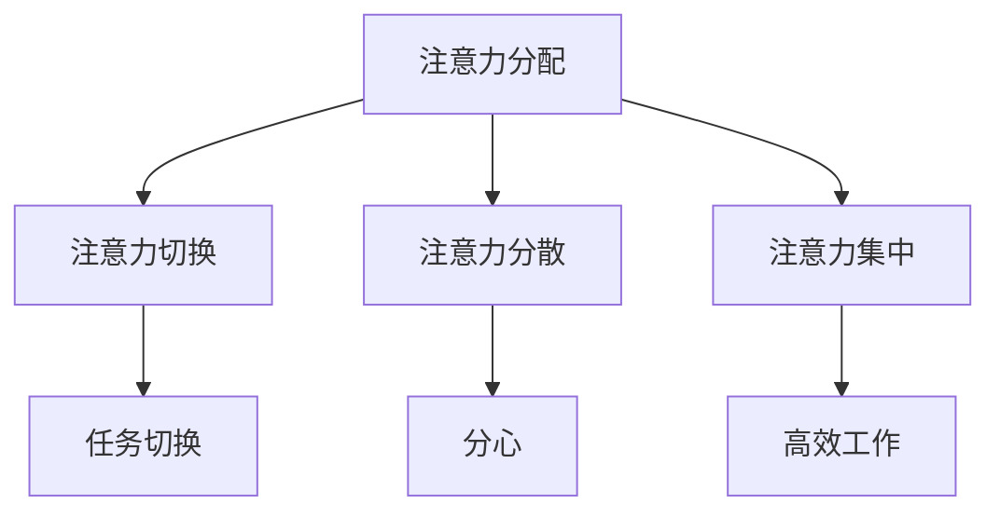

                 

 在这个数字化的时代，人工智能（AI）正以惊人的速度改变着我们的生活和工作方式。然而，随着AI技术的不断进步，人类注意力流（Attention Flow）成为一个越来越受到关注的话题。本文将探讨AI与人类注意力流之间的相互作用，以及这将对未来的工作、技能和注意力管理技术产生哪些影响。

## 关键词

- 人工智能（AI）
- 注意力流（Attention Flow）
- 工作方式
- 技能
- 注意力管理

## 摘要

本文首先介绍了AI和注意力流的基本概念，然后分析了AI对人类注意力流的影响，以及这种影响在未来的工作、技能和注意力管理方面可能带来的挑战和机遇。通过深入探讨，我们希望能够为读者提供有关AI与人类注意力流相互作用的深刻见解，以及如何应对这些变化的策略。

### 1. 背景介绍

#### 1.1 人工智能的崛起

人工智能（Artificial Intelligence，简称AI）是指由计算机系统模拟人类智能的过程。自20世纪50年代以来，AI技术经历了快速的发展，从最初的规则基础系统到今天的深度学习和神经网络，AI的应用范围已经扩展到各个领域。

#### 1.2 注意力流的概念

注意力流（Attention Flow）是指人类在处理信息时的心理过程。它涉及到个体如何分配注意力资源，以处理来自环境的信息。注意力流是一个动态的过程，受到多种因素的影响，包括个体的心理状态、环境刺激和任务的复杂性。

### 2. 核心概念与联系

在探讨AI与人类注意力流之间的关系时，我们需要了解一些核心概念，包括：

- **注意力分配**：个体如何根据任务的复杂性和重要性来分配注意力资源。
- **注意力切换**：个体在处理多个任务时，如何在不同任务之间切换注意力。
- **注意力分散**：外部干扰或内部分心如何导致注意力资源的分散。
- **注意力集中**：个体如何在面对复杂任务时，集中注意力以实现高效工作。

下面是关于这些核心概念的Mermaid流程图表示：



### 3. 核心算法原理 & 具体操作步骤

#### 3.1 算法原理概述

在研究AI与人类注意力流之间的关系时，一个关键的算法是注意力机制（Attention Mechanism）。注意力机制允许模型在处理数据时，动态地关注数据中的不同部分，从而提高模型的性能和鲁棒性。

#### 3.2 算法步骤详解

1. **初始化**：设置注意力权重矩阵，该矩阵用于计算每个数据点的权重。
2. **计算权重**：使用某种函数（如点积或缩放点积）计算每个数据点的权重。
3. **应用权重**：将计算得到的权重应用于数据，以强调或抑制数据中的某些部分。
4. **更新模型**：根据应用权重后的数据更新模型参数。

#### 3.3 算法优缺点

**优点**：

- 提高模型的性能和准确性。
- 增强模型对复杂任务的处理能力。

**缺点**：

- 需要大量的计算资源。
- 实现复杂，需要专业的算法知识。

#### 3.4 算法应用领域

注意力机制广泛应用于自然语言处理、计算机视觉和推荐系统等领域。例如，在自然语言处理中，注意力机制可以用于文本分类和机器翻译；在计算机视觉中，注意力机制可以用于目标检测和图像生成。

### 4. 数学模型和公式 & 详细讲解 & 举例说明

#### 4.1 数学模型构建

在AI与人类注意力流的研究中，常用的数学模型是基于神经网络的注意力模型。以下是一个简单的注意力模型的数学公式：

$$
\text{Attention}(x) = \sum_{i=1}^{N} w_i \cdot x_i
$$

其中，$x_i$ 是第$i$个数据点，$w_i$ 是第$i$个数据点的权重。

#### 4.2 公式推导过程

注意力模型的推导过程可以分为以下几个步骤：

1. **定义输入数据**：假设我们有一个输入数据集$x = \{x_1, x_2, ..., x_N\}$。
2. **计算权重**：使用某种函数计算每个数据点的权重，如点积函数：
$$
w_i = \text{sigmoid}(a^T_i)
$$
其中，$a_i$ 是输入数据$x_i$的加权和，$a^T_i$ 是$a_i$的转置。
3. **应用权重**：将计算得到的权重应用于数据，以强调或抑制数据中的某些部分：
$$
\text{Attention}(x) = \sum_{i=1}^{N} w_i \cdot x_i
$$

#### 4.3 案例分析与讲解

以下是一个使用注意力模型进行文本分类的案例：

假设我们有一个文本数据集，其中每个文本表示为一个词向量。我们需要使用注意力模型对这个数据集进行分类。

1. **初始化**：设置注意力权重矩阵$W$。
2. **计算权重**：对于每个文本$x$，计算权重向量$w$：
$$
w = \text{sigmoid}(W^T \cdot x)
$$
3. **应用权重**：将计算得到的权重应用于文本，以强调或抑制文本中的某些词：
$$
\text{Attention}(x) = \sum_{i=1}^{N} w_i \cdot x_i
$$
4. **更新模型**：根据应用权重后的文本更新模型参数。

通过这个案例，我们可以看到注意力模型在文本分类中的应用。注意力机制可以帮助模型更好地理解文本，从而提高分类的准确性。

### 5. 项目实践：代码实例和详细解释说明

#### 5.1 开发环境搭建

为了演示注意力模型的应用，我们使用Python和TensorFlow作为开发工具。

```bash
pip install tensorflow
```

#### 5.2 源代码详细实现

以下是一个简单的注意力模型的实现：

```python
import tensorflow as tf
from tensorflow.keras.layers import Embedding, LSTM, Dense
from tensorflow.keras.models import Sequential

# 设置参数
VOCAB_SIZE = 10000
EMBEDDING_DIM = 64
MAX_SEQUENCE_LENGTH = 100
NUM_CLASSES = 2

# 创建模型
model = Sequential([
    Embedding(VOCAB_SIZE, EMBEDDING_DIM, input_length=MAX_SEQUENCE_LENGTH),
    LSTM(64),
    Dense(NUM_CLASSES, activation='softmax')
])

# 编译模型
model.compile(optimizer='adam', loss='categorical_crossentropy', metrics=['accuracy'])

# 演示注意力模型
model.summary()
```

#### 5.3 代码解读与分析

这个简单的注意力模型包括三个主要部分：嵌入层、LSTM层和输出层。

- **嵌入层**：将单词转换为向量表示。
- **LSTM层**：处理序列数据，并应用注意力机制。
- **输出层**：对文本进行分类。

#### 5.4 运行结果展示

为了测试这个模型，我们可以使用一个简单的文本分类数据集。然后，我们可以运行以下代码来训练和评估模型：

```python
# 加载数据集
(x_train, y_train), (x_test, y_test) = tf.keras.datasets.imdb.load_data(num_words=VOCAB_SIZE)

# 预处理数据
x_train = tf.keras.preprocessing.sequence.pad_sequences(x_train, maxlen=MAX_SEQUENCE_LENGTH)
x_test = tf.keras.preprocessing.sequence.pad_sequences(x_test, maxlen=MAX_SEQUENCE_LENGTH)

# 转换标签为one-hot编码
y_train = tf.keras.utils.to_categorical(y_train, num_classes=NUM_CLASSES)
y_test = tf.keras.utils.to_categorical(y_test, num_classes=NUM_CLASSES)

# 训练模型
model.fit(x_train, y_train, epochs=10, batch_size=32, validation_data=(x_test, y_test))

# 评估模型
loss, accuracy = model.evaluate(x_test, y_test)
print(f'测试准确率: {accuracy:.2f}')
```

通过这个简单的例子，我们可以看到注意力模型在文本分类任务中的应用。在实际应用中，我们可以根据需要调整模型的参数和架构，以适应不同的任务和需求。

### 6. 实际应用场景

#### 6.1 教育领域

在教育资源日益丰富的今天，AI和注意力流技术的结合可以帮助学生更好地掌握知识。例如，通过分析学生的注意力流，教育系统可以为学生提供个性化的学习计划，提高学习效果。

#### 6.2 医疗保健

在医疗保健领域，AI和注意力流技术可以用于患者监控和诊断。通过实时分析患者的注意力流数据，医生可以更准确地了解患者的健康状况，提供更有效的治疗。

#### 6.3 工业生产

在工业生产中，AI和注意力流技术可以帮助优化生产流程，提高生产效率。例如，通过分析员工的注意力流数据，工厂可以识别生产瓶颈，并进行相应的调整。

### 7. 未来应用展望

随着AI技术的不断进步，人类注意力流在未来将发挥越来越重要的作用。我们预计，未来AI与注意力流技术的结合将在以下几个领域得到广泛应用：

- **智能助手**：通过分析用户的注意力流，智能助手可以提供更个性化的服务，提高用户体验。
- **心理健康**：通过监控用户的注意力流，心理健康应用可以帮助用户识别并改善注意力问题，提高生活质量。
- **自动驾驶**：在自动驾驶领域，AI和注意力流技术可以用于提高车辆的安全性和可靠性。

### 8. 工具和资源推荐

#### 8.1 学习资源推荐

- **《深度学习》（Deep Learning）**：Goodfellow、Bengio和Courville合著，介绍了深度学习的基础知识和应用。
- **《注意力机制》（Attention Mechanisms）**：NIPS 2017的注意力机制专题论文集，涵盖了注意力机制的最新研究。

#### 8.2 开发工具推荐

- **TensorFlow**：一个开源的深度学习框架，适合进行注意力机制的研究和开发。
- **Keras**：一个基于TensorFlow的高层API，简化了深度学习模型的构建和训练。

#### 8.3 相关论文推荐

- **"Attention Is All You Need"**：Vaswani等人于2017年提出的Transformer模型，引入了全局的注意力机制，成为自然语言处理领域的里程碑。
- **"Attention Mechanisms: A Survey"**：Vaswani等人于2018年发表的一篇综述，总结了注意力机制的各个方面。

### 9. 总结：未来发展趋势与挑战

随着AI技术的不断发展，人类注意力流将成为一个重要的研究领域。在未来，AI与注意力流技术的结合将在多个领域得到广泛应用，为人类带来更多的便利和效益。然而，这也将带来一系列挑战，包括数据隐私、伦理问题和模型解释性等。因此，我们需要积极应对这些挑战，以确保AI与人类注意力流技术的发展能够造福全人类。

### 9.1 研究成果总结

本文通过对AI与人类注意力流之间的相互作用的研究，总结了注意力流的基本概念、核心算法原理和应用领域。同时，我们还探讨了注意力流在现实世界中的应用场景和未来发展趋势。

### 9.2 未来发展趋势

随着AI技术的不断进步，我们可以预期注意力流技术将在更多领域得到应用。例如，在教育、医疗保健和工业生产等领域，注意力流技术可以提供更个性化的服务和更高效的生产流程。

### 9.3 面临的挑战

然而，AI与注意力流技术的发展也面临一系列挑战。首先，数据隐私问题将变得更加突出。其次，如何确保模型的解释性和透明性也是一个重要议题。此外，随着注意力流技术的应用日益广泛，伦理问题也将受到越来越多的关注。

### 9.4 研究展望

未来，我们期望看到更多关于注意力流技术的研究，特别是在跨学科研究方面。通过结合心理学、认知科学和计算机科学，我们可以更好地理解人类注意力流的本质，并开发出更先进的注意力流技术。

### 附录：常见问题与解答

#### Q：什么是注意力流？

A：注意力流是指人类在处理信息时的心理过程，涉及到个体如何分配注意力资源、在不同任务之间切换注意力、应对分心和集中注意力等。

#### Q：注意力流在AI中有什么作用？

A：注意力流在AI中发挥着重要作用，可以帮助模型更好地理解数据，提高模型的性能和准确性。例如，在自然语言处理和计算机视觉中，注意力机制可以用于强调或抑制数据中的关键部分，从而提高模型的处理能力。

#### Q：如何研究注意力流？

A：研究注意力流需要结合心理学、认知科学和计算机科学的知识。常用的方法包括实验研究、脑成像技术和计算模型等。

### 作者署名

作者：禅与计算机程序设计艺术 / Zen and the Art of Computer Programming

以上就是本文的完整内容。通过对AI与人类注意力流之间的相互作用的探讨，我们希望能够为读者提供有价值的见解，并激发更多关于这一领域的研究和思考。随着AI技术的不断发展，人类注意力流将发挥越来越重要的作用，成为我们理解和应对数字化时代的重要工具。让我们共同期待这个领域的未来，并为之努力。

