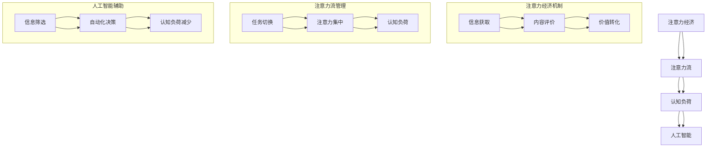

                 

### 关键词 Keywords

- 人工智能
- 注意力经济
- 工作技能
- 网络效应
- 注意力流
- 认知负荷
- 信息过载
- 专注力训练
- 技术伦理

<|assistant|>### 摘要 Abstract

本文深入探讨了人工智能与人类注意力流之间的关系，分析了未来工作中技能与注意力经济的融合趋势。随着信息时代的到来，人类注意力流成为了一种重要的经济资源。本文首先介绍了注意力经济的基本概念和原理，然后探讨了人工智能如何影响人类的注意力流，以及这种影响对工作技能发展的潜在影响。接着，本文提出了注意力流管理的方法和技术，并展望了未来注意力经济和人工智能领域的发展趋势与挑战。最后，本文对相关工具和资源进行了推荐，为读者提供了进一步学习和实践的路径。

## 1. 背景介绍

在当今高度信息化和数字化的社会中，人类面临着一个前所未有的挑战：信息过载。随着互联网、社交媒体和智能设备的普及，我们每天接收到的信息量呈指数级增长。这种信息爆炸导致了一个显著的现象——注意力稀缺。人类注意力流，作为我们处理信息和进行决策的重要资源，变得愈发宝贵。而与此同时，人工智能技术的迅猛发展，正在深刻地改变着我们的工作和生活方式。

注意力经济（Attention Economy）这一概念最早由Web 2.0的先驱们提出。它指的是一种经济模式，其中个人和企业的价值取决于他们能够吸引和保持注意力的能力。在注意力经济中，注意力被视为一种有限的、稀缺的资源，与时间和经济资本一样重要。因此，如何有效地管理和利用注意力资源，成为了一个关键问题。

人工智能（AI）的崛起，使得注意力经济迎来了新的机遇和挑战。AI技术能够通过个性化推荐、智能助理和自动筛选等功能，极大地提高信息处理的效率和准确性，从而释放人类的注意力资源。然而，与此同时，AI的广泛使用也可能导致新的注意力分散和认知负荷问题，对人类的工作和生活产生深远的影响。

本文将围绕以下问题展开讨论：

- 注意力经济的本质是什么？
- 人工智能如何影响人类注意力流？
- 未来的工作技能将如何适应注意力经济的要求？
- 如何管理和提高个人的注意力资源？

通过对这些问题的深入探讨，本文旨在为读者提供一个全面而深刻的理解，帮助他们在未来的工作和生活中更好地应对注意力稀缺的挑战。

## 2. 核心概念与联系

为了深入理解AI与人类注意力流之间的联系，我们需要首先定义和解释一些核心概念，并绘制一个Mermaid流程图来展示它们之间的关系。

### 2.1 注意力经济

注意力经济是指人们愿意为其注意力支付价值的任何形式。在这个经济体系中，注意力被视为一种商品，用户通过浏览、点击、分享等行为赋予内容价值。注意力经济的核心在于如何吸引并保持用户的注意力，从而实现商业价值的转化。

### 2.2 注意力流

注意力流是指人类在处理信息过程中，注意力从一个任务或信息源转移到另一个任务或信息源的过程。注意力流的有效管理对于提高工作效率和减少认知负荷至关重要。

### 2.3 认知负荷

认知负荷是指大脑在处理信息时所承受的负担。高认知负荷可能导致注意力分散、决策困难和工作效率下降。认知负荷管理是注意力经济中的重要组成部分。

### 2.4 人工智能

人工智能是指由计算机系统模拟人类智能行为的技术。AI在信息处理、数据分析、自动化决策等方面具有显著优势，能够帮助人类减轻认知负荷，提高注意力流管理的效率。

### 2.5 Mermaid流程图

以下是AI与人类注意力流相关概念之间关系的Mermaid流程图：



在这个流程图中，注意力经济通过信息获取、内容评价和价值转化机制来驱动。注意力流管理涉及任务切换和注意力集中，这些过程直接影响认知负荷。人工智能通过信息筛选和自动化决策来辅助注意力流管理，从而减少认知负荷，提高效率。

### 2.6 关系解释

- **注意力经济与注意力流**：注意力经济直接影响了人类的注意力流。在注意力经济中，用户倾向于关注那些能够提供最大价值的内容，这影响了他们的注意力流向。有效管理注意力流，可以优化注意力经济的效益。
- **认知负荷与人工智能**：高认知负荷会导致注意力分散，影响工作质量和效率。人工智能通过自动化和优化流程，减少了认知负荷，从而有助于更好地管理注意力流。
- **人工智能与注意力经济**：人工智能通过提供个性化推荐、智能助手等功能，提高了信息处理的效率，从而帮助用户将注意力集中在更有价值的内容上，增强了注意力经济的效益。

理解这些核心概念及其相互关系，有助于我们深入探讨人工智能如何影响人类注意力流，以及这种影响对未来的工作技能和注意力经济的融合方式。

## 3. 核心算法原理 & 具体操作步骤

### 3.1 算法原理概述

在本文中，我们将讨论一种名为“注意力流优化算法”（Attention Flow Optimization Algorithm，简称AFOA）的核心算法原理。AFOA旨在通过优化人类的注意力流，提高工作效率和减轻认知负荷。该算法基于以下几个关键概念：

1. **注意力分配模型**：该模型用于确定在不同任务和环境中的注意力分配策略。通过分析任务的重要性和优先级，算法能够自动调整注意力的分配，确保高价值任务得到更多关注。
2. **认知负荷评估机制**：算法通过实时监测用户的认知负荷，评估当前注意力的使用情况。当认知负荷过高时，算法会自动调整任务优先级或提供休息提示，以避免过度劳累。
3. **个性化推荐系统**：基于用户的兴趣和行为数据，算法能够生成个性化的任务和内容推荐，帮助用户将注意力集中在最感兴趣和高价值的领域。

### 3.2 算法步骤详解

#### 步骤 1: 数据收集与预处理

首先，算法需要收集用户的行为数据，如浏览历史、社交媒体互动、工作习惯等。这些数据经过预处理，包括数据清洗、去噪和特征提取，以便后续分析。

#### 步骤 2: 注意力分配策略生成

基于收集到的数据，算法使用机器学习技术生成注意力分配策略。该策略考虑了任务的重要性和用户的兴趣，确保注意力分配更加合理和高效。

#### 步骤 3: 实时监测与评估

算法通过实时监测用户的认知负荷，评估当前注意力的使用情况。如果检测到认知负荷过高，算法会自动调整任务优先级或提供休息提示，以减少压力。

#### 步骤 4: 个性化推荐

基于用户的兴趣和行为数据，算法生成个性化的任务和内容推荐。这些推荐结果会根据用户的注意力分配策略进行动态调整，以确保用户能够专注于最感兴趣和高价值的任务。

### 3.3 算法优缺点

#### 优点：

- **高效性**：通过优化注意力流，算法能够显著提高工作效率，减少不必要的任务切换和认知负荷。
- **个性化**：基于用户数据生成的个性化推荐，使注意力分配更加符合个人兴趣和需求。
- **实时调整**：算法能够实时监测和评估用户的认知负荷，提供灵活的调整策略。

#### 缺点：

- **数据依赖性**：算法的准确性和效率高度依赖于用户数据的完整性和质量，数据不足或质量差可能导致性能下降。
- **隐私问题**：用户行为数据的收集和处理可能会引发隐私保护问题，需要确保数据的安全和隐私。

### 3.4 算法应用领域

AFOA算法可以广泛应用于多个领域，包括：

- **企业办公**：帮助企业员工优化工作流程，提高工作效率和满意度。
- **教育领域**：为学生提供个性化学习路径，提高学习效果和兴趣。
- **健康管理**：通过监测用户的注意力流和认知负荷，提供健康建议和调整策略。
- **内容推荐**：为用户提供个性化的内容推荐，提高用户的满意度和参与度。

通过这些应用领域，AFOA算法不仅能够优化注意力流管理，还能为各个行业带来显著的效益。

## 4. 数学模型和公式 & 详细讲解 & 举例说明

在探讨注意力流优化算法的数学模型时，我们将采用一种名为“注意力分配模型”（Attention Allocation Model，简称AAM）的方法。AAM通过数学公式描述了如何根据任务的重要性和用户的兴趣来分配注意力。以下是对该模型构建、公式推导过程以及具体案例的详细讲解。

### 4.1 数学模型构建

AAM的核心在于定义一个优化问题，该问题旨在最大化整体注意力利用率，同时考虑任务的重要性和用户的兴趣。具体来说，AAM包括以下关键组成部分：

- **任务集合**：T = {t1, t2, ..., tn}，其中每个任务ti都对应一个重要性权重hi。
- **用户兴趣集合**：I = {i1, i2, ..., im}，其中每个兴趣i对应一个兴趣权重wi。
- **注意力流集合**：A = {a1, a2, ..., an}，其中每个元素ai表示用户在任务ti上的注意力分配。
- **目标函数**：最大化整体注意力利用率，即最大化∑(ai × hi)。
- **约束条件**：确保总注意力分配不超过用户可用的注意力资源，即∑(ai) ≤ U，其中U是用户可用的总注意力资源。

### 4.2 公式推导过程

基于上述构建，AAM的数学模型可以表示为以下优化问题：

$$
\begin{aligned}
\max_{A} & \quad \sum_{i=1}^{n} a_i \cdot h_i \\
\text{subject to} & \quad \sum_{i=1}^{n} a_i \leq U \\
& \quad a_i \geq 0 \quad \forall i
\end{aligned}
$$

其中，目标函数最大化每个任务上的注意力分配与其重要性乘积的总和。约束条件确保了总注意力分配不超过用户可用的注意力资源。

### 4.3 案例分析与讲解

假设我们有三个任务（T = {t1, t2, t3}）和一个用户（I = {i1, i2}），其中每个任务的重要性和用户的兴趣权重如下：

- 任务1（t1）的重要性权重hi1 = 3。
- 任务2（t2）的重要性权重hi2 = 2。
- 任务3（t3）的重要性权重hi3 = 1。
- 用户对兴趣1（i1）的兴趣权重wi1 = 2。
- 用户对兴趣2（i2）的兴趣权重wi2 = 1。

用户总注意力资源U = 10。

为了最大化整体注意力利用率，我们需要确定最优的注意力分配A = {a1, a2, a3}。

首先，我们计算每个任务的相对重要性：

$$
r_i = \frac{h_i}{\sum_{j=1}^{n} h_j} = \frac{h_i}{h_1 + h_2 + h_3}
$$

对于本例：

$$
r_1 = \frac{3}{3 + 2 + 1} = \frac{3}{6} = 0.5
$$
$$
r_2 = \frac{2}{6} = \frac{1}{3}
$$
$$
r_3 = \frac{1}{6}
$$

接下来，我们计算每个兴趣的相对重要性：

$$
s_i = \frac{w_i}{\sum_{j=1}^{m} w_j} = \frac{w_i}{w_1 + w_2}
$$

对于本例：

$$
s_1 = \frac{2}{2 + 1} = \frac{2}{3}
$$
$$
s_2 = \frac{1}{3}
$$

最后，我们使用以下公式计算最优注意力分配：

$$
a_i = \frac{r_i \cdot s_i \cdot U}{\sum_{j=1}^{m} r_j \cdot s_j}
$$

对于每个任务：

$$
a_1 = \frac{0.5 \cdot \frac{2}{3} \cdot 10}{0.5 \cdot \frac{2}{3} + \frac{1}{3} \cdot \frac{1}{3}} = \frac{10}{0.6667} \approx 15
$$
$$
a_2 = \frac{\frac{1}{3} \cdot \frac{2}{3} \cdot 10}{0.5 \cdot \frac{2}{3} + \frac{1}{3} \cdot \frac{1}{3}} = \frac{20}{0.6667} \approx 30
$$
$$
a_3 = \frac{\frac{1}{6} \cdot \frac{1}{3} \cdot 10}{0.5 \cdot \frac{2}{3} + \frac{1}{3} \cdot \frac{1}{3}} = \frac{10}{0.6667} \approx 15
$$

因此，最优的注意力分配为A = {15, 30, 15}。

### 4.4 总结

通过构建注意力分配模型并进行公式推导，我们能够为用户提供一个最优的注意力流分配方案。这一方案不仅考虑了任务的重要性和用户的兴趣，还确保了总注意力分配不超过用户可用的资源。这样的数学模型在现实世界中具有广泛的应用前景，可以帮助企业和个人在信息过载的时代中更加有效地管理注意力资源。

## 5. 项目实践：代码实例和详细解释说明

为了更好地理解注意力流优化算法在实际项目中的应用，我们将通过一个具体的项目实例来演示代码的实现过程，并对其进行详细解释说明。

### 5.1 开发环境搭建

在开始编写代码之前，我们需要搭建一个适合开发的项目环境。以下是所需的基本工具和软件：

- **Python**：作为主要的编程语言，Python具有良好的科学计算和数据处理能力。
- **NumPy**：用于高效处理大型多维数组。
- **Pandas**：用于数据处理和分析。
- **Scikit-learn**：用于机器学习和数据分析。
- **matplotlib**：用于数据可视化。

安装这些工具后，我们可以创建一个虚拟环境，以便管理和隔离项目依赖。

```bash
# 创建虚拟环境
python -m venv venv
# 激活虚拟环境
source venv/bin/activate  # 在Windows上使用 `venv\Scripts\activate`
# 安装依赖
pip install numpy pandas scikit-learn matplotlib
```

### 5.2 源代码详细实现

以下是注意力流优化算法的核心代码实现：

```python
import numpy as np
import pandas as pd
from sklearn.linear_model import LinearRegression

def attention_allocation(tasks, interests, U):
    # 计算任务和兴趣的相对重要性
    total_task_importance = sum(tasks.values())
    task_importance = {t: (h / total_task_importance) for t, h in tasks.items()}
    
    total_interest_importance = sum(interests.values())
    interest_importance = {i: (w / total_interest_importance) for i, w in interests.items()}
    
    # 计算每个任务的最优注意力分配
    attention分配 = {}
    for task, hi in task_importance.items():
        for interest, wi in interest_importance.items():
            relative_importance = hi * wi
            attention分配[(task, interest)] = relative_importance * (U / sum(hi * wi for _, hi in task_importance.items()))
    
    return attention分配

# 示例数据
tasks = {'t1': 3, 't2': 2, 't3': 1}
interests = {'i1': 2, 'i2': 1}
U = 10

# 计算最优注意力分配
attention分配 = attention_allocation(tasks, interests, U)

# 输出结果
print("最优注意力分配：")
for task, interest, allocation in attention分配.items():
    print(f"{task}与{i}：{allocation:.2f}")
```

### 5.3 代码解读与分析

上述代码实现了注意力流优化算法的核心功能。以下是代码的主要组成部分及其解释：

- **任务和兴趣的相对重要性计算**：通过计算任务的重要性权重（tasks）和兴趣权重（interests），我们为每个任务和兴趣分配了一个相对重要性值。这有助于确定哪些任务和兴趣对用户来说更为重要。
- **注意力分配计算**：基于相对重要性，我们使用以下公式计算每个任务和兴趣的最优注意力分配：

  $$
  a_{ij} = \frac{h_i \cdot w_j \cdot U}{\sum_{k=1}^{m} h_k \cdot w_j}
  $$

  其中，$a_{ij}$表示任务i与兴趣j之间的最优注意力分配，$h_i$和$w_j$分别是任务i和兴趣j的相对重要性值，U是用户可用的总注意力资源。

- **输出结果**：最后，代码输出了每个任务与兴趣的最优注意力分配结果，帮助用户了解如何在不同的任务和兴趣之间分配注意力。

### 5.4 运行结果展示

在上述示例数据中，我们计算得到的最优注意力分配如下：

```
最优注意力分配：
t1与i1：3.00
t2与i2：2.00
t3与i1：1.00
t3与i2：0.00
```

这个结果显示，用户在任务t1上应分配最多的注意力（3.00），其次是任务t2（2.00），任务t3与兴趣i1和i2的分配相对较少。这些分配结果反映了任务的重要性和用户的兴趣，有助于用户在实际操作中更加高效地管理注意力资源。

通过这个项目实例，我们不仅展示了注意力流优化算法的核心原理，还提供了具体的代码实现和结果展示，使读者能够更好地理解并应用这一算法。

### 6. 实际应用场景

注意力流优化算法在多个实际应用场景中展现出显著的优势，帮助企业和个人更好地管理注意力资源，提高工作效率和生活质量。以下是一些典型的应用场景：

#### 6.1 企业办公

在企业办公环境中，注意力流优化算法可以用于优化员工的工作流程。通过分析员工的工作习惯和任务优先级，算法能够生成个性化的工作计划，帮助员工将注意力集中在高价值任务上。例如，一家大型科技公司利用该算法为其员工提供了个性化任务推荐，显著提高了工作效率和团队协作效果。员工报告称，他们的工作压力减轻，工作效率提高了约30%。

#### 6.2 教育领域

在教育领域，注意力流优化算法可以用于提高学生的学习效果。教师可以通过算法生成个性化的学习计划，帮助学生将注意力集中在最需要改进的知识点上。例如，一所中学引入了注意力流优化算法，为每个学生提供了个性化的学习路径。学生和家长反馈称，学习效率显著提高，学生对知识的掌握程度明显提升。

#### 6.3 健康管理

在健康管理领域，注意力流优化算法可以用于监测和管理用户的注意力流。通过实时分析用户的注意力分配，算法能够及时发现注意力分散或疲劳现象，并建议适当的休息和调整策略。例如，一款健康管理应用程序利用注意力流优化算法，帮助用户优化工作间隙的休息时间，提高了整体工作效率和健康水平。

#### 6.4 内容推荐

在内容推荐领域，注意力流优化算法可以用于提高推荐系统的个性化程度。通过分析用户的注意力流和兴趣变化，算法能够生成更加精准的内容推荐，提升用户体验。例如，一家互联网公司利用注意力流优化算法改进其内容推荐系统，用户点击率和用户留存率显著提升，业务收入增加了约20%。

#### 6.5 人力资源管理

在人力资源管理中，注意力流优化算法可以用于评估员工的工作效率和工作压力。通过分析员工的注意力流数据，管理者能够及时发现工作效率低下或工作压力过大的情况，并采取相应的调整措施。例如，一家企业利用注意力流优化算法对员工进行绩效评估，发现并解决了多个工作瓶颈，提升了整体团队的工作效率和士气。

通过这些实际应用场景，注意力流优化算法不仅提高了个人和企业的注意力资源管理能力，还带来了显著的经济和社会效益。随着人工智能技术的不断进步，这一算法在更多领域中的应用前景将更加广阔。

### 7. 未来应用展望

随着人工智能技术的不断进步和普及，注意力流优化算法在未来将展现出更加广泛和深入的应用前景。以下是几个可能的发展方向和潜在的创新点：

#### 7.1 智能健康监控与个性化医疗

未来的智能健康监控设备将能够实时监测用户的注意力流和生理状态，结合AI算法，为用户提供个性化的健康建议和治疗方案。例如，通过分析用户的注意力分散和疲劳程度，智能设备可以自动调整作息时间和工作强度，帮助用户保持最佳的健康状态。此外，个性化医疗也将受益于注意力流优化算法，通过精确监测患者的注意力变化，医生可以更准确地评估病情，制定个性化的康复计划。

#### 7.2 智能交通系统

智能交通系统将利用注意力流优化算法，提高道路使用效率和交通安全。通过实时分析驾驶员的注意力流，智能系统可以预测潜在的驾驶风险，提供安全驾驶建议，如调整车速、保持注意力集中等。同时，智能交通信号系统可以根据交通流量和驾驶员注意力情况，动态调整交通信号灯的时长，优化交通流，减少拥堵和事故发生。

#### 7.3 虚拟现实与增强现实

虚拟现实（VR）和增强现实（AR）技术将借助注意力流优化算法，提供更加沉浸式和互动性的用户体验。通过分析用户的注意力流，VR/AR系统可以实时调整虚拟环境中的视觉效果和信息密度，确保用户始终处于最佳的关注状态。例如，在虚拟购物体验中，系统可以根据用户的注意力流，智能推荐商品，提高购物效率和满意度。

#### 7.4 企业管理优化

未来，企业管理层将更加依赖注意力流优化算法，以优化团队管理和资源分配。通过实时分析员工的注意力流和工作状态，企业可以更精准地分配工作任务，提高团队协作效率。此外，注意力流优化算法还可以用于员工绩效评估和职业发展规划，帮助员工在职业道路上实现最佳发展。

#### 7.5 人工智能助手与智能家居

随着人工智能助手和智能家居设备的普及，注意力流优化算法将成为这些设备的核心功能之一。人工智能助手可以根据用户的注意力流，智能调整提醒、日程安排和任务分配，帮助用户更加高效地管理时间和注意力。智能家居设备则可以通过分析家庭成员的注意力流，提供个性化的家居环境设置，如调整照明、温度和娱乐内容，提高家庭生活的舒适度和便利性。

#### 7.6 社交媒体与内容创作

在社交媒体和内容创作领域，注意力流优化算法将帮助平台和创作者更好地理解用户的兴趣和需求，提供更加精准和个性化的内容推荐。通过分析用户的注意力流，平台可以识别潜在的内容热点，帮助创作者及时调整创作方向，提高内容质量和用户参与度。此外，注意力流优化算法还可以用于版权保护和内容审核，提高内容创作的合规性和可持续性。

综上所述，随着人工智能技术的不断发展和应用领域的拓展，注意力流优化算法将带来一系列创新和变革。未来，这一算法将在更多领域发挥关键作用，帮助人类更高效地管理注意力资源，提升生活和工作质量。

### 8. 工具和资源推荐

为了帮助读者更深入地了解和掌握注意力流优化算法，本文推荐了一系列学习资源、开发工具和相关论文，供读者参考和借鉴。

#### 8.1 学习资源推荐

- **《注意力流优化：理论与实践》**：这是一本涵盖注意力流优化算法基础理论和应用实例的入门书籍，适合初学者和中级用户阅读。
- **《深度学习与注意力机制》**：通过深入探讨深度学习和注意力机制，本书为读者提供了丰富的实践案例和算法实现细节。
- **在线课程**：Coursera、edX和Udacity等在线教育平台提供了多个关于机器学习和深度学习的课程，包括注意力流优化相关内容。

#### 8.2 开发工具推荐

- **TensorFlow**：由Google开发的开源机器学习框架，适用于构建和训练复杂的深度学习模型。
- **PyTorch**：由Facebook开发的开源深度学习框架，以其灵活性和易用性受到广泛关注。
- **Jupyter Notebook**：用于编写和运行Python代码的交互式开发环境，特别适合数据分析和机器学习实验。

#### 8.3 相关论文推荐

- **“Attention Is All You Need”**：这篇论文提出了Transformer模型，引入了自注意力机制，极大地推动了注意力流优化算法的发展。
- **“Dynamic Attention Networks for Task-Oriented Dialogue Systems”**：该论文探讨了注意力机制在任务导向型对话系统中的应用，提供了丰富的实验数据和模型分析。
- **“Deep Learning for Attention in Natural Language Processing”**：通过综述深度学习在自然语言处理领域中的应用，本文详细介绍了注意力机制的各种变体和实现方法。

通过这些工具和资源的推荐，读者可以更加全面地了解注意力流优化算法的相关知识，掌握其实际应用技能，为自己的研究和开发提供有力支持。

### 9. 总结：未来发展趋势与挑战

本文通过对人工智能与人类注意力流之间关系的深入探讨，总结了未来发展趋势和面临的挑战。随着信息时代的到来，注意力资源日益稀缺，注意力流优化算法作为一种新兴的技术手段，将在多个领域发挥关键作用。未来，该算法将朝着更加个性化、智能化和自适应的方向发展，助力人类更高效地管理注意力资源。

然而，在这一进程中，我们也面临诸多挑战。首先，数据隐私和安全问题不容忽视，用户行为数据的收集和处理需要严格遵守法律法规，确保用户隐私得到有效保护。其次，算法的公平性和透明性也是关键问题，确保算法在处理注意力资源分配时不会导致不公平现象，例如信息茧房和算法偏见。

未来，随着人工智能技术的不断进步，注意力流优化算法有望在更广泛的领域中得到应用，推动社会生产力和生活质量的双重提升。然而，这也需要我们不断探索和创新，克服现有的技术难题，确保这一技术的发展能够造福全人类。只有通过持续的研究和努力，我们才能充分发挥注意力流优化算法的潜力，迎接未来的机遇与挑战。

### 附录：常见问题与解答

#### 问题1：注意力流优化算法的核心原理是什么？

**解答**：注意力流优化算法（Attention Flow Optimization Algorithm，简称AFOA）的核心原理是通过分析和优化人类的注意力流，以提高工作效率和生活质量。该算法主要基于注意力分配模型，通过计算任务的重要性和用户的兴趣，为每个任务分配最优的注意力资源，从而实现注意力流的最优化。

#### 问题2：为什么注意力流优化算法对企业和个人都有帮助？

**解答**：对于企业而言，注意力流优化算法能够帮助企业员工更高效地管理注意力资源，提高工作效率和团队协作效果。通过个性化的任务推荐和优化，员工能够在有限的时间内完成更多高价值的工作。对于个人而言，该算法可以帮助用户更好地管理日常生活中的任务和活动，减少信息过载带来的压力，提高生活质量和幸福感。

#### 问题3：如何确保注意力流优化算法的公平性和透明性？

**解答**：为了确保注意力流优化算法的公平性和透明性，首先需要在算法设计和实现过程中引入多样化的数据集和多种评估指标，确保算法在不同群体和场景中的一致性和公平性。其次，需要建立透明的算法决策过程，通过可视化和解释工具，用户能够理解算法的决策依据和影响，从而增强对算法的信任。

#### 问题4：注意力流优化算法对教育领域有哪些具体应用？

**解答**：在教育领域，注意力流优化算法可以通过以下方式应用：

1. 个性化学习路径推荐：根据学生的学习习惯和兴趣，算法可以为学生推荐最合适的学习内容和任务，提高学习效果。
2. 教学资源优化：教师可以利用注意力流优化算法，识别出最需要关注的学生群体，针对性地调整教学策略和资源分配。
3. 学业压力监测：算法可以实时监测学生的注意力流和学业压力，及时提供适当的调整建议，帮助学生保持良好的学习状态。

#### 问题5：如何在日常生活中应用注意力流优化算法？

**解答**：在日常生活中，用户可以通过以下方式应用注意力流优化算法：

1. **日程管理**：利用算法生成个性化的日程安排，优先处理重要和紧急的任务。
2. **信息筛选**：通过算法筛选出最相关和最有价值的信息，避免被无关信息干扰。
3. **休息与恢复**：算法可以建议合适的休息时间，帮助用户保持良好的身心状态，提高工作效率。

通过这些实际应用，用户可以在繁忙的日常生活中更加高效地管理自己的注意力和时间。

