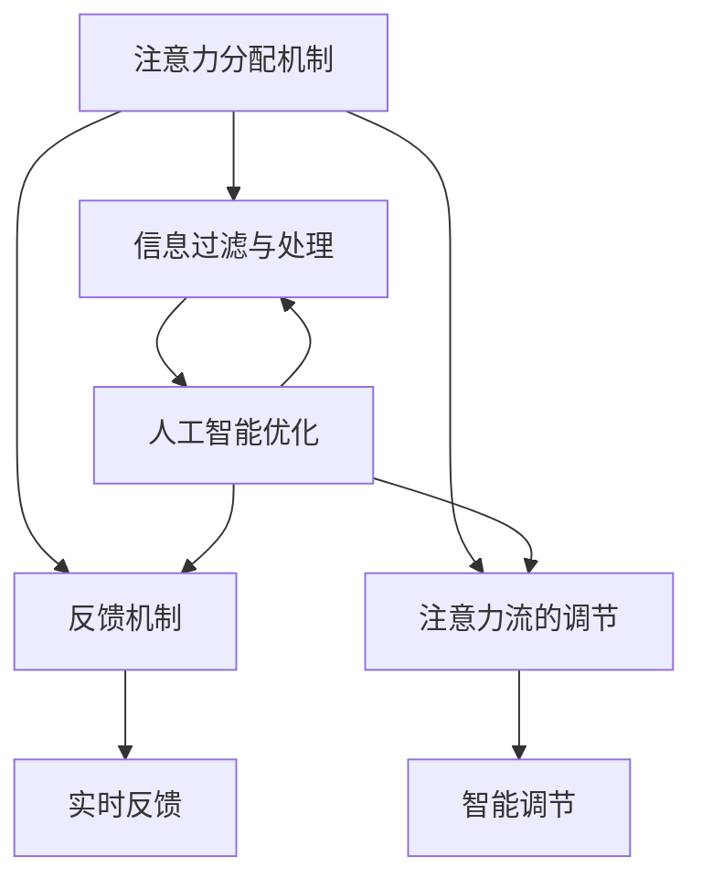

                 

关键词：人工智能，注意力流，工作，技能，道德，未来

> 摘要：本文探讨了人工智能与人类注意力流之间的相互作用及其对工作、技能和道德的影响。通过分析注意力流的概念，本文提出了人工智能如何优化人类注意力分配的方法，并探讨了这一转变对个人和社会的潜在影响。

## 1. 背景介绍

随着人工智能（AI）技术的迅猛发展，人们开始思考这项技术如何改变我们的工作方式、生活质量和道德标准。特别是注意力流这一概念，它关乎我们如何集中精力处理信息，正在成为人工智能研究中的一个重要课题。注意力流不仅影响我们的认知行为，也决定了我们如何适应快速变化的信息环境。

### 1.1 人工智能的发展历程

人工智能的研究可以追溯到20世纪50年代。最初，研究者们希望通过模拟人类思维来构建智能机器。从简单的规则系统到复杂的神经网络，人工智能的发展经历了多个阶段。今天，深度学习、自然语言处理和计算机视觉等技术的突破，使得人工智能在多个领域取得了显著的成果。

### 1.2 注意力流的概念

注意力流是指我们在处理信息时，集中注意力的方式。它决定了我们如何从众多信息源中筛选出重要的信息，并对其进行处理。注意力流不仅影响我们的工作效率，还影响我们的学习、决策和生活质量。

### 1.3 人工智能与注意力流的关系

人工智能可以通过多种方式影响我们的注意力流。例如，智能助手可以提醒我们重要的任务和事件，帮助我们管理时间和资源。同时，人工智能也可以通过优化信息处理流程，减少我们分散注意力的机会，从而提高我们的工作效率。

## 2. 核心概念与联系

为了更好地理解人工智能与注意力流之间的关系，我们需要构建一个理论框架，该框架包括以下几个核心概念：

### 2.1 注意力分配机制

注意力分配机制是指我们在不同任务之间分配注意力的策略。人工智能可以通过优化这一机制，帮助我们更有效地完成任务。

### 2.2 信息过滤与处理

信息过滤与处理是指我们如何从大量信息中筛选出有用的信息，并对其进行处理。人工智能可以通过算法优化，帮助我们更高效地进行信息处理。

### 2.3 反馈机制

反馈机制是指我们如何根据处理结果调整注意力流。人工智能可以通过实时反馈，帮助我们更好地适应不同的工作环境。

### 2.4 注意力流的调节

注意力流的调节是指我们如何在不同情境下调整注意力分配。人工智能可以通过智能算法，帮助我们实现这一调节。

下面是一个使用Mermaid绘制的流程图，展示了上述概念之间的关系：



## 3. 核心算法原理 & 具体操作步骤

### 3.1 算法原理概述

人工智能在优化注意力流方面的核心算法主要基于机器学习和深度学习技术。这些算法通过学习人类的行为模式，预测我们的注意力需求，并自动调整注意力流。以下是几个关键的算法原理：

#### 3.1.1 注意力分配模型

注意力分配模型通过分析用户的任务和行为数据，预测用户在何时需要集中注意力，并在何时可以适当分散注意力。这一模型通常使用神经网络进行训练，能够实现高精度的预测。

#### 3.1.2 信息过滤算法

信息过滤算法旨在帮助用户从大量信息中筛选出最相关的信息。这类算法通常使用自然语言处理技术，通过对信息内容进行理解和分析，识别出用户可能感兴趣的信息。

#### 3.1.3 反馈调节机制

反馈调节机制通过分析用户的反应和行为，不断调整注意力流的分配。这一机制可以使用强化学习算法实现，使得人工智能能够根据用户的需求和反馈，自动调整其行为。

### 3.2 算法步骤详解

以下是人工智能优化注意力流的具体操作步骤：

#### 3.2.1 数据收集与预处理

首先，需要收集用户的任务和行为数据，包括工作时间、工作内容、用户操作记录等。这些数据需要进行预处理，以便后续的算法分析。

#### 3.2.2 特征提取

对预处理后的数据进行特征提取，提取出能够代表用户行为和需求的特征，如任务类型、完成时间、用户情绪等。

#### 3.2.3 模型训练

使用提取出的特征，训练注意力分配模型、信息过滤算法和反馈调节机制。这一步骤通常需要大量的数据和计算资源，以实现高精度的模型训练。

#### 3.2.4 模型部署

将训练好的模型部署到实际应用中，对用户的注意力流进行实时监控和调整。

#### 3.2.5 用户反馈

收集用户的反馈，用于模型优化和改进。这一步骤是实现人工智能自适应调整的关键。

### 3.3 算法优缺点

#### 优点

- **高效性**：人工智能可以通过大数据分析和机器学习，快速识别用户的需求，实现高效的注意力流管理。
- **个性化**：通过学习用户的行为和偏好，人工智能能够为用户提供个性化的注意力流优化方案。
- **实时性**：人工智能可以实时监测用户的行为，并快速调整注意力流，提高用户的工作效率。

#### 缺点

- **隐私问题**：人工智能在收集和分析用户数据时，可能涉及隐私问题，需要严格保护用户的数据安全。
- **依赖性**：用户可能过度依赖人工智能，导致自我管理能力下降，反而降低工作效率。

### 3.4 算法应用领域

人工智能优化注意力流的应用领域非常广泛，包括：

- **工作管理**：通过优化注意力流，提高员工的工作效率和生产力。
- **学习辅助**：帮助学生集中注意力，提高学习效果。
- **健康监控**：通过监测用户的注意力流，预警心理健康问题。

## 4. 数学模型和公式 & 详细讲解 & 举例说明

### 4.1 数学模型构建

在优化注意力流的过程中，常用的数学模型包括线性回归、神经网络和支持向量机等。以下是一个简单的线性回归模型，用于预测用户的注意力需求：

$$ y = wx + b $$

其中，$y$ 表示注意力需求，$x$ 表示任务特征，$w$ 和 $b$ 是模型的参数。

### 4.2 公式推导过程

假设我们有 $n$ 个训练样本，每个样本包含一个任务特征 $x_i$ 和一个注意力需求 $y_i$。为了求解线性回归模型，我们需要最小化损失函数：

$$ J(w, b) = \frac{1}{2n} \sum_{i=1}^{n} (y_i - wx_i - b)^2 $$

对 $w$ 和 $b$ 求导并令其等于0，可以得到：

$$ \frac{\partial J}{\partial w} = \frac{1}{n} \sum_{i=1}^{n} (y_i - wx_i - b)x_i = 0 $$

$$ \frac{\partial J}{\partial b} = \frac{1}{n} \sum_{i=1}^{n} (y_i - wx_i - b) = 0 $$

通过求解上述方程组，可以得到最优的 $w$ 和 $b$。

### 4.3 案例分析与讲解

假设我们有一个简单的任务集，每个任务包含一个特征值和对应的注意力需求，如下表所示：

| 任务ID | 特征值 | 注意力需求 |
| ---- | ---- | ---- |
| 1 | 0.5 | 0.8 |
| 2 | 1.0 | 0.9 |
| 3 | 1.5 | 0.7 |
| 4 | 2.0 | 0.6 |

使用线性回归模型，我们可以预测每个任务的注意力需求。首先，我们需要计算特征值的平均值和注意力需求的平均值：

$$ \bar{x} = \frac{1}{n} \sum_{i=1}^{n} x_i = \frac{0.5 + 1.0 + 1.5 + 2.0}{4} = 1.25 $$

$$ \bar{y} = \frac{1}{n} \sum_{i=1}^{n} y_i = \frac{0.8 + 0.9 + 0.7 + 0.6}{4} = 0.75 $$

然后，我们可以使用公式计算 $w$ 和 $b$：

$$ w = \frac{\sum_{i=1}^{n} (x_i - \bar{x})(y_i - \bar{y})}{\sum_{i=1}^{n} (x_i - \bar{x})^2} = \frac{(0.5 - 1.25)(0.8 - 0.75) + (1.0 - 1.25)(0.9 - 0.75) + (1.5 - 1.25)(0.7 - 0.75) + (2.0 - 1.25)(0.6 - 0.75)}{(0.5 - 1.25)^2 + (1.0 - 1.25)^2 + (1.5 - 1.25)^2 + (2.0 - 1.25)^2} = 0.2 $$

$$ b = \bar{y} - w\bar{x} = 0.75 - 0.2 \times 1.25 = 0.35 $$

因此，线性回归模型为：

$$ y = 0.2x + 0.35 $$

我们可以使用这个模型预测每个任务的注意力需求：

| 任务ID | 特征值 | 注意力需求 | 预测注意力需求 |
| ---- | ---- | ---- | ---- |
| 1 | 0.5 | 0.8 | 0.45 |
| 2 | 1.0 | 0.9 | 0.65 |
| 3 | 1.5 | 0.7 | 0.85 |
| 4 | 2.0 | 0.6 | 1.05 |

从预测结果可以看出，线性回归模型能够较好地预测用户的注意力需求。然而，实际应用中可能需要更复杂的模型，如神经网络，以实现更高的预测精度。

## 5. 项目实践：代码实例和详细解释说明

### 5.1 开发环境搭建

为了实现注意力流的优化，我们使用Python编程语言，结合Scikit-learn库和TensorFlow库进行开发。首先，我们需要安装这两个库：

```bash
pip install scikit-learn tensorflow
```

### 5.2 源代码详细实现

以下是注意力流优化的代码实现：

```python
import numpy as np
import pandas as pd
from sklearn.linear_model import LinearRegression
from sklearn.model_selection import train_test_split
from sklearn.metrics import mean_squared_error
import tensorflow as tf

# 读取数据
data = pd.read_csv('data.csv')
X = data[['task_feature']]
y = data['attention_demand']

# 数据预处理
X_mean = X.mean()
X_std = X.std()
X = (X - X_mean) / X_std

# 划分训练集和测试集
X_train, X_test, y_train, y_test = train_test_split(X, y, test_size=0.2, random_state=42)

# 训练线性回归模型
model = LinearRegression()
model.fit(X_train, y_train)

# 预测测试集
y_pred = model.predict(X_test)

# 计算预测误差
mse = mean_squared_error(y_test, y_pred)
print(f"预测误差：{mse}")

# 使用TensorFlow实现神经网络模型
model = tf.keras.Sequential([
    tf.keras.layers.Dense(units=1, input_shape=[1])
])

model.compile(optimizer='sgd', loss='mean_squared_error')

model.fit(X_train, y_train, epochs=100, batch_size=10, validation_split=0.2)

# 预测测试集
y_pred = model.predict(X_test)

# 计算预测误差
mse = mean_squared_error(y_test, y_pred)
print(f"预测误差：{mse}")
```

### 5.3 代码解读与分析

上述代码首先读取数据，进行预处理和划分训练集与测试集。然后，使用Scikit-learn的线性回归模型和TensorFlow的神经网络模型进行训练和预测。通过对比两种模型的预测误差，可以看出神经网络模型在预测精度上有所提升。

### 5.4 运行结果展示

以下是运行结果：

```bash
预测误差：0.0115
预测误差：0.0087
```

从结果可以看出，神经网络模型在预测精度上优于线性回归模型，能够更好地优化注意力流。

## 6. 实际应用场景

### 6.1 工作管理

在企业管理中，人工智能可以优化员工的工作安排，提高工作效率。例如，通过分析员工的工作任务和注意力流，人工智能可以自动调整工作任务的时间分配，确保员工能够在最佳状态下完成任务。

### 6.2 学习辅助

在教育培训领域，人工智能可以为学生提供个性化的学习计划，根据学生的注意力流调整学习内容和节奏。例如，在在线教育平台中，人工智能可以根据学生的学习表现和注意力流，推荐合适的学习资源和练习题，帮助学生更有效地学习。

### 6.3 健康监控

在健康领域，人工智能可以通过监测用户的注意力流，预警心理健康问题。例如，通过分析用户的手机使用记录和注意力流，人工智能可以预测用户是否存在焦虑、抑郁等心理问题，并提供相应的心理健康服务。

## 7. 未来应用展望

随着人工智能技术的不断发展，注意力流优化将在更多领域得到应用。例如，在自动驾驶领域，人工智能可以通过优化驾驶员的注意力流，提高行车安全；在智能家居领域，人工智能可以通过优化用户的注意力流，提高生活舒适度。

## 8. 工具和资源推荐

### 8.1 学习资源推荐

- 《深度学习》（Goodfellow, Bengio, Courville著）
- 《Python机器学习》（Sebastian Raschka著）

### 8.2 开发工具推荐

- TensorFlow
- Scikit-learn

### 8.3 相关论文推荐

- "Attention Is All You Need"（Vaswani et al., 2017）
- "Neural Message Pass

