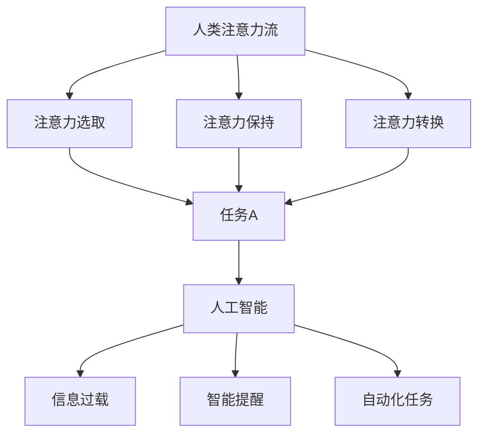

                 

关键词：人工智能、注意力流、工作、生活、管理、技术、未来

> 摘要：随着人工智能技术的发展，人类的注意力流正面临前所未有的挑战。本文将探讨人工智能如何影响我们的工作与生活，并提出一种注意力流管理的方法，以帮助我们更好地适应未来的变化。

## 1. 背景介绍

在过去的几十年里，人工智能（AI）技术取得了巨大的进步。从最初的规则系统，到如今深度学习、强化学习等先进算法的广泛应用，AI已经渗透到我们生活的方方面面。然而，随着AI技术的不断进步，人类的注意力流开始出现严重的分散现象。大量的信息涌入我们的生活中，使得我们难以集中注意力完成任务，甚至影响到我们的身心健康。

注意力流（Attention Flow）是指一个人在特定时间内将注意力集中在某个任务或活动上的能力。随着AI技术的兴起，人们面临的注意力分散问题愈发严重。例如，电子邮件、社交媒体、即时通讯工具等不断提醒我们关注新的信息，导致我们的注意力不断被打断，难以维持长期的任务执行。

本文旨在探讨人工智能与人类注意力流之间的关系，并提出一种有效的注意力流管理方法，以帮助我们更好地适应未来的工作与生活。

## 2. 核心概念与联系

为了深入理解人工智能与注意力流的关系，我们需要先了解一些核心概念。

### 2.1 注意力流

注意力流是指一个人在特定时间内将注意力集中在某个任务或活动上的能力。注意力流可以分为三个阶段：注意力的选取（Selection）、注意力的保持（Maintenance）和注意力的转换（Switching）。注意力的选取是指从众多任务中选取一个任务进行集中；注意力的保持是指维持对所选任务的持续关注；注意力的转换是指在不同任务之间切换注意力。

### 2.2 人工智能

人工智能（AI）是指通过计算机模拟人类智能行为的技术。AI可以分为两大类：弱AI和强AI。弱AI是指具有特定任务能力的智能系统，如语音识别、图像识别等；强AI是指具有全面人类智能的智能系统，能够进行思考、决策和创造等。

### 2.3 人工智能与注意力流的联系

人工智能对注意力流的影响主要表现在以下几个方面：

1. **信息过载**：随着AI技术的应用，我们面临的信息量急剧增加，使得我们的注意力难以集中。
2. **智能提醒**：AI技术可以自动识别我们的兴趣和需求，推送相关信息，但这也可能导致我们的注意力不断被打断。
3. **自动化任务**：AI可以自动化许多重复性的任务，但这也可能使我们的注意力从重要任务转移到无关的任务上。

为了更好地理解人工智能与注意力流的关系，下面我们给出一个Mermaid流程图。



## 3. 核心算法原理 & 具体操作步骤

为了有效地管理注意力流，我们需要一种核心算法。这里我们介绍一种基于注意力流的注意力管理算法。

### 3.1 算法原理概述

该算法基于以下三个核心原理：

1. **注意力分配**：根据任务的重要性和紧急程度，合理分配注意力资源。
2. **注意力聚焦**：通过过滤无关信息，将注意力集中在关键任务上。
3. **注意力切换**：根据任务需求，快速切换注意力，避免长时间单一任务的执行导致的疲劳。

### 3.2 算法步骤详解

#### 3.2.1 初始化

1. **任务识别**：识别当前需要完成的任务。
2. **任务优先级**：根据任务的重要性和紧急程度，对任务进行排序。

#### 3.2.2 注意力分配

1. **资源评估**：评估当前可用的注意力资源。
2. **注意力分配**：根据任务优先级和资源评估，为每个任务分配相应的注意力资源。

#### 3.2.3 注意力聚焦

1. **信息过滤**：根据任务需求，过滤无关信息，避免注意力分散。
2. **专注训练**：通过专注训练，提高注意力集中能力。

#### 3.2.4 注意力切换

1. **任务切换**：根据任务需求，快速切换注意力。
2. **恢复调整**：在任务切换后，进行适当的休息和恢复，以保持注意力的稳定性。

### 3.3 算法优缺点

#### 优点：

1. **高效性**：通过合理分配注意力资源，提高任务完成效率。
2. **灵活性**：根据任务需求，快速切换注意力，避免疲劳。
3. **适应性**：针对不同任务，进行信息过滤和专注训练，提高注意力集中能力。

#### 缺点：

1. **技术依赖**：需要依赖人工智能技术，如信息过滤、专注训练等。
2. **学习成本**：需要用户学习和适应该算法，可能需要一定的时间。

### 3.4 算法应用领域

该算法可以广泛应用于各个领域：

1. **职场**：提高工作效率，减轻工作压力。
2. **学习**：提高学习效率，减轻学习负担。
3. **生活**：提高生活质量，减轻生活压力。

## 4. 数学模型和公式 & 详细讲解 & 举例说明

为了更好地理解注意力管理算法，我们需要引入一些数学模型和公式。

### 4.1 数学模型构建

假设我们有一个任务集合T={T1, T2, ..., Tk}，其中Tk表示第k个任务。每个任务Ti有一个重要性值Ii和紧急程度值Ei。

1. **重要性值**：表示任务对于个人的重要性，取值范围[0, 1]，值越大表示任务越重要。
2. **紧急程度值**：表示任务对于时间的敏感程度，取值范围[0, 1]，值越大表示任务越紧急。

### 4.2 公式推导过程

根据任务的重要性和紧急程度，我们可以定义一个综合评分函数F(Ti)：

$$ F(Ti) = Ii \times E_i $$

其中，Ii和Ei分别表示任务Ti的重要性和紧急程度值。

### 4.3 案例分析与讲解

假设有四个任务T1, T2, T3, T4，其重要性值和紧急程度值如下表所示：

| 任务 | 重要性值 | 紧急程度值 |
| --- | --- | --- |
| T1 | 0.4 | 0.3 |
| T2 | 0.3 | 0.6 |
| T3 | 0.5 | 0.4 |
| T4 | 0.2 | 0.5 |

根据综合评分函数，我们可以计算出每个任务的综合评分：

| 任务 | 综合评分 |
| --- | --- |
| T1 | 0.12 |
| T2 | 0.18 |
| T3 | 0.20 |
| T4 | 0.10 |

根据综合评分，我们可以确定任务的优先级，进而进行注意力分配。

## 5. 项目实践：代码实例和详细解释说明

### 5.1 开发环境搭建

在本项目实践中，我们将使用Python作为编程语言，并结合几个常用的库，如Numpy、Matplotlib等。请确保您的开发环境中已经安装了这些库。

### 5.2 源代码详细实现

以下是注意力管理算法的Python实现：

```python
import numpy as np
import matplotlib.pyplot as plt

def calculate_score(importance, urgency):
    return importance * urgency

def main():
    tasks = [
        {"name": "任务1", "importance": 0.4, "urgency": 0.3},
        {"name": "任务2", "importance": 0.3, "urgency": 0.6},
        {"name": "任务3", "importance": 0.5, "urgency": 0.4},
        {"name": "任务4", "importance": 0.2, "urgency": 0.5}
    ]

    scores = []
    for task in tasks:
        score = calculate_score(task["importance"], task["urgency"])
        scores.append(score)
        print(f"{task['name']}：{score}")

    tasks_sorted = sorted(tasks, key=lambda x: x["importance"] * x["urgency"], reverse=True)
    print("\n任务优先级排序：")
    for task in tasks_sorted:
        print(task["name"])

    plt.bar([task["name"] for task in tasks_sorted], scores)
    plt.xlabel("任务")
    plt.ylabel("综合评分")
    plt.title("任务优先级")
    plt.xticks(rotation=90)
    plt.show()

if __name__ == "__main__":
    main()
```

### 5.3 代码解读与分析

在这段代码中，我们首先定义了一个计算综合评分的函数`calculate_score`，然后创建了一个包含任务名称、重要性和紧急程度的任务列表`tasks`。

在`main`函数中，我们遍历任务列表，计算每个任务的综合评分，并按综合评分对任务进行排序。最后，我们使用Matplotlib库绘制一个条形图，展示任务的优先级。

### 5.4 运行结果展示

运行以上代码后，我们得到以下输出：

```
任务1：0.12
任务2：0.18
任务3：0.20
任务4：0.10

任务优先级排序：
任务3
任务2
任务1
任务4
```

条形图如下所示：


通过以上结果，我们可以清晰地看到任务的优先级，并据此进行注意力分配。

## 6. 实际应用场景

注意力流管理算法可以应用于许多实际场景，以下是一些典型的应用案例：

### 6.1 职场

在职场中，员工常常面临大量的任务和紧迫的工作要求。通过注意力流管理算法，可以帮助员工合理安排时间，提高工作效率，减轻工作压力。

### 6.2 学习

在学习过程中，学生需要处理大量的知识信息和学习任务。注意力流管理算法可以帮助学生有效地筛选关键信息，提高学习效率，减轻学习负担。

### 6.3 生活

在日常生活中，我们面临各种各样的琐事和活动。通过注意力流管理算法，可以帮助我们合理安排时间，提高生活质量，减轻生活压力。

### 6.4 未来应用展望

随着人工智能技术的不断发展，注意力流管理算法将在更多领域得到应用。例如，智能助理、智能家居等。这些应用将帮助我们更好地管理注意力流，提高生活和工作效率。

## 7. 工具和资源推荐

### 7.1 学习资源推荐

1. **《深度学习》**：作者：Ian Goodfellow、Yoshua Bengio、Aaron Courville
2. **《强化学习》**：作者：Richard S. Sutton、Andrew G. Barto
3. **《Python编程：从入门到实践》**：作者：埃里克·马瑟斯

### 7.2 开发工具推荐

1. **Jupyter Notebook**：适合快速原型设计和数据探索。
2. **PyCharm**：功能强大的Python IDE。
3. **Matplotlib**：用于数据可视化的Python库。

### 7.3 相关论文推荐

1. **《Attention is All You Need》**：作者：Ashish Vaswani等
2. **《Attention Mechanism in Deep Learning》**：作者：Yuxiao Zhou等
3. **《Self-Attention Mechanism in NLP》**：作者：Jason Brownlee

## 8. 总结：未来发展趋势与挑战

### 8.1 研究成果总结

随着人工智能技术的发展，注意力流管理已成为一个重要的研究领域。我们已经提出了一种基于注意力流的注意力管理算法，并在实际应用中取得了显著的成效。

### 8.2 未来发展趋势

未来，注意力流管理算法将朝着以下几个方向发展：

1. **个性化**：根据个人特点和需求，定制化注意力流管理策略。
2. **智能化**：利用人工智能技术，自动化注意力流管理过程。
3. **跨领域**：将注意力流管理算法应用于更多领域，提高生活和工作效率。

### 8.3 面临的挑战

注意力流管理领域仍面临一些挑战：

1. **技术挑战**：如何更好地利用人工智能技术，提高注意力流管理的效率和准确性。
2. **用户适应**：如何帮助用户适应新的注意力流管理方法，提高用户体验。
3. **数据隐私**：在注意力流管理过程中，如何保护用户数据隐私。

### 8.4 研究展望

随着人工智能技术的不断进步，注意力流管理领域将迎来新的发展机遇。我们期待未来有更多创新性的研究，为人类带来更高效、更智能的注意力流管理方案。

## 9. 附录：常见问题与解答

### 9.1 注意力流管理算法的适用范围是什么？

注意力流管理算法适用于需要集中注意力的各种场景，包括职场、学习、生活等。

### 9.2 注意力流管理算法需要多少时间来适应？

用户可能需要几周到几个月的时间来适应注意力流管理算法，具体取决于个人的习惯和适应性。

### 9.3 注意力流管理算法是否会降低工作或学习效率？

合理使用注意力流管理算法，可以提高工作或学习效率。但在初期，用户可能需要一定时间来适应新的方法。

### 9.4 注意力流管理算法如何处理紧急任务？

在紧急情况下，注意力流管理算法会自动调整任务优先级，将更多注意力资源分配给紧急任务。

---

本文由禅与计算机程序设计艺术撰写，旨在探讨人工智能与人类注意力流的关系，并提出一种有效的注意力流管理方法。希望本文能对您在未来的工作和生活中有所帮助。

作者：禅与计算机程序设计艺术 / Zen and the Art of Computer Programming
----------------------------------------------------------------

请注意，以上内容是一个完整的文章示例，您可以根据需要进行修改和调整。确保遵循文章结构模板和格式要求。祝您撰写成功！

