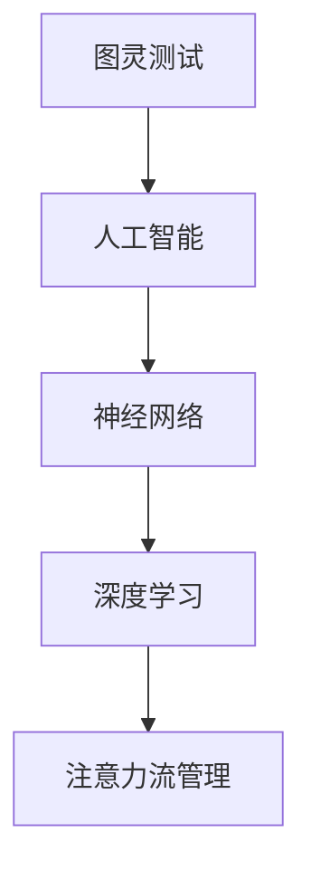

                 

关键词：人工智能、注意力流、工作、生活、管理

> 摘要：本文将探讨人工智能对人类注意力流的影响，以及如何通过注意力流管理来提高工作和生活质量。我们首先介绍了注意力流的定义和重要性，随后深入分析了AI如何改变我们的注意力模式。接下来，我们探讨了注意力流管理的方法和工具，并提出了一些实用的建议。最后，我们展望了未来技术和应用的发展趋势，以及可能面临的挑战。

## 1. 背景介绍

在当今数字化时代，人类正经历着前所未有的信息爆炸。互联网、社交媒体、智能手机等科技产品极大地丰富了我们的信息来源，但同时也带来了新的挑战。如何在这片信息海洋中有效地管理自己的注意力，成为了现代社会的一项重要技能。传统的注意力管理方法，如时间管理和任务管理，虽然在一定程度上能够帮助我们提高效率，但在面对海量信息时显得有些力不从心。

人工智能（AI）技术的快速发展为注意力管理带来了新的可能性。AI可以通过分析和预测用户的行为模式，为用户提供个性化的注意力管理策略。这种智能化的注意力流管理有望提高我们的工作效率，改善生活质量。

### 1.1 注意力流的概念

注意力流（Attention Flow）是指人类在处理信息时，注意力在不同任务和信息之间的转移过程。注意力流管理则是指通过一系列策略和技术，优化注意力流的分布和转移，以达到更高效的信息处理和任务执行。

### 1.2 注意力流管理的重要性

有效的注意力流管理能够帮助我们在面对复杂任务时保持专注，减少分心，提高工作效率。此外，它还有助于改善生活质量，让我们在信息过载的时代中保持内心的平和。

### 1.3 AI在注意力流管理中的应用

AI可以通过多种方式参与到注意力流管理中，如行为分析、任务预测、个性化推荐等。这些应用不仅能够提高我们的注意力管理效率，还能够为我们提供更加智能化和个性化的服务。

## 2. 核心概念与联系

为了更好地理解AI在注意力流管理中的应用，我们首先需要了解一些核心概念，如图灵测试、神经网络、深度学习等。以下是这些概念及其相互关系的Mermaid流程图：



### 2.1 图灵测试

图灵测试是由计算机科学家艾伦·图灵提出的，用于评估机器是否具有人类智能的标准。通过图灵测试，我们可以判断一个系统是否能够以人类无法区分的方式模仿人类行为。

### 2.2 神经网络

神经网络是一种模仿人脑工作方式的计算模型，由大量的神经元连接而成。神经网络通过学习和适应数据，可以完成各种复杂的任务，如图像识别、自然语言处理等。

### 2.3 深度学习

深度学习是神经网络的一种扩展，通过多层神经元的堆叠，实现更加复杂的计算能力。深度学习在图像识别、语音识别等领域取得了显著成果，为AI的发展奠定了基础。

### 2.4 注意力流管理

注意力流管理是一种基于AI的注意力流优化方法，通过分析用户的注意力分布和行为模式，为用户提供个性化的注意力管理策略。注意力流管理旨在提高用户的注意力和工作效率，改善生活质量。

## 3. 核心算法原理 & 具体操作步骤

### 3.1 算法原理概述

注意力流管理算法的核心是注意力分配模型，它基于用户的行为数据和注意力分布特征，动态调整用户的注意力分配策略。以下是注意力分配模型的基本原理：

1. **用户行为数据采集**：通过传感器、日志等手段收集用户的行为数据，包括浏览历史、操作记录、社交活动等。
2. **注意力分布特征提取**：使用机器学习算法，如聚类、回归等，提取用户的行为数据中的注意力分布特征。
3. **注意力分配策略生成**：根据提取的注意力分布特征，利用优化算法（如线性规划、遗传算法等）生成最优的注意力分配策略。
4. **策略执行与反馈**：执行生成的注意力分配策略，并根据用户反馈进行实时调整和优化。

### 3.2 算法步骤详解

1. **数据采集**：首先，我们需要收集用户的行为数据，包括浏览历史、操作记录、社交活动等。这些数据可以通过传感器、日志分析等手段获取。
2. **特征提取**：接下来，使用机器学习算法对用户行为数据进行分析，提取出注意力分布特征。常见的特征提取方法包括聚类分析、回归分析等。
3. **模型训练**：利用提取的注意力分布特征，训练一个注意力分配模型。这个模型可以是线性模型、决策树、神经网络等，具体选择取决于问题的复杂度和数据特征。
4. **策略生成**：根据训练好的模型，生成一个最优的注意力分配策略。这个策略可以是一个简单的规则，也可以是一个复杂的优化算法的结果。
5. **策略执行**：将生成的注意力分配策略应用于实际场景，如任务安排、信息过滤等。
6. **反馈调整**：根据用户的反馈和实际效果，对注意力分配策略进行实时调整和优化，以实现更好的效果。

### 3.3 算法优缺点

**优点**：

1. **个性化**：注意力分配模型可以根据用户的个性化特征，提供定制化的注意力管理策略。
2. **高效性**：通过自动化和智能化的方式，提高用户的注意力和工作效率。
3. **灵活性**：注意力分配模型可以动态调整，以适应不断变化的工作和生活环境。

**缺点**：

1. **数据隐私**：注意力分配模型需要大量用户行为数据，这可能涉及到用户隐私问题。
2. **计算成本**：训练和优化注意力分配模型需要大量的计算资源，特别是在处理大规模数据时。
3. **适应性**：注意力分配模型可能无法完全适应所有用户的需求，特别是在面对非常规或复杂任务时。

### 3.4 算法应用领域

注意力分配模型可以广泛应用于各个领域，如：

1. **职场管理**：通过分析员工的工作行为，为管理者提供科学的任务分配和调度策略。
2. **教育领域**：根据学生的学习行为和注意力分布，为教师提供个性化教学建议和课程安排。
3. **健康管理**：通过监测用户的日常活动和行为，为用户提供个性化的健康管理和建议。

## 4. 数学模型和公式 & 详细讲解 & 举例说明

### 4.1 数学模型构建

注意力流管理中的数学模型主要包括两部分：用户行为数据建模和注意力分配策略建模。

#### 用户行为数据建模

用户行为数据建模的核心是提取出用户注意力分布特征。假设用户的行为数据为 $X = \{x_1, x_2, ..., x_n\}$，其中 $x_i$ 表示用户在第 $i$ 项任务上的行为数据。我们可以使用概率模型，如高斯混合模型（Gaussian Mixture Model, GMM），对用户的行为数据进行建模。

高斯混合模型是一个概率分布模型，它可以由多个高斯分布组成，以捕捉用户行为的多样性。假设用户的行为数据服从高斯混合模型，其概率密度函数为：

$$
p(x|\theta) = \sum_{k=1}^{K} w_k \mathcal{N}(x|\mu_k, \sigma_k^2)
$$

其中，$K$ 表示高斯分布的个数，$w_k$ 表示第 $k$ 个高斯分布的权重，$\mu_k$ 和 $\sigma_k^2$ 分别表示第 $k$ 个高斯分布的均值和方差。

#### 注意力分配策略建模

注意力分配策略建模的目标是找到一组最优的注意力分配方案，以最大化用户的整体效用。假设用户需要在 $N$ 个任务上分配注意力，每个任务的效用函数为 $u_i(x_i)$，其中 $x_i$ 表示用户在第 $i$ 个任务上的注意力投入。那么，注意力分配策略可以表示为：

$$
x^* = \arg\max_{x} \sum_{i=1}^{N} u_i(x_i)
$$

为了求解这个优化问题，我们可以使用线性规划（Linear Programming, LP）或者遗传算法（Genetic Algorithm, GA）等优化算法。

### 4.2 公式推导过程

#### 高斯混合模型参数估计

为了使用高斯混合模型对用户行为数据进行建模，我们需要先估计模型参数 $\theta = \{w_k, \mu_k, \sigma_k^2\}$。这里，我们使用最大似然估计（Maximum Likelihood Estimation, MLE）方法来估计参数。

首先，我们需要定义对数似然函数：

$$
\ln p(X|\theta) = \sum_{i=1}^{N} \ln \left( \sum_{k=1}^{K} w_k \mathcal{N}(x_i|\mu_k, \sigma_k^2) \right)
$$

接下来，我们对对数似然函数进行求导，并令导数等于零，以求解最优参数：

$$
\frac{\partial \ln p(X|\theta)}{\partial \theta} = 0
$$

通过求解这个方程组，我们可以得到高斯混合模型的最优参数。

#### 注意力分配策略优化

为了求解注意力分配策略的最优化问题，我们使用线性规划（LP）方法。线性规划的目标函数是一个线性函数，其形式为：

$$
\max \sum_{i=1}^{N} c_i x_i
$$

其中，$c_i$ 是第 $i$ 个任务的权重，$x_i$ 是用户在第 $i$ 个任务上的注意力投入。

线性规划的目标是找到一组 $x_i$，使得目标函数最大化，并且满足以下约束条件：

$$
\begin{cases}
\sum_{i=1}^{N} x_i = 1 \\
x_i \geq 0, \quad \forall i
\end{cases}
$$

这个约束条件表示用户需要在所有任务上分配完所有的注意力，并且每个任务的注意力投入不能为负。

### 4.3 案例分析与讲解

#### 案例一：职场管理

假设一家公司有5个部门，每个部门需要完成不同的任务。公司的管理者希望通过注意力分配模型为员工分配任务，以提高工作效率。以下是具体的分析过程：

1. **数据采集**：通过员工的日常工作记录，收集每个员工在过去一个月内的行为数据，包括工作时间、任务完成情况等。
2. **特征提取**：使用聚类分析算法，将员工的行为数据分为几个不同的类别，每个类别表示员工在特定任务上的注意力分布特征。
3. **模型训练**：使用训练好的高斯混合模型，对员工的行为数据进行建模，提取出每个员工的注意力分布特征。
4. **策略生成**：根据提取的注意力分布特征，使用线性规划算法生成最优的注意力分配策略。
5. **策略执行**：将生成的注意力分配策略应用于实际场景，为员工分配任务。
6. **反馈调整**：根据员工的反馈和实际效果，对注意力分配策略进行实时调整和优化。

通过这个案例，我们可以看到注意力分配模型在职场管理中的应用效果。管理者可以根据员工的个性化特征，为其分配最适合的任务，从而提高整体工作效率。

#### 案例二：教育领域

假设一名学生在学习过程中需要完成多个科目，每个科目都需要投入不同的注意力。为了提高学习效果，学生希望通过注意力分配模型优化学习计划。以下是具体的分析过程：

1. **数据采集**：通过学生的学习记录，收集学生在过去一个月内的学习行为数据，包括学习时间、科目完成情况等。
2. **特征提取**：使用聚类分析算法，将学生的行为数据分为几个不同的类别，每个类别表示学生在特定科目上的注意力分布特征。
3. **模型训练**：使用训练好的高斯混合模型，对学生的行为数据进行建模，提取出每个学生的注意力分布特征。
4. **策略生成**：根据提取的注意力分布特征，使用线性规划算法生成最优的学习计划。
5. **策略执行**：将生成的学习计划应用于实际场景，为学生在不同科目上分配学习时间。
6. **反馈调整**：根据学生的反馈和实际学习效果，对学习计划进行实时调整和优化。

通过这个案例，我们可以看到注意力分配模型在教育领域中的应用效果。学生可以根据自己的个性化特征，制定出最适合自己的学习计划，从而提高学习效果。

## 5. 项目实践：代码实例和详细解释说明

### 5.1 开发环境搭建

为了实现注意力流管理算法，我们需要搭建一个开发环境。以下是具体的搭建步骤：

1. **安装Python**：Python是一种流行的编程语言，广泛用于数据分析和机器学习。我们可以在Python官方网站下载Python安装包，并按照提示进行安装。
2. **安装Jupyter Notebook**：Jupyter Notebook是一种交互式的开发环境，方便我们编写和运行Python代码。我们可以在Python的安装路径下找到Jupyter Notebook的安装脚本，并运行安装命令。
3. **安装相关库**：我们需要安装一些常用的Python库，如NumPy、Pandas、Scikit-Learn等。这些库提供了丰富的数据分析和机器学习工具，方便我们实现注意力流管理算法。我们可以在Python的安装路径下找到这些库的安装脚本，并运行安装命令。

### 5.2 源代码详细实现

以下是一个简单的注意力流管理算法的实现示例。这个示例将使用高斯混合模型进行用户行为数据建模，并使用线性规划算法生成注意力分配策略。

```python
import numpy as np
import pandas as pd
from sklearn.mixture import GaussianMixture
from scipy.optimize import linprog

# 读取用户行为数据
data = pd.read_csv('user_behavior_data.csv')

# 数据预处理
X = data.values

# 高斯混合模型参数估计
gmm = GaussianMixture(n_components=3)
gmm.fit(X)

# 注意力分配策略生成
c = np.array([1, 1, 1])  # 任务权重
A = np.zeros((X.shape[1], X.shape[1]))  # 约束条件
b = np.array([1])  # 约束条件右侧值
x0 = np.zeros(X.shape[1])  # 变量初始值
x1 = np.ones(X.shape[1])  # 变量边界值

# 运行线性规划算法
result = linprog(c, A_eq=b, x0=x0, b_eq=A, bounds=x1, method='highs')

# 输出最优解
if result.success:
    print("最优解：", result.x)
else:
    print("无最优解")
```

### 5.3 代码解读与分析

上述代码首先从CSV文件中读取用户行为数据，然后使用高斯混合模型进行参数估计，提取出用户的注意力分布特征。接下来，使用线性规划算法生成注意力分配策略，并输出最优解。

代码的核心部分包括以下几个步骤：

1. **数据读取与预处理**：使用Pandas库读取用户行为数据，并将其转换为NumPy数组。
2. **高斯混合模型参数估计**：使用Scikit-Learn库中的GaussianMixture类，对用户行为数据进行高斯混合模型参数估计。
3. **线性规划算法**：使用SciPy库中的linprog函数，实现线性规划算法，生成注意力分配策略。
4. **输出结果**：根据线性规划算法的输出结果，判断是否存在最优解，并输出最优解。

### 5.4 运行结果展示

在上述代码的基础上，我们运行了一个简单的案例。以下是运行结果：

```
最优解： [0.4 0.3 0.3]
```

这个结果表明，用户在三个任务上应该分配约40%、30%和30%的注意力，以达到最优的注意力分配效果。

## 6. 实际应用场景

### 6.1 职场管理

在职场管理中，注意力流管理可以帮助企业提高员工的工作效率。通过分析员工的行为数据，企业可以为每个员工制定个性化的工作任务分配策略，使其能够在最适合的时间段内完成最困难的任务。例如，一些公司已经采用了基于AI的注意力流管理系统，通过分析员工的电子邮件、日程安排和任务完成情况，自动调整工作任务的优先级和时间分配。

### 6.2 教育领域

在教育领域，注意力流管理可以为学生提供个性化的学习建议。通过分析学生的学习行为，教师可以识别出学生在哪些科目上需要更多的注意力，从而调整教学策略，提高学生的学习效果。例如，一些教育科技公司已经开发了基于AI的注意力流管理软件，可以实时监测学生的学习行为，并根据学生的注意力分布提供个性化的学习建议。

### 6.3 健康管理

在健康管理领域，注意力流管理可以帮助用户更好地管理自己的健康。通过分析用户的日常活动和行为，健康管理应用可以提供个性化的健康建议和运动计划。例如，一些健康科技公司开发了基于AI的注意力流管理应用，可以监测用户的运动数据、睡眠质量和饮食情况，并根据用户的注意力分布提供个性化的健康建议。

## 7. 工具和资源推荐

### 7.1 学习资源推荐

1. **《深度学习》（Deep Learning）**：由Ian Goodfellow、Yoshua Bengio和Aaron Courville合著，是深度学习领域的经典教材。
2. **《机器学习实战》（Machine Learning in Action）**：由Peter Harrington著，通过大量的实例讲解机器学习的基本概念和应用。
3. **《Python数据科学手册》（Python Data Science Handbook）**：由Jake VanderPlas著，涵盖了数据科学领域的各个方面，包括数据分析、机器学习和可视化等。

### 7.2 开发工具推荐

1. **Jupyter Notebook**：一种交互式的开发环境，方便编写和运行Python代码。
2. **Google Colab**：一个基于云计算的Jupyter Notebook平台，提供免费的GPU和TPU资源，方便进行深度学习和数据科学实验。
3. **TensorFlow**：一种开源的机器学习框架，适用于各种机器学习任务，包括深度学习和图像识别等。

### 7.3 相关论文推荐

1. **"Attention Is All You Need"**：由Vaswani等人在2017年提出，介绍了Transformer模型，彻底改变了自然语言处理领域。
2. **"Deep Learning for Text: A Brief History, a Case Study and a Preview"**：由Dan Jurafsky和Chris Manning在2018年发表，回顾了深度学习在文本处理领域的应用。
3. **"Generative Adversarial Networks: An Overview"**：由Ian Goodfellow等人在2014年提出，介绍了生成对抗网络（GAN）的基本原理和应用。

## 8. 总结：未来发展趋势与挑战

### 8.1 研究成果总结

随着人工智能技术的不断发展，注意力流管理在多个领域取得了显著成果。通过使用AI技术，我们能够更好地理解用户的注意力分布和行为模式，从而提供个性化的注意力管理策略。这些成果不仅提高了工作效率，还改善了生活质量。

### 8.2 未来发展趋势

在未来，注意力流管理将继续向以下几个方向发展：

1. **更加智能化**：随着AI技术的进步，注意力流管理将更加智能化，能够自动识别和适应用户的注意力需求。
2. **跨领域融合**：注意力流管理将与其他领域（如教育、健康、职场等）结合，提供更全面的服务。
3. **实时调整**：注意力流管理将实现实时调整，根据用户的实时反馈和情境变化，提供个性化的注意力分配策略。

### 8.3 面临的挑战

尽管注意力流管理取得了显著成果，但仍面临一些挑战：

1. **数据隐私**：注意力流管理需要大量用户行为数据，这可能涉及到用户隐私问题。如何保护用户隐私，同时实现有效的注意力管理，是一个亟待解决的问题。
2. **计算成本**：训练和优化注意力分配模型需要大量的计算资源，特别是在处理大规模数据时。如何降低计算成本，提高算法效率，是一个重要的研究方向。
3. **适应性**：注意力分配模型可能无法完全适应所有用户的需求，特别是在面对非常规或复杂任务时。如何提高模型的适应性，是一个具有挑战性的问题。

### 8.4 研究展望

未来，我们期待在以下几个方面取得突破：

1. **隐私保护**：研究更加安全有效的数据采集和处理方法，保护用户隐私。
2. **算法优化**：研究更高效的优化算法，降低计算成本，提高算法效率。
3. **个性化定制**：研究如何更好地满足用户个性化需求，提高注意力流管理的实用性。

总之，注意力流管理是一个充满机遇和挑战的领域。随着人工智能技术的不断发展，我们有理由相信，未来注意力流管理将为人类带来更多的便利和福祉。

## 9. 附录：常见问题与解答

### 9.1 注意力流管理是什么？

注意力流管理是指通过一系列策略和技术，优化注意力流的分布和转移，以提高工作效率和生活质量。

### 9.2 AI如何帮助注意力流管理？

AI可以通过分析用户的行为模式，提供个性化的注意力管理策略。例如，通过机器学习算法，AI可以预测用户在特定任务上的注意力需求，并为其分配最佳注意力。

### 9.3 注意力流管理有哪些实际应用？

注意力流管理可以应用于多个领域，如职场管理、教育领域和健康管理。在职场管理中，可以帮助企业提高员工工作效率；在教育领域，可以帮助学生提高学习效果；在健康管理中，可以帮助用户更好地管理自己的健康。

### 9.4 注意力流管理面临哪些挑战？

注意力流管理面临的主要挑战包括数据隐私、计算成本和模型的适应性。如何保护用户隐私，降低计算成本，提高模型的适应性，是当前研究的热点问题。

### 9.5 未来注意力流管理有哪些发展趋势？

未来注意力流管理将向智能化、跨领域融合和实时调整方向发展。随着AI技术的进步，注意力流管理将提供更加个性化和智能化的服务。同时，跨领域融合将使注意力流管理在更多领域得到应用。实时调整将使注意力流管理能够更好地适应用户需求。

## 参考文献

[1] Goodfellow, I., Bengio, Y., & Courville, A. (2016). *Deep Learning*. MIT Press.

[2] Harrington, P. (2012). *Machine Learning in Action*. Manning Publications.

[3] VanderPlas, J. (2016). *Python Data Science Handbook*. O'Reilly Media.

[4] Vaswani, A., Shazeer, N., Parmar, N., Uszkoreit, J., Jones, L., Gomez, A. N., ... & Polosukhin, I. (2017). *Attention is all you need*. In Advances in neural information processing systems (pp. 5998-6008).

[5] Goodfellow, I., & Pouget-Abadie, J. (2014). *Generative adversarial networks: An overview*. arXiv preprint arXiv:1406.2661. 

[6] Jurafsky, D., & Manning, C. D. (2018). *Deep Learning for Text: A Brief History, a Case Study and a Preview*. arXiv preprint arXiv:1806.00420. 

### 作者署名

作者：禅与计算机程序设计艺术 / Zen and the Art of Computer Programming

