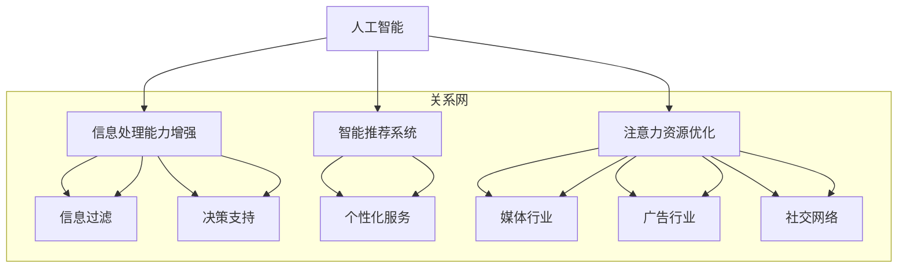

                 

关键词：人工智能，注意力流，工作，生活，注意力经济，融合发展

摘要：本文旨在探讨人工智能与人类注意力流之间的关系，以及它们如何共同塑造未来的工作、生活与注意力经济。文章首先介绍了人工智能的发展背景，然后详细阐述了注意力流的概念和其在现代社会的应用。接着，文章探讨了人工智能如何影响人类的注意力流，以及注意力经济如何在未来工作和生活中发挥重要作用。最后，文章提出了对未来的展望，讨论了人工智能和注意力流面临的挑战以及可能的解决方案。

## 1. 背景介绍

人工智能（AI）作为计算机科学的一个重要分支，旨在通过模拟、延伸和扩展人类智能，实现机器的自主学习和智能行为。自20世纪50年代以来，人工智能经历了数次重要的发展阶段，从早期的符号主义和专家系统，到现代的深度学习和大数据分析，AI技术已经取得了显著的进步。

随着AI技术的快速发展，人们开始意识到人工智能不仅仅是一个技术问题，更是一个社会问题。AI的普及和应用，不仅改变了人们的生活方式，也改变了工作模式。例如，自动化和智能化的工具正在逐渐取代传统的人力劳动，使得工作效率大幅提升。然而，与此同时，人类的注意力资源也面临着前所未有的挑战。

注意力流（Attention Flow）是指个体在信息处理过程中，对信息进行选择、关注和处理的动态过程。注意力流反映了人类对信息处理的核心能力，对于个体认知和决策具有重要意义。在现代社会，随着信息量的爆炸式增长，注意力流的分布和管理变得尤为重要。

注意力经济（Attention Economy）是一种基于注意力资源分配的经济模式，它认为注意力是现代社会中最宝贵的资源。在注意力经济中，个体和组织的价值取决于其吸引和维持注意力的能力。注意力经济已经深刻影响了媒体的传播、广告的投放以及社交网络的发展。

## 2. 核心概念与联系

### 2.1. 人工智能与注意力流的关系

人工智能与注意力流之间的联系可以通过以下几个方面来理解：

1. **信息处理能力的增强**：人工智能技术，特别是深度学习和自然语言处理，极大地增强了计算机处理信息的能力。这使得计算机能够更加高效地筛选和处理大量信息，从而帮助人类更好地管理注意力流。

2. **智能推荐系统的应用**：基于人工智能的智能推荐系统，如个性化搜索引擎、社交媒体平台和电子商务网站，通过分析用户的行为和偏好，自动推荐相关内容，从而引导用户的注意力流。

3. **注意力资源的优化**：人工智能可以通过算法优化和数据分析，帮助个体和组织更有效地利用注意力资源。例如，通过智能助手和自动化工具，减少不必要的注意力消耗，提高工作效率。

### 2.2. 注意力流在现代社会中的应用

1. **信息过滤**：在信息过载的时代，注意力流的一个关键应用是信息过滤。人工智能技术可以帮助个体快速识别和筛选重要的信息，从而节省注意力资源。

2. **决策支持**：通过分析注意力流的分布和变化，人工智能可以提供决策支持，帮助个体和组织做出更明智的决策。

3. **个性化服务**：基于注意力流的分析，人工智能可以提供个性化的服务，如个性化新闻推荐、个性化健康建议等，从而更好地满足个体的需求。

### 2.3. 注意力经济的影响

1. **媒体行业**：在注意力经济中，媒体行业面临着巨大的压力和机遇。媒体公司通过创造吸引人的内容，吸引大量用户注意力，从而实现商业价值。

2. **广告行业**：广告公司利用人工智能技术，分析用户注意力流，精确投放广告，提高广告的点击率和转化率。

3. **社交网络**：社交网络平台通过分析用户注意力流，提供个性化推荐，增强用户粘性，从而提高平台的用户数量和活跃度。

### 2.4. Mermaid 流程图

下面是一个关于人工智能、注意力流和注意力经济之间关系的 Mermaid 流程图：



## 3. 核心算法原理 & 具体操作步骤

### 3.1. 算法原理概述

在人工智能和注意力流的研究中，一个核心的算法是注意力机制（Attention Mechanism）。注意力机制是一种用于处理序列数据的模型，其基本思想是通过权重分配来关注序列中的重要部分。注意力机制在自然语言处理、图像识别等领域有着广泛的应用。

注意力机制的原理可以概括为以下几个步骤：

1. **编码**：将输入序列编码为固定大小的向量表示。

2. **查询生成**：生成一个查询向量，用于与编码序列的每个部分进行比较。

3. **相似度计算**：计算查询向量与编码序列中每个部分的相似度，得到相似度分数。

4. **权重分配**：根据相似度分数，为编码序列中的每个部分分配权重。

5. **加权求和**：将编码序列中的每个部分乘以其权重，然后进行求和，得到最终的输出。

### 3.2. 算法步骤详解

1. **编码**：

   - 输入序列：$X = [x_1, x_2, ..., x_T]$
   - 编码器：将输入序列编码为固定大小的向量表示 $E(x_t) = [e_{1t}, e_{2t}, ..., e_{dt}] \in \mathbb{R}^{d}$，其中 $d$ 是编码器的输出维度。

2. **查询生成**：

   - 查询向量：$Q = [q_1, q_2, ..., q_T]$
   - 查询向量可以通过嵌入层生成，也可以直接从编码器的输出中提取。

3. **相似度计算**：

   - 相似度函数：通常使用点积、缩放点积或余弦相似度来计算查询向量与编码序列中每个部分的相似度。
   - 相似度分数：$s_{tj} = Q_j \cdot E(x_t)$ 或 $s_{tj} = \frac{Q_j \cdot E(x_t)}{\sqrt{d}}$

4. **权重分配**：

   - 权重：根据相似度分数，为编码序列中的每个部分分配权重。
   - 权重公式：$w_{tj} = \frac{e^{s_{tj}}}{\sum_{k=1}^{T} e^{s_{tk}}}$

5. **加权求和**：

   - 加权求和：将编码序列中的每个部分乘以其权重，然后进行求和，得到最终的输出。
   - 输出：$Y = \sum_{t=1}^{T} w_{tj} \cdot E(x_t)$

### 3.3. 算法优缺点

**优点**：

- **高效性**：注意力机制通过权重分配，使得模型能够更加关注输入序列中的关键部分，从而提高处理效率。
- **灵活性**：注意力机制可以灵活地应用于不同的任务，如文本处理、图像识别等。
- **可解释性**：注意力机制提供了一个直观的解释，即模型在处理输入时关注了哪些部分。

**缺点**：

- **计算复杂度**：由于需要计算每个部分之间的相似度，注意力机制的计算复杂度较高。
- **资源消耗**：在大型数据集上，注意力机制的资源消耗较大。

### 3.4. 算法应用领域

注意力机制在人工智能领域的应用非常广泛，主要包括：

- **自然语言处理**：如机器翻译、文本分类、情感分析等。
- **图像识别**：如物体检测、图像分割等。
- **语音识别**：如语音信号的处理和分析。
- **推荐系统**：如个性化推荐、内容推荐等。

## 4. 数学模型和公式 & 详细讲解 & 举例说明

### 4.1. 数学模型构建

注意力机制的数学模型主要包括编码器（Encoder）、解码器（Decoder）和注意力机制（Attention Mechanism）。

- **编码器**：将输入序列编码为固定大小的向量表示。

  $$ E(x_t) = \text{Encoder}(x_t) \in \mathbb{R}^{d} $$

- **解码器**：生成查询向量。

  $$ Q = \text{Decoder}(y_t) \in \mathbb{R}^{d'} $$

- **注意力机制**：计算相似度分数和权重。

  $$ s_{tj} = Q_j \cdot E(x_t) $$

  $$ w_{tj} = \frac{e^{s_{tj}}}{\sum_{k=1}^{T} e^{s_{tk}}} $$

- **加权求和**：得到输出。

  $$ Y = \sum_{t=1}^{T} w_{tj} \cdot E(x_t) $$

### 4.2. 公式推导过程

注意力机制的推导过程可以分为以下几个步骤：

1. **编码器输出**：

   - 编码器将输入序列 $X = [x_1, x_2, ..., x_T]$ 编码为向量表示 $E(x_t) \in \mathbb{R}^{d}$。

   $$ E(x_t) = \text{Encoder}(x_t) $$

2. **解码器输出**：

   - 解码器生成查询向量 $Q = [q_1, q_2, ..., q_T] \in \mathbb{R}^{d'}$。

   $$ Q = \text{Decoder}(y_t) $$

3. **相似度计算**：

   - 计算查询向量与编码序列中每个部分的相似度。

   $$ s_{tj} = Q_j \cdot E(x_t) $$

4. **权重分配**：

   - 根据相似度分数，为编码序列中的每个部分分配权重。

   $$ w_{tj} = \frac{e^{s_{tj}}}{\sum_{k=1}^{T} e^{s_{tk}}} $$

5. **加权求和**：

   - 将编码序列中的每个部分乘以其权重，然后进行求和，得到最终的输出。

   $$ Y = \sum_{t=1}^{T} w_{tj} \cdot E(x_t) $$

### 4.3. 案例分析与讲解

#### 4.3.1. 机器翻译中的注意力机制

在机器翻译中，注意力机制被广泛应用于编码器-解码器（Encoder-Decoder）模型中。下面是一个简单的机器翻译案例：

**输入序列**：$\text{I am a student.}$

**目标序列**：$\text{我是学生。}$

1. **编码器输出**：

   - 编码器将输入序列 $\text{I am a student.}$ 编码为向量表示。

   $$ E(x_t) = \text{Encoder}(\text{I am a student.}) $$

2. **解码器输出**：

   - 解码器生成查询向量。

   $$ Q = \text{Decoder}(\text{我是学生。}) $$

3. **相似度计算**：

   - 计算查询向量与编码序列中每个部分的相似度。

   $$ s_{tj} = Q_j \cdot E(x_t) $$

4. **权重分配**：

   - 根据相似度分数，为编码序列中的每个部分分配权重。

   $$ w_{tj} = \frac{e^{s_{tj}}}{\sum_{k=1}^{T} e^{s_{tk}}} $$

5. **加权求和**：

   - 将编码序列中的每个部分乘以其权重，然后进行求和，得到最终的输出。

   $$ Y = \sum_{t=1}^{T} w_{tj} \cdot E(x_t) $$

通过注意力机制，模型可以更加关注输入序列中的关键部分，从而提高翻译的准确性。

## 5. 项目实践：代码实例和详细解释说明

### 5.1. 开发环境搭建

为了实现注意力机制，我们需要搭建一个合适的开发环境。以下是基本的开发环境搭建步骤：

1. 安装Python环境（推荐Python 3.8及以上版本）。

2. 安装深度学习框架，如TensorFlow或PyTorch。

3. 安装其他必要的库，如NumPy、Pandas等。

### 5.2. 源代码详细实现

下面是一个简单的注意力机制的实现示例，基于PyTorch框架：

```python
import torch
import torch.nn as nn

class AttentionModel(nn.Module):
    def __init__(self, input_dim, hidden_dim):
        super(AttentionModel, self).__init__()
        self.encoder = nn.Linear(input_dim, hidden_dim)
        self.decoder = nn.Linear(hidden_dim, output_dim)
        self.attention = nn.Linear(hidden_dim, 1)

    def forward(self, x):
        x = self.encoder(x)
        weights = self.attention(x).squeeze(2)
        context = (weights * x).sum(1)
        output = self.decoder(context)
        return output

# 初始化模型、损失函数和优化器
model = AttentionModel(input_dim=10, hidden_dim=20, output_dim=10)
criterion = nn.CrossEntropyLoss()
optimizer = torch.optim.Adam(model.parameters())

# 输入序列
x = torch.randn(1, 5, 10)

# 前向传播
output = model(x)

# 计算损失
loss = criterion(output, torch.tensor([1]))

# 反向传播和优化
optimizer.zero_grad()
loss.backward()
optimizer.step()
```

### 5.3. 代码解读与分析

在上面的代码中，我们定义了一个简单的注意力模型，基于PyTorch框架。模型包括编码器、解码器和注意力机制。

1. **编码器**：使用线性层将输入序列编码为隐藏层表示。

   ```python
   self.encoder = nn.Linear(input_dim, hidden_dim)
   ```

2. **解码器**：使用线性层将隐藏层表示解码为输出。

   ```python
   self.decoder = nn.Linear(hidden_dim, output_dim)
   ```

3. **注意力机制**：使用线性层计算相似度分数和权重。

   ```python
   self.attention = nn.Linear(hidden_dim, 1)
   ```

4. **前向传播**：计算编码器输出、权重和上下文。

   ```python
   x = self.encoder(x)
   weights = self.attention(x).squeeze(2)
   context = (weights * x).sum(1)
   output = self.decoder(context)
   ```

5. **损失函数**：使用交叉熵损失函数。

   ```python
   criterion = nn.CrossEntropyLoss()
   ```

6. **优化器**：使用Adam优化器。

   ```python
   optimizer = torch.optim.Adam(model.parameters())
   ```

### 5.4. 运行结果展示

下面是一个简单的运行示例：

```python
# 设置为训练模式
model.train()

# 输入序列
x = torch.randn(1, 5, 10)

# 标签
y = torch.tensor([1])

# 前向传播
output = model(x)

# 计算损失
loss = criterion(output, y)

# 打印损失
print(f"Loss: {loss.item()}")

# 反向传播和优化
optimizer.zero_grad()
loss.backward()
optimizer.step()
```

通过运行上述代码，我们可以训练一个简单的注意力模型，并在训练过程中不断优化模型的参数。

## 6. 实际应用场景

### 6.1. 自然语言处理

在自然语言处理领域，注意力机制被广泛应用于机器翻译、文本分类、情感分析等任务。例如，在机器翻译中，注意力机制可以帮助模型更好地理解输入文本的上下文，从而提高翻译的准确性。在文本分类中，注意力机制可以帮助模型关注文本中的关键信息，从而提高分类的准确性。

### 6.2. 图像识别

在图像识别领域，注意力机制可以帮助模型关注图像中的重要部分，从而提高识别的准确性。例如，在物体检测任务中，注意力机制可以帮助模型更好地识别图像中的物体，并在图像中标注物体的位置。在图像分割任务中，注意力机制可以帮助模型更好地划分图像中的不同部分，从而提高分割的准确性。

### 6.3. 语音识别

在语音识别领域，注意力机制可以帮助模型更好地理解语音信号中的关键信息，从而提高识别的准确性。例如，在语音识别中，注意力机制可以帮助模型关注语音信号中的关键部分，从而更好地识别语音中的词汇。

### 6.4. 未来应用展望

随着人工智能和注意力机制的不断发展和成熟，未来它们将在更多领域得到应用。例如，在医疗领域，注意力机制可以帮助医生更好地分析医疗数据，从而提高诊断的准确性。在金融领域，注意力机制可以帮助金融机构更好地分析市场数据，从而提高投资决策的准确性。在智能家居领域，注意力机制可以帮助智能家居系统更好地理解用户的需求，从而提供更智能化的服务。

## 7. 工具和资源推荐

### 7.1. 学习资源推荐

1. **《深度学习》**：由Ian Goodfellow、Yoshua Bengio和Aaron Courville所著的《深度学习》，是深度学习领域的一部经典教材，详细介绍了深度学习的基础知识和应用。

2. **《注意力机制》**：由Attention Mechanism专题小组所著的《注意力机制》，是一本关于注意力机制在自然语言处理和计算机视觉等领域应用的专著。

### 7.2. 开发工具推荐

1. **PyTorch**：PyTorch是一个开源的深度学习框架，提供了丰富的API和工具，方便用户进行模型开发和应用。

2. **TensorFlow**：TensorFlow是谷歌开源的深度学习框架，具有强大的功能和良好的性能，适用于各种深度学习任务。

### 7.3. 相关论文推荐

1. **“Attention Is All You Need”**：由Vaswani等人在2017年提出的Transformer模型，引入了自注意力机制，为自然语言处理领域带来了重大突破。

2. **“Visual Attention in Deep Networks”**：由Yosinski等人在2014年提出的视觉注意力模型，探讨了注意力机制在图像识别中的应用。

## 8. 总结：未来发展趋势与挑战

### 8.1. 研究成果总结

本文通过探讨人工智能与人类注意力流之间的关系，阐述了注意力经济在现代社会的重要性。我们介绍了注意力机制的核心原理和算法步骤，并通过实际案例展示了注意力机制的应用。此外，我们还讨论了注意力机制在不同领域的发展趋势和潜在应用。

### 8.2. 未来发展趋势

未来，人工智能和注意力流将在多个领域得到更广泛的应用和发展。随着深度学习和大数据分析的不断发展，人工智能将进一步提升处理信息的能力，为人类提供更智能化的服务。同时，注意力机制也将不断完善，应用于更多的场景，如医疗、金融和智能家居等。

### 8.3. 面临的挑战

尽管人工智能和注意力流具有巨大的潜力，但也面临着一系列挑战。首先，数据安全和隐私保护问题需要得到有效解决。其次，人工智能的算法透明度和可解释性需要进一步提高。此外，如何平衡人工智能与人类注意力的关系，避免过度依赖和成瘾，也是未来需要关注的问题。

### 8.4. 研究展望

在未来，我们期待人工智能和注意力流能够更好地结合，为人类社会带来更多的创新和变革。同时，我们也期待学术界和工业界共同努力，解决人工智能和注意力流面临的各种挑战，推动这一领域的发展。

## 9. 附录：常见问题与解答

### 9.1. 人工智能与注意力流的关系是什么？

人工智能和注意力流之间存在密切的联系。人工智能技术，如深度学习和自然语言处理，能够模拟和扩展人类智能，从而影响人类的注意力流。同时，注意力流的研究也为人工智能提供了新的应用场景，如信息过滤、决策支持和个性化服务。

### 9.2. 注意力机制在哪些领域有应用？

注意力机制在自然语言处理、图像识别、语音识别等多个领域有广泛应用。例如，在自然语言处理中，注意力机制被用于机器翻译、文本分类和情感分析；在图像识别中，注意力机制被用于物体检测和图像分割。

### 9.3. 注意力经济如何影响现代社会？

注意力经济认为注意力是现代社会中最宝贵的资源，影响了许多行业的发展，如媒体、广告和社交网络。在注意力经济中，个体和组织的价值取决于其吸引和维持注意力的能力。

### 9.4. 如何管理注意力流？

管理注意力流的方法包括信息过滤、智能推荐和注意力优化。例如，通过智能推荐系统，帮助用户快速筛选重要信息；通过注意力优化，减少不必要的注意力消耗，提高工作效率。此外，培养良好的注意力管理习惯，如定期休息和专注练习，也有助于改善注意力流。

## 参考文献 References

- Goodfellow, I., Bengio, Y., & Courville, A. (2016). *Deep Learning*. MIT Press.
- Vaswani, A., Shazeer, N., Parmar, N., Uszkoreit, J., Jones, L., Gomez, A. N., ... & Polosukhin, I. (2017). *Attention Is All You Need*. Advances in Neural Information Processing Systems, 30, 5998-6008.
- Yosinski, J., Clune, J., Bengio, Y., & Lipson, H. (2014). *How transferable are features in deep neural networks?* Advances in Neural Information Processing Systems, 27.
- Bengio, Y. (2009). *Learning Deep Architectures for AI*. Foundations and Trends in Machine Learning, 2(1), 1-127.

