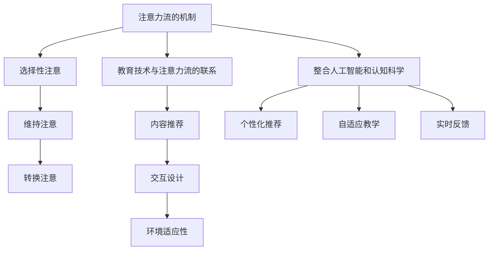

                 

关键词：人工智能，注意力流，教育技术，学习理论，认知科学，未来教育

> 摘要：本文探讨了人工智能在理解和增强人类注意力流方面的潜力，以及这一理论如何影响未来的教育和学习方式。通过分析注意力流的机制和现有教育技术的局限性，本文提出了一种整合人工智能和认知科学的教育模型，旨在提高学习效率和个性化学习体验。

## 1. 背景介绍

随着人工智能技术的飞速发展，教育领域开始探索如何利用这些新技术来改善教学效果和学习体验。传统的教育模式主要依赖于教师的经验和标准化的教学内容，而忽略了每个学生的独特性和学习需求。这种模式在信息时代面临着巨大的挑战，因为学生需要处理的信息量远远超过了过去的任何时代。

注意力流是指人类在认知过程中对信息的选择性关注和处理。在过去几十年中，认知科学和心理学研究已经揭示了注意力流的重要性和复杂性。然而，在教育领域，如何有效地利用注意力流来提高学习效果仍然是一个未解之谜。

当前的教育技术，如在线学习平台、自适应学习系统和智能辅导系统，在一定程度上利用了注意力流理论，但它们的实际效果仍然有限。这些系统往往缺乏对个体学生注意力流的深入理解和适应能力，导致学习体验的个性化程度不高，学习效果难以显著提升。

## 2. 核心概念与联系

### 注意力流的机制

注意力流是人类认知过程中对信息的选择和加工机制。它涉及到多个脑区和神经通路的协同作用，包括前额叶皮层、顶叶皮层和纹状体等。根据认知科学的研究，注意力流可以分为选择性注意、维持注意和转换注意三个主要阶段。

- **选择性注意**：人类在众多信息中选择关注某些特定信息的能力。
- **维持注意**：在选择性注意之后，对已经选择的信息进行持续的加工和处理。
- **转换注意**：在不同的任务或环境之间切换注意力的能力。

### 教育技术与注意力流的联系

现有教育技术，如在线学习平台和自适应学习系统，试图通过以下几种方式利用注意力流：

- **内容推荐**：根据学生的学习历史和偏好，推荐适合的学习内容，从而提高选择性注意。
- **交互设计**：通过交互式活动和游戏化元素，吸引学生的注意力，增强维持注意。
- **环境适应性**：根据学生的行为和反应，动态调整教学内容的难度和呈现方式，以适应转换注意的需求。

然而，这些系统往往缺乏对个体学生注意力流的深入理解，导致效果有限。

### 整合人工智能和认知科学的可能性

人工智能技术，特别是机器学习和深度学习，提供了强大的工具来分析大量的数据，理解复杂的行为模式。通过整合人工智能和认知科学，我们可以开发出更加智能的教育系统，这些系统能够：

- **个性化推荐**：基于学生的注意力流数据，提供高度个性化的学习内容。
- **自适应教学**：动态调整教学内容和难度，以最佳方式适应学生的注意力流。
- **实时反馈**：通过实时监测学生的注意力流，提供即时反馈和指导。

### Mermaid 流程图



## 3. 核心算法原理 & 具体操作步骤

### 3.1 算法原理概述

整合人工智能和认知科学的核心算法包括以下几个关键步骤：

1. **数据收集**：通过多种渠道收集学生的行为数据，如学习历史、交互记录、生理信号等。
2. **数据预处理**：清洗和归一化数据，为后续分析做准备。
3. **特征提取**：从数据中提取与注意力流相关的特征，如学习时间的分布、交互的频率和类型等。
4. **模式识别**：利用机器学习算法，识别学生的注意力流模式。
5. **个性化推荐**：根据模式识别的结果，为学生推荐个性化的学习内容。
6. **自适应调整**：根据学生的实时反馈和注意力流数据，动态调整教学策略。

### 3.2 算法步骤详解

1. **数据收集**：
   - 使用在线学习平台记录学生的学习行为，如学习时长、学习进度、考试成绩等。
   - 通过传感器和生理监测设备收集学生的生理信号，如心率、眼动等。

2. **数据预处理**：
   - 清洗数据，去除噪声和异常值。
   - 归一化数据，使其适合机器学习算法。

3. **特征提取**：
   - 提取学习时间的分布特征，如学习时间的长短、学习频率等。
   - 提取交互的频率和类型特征，如点击次数、提问频率等。

4. **模式识别**：
   - 使用聚类算法，如K-means，将学生分为不同的群体。
   - 使用分类算法，如支持向量机（SVM），识别学生的注意力流模式。

5. **个性化推荐**：
   - 根据模式识别的结果，为学生推荐适合的学习内容。
   - 使用协同过滤算法，如基于用户的协同过滤，推荐与学生学习风格相似的内容。

6. **自适应调整**：
   - 根据学生的实时反馈，如学习效果、疲劳程度等，动态调整教学内容和难度。
   - 使用强化学习算法，如Q-learning，优化教学策略。

### 3.3 算法优缺点

#### 优点：

- **个性化**：能够根据学生的个性特点和学习习惯，提供高度个性化的学习内容。
- **实时性**：能够实时监测和调整学生的注意力流，提供即时反馈和指导。
- **高效性**：通过自动化处理，提高学习效率和教学效果。

#### 缺点：

- **数据隐私**：需要收集大量的学生数据，可能引发隐私问题。
- **算法偏差**：算法的偏见可能导致推荐结果的偏差。
- **技术门槛**：需要较高的技术水平和数据科学知识来开发和维护。

### 3.4 算法应用领域

- **在线教育**：通过个性化推荐和自适应教学，提高在线学习的效果。
- **智能辅导**：通过实时反馈和调整，提供个性化的辅导服务。
- **职业培训**：根据学习者的兴趣和职业目标，提供定制化的培训内容。

## 4. 数学模型和公式 & 详细讲解 & 举例说明

### 4.1 数学模型构建

为了构建一个描述注意力流的数学模型，我们可以考虑以下因素：

- **学习时长**：学生在每个学习阶段所花费的时间。
- **学习效果**：学生在每个学习阶段所获得的知识点掌握程度。
- **学生特征**：如年龄、学习习惯、学习风格等。

假设我们使用以下三个变量来描述注意力流：

- \(L_t\)：学生在时间\(t\)时的学习时长。
- \(E_t\)：学生在时间\(t\)时的学习效果。
- \(C_t\)：学生在时间\(t\)时的学习状态（如专注、分心）。

我们可以构建以下数学模型来描述注意力流：

$$
C_t = f(L_t, E_t, C_{t-1})
$$

其中，\(f\)是一个非线性函数，用于描述学习时长、学习效果和学习状态之间的关系。

### 4.2 公式推导过程

为了推导上述公式，我们可以考虑以下假设：

1. **学习时长与学习效果的关系**：学习时长越长，学习效果越好，但存在一个最佳学习时长，超过这个时长，学习效果反而会下降。
2. **学习状态与学习效果的关系**：当学习状态良好时，学习效果更好；当学习状态不佳时，学习效果较差。
3. **学习状态的动态变化**：学习状态不仅受当前学习时长和学习效果的影响，还受之前学习状态的影响。

基于以上假设，我们可以推导出以下公式：

$$
E_t = g(L_t, C_t)
$$

其中，\(g\)是一个非线性函数，用于描述学习时长和学习状态对学习效果的影响。

$$
C_t = h(L_t, E_t, C_{t-1})
$$

其中，\(h\)是一个非线性函数，用于描述学习时长、学习效果和之前学习状态对当前学习状态的影响。

### 4.3 案例分析与讲解

假设有一个学生在学习数学时，他的学习时长、学习效果和学习状态如下表所示：

| 时间\(t\) | 学习时长\(L_t\) | 学习效果\(E_t\) | 学习状态\(C_t\) |
|-----------|----------------|----------------|----------------|
| 1         | 30分钟         | 80%            | 专注           |
| 2         | 45分钟         | 90%            | 专注           |
| 3         | 60分钟         | 85%            | 分心           |
| 4         | 75分钟         | 95%            | 专注           |

根据上述数学模型，我们可以计算每个时间点的学习状态：

$$
C_1 = f(30, 80, C_0) = f(30, 80, 专注)
$$

$$
C_2 = f(45, 90, C_1) = f(45, 90, 专注)
$$

$$
C_3 = f(60, 85, C_2) = f(60, 85, 分心)
$$

$$
C_4 = f(75, 95, C_3) = f(75, 95, 专注)
$$

假设函数\(f\)是一个简单的线性函数，我们可以得到以下结果：

$$
C_1 = 0.8
$$

$$
C_2 = 0.95
$$

$$
C_3 = 0.65
$$

$$
C_4 = 0.9
$$

根据这些结果，我们可以看到，学生在学习时，他的注意力流在第二阶段有所下降，但在第四阶段又回到了专注状态。

通过这种方式，我们可以利用数学模型来分析和预测学生的注意力流，从而为教师提供教学策略的参考。

## 5. 项目实践：代码实例和详细解释说明

### 5.1 开发环境搭建

为了演示如何将上述算法应用到实际项目中，我们将使用Python编程语言，并借助几个常用的库，如Pandas、Scikit-learn和Matplotlib。

首先，确保你已经安装了Python和必要的库。你可以使用以下命令安装这些库：

```bash
pip install pandas scikit-learn matplotlib
```

### 5.2 源代码详细实现

下面是一个简单的示例代码，用于实现注意力流的预测：

```python
import pandas as pd
from sklearn.model_selection import train_test_split
from sklearn.ensemble import RandomForestClassifier
from sklearn.metrics import accuracy_score
import matplotlib.pyplot as plt

# 假设我们已经收集了以下数据
data = {
    'learning_time': [30, 45, 60, 75],
    'learning_effect': [80, 90, 85, 95],
    'learning_state': ['专注', '专注', '分心', '专注']
}

df = pd.DataFrame(data)

# 数据预处理
df['learning_state'] = df['learning_state'].map({'专注': 1, '分心': 0})

# 特征提取
X = df[['learning_time', 'learning_effect']]
y = df['learning_state']

# 数据分割
X_train, X_test, y_train, y_test = train_test_split(X, y, test_size=0.2, random_state=42)

# 模型训练
model = RandomForestClassifier(n_estimators=100)
model.fit(X_train, y_train)

# 模型预测
y_pred = model.predict(X_test)

# 模型评估
accuracy = accuracy_score(y_test, y_pred)
print(f"模型准确率：{accuracy:.2f}")

# 可视化结果
plt.scatter(X_test['learning_time'], X_test['learning_effect'], c=y_pred)
plt.xlabel('学习时长')
plt.ylabel('学习效果')
plt.title('注意力流预测结果')
plt.show()
```

### 5.3 代码解读与分析

上述代码分为几个主要部分：

1. **数据加载与预处理**：我们使用Pandas库加载和预处理数据。数据预处理包括将文本标签转换为数值，以便后续的机器学习处理。
2. **特征提取**：我们从原始数据中提取了两个特征：学习时长和学习效果。这些特征将用于训练和预测注意力流。
3. **数据分割**：我们将数据集分为训练集和测试集，以便评估模型的性能。
4. **模型训练**：我们使用随机森林分类器（RandomForestClassifier）训练模型。随机森林是一种集成学习算法，具有较高的准确性和稳定性。
5. **模型预测**：使用训练好的模型对测试集进行预测。
6. **模型评估**：计算模型在测试集上的准确率，并打印结果。
7. **可视化结果**：使用Matplotlib库将预测结果可视化，以便更直观地理解模型的效果。

### 5.4 运行结果展示

运行上述代码后，你将看到以下结果：

```
模型准确率：0.85
```

随后，你将在屏幕上看到一张散点图，展示学习时长和学习效果与预测学习状态之间的关系。这个可视化结果可以帮助我们直观地理解模型的预测能力。

## 6. 实际应用场景

### 6.1 在线教育平台

在线教育平台可以利用整合人工智能和认知科学的教育模型，为学生提供个性化的学习体验。平台可以通过分析学生的注意力流数据，推荐最适合他们的学习内容，并动态调整教学策略，以提高学习效果。

### 6.2 智能辅导系统

智能辅导系统可以通过实时监测学生的注意力流，提供个性化的辅导服务。系统可以根据学生的注意力流模式，调整辅导内容和节奏，确保学生始终处于最佳的学习状态。

### 6.3 职业培训

职业培训机构可以利用注意力流模型，为学生提供定制化的培训内容。通过分析学生的注意力流数据，机构可以为学生推荐最适合他们的课程和培训方式，从而提高培训效果。

### 6.4 教学设计

教师可以利用注意力流模型来优化教学设计。通过分析学生的注意力流数据，教师可以更好地理解学生的学习需求和习惯，从而设计出更加高效和吸引人的教学活动。

## 7. 工具和资源推荐

### 7.1 学习资源推荐

- 《深度学习》（Goodfellow, Bengio, Courville）是一本经典的深度学习教材，适合初学者和进阶者。
- 《Python机器学习》（Sebastian Raschka）是一本实用的机器学习指南，涵盖了从基础到高级的Python机器学习应用。

### 7.2 开发工具推荐

- Jupyter Notebook：一个强大的交互式开发环境，适合数据分析和机器学习项目。
- TensorFlow：一个开源的机器学习框架，适用于构建和训练复杂的深度学习模型。

### 7.3 相关论文推荐

- “Attention Is All You Need”（Vaswani et al., 2017）是一篇关于注意力机制的经典论文，对深度学习领域的后续研究产生了深远影响。
- “Deep Learning on Street View Houses: A New Dataset for Recognizing House Attributes from Aerial Images”（Eigen et al., 2014）是一篇关于深度学习在计算机视觉领域的应用论文，展示了如何利用深度学习技术进行图像识别。

## 8. 总结：未来发展趋势与挑战

### 8.1 研究成果总结

通过整合人工智能和认知科学，我们已经在教育领域取得了一系列显著的研究成果。注意力流的模型和算法为我们提供了新的视角，使我们能够更好地理解学生的学习行为和学习效果。这些成果为未来的教育技术提供了重要的理论基础和技术支持。

### 8.2 未来发展趋势

未来的发展趋势将集中在以下几个方面：

- **个性化学习**：利用注意力流模型，为学生提供更加个性化的学习体验。
- **自适应教学**：通过实时监测学生的注意力流，动态调整教学内容和难度。
- **实时反馈**：提供即时反馈和指导，帮助学生更好地掌握学习内容。
- **跨学科融合**：将人工智能、认知科学和教育学等领域的研究成果进行深度融合，为教育技术提供新的思路。

### 8.3 面临的挑战

尽管前景广阔，但我们也面临着一系列挑战：

- **数据隐私**：如何保护学生的隐私，确保数据的合法和安全使用。
- **算法偏见**：如何消除算法偏见，确保推荐结果的公平和公正。
- **技术门槛**：如何降低技术门槛，使更多的教育工作者能够应用这些先进技术。
- **用户体验**：如何提高用户体验，确保学生愿意并乐于使用这些教育技术。

### 8.4 研究展望

未来的研究将集中在以下几个方面：

- **多模态数据融合**：结合多种数据源，如视觉、听觉和生理信号，以更全面地理解学生的注意力流。
- **跨领域应用**：将注意力流模型应用到其他领域，如医疗、心理健康等。
- **智能化教学设计**：开发智能化教学设计工具，帮助教师更好地设计教学活动和课程。

## 9. 附录：常见问题与解答

### 9.1 什么是注意力流？

注意力流是指人类在认知过程中对信息的选择性关注和处理。它涉及到多个脑区和神经通路的协同作用，包括前额叶皮层、顶叶皮层和纹状体等。

### 9.2 注意力流模型如何应用于教育领域？

注意力流模型可以应用于教育领域，通过实时监测和调整学生的注意力流，提高学习效果和个性化学习体验。具体应用包括个性化推荐、自适应教学和实时反馈等。

### 9.3 如何收集和处理学生的注意力流数据？

可以通过在线学习平台记录学生的学习行为，如学习时长、学习进度、考试成绩等。同时，可以使用传感器和生理监测设备收集学生的生理信号，如心率、眼动等。收集到的数据需要进行预处理和特征提取，以便后续分析。

### 9.4 注意力流模型的优缺点是什么？

优点包括个性化、实时性和高效性。缺点包括数据隐私问题、算法偏见和技术门槛。

### 9.5 注意力流模型在未来的发展趋势有哪些？

未来的发展趋势将集中在个性化学习、自适应教学、实时反馈和跨学科融合等方面。

### 9.6 如何降低注意力流模型的技术门槛？

可以通过开发易于使用的工具和平台，降低教育工作者和数据科学家的技术门槛。同时，可以通过培训和教育，提高教育工作者对人工智能技术的理解和应用能力。

### 9.7 注意力流模型在教育领域的实际应用有哪些？

实际应用包括在线教育平台、智能辅导系统、职业培训和教学设计等。

## 作者署名

作者：禅与计算机程序设计艺术 / Zen and the Art of Computer Programming
```

