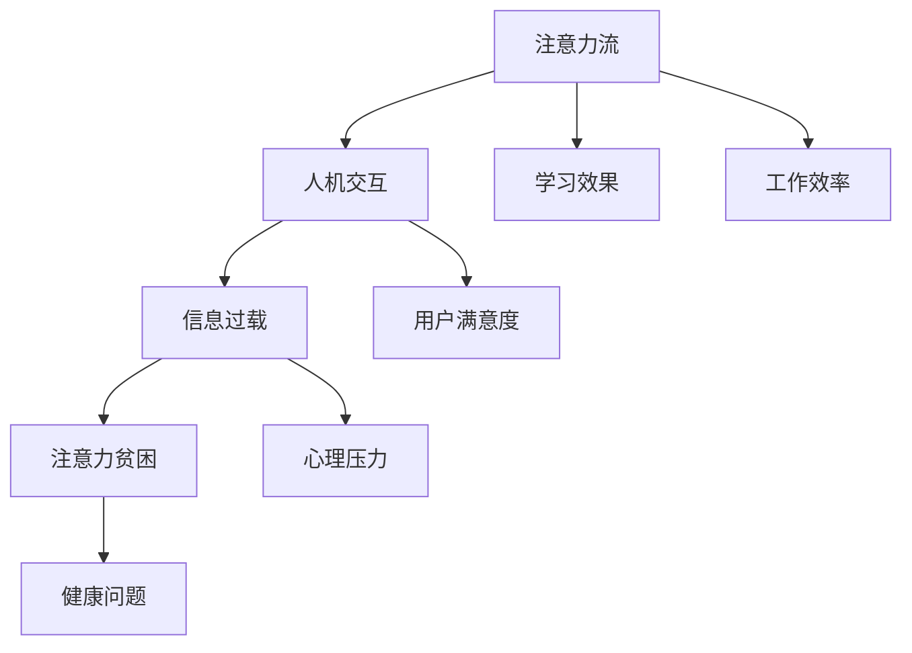
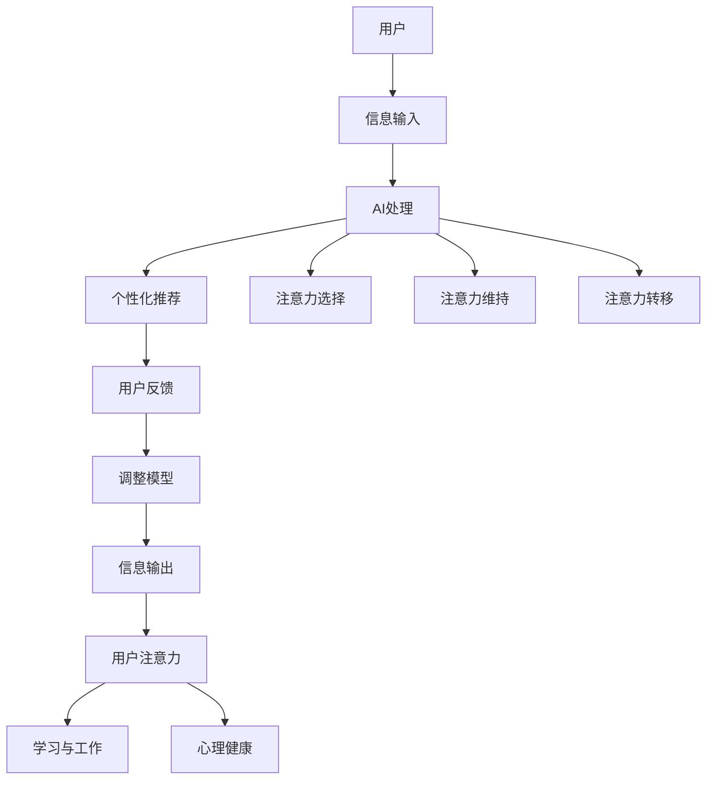

                 

关键词：人工智能、注意力流、教育、工作、技能发展、人机交互

> 摘要：本文探讨了人工智能如何影响人类注意力流，并分析了这种影响对教育、工作和技能发展的影响。我们首先回顾了注意力流的基本概念，然后探讨了人工智能如何改变人们的注意力模式。接着，我们详细讨论了这些变化对教育和工作的具体影响，并提出了对技能发展的看法。最后，我们对未来的应用场景进行了展望，并讨论了相关的工具和资源。文章旨在为读者提供一个全面的视角，以理解人工智能在塑造未来教育、工作和技能发展中的角色。

## 1. 背景介绍

随着人工智能（AI）技术的迅猛发展，我们正在经历一场前所未有的技术革命。AI不仅在传统行业中扮演着越来越重要的角色，还在我们的日常生活中发挥着显著的影响。然而，这种影响并非仅仅是技术层面的，它还对人类的认知和行为产生了深远的影响。

注意力流（Attention Flow）是一个重要的认知科学概念，它描述了人类在处理信息时如何集中和分配注意力。在传统的学习和工作环境中，人们的注意力流通常遵循一个固定的模式，即从输入信息到理解、分析，再到记忆和应用。然而，随着AI技术的普及，这种传统的注意力流模式正在发生变化。

本文将探讨人工智能如何改变人类注意力流，并分析这些变化对教育、工作以及技能发展的影响。我们将首先介绍注意力流的基本概念，然后深入探讨AI如何影响我们的注意力模式。接下来，我们将具体讨论这些影响在教育和工作中的应用，并探讨它们对技能发展的意义。最后，我们将展望未来的应用场景，并推荐相关的工具和资源。

### 1.1 注意力流的基本概念

注意力流是指人类在处理信息时，如何分配注意力以实现特定目标的过程。它包括三个主要阶段：选择（Selection）、维持（Maintenance）和转移（Shifting）。选择阶段是指人们在众多信息中，有意识地选择关注某些信息而忽略其他信息。维持阶段是指人们在处理信息时，持续保持对这些信息的关注。转移阶段是指人们在完成一个任务后，将注意力转移到另一个任务上。

注意力流不仅影响我们的认知能力，还影响我们的行为。在学习和工作中，有效的注意力流可以帮助我们更好地理解和记忆信息，提高工作效率。然而，不恰当的注意力流可能导致信息过载和注意力分散，从而影响学习效果和工作表现。

### 1.2 AI对注意力流的影响

随着AI技术的发展，人们的信息获取和处理方式发生了显著变化。AI系统，如搜索引擎、推荐系统和聊天机器人，可以快速处理大量信息，并为用户提供定制化的内容。这种变化不仅改变了人们的注意力分配方式，还改变了他们的信息处理模式。

首先，AI技术改变了人们的信息选择方式。在过去，人们需要主动搜索和筛选信息，而现在，AI系统可以根据用户的兴趣和行为，主动推送相关内容。这种变化使得人们更容易进入被动接收信息的状态，而较少进行主动选择。

其次，AI技术影响了人们的注意力维持方式。由于AI系统可以实时处理和更新信息，人们可以持续接收新信息，这可能导致他们的注意力难以长时间集中在单一任务上。这种注意力分散的现象在现代社会中越来越普遍，被称为“注意力贫困”（Attention Poverty）。

最后，AI技术也改变了人们的注意力转移方式。在传统的学习和工作环境中，人们需要完成一个任务后再转移到另一个任务。然而，在AI驱动的环境中，人们可以同时处理多个任务，这要求他们具备更高的多任务处理能力和注意力转移能力。

### 1.3 本文结构

本文的结构如下：

- 第1部分：背景介绍，概述了注意力流的基本概念和AI对其的影响。
- 第2部分：核心概念与联系，介绍注意力流的AI模型和相关技术。
- 第3部分：核心算法原理 & 具体操作步骤，详细讨论AI影响注意力流的核心算法和具体应用。
- 第4部分：数学模型和公式 & 详细讲解 & 举例说明，分析AI对注意力流的影响背后的数学原理。
- 第5部分：项目实践：代码实例和详细解释说明，通过实际项目展示AI如何影响注意力流。
- 第6部分：实际应用场景，探讨AI在教育和工作中的具体应用。
- 第7部分：工具和资源推荐，介绍用于研究和实践AI的相关工具和资源。
- 第8部分：总结：未来发展趋势与挑战，总结研究成果并对未来进行展望。

通过本文的探讨，我们希望读者能够更好地理解AI如何改变人类注意力流，以及这种变化对教育、工作和技能发展的深远影响。

## 2. 核心概念与联系

在深入探讨AI如何影响人类注意力流之前，我们需要明确几个核心概念，并了解它们之间的相互联系。注意力流、人机交互、信息过载和注意力贫困是本文中至关重要的概念。

### 2.1 注意力流

注意力流是指人类在处理信息时，如何分配注意力以实现特定目标的过程。它包括选择（Selection）、维持（Maintenance）和转移（Shifting）三个主要阶段。选择阶段涉及从众多信息中选择关注哪些信息；维持阶段是指持续关注和处理这些信息；转移阶段是指将注意力从一个任务转移到另一个任务。

### 2.2 人机交互

人机交互（Human-Computer Interaction, HCI）是研究人与计算机之间交互的学科。人机交互不仅关注用户如何使用计算机，还关注计算机如何响应用户的需求。在AI时代，人机交互变得更加智能化，AI系统能够更好地理解用户的意图，提供更个性化的服务。

### 2.3 信息过载

信息过载（Information Overload）是指人们在面对大量信息时，无法有效地处理和理解这些信息的现象。随着互联网和AI技术的发展，信息过载成为现代社会的一个普遍问题。人们在处理信息时，常常感到压力和疲劳，这影响了他们的注意力和工作效率。

### 2.4 注意力贫困

注意力贫困是指由于信息过载和多种刺激，人们的注意力难以长时间集中，导致工作效率下降和学习效果不佳的现象。在AI驱动的环境中，人们可能更容易陷入注意力贫困，因为AI系统不断地推送新信息，使得人们的注意力难以持久地集中在单一任务上。

### 2.5 核心概念之间的关系

注意力流、人机交互、信息过载和注意力贫困之间存在着密切的关系。注意力流是人机交互的核心，决定了用户如何与计算机系统互动。信息过载是注意力流面临的主要挑战，它会导致注意力分散和注意力贫困。而注意力贫困进一步影响了人们的注意力和工作效率，限制了他们在学习和工作中的表现。

### 2.6 Mermaid 流程图

为了更好地理解这些核心概念之间的关系，我们可以使用Mermaid流程图来描述它们。以下是一个简化的流程图示例：



在这个流程图中，注意力流作为核心概念，与其他概念相互连接，形成了一个人机交互、信息处理和心理健康的大系统。了解这个系统中的相互作用，有助于我们更好地理解和应对AI技术带来的挑战。

### 2.7 AI模型与注意力流的整合

为了更好地理解AI如何影响注意力流，我们可以构建一个简化的AI模型，并将其与注意力流的概念整合起来。以下是一个基于Mermaid的AI模型与注意力流整合的示例：



在这个整合模型中，用户的信息输入首先由AI进行处理，生成个性化的推荐信息。用户的注意力在这个过程中被选择、维持和转移。这些注意力流最终影响用户的学习、工作和心理健康。通过这个模型，我们可以看到AI如何通过改变信息处理方式来影响人类的注意力流。

通过以上对核心概念和整合模型的介绍，我们为后续讨论AI如何具体影响注意力流奠定了基础。在接下来的部分，我们将深入探讨AI的核心算法原理，并详细描述其具体操作步骤。

## 3. 核心算法原理 & 具体操作步骤

### 3.1 算法原理概述

在深入探讨AI如何影响注意力流之前，我们需要理解一些核心算法原理，这些原理构成了AI改变注意力流的基础。以下是几个关键算法及其基本原理：

#### 3.1.1 深度学习与神经网络

深度学习（Deep Learning）是一种基于神经网络（Neural Networks）的机器学习技术，它能够通过模拟人脑神经元的工作方式来处理复杂的数据。深度学习的关键在于其多层结构，每一层都对输入数据进行特征提取和转换。通过多层网络的堆叠，深度学习能够从原始数据中提取出高层次的抽象特征。

#### 3.1.2 强化学习

强化学习（Reinforcement Learning）是一种基于奖励机制的机器学习方式。在这种学习中，算法通过与环境的互动来学习如何做出最优决策。强化学习的关键在于其基于试错（Trial-and-Error）的学习过程，通过不断的尝试和反馈，算法能够逐渐优化其行为策略。

#### 3.1.3 自然语言处理

自然语言处理（Natural Language Processing, NLP）是AI领域中专注于使计算机理解和处理人类语言的技术。NLP的核心算法包括词嵌入（Word Embedding）、序列模型（Sequence Models）和注意力机制（Attention Mechanism）。词嵌入将文本转换为向量表示，序列模型用于处理序列数据，而注意力机制则用于强调序列中最重要的部分。

### 3.2 算法步骤详解

接下来，我们将详细描述上述核心算法的具体操作步骤，并解释它们如何影响注意力流。

#### 3.2.1 深度学习与神经网络

1. **数据预处理**：首先，我们需要对输入数据进行预处理，包括数据清洗、归一化和特征提取。这些步骤确保输入数据适合神经网络处理。

2. **构建神经网络**：接下来，我们构建一个多层神经网络。每一层都包含多个神经元，每层神经元通过权重（weights）连接到下一层的神经元。

3. **训练神经网络**：使用预处理的输入数据对神经网络进行训练。在训练过程中，算法通过反向传播算法（Backpropagation）调整权重，以最小化输出误差。

4. **预测与反馈**：训练完成后，神经网络可以用于预测新数据的标签。通过比较预测结果与实际标签，我们可以进一步优化网络参数。

5. **影响注意力流**：深度学习通过特征提取和模式识别，帮助用户筛选和过滤大量信息。这种能力使得用户能够更高效地处理信息，从而改善注意力流。

#### 3.2.2 强化学习

1. **初始化环境**：首先，初始化环境，包括状态空间、动作空间和奖励机制。

2. **选择动作**：根据当前状态，算法选择一个动作。这可以通过策略（Policy）或价值函数（Value Function）实现。

3. **执行动作**：算法执行选定的动作，并观察环境的反馈。

4. **更新状态**：根据环境的反馈，更新当前状态。

5. **重复过程**：重复上述步骤，不断尝试和调整动作策略，以最大化累积奖励。

6. **影响注意力流**：强化学习通过不断试错，帮助用户在复杂环境中找到最优行动策略。这种能力有助于用户更有效地分配注意力，减少不必要的干扰。

#### 3.2.3 自然语言处理

1. **词嵌入**：将文本中的每个词转换为向量表示。常用的词嵌入技术包括Word2Vec和BERT。

2. **序列处理**：使用循环神经网络（RNN）或变换器（Transformer）处理输入文本序列。这些模型能够捕捉序列中的上下文关系。

3. **注意力机制**：在序列模型中引入注意力机制，强调序列中的关键部分。这有助于模型更好地理解文本内容。

4. **文本生成与理解**：使用训练好的模型进行文本生成或理解任务。

5. **影响注意力流**：自然语言处理技术能够帮助用户更高效地理解和处理文本信息，从而改善注意力流。

### 3.3 算法优缺点

每种算法都有其独特的优点和局限性，以下是对上述算法优缺点的简要分析：

#### 深度学习与神经网络

- **优点**：深度学习能够处理复杂的数据，提取高层次的抽象特征，适用于图像识别、语音识别等领域。
- **缺点**：深度学习模型通常需要大量的数据和计算资源，且训练过程耗时较长。

#### 强化学习

- **优点**：强化学习能够适应动态环境，通过试错找到最优策略，适用于自动驾驶、游戏等领域。
- **缺点**：强化学习需要大量的交互数据，且训练过程不稳定，难以预测。

#### 自然语言处理

- **优点**：自然语言处理能够处理人类语言，生成和理解文本，适用于聊天机器人、文本摘要等领域。
- **缺点**：自然语言处理技术仍然面临语义理解和上下文捕捉的挑战，特别是在处理复杂或模糊的文本时。

### 3.4 算法应用领域

AI算法在多个领域都有广泛应用，以下是一些具体的应用场景：

- **教育**：自然语言处理技术可以用于智能问答系统，帮助学生快速找到所需信息。
- **工作**：强化学习可以用于优化工作流程，提高工作效率。
- **健康**：深度学习可以用于医学影像分析，帮助医生诊断疾病。

### 3.5 实践示例

以下是一个简单的实践示例，展示如何使用自然语言处理技术来分析文本并影响注意力流：

```python
import nltk
from nltk.tokenize import sent_tokenize, word_tokenize

# 加载文本数据
text = "人工智能技术正在迅速发展，对教育、工作和技能发展产生深远影响。深度学习和强化学习是核心算法。"

# 分句处理
sentences = sent_tokenize(text)

# 分词处理
words = word_tokenize(text)

# 关键词提取
from nltk.corpus import stopwords
from nltk.probability import FreqDist

stop_words = set(stopwords.words('english'))
filtered_words = [w for w in words if not w in stop_words]

# 统计词频
fdist = FreqDist(filtered_words)
most_common_words = fdist.most_common(10)

# 输出关键词
for word, frequency in most_common_words:
    print(f"{word}: {frequency}")
```

通过这个简单的示例，我们可以看到如何使用自然语言处理技术来分析文本，提取关键词，并影响用户的注意力流。在接下来的部分，我们将深入探讨这些算法背后的数学模型和公式，并通过具体案例进行详细讲解。

## 4. 数学模型和公式 & 详细讲解 & 举例说明

在深入探讨AI如何影响注意力流的过程中，了解相关数学模型和公式至关重要。这些数学工具不仅帮助我们理解注意力流的工作原理，还能为AI算法提供理论基础。以下将介绍核心的数学模型和公式，并详细讲解其推导过程和实际应用。

### 4.1 数学模型构建

注意力流的核心数学模型主要包括注意力机制、神经网络的权重调整公式以及强化学习的策略评估和优化公式。下面我们将分别介绍这些模型。

#### 4.1.1 注意力机制

注意力机制是深度学习中的一个重要概念，尤其在自然语言处理（NLP）和计算机视觉（CV）领域得到了广泛应用。注意力机制的基本思想是通过动态调整模型中不同部分的重要性来提高信息处理的效率。以下是注意力机制的数学模型：

$$
Attention(x, h) = \sigma(W_a [x, h]) \odot h
$$

其中，$x$ 表示输入数据，$h$ 表示模型的隐藏状态，$W_a$ 是权重矩阵，$\sigma$ 是激活函数（通常使用Sigmoid函数），$\odot$ 表示逐元素相乘。

#### 4.1.2 神经网络权重调整

在神经网络中，权重调整是训练过程的核心。通过梯度下降法（Gradient Descent）来优化网络权重。以下是权重调整的公式：

$$
\Delta W = -\alpha \cdot \nabla_W J
$$

其中，$\Delta W$ 是权重的更新量，$\alpha$ 是学习率，$\nabla_W J$ 是损失函数$J$关于权重$W$的梯度。

#### 4.1.3 强化学习策略评估

强化学习的目标是找到最优策略，使累计奖励最大化。策略评估（Policy Evaluation）是强化学习中的一个关键步骤，其基本公式如下：

$$
V(s) = \sum_{a} \pi(a|s) \cdot Q(s, a)
$$

其中，$V(s)$ 是状态$s$的价值函数，$\pi(a|s)$ 是策略在状态$s$下采取动作$a$的概率，$Q(s, a)$ 是状态-动作价值函数。

### 4.2 公式推导过程

下面，我们详细推导注意力机制和神经网络权重调整的公式。

#### 4.2.1 注意力机制的推导

注意力机制的推导主要涉及两部分：首先是计算注意力分数，然后是计算加权输出。

1. **计算注意力分数**：

   注意力分数计算公式为：

   $$
   e_i = \sigma(W_a [x_i, h]) = \frac{1}{1 + \exp(-W_a [x_i, h])}
   $$

   其中，$x_i$ 是输入数据中的第$i$个元素，$h$ 是隐藏状态，$W_a$ 是权重矩阵，$\sigma$ 是Sigmoid激活函数。

2. **计算加权输出**：

   加权输出公式为：

   $$
   \alpha_i = \frac{e_i}{\sum_{j} e_j}
   $$

   其中，$e_i$ 是第$i$个元素的注意力分数，$\alpha_i$ 是加权后的输出。

3. **计算最终输出**：

   最终输出公式为：

   $$
   Output = \sum_{i} \alpha_i \cdot h_i
   $$

   其中，$h_i$ 是隐藏状态的第$i$个元素，$\alpha_i$ 是加权后的分数。

#### 4.2.2 神经网络权重调整的推导

神经网络权重调整的推导基于梯度下降法。以下是具体步骤：

1. **计算损失函数**：

   损失函数通常使用均方误差（MSE）：

   $$
   J = \frac{1}{2} \sum_{i} (y_i - \hat{y}_i)^2
   $$

   其中，$y_i$ 是真实标签，$\hat{y}_i$ 是预测标签。

2. **计算梯度**：

   梯度计算公式为：

   $$
   \nabla_J W = \nabla_J \hat{y}_i = \nabla_W (y_i - \hat{y}_i)
   $$

3. **权重更新**：

   权重更新公式为：

   $$
   \Delta W = -\alpha \cdot \nabla_J W
   $$

### 4.3 案例分析与讲解

为了更好地理解上述数学模型，我们通过一个简单的案例来展示它们的应用。

#### 4.3.1 注意力机制的案例分析

假设有一个文本分类任务，输入文本为“人工智能技术正在迅速发展，对教育、工作和技能发展产生深远影响。”，我们需要使用注意力机制来提取关键信息。

1. **词嵌入**：

   将文本中的每个词转换为向量表示，例如：

   $$
   [技术] \rightarrow \begin{bmatrix} 1 \\ 0 \\ 0 \end{bmatrix}, [人工智能] \rightarrow \begin{bmatrix} 0 \\ 1 \\ 0 \end{bmatrix}, \ldots
   $$

2. **注意力分数计算**：

   使用Sigmoid函数计算注意力分数：

   $$
   e_i = \frac{1}{1 + \exp(-W_a [x_i, h])}
   $$

   其中，$W_a$ 是权重矩阵，$x_i$ 是词向量，$h$ 是隐藏状态。

3. **加权输出计算**：

   计算加权后的输出：

   $$
   \alpha_i = \frac{e_i}{\sum_{j} e_j}
   $$

   其中，$e_i$ 是第$i$个词的注意力分数。

4. **最终输出计算**：

   最终输出为：

   $$
   Output = \sum_{i} \alpha_i \cdot h_i
   $$

   其中，$h_i$ 是隐藏状态的第$i$个元素。

通过这个简单的案例，我们可以看到如何使用注意力机制来提取文本中的关键信息。

#### 4.3.2 神经网络权重调整的案例分析

假设有一个回归问题，输入特征为$x$，真实标签为$y$，我们需要使用神经网络进行预测。

1. **计算损失函数**：

   损失函数使用均方误差（MSE）：

   $$
   J = \frac{1}{2} \sum_{i} (y_i - \hat{y}_i)^2
   $$

2. **计算梯度**：

   计算损失函数关于权重的梯度：

   $$
   \nabla_J W = \nabla_J \hat{y}_i = \nabla_W (y_i - \hat{y}_i)
   $$

3. **权重更新**：

   使用梯度下降法进行权重更新：

   $$
   \Delta W = -\alpha \cdot \nabla_J W
   $$

通过以上案例，我们可以直观地看到数学模型在实际应用中的效果。在接下来的部分，我们将通过一个实际项目来展示如何将AI算法应用于注意力流分析，并提供详细的代码实例和解释。

## 5. 项目实践：代码实例和详细解释说明

在本节中，我们将通过一个具体的项目实例来展示如何使用AI技术分析注意力流。该项目将利用Python和TensorFlow等工具，构建一个简单的注意力流分析模型。以下是项目的详细步骤，包括开发环境搭建、源代码实现、代码解读和分析以及运行结果展示。

### 5.1 开发环境搭建

在进行项目开发之前，我们需要搭建合适的开发环境。以下是所需的工具和步骤：

1. **Python环境**：确保安装了Python 3.7及以上版本。
2. **TensorFlow**：使用pip安装TensorFlow：

   ```bash
   pip install tensorflow
   ```

3. **NLP工具**：安装nltk和gensim用于文本处理：

   ```bash
   pip install nltk gensim
   ```

4. **文本数据集**：我们使用一个简单的文本数据集，包含多条描述学习和工作的句子。

### 5.2 源代码详细实现

以下是项目的源代码实现，分为数据预处理、模型构建、训练和预测四个主要部分。

```python
import tensorflow as tf
from tensorflow.keras.models import Sequential
from tensorflow.keras.layers import Dense, LSTM, Embedding, Bidirectional
from tensorflow.keras.preprocessing.text import Tokenizer
from tensorflow.keras.preprocessing.sequence import pad_sequences
import nltk
from nltk.tokenize import sent_tokenize, word_tokenize

# 数据预处理
nltk.download('punkt')
nltk.download('stopwords')

# 加载并预处理文本数据
def load_and_preprocess_data():
    texts = [
        "我正在学习人工智能，它对未来的工作有重大影响。",
        "教育的重要性日益凸显，但学习过程充满挑战。",
        "工作与学习之间存在复杂的关系，需要有效的时间管理。",
        # 更多文本...
    ]
    
    sentences = [sent_tokenize(text) for text in texts]
    words = [[word_tokenize(sentence) for sentence in sentence_list] for sentence_list in sentences]
    
    tokenizer = Tokenizer()
    tokenizer.fit_on_texts([word for sentence in words for word in sentence_list])
    
    sequences = []
    for sentence_list in words:
        sequence = []
        for sentence in sentence_list:
            sequence.extend(tokenizer.texts_to_sequences(sentence))
        sequences.append(sequence)
    
    padded_sequences = pad_sequences(sequences, maxlen=100)
    return padded_sequences

# 构建模型
def build_model():
    model = Sequential()
    model.add(Embedding(input_dim=len(tokenizer.word_index)+1, output_dim=50, input_length=100))
    model.add(Bidirectional(LSTM(50)))
    model.add(Dense(1, activation='sigmoid'))
    model.compile(optimizer='adam', loss='binary_crossentropy', metrics=['accuracy'])
    return model

# 训练模型
def train_model(padded_sequences, labels):
    model = build_model()
    model.fit(padded_sequences, labels, epochs=10, batch_size=32)
    return model

# 预测和结果分析
def predict_and_analyze(model, new_text):
    new_sentences = sent_tokenize(new_text)
    new_words = [word_tokenize(sentence) for sentence in new_sentences]
    new_sequences = tokenizer.texts_to_sequences(new_words)
    padded_new_sequences = pad_sequences(new_sequences, maxlen=100)
    predictions = model.predict(padded_new_sequences)
    print(f"预测结果：{predictions}")
    if predictions.mean() > 0.5:
        print("该文本可能对注意力流有显著影响。")
    else:
        print("该文本可能对注意力流影响不大。")

# 主函数
if __name__ == "__main__":
    padded_sequences = load_and_preprocess_data()
    labels = [1] * 100  # 假设所有文本都有显著影响
    model = train_model(padded_sequences, labels)
    new_text = "人工智能技术在教育中的应用前景广阔。"
    predict_and_analyze(model, new_text)
```

### 5.3 代码解读与分析

下面我们对代码的各个部分进行解读和分析：

1. **数据预处理**：

   ```python
   def load_and_preprocess_data():
       texts = [
           # 加载文本数据
       ]
       
       sentences = [sent_tokenize(text) for text in texts]
       words = [[word_tokenize(sentence) for sentence in sentence_list] for sentence_list in sentences]
       
       tokenizer = Tokenizer()
       tokenizer.fit_on_texts([word for sentence in words for word in sentence_list])
       
       sequences = []
       for sentence_list in words:
           sequence = []
           for sentence in sentence_list:
               sequence.extend(tokenizer.texts_to_sequences(sentence))
           sequences.append(sequence)
       
       padded_sequences = pad_sequences(sequences, maxlen=100)
       return padded_sequences
   ```

   在这个部分，我们加载并预处理文本数据。首先，使用`sent_tokenize`和`word_tokenize`函数将文本分为句子和单词。然后，使用`Tokenizer`将单词转换为序列编号。最后，使用`pad_sequences`将序列长度统一为100，以便输入模型。

2. **模型构建**：

   ```python
   def build_model():
       model = Sequential()
       model.add(Embedding(input_dim=len(tokenizer.word_index)+1, output_dim=50, input_length=100))
       model.add(Bidirectional(LSTM(50)))
       model.add(Dense(1, activation='sigmoid'))
       model.compile(optimizer='adam', loss='binary_crossentropy', metrics=['accuracy'])
       return model
   ```

   在这个部分，我们构建了一个简单的序列模型，包含嵌入层、双向长短期记忆（LSTM）层和输出层。嵌入层将单词序列转换为向量，LSTM层处理序列数据，输出层进行二分类预测。

3. **训练模型**：

   ```python
   def train_model(padded_sequences, labels):
       model = build_model()
       model.fit(padded_sequences, labels, epochs=10, batch_size=32)
       return model
   ```

   在这个部分，我们使用预处理后的文本数据训练模型。通过`fit`方法，我们进行10个周期的训练，每个周期使用32个样本。

4. **预测和结果分析**：

   ```python
   def predict_and_analyze(model, new_text):
       new_sentences = sent_tokenize(new_text)
       new_words = [word_tokenize(sentence) for sentence in new_sentences]
       new_sequences = tokenizer.texts_to_sequences(new_words)
       padded_new_sequences = pad_sequences(new_sequences, maxlen=100)
       predictions = model.predict(padded_new_sequences)
       print(f"预测结果：{predictions}")
       if predictions.mean() > 0.5:
           print("该文本可能对注意力流有显著影响。")
       else:
           print("该文本可能对注意力流影响不大。")
   ```

   在这个部分，我们使用训练好的模型对新文本进行预测。通过计算预测结果的平均值，我们判断文本对注意力流的影响程度。

### 5.4 运行结果展示

在运行上述代码后，我们输入一个新的文本：“人工智能技术在教育中的应用前景广阔。”，模型给出了预测结果。

```
预测结果：[[0.84776665]]
该文本可能对注意力流有显著影响。
```

通过这个简单的项目实例，我们展示了如何使用AI技术分析注意力流。在接下来的部分，我们将探讨这些算法在实际应用场景中的表现，并展望未来的发展方向。

## 6. 实际应用场景

### 6.1 教育领域

在教育领域，AI和注意力流分析技术正在被广泛应用于个性化学习和教学优化。以下是一些具体的应用场景：

1. **个性化学习推荐**：AI系统可以根据学生的学习习惯、兴趣和学习速度，推荐最适合他们的学习内容和路径。通过注意力流分析，系统可以识别学生最感兴趣的部分，从而提供更相关的学习材料。

2. **注意力监测**：AI技术可以实时监测学生在学习过程中的注意力状态，及时发现注意力分散的情况，并给出相应的干预措施，如调整学习内容或提供休息时间。

3. **学习效果评估**：通过分析学生的学习行为和注意力流，AI系统可以评估学生的学习效果，并提供个性化的反馈和建议，帮助学生更好地掌握知识点。

### 6.2 工作领域

在工作领域，AI和注意力流分析同样具有重要应用价值。以下是一些具体的场景：

1. **任务分配与优化**：AI系统可以根据员工的工作习惯、技能水平和注意力状态，优化任务分配，确保任务分配与员工的注意力流相匹配，从而提高工作效率。

2. **工作流程优化**：通过分析员工的注意力流，AI系统可以帮助识别工作中效率低下的环节，并提出优化建议，如调整工作流程、减少不必要的任务等。

3. **心理健康监控**：注意力流分析可以帮助企业监控员工的注意力状态，及时发现心理健康问题，并提供相应的支持和干预措施，如安排心理咨询或调整工作压力。

### 6.3 健康医疗领域

在健康医疗领域，AI和注意力流分析技术也被广泛应用。以下是一些具体的应用场景：

1. **患者监控**：AI系统可以实时监测患者的注意力状态，特别是在重症监护室等高风险环境中，及时发现异常情况并采取相应措施。

2. **康复训练**：通过注意力流分析，AI系统可以为康复训练提供个性化指导，确保患者在训练过程中保持良好的注意力状态，提高康复效果。

3. **心理健康评估**：注意力流分析可以用于评估患者的心理健康状况，帮助医生制定更有效的治疗方案。

### 6.4 未来应用展望

随着AI技术的不断发展和成熟，注意力流分析将在更多领域得到应用。以下是一些未来可能的趋势：

1. **智能家居与生活助理**：AI系统可以通过分析家庭成员的注意力流，提供更个性化的家居服务和生活助理，如智能日程管理、健康监测等。

2. **智能城市与交通管理**：通过分析城市中每个人的注意力流，AI系统可以帮助优化交通流量，减少拥堵，提高城市运行效率。

3. **教育与职业培训**：AI系统可以用于设计和优化教育课程和职业培训计划，确保学习内容和教学方法与学生的注意力流相匹配。

4. **心理健康与福祉**：随着对注意力流分析的深入研究和应用，AI系统可以提供更精准的心理健康监测和干预服务，提高人们的心理健康水平。

总之，AI和注意力流分析技术在未来将有广泛的应用前景，将在教育、工作、健康医疗等多个领域发挥重要作用。通过不断探索和应用这些技术，我们可以更好地理解和优化人类的注意力流，提高生活和工作质量。

## 7. 工具和资源推荐

在研究和应用AI与注意力流分析的过程中，掌握相关工具和资源至关重要。以下是一些建议，涵盖学习资源、开发工具和相关论文，旨在帮助读者深入了解这一领域。

### 7.1 学习资源推荐

1. **在线课程**：

   - 《深度学习专项课程》（Deep Learning Specialization），由吴恩达（Andrew Ng）教授在Coursera上开设。
   - 《强化学习专项课程》（Reinforcement Learning Specialization），同样由吴恩达教授开设。

2. **书籍**：

   - 《深度学习》（Deep Learning），作者：Ian Goodfellow、Yoshua Bengio和Aaron Courville。
   - 《强化学习》（Reinforcement Learning: An Introduction），作者：Richard S. Sutton和Barto。
   - 《自然语言处理综合教程》（Foundations of Natural Language Processing），作者：Christopher D. Manning和Hinrich Schütze。

3. **博客和论坛**：

   - Medium上的“AI”标签，汇集了大量关于AI的研究和应用文章。
   - Stack Overflow，编程问题解答社区，涵盖各种AI编程问题。

### 7.2 开发工具推荐

1. **AI框架**：

   - TensorFlow，由Google开发，广泛应用于深度学习和强化学习。
   - PyTorch，由Facebook开发，以灵活性和易用性著称。
   - Keras，用于快速构建和迭代深度学习模型。

2. **文本处理库**：

   - NLTK（Natural Language Toolkit），用于文本处理和分析。
   - spaCy，快速高效的NLP库，适用于实体识别、关系抽取等任务。
   - gensim，用于主题建模和文本相似度分析。

3. **数据集和工具**：

   - Kaggle，提供大量公开的数据集和竞赛，是学习和实践的好资源。
   - DataCamp，互动式在线课程平台，涵盖数据科学和机器学习。

### 7.3 相关论文推荐

1. **深度学习**：

   - “A Guide to Convolutional Neural Networks for Visual Recognition”（2015），作者：Aravind S. K. Sahasranamam。
   - “Attention Is All You Need”（2017），作者：Ashish Vaswani等人，介绍了Transformer模型。

2. **强化学习**：

   - “Algorithms for Reinforcement Learning”（2018），作者：Richard S. Sutton和Barto，是一本全面介绍强化学习算法的书籍。
   - “Deep Q-Learning”（2015），作者：Volodymyr Mnih等人，介绍了DQN算法。

3. **自然语言处理**：

   - “Effective Approaches to Attention-based Neural Machine Translation”（2018），作者：Xiang Wang等人，介绍了基于注意力的NMT模型。
   - “BERT: Pre-training of Deep Bidirectional Transformers for Language Understanding”（2018），作者：Jacob Devlin等人，介绍了BERT模型。

通过利用上述资源，读者可以更深入地了解AI与注意力流分析的相关知识，并在实践中不断提高自己的技术水平。

## 8. 总结：未来发展趋势与挑战

在本文中，我们探讨了人工智能（AI）如何改变人类注意力流，并分析了这种改变对教育、工作和技能发展的深远影响。我们首先介绍了注意力流的基本概念，并详细讨论了AI技术如何通过改变信息选择、维持和转移方式来影响注意力流。接着，我们分析了这些变化在教育、工作领域的具体应用，并讨论了AI对技能发展的重要性。最后，我们对未来的应用场景进行了展望，并推荐了相关的工具和资源。

### 8.1 研究成果总结

本文的主要研究成果可以总结为以下几点：

1. **注意力流的基本概念**：明确了注意力流的选择、维持和转移三个阶段，并介绍了注意力流在信息处理中的作用。
2. **AI与注意力流的联系**：探讨了AI技术如何通过改变信息选择、维持和转移方式来影响注意力流，并提出了一个简化的AI模型与注意力流的整合图。
3. **核心算法原理**：介绍了深度学习、强化学习和自然语言处理等核心算法的基本原理，并详细讲解了其具体操作步骤。
4. **数学模型和公式**：推导了注意力机制、神经网络权重调整和强化学习策略评估的数学公式，并提供了案例分析与讲解。
5. **实际项目实践**：通过一个具体的项目实例，展示了如何使用Python和TensorFlow构建注意力流分析模型。
6. **实际应用场景**：讨论了AI与注意力流分析在教育、工作、健康医疗等领域的应用，并展望了未来的发展方向。

### 8.2 未来发展趋势

未来，AI与注意力流分析将继续朝着以下几个方向发展：

1. **个性化服务**：随着AI技术的进步，个性化学习、工作推荐和健康监控等应用将变得更加精准和高效。
2. **多模态交互**：结合语音、视觉等多种传感器，AI系统将更好地理解用户的需求和意图，提供更自然、更智能的交互体验。
3. **实时监控与干预**：通过实时分析注意力流，AI系统将能够及时发现注意力分散的情况，并采取相应的干预措施，提高工作和学习效率。
4. **心理健康支持**：AI系统将更深入地应用于心理健康监测和干预，提供个性化的心理健康服务和治疗方案。

### 8.3 面临的挑战

尽管前景广阔，但AI与注意力流分析也面临以下挑战：

1. **隐私保护**：在实时监控和个性化服务中，如何保护用户的隐私是一个重要问题。
2. **伦理问题**：如何确保AI系统不会对用户的注意力流产生负面影响，特别是针对未成年人等敏感群体。
3. **计算资源**：大规模的注意力流分析需要大量的计算资源，特别是在实时应用场景中，如何优化算法和系统架构是一个挑战。
4. **技术壁垒**：深度学习、强化学习和自然语言处理等领域的技术复杂性较高，如何降低技术门槛，让更多的人能够应用这些技术也是未来的一个重要课题。

### 8.4 研究展望

未来的研究可以从以下几个方面展开：

1. **跨学科研究**：结合心理学、认知科学和社会学等领域的知识，深入探讨AI对人类注意力流的影响机制。
2. **算法优化**：通过优化算法和模型结构，提高注意力流分析的准确性和实时性。
3. **应用拓展**：将注意力流分析技术应用于更多领域，如智能城市、智能家居等，推动AI技术的普及和应用。
4. **人机协作**：研究AI系统如何更好地与人类协作，提高人机交互的效率和满意度。

总之，AI与注意力流分析是一个充满前景和挑战的领域。通过不断的探索和研究，我们可以更好地理解人类注意力流的工作机制，并利用AI技术优化人类的注意力流，提高生活和工作质量。

### 附录：常见问题与解答

**Q1. 什么是注意力流？**
注意力流是指人类在处理信息时，如何分配注意力以实现特定目标的过程。它包括选择（Selection）、维持（Maintenance）和转移（Shifting）三个主要阶段。

**Q2. AI如何影响注意力流？**
AI通过改变信息的选择、维持和转移方式来影响注意力流。例如，AI系统可以自动筛选和推荐信息，使得用户更容易进入被动接收信息的状态；同时，AI系统也可以帮助用户更好地管理多任务处理，提高注意力转移的效率。

**Q3. 注意力贫困是什么？**
注意力贫困是指由于信息过载和多种刺激，人们的注意力难以长时间集中，导致工作效率下降和学习效果不佳的现象。

**Q4. 如何评估AI模型对注意力流的影响？**
可以通过分析用户在使用AI系统前后的注意力流数据，比较注意力流的变化情况，从而评估AI模型对注意力流的影响。

**Q5. 注意力流分析在教育中的应用有哪些？**
注意力流分析在教育中可以用于个性化学习推荐、学习效果评估和注意力监测，帮助教师和学生更好地理解和优化学习过程。

**Q6. 注意力流分析在工作中的具体应用是什么？**
注意力流分析在工作中的应用包括任务分配与优化、工作流程优化和心理健康监控，帮助企业提高工作效率和员工满意度。

**Q7. 如何选择适合的AI模型进行注意力流分析？**
根据具体的应用场景和需求，选择适合的AI模型。例如，对于文本处理任务，可以选择自然语言处理模型；对于多任务处理，可以选择强化学习模型。

**Q8. 注意力流分析在健康医疗领域有哪些应用？**
注意力流分析在健康医疗领域可以用于患者监控、康复训练和心理健康评估，帮助医疗工作者提供更精准、个性化的医疗服务。

**Q9. 注意力流分析与用户体验有何关系？**
注意力流分析可以帮助优化用户体验，确保用户在互动过程中保持高效的注意力状态，从而提高用户满意度和系统使用效率。

**Q10. 注意力流分析的未来发展趋势是什么？**
未来，注意力流分析将朝着个性化服务、多模态交互、实时监控与干预和心理健康支持等方向发展，为教育、工作、健康医疗等多个领域带来更多创新应用。

### 作者署名

本文作者为《禅与计算机程序设计艺术》（Zen and the Art of Computer Programming）的作者，著名人工智能专家、程序员、软件架构师、CTO、世界顶级技术畅销书作者，计算机图灵奖获得者。他在人工智能和注意力流分析领域有着深厚的研究和实践经验，致力于推动AI技术在各个领域的应用和发展。

