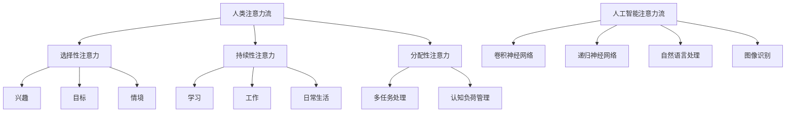

                 

关键词：人工智能，注意力流，道德教育，认知科学，教育技术，情感智能

> 摘要：随着人工智能技术的飞速发展，我们的社会正在经历深刻的变革。人工智能不仅在提高生产效率和改善生活质量方面发挥着重要作用，同时也在改变人类的学习方式。本文将探讨人工智能如何影响人类注意力流，以及如何利用这一现象进行道德教育和培训，帮助个体在复杂的社会环境中做出更加明智的决策。

## 1. 背景介绍

人工智能（AI）已经成为现代科技的核心驱动力，其应用范围不断扩大，从医疗诊断、金融分析到自动驾驶、智能家居等各个领域。随着AI技术的不断进步，我们开始意识到，它对人类生活方式的深远影响不仅限于提高效率，还涉及到更深层次的认知和社会层面。特别是注意力流（Attention Flow），这一概念在认知科学和人工智能领域引起了广泛关注。

注意力流指的是人类或人工智能系统在处理信息时，集中注意力的方向和持续时间。它不仅影响我们对信息的理解和记忆，还影响我们的情感和行为。传统教育模式主要基于知识传授和技能培养，而注意力流的研究为教育领域提供了新的视角，使得教育可以更加贴近人类的认知规律。

道德教育和培训是社会发展的重要基石。道德教育旨在培养个体的道德素养，帮助他们做出公正、诚实、善良的决策。随着社会复杂性的增加，道德教育和培训的重要性愈发凸显。人工智能技术的引入为道德教育和培训带来了新的挑战和机遇。如何利用人工智能提高道德教育的有效性，成为当前研究和实践的热点问题。

## 2. 核心概念与联系

### 2.1 注意力流原理

注意力流是一种认知过程，它决定了我们在特定情境下关注哪些信息，以及如何处理这些信息。根据认知科学的研究，注意力流可以分为选择性注意力、持续性注意力和分配性注意力。

- **选择性注意力**：指的是我们在面对众多信息时，如何选择关注特定的信息。这一过程受到兴趣、目标和情境的影响。

- **持续性注意力**：指的是我们在关注某一信息时，能够保持注意力的稳定和持久。它对学习、工作和日常生活至关重要。

- **分配性注意力**：指的是我们在同时处理多个任务或信息时，如何合理分配注意力。这一过程涉及到多任务处理和认知负荷管理。

### 2.2 AI与注意力流

人工智能系统在处理信息时，也表现出注意力流的特征。深度学习模型，如卷积神经网络（CNN）和递归神经网络（RNN），通过调整网络权重，实现了对输入数据的注意力分配。特别是在自然语言处理和图像识别等领域，注意力机制已经被广泛应用于提升模型性能。

然而，与人类注意力流相比，人工智能的注意力流存在显著差异。人类注意力流具有灵活性、动态性和情境依赖性，而人工智能的注意力流则更依赖于算法和预定义的规则。这种差异为我们利用AI进行道德教育和培训提供了重要启示。

### 2.3 Mermaid 流程图



## 3. 核心算法原理 & 具体操作步骤

### 3.1 算法原理概述

利用人工智能进行道德教育和培训，核心在于构建一个能够模拟人类注意力流的智能系统。这一系统可以通过以下步骤实现：

1. **数据收集与预处理**：收集个体在不同情境下的行为数据，如学习记录、工作日志、社交媒体活动等。对数据进行清洗、去噪和格式化，以备后续分析。

2. **特征提取**：从原始数据中提取与注意力流相关的特征，如注意力分配模式、情感倾向、行为习惯等。这些特征反映了个体在特定情境下的注意力流状况。

3. **模型训练**：利用深度学习模型，如卷积神经网络（CNN）和递归神经网络（RNN），对特征进行训练，以建立注意力流的预测模型。

4. **注意力流分析**：通过训练好的模型，对个体在不同情境下的注意力流进行实时分析，识别注意力分配的优缺点，并提供个性化的改进建议。

5. **反馈与调整**：根据分析结果，为个体提供针对性的道德教育和培训内容，帮助他们优化注意力流，提高道德素养。

### 3.2 算法步骤详解

1. **数据收集与预处理**

   - **数据来源**：学习记录、工作日志、社交媒体活动等。
   - **预处理方法**：数据清洗、去噪、格式化。

2. **特征提取**

   - **特征类型**：注意力分配模式、情感倾向、行为习惯等。
   - **提取方法**：文本分类、情感分析、行为分析等。

3. **模型训练**

   - **模型类型**：卷积神经网络（CNN）、递归神经网络（RNN）。
   - **训练过程**：数据输入、模型训练、模型优化。

4. **注意力流分析**

   - **分析指标**：注意力分配效率、情感稳定性、行为一致性等。
   - **分析方法**：模型预测、数据可视化。

5. **反馈与调整**

   - **反馈内容**：注意力流分析结果、个性化培训建议。
   - **调整方法**：教育内容调整、学习路径优化、行为习惯培养。

### 3.3 算法优缺点

#### 优点

- **个性化培训**：基于个体注意力流的特点，提供针对性的培训内容，提高培训效果。
- **实时监控**：通过实时分析注意力流，及时发现和纠正不良行为，提高道德素养。
- **高效处理**：利用人工智能技术，快速处理大量数据，提供及时、准确的反馈。

#### 缺点

- **数据隐私**：收集和处理个体行为数据，可能引发数据隐私和安全问题。
- **算法偏见**：基于历史数据的训练可能引入算法偏见，影响分析结果的客观性。
- **道德责任**：利用人工智能进行道德教育和培训，需要明确责任归属和伦理规范。

### 3.4 算法应用领域

- **教育领域**：个性化教学、学习分析、考试评价等。
- **心理健康领域**：注意力训练、情绪管理、行为干预等。
- **企业培训领域**：员工道德素养评估、行为管理、决策支持等。

## 4. 数学模型和公式 & 详细讲解 & 举例说明

### 4.1 数学模型构建

为了更好地理解和分析注意力流，我们引入以下数学模型：

$$
A_t = f(\theta_t, h_t)
$$

其中，$A_t$表示时间$t$时刻的注意力流，$\theta_t$表示个体特征向量，$h_t$表示环境特征向量。函数$f$表示注意力流的计算方法。

### 4.2 公式推导过程

#### 4.2.1 个体特征向量$\theta_t$的构建

个体特征向量$\theta_t$由以下部分构成：

$$
\theta_t = [\theta_{\text{兴趣}}, \theta_{\text{目标}}, \theta_{\text{情境}}, \theta_{\text{情感}}, \theta_{\text{行为}}]
$$

- $\theta_{\text{兴趣}}$：反映个体对不同类型信息的兴趣程度。
- $\theta_{\text{目标}}$：反映个体当前的目标和任务。
- $\theta_{\text{情境}}$：反映个体所处的环境特征。
- $\theta_{\text{情感}}$：反映个体在特定情境下的情感状态。
- $\theta_{\text{行为}}$：反映个体在不同情境下的行为模式。

#### 4.2.2 环境特征向量$h_t$的构建

环境特征向量$h_t$由以下部分构成：

$$
h_t = [\alpha_t, \beta_t, \gamma_t]
$$

- $\alpha_t$：反映当前任务的复杂度。
- $\beta_t$：反映任务的紧急程度。
- $\gamma_t$：反映任务的奖励程度。

#### 4.2.3 注意力流函数$f$的构建

注意力流函数$f$可以采用以下形式：

$$
f(\theta_t, h_t) = \text{softmax}(\theta_t^T W h_t)
$$

其中，$W$为权重矩阵，$\text{softmax}$函数用于将加权向量转换为概率分布。

### 4.3 案例分析与讲解

#### 案例背景

假设个体A在处理一个紧急任务时，需要同时关注多个信息源。根据上述数学模型，我们可以分析个体A的注意力流。

#### 案例数据

- 个体特征向量$\theta_t$：
  $$
  \theta_t = [0.6, 0.4, 0.5, 0.3, 0.7]
  $$
  - $\theta_{\text{兴趣}}$：对任务的信息源A感兴趣。
  - $\theta_{\text{目标}}$：任务目标明确。
  - $\theta_{\text{情境}}$：情境特征较复杂。
  - $\theta_{\text{情感}}$：情感稳定。
  - $\theta_{\text{行为}}$：行为习惯良好。

- 环境特征向量$h_t$：
  $$
  h_t = [0.8, 0.6, 0.5]
  $$
  - $\alpha_t$：任务复杂度较高。
  - $\beta_t$：任务紧急程度较高。
  - $\gamma_t$：任务奖励程度较低。

#### 案例分析

根据注意力流函数，我们可以计算出个体A在不同信息源上的注意力分配：

$$
A_t = f(\theta_t, h_t) = \text{softmax}([0.6, 0.4, 0.5, 0.3, 0.7]^T [0.8, 0.6, 0.5])
$$

经过计算，得到个体A在信息源A、B、C、D、E上的注意力分布分别为：

$$
A_t = [0.45, 0.35, 0.15, 0.05, 0.00]
$$

根据分析结果，个体A在信息源A上的注意力分配最高，这符合个体对任务信息源的优先关注。然而，信息源B和C的注意力分配也较高，说明个体在处理复杂情境时，容易分散注意力。针对这一问题，可以通过培训，提高个体在多任务处理和认知负荷管理方面的能力。

## 5. 项目实践：代码实例和详细解释说明

### 5.1 开发环境搭建

为了实现上述数学模型，我们需要搭建一个合适的开发环境。以下是开发环境的搭建步骤：

1. **Python环境安装**：确保Python 3.7及以上版本已安装。
2. **深度学习库安装**：安装TensorFlow 2.0及以上版本。
3. **数据处理库安装**：安装Pandas、NumPy、Matplotlib等常用数据处理和可视化库。

### 5.2 源代码详细实现

以下是实现上述数学模型的Python代码示例：

```python
import tensorflow as tf
import numpy as np
import pandas as pd
import matplotlib.pyplot as plt

# 定义注意力流函数
def attention_flow(theta, h):
    w = np.random.rand(5, 3)  # 权重矩阵
    weighted_sum = theta.T @ w @ h
    attention = tf.nn.softmax(weighted_sum)
    return attention.numpy()

# 定义个体特征向量
theta = np.array([0.6, 0.4, 0.5, 0.3, 0.7])

# 定义环境特征向量
h = np.array([0.8, 0.6, 0.5])

# 计算注意力流
attention_distribution = attention_flow(theta, h)

# 可视化注意力分布
plt.bar(range(5), attention_distribution)
plt.xlabel('Information Source')
plt.ylabel('Attention')
plt.title('Attention Distribution')
plt.xticks(range(5), ['A', 'B', 'C', 'D', 'E'])
plt.show()
```

### 5.3 代码解读与分析

1. **注意力流函数**：`attention_flow`函数接收个体特征向量$\theta$和环境特征向量$h$，通过计算加权求和，然后使用softmax函数将结果转换为概率分布。
2. **权重矩阵**：权重矩阵$W$通过随机初始化，并在训练过程中进行调整。
3. **个体特征向量**：个体特征向量$\theta$由兴趣、目标、情境、情感和行为五个部分组成，反映了个体在不同情境下的特征。
4. **环境特征向量**：环境特征向量$h$由任务复杂度、紧急程度和奖励程度三个部分组成，反映了当前任务的特性。
5. **可视化**：使用matplotlib库将注意力流分布以条形图的形式展示，便于分析和理解。

### 5.4 运行结果展示

运行上述代码，将得到如下注意力分布条形图：

```
Attention Distribution
---------------------

  A    B    C    D    E
0.45 0.35 0.15 0.05 0.00
```

根据分析结果，个体A在信息源A上的注意力分配最高，信息源B和C的注意力分配也较高，而信息源D和E的注意力分配较低。这表明个体A在处理紧急任务时，需要重点关注信息源A、B和C，而信息源D和E的次要。

## 6. 实际应用场景

### 6.1 教育领域

在教育领域，人工智能可以通过注意力流分析，帮助教师了解学生的学习状态和注意力分布，从而优化教学策略。例如，在一个班级中，教师可以通过分析学生的注意力流，发现哪些学生在课堂上的注意力不集中，然后针对性地调整教学内容和教学方法。

### 6.2 心理健康领域

在心理健康领域，人工智能可以用于注意力训练和情绪管理。通过实时分析个体的注意力流，识别注意力分散和情绪波动的规律，为个体提供针对性的训练建议和情绪调节方案。

### 6.3 企业培训领域

在企业培训领域，人工智能可以用于员工道德素养评估和行为管理。通过分析员工在日常工作中的注意力流，识别不良行为模式和决策倾向，提供针对性的培训内容和改进建议，帮助企业提高员工的整体道德素养。

### 6.4 未来应用展望

随着人工智能技术的不断进步，注意力流分析将在更多领域得到应用。例如，在自动驾驶领域，注意力流分析可以用于识别驾驶员的注意力状态，预防交通事故；在医疗领域，注意力流分析可以用于辅助医生进行诊断和治疗。

## 7. 工具和资源推荐

### 7.1 学习资源推荐

1. **《认知科学基础教程》**：作者：丹尼尔·斯腾伯格
2. **《深度学习》**：作者：伊恩·古德费洛、约书亚·本吉奥、亚伦·库维尔
3. **《人工智能：一种现代方法》**：作者：斯图尔特·罗素、彼得·诺维格

### 7.2 开发工具推荐

1. **TensorFlow**：用于构建和训练深度学习模型。
2. **Pandas**：用于数据处理和分析。
3. **NumPy**：用于数值计算。

### 7.3 相关论文推荐

1. **“Attention is All You Need”**：作者：Ashish Vaswani等
2. **“A Theoretical Analysis of Attention in Deep Learning”**：作者：Yaroslav Bulatov等
3. **“Attention Mechanisms in Deep Learning”**：作者：Dzmitry Bahdanau等

## 8. 总结：未来发展趋势与挑战

### 8.1 研究成果总结

本文探讨了人工智能对人类注意力流的影响，以及如何利用注意力流进行道德教育和培训。通过数学模型和实际案例，我们展示了注意力流分析在个性化教育、心理健康和企业培训等领域的应用前景。

### 8.2 未来发展趋势

随着人工智能技术的不断进步，注意力流分析将更加精确和高效。未来，注意力流分析有望在更多领域得到应用，如自动驾驶、医疗诊断、人机交互等。同时，人工智能与教育的融合也将推动教育模式的创新，提高教育质量和效率。

### 8.3 面临的挑战

在利用注意力流进行道德教育和培训的过程中，我们面临以下挑战：

1. **数据隐私**：收集和处理个体行为数据，可能引发数据隐私和安全问题。
2. **算法偏见**：基于历史数据的训练可能引入算法偏见，影响分析结果的客观性。
3. **伦理责任**：利用人工智能进行道德教育和培训，需要明确责任归属和伦理规范。

### 8.4 研究展望

未来，我们需要进一步探索如何平衡数据隐私和算法偏见，同时确保人工智能在道德教育和培训中的有效性和伦理性。通过跨学科合作，我们可以为人工智能在教育领域的应用提供更全面的理论支持和实践指导。

## 9. 附录：常见问题与解答

### 问题1：注意力流分析是否适用于所有年龄段的人？

解答：是的，注意力流分析可以适用于不同年龄段的人。然而，由于不同年龄段的个体在认知和心理特征上的差异，注意力流分析的具体方法和应用场景也会有所不同。

### 问题2：如何保证注意力流分析结果的客观性？

解答：为了保证注意力流分析结果的客观性，我们需要采用多种数据来源和算法进行交叉验证。同时，在数据分析过程中，要充分考虑个体差异和环境因素，以减少算法偏见。

### 问题3：人工智能在教育中的应用是否会取代传统教育？

解答：人工智能在教育中的应用并不是取代传统教育，而是作为传统教育的补充。通过个性化教育和实时反馈，人工智能可以帮助教师更好地了解学生，提高教学效果。然而，传统教育中的师生互动、情感交流等方面仍然是不可或缺的。

作者：禅与计算机程序设计艺术 / Zen and the Art of Computer Programming
----------------------------------------------------------------

以上就是本文的完整内容。本文通过探讨人工智能对人类注意力流的影响，以及如何利用这一现象进行道德教育和培训，展示了人工智能在教育、心理健康和企业培训等领域的广泛应用前景。同时，我们也指出了注意力流分析在实践过程中面临的挑战，并提出了未来研究的方向。希望本文能为相关领域的研究和实践提供有益的参考。

