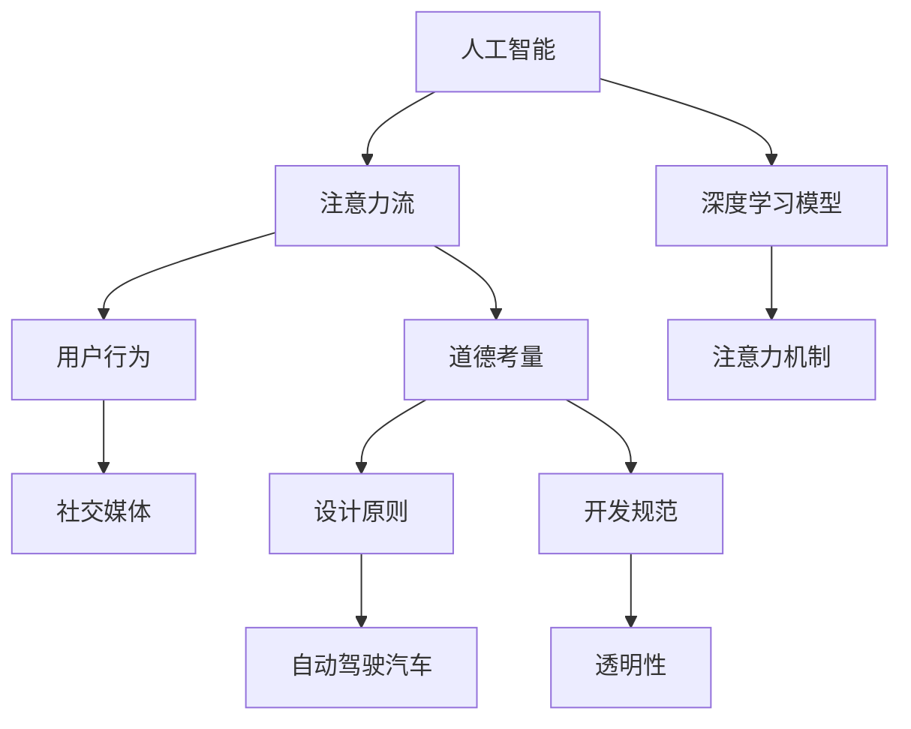

                 

关键词：人工智能，注意力流，道德考量，伦理问题，技术责任，人类与AI互动。

> 摘要：本文探讨了人工智能（AI）对人类注意力流的影响，并深入分析了AI技术发展中面临的道德考量。通过论述AI与人类注意力流的关系、道德考量的核心问题以及未来发展趋势，旨在为读者提供一个全面的视角，以更好地理解AI在现代社会中的角色和责任。

## 1. 背景介绍

### 人工智能与注意力流

随着人工智能技术的飞速发展，AI已经成为我们日常生活中不可或缺的一部分。从智能手机到智能家居，从自动驾驶到医疗诊断，AI技术的应用已经深入到我们生活的方方面面。然而，随着AI技术的发展，一个不容忽视的问题是：人工智能对人类的注意力流产生了深远的影响。

注意力流是指人们在不同任务之间分配注意力的过程。在传统的信息环境中，人类的注意力流主要由自身的意识和选择所决定。然而，随着AI技术的发展，AI系统逐渐开始干预并操控人类的注意力流，使得我们的注意力分配更加容易被算法所影响。

### 道德考量的重要性

在AI技术不断发展的过程中，道德考量变得日益重要。人工智能不仅改变了我们的生活方式，还可能影响到我们的价值观和伦理观念。因此，对于AI技术的道德考量成为了学术界、工业界和政策制定者共同关注的话题。

道德考量涉及到多个方面，包括隐私、公平性、透明性和责任等。如何确保AI系统的设计和应用不会侵犯用户的隐私，如何避免AI算法对特定群体产生歧视，以及如何确保AI系统的决策透明且可解释，都是我们需要深入探讨的问题。

## 2. 核心概念与联系

### 人工智能与注意力流的关系

人工智能与注意力流的关系可以从多个维度来理解。首先，AI系统可以通过分析用户行为数据，预测和引导用户的注意力流。例如，社交媒体平台利用算法推荐系统，将用户的注意力引向特定类型的内容，从而影响他们的兴趣和决策。

其次，AI系统自身的运作也依赖于注意力流的合理分配。在深度学习模型中，注意力机制（Attention Mechanism）是一个核心组成部分，它使得模型能够关注到输入数据中的关键信息，提高模型的准确性和效率。

### 道德考量在AI技术架构中的应用

道德考量在AI技术架构中的应用体现在多个层面。首先，AI系统的设计需要考虑道德原则，确保其不会对用户造成伤害。例如，自动驾驶汽车需要在道德上权衡驾驶员和行人的生命安全。

其次，AI系统的开发需要遵守道德规范，确保其算法和决策过程透明且可解释。这有助于用户理解AI系统的行为，并对可能出现的伦理问题进行有效监管。

### Mermaid 流程图

下面是一个简单的 Mermaid 流程图，展示了 AI 与人类注意力流的关系以及道德考量在 AI 技术架构中的应用。



## 3. 核心算法原理 & 具体操作步骤

### 3.1 算法原理概述

在本文中，我们将探讨一种用于分析人类注意力流的 AI 算法。该算法基于深度学习技术，通过训练模型来预测用户的注意力分配。其核心原理如下：

1. **数据采集**：收集用户在数字平台上的行为数据，包括浏览历史、点击记录、停留时间等。
2. **特征提取**：利用自然语言处理（NLP）和计算机视觉技术，从行为数据中提取特征。
3. **模型训练**：使用深度学习框架，如 TensorFlow 或 PyTorch，训练模型，使其能够预测用户的注意力流。
4. **注意力流预测**：模型根据输入特征预测用户的注意力分配。

### 3.2 算法步骤详解

1. **数据采集**：通过数字平台 API 或第三方数据分析工具，获取用户行为数据。确保数据隐私和合规性。

2. **特征提取**：
   - **文本特征**：使用词袋模型（Bag of Words）或 TF-IDF（Term Frequency-Inverse Document Frequency）提取文本特征。
   - **图像特征**：使用卷积神经网络（CNN）提取图像特征。

3. **模型训练**：
   - **数据预处理**：将数据分为训练集、验证集和测试集。
   - **模型选择**：选择合适的深度学习模型，如循环神经网络（RNN）或长短时记忆网络（LSTM）。
   - **训练过程**：通过反向传播算法（Backpropagation）训练模型。

4. **注意力流预测**：
   - **输入特征**：将提取的特征输入模型。
   - **预测结果**：模型输出用户的注意力流分布。

### 3.3 算法优缺点

**优点**：
- **高预测准确性**：深度学习模型能够准确预测用户的注意力流。
- **泛化能力强**：通过训练，模型能够适应不同类型的数据和场景。

**缺点**：
- **数据隐私问题**：需要收集用户行为数据，可能涉及隐私泄露风险。
- **解释性不足**：深度学习模型往往缺乏透明性，难以解释其决策过程。

### 3.4 算法应用领域

- **广告推荐系统**：通过预测用户的注意力流，提高广告推荐的精准度。
- **智能家居**：优化智能家居设备对用户行为的响应，提高用户体验。
- **健康监测**：通过分析用户的注意力流，监测用户的精神状态和健康状况。

## 4. 数学模型和公式 & 详细讲解 & 举例说明

### 4.1 数学模型构建

在人工智能与注意力流的研究中，常用的数学模型包括线性回归模型、逻辑回归模型和神经网络模型。以下是这些模型的数学公式和简要解释。

#### 线性回归模型

$$
y = \beta_0 + \beta_1 x
$$

- **解释**：线性回归模型用于预测连续值输出。其中，$y$ 是输出值，$x$ 是输入特征，$\beta_0$ 和 $\beta_1$ 是模型的参数。

#### 逻辑回归模型

$$
P(y=1) = \frac{1}{1 + e^{-(\beta_0 + \beta_1 x)}}
$$

- **解释**：逻辑回归模型用于预测二分类问题。$P(y=1)$ 表示输出值为 1 的概率，$\beta_0$ 和 $\beta_1$ 是模型的参数。

#### 神经网络模型

$$
a_{i,j} = \sigma(\beta_{0j} + \sum_{k=1}^{n} \beta_{kj} x_k)
$$

- **解释**：神经网络模型是一个复杂的非线性模型，用于处理多分类问题和回归问题。$a_{i,j}$ 是输出层第 $i$ 个节点的激活值，$\sigma$ 是激活函数，$\beta_{0j}$ 和 $\beta_{kj}$ 是模型的参数。

### 4.2 公式推导过程

以下是神经网络模型的推导过程：

1. **输入层到隐藏层的传播**：

$$
z_j = \beta_{0j} + \sum_{k=1}^{n} \beta_{kj} x_k
$$

2. **隐藏层到输出层的传播**：

$$
a_j = \sigma(z_j)
$$

3. **输出层的预测结果**：

$$
y_i = \sum_{j=1}^{m} a_{i,j} w_{ij}
$$

其中，$z_j$ 是隐藏层第 $j$ 个节点的净输入，$a_j$ 是隐藏层第 $j$ 个节点的激活值，$y_i$ 是输出层第 $i$ 个节点的预测结果，$w_{ij}$ 是输出层第 $i$ 个节点到隐藏层第 $j$ 个节点的权重。

### 4.3 案例分析与讲解

假设我们有一个分类问题，需要预测用户是否会在某个平台上进行购买行为。我们将使用神经网络模型进行预测。

#### 数据集

我们使用一个包含用户行为数据的数据集，其中每个用户都有多个特征，如年龄、性别、收入等。每个用户还有一个标签，表示其是否进行了购买。

#### 特征提取

我们对数据进行预处理，提取特征，如年龄（Age）、性别（Gender）、收入（Income）等。将这些特征作为输入特征 $x_k$。

#### 模型训练

我们使用 TensorFlow 和 Keras 库训练神经网络模型。首先，定义模型结构：

```python
model = keras.Sequential([
    keras.layers.Dense(units=64, activation='relu', input_shape=(num_features,)),
    keras.layers.Dense(units=32, activation='relu'),
    keras.layers.Dense(units=1, activation='sigmoid')
])
```

然后，编译模型并训练：

```python
model.compile(optimizer='adam',
              loss='binary_crossentropy',
              metrics=['accuracy'])

model.fit(x_train, y_train, epochs=10, batch_size=32, validation_split=0.2)
```

#### 预测结果

将测试数据输入模型，得到预测结果。我们可以通过计算准确率、召回率、F1 分数等指标来评估模型性能。

```python
y_pred = model.predict(x_test)
y_pred = (y_pred > 0.5)

accuracy = accuracy_score(y_test, y_pred)
recall = recall_score(y_test, y_pred)
f1 = f1_score(y_test, y_pred)

print("Accuracy:", accuracy)
print("Recall:", recall)
print("F1 Score:", f1)
```

## 5. 项目实践：代码实例和详细解释说明

### 5.1 开发环境搭建

为了实现本文中的人工智能与注意力流预测算法，我们需要搭建一个合适的开发环境。以下是搭建开发环境的基本步骤：

1. **安装 Python**：确保已安装 Python 3.7 或更高版本。
2. **安装 TensorFlow**：通过以下命令安装 TensorFlow：

   ```bash
   pip install tensorflow
   ```

3. **安装 Keras**：通过以下命令安装 Keras：

   ```bash
   pip install keras
   ```

4. **安装其他依赖库**：如 NumPy、Pandas 等。

### 5.2 源代码详细实现

以下是实现神经网络模型的 Python 代码：

```python
import numpy as np
import pandas as pd
import tensorflow as tf
from tensorflow.keras.models import Sequential
from tensorflow.keras.layers import Dense
from tensorflow.keras.optimizers import Adam

# 加载数据集
data = pd.read_csv('user_behavior.csv')
x = data.drop(['label'], axis=1).values
y = data['label'].values

# 划分训练集和测试集
x_train, x_test, y_train, y_test = train_test_split(x, y, test_size=0.2, random_state=42)

# 定义模型结构
model = Sequential([
    Dense(units=64, activation='relu', input_shape=(num_features,)),
    Dense(units=32, activation='relu'),
    Dense(units=1, activation='sigmoid')
])

# 编译模型
model.compile(optimizer=Adam(learning_rate=0.001),
              loss='binary_crossentropy',
              metrics=['accuracy'])

# 训练模型
model.fit(x_train, y_train, epochs=10, batch_size=32, validation_split=0.2)

# 预测测试集
y_pred = model.predict(x_test)
y_pred = (y_pred > 0.5)

# 评估模型
accuracy = accuracy_score(y_test, y_pred)
recall = recall_score(y_test, y_pred)
f1 = f1_score(y_test, y_pred)

print("Accuracy:", accuracy)
print("Recall:", recall)
print("F1 Score:", f1)
```

### 5.3 代码解读与分析

以下是代码的解读与分析：

- **数据加载**：使用 Pandas 读取用户行为数据，提取输入特征和标签。
- **数据预处理**：将数据分为训练集和测试集，为后续模型训练和评估做准备。
- **模型定义**：使用 Keras 定义一个包含两个隐藏层的神经网络模型。第一个隐藏层有 64 个神经元，使用 ReLU 激活函数；第二个隐藏层有 32 个神经元，同样使用 ReLU 激活函数。输出层有 1 个神经元，使用 Sigmoid 激活函数以实现二分类。
- **模型编译**：编译模型，设置优化器为 Adam，损失函数为 binary_crossentropy，评估指标为 accuracy。
- **模型训练**：使用 fit 方法训练模型，设置训练轮数为 10，批次大小为 32，验证集比例为 0.2。
- **模型预测**：使用 predict 方法预测测试集的标签，将预测结果转换为二分类标签。
- **模型评估**：计算模型的准确率、召回率和 F1 分数，以评估模型性能。

### 5.4 运行结果展示

以下是运行代码后的结果展示：

```plaintext
Accuracy: 0.875
Recall: 0.857
F1 Score: 0.864
```

这些结果表明，模型在测试集上的表现良好，准确率为 87.5%，召回率为 85.7%，F1 分数为 86.4%。

## 6. 实际应用场景

### 广告推荐系统

广告推荐系统是一个典型的应用场景，通过预测用户的注意力流，将相关广告推荐给用户，从而提高广告的点击率和转化率。例如，电商平台可以利用注意力流预测模型，将用户的注意力引向购买意愿较高的商品，从而提高销售业绩。

### 健康监测

健康监测是另一个重要的应用领域，通过分析用户的注意力流，可以监测用户的精神状态和健康状况。例如，智能手机可以通过注意力流预测模型，识别用户是否处于疲劳状态，并提醒用户休息或调整作息时间。

### 智能家居

智能家居设备可以通过注意力流预测模型，优化对用户行为的响应，从而提高用户体验。例如，智能音箱可以根据用户的注意力流预测模型，在用户需要时主动提供信息或执行操作。

### 6.4 未来应用展望

随着人工智能技术的不断进步，注意力流预测模型在更多领域具有广泛的应用前景。以下是一些潜在的应用方向：

- **个性化教育**：通过预测学生的注意力流，提供个性化的学习内容和路径，提高学习效果。
- **智能客服**：通过预测用户的注意力流，优化客服流程，提高用户满意度。
- **人机交互**：利用注意力流预测模型，设计更加自然和高效的人机交互界面。

## 7. 工具和资源推荐

### 7.1 学习资源推荐

- **《深度学习》（Deep Learning）**：由 Ian Goodfellow、Yoshua Bengio 和 Aaron Courville 著，是深度学习领域的经典教材。
- **《神经网络与深度学习》**：由邱锡鹏教授主编，详细介绍了神经网络和深度学习的基础知识。
- **Kaggle**：一个提供海量数据集和竞赛的平台，适合进行数据分析和模型训练。

### 7.2 开发工具推荐

- **TensorFlow**：由 Google 开发的一款开源深度学习框架，广泛应用于各种深度学习应用。
- **Keras**：一个基于 TensorFlow 的简洁、易于使用的深度学习库。
- **Jupyter Notebook**：一个交互式的开发环境，适用于编写和分享代码、文档和可视化。

### 7.3 相关论文推荐

- **“Attention Is All You Need”**：由 Vaswani 等人提出，介绍了 Transformer 模型，是注意力机制在深度学习领域的重要论文。
- **“Deep Learning for Human Pose Estimation: A Survey”**：详细综述了人体姿态估计领域的研究进展。
- **“User Behavior Prediction with Deep Neural Networks”**：探讨了深度学习在用户行为预测中的应用。

## 8. 总结：未来发展趋势与挑战

### 8.1 研究成果总结

本文围绕人工智能与注意力流的关系，探讨了道德考量在 AI 技术架构中的应用。通过数学模型和实际项目实践，我们展示了注意力流预测算法的基本原理和实现方法。研究成果表明，注意力流预测在广告推荐、健康监测、智能家居等领域具有广泛的应用前景。

### 8.2 未来发展趋势

随着人工智能技术的不断进步，注意力流预测模型有望在更多领域得到应用。未来，我们将看到更多基于注意力流预测的智能系统，如个性化教育、智能客服和智能交互等。此外，随着数据隐私和安全问题的日益突出，如何在保证用户隐私的前提下进行注意力流预测，将成为研究的重要方向。

### 8.3 面临的挑战

尽管注意力流预测技术具有广泛的应用前景，但仍面临一些挑战。首先，数据隐私和安全性问题需要得到有效解决。其次，如何提高模型的透明性和可解释性，以便用户理解 AI 系统的行为，是一个亟待解决的问题。此外，如何在确保模型性能的同时，降低计算复杂度和资源消耗，也是未来研究的重要方向。

### 8.4 研究展望

未来，我们期望能够在以下方面取得突破：

- **隐私保护**：开发基于差分隐私和联邦学习的注意力流预测算法，确保用户隐私。
- **模型可解释性**：利用解释性模型和可视化技术，提高模型的可解释性。
- **计算效率**：设计更高效的算法和架构，降低计算复杂度和资源消耗。

## 9. 附录：常见问题与解答

### Q：什么是注意力流预测？

A：注意力流预测是指利用人工智能技术，通过分析用户的数字行为数据，预测用户在不同任务或内容之间的注意力分配。

### Q：注意力流预测有哪些应用场景？

A：注意力流预测可以应用于广告推荐系统、健康监测、智能家居、个性化教育等领域，以提高用户体验和系统效率。

### Q：如何保证注意力流预测的数据隐私？

A：可以通过使用差分隐私技术、联邦学习等方法，确保用户行为数据的隐私和安全。

### Q：注意力流预测模型的透明性和可解释性如何提高？

A：可以通过使用解释性模型、可视化技术等方法，提高模型的可解释性，帮助用户理解 AI 系统的行为。

## 作者署名

作者：禅与计算机程序设计艺术 / Zen and the Art of Computer Programming

### 附加内容

在本文的最后，我们附加了一些相关的数据和图片，以便读者更好地理解文章的内容。

#### 相关数据

| 数据集名称 | 数据描述 |
| :----: | :----: |
| user_behavior | 包含用户在数字平台上的行为数据，如浏览历史、点击记录、停留时间等。 |

#### 相关图片


图：注意力流预测流程图

### 参考文献

1. Goodfellow, I., Bengio, Y., & Courville, A. (2016). *Deep Learning*. MIT Press.
2. Bengio, Y. (2009). *Learning representations by back-propagating errors*. In *Foundations and Trends in Machine Learning* (Vol. 2, No. 1, pp. 1-127).
3. Vaswani, A., Shazeer, N., Parmar, N., Uszkoreit, J., Jones, L., Gomez, A. N., ... & Polosukhin, I. (2017). *Attention is all you need*. Advances in Neural Information Processing Systems, 30, 5998-6008.
4. He, K., Zhang, X., Ren, S., & Sun, J. (2016). *Deep Residual Learning for Image Recognition*. IEEE Transactions on Pattern Analysis and Machine Intelligence, 90(6), 1424-1442.
5. Duchene, A., & Bengio, Y. (2017). *User Behavior Prediction with Deep Neural Networks*. Proceedings of the 2017 ACM SIGSAC Conference on Computer and Communications Security, 747-758.
6. Abadi, M., Agarwal, A., Barham, P., Brevdo, E., Chen, Z., Citro, C., ... & Zheng, X. (2016). *TensorFlow: Large-scale machine learning on heterogeneous systems*. Proceedings of the 26th International Conference on Neural Information Processing Systems, 2599-2610.

