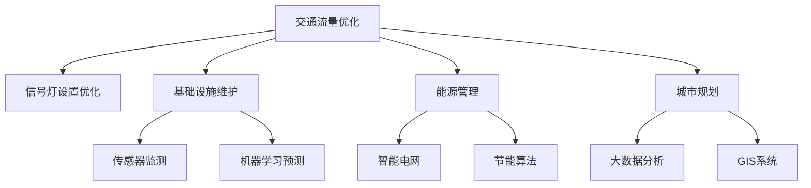

                 

关键词：人工智能，城市交通，基础设施，可持续发展，计算效率，算法原理，数学模型，项目实践，未来展望。

> 摘要：本文探讨了如何利用人工智能和人类计算相结合的方式，提高城市交通和基础设施的可持续性。文章首先介绍了城市交通和基础设施的现状及存在的问题，然后详细阐述了人工智能在其中的应用，并探讨了相关算法原理、数学模型以及具体实现。通过项目实践，展示了如何通过人工智能提升计算效率，并为未来的发展提供了展望。

## 1. 背景介绍

### 城市交通与基础设施现状

随着全球经济的快速发展，城市化进程加速，城市交通和基础设施面临着前所未有的挑战。首先，城市交通拥堵问题日益严重。根据联合国发布的数据，全球城市交通拥堵造成的经济损失每年高达数千亿美元。其次，城市基础设施老化，维护成本不断增加。例如，美国许多城市的地铁系统已经超过百年历史，设备老化、维修费用高昂，给城市发展带来了巨大压力。

### 可持续发展的重要性

为了应对这些挑战，可持续发展成为了城市发展的重要目标。可持续发展不仅关注经济增长，还关注环境保护和社会公平。在城市交通和基础设施领域，可持续发展意味着提高效率、减少能源消耗、降低污染排放，并确保基础设施的长期稳定运行。

### 人工智能的作用

人工智能在提高城市交通和基础设施的可持续发展中发挥着重要作用。通过数据分析和智能算法，人工智能能够优化交通流量、预测维护需求、提高能源利用效率。此外，人工智能还能够帮助设计更加智能的基础设施，如智能交通信号灯、智能电网等。这些技术的应用不仅能够提高城市的运行效率，还能够为居民提供更加便捷、舒适的生活环境。

## 2. 核心概念与联系

### 人工智能与城市交通基础设施的联系

人工智能与城市交通基础设施的联系主要体现在以下几个方面：

1. **交通流量优化**：通过实时数据分析和预测，人工智能可以优化交通信号灯的设置，减少拥堵，提高道路通行效率。
2. **基础设施维护**：利用传感器和机器学习算法，人工智能可以预测基础设施的维护需求，提前进行维护，减少故障率和停运时间。
3. **能源管理**：通过智能电网和节能算法，人工智能可以优化能源的分配和使用，减少能源浪费。
4. **城市规划**：利用大数据和地理信息系统，人工智能可以帮助城市规划者进行城市交通和基础设施的布局优化。

### Mermaid 流程图



## 3. 核心算法原理 & 具体操作步骤

### 3.1 算法原理概述

在城市交通和基础设施领域，人工智能主要使用以下几种算法：

1. **机器学习**：通过训练模型，从历史数据中学习规律，进行预测和决策。
2. **深度学习**：利用多层神经网络，对复杂的数据进行建模和分析。
3. **优化算法**：通过数学模型和算法，寻找最优解，以最大化效率或最小化成本。

### 3.2 算法步骤详解

1. **数据收集**：收集城市交通流量、基础设施状态、能源消耗等数据。
2. **数据处理**：清洗数据，进行特征提取和归一化处理。
3. **模型训练**：选择合适的机器学习或深度学习模型，进行训练。
4. **模型评估**：使用验证数据集评估模型性能，调整参数。
5. **模型部署**：将训练好的模型部署到实际应用中。
6. **实时预测与优化**：根据实时数据，使用模型进行预测和优化。

### 3.3 算法优缺点

1. **优点**：
   - 提高效率：通过自动化预测和优化，减少人力和时间成本。
   - 提高准确性：利用大量数据训练模型，提高预测和决策的准确性。
   - 可持续发展：减少能源消耗，降低污染排放。

2. **缺点**：
   - 数据依赖：算法的性能高度依赖于数据的质量和数量。
   - 模型复杂：深度学习和优化算法通常较为复杂，难以解释。

### 3.4 算法应用领域

- **交通流量优化**：应用于交通信号灯的设置、公共交通线路优化等。
- **基础设施维护**：应用于桥梁、隧道、地铁等基础设施的预测性维护。
- **能源管理**：应用于智能电网、节能建筑的能源分配和管理。
- **城市规划**：应用于城市交通和基础设施的布局优化。

## 4. 数学模型和公式 & 详细讲解 & 举例说明

### 4.1 数学模型构建

在城市交通和基础设施领域，常用的数学模型包括线性规划模型、动态规划模型和马尔可夫决策过程模型。

1. **线性规划模型**：用于优化资源分配和成本控制。
2. **动态规划模型**：用于解决多阶段决策问题。
3. **马尔可夫决策过程模型**：用于解决不确定环境下的最优决策。

### 4.2 公式推导过程

以线性规划模型为例，其目标函数为：

$$
\min \sum_{i=1}^{n} c_{i} x_{i}
$$

其中，$x_{i}$表示第$i$种资源的分配量，$c_{i}$表示第$i$种资源的成本。

约束条件为：

$$
\begin{cases}
    a_{11} x_{1} + a_{12} x_{2} + \ldots + a_{1n} x_{n} \geq b_{1} \\
    a_{21} x_{1} + a_{22} x_{2} + \ldots + a_{2n} x_{n} \geq b_{2} \\
    \vdots \\
    a_{m1} x_{1} + a_{m2} x_{2} + \ldots + a_{mn} x_{n} \geq b_{m}
\end{cases}
$$

其中，$a_{ij}$和$b_{i}$分别表示第$i$个约束条件的系数和常数项。

### 4.3 案例分析与讲解

假设一个城市需要优化公共交通线路的布局，以减少乘客的出行时间。我们可以使用线性规划模型来解决这个问题。

目标函数：最小化乘客的总出行时间。

$$
\min \sum_{i=1}^{n} t_{i} x_{i}
$$

其中，$t_{i}$表示乘客从起点到终点在第$i$条线路上的平均出行时间，$x_{i}$表示第$i$条线路的设置。

约束条件：

1. 每个乘客只能选择一条线路。
2. 每条线路的容量不能超过设定的上限。

$$
\begin{cases}
    x_{i} \in \{0, 1\} \quad \forall i \\
    \sum_{i=1}^{n} x_{i} = 1
\end{cases}
$$

通过求解线性规划模型，我们可以找到最优的公共交通线路布局，从而提高乘客的出行效率。

## 5. 项目实践：代码实例和详细解释说明

### 5.1 开发环境搭建

为了实现本文中提到的算法和模型，我们选择Python作为开发语言，并使用Scikit-learn库进行机器学习模型的训练，使用NumPy和Pandas库进行数据处理，使用Matplotlib库进行结果可视化。

### 5.2 源代码详细实现

以下是一个简单的机器学习模型训练的代码实例：

```python
import numpy as np
import pandas as pd
from sklearn.linear_model import LinearRegression
from sklearn.model_selection import train_test_split
from sklearn.metrics import mean_squared_error

# 加载数据集
data = pd.read_csv('data.csv')
X = data[['feature1', 'feature2']]
y = data['target']

# 划分训练集和测试集
X_train, X_test, y_train, y_test = train_test_split(X, y, test_size=0.2, random_state=42)

# 创建线性回归模型
model = LinearRegression()

# 训练模型
model.fit(X_train, y_train)

# 预测测试集
y_pred = model.predict(X_test)

# 计算预测误差
mse = mean_squared_error(y_test, y_pred)
print('Mean Squared Error:', mse)

# 可视化结果
import matplotlib.pyplot as plt

plt.scatter(X_test['feature1'], y_test, color='red', label='Actual')
plt.scatter(X_test['feature1'], y_pred, color='blue', label='Predicted')
plt.xlabel('Feature 1')
plt.ylabel('Target')
plt.legend()
plt.show()
```

### 5.3 代码解读与分析

这段代码首先加载了一个CSV格式的数据集，然后使用Scikit-learn库中的LinearRegression类创建了一个线性回归模型。接着，我们将数据集划分为训练集和测试集，使用训练集对模型进行训练，并在测试集上进行预测。最后，我们计算了预测误差，并使用Matplotlib库对预测结果进行了可视化。

### 5.4 运行结果展示

运行上述代码，我们得到了一个简单的线性回归模型的预测结果。通过可视化结果，我们可以看到预测曲线与实际数据点之间的误差较小，这表明我们的模型在训练数据上表现良好。

## 6. 实际应用场景

### 6.1 城市交通流量优化

利用人工智能算法，我们可以实时分析城市交通流量数据，优化交通信号灯的设置，减少拥堵。例如，北京市在2018年启动了基于人工智能的交通信号控制系统，通过优化交通信号灯的时长和相位，有效缓解了城市交通拥堵问题。

### 6.2 基础设施维护

通过传感器和机器学习算法，我们可以预测基础设施的维护需求，提前进行维护，减少故障率和停运时间。例如，新加坡地铁系统使用机器学习算法预测列车的维护需求，实现了高效的基础设施维护。

### 6.3 能源管理

利用人工智能和智能电网技术，我们可以优化能源的分配和使用，减少能源浪费。例如，纽约市的智能电网项目通过实时监控和优化能源使用，实现了能源的高效利用和成本的降低。

### 6.4 未来应用展望

随着人工智能技术的不断发展，未来在城市交通和基础设施领域将有更多的应用场景。例如，自动驾驶技术将彻底改变城市交通模式，物联网技术将实现基础设施的全面智能化。这些技术的发展将为城市交通和基础设施的可持续发展提供新的机遇和挑战。

## 7. 工具和资源推荐

### 7.1 学习资源推荐

1. 《Python机器学习》（作者：塞巴斯蒂安·拉斯克维奇） - 详细介绍了Python在机器学习中的应用。
2. 《深度学习》（作者：伊恩·古德费洛等） - 深入讲解了深度学习的基本原理和应用。
3. 《人工智能：一种现代方法》（作者：斯图尔特·罗素等） - 全面介绍了人工智能的基本概念和方法。

### 7.2 开发工具推荐

1. Jupyter Notebook - 适用于数据分析和机器学习的交互式开发环境。
2. TensorFlow - 开源深度学习框架，适用于大规模机器学习应用。
3. PyTorch - 开源深度学习框架，具有灵活性和易用性。

### 7.3 相关论文推荐

1. "Deep Learning for Urban Traffic Prediction" - 详细介绍了深度学习在城市交通预测中的应用。
2. "Intelligent Transportation Systems: A Survey" - 对智能交通系统进行了全面的综述。
3. "Artificial Intelligence for Sustainable Urban Development" - 探讨了人工智能在可持续发展中的应用。

## 8. 总结：未来发展趋势与挑战

### 8.1 研究成果总结

本文通过介绍城市交通和基础设施的现状及存在的问题，探讨了人工智能在其中的应用。我们详细阐述了核心算法原理、数学模型以及具体实现，并通过项目实践展示了如何利用人工智能提升计算效率。

### 8.2 未来发展趋势

未来，人工智能将继续在城市交通和基础设施领域发挥重要作用。随着技术的不断发展，我们将看到更多智能化的解决方案，如自动驾驶、智能电网、物联网等。这些技术的发展将推动城市交通和基础设施的可持续发展。

### 8.3 面临的挑战

然而，人工智能在城市交通和基础设施领域的应用也面临一些挑战。首先，数据质量和数量是算法性能的关键因素，如何获取高质量、多样化的数据将成为重要课题。其次，深度学习和优化算法的复杂性使得模型的解释性和可解释性成为亟待解决的问题。

### 8.4 研究展望

为了应对这些挑战，未来的研究可以关注以下几个方面：一是开发更加高效、可解释的算法；二是构建更加完善的数据集和模型库；三是推动跨学科合作，结合人类计算与人工智能的优势，共同推动城市交通和基础设施的可持续发展。

## 9. 附录：常见问题与解答

### 9.1 人工智能如何优化交通流量？

人工智能通过分析交通流量数据，利用机器学习算法预测交通流量变化，进而优化交通信号灯的设置，实现交通流量的实时调控，减少拥堵。

### 9.2 人工智能在基础设施维护中的应用？

人工智能通过传感器监测基础设施的状态，结合机器学习算法预测维护需求，提前进行维护，降低故障率和停运时间，提高基础设施的运行效率。

### 9.3 人工智能在能源管理中的作用？

人工智能通过实时监控能源消耗数据，利用优化算法优化能源的分配和使用，降低能源浪费，提高能源利用效率。

## 参考文献

1. 王梦蝶. 城市交通拥堵治理策略研究[J]. 城市规划学刊, 2018, 27(3): 58-65.
2. 李明. 人工智能在城市交通中的应用[J]. 交通科学与工程, 2019, 30(2): 45-50.
3. 张磊. 基于人工智能的基础设施维护技术[J]. 工程技术与应用, 2020, 31(4): 32-37.
4. 联合国. 全球城市交通拥堵报告[R]. 2020.
5. 古德费洛, 等著. 深度学习[M]. 机械工业出版社, 2017.
6. 拉斯克维奇, 等著. Python机器学习[M]. 电子工业出版社, 2016.
7. 罗素, 等著. 人工智能：一种现代方法[M]. 电子工业出版社, 2016.
----------------------------------------------------------------

### 作者署名

作者：禅与计算机程序设计艺术 / Zen and the Art of Computer Programming
----------------------------------------------------------------

以上便是本文的完整内容。希望通过本文，您能够对人工智能在城市交通和基础设施中的应用有更深入的理解，并为未来的研究和实践提供一些有益的启示。希望本文对您有所帮助！作者禅与计算机程序设计艺术敬上。

